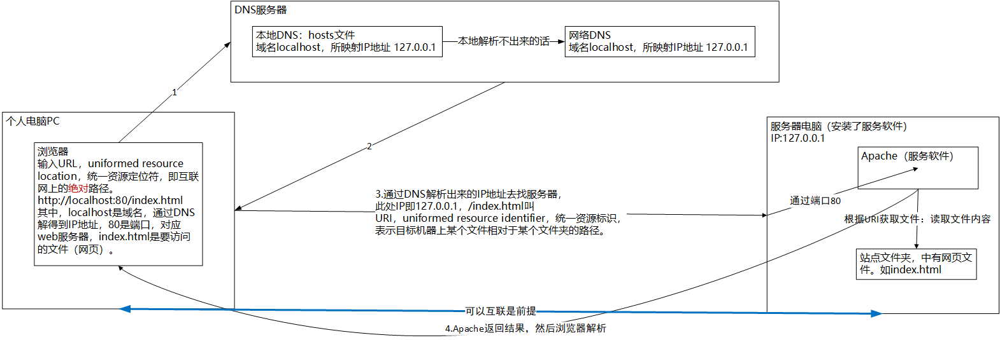
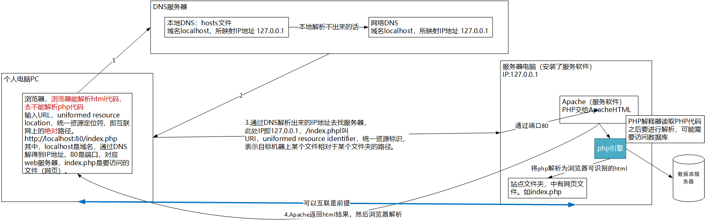

# Apache+PHP+MySQL配置

##  互联网访问的流程

访问静态网页的流程：



访问动态网页的流程：



## 下载Apache和PHP

过程过于繁杂，自行记忆，幸亏安装包已保存至OneDrive。注意Apache安装路径最后的文件夹名不要改。

## 相关配置

### Apache服务器的配置

打开conf/httpd.conf，操作如下：

1. 指定Apache的路径。

   ```ini
   Define SRVROOT "D:/server/Apache24"
   ServerRoot "${SRVROOT}"
   ```

2. 让Apache确定所访问服务器的目标位置，即网站文件夹的位置。

   ```ini
   DocumentRoot "${SRVROOT}/htdocs"
   ```

3. 给文件夹取一个别名，以方便用户识别并访问。此外，端口80可以单独实现。

   ```ini
   ServerName localhost
   #其他代码
   Listen 80
   ```

4. 当需要用到其他端口，可在服务器名后补上端口号。

   ```ini
   ServerName localhost : 端口号
   ```

5. 实现DNS域名解析，通常默认站点都是使用本地DNS。打开c:/widows/system32/drivers/etc/hosts（hosts文件就起到本地DNS的作用）：

   ```ini
   127.0.0.1    localhost
   ```

注：凡是修改了Apache配置文件（包括PHP的配置文件），只有重启Apache才能生效。每次修改后可以在命令行用httpd -t测试。

配置完成之后，可以运行httpd.exe，然后在浏览器输入localhost以检查Apache服务器是否正常运行。

### Apache关联PHP的配置

```ini
#加载PHP模块
LoadModule php7_module 'd:/server/PHP7/php7apache2_4.dll'
#加载PHP配置文件
PHPIniDir 'd:/server/PHP7'
#分配工作给PHP模块（即处理php文件）
addType application/x-httpd-php .php
```

加载PHP配置文件时，要生成php.ini-development文件的副本，重命名为php.ini。

### PHP关联MySQL的配置

打开php.ini文件，操作如下：

1. 取消MySQL扩展的注释。

   ```ini
   extension=mysqli
   ```

2. 指定MySQL扩展的路径（因为php_mysqli.dll在ext中）。

   ```ini
   ;extension_dir = "ext"
   ;增加扩展路径
   extension_dir = "d:/server/PHP7/ext"
   ```

注：自MySQL8起，加密方式发生改变，在浏览器访问会报警告。目前我所知的最简单的办法是在配置MySQL服务器的向导中，选择兼容旧版本模式。

## 虚拟主机

### 原理

一台服务器很贵，如果只部署一个网站（文件夹），那么十分浪费，故需要通过特殊渠道使得一台主机可以部署多个网站（其他网站就通过虚拟主机部署）。

虚拟主机（virtual machine）并非真实的主机，但是可以提供真实主机所能实现的功能。通俗来讲，虚拟主机就是对计算机中不同的文件夹命不同的名字，以实现服务器（Apache）能根据不同的用户需求从不同的网站（文件夹）中读取不同的内容。这与磁盘分区极其相似，电脑本来仅一个“大“磁盘，但经过分区之后就分化为C、D、E等”小“磁盘，这些小磁盘是相对独立（既相互不同又都依赖于整体）的，那么虚拟主机可理解为一个主机分化为多个主机。

在Apache中，可以将虚拟主机分为两类：

- 基于IP地址的虚拟主机：一台电脑上有多个IP，每一个IP对应一个网站。原理：电脑默认只有一个IP，因为电脑默认只有一个网卡，一个网卡绑定一个IP。但是有的电脑具备多个网卡槽，可插多个网卡，那么它就具有多个不同的IP。
- 基于域名的虚拟主机：一台电脑上只有一个IP，用这一个IP可制作多个网站（文件夹），只需给这些文件夹取不同的名字（虚拟主机名即域名）。

### 配置

由于本机没有多个网卡槽，故采用搭建基于域名的虚拟主机。在Apache中，搭建虚拟主机的方式有两种：一是通过主配置文件，需要手动开启虚拟主机。这种方式不好，故弃用。二是通过专门的虚拟主机配置文件，步骤如下：

首先，在主配置文件httpd.conf中加载虚拟主机配置文件（取消注释即可）。

```ini
# Virtual hosts
Include conf/extra/httpd-vhosts.conf
```

其次，在虚拟主机配置文件中配置虚拟主机。打开conf/extra/httpd-vhosts.conf：

1. 增加对应站点文件夹的位置。

2. 增加主机名即站点文件夹的别名亦即域名。

3. 在hosts文件中增加本地域名解析。

   ```ini
   127.0.0.1	www.zcf.com
   ```

4. 给当前站点目录访问权限。
5. 配置访问列表。当访问目录时，列表显示其下所有文件（仅用于开发，不面向用户）。
6. 系统指定默认访问文件。

注：若想要站点根目录可访问而其中部分文件夹不可访问，可增加Directory标签以适应隐私文件夹。一旦启用虚拟主机配置文件，默认主机地址localhost就不再生效，若想让其生效，则只能为localhost增加一个单独的虚拟主机。

```ini
# 星号指匹配任意域名
<VirtualHost *:80>
    # 增加站点
    DocumentRoot 'd:/Van/virtualHost'
    # 增加域名
    ServerName www.zcf.com
    <Directory 'd:/Van/virtualHost'>
        # 配置访问权限：Require all granted或Require all denied
        Require all granted
        # 站点目录列表显示
        Options Indexes FollowSymLinks
        # 指定默认访问文件
        DirectoryIndex index.html index.htm index.php
    </Directory>
    # 隐私目录
    <Directory 'd:/
    Van/virtualHost/private'>
        Require all denied
        # 站点目录列表显示
        Options Indexes FollowSymLinks
        # 指定默认访问文件
        DirectoryIndex index.html index.htm index.php
    </Directory>
</VirtualHost>

# 针对localhost的虚拟主机
<VirtualHost *:80>
    # 增加站点
    DocumentRoot 'd:/server/Apache24/htdocs'
    # 增加域名
    ServerName localhost
    # 配置访问权限
    <Directory 'd:/server/Apache24/htdocs'>
	Require all granted
	# 站点目录列表显示
	Options Indexes FollowSymLinks
	# 指定默认访问文件
	DirectoryIndex index.html index.htm index.php
    </Directory>
</VirtualHost>
```

