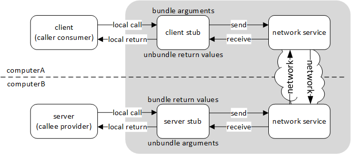

#  Dubbo

参考视频：[dubbo教程](https://www.bilibili.com/video/BV1ns411c7jV?p=1)。

## 概述

### RPC

分布式系统：计算机系统集合，协同工作使用户看起来像是一个完整的系统提供服务。

应用架构的演变：

- 单一应用架构：给多台服务器，每台服务器上部署若干完整的应用。
- 垂直应用架构：将应用拆分为多个模块，每个模块又是一个完整的应用，如用户模块、商品模块，每个服务器上部署若干模块。
- 分布式服务架构：模块之间往往有交互，于是继续进行模块的分离，包括前后端分离、三层的分离，每个服务器上部署若干业务。由此出现跨服务器调用，即远程过程调用（remote process call，RPC）。

RPC是理念不是规范，允许进程调用网络上另一台主机上的函数，同时为程序员屏蔽调用细节，即本机调用与远程调用的代码看起来没差别。RPC的效率主要是建立连接的效率与序列化反序列化的效率。

### Dubbo

[dubbo](#https://dubbo.apache.org/zh/index.html)是一个RPC框架，由阿里开发并开源。

三大核心能力：面向接口的远程方法调用；智能容错与负载均衡；服务自动注册与发现。

设计架构：


## 环境搭建

[zookeeper](https://zookeeper.apache.org/)是一种注册中心，即上图里的Registry。

安装下来直接解压。在conf目录下复制zoo_sample.cfg文件为zoo.cfg文件，修改：

```cfg
dataDir=../data
```

启动bin目录下的zkServer.cmd，端口是2181。

上图里的Monitor（监控中心）可装可不装。下载dubbo提供的[dubbo-admin](https://github.com/apache/dubbo-admin.git)项目然后用maven打jar包，运行boot项目（zookeeper已启动），访问界面（可惜Java11废弃了一些依赖包）。

```sh
# 项目根目录中
mvn clean package -DskipTests
# 可视化服务管理
java -jar .\dubbo-admin\target\dubbo-admin-0.0.1.jar
# 运行监控中心，解压dubbo-monitor-simple-2.0.0-assembly.tar.gz将所得目录拎出来，运行assembly.bin下的start.bat，配置集中于conf下的dubbo.properties文件
```

启动zookeeper与此项目可能产生端口号冲突，参考[此文](https://blog.csdn.net/weixin_38232096/article/details/107669775)修改某一方的端口号。

上图中的Consumer、Provider可用两个service层组件模拟，分属两个项目。再创一个公共依赖存放诸业务接口甚至实体类等。

导什么依赖，怎么配置、测试项目里都有，这里贴上重要的配置：

```xml
<!-- 当前服务的名称 -->
<dubbo:application name="address-provider"></dubbo:application>
<!-- 注册中心（服务器）的地址 -->
<!-- <dubbo:registry address="zookeeper://127.0.0.1:2181"></dubbo:registry> -->
<dubbo:registry protocol="zookeeper" address="127.0.0.1:2181"></dubbo:registry>
<!-- 通信（消费者远程调用提供者并返回结果）规则，包括协议与端口 -->
<dubbo:protocol name="dubbo" port="20080"></dubbo:protocol>
<!-- 暴露服务 -->
<dubbo:service interface="com.van.mall.service.AddressService" ref="addressService"></dubbo:service>
<!-- 服务的实现 -->
<bean id="addressService" class="com.van.address.service.impl.AddressServiceImpl"></bean>
<!-- 从注册中心发现监控中心地址，否则直连监控中心 -->
<dubbo:monitor protocol="registry"></dubbo:monitor>
```

```xml
<!-- 服务的名称 -->
<dubbo:application name="order-consumer"></dubbo:application>
<!-- 注册中心地址 -->
<dubbo:registry address="zookeeper://127.0.0.1:2181"></dubbo:registry>
<!-- 欲调用的远程服务（接口） -->
<dubbo:reference interface="com.van.mall.service.AddressService" id="addressService"></dubbo:reference>
<context:component-scan base-package="com.van.order.service"></context:component-scan>
<!-- 从注册中心发现监控中心地址，否则直连监控中心 -->
<dubbo:monitor protocol="registry"></dubbo:monitor>
```

详细配置参考文档。访问dubbo-admin查看效果。

springboot版代码也请自行参看项目，这里给出配置。

```properties
# the name of this service
dubbo.application.name=boot-dubbo-address
# the URL of registry
dubbo.registry.address=127.0.0.1:2181
dubbo.registry.protocol=zookeeper
# communication(remote call) rule
dubbo.protocol.name=dubbo
dubbo.protocol.port=20080
# find the monitor by registry
dubbo.monitor.address=registry
```

```java
// 开启基于注解的dubbo功能
@EnableDubbo
@SpringBootApplication
public class BootDubboAddresssApplication
    
// 暴露服务，也可在配置文件中配置
@Service
// 注册服务（的实现），再写@Service会冲突的
@Component
public class AddressServiceImpl implements AddressService
```

```properties
# the name of this service
dubbo.application.name=boot-dubbo-order
# the URL of registry
dubbo.registry.address=zookeeper://127.0.0.1:2181
# find the monitor by registry
dubbo.monitor.protocol=registry
```

```java
@EnableDubbo
@SpringBootApplication
public class BootDubboOrderApplication
```

## 配置

### 覆盖关系

多配置源按优先级从大到小为：虚拟机参数、springboot配置文件或容器配置文件、spring配置文件、dubbo公共配置文件。

最后一个是dubbo.properties，存放各服务共有的配置。

### 启动检查

启动时检查指消费者启动时就由注册中心检查提供者是否可用，否则抛异常、阻止容器启动完成。关闭检查意即消费者调用时才检查提供者是否可用，那么提供者的容器是懒加载的或早加载但通过API编程被延迟引用。

启动检查的开关由check属性控制：

```xml
<!-- 控制对某个提供者的启动检查 -->
<dubbo:reference interface="com.van.mall.service.AddressService" id="addressService" check="false"></dubbo:reference>
<!-- 控制对所有提供者的启动检查 -->
<dubbo:consumer check="false"></dubbo:consumer>
```

还有对注册中心的启动检查：

```xml
<dubbo:registry check="false"></dubbo:registry>
```

### 超时异常

consumer标签给timeout属性默认值1000ms，意即消费者在1秒内没收到结果就抛响应超时异常，避免线程长时阻塞。

timeout属性可在多处配置，优先级规则总结起来是：

- 方法级优先、接口级次之、全局再次之。
- 级别相同，则消费者优先，提供者次之。

```xml
<dubbo:reference interface="com.van.mall.service.AddressService" id="addressService" check="false">
    <!-- 具体到方法的超时规则 -->
	<dubbo:method name="initOrder" timeout="3000"></dubbo:method>
</dubbo:reference>

<dubbo:service interface="com.van.mall.service.AddressService" ref="addressService">
	<dubbo:method name="initOrder" timeout="2000"></dubbo:method>
</dubbo:service>

<!-- 对所有消费者的超时规则 -->
<dubbo:provider timeout="3000"></dubbo:provider>
```

不难列出完整情况：reference method > service method > reference > service > consumer > service。

其他属性均遵从上述优先级规则。

### 重试次数

retries属性配合timeout属性，超时抛异常不够人性化，故不报错转而多试几次，重试次不含首次。

```xml
<dubbo:reference interface="com.van.mall.service.AddressService" id="addressService" check="false" retries="3"></dubbo:reference>
```

当某个提供者出现超时，重试就可能挑另一个提供者。修改protocol标签的port属性，掌握IDE的多窗口测试，模拟多个提供者，附带讲服务名就不是唯一的，一个服务名可对应多个端口号不同的服务。

删改查方法属幂等操作，即调用一次与重试多次是等效的，而插入方法属非幂等操作，不能由于消费者的等不及而重试-重复插入，故retries属性只能施加于幂等操作上。

### 多版本

利用version属性实现灰度发布，即让消费者选择调用接口实现的旧版本或新版本。

那么应在提供者这里另创建一个实现类充当另一版本，并修改两方配置。

```xml
<dubbo:reference interface="com.van.mall.service.AddressService" id="addressService" check="false" version="1.0.0"></dubbo:reference>

<dubbo:service interface="com.van.mall.service.AddressService" ref="addressService" version="1.0.0"></dubbo:service>
<bean id="addressService" class="com.van.address.service.impl.AddressServiceImpl"></bean>
<!-- 新版服务 -->
<dubbo:service interface="com.van.mall.service.AddressService" ref="addressServiceNew" version="2.0.0"></dubbo:service>
<!-- 新版服务实现 -->
<bean id="addressServiceNew" class="com.van.address.service.impl.AddressServiceImplNew"></bean>
```

若不指定version属性，则随机选版本。

### 本地存根

为被调用接口做静态代理，在消费者这边不直接注入远程实现对象及调用其方法，而注入代理对象，间接调用，目的是扩充一些逻辑，如参数校验。一般代理类定义在公共接口跟前，因作依赖的一部分导入消费者可叫做本地存根。

```java
/**
 * 本地存根
 */
public class AddressServiceStub implements AddressService {
	private final AddressService addressService;

	/**
	 * 必备
	 * 
	 * @param addressService 自动传入远程实现类的代理对象
	 */
	public AddressServiceStub(AddressService addressService) {
		super();
		this.addressService = addressService;
	}

	@Override
	public List<Address> getAddresses(String userId) {
		if (StringUtils.isEmpty(userId)) {
			return null;
		}
		return addressService.getAddresses(userId);
	}
}
```

```xml
<dubbo:reference interface="com.van.mall.service.AddressService" id="addressService" check="false" version="1.0.0" stub="com.van.mall.service.impl.AddressServiceStub"></dubbo:reference>
```

### boot配置

有三种整合dubbo的方式：

- 用@Service暴露服务，用@Reference调用服务，前述属性归这俩注解所有；编写application.properties。

- 回顾boot中学的@ImportResource，保留xml文件，用此注解引入。

- 注解API，即将文件里的所有配置项等价转为配置类。

以提供者为例，做第三种：

```java
@Configuration
public class DubboConfig {
	/**
	 * 透过返回值名称知看配置项
	 * 
	 * @return
	 */
	@Bean
	public ApplicationConfig applicationConfig() {
		ApplicationConfig applicationConfig = new ApplicationConfig();
		applicationConfig.setName("boot-dubbo-order");
		return applicationConfig;
	}

	@Bean
	public RegistryConfig registryConfig() {
		RegistryConfig registryConfig = new RegistryConfig();
		registryConfig.setProtocol("zookeeper");
		registryConfig.setAddress("127.0.0.1");
		registryConfig.setPort(2181);
		return registryConfig;
	}

	@Bean
	public ProtocolConfig protocolConfig() {
		ProtocolConfig protocolConfig = new ProtocolConfig();
		protocolConfig.setName("dubbo");
		protocolConfig.setPort(20880);
		return protocolConfig;
	}

	/**
	 * @param addressServiceImpl 自动注入，先得扫描进容器
	 * @return
	 */
	@Bean
	public ServiceConfig<AddressService> serviceConfig(AddressServiceImpl addressServiceImpl) {
		ServiceConfig<AddressService> serviceConfig = new ServiceConfig<>();
		serviceConfig.setInterface(AddressService.class);
		serviceConfig.setRef(addressServiceImpl);
		MethodConfig methodConfig = new MethodConfig();
		methodConfig.setName("initOrder");
		methodConfig.setTimeout(1000);
		serviceConfig.setMethods(Collections.singletonList(methodConfig));
		return serviceConfig;
	}

	@Bean
	public MonitorConfig monitorConfig() {
		MonitorConfig monitorConfig = new MonitorConfig();
		monitorConfig.setProtocol("registry");
		return monitorConfig;
	}
}

// 注册服务，还是得用dubbo提供的@Service
@Service
public class AddressServiceImpl implements AddressService

// @EnableDubbo和这个都行，后者就标在前者头上
@DubboComponentScan(basePackages = "com.van.address.service.impl")
public class BootDubboAddresssApplication
```

## 高可用

### 概述

高可用简单来说就是在分布式系统中尽可能减少不能提供服务的时间。不能提供服务原因不外乎提供者宕机、注册中心宕机。

### 直连

即使全部注册中心宕掉，消费者仍能调用提供者，因为本地缓存了后者的地址信息，注册中心就是收集、分发这些信息的，宕掉并不影响远程调用的过程。

直连就是干脆绕过注册中心，手动指定提供者的地址，直接连接并调用。

给reference标签或注解添加url属性，关掉zookeeper服务端，便产生直连。两项目傻傻一直重连zookeeper。

### 负载均衡

有了提供者集群就一定有负载均衡，按一定的策略为消费者的当前调用选择最合适的服务器。有如下策略：

- random load balance：基于权重的随机负载均衡。权重产生概率分布，不能确定当前请求落给哪个服务器，只能确定累积到一定数量的请求满足所设计的分布。
- roundrobin load balance：既考虑轮询又考虑权重，故当前请求落给哪个服务器是可预测的。
- least active loadbalance：选择上一次响应时间最短的服务器。
- consistent hash load balance：指定指标算哈希值，比如为调方法所携带的实参，只要实参一致哈希值就一致，服务器就一致。

默认策略请参看dubbo依赖下的LoadBalance接口，其头上SPI注解的值是`RandomLoadBalance.NAME`，该类继承自AbstractLoadBalance类，其四个子类对应上述四个策略，它们的NAME属性值作reference标签或注解的loadbalance的值。

权重是可以自行设计的，体现于service标签或注解的weight属性，不过一般在dubbo-admin中动态设计。

### 服务降级

一个服务器可能承载多个服务，当服务器压力剧增（流量巨大），对针对非关键服务或出错服务的调用请求临时改变处理策略，从而释放服务器资源、保证核心业务的高效运作。

像这样临时改变（或叫覆盖）处理策略就是服务降级，有几种覆盖规则：

- 屏蔽：不发起对指定方法（提供者）的远程调用，直接在消费者一端返回null。
- 容错：当远程调用失败（提供者逻辑有误、超时等），处理掉异常，返回null。

一般在dubbo-admin上动态设置屏蔽和容错。

### 集群容错

对同种服务的多提供者（服务器），调用失败，有多种容错模式：

- failover cluster：失效自动重试、切换服务器，但重试得越多延迟也就越久。通常用于读操作。
- failfast cluster：失败即抛异常。通常用于非幂等操作。
- failsafe cluster：失败时捕获异常但不进一步处理。通常用于写审计日志。
- fallback cluster：失败时后台记录失败请求，定时重试。通常用于消息通知等要求成功的操作。
- forking cluster：并行调用多个服务器。通常用于实时性要求高的操作，但浪费资源。
- broadcast cluster：逐一调用所有提供者，任意一个报错就报错。通常用于通知所有提供者更新缓存。

集群容错模式的配置见于service、reference标签、注解的cluster属性，但它不够强大，实际开发中一般整合hystrix。

导入依赖，打EnableHystrix注解。关于容错处理，两端都得做，因为提供者抛异常消费者也会跟着抛，具体参考项目。

## 原理

### RPC流程



文字描述如下：

1. 消费者（客户端）以本地存根调用服务。
2. 本地存根将方法签名等调用信息组装成准备在网络上传输的消息体。
3. 本地存根找到提供者地址，将消息发给服务端。
4. 提供者的本地存根解析消息。
5. 本地存根根据解析结果调用本地服务。
6. 本地服务执行目标方法并将结果返回给本地存根。
7. 本地存根将返回值组装成消息体，将消息发回给客户端。
8. 消费者的本地存根解析消息。
9. 消费者接收到最终返回值。

那么RPC框架就是将2-8步封装起来，让这些细节对程序员透明。

computerA与computerB的网络通信是由Netty框架支持的，它可视作上图中的network service部件。

### 框架设计

自行阅读官方提供的图：


### 标签解析

解析XML标签的类的总接口是BeanDefinitionParser，负责解析dubbo标签的为其实现类DubboBeanDefinitionParser，关注解析方法parse，体内调用重载的parse方法，传入Class属性beanClass，此属性是本类实例化时从外面传进来的。在后者体内，对Class参数beanClass进行判断，判断其对应类别是否为ProtocolConfig、ServiceBean、ProviderConfig等。追溯beanClass，得看DubboNamespaceHandler类的init方法，体内调用一堆registerBeanDefinitionParser方法，即在扫描时为特定标签创建特定DubboBeanDefinitionParser对象，如针对application标签传入ApplicationConfig的Class实例。

回到parse方法体，主要任务就是类似[boot配置](#boot配置)的第三种，将dubbo标签里的属性值填入xxxConfig、xxxBean对象中。

### 服务暴露

服务暴露主要和service标签相关，于是点进ServiceBean类，它实现了InitializingBean、`ApplicationListener<ContextRefreshedEvent>`接口，说明在本类实例化之后及容器刷新完毕之后均有所作为。先进入afterPropertiesSet方法，注意到调用setProvider、setApplication、setRegistries、setMonitor、setProtocols等方法，即将服务、通信规则等信息保存进本对象，然后是export方法，往下层层调用doExport、doExportUrls方法，可见暴露服务本质就是暴露URL给注册中心。此方法体内，一个for循环表明可做基于dubbo以外的多种协议的暴露，点进doExportUrlsFor1Protocol方法。ProxyFactory属性调用getInvoker方法，返回Invoker对象，它包装了提供接口的Class实例及其实现对象及URL对象（内含方法的注册地址-服务器地址、path-全限定方法名、parameters-参数映射等属性），再包装一次传入Protocol类的export方法得到Exporter对象。进入此方法由RegistryProtocol类覆盖的方法体，调用doLocalExport方法，传入包装对象。体内调用DubboProtocol类重写的export方法。体内调用openServer方法，传入URL对象。体内调用createServer方法，渐渐就来到Nettry的API了。回到RegistryProtocol覆盖的export方法，后面用ProviderConsumerRegTable类调用registerProvider方法。体内，若映射属性providerInvokers中不含当前方法的全限定名，则添加一个键值对，全限定明作键，空包装对象集合作值（目标方法可有多种实现，分布于多个实现类-服务器）。最后调用register方法向注册中心注册，传入注册地址。

### 服务引用

引用是调用的准备，服务引用主要和reference相关，于是点进ReferenceBean类，它实现了FactoryBean接口，于是看它重写的getObject方法，调用父类定义的get方法并返回。后者体内调用init方法，返回ref属性，泛型类型会具体化为目标接口。体内调用createProxy方法，传入一个映射，它封装了注册中心地址、方法名、目标接口等信息，返回值赋给ref属性。此方法体内，若URL列表属性urls长度为1，则Protocol类型的refprotocol属性调用refer方法，传入目标接口的Class实例及唯一的URL元素，得到Invoker对象赋给invoker属性，否则遍历urls，对每个封装了不同注册地址的URL元素，调用refer方法，传入目标接口的Class实例及当前URL元素，得到Invoker对象并添加进Invoker列表对象invokers，最后ProxyFactory属性调用getProxy方法，传入invoker属性得到目标接口的代理对象。来到RegistryProtocol重写的refer方法，调用doRefer方法并作返回。体内，根据目标接口的Class实例与URL对象创建RegistryDirectory对象directory，后面用它调用subscribe方法，即向注册中心订阅目标方法，最后Cluster对象调用join方法得到Invoker对象并作返回，顺带地ProviderConsumerRegTable调用registerConsumer方法。再来到DubboProtocol重写的refer方法，工作是连接netty客户端，自getClients方法层层深入发现也趋近netty API。

联系这两节。有netty服务端并netty客户端，才能进行网络通信，为高效的调用做准备。一个Invoker对象就对应一台服务器上的一个提供方法，封装一个实现类的代理对象。

### 服务调用


消费者这边注入的目标接口属性引用的是一个代理对象，那么执行目标方法其实是执行InvokerInvocationHandler类实现的invoke方法。体内用Invoker属性调用invoke方法，传入一个临时创建的RpcInvocation对象，后者构造器传入的是Method对象与对象数组，即方法信息与众实参。进入MockClusterInvoker类重写的invoke方法，invoker属性引用对象的类型默认是FailoverClusterInvoker，它调用invoke方法，继续传入RpcInvocation对象。来到AbstractClusterInvoker重写的invoke方法，调用list方法根据Invocation对象得到Invoker列表，对应众提供方法，而后据此列表得到指定的负载均衡策略，最后调用doInvoke方法，传入Invocation对象、Invoker列表、LoadBalance对象。来到FailoverClusterInvoker类重写的doInvoke方法，调用select方法根据指定策略得到Invoker对象即确定了到底执行哪个服务器上的哪个实现类下的方法，它调用invoke方法，传入Invocation对象，底层有mock、cache相关过滤器的介入。进行到DubboInvoker重写的doInvoke方法，注意到从ExchangeClient列表属性中获取一个元素，用它调用request方法，传入Invocation对象与时间阈值，底层便涉及netty的通信，返回的Result对象封装了提供方法的返回值，层层返回。
