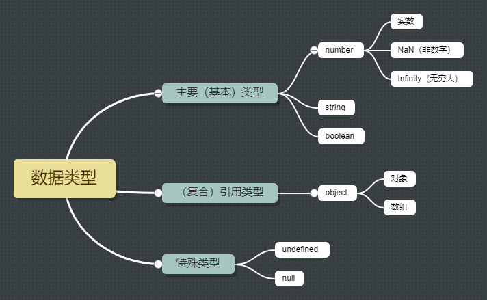
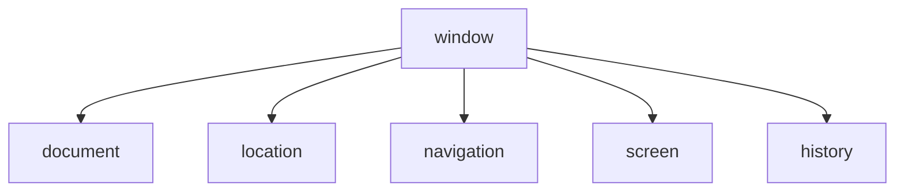

# JavaScript

参考视频：

- [JavaScript基础语法](https://www.bilibili.com/video/BV1Sy4y1C7ha?p=201&spm_id_from=pageDriver)。
- [深入浅出Javascript](https://www.bilibili.com/video/BV1Ft411N7R3)。

好多兼容性问题及其解决没有记录。

## 概述

### 概念

JavaScript是运行在浏览器上的脚本语言，简称js，由网景公司的布兰登·艾奇开发。最初名曰LiveScript，因公司与Sun公司合作而改名。发明js的主要目的是支持网景公司的navigator浏览器的动态交互，从而占据更大市场。

JS让单纯的静态页面具有交互性，让浏览器更加生动。

JS基础的学习内容分三大块：ECMAScript（语法）、DOM、BOM。

### 辨析

JS和java没有任何的关系，只是语法有相似之处。运行位置不同：java（的.class字节码文件）运行在jvm中；JS运行在浏览器里。

java不是脚本语言。

区分JSP和JS：jsp（JavaServer Pages）隶属于java，运行于JVM。

## ECMAScript

### 嵌入

在html文件中嵌入JS代码有三种方式。

#### 事件注册

```html
<input type="button" value="click me" onclick="window.alert('Hello JavaScript!');">
```

注：js是一门事件驱动型的编程语言。js中有很多事件，每一个事件对应一个事件句柄，事件句柄是以html元素属性的形式存在的。譬如有个事件叫click，那么冠以on就得到事件句柄onclick。刚打开页面时回调函数的那部分js代码不会执行，而是被注册到各类事件中，等到某一事件被用户触发，相应的回调函数就会被浏览器调用。此外，js中单双引号皆可用，但同类引号不能嵌套。

##### 脚本块

```HTML
<script>
	window.alert("Hello World!");
    alert('What a cute panda!');
</script>
```

注：调用内置对象window的方法时window可省略；alert方法弹出的窗口会阻塞页面访问；作为脚本语言，js的脚本块在源文件中的位置任意，出现次数也任意。

##### 外部链接

```html
<script type="text/javascript" src="index.js"></script>
```

注：一旦引入外部js文件，脚本块里的代码就无法执行，故不要在脚本块里写代码。但是后续脚本块是起作用的。

### 数据类型

#### 类型



NaN是用非数字变量参与数值运算或函数所得不正常结果的类型。JS在整型上的精确度是16位，超出则四舍五入，故必要时应将整型转字符串。

Infinity是做除法时除数为0所得结果的类型。

undefined既是类型也是唯一值。

若非布尔类型的值出现在if语句、三元表达式等地方，程序会自动调用Boolean函数对其进行转化：带否定含义的值的类型变为false，反之变为true。

```js
// false 下述以外的都带肯定含义 最简单验证方法是用Boolean(其他类型)
null
undefined
'' // 空字符串
0
-0
NaN // 无效数字
false

/* 但是写明==或===符号的话就没有自动转换的效果了 */ 
if (23.3 == true)
    // 不打印
    console.log(1)
// false
console.log({} == true); // 自动转换的话{}会转为true 提一下python里空字典{}自动转为false
```

null既是类型也是唯一值，但`typeof null`得到的是object。

null与undefined值等类型不等。用`==`（仅比值）比较这两个值得true，用`===`（比值且比类型）比较这两个值得false。也有`!==`。

typeof运算符可获取变量的类型，结果为类型名称字符串。

```js
numAdd = function (a, b) {
    // typeof运算符
    if (typeof a == "number" && typeof b == "number") {
        return a + b;
    }
    else {
        alert("必须输入数字!");
    }
}
```

在浏览器的控制台中，我们可通过输出文字的颜色判断其属于何种类型：

- 黑色-string。
- 深蓝色-number。
- 浅蓝色-boolean。
- 灰色-特殊类型。


#### 转换

常见的转换有三种：

- 向string类型转换。
- 向number类型转换。
- 向boolean类型转换。

```js
// 向string类型转换
var num = 10;
var str = num.toString();
str = String(num);
str = num + "";

// 向number类型转换
var ageStr = "18";
var age = parseInt(ageStr);
var pureNum = parseInt("120px");
var pi = parseFloat("3.1415926");
var num = Number("123456");
num = "12" - 0;
num = "12" / 3;
num = "2" * 3;

// 向boolean类型转换
var flag = Boolean(100);
flag = Boolean(" ");
flag = Boolean(null);
```

### 变量

#### 弱类型

编译器变量类型可变。由于类型可变，故声明关键字仅一个，声明格式：`var a;`可赋值也可不赋值，若不赋值，则值为undefined。不能既不冠以var又不赋值，会报错：

```js
var a;
b = 100;
// 报错 c is not defined
c; 
```

后来我试了一种诡异的既不冠以var又不赋值的声明，发现不报错：

```js
function callback(res) {
    console.log(typeof res);
}
// 打印 undefined
callback()
// 报错 res is not defined
console.log(res);
```

特殊形态：

```js
var a = b = c = 1;
// 相当于下面三行 b和c都是全局变量
var a = 1;
b = 1;
c = 1;

var a = 1, b = 1, c = 1;
// 相当于下面三行 a、b、c都是局部变量
var a = 1;
var b = 1;
var c = 1;
```

#### 全局变量

定义：函数体外声明的变量叫全局变量。

生命周期：随浏览器打开而开辟内存空间，随浏览器关闭而销毁内存空间。

作用域：js代码的任意位置。

尤其注意，当对一个变量声明时没有用var，即使是在函数体内赋的值，它都是全局变量。而且若在函数体内按此方式声明变量，其后又加上var声明了同名变量，则此变量的全局性就会失效，外部无法访问它。

```js
function fun() {
    fire = '火';
    boom = 100;
    var boom = 200;
    document.write(boom); // 200
}
fun();
document.write(fire); // 打印：火
document.write(boom); // 报错：boom is not defined
```

#### 局部变量

定义：函数体内声明的变量叫局部变量（包括形式参数）。

生命周期：随函数执行开始而开辟内存空间，随函数执行结束而释放内存空间。

作用域：函数体内。同名时，局部变量覆盖全局变量。

<span id="scope">作用域链机制</span>：

```js
// 作用域链-就近原则，由内而外
var num = 10;
function fn() {
    var num = 20;
    function fun() {
        console.log(num); // 输出20
    }
}
fun(); 
```

#### 注

值得注意的是，除了函数的代码块，js的代码块（包括for、if语句等的代码块）都没有像java等语言那样严格的作用域限制，即js<span id="blockDomain">没有块级作用域</span>。比如下面这个例子：

```js
for (var i = 0; i < 3; i++) {
    console.log("内部：", i);
}
console.log("外部：", i);

// 输出
内部： 0
内部： 1
内部： 2
外部： 3
```

可见得在外部仍能访问循环变量i。

再来看看普通代码块：

```js
{
    var name = "Van"
}
console.log(name) // 输出Van
```

ES6语法中的<span id="let">let</span>关键字解决了这一问题。针对for循环，它不但严格划分了变量作用范围，而且划分了循环的每一轮的作用域（子作用域）。参考下面这个例子：

```html
<!DOCTYPE html>
<html lang="en">

<head>
    <meta charset="UTF-8">
    <meta name="viewport" content="width=device-width, initial-scale=1.0">
    <title>let划分for循环的子作用域</title>
</head>

<body>
    <div>
        <button>1</button>
        <button>2</button>
        <button>3</button>
        <button>4</button>
        <button>5</button>
    </div>
</body>
<script>
    var btns = document.getElementsByTagName("button")
    for (let i = 0; i < btns.length; i++) {
        // addEventListener可以注册多个回调函数，而on则不行，只会覆盖
        btns[i].addEventListener("click", function () {
            console.log("第" + (i + 1) + "个按钮被单击")
        })
    }
</script>

</html>
```

结合作用域链机制理解下述代码中的匿名回调函数：匿名函数中的i不是局部变量，其值取for循环（外层函数）中的i值。那么当被调用时，i就会被修改为自增到底的值，所以点击按钮后打印的值就总是`btns.length+1`。

```js
for (var i = 0; i < btns.length; i++) {
    btns[i].addEventListener("click", function () {
        console.log("第" + (i + 1) + "个按钮被单击")
    })
}
```

### 函数

#### 定义与调用

```js
// 函数定义
function sayHello() {
    alert("Hello!");
}
// 匿名函数，sayBye是变量名
sayBye = function () {
    alert("Bye!");
}
// 函数调用
sayHello();
sayBye();

// 由于JS是弱类型语言，形参与实参可以不匹配
function say(a) {
    console.log(a);
}
say2(1, 2)
```

#### 函数名唯一

JS中没有函数的重载。虽然按自己的理解，重载的关键是参数列表不同，对JS来说存在参数个数不同的情况，但现实是在JS中写重名函数的话后面的会覆盖前面的。

```js
// 没有重载，后面覆盖前面
function fun(a, b) {
    return a + b;
}
function fun(a, b, c) {
    return a + b + c;
}
```

#### arguments

当我们不确定函数传入多少参数的时候，可以用arguments来承载。arguments是函数的一个内置对象，此对象中存储传递进来的所有实参。

```js
// 形参不写
function fn() {
    // Arguments(3)
    console.log(arguments);
    // 3
    console.log(arguments.length);
    // 2
    console.log(arguments[1]);
}
fn(1, 2, 3);
```

arguments对象是一个伪数组：

- 有length属性。
- 按照索引方式存储元素。
- 无数组的专属方法如pop、push等。

### 预解析与执行

JS引擎或解释器运行js文件分两步：预解析和执行。重点关注一下预解析。

预解析：

- 变量预解析：把当前作用域里的所有变量声明提到最前面，不提赋值。如：

  ```js
  // undefined
  console.log(num);
  var num = 100;
  // 相当于执行
  var num;
  console.log(num);
  num = 100;
  ```

- 函数预解析：把当前作用域里的所有函数定义提到最前面，不提赋值（更不提调用）。如：

  ```js
  // 报错 fun is not a function
  fun();
  var fun = function () {
      console.log(100);
  }
  // 相当于执行
  var fun;
  fun(); // 还没定义就执行了
  fun = function () {
      console.log(100);
  }
  
  // 不报错
  fun();
  function fun() {
      console.log(100);
  }
  // 相当于执行
  function fun() {
      console.log(100);
  }
  fun();
  ```

通过预解析可以看出，js文件的执行顺序本质上并不一定按源代码各行的排列顺序，但变量和函数的提前是按照源代码对应行顺序的。再看几个更让人大开眼界的例子：

```js
// 输出 undefined
var num = 10;
fun();
function fun() {
    console.log(num);
    var num = 20;
}
// 相当于执行
var num;
function fun() {
    var num;
    console.log(num);
    num = 20;
}
fun();

// 输出undefined 9
var a = 18;
f1();
function f1() {
    var b = 9;
    console.log(a);
    console.log(b);
    var a = "123";
}
// 相当于执行
var a;
function f1() {
    var b;
    var a;
    b = 9;
    console.log(a);
    console.log(b);
    a = "123";
}
a = 18;
f1();

f1();
console.log(c);
console.log(b);
console.log(a);
function f1() {
    var a = b = c = 9;
    console.log(a);
    console.log(b);
    console.log(c);
}
// 相当于执行
function f1() {
    var a = 9; // 局部变量
    b = 9; // 全局变量
    c = 9; // 全局变量
    console.log(a); // 9
    console.log(b); // 9
    console.log(c); // 9
}
f1();
console.log(c); // 9
console.log(b); // 9
console.log(a); // undefined
```

如果我们用函数表达式（匿名函数）的方式声明函数，那么调用一定要写在声明的后面。

### 类

注：这里的叫法并不规范，因为JS从ES6开始才引入类的概念，为了好理解，姑且也叫类。

#### 定义和使用

```js
// 类定义
Product = function (pid, pname, price) {
    this['pid'] = pid;
    this['pname'] = pname;
    this['price'] = price;
}
// 类定义的另一种方式
function Student(id, name, age, gender) { // 类名首字母大写；而普通函数名首字母小写
    this.id = id;
    this.name = name;
    this.age = age;
    this.gender = gender;
    this.getId = function () { // 匿名函数
        return this.id;
    }
}

// 通过类的prototype属性给它扩展属性和方法，但仅能扩展实例方法
Student.prototype.info = function () {
    return "id: " + this.id + "&ensp;" + "name: " + this.name + "&ensp;" + "age: " + this.age + "&ensp;" + "gender: " + this.gender;
}
// 甚至可以给内置类扩展。此处也是实例方法，故须通过字符串调用
String.prototype.myExt = function () {
    return "这是我给String加的扩展方法";
}
// 此处是扩展静态方法，无需借助prototype属性
Student.common = function() {
    return "human being";
}

var student = new Student(1, 'Van', 22, '男'); // 通过new方式
document.write(student.info());
var person = { // 通过键值对方式
  firstName: "Bill",
  lastName : "Gates",
  id       : 678,
  fullName : function() { // 添加实例方法
  	return this.firstName + " " + this.lastName;
  }
};
var student = new Student(1, "Thomas", 22, "man"); 
for (var field in student) { // 遍历对象的属性（很少用来遍历方法）
    document.write(field + "<br/>");
    document.write(typeof field); // String
    document.write(student[field]); // 依键取值
}

document.write("String".myExt()); // 用类名String调用实例方法无效
```

可以注意到：

- 类的构造函数和类体融合了，这也是弱类型的表现。构造函数的一大作用也就是将共同的属性和方法抽象出来，再封装到函数（类）里面。构造函数无需显式定义return语句就可返回对象。
- 访问类属性（类比java的field）必须用到this，突出当前对象。
- 类的prototype属性支配其他属性和方法。
- 一个对象可以映射为一个数组，那么就可以通过中括号取下标来访问属性，字符串型的属性名充当下标。

#### 对象创建

承接上文，可以用new关键字和键值对集合创建对象：

```js
var obj = new Object();
obj.name = "Van";
obj.age = 18;
obj.sex = "man";
obj.sayHello = function() {
    console.log("Hello");
}

// 字面量
var person = {firstName:"Bill", lastName:"Gates", age:62, eyeColor:"blue"};
```

注意：json对象里键的类型只能是字符串，js对象里键的类型任意。

用new关键字创建对象的过程：

1. 开始执行构造函数，在内存中创建一块空的对象。
2. this引用刚刚创建的对象。
3. 执行构造函数里的代码，给此空对象添加属性和实例方法。
4. 隐式返回此对象。

### 内置对象

#### 概述

js里的对象分三类：

- 自定义对象。
- 内置对象。
- 浏览器对象。

前两种对象虽是js的基础内容，但从属于ECMAScript。第三种对象为js所独有，在后面的JS API中会谈到。

内置对象是js自带的类和对象，供开发者使用，并提供一些常用的、基本的、必要的功能（属性和方法）。最大的优点就是帮助我们快速开发。js提供了多种内置对象如：Math、Date、Array、String。

关于内置对象，我们应会熟练地查阅文档MDN或W3C，尤其是MDN。

火狐开发者网络（MDN）提供了开放网络（Open Web）技术的信息，包括html、css等应用的api。

#### Math

关于本类中诸方法的使用可参考MDN。

下面着重模拟实现自己的数学对象及一些好玩的方法。

```js
var MyMath = {
    PI: 3.1415926535,
    max: function () {
        if (arguments.length === 0) {
            return -Infinity;
        }
        var max = arguments[0];
        for (var i = 0; i < arguments.length; i++) {
            if (typeof arguments[i] !== "number") {
                return NaN;
            }
            if (max < arguments[i]) {
                max = arguments[i];
            }
        }
        return max;
    },
    min: function () {
        var min = arguments[0];
        for (var i = 0; i < arguments.length; i++) {
            if (min > arguments[i]) {
                min = argument[i];
            }
        }
        return min;
    }
}
console.log(MyMath.PI);
console.log(MyMath.max(-1, 0, 1, 2, 3));
console.log(MyMath.max());
console.log(MyMath.max(1, 2, "0"));
console.log(MyMath.min(1, 2, 3));
```

```js
/**
 * @description: 获取两个整数之间（闭区间）的随机整数
 * @param {number} min 最小值
 * @param {number} max 最大值
 * @return {number} 随机整数
 */
function getRandom(min, max) {
    return Math.floor(Math.random() * (max - min + 1)) + min;
}
console.log(getRandom(8, 22));
```

#### Date

本对象用到构造函数，要通过new关键字创建。

```js
var now = new Date(); // 默认返回当前时间，如Tue Mar 09 2021 16:57:20 GMT+0800 (中国标准时间)
var date1 = new Date(2019, 10, 1); // 会有问题，月份加1
var date2 = new Date("2019-10-1 8:8:8");
```

常用的日期格式化方法诸如getFullYear、getMonth、getDate、getDay、getHours、getMinutes、getSeconds等。例如：

```js
var week = ["星期天", "星期一", "星期二", "星期三", "星期四", "星期五", "星期六"];
console.log(now.getFullYear() + "年" + (now.getMonth() + 1) + "月" + now.getDate() + "日 " + week[now.getDay()] + " " + ((now.getHours() < 10 ? "0" : "") + now.getHours()) + ":" + ((now.getMinutes() < 10 ? "0" : "") + now.getMinutes()) + ":" + ((now.getSeconds() < 10 ? "0" : "") + now.getSeconds()));
```

时间戳方法：

```js
// 下面两种写法都可
var now = new Date();
var timestamp = now.valueOf();
timestamp = now.getTime();
// 下面这种写法更常用
timestamp = +new Date();
// 更简单的写法-静态方法
Date.now()
```

倒计时案例：

```js
/**
 * @description: 倒计时
 * @param {string} time 结束时间
 * @return {string} 剩余时间
 */
function countDown(time) {
    var now = +new Date();
    var des = +new Date(time);
    var gap = (des - now) / 1000;
    var days = parseInt(gap / (3600 * 24));
    days = (days < 10 ? "0" : "") + days;
    var hours = parseInt(gap / 3600 % 24);
    hours = (hours < 10 ? "0" : "") + hours;
    var minutes = parseInt(gap / 60 % 60);
    minutes = (minutes < 10 ? "0" : "") + minutes;
    var seconds = parseInt(gap % 60);
    seconds = (seconds < 10 ? "0" : "") + seconds;
    return days + "天" + hours + "时" + minutes + "分" + seconds + "秒";
}
console.log(countDown("2021-3-9 22:00:00"));
```

### 数组

`typeof arr`得到的是object因为数组本质上是对象。

JS里的数组可自动扩容，不存在越界的问题。

```js
// 对象创建
var arr1 = new Array(2); // 两个元素的空数组
var arr2 = new Array(3, 4, 5); // [3, 4, 5]

// 字面量创建 数组各个元素类型可任意
var arr = [true, null, "shit", 1, 2, undefined];
arr[7] = 25; // 动态扩容

// 检测变量是否为数组（引用数组对象）
var arr = [1, 2, 3];
console.log(arr instanceof Array); // 判断此对象是否为数组类Array的实例
console.log(Array.isArray(arr)); // 内置判断方法

// 遍历数组
for (var i = 0; i < arr.length; i++) { 
    document.write(arr[i] + "<br/>");
}
```

用for-in语句遍历对象时循环变量存放对象的属性，故属性个数决定迭代次数；而用它遍历数组时循环变量存放元素的下标，故元素个数决定迭代次数，不建议用for-in遍历数组。

关于添加元素，参考文档。理解push()和unshift()，分别是从后面和前面添加元素，返回本数组的新长度，本数组发生变化。

关于删除元素，参考文档。理解pop()和shift()，分别从后面和前面删除元素，返回被删除的元素，本数组发生变化。

关于排序，参考文档，着重理解reverse()、sort()，原数组都会改变。例如：

```js
var arr = [1, 2, 3, 4, 5];
arr.reverse();
arr.sort(function (a, b) {
    return a - b; // 升序
});
```

返回元素索引，找不到的话返回-1：

```js
var colors = ["red", "blue", "green", "blue"];
console.log(colors.indexOf("blue")); // 1 从前往后找第一个目标元素
console.log(colors.lastIndexOf("blue")); // 3 从后往前找第一个目标元素
```

数组去重案例：

```js
/**
 * @description: 查找数组中是否含有指定元素
 * @param {object} array 被查数组
 * @param {number} element 目标元素
 * @return {boolean} true or false
 */
function hasElement(array, element) {
    for (var i = 0; i < array.length; i++) {
        if (array[i] === element) {
            return true;
        }
    }
    return false;
}
/**
 * @description: 数组去重
 * @param {object} oldArray 旧数组 
 * @return {object} 新数组
 */
function unique(oldArray) {
    if (!oldArray instanceof Array) {
        console.log("输入对象必须是数组");
        return;
    }
    var newArray = new Array();
    for (var i = 0; i < oldArray.length; i++) {
        if (!hasElement(newArray, oldArray[i])) {
            newArray.push(oldArray[i]);
        }
    }
    return newArray;
}
var oldArray = ["c", "a", "z", "a", "x", "a", "x", "c", "b"];
console.log(unique(oldArray));
```

更简单地，借助实例方法indexOf实现：

```js
/**
 * @description: 数组去重
 * @param {object} oldArray 旧数组 
 * @return {object} 新数组
 */
function unique(oldArray) {
    if (!oldArray instanceof Array) {
        console.log("输入对象必须是数组");
        return;
    }
    var newArray = new Array();
    for (var i = 0; i < oldArray.length; i++) {
        if (newArray.indexOf(oldArray[i]) === -1) {
            newArray.push(oldArray[i]);
        }
    }
    return newArray;
}
var oldArray = ["c", "a", "z", "a", "x", "a", "x", "c", "b"];
console.log(unique(oldArray));
```

将数组转换为字符串，关注下面两个方法：

```js
var arr = [1, 2, 3];
console.log(arr.toString() === "1,2,3");
console.log(arr.join("-"));
```

除上面提到的方法之外，还有一些值得关注的方法：concat()、slice()、splice()。

### 基本包装类型

先看看下面这几个例子：

```js
var arr = [1, 2, 3];
console.log(typeof arr); // object
var person = { name: "Bob", age: 22 };
console.log(typeof person); // object
var str = "fly";
console.log(str.length); // 3
console.log(typeof str); // string
```

可见得数组及任何对象的类型都是object。再看第6、7行，虽然str的类型是字符串，但它看似也具备了对象的属性，这如何解释呢？

由此引出基本包装类型，即把简单数据类型包装成复杂数据类型。就比如上面例子里的第6行，实质str会经历如下过程：

```js
var temp = new String("fly");
str = temp;
temp = null;
// 然后str就有了属性（和方法）
```

但接着当typeof运算符作用其上时，它又被拆包，回到原类型。

### 字符串

#### 不可变性

```js
var str = "home";
str = "school";
```

分析上段代码：str相当于一个引用，可指向（引用）不同的对象（内存空间），比如这里从开始指向`"home"`到后来指向`"school"`，可看出变量引用的可变性。而字符串对象的不可变性在于`"home"`和`"school"`所属内存空间存的东西是不可改变的。

由于不可变性，我们不要高频率拼接字符串，这会新开辟大量的内存空间。

字符串相关的所有方法都不修改当前字符串（对象），而是开辟新空间，返回新的字符串（对象）。

#### 应用

indexOf方法：

```js
var str = "12321";
console.log(str.indexOf("1")); // 0 从前往后找第一个目标字符（串）
console.log(str.indexOf("1", 1)); // 4 从索引1的位置往后找第一个目标字符（串）
```

求字符出现的位置和次数案例：

```js
/**
 * @description: 统计字符在字符串中出现的位置和次数
 * @param {string} str 被查字符串
 * @param {string} target 目标字符
 * @return {object} 位置和次数
 */
function indicesAndTimes(str, target) {
    if (target.length !== 1) {
        return "只能查找字符";
    }
    var wrapper = { indices: [], times: 0 };
    var indices = [];
    var times = 0;
    var index = str.indexOf(target);
    while (index !== -1) {
        indices.push(index);
        times++;
        index = str.indexOf(target, index + 1);
    }
    wrapper.indices = indices;
    wrapper.times = times;
    return wrapper;
}
var str = "oabcoefoxyozzopp";
console.log(indicesAndTimes(str, "o"));
```

charAt、charAtCode方法和str[index]切片操作：

```js
console.log("Beijing".charAt(2));
console.log("carnaval".charCodeAt(1));
console.log("fly"[0]);
```

查找字符串中出现次数最高的字符及其次数案例：

```js
/**
 * @description: 查找字符串中出现次数最多的字符
 * @param {string} str 字符串
 * @return {object} 次数及字符
 */
function maxFreqeunce(str) {
    // 生成所有字符及其次数
    var frequency = {}
    for (var i = 0; i < str.length; i++) {
        if (frequency[str[i]]) {
            frequency[str[i]]++;
        } else {
            frequency[str[i]] = 1;
        }
    }
    // 找次数最多的字符及其次数
    var target = "";
    var times = 0;
    for (var char in frequency) {
        if (times < frequency[char]) {
            times = frequency[char];
            target = char;
        }
    }
    return {
        target: target,
        times: times
    };
}
var str = "oabcoefoxyozzopp";
console.log(maxFreqeunce(str));
```

关注concat、substr、replace、split、toUpperCase、toLowerCase等方法。

### 类型比较

前面对这两种类型都有所介绍，现在从内存分配和参数传递对它们进行理解。

#### 基本辨析

简单类型又叫基本数据类型或值类型，复杂类型又叫引用类型。

- 值类型变量的内存空间存储的是值本身。值类型包括：string、number、boolean、undefined、null（可是`typeof null`的结果是object，这其实是人为的疏漏，一直没改）。
- 引用类型的变量的内存空间存储的是地址。new关键字创建的对象、Object、Array、Date等的对象都属于引用数据类型。如果我们尚不知某变量存储（引用）哪个对象，就可暂设为为null。

#### 内存分配

栈：由操作系统自动分配与释放。一般存放函数的参数、局部变量等，都属简单数据类型。

堆：一般由程序员分配与释放，或者由垃圾回收机制控制。堆中存放的都属于复杂数据类型。

#### 参数传递

对于简单类型，实参把值赋给形参，然后它们的关系就割裂了，函数内部对形参的修改不会导致外部实参值的变化。如：

```js
function add(num) {
    num++;
    console.log(num); // 1
}

var num = 0;
add(num);
console.log(num); // 0
```

对于复杂类型，实参把对象的地址赋给形参，那么它们就都有权修改对象状态。如：

```js
function ageAdd(human) {
    human.age++;
    console.log(human); // {name: "Tom", sex: "man", age: 19}
}
var person = { name: "Tom", sex: "man", age: 18 };
ageAdd(person);
console.log(person); // {name: "Tom", sex: "man", age: 19}
```

但是在函数内部形参引用目标的变化并不会影响外部变量的引用。如：

```js
function swap(human1, human2) {
    var temp = human1;
    human1 = human2;
    human2 = temp;
    console.log(human1); // {name: "Bob", sex: "man", age: 22}
    console.log(human2); // {name: "Tom", sex: "man", age: 18}
}
var person1 = { name: "Tom", sex: "man", age: 18 };
var person2 = { name: "Bob", sex: "man", age: 22 };
swap(person1, person2);
console.log(person1); // {name: "Tom", sex: "man", age: 18}
console.log(person2); // {name: "Bob", sex: "man", age: 22}
```

从上述例子可知，与Java相同，JS遵循值传递机制，赋值或传参给予的都是所存的内容，不管这个内容是值还是址。址传递给予的是自己的地址。

## Web APIs

### 概述

前面学的ECMAScript标准规定的基础语法并不能实现网页上的交互效果，这要靠web api来实现。

Web APIs阶段有如下要点：

- Web APIs是W3C组织的标准。
- 我们主要学习Web APIs中的DOM和BOM。
- Web APIs是我们js独有的部分。

API（application program interface-应用程序接口）是一类预定义好的函数，作用是为应用程序或开发人员提供基于某软件或硬件的一组类（对象）或函数。我们不用访问源码及理解内部实现细节。

Web API是浏览器提供的一套操控浏览器功能和页面元素的API，具体包括DOM和BOM。想了解Web API的详细内容可参考[MDN](https://developer.mozilla.org/zh-CN/docs/Web/API)。

我们要用到的Web API主要是方法或函数。

### DOM

#### 概述

document object model-文档对象模型，是一种树形结构，其上节点与html文档中的元素一一对应。它主要用来操作页面中的元素。

它是W3C组织推荐的处理可扩展标记语言（html或xml）的标准编程接口。从这一层理解的话它又是一个函数库或类库。

W3C已经为我们定义了一系列的dom接口，通过这些接口我们可以方便地改变网页的内容、结构和样式。

#### dom树

这里有一个[实例](https://www.w3school.com.cn/htmldom/index.asp)。

一些术语：

- 文档：一个页面就是一个文档，在dom中用document对象表示。
- 元素：页面中的所有标签都是元素，在dom中用element对象表示。
- 节点：网页（文档）中的所有内容（标签、属性、注释、标签包含的文本）都可视作节点，在dom中用node对象表示。

文档、元素、节点其实都是对象，所以才叫文档对象模型。

#### 获取元素

通过以下几种媒介获取元素：

- id值。
- 标签名。
- html5新增的方法。
- 特殊元素有另外的专门方法。

```js
var timer = document.getElementById("time"); // 找不到返回null
console.log(timer);
console.log(typeof timer); // object
console.dir(time); // 详细打印，罗列出属性和方法
```

getElementsByTagName方法返回指定标签名对象的集合。

```js
var lis = document.getElementsByTagName("li");
console.log(lis); // 伪数组
console.log(lis[1]);
for (var i = 0; i < lis.length; i++) {
    console.dir(lis[i]);
}
// 深层获取
var uls = document.getElementsByTagName("ul");
var lis = uls[0].getElementsByTagName("li");
console.log(lis);
// 更常用的深层获取
var ol = document.getElementById("ol");
var lis = ol.getElementsByTagName("li");
console.log(lis);
```

getElementsByClassName、querySelector等方法是html5新增的。

```js
// 返回元素对象集合
var boxes = document.getElementsByClassName("box");
console.log(boxes);
// 根据指定选择器返回第一个元素对象
var firstBox = document.querySelector(".box");
var nav = document.querySelector("#nav");
var firstLi = document.querySelector("li");
// 根据指定选择器返回所有元素对象
var boxes = document.querySelectorAll(".box");
var lis = document.querySelectorAll("li");
// 增强写法
var li = document.querySelector("nav ul li:first-child");
```

对于body和html等特殊元素，有专门的的方法获取它们。

```js
var body = document.body;
var html = document.documentElement;
```

#### 事件基础

事件是js能侦测到的某些行为，比如鼠标单击、鼠标悬浮、输入框激活等。逻辑：事件的发生触发回调函数的执行，也可以叫触发-响应机制。只有当基于某对象的某事件发生，绑定到该对象的该事件的回调函数才会执行。

事件的三要素：

- 事件源：被绑定及调用回调函数的元素对象，比如一个按钮。
- 事件类型：该对象上发生的事件，比如鼠标点击（onclick、click）。
- 事件处理程序：回调函数。

事件注册：事件注册与事件绑定一个意思，就是将带回调函数的某事件注册（绑定）到某元素上。

```html
<!-- 第一种注册方式：将sayHello函数注册到按钮上，待用户启动click事件，浏览器就调用它，sayHello函数因而被称为回调函数 -->
<input id="myBtn" type="button" value="Hello" onclick="sayHello();">
<input type="button" value="Bye" onclick="sayBye();">
```

```js
/*
 * 第二种注册方式：
 * 	1.获取按钮对象
 *  2.给对象的onclick属性赋值
 */
var btnObj = document.getElementById("myBtn"); // 只能用id
// onclick是事件，sayHello是此事件对应（发生后执行）的回调函数
btnObj.onclick = sayHello; // 右边不加小括号，加小括号就是立即执行
// 匿名函数充当回调函数
btnObj.onclick = function () {
    alert("this is a anonymous function.");
}
```

用方式二时应考虑js代码和html代码的执行顺序。若脚本块写在对象标签（html代码）前面，则所获取对象为null，因为页面元素尚未加载出来，可借助load事件（页面所有元素加载完毕）来解决。

```html
<!-- 在script标签或在外部js文件中定义ready函数 -->
<body onload="ready()">
```

抑或是：

```js
window.onload = function (){};
```

关于所有事件对象可参考[HTML DOM Event 对象](https://www.w3school.com.cn/jsref/dom_obj_event.asp)。

#### 操作元素

可利用dom修改元素的内容。下面是通过元素的innerHTML属性和innerText属性修改元素内容。

```js
window.onload = function () {
    document.getElementById("innerHTML").innerHTML = "<b>innerHTML可解析html和转义符<b/>";
    document.getElementById("innerText").innerText = "<b>innerText只解析出纯文本<b/>";
}
```

修改元素的属性。比如：

```js
var img = document.querySelector("img");
console.log(img.src);
img.src = "images/dog.png";
img.title = "狗狗";
```

```js
var btn = document.querySelector("btn");
var input = document.querySelector("input");
btn.onclick = function (){
    input.value = "按钮被单击了";
    // this指向回调函数所属对象，即事件源
    this.disabled = true;
}
```

修改元素的样式属性。比如：

```js
var div = document.getElementById("div");
div.style.backgroundColor = "pink";
```

通过style属性实现的样式修改相当于生成行内样式`<div style="background-color:pink;" id="div">`，故css权重比较高。

通过元素的className属性批量修改其样式。比如：

```css
.box {
    width: 200px;
    height: 200px;
    background-color: skyblue;
}
```

```js
var div = document.querySelector("div");
div.className = "box";
```

对className赋的值会覆盖元素之前的类名，参考[Element.classList](https://developer.mozilla.org/zh-CN/docs/Web/API/Element/classList)以了解更灵活的类名操作。

对于元素的自定义属性，就要引入新的获取和修改方法-getAttribute和setAttribute。它和点操作符的不同之处有：

- 它能随时获取或修改自定义的属性。而点操作符要先设属性才能取值（一般不推荐用于自定义属性），例如：

  ```js
  var modal = document.querySelector(".modal");
  // 设置新属性
  modal.index = 1;
  // 获取新属性的值
  console.log(modal.index);
  ```

- innerHTML、innerText等属性只能由点操作符操作。

下面是一些例子：

```js
var index = div.getAttribute("index");
div.setAttribute("score", 100);
div.setAttribute("class", "footer");
```

移除自定义属性用removeAttribute方法：

```js
div.removeAttribute("index");
```

为了让开发人员更清晰明了地看出某属性是自定义属性，H5引入了自定义属性的新规范`data-`，如`<div data-index="1"></div>`。此外，H5也提供了新的获取方式，形如`div.dataset.index`或`div.dataset["index"]`。

看一些用例：

```js
div.setAttribute("data-time", 20);
div.getAttribute("data-index");
```

```html
<div data-list-name="lemon" id="div">
    boring...
</div>
<script>
	var div = document.getElementById("div");
    console.log(div.dataset.listName);
    console.log(div.dataset["listName"]);
</script>
```

#### 操作节点

结合dom树和元素节点的机制，对于复杂嵌套关系里的标签（元素），我们又有新的方法来获取。

一般地，节点至少有nodeType、nodeName、nodeValue这三个基本属性。

nodeType的值：

- 1：元素节点。
- 2：属性节点。
- 3：文本节点（包括文字、换行、空格等）。

实际开发中主要用元素节点。

关于各种嵌套关系里的元素节点详见[HTML DOM  Element对象 属性和方法](https://www.w3school.com.cn/jsref/dom_obj_all.asp)。

关于父子节点。`ol.children`是获取所有子元素节点的非官方用法。另外`ol.children[0]`相当于`ol.firstElementChild`，`ol.children[ol.children.length - 1]`相当于`ol.lastElementChild`，前者兼容性较好。

关于兄弟节点，值得注意的有nextElementSibling、previousElementSibling。

创建并添加节点的方法：

```js
var li = docuemnt.createElement("li");
var ul = document.querySelector("ul");
// 两种
ul.appendChild(li);
ul.insertBefore(document.createElment("li"), ul.children[0]);
```

补充新方法[insertAdjacentHTML](developer.mozilla.org/zh-CN/docs/Web/API/Element/insertAdjacentHTML)和[insertAdjacentText](https://developer.mozilla.org/zh-CN/docs/Web/API/Element/insertAdjacentText)。

删除节点：

```js
var ul = document.querySelector("ul");
// 返回被删除的子节点
ul.removeChild(ul.children[2]);
// 删除节点自身
ul.remove()
```

关于复制节点，使用cloneNode方法。分浅拷贝和深拷贝：括号里是空或false的是浅拷贝，只拷贝标签不拷贝标签里的内容；括号里是true的是深拷贝，既拷贝标签又拷贝内容。

```js
var li = document.querySelector("ul").children[0];
// 先克隆
li.cloneNode(true);
// 再添加
ul.appendChild(li);
```

#### 其他

有三种创建元素的方式：

```js
document.write()
element.innerHTML
document.createElement()
```

第一种方式的缺点是在文档加载完毕条件下，先破后立，重新加载解析渲染。

用第二种方式加字符串拼接运算形成大量元素的效率会很低，而用第三种方式形成大量元素的效率高很多，用第二种方式加数组的push和join方法形成大量元素的效率是最高的。

#### 事件进阶

##### 注册事件

给元素的某个事件属性赋上回调函数叫注册事件或绑定事件。有两种方式：传统方式和方法监听方式。

前者的事件属性都是以on开头，缺点是针对同一事件，后面的回调函数会覆盖前面的回调函数。

后者符合w3c标准，也是w3c的推荐方式。其特点就是可以为同一个事件赋上多个回调函数（监听器）且依次执行。[HTML DOM 事件监听器](w3school.com.cn/js/js_htmldom_eventlistener.asp)对此方法有详细解读。举例如下：

```js
button.addEventListener("click", function() {
    alert("hello!");
});
button.addEventListener("click", function() {
    alert("hello again!");
});
```

传统解绑方式举例：

```js
button.onclick = function() {
    console.log("hello");
    // 简单直接
    button.onclick = null;
}
```

同样地，方法监听方式也能解绑：

```js
// 就不能用匿名函数了
function fn() {
    console.log("hello");
    // 指定待移除回调函数的名称。注意跟注册一样，也不能加小括号
    button.removeEventListener("click", fn);
}
button.addEventListener("click", fn);
```

##### dom事件流

事件发生时会在元素节点之间按特定的顺序传播，这个传播过程叫事件流。dom事件流包括三个阶段：

1. 捕获阶段（由网景提出）：从页面根节点逐级往下到目标元素传播。
2. 当前目标阶段：执行回调函数。
3. 冒泡阶段（由IE提出）：从目标元素逐级往上到根节点传播。

js对捕获阶段和冒泡阶段进行了综合。

注意：

- onclick和attachEvent只能得到冒泡阶段。
- js只能进行捕获阶段或冒泡阶段的其中之一。
- 两种事件注册方式都默认只支持冒泡阶段。
- 实际开发中，我们很少使用捕获，而更关注冒泡（自下而上）。
- 有些事件是不服从冒泡的，如onblur、onfocus、onmouseenter、onmouseleave。

```js
/* 捕获 */
var son = document.querySelector(".son");
// true-捕获阶段，事件传播顺序：document->html->body->.fahter->.son
son.addEventListener("click", function () {
    alert("I am son");
}, true);
var father = document.querySelector(".father");
// 既然父盒子也注册了单击事件，那么单击子盒子时，父盒子的回调函数会先执行
father.addEventListener("click", function () {
    alert("I am father");
}, true);
```

```js
/* 冒泡 */
var son = document.querySelector(".son");
// 不写第三个参数或写false-冒泡阶段，事件传播顺序：.son->.father->body->html->document
son.addEventListener("click", function () {
    alert("I am son");
});
var father = document.querySelector(".father");
// 既然父盒子也注册了单击事件，那么单击子盒子时，父盒子的回调函数会随子盒子回调函数执行之后执行
father.addEventListener("click", function () {
    alert("I am father");
});
```

##### 事件对象

回调函数定义处可以写一个形参（名字可随意，一般写作e、event、evt等），这个参数就是一个事件对象。这个形参对应的实参由JS给定。别忘了用非匿名函数注册事件时无论如何都不加小括号，只需函数名。

事件对象存放事件相关信息-一批属性和方法。

关于事件对象的详细解读可参见[HTML DOM Event对象](https://www.w3school.com.cn/htmldom/dom_obj_event.asp)。我们只需掌握一些常见的属性和方法，下面依次来看。

target属性、this引用、currentTarget属性。下面是个例子：

```js
div.addEventListener("click", function (event) {
    // 查看哪个元素被点击
    console.log(event.target);
});
```

this指向事件源，即被注册事件的元素亦即回调函数所属对象，而`e.target`指向触发事件的元素，即冒泡机制传播链上的起始元素。`e.currentTarget`指向事件源。示例如下：

```js
var ul = document.querySelector("ul");
ul.onclick = function (e) {
    // <ul>...</ul> 
    console.log(this); // 联系后面的知识，想使用this的话就千万别用箭头函数
    console.log(e.currentTarget) // 显然事件的注册对象和触发对象是同一个对象的话，currentTarget和target值才相同。另外e.currentTarget和this等价，所以若特别想用箭头函数就别用this，改用e.currentTarget
    // <li>1</li>
    console.log(e.target);
}
```

获取事件类型：`e.type`，得到的值是一个字符串。

阻止默认行为：比如使得链接不跳转、表单不提交等等。例子：

```js
a.addEventListener("click", function(e) {
   e.preventDefault(); 
});
myForm.addEventListener("submit", function (e) {
    e.preventDefault()
    // 多句嘴：点击按钮提交表单的说辞不够严谨，触发提交事件的不是按钮对象而是表单对象，只需抠住触发的是提交事件而不是点击事件
    console.log("form target", e.target);
})
```

阻止冒泡行为。例子如下：

```js
var son = document.querySelector(".son");
son.addEventListener("click", function (e) {
    alert("I am son");
    // 标准写法
    e.stopPropagation();
});
var father = document.querySelector(".father");
father.addEventListener("click", function () {
    alert("I am father");
});
```

事件委托。问题引入：给大量子节点单独注册事件，那么程序运行起来效率会很低。改进：不给子节点单独设定事件监听器，而是给父节点设定，然后利用冒泡原理让事件作用在每个子节点上。这样一来就只操作了一次dom，程序性能会大大提高。

```js
var ul = document.querySelector("ul");
ul.onclick = function (e) {
    alert("第" + e.target.getAttribute("index") + "个li被点击");
}
```

联系上一节，不服从冒泡会使得事件源和触发对象一致。有例为证：

```html
<body>
    <ul>
        <li>111111111</li>
        <li>222222222</li>
        <li>333333333</li>
    </ul>
</body>
<script>
    const ul = document.querySelector("ul")
    ul.addEventListener("mouseenter", (e) => {
        // 都打印ul元素
        console.log(e.target);
        console.log(e.currentTarget);
    })
</script>
```

##### 鼠标事件

详细鼠标事件归纳还是去参看上面提到的链接。注意：区分click和mousedown，click是按下加弹起，而mousedown不包括弹起。此外不按下鼠标和按下后弹起都是mouseup。

禁止右键菜单、禁止选中文字等用例此处省略，比较少见。

event对象保存事件的状态，鼠标事件对象的常用属性有：

- clientX：光标相对于浏览器窗口可视区的x坐标。
- clientY：光标相对于浏览器窗口可视区的y坐标。
- pageX：光标相对于文档页面的x坐标。
- pageY：光标相对于文档页面的y坐标。
- screenX：光标相对于电脑屏幕的x坐标。
- screenY：光标相对于电脑屏幕的y坐标。

以上属性值都是不带单位的数值。

浏览器可视区域不包括书签栏、底栏、标签页等区域。

```js
document.addEventListener("mousemove", function (e) {
    console.log("clientX: ", e.clientX);
    console.log("clientY: ", e.clientY);
    console.log("pageX: ", e.pageX);
    console.log("pageY: ", e.pageY);
    console.log("screenX: ", e.screenX);
    console.log("screenY: ", e.screenY);
});
```

##### 键盘事件

常用的键盘事件属性有下面这几个：

- onkeyup：某个按键松开时触发。
- onkeydown：某个按键按下时触发。
- onkeypress：某个按键（不包括功能键）按下时触发。

注意后面两个，一直按着就一直触发。

当按一次非功能键，三事件的触发顺序是：keydown->keypress->keyup。

键盘事件对象里一个最常用的属性就是keyCode，它返回当前按键的ASCⅡ码值。又需注意keydown和keyup不区分字母大小写，而keypress区分。

```js
document.addEventListener("keypress", function (e) {
    console.log(e.keyCode);
});
```

### BOM

#### 概述

browser object model-浏览器对象模型，也是一种树形结构。它提供了独立于页面内容之外的与浏览器窗口进行交互的对象。

bom缺乏标准。js基础语法的标准化组织是ECMA，dom的标准化组织是W3C，而bom最初是网景浏览器标准的一部分，故其兼容性比较差。那么我们学的东西主要是兼容性好的。

它由一系列对象构成，每个对象都提供了很多方法与属性。对象层级如下：



可以看出bom的范围比dom更大。

window是bom的顶级对象，代表浏览器窗口。它是双重角色：

- 是js访问浏览器窗口的接口。
- 是一个全局对象。如对象或变量变属性，`document`等价于`window.document`，变量`num`等价于`window.num`。又如函数变方法，`fun()`等价于`window.fun()`。在调用的时候window往往省略。

所以变量名不要用name、top等，这些都是window对象的属性。

#### 常见事件

##### 窗口加载

当全部文档内容（包括图像、引用的css文件、js文件等）完全加载完触发该事件，调用回调函数。

```js
window.onload = function() {
    //...
}
```

凭借这几行代码我们就可以把js代码写在html标签的上方。

考虑到用户的即时体验，另一个类似的事件属性DOMContentLoaded或许更常见。仅当dom树搭建完成，而不包括图表、样式表、flash等，就触发回调函数。

```js
document.addEventListener("DOMContentLoaded", function() {
   //... 
});
```

##### 调整窗口尺寸

当浏览器窗口大小发生变化就触发该事件，调用处理函数。

我们经常利用它完成响应式布局。

```js
window.addEventListener("load", function() {
    var div = document.querySelector("div");
    window.addEventListener("resize", function() {
        console.log(windoe.innerWidth);
        if(windoe.innerWidth <= 800){
            div.style.display = "none";
        } else {
            div.style.display = "block";
        }
    });
});
```

#### 定时器

setTimeout方法用于设置一个定时器，使得经过一段时间后执行回调函数。

```js
// window可省略，第二个参数可省略，即默认0秒
window.setTimeout(function() {
    alert("过了3秒钟");
}, 3000);

function callback() {
    console.log("调用非匿名函数");
}
// 常给定时器取名字以示区分
var timer1 = setTimeout(callback, 2000);
var timer2 = setTimeout("callback()", 5000); // 此写法不提倡
```

clearTimeout方法用于关闭一个定时器：

```js
btn.onclick = function() {
    // 传入定时器的标识符
    clearTimeout(timer1);
}
```

setInterval方法用于每隔一段时间，就重复地执行回调函数。

```js
setInterval(function() {
    console.log("过了1秒钟");
}, 1000);
```

clearInterval方法关闭定时器：

```js
btn.addEventListener("click", function() {
   clearInterval("timer"); 
});
```

#### this指向

可以按Java里的this理解，this指向当前（方法所属）对象。如window对象、document对象、dom元素、普通对象。

this的指向是可变的，我们后面再谈到。

#### js执行机制

JS语言的典型特征是单线程，为谋求高效率-同时执行多个任务，H5利用多核CPU的计算能力，提出Web Worker标准，于是JS采用异步机制，比较同步与异步：

- 同步：线程将某任务执行完之后才能执行其后的任务。
- 异步：线程在某任务被执行期间就能执行其后的任务。

请看下面这个定时器的典型例子：

```js
console.log(1);
setTimeout(function() {
    console.log(3);
}, 10000);
console.log(2);

// 打印 1 2 3而不是1 3 2 也就是等待定时器到点的这段时间内执行了后面的任务
```

然后下面这个例子就更典型：

```js
console.log(1);
setTimeout(function() {
    console.log(3);
}, 0);
console.log(2);

// 打印 1 2 3
```

既然延时都设为0了，那为什么还是输出`1 2 3`呢？我们引入同步任务和异步任务的概念：

- 同步任务：主线程（JS唯一的线程）执行的任务即同步任务，它们形成一个执行栈（execution context stack）。
- 异步任务：异步任务由事件（event）和回调（callback，也叫回调函数）组成，前者由其他线程执行，后者转为同步任务时由主线程执行。事件一般分为三种类型：
  - 普通事件。如click、mousemove、resize等。
  - 资源加载事件。如load、error等。
  - 定时器。包括setInterval、setTimeout。

JS单线程的执行机制（事件循环-event loop）是：

- 主线程执行执行栈中的同步任务，遇到异步任务OS就让其他线程执行其事件。

- 一旦某个回调函数绑定的事件完成（如定时器到期），就让此回调进入任务队列（task queue）。

- 执行栈里的所有同步任务执行完毕，任务队列里的回调依次出队，进入执行栈被执行。

#### location对象

window对象提供location属性（对象）用于获取、设置或解析当前标签页的URL。

附带讲一下URL的组成参数有：protocol、host、port、path、query、fragment。

关于location对象的详细属性和方法，可参考[Location 对象](https://www.w3school.com.cn/jsref/dom_obj_location.asp)，重点关注其中的href和search。

下面看两个例子：

```js
/* 倒计时跳转 */
window.onload = function () {
    // 封装成函数
    function dispatch() {
        if (time === 0) {
            location.href = "https://baidu.com";
            clearInterval(timer);
        } else {
            div.innerHTML = "还有" + time + "秒钟自动跳转到百度";
            time--;
        }
    }
    var time = 5;
    var btn = document.querySelector("button");
    var div = document.querySelector("div");
    // 计时器启动前先调用一次函数
    dispatch();
    var timer = setInterval(dispatch, 1000);
    btn.addEventListener("click", function () {
        location.href = "https://baidu.com";
    })
}
```

```js
// 提交表单后跳转，获取携带参数里的用户名
font.innerHTML = location.search.substr(1).split("=")[1];
```

它的相关方法有转发方法assign、重定向方法replace、刷新方法reload。

#### navigator对象

此对象包含浏览器的相关信息，如是PC端浏览器还是移动端浏览器。它也有很多属性，但我们最常用的是userAgent，用来获取由客户机发出来的user-agent头部信息。

#### history对象

window的history属性中的forward方法等价于浏览器的前进按钮，back方法等价于后退按钮，go方法是前面两个方法的综合，传入的参数取正负整数值，表示前进或后退的步数。

### 特效

#### 概述

我们可以结合基础的html、css知识，再基于以上js知识，实现一些网页特效，增强用户的交互体验。

#### offset系列

使用元素（非事件对象）的offset系列属性动态获取元素的位置、大小等，具体包括：

- element.offsetParent：返回该元素带有定位的祖先元素，若都没有则返回body 。
- element.offsetTop：返回该元素相对于定位父元素上方的偏移量。
- element.offsetLeft：返回该元素相对于定位父元素左方的偏移量。
- element.offsetWidth：返回该元素的总宽度。
-   element.offsetHeight：返回该元素的总高度。

注意上述属性值都不带单位。

offset和style的区别：

| offset                    | style                     |
| ------------------------- | ------------------------- |
| 无视样式表                | 只能得到行内样式          |
| 返回值是无单位的数值      | 返回值是带单位的字符串    |
| offsetWidth等属性是只读的 | style.width等属性是可写的 |

综上可知，想要只获取元素大小或位置，用offset更合适；想要改变元素大小或位置，用style更合适。

有两个案例：

```js
// 拖拽模态框
var modal = document.querySelector(".modal");
modal.addEventListener("mousedown", function (clickEvent) {
    function move(moveEvent) {
        modal.style.left = moveEvent.pageX - innerX + "px";
        modal.style.top = moveEvent.pageY - innerY + "px";
    }
    modal.style.cursor = "move";
    var innerX = clickEvent.pageX - modal.offsetLeft;
    var innerY = clickEvent.pageY - modal.offsetTop;
    document.addEventListener("mousemove", move);
    modal.addEventListener("mouseup", function () {
        modal.style.cursor = "default";
        document.removeEventListener("mousemove", move);
    });
});
```

```html
<!-- 仿京东放大镜 -->
<!DOCTYPE html>
<html lang="en">

<head>
    <meta charset="UTF-8">
    <meta http-equiv="X-UA-Compatible" content="IE=edge">
    <meta name="viewport" content="width=device-width, initial-scale=1.0">
    <title>Document</title>
    <style>
        * {
            padding: 0;
            margin: 0;
        }

        body {
            height: 2000px;
        }

        .preview {
            position: relative;
            width: 400px;
            height: 400px;
            margin: 50px 50px;
            border: 1px solid #ccc;
        }

        .preview img {
            width: 400px;
        }

        .mask {
            display: none;
            position: absolute;
            top: 0;
            left: 0;
            width: 300px;
            height: 300px;
            background-color: #fede4f;
            opacity: .5;
            cursor: move;
        }

        .big {
            overflow: hidden;
            display: none;
            position: absolute;
            top: 50px;
            left: 460px;
            width: 500px;
            height: 500px;
        }
    </style>
    <script>
        window.addEventListener("load", function () {
            var preview = document.querySelector(".preview");
            var mask = document.querySelector(".mask");
            var big = document.querySelector(".big");
            var bigImg = big.querySelector("img");
            preview.addEventListener("mousemove", function (e) {
                var maskX = e.pageX - preview.offsetLeft - mask.offsetWidth / 2;
                var maskY = e.pageY - preview.offsetTop - mask.offsetHeight / 2;
                maskX = maskX < 0 ? 0 : maskX;
                maskX = maskX > (preview.offsetWidth - mask.offsetWidth) ? (preview.offsetWidth - mask.offsetWidth) : maskX;
                maskY = maskY < 0 ? 0 : maskY;
                maskY = maskY > (preview.offsetHeight - mask.offsetHeight) ? (preview.offsetHeight - mask.offsetHeight) : maskY;
                mask.style.left = maskX + "px";
                mask.style.top = maskY + "px";
                var ratio = (bigImg.offsetWidth - big.offsetWidth) / (preview.offsetWidth - mask.offsetWidth);
                var bigImgX = maskX * ratio;
                var bigImgY = maskY * ratio;
                bigImg.style.transform = "translate(-" + bigImgX + "px, -" + bigImgY + "px)";
            });
            preview.addEventListener("mouseover", function () {
                mask.style.display = "block";
                big.style.display = "block";
            });
            preview.addEventListener("mouseleave", function () {
                mask.style.display = "none";
                big.style.display = "none";
            });
        });
    </script>
</head>

<body>
    <div class="preview">
        
        <div class="mask"></div>
    </div>
    <div class="big">
        
    </div>
</body>

</html>
```

#### client系列

我们可以将其同offset对比理解，两者的不同主要在于元素的边框。

- element.clientTop：返回元素上边框大小。
- element.clientLeft：返回元素左边框大小。
- element.clientWidth：返回自身不包括边框的宽度。
- element.clientHeight：返回自身不包括边框的高度。

以上属性值都是不带单位的数值。

#### 淘宝flexible.js

这里提前学习一个重要概念-立即执行函数，之后学ES6时应回顾。

下面是两种立即执行的例子：

```js
(function sum(a, b) {
    console.log(a + b);
})(1, 2);
(function (a, b) {
    console.log(a * b);
}(2, 6));
```

它的主要作用是创建独立的作用域，避免数据冲突问题。

flexible.js解析：

```js
(function flexible(window, document) {
  // html的根元素
  var docEl = document.documentElement
  // 物理像素比，浏览器没有设定值的话就用1
  var dpr = window.devicePixelRatio || 1

  // adjust body font size 设定body字号
  function setBodyFontSize() {
    if (document.body) {
      document.body.style.fontSize = (12 * dpr) + 'px'
    }
    else {
      // 若body元素尚未生成，则等到页面内容加载完毕再设置字号
      document.addEventListener('DOMContentLoaded', setBodyFontSize)
    }
  }
  setBodyFontSize();

  // set 1rem = viewWidth / 10 设定html字号为页面宽度的1/10，作为单位
  function setRemUnit() {
    var rem = docEl.clientWidth / 10
    docEl.style.fontSize = rem + 'px'
  }

  setRemUnit()

  // reset rem unit on page resize 当浏览器窗口尺寸发生变化，重置rem
  window.addEventListener('resize', setRemUnit)
  // 不同于load事件，pageshow无视某些浏览器对页面的缓存。页面重新加载则重置rem
  window.addEventListener('pageshow', function (e) {
    if (e.persisted) {
      setRemUnit()
    }
  })

  // detect 0.5px supports 解决某些移动端浏览器不支持0.5px写法的问题
  if (dpr >= 2) {
    var fakeBody = document.createElement('body')
    var testElement = document.createElement('div')
    testElement.style.border = '.5px solid transparent'
    fakeBody.appendChild(testElement)
    docEl.appendChild(fakeBody)
    if (testElement.offsetHeight === 1) {
      docEl.classList.add('hairlines')
    }
    docEl.removeChild(fakeBody)
  }
}(window, document))
```

不用背，不用会写，只需了解各项的作用。

#### scroll系列

使用元素的scroll系列属性动态获取元素的宽高和滚动偏移量。

- element.scrollTop：返回上部被隐藏的长度。
- element.scrollLeft：返回左部被隐藏的长度。
- element.scrollWidth：返回自身总宽度。
- element.scrollHeight：返回自身总高度。

上述属性值均不带单位。

滚动条一移动就会触发scroll事件。结合上述属性，看一个例子：

```js
var box = document.querySelector(".box");
box.addEventListener("scroll", function () {
    console.log("上卷走：", box.scrollTop);
    console.log("左卷走：", box.scrollLeft);
    console.log("总宽高：", box.scrollWidth, box.scrollHeight);
});
```

注：想让盒子可滚动，应在CSS中添加`overflow: auto | scroll`。

JS模拟CSS粘性定位的侧边栏案例：

```html
<!DOCTYPE html>
<html lang="en">

<head>
    <meta charset="UTF-8">
    <meta http-equiv="X-UA-Compatible" content="IE=edge">
    <meta name="viewport" content="width=device-width, initial-scale=1.0">
    <title>仿淘宝侧边栏</title>
    <style>
        * {
            padding: 0;
            margin: 0;
            box-sizing: border-box;
            text-decoration: none;
        }

        body {
            height: 2000px;
        }

        .container {
            width: 1000px;
            margin: 10px auto 0;
        }

        .topbar {
            height: 100px;
            margin: 10px auto 0;
            background-color: plum;
        }

        .banner {
            height: 500px;
            background-color: salmon;
        }

        .main {
            height: 800px;
            background-color: powderblue;
        }

        .sidebar {
            position: absolute;
            top: 180px;
            right: 10px;
            width: 80px;
            height: 250px;
            background-color: pink;
        }

        .goback {
            display: none;
            height: 100px;
            padding-top: 10px;
            text-align: center;
        }

        .goback a {
            color: #b82d1d;
        }
    </style>
    <script>
        window.addEventListener("load", function () {
            var sidebar = document.querySelector(".sidebar");
            var banner = document.querySelector(".banner");
            var main = document.querySelector(".main");
            var goback = document.querySelector(".goback");
            var mainTop = main.offsetTop;
            var sidebarTop = sidebar.offsetTop;
            var bannerTop = banner.offsetTop;
            document.addEventListener("scroll", function () {
                if (window.pageYOffset >= bannerTop) {
                    sidebar.style.position = "fixed";
                    sidebar.style.top = sidebarTop - bannerTop + "px";
                } else {
                    sidebar.style.position = "absolute";
                    sidebar.style.top = sidebarTop + "px";
                }
                if (window.pageYOffset >= mainTop) {
                    goback.style.display = "block";
                } else {
                    goback.style.display = "none";
                }
            });
        });
    </script>
</head>

<body>
    <div class="topbar container" id="topbar"></div>
    <div class="banner container"></div>
    <div class="main container"></div>
    <div class="sidebar container">
        <div class="goback"><a href="#topbar">返回顶部</a></div>
    </div>
</body>

</html>
```

三大系列学完，辨析它们的主要用途：

- offset系列常用于获取元素位置。
- client系列常用于获取元素大小。
- scroll系列常用于获取元素的滚动偏移量。

页面的滚动偏移量由`window.pageYOffset`和`window.pageYOffset`获得，滚动控制函数的调用形如`window.scroll(0,100)`。

#### 动画函数

前面在css中学习了动画，现在用js实现动画。

动画的核心原理是通过定时器不断改变盒子的位置。

实现步骤：

1. 获得盒子当前位置。
2. 从当前位置起始让盒子移动1个单位的距离。
3. 利用定时器重复2。
4. 添加结束定时器的条件。

下面是个盒子平移动画的小例子：

```html
<style>
    div {
        position: absolute;
        top: 20px;
        left: 20px;
        width: 100px;
        height: 100px;
        background-color: skyblue;
    }
</style>
<body>
    <div></div>
</body>
<script>
    var div = document.querySelector("div");
    var timer = setInterval(() => {
        if (div.offsetLeft >= 400) {
            clearInterval(timer);
        }
        div.style.left = div.offsetLeft + 5 + "px";
    }, 30);
</script>
```

可以进一步将动画封装成函数，以目标对象及其最终位置为参数：

```js
var div = document.querySelector("div");
function animate(obj, place) {
    var timer = setInterval(() => {
        if (obj.offsetLeft >= place) {
            clearInterval(timer);
        }
        obj.style.left = obj.offsetLeft + 5 + "px";
    }, 30);
}
animate(div, 400);
```

为了让不同对象对应各自专门的定时器（避免多函数拥有同名局部定时器变量，造成理解上的麻烦），对函数作如下修改：

```js
function animate(obj, place) {
    // 将定时器作为属性附加到目标对象上
    obj.timer = setInterval(() => {
        if (obj.offsetLeft >= place) {
            clearInterval(obj.timer);
        }
        obj.style.left = obj.offsetLeft + 5 + "px";
    }, 30);
}
```

另外从性能优化上看，以属性形式存在的对象比以变量（引用）形式存在的对象所占有的空间少。

有时候我们是点击某个元素后才开始动画，那么只需给某元素的点击事件绑定上述动画函数即可：

```js
var btn = document.querySelector("button");
var div = document.querySelector("div");
function animate(obj, place) { 
    obj.timer = setInterval(() => {
        if (obj.offsetLeft >= place) {
            clearInterval(obj.timer);
        }
        obj.style.left = obj.offsetLeft + 5 + "px";
    }, 30);
}
btn.addEventListener("click", function () {
    animate(div, 400);
});
```

我们尤其注意到，当我们多次点击按钮，虽然timer属性会被递增的数字覆盖（setInterval函数返回的是数值），但定时器却在增多，即每30毫秒内元素平移的长度叠加性地增大。解决思路是无论点击多少次，应保证针对此对象只有一个定时器在工作：

```js
function animate(obj, place) {
    // 先清除现有定时器
    clearInterval(obj.timer);
    obj.timer = setInterval(() => {
        if (obj.offsetLeft >= place) {
            clearInterval(obj.timer);
        }
        obj.style.left = obj.offsetLeft + 5 + "px";
    }, 30);
}
```

我们可进一步实现减速进退效果：

```js
function animate(obj, place) {
    clearInterval(obj.timer);
    obj.timer = setInterval(() => {
        var step = (place - obj.offsetLeft) / 10;
        step = step > 0 ? Math.ceil(step) : Math.floor(step);
        // 为了进退兼备，只能写==
        if (obj.offsetLeft == place) {
            clearInterval(obj.timer);
        }
        obj.style.left = obj.offsetLeft + step + "px";
    }, 15);
}
```

模拟鼠标单击等事件机制，可以为动画结束绑定一个回调函数，让元素动画结束时变色：

```js
var btnForward = document.querySelector(".btn-forward");
var btnBackward = document.querySelector(".btn-backward");
var div = document.querySelector("div");
/**
 * @description: 元素减速平移动画
 * @param {object} obj 元素
 * @param {number} place 目标位置
 * @param {function} callback 动画结束时的回调函数
 * @return {undefined}
 */
function animate(obj, place, callback) {
    clearInterval(obj.timer);
    obj.timer = setInterval(() => {
        var step = (place - obj.offsetLeft) / 10;
        step = step > 0 ? Math.ceil(step) : Math.floor(step);
        if (obj.offsetLeft == place) {
            clearInterval(obj.timer);
            // 定时器销毁后执行
            if (callback) {
                callback();
            }
        }
        obj.style.left = obj.offsetLeft + step + "px";
    }, 15);
}
btnForward.addEventListener("click", function () {
    // 回调函数作参数
    animate(div, 800, function () {
        div.style.backgroundColor = "blue";
    });
});
btnBackward.addEventListener("click", function () {
    animate(div, 500);
});
```

## 正则表达式

### 概述

正则表达式（regular expression）是一种字符序列样板，用来检索或替换满足此样板的文本。在JS中，它以对象的形式存在。应用如表单验证、过滤敏感词等。

在实际开发中，我们一般直接借鉴现有的常用的正则表达式。

### 元字符

常见元字符如下表：

| 字符        | 含义                                     |
| ----------- | ---------------------------------------- |
| .           | 匹配除换行符外的任意字符                 |
| \\.         | 匹配.本身                                |
| \w          | 匹配字母或数字或下划线或汉字             |
| \s          | 匹配任何空白字符                         |
| \d          | 匹配任意数字                             |
| \b          | 匹配单词的开始或结束                     |
| ^           | 匹配字符串的开始                         |
| $           | 匹配字符串的结束                         |
| *           | 出现零次或连续出现多次                   |
| +           | 出现一次或连续出现多次                   |
| ?           | 出现零次或一次                           |
| {n}         | 连续出现n次                              |
| {n,}        | 连续出现n及其以上次                      |
| {n,m}       | 连续出现n到m次                           |
| \W          | 匹配非字母、数字、下划线、汉字的任意字符 |
| \S          | 匹配非空白符的任意字符                   |
| \D          | 匹配非数字的任意字符                     |
| \B          | 匹配非单词的开头和结尾                   |
| [^x]        | 匹配非x的任意字符                        |
| [a-b]       | 匹配a到b的任意字符                       |
| [-]         | 匹配-本身                                |
| ()          | 提升优先级                               |
| [a-bA-B0-9] | 匹配a-b或A-B或0-9的任意字符              |

更多请参阅[菜鸟教程](https://www.runoob.com/regexp/regexp-tutorial.html)。

### 使用

创建正则表达式：

```js
// 通过调用RegExp类的构造函数创建
var regexp = new RegExp(/123/);

// 利用字面量创建
var reg = /^123$/;

// 测试某字符串是否满足给定规则
console.log(reg.test("123123")); // false
```

调用方法：

```js
// 覆盖trim方法，消除前后空格
String.prototype.trim = function () {
    // 替换方法链式调用
	return this.replace(/^\s+/, "").replace(/\s+$/, "");
}

var pattern = /^\w+@[a-zA-Z]{2,}\.com(\.[a-zA-Z]+)?$/;
var email = "2022640281@qq.com";
document.write(pattern.test(email));
```

正则表达式后可以跟一个参数：

- g：全局匹配。
- i：忽略大小写。
- gi：全局匹配且忽略大小写。

例如：

```js
str.replace(/激情|gay/g, '**');
```

## JSON

### 概述

JavaScript Object Notation-JS对象标记，是一种标准的轻量级的数据交换格式（90%以上的系统交换数据用json）。特点是体积小、易解析。实际开发中用的最多的两种数据交换格式是JSON和XML，后者虽然体积大、解析麻烦，但更严格。

### 使用

详见[JSON 语法](https://www.w3school.com.cn/js/js_json_syntax.asp)。示例如下：

```json
var jsonObj = {
	"name": "Van",
	"gender": "male",
	"age": 22,
}
```

```js
let student1 = {"name": "tom", "age": 22}
// 格式化
let stuStr = JSON.stringify(student1) // 就是套一对引号而已
// 解析
let student2 = JSON.parse(stuStr) // 就是拆掉引号而已
```

## 进阶

### 类

#### 面向对象思想

面向过程编程POP的思想是分析出解决问题的步骤，一步一步地实现。

面向对象编程OOP的思想是把事务或问题分解成一个个对象，然后对象之间分工合作。

面向对象编程具有灵活、可复用、易维护和易合作开发的优点，更适合多人合作的大型项目。

面向对象的特性：

- 继承性。
- 封装性。
- 多态性。

两相对比，各有优劣：POP的性能比OOP的高，跟硬件联系得很紧密，例如单片机就采用POP思想。而OOP易维护、易扩展、易复用，可设计出高内聚、低耦合的系统，使系统更加灵活、更加利于维护。

#### 类与对象

OOP的大致思路：

1. 抽象出一批对象共同的属性和行为形成一个类。
2. 对类进行实例化。

在js中，我们定义对象是属性和方法的集合。广义来看，字符串、数值、数组、布尔值、函数等所有类型的数据都属于对象。

交叉阅读ECMAScript一章的[类](####类)一节，在ES6中新引入class关键字来声明一个类。

```js
class Star {    
    /**
     * @description: 构造函数
     * @param {string} uname 姓名
     * @param {number} age 年龄
     * @return {object} 实例对象
     */
    constructor(uname, age) {
        this.uname = uname;
        this.age = age;
    }
    /**
     * @description: 实例方法-唱歌
     * @param {string} song 歌曲
     * @return {undefined}
     */
    sing(song) {
        console.log(this.uname + "在演唱" + song);
    }
}
var jackson = new Star("迈克尔·杰克逊", 30);
console.log(jackson.uname, jackson.age);
console.log(jackson);
jackson.sing("beat it");
```

只要用new关键字创建对象，就会自动调用该对象的constructor方法即构造函数。即使不显式写这个函数，它也会自动生成无参构造函数。

类声明不像函数声明那样有预解析。

#### 类的继承

子类继承父类，会将属性和方法全部继承过来。

强调一下super和this关键字。应理解虽然子类继承了父类的方法，但继承方法中的this关键字指向的却是父类实例而非子类实例，故要先用super关键字调用父类构造函数给子类对象的父类属性赋值，才能通过该方法中的this获取父类属性完成后续操作。super的意义便在于此，根本原因是虽然有继承，但this引用是各自独立的。

看下面这个例子：

```js
class Father {
    constructor(x, y) {
        this.x = x;
        this.y = y;
    }
    sum() {
        return this.x + this.y
    }
}
class Son extends Father {
    constructor(x, y) {
        super(x, y);
    }
}
var son = new Son(2, 2);
console.log(son.sum());
```

当子类中含有与某个父类方法同名的方法，并且调用该方法时，会采取就近原则（不要理解为java里面的重写），先从子类查找看有没有该方法，有的话就执行，没有再在父类里找。另外，可以在子类方法中调用父类的同名方法。有例为证：

```js
class Father {
    constructor(x, y) {
        this.x = x;
        this.y = y;
    }
    sing() {
        console.log("father is singing");
    }
}
class Son extends Father {
    constructor(x, y) {
        super(x, y);
    }
    sing() {
        console.log("son is singing");
        // 得冠以super
        super.sing();
    }
}
var son = new Son(2, 2);
son.sing();
```

使用到属性时也是采取就近原则，子类中没有此属性就会查找父类有没有。

```js
class Father {
    constructor(x, y) {
        this.x = x;
        this.y = y;
    }
    sum() {
        return this.x + this.y;
    }
}
class Son extends Father {
    constructor(x, y) {
        // 父类构造函数必须在首行调用，强制性要求
        super(x, y);
        this.x = x;
        this.y = y;
    }
    subtract() {
        return this.x - this.y;
    }
}
var son = new Son(25, 1);
console.log(son.sum());
console.log(son.subtract());
```

#### 原型与构造函数

##### 概述

在ES6之前，JS并没有引入类的概念，故对象不是由类实例化出来的，而是由前述[类](####类)中的构造函数创建的，注意此构造函数与本章中提到的构造函数constructor不是一个概念。

创建对象有三种方式，前面都提到过：

- 利用new关键字+构造函数。
- 利用对象字面量。

##### 实例成员与静态成员

属性和方法都是成员。

实例成员：通过this添加（this是不能省略的）的成员，它只能通过实例来访问。

静态成员：直接在构造函数上添加的成员，它只能通过构造函数（相当于类名）来访问。如：

```js
Student.score = "100";
// 又是构造函数又是类
Student.displayScore = function() {
    console.log(Student.score);
}
```

##### 构造函数的原型

当同类的每个实例中有函数这样的复杂数据类型时，各个实例的函数（定义）会占用独立的内存空间，于是实例数量很庞大的话，带上函数占的内存空间也会很大，就会造成内存浪费。我们希望本类不同实例共享一块空间。

挂载到原型上的方法为所有实例共享，ES6新引入类概念的实例方法也是共享的，但传统类定义里的方法`this.函数名 = function(){...}`不是共享的。我们通过一段代码一张图，结合前面的Star类看传统的情况：

```js
function Star(name, age) {
    this.name = name
    this.age = age
    this.sing = function () {
        console.log(`${this.name} is singing`);
    }
}
var star1 = new Star("miyuki", 20)
var star2 = new Star("joe", 22)
// false
console.log(star1.sing === star2.sing);
```


这图不够严谨，姑且不划分出内存各个区域。将一切函数当作对象，能看出空间的浪费-共用一块就行。

JS设定每一个构造函数都有一个prototype属性，引用一个对象，该对象的所有属性和方法能被构造函数使用。

prototype属性的作用就是共享方法，故一般情况下，我们把属性定义到构造函数里，而把方法放到原型对象中。我们再看引入prototype之后的情况：


两图对比看出空间得到了节省，且this指向的并非原型自身，而依旧是当前实例。

在写法上，构造函数的原型属性写作`类名.prototype`，所以我们也把构造函数的原型叫作类的原型，刚好跟下一节里的概念-对象的原型作对比。

##### 对象的原型

```js
Student.prototype.hello = function() {
    congsole.log("hello!");
}
var tom = new Student();
tom.hello();
```

看上述代码我们不禁又会问：既然hello方法放在构造函数的原型里，那么对象tom如何能调用它呢？我们引出对象的原型的概念。

`__proto__`是实例的一个属性，它与构造函数的原型prototype是同一地址的不同引用，因此实例就可通过`__proto__`使用类原型对象里的方法。

```js
class Student {
    constructor(name, age, sex) {
        this.name = name;
        this.age = age;
        this.sex = sex;
    }
};
var bob = new Student("Van", 18, "man");
// true 两者引用同一块空间
console.log(bob.__proto__ === Student.prototype);

// 对传统类同样适用 承上例
console.log(star1.__proto__ === Star.prototype);
/* 引入之后共享方法空间了 */
Star.prototype.sing = function () {
    console.log(`${this.name} is singing`);
}
// true star1.__proto__.sing减省为star1.sing，算语法糖？
console.log(star1.sing === star2.sing);
```

画图理解一下：


调用某方法时的查找原则：先看当前对象是否含有此方法（`this.函数名 = ...`造出来的），有就直接执行，没有就取实例的原型属性`__proto__`引用的对象中查找，然后执行（再找不到就该报错了）。

##### 原型的constructor属性

构造函数的原型属性prototype与对象的原型属性`__proto__`引用同一个地址，从而共有一个constructor属性，这个constructor属性指回到类的构造函数或者说类自身。同样看图好理解：

```java
// star1.__proto__.constructor等价于Star.prototype.constructor
console.log(star2.__proto__.constructor === Star.prototype.constructor);
```


如果我们不是对构造函数的原型添加方法，而是任性地覆盖整个prototype，像下面这样：

```js
// 将对象整个赋给prototype，即prototype指向别的地方去了
Student.prototype = {
    read: function() {
        congsole.log("I am reading...");
    },
    write: function() {
        console.log("I am writing...");
    }
}
```

那么prototype就不再拥有constructor属性了（实例的原型不受影响），于是我们需手动添加constructor属性并将其指回到类：

```js
// prototype与__proto__不再引用同一地址
Student.prototype = {
    constructor: Student,
    read: function() {
        congsole.log("I am reading...");
    },
    write: function() {
        console.log("I am writing...");
    }
}
```

##### 原型链

任何对象都有\_\_proto\_\_属性，我们看看原型链的完整表示：


往右上方向的链路就是原型链，作用是供末端对象向上逐级查找成员。

由上引出对对象成员的查找规则：

1. 首先查找对象自身有无此成员。
2. 没有则在原型（对象的\_\_proto\_\_即类的prototype）中查找。
3. 再没有就去原型的原型（Object的prototype）中查找。
4. 还是没有就只能得到null了。

若prototype和对象本身存在同名成员，则依据就近原则（越往上越远）选定。

##### 利用原型扩展内置类

之前接触过，以一个例子回顾一下：

```js
Array.prototype.sum = function () {
    var sum = 0;
    for (var i = 0; i < this.length; i++) {
        sum += this[i];
    }
    return sum;
}
var array = [1, 2, 3, 4, 5];
console.log(array.sum());
console.log(Array.prototype);
```

在浏览器控制台将Array的prototype打印出来，显示的若干属性和方法中自定义的成员颜色会更深。

#### 组合继承

在ES6引入专门的继承概念并提供extends关键字之前，我们常通过构造函数+原型的方法模拟实现继承，此法也叫组合继承。

首先需了解一下call函数，用法如`fun.call(thisArg, arg1, arg2, ...)`。下面有个例子：

```js
function fn() {
    console.log(this);
}
var student = {
    name: "li",
    age: 18
};
// 会打印Window
fn.call();
// 会打印Object
fn.call(student);
```

call函数既可以调用函数，还可以改变函数运行时this的指向。如上述代码所示，全局环境下，函数的调用者是window对象，而往call函数中传进一个student实参，调用者就变成student了。

此外，可以往call函数里传进更多的参数：

```js
function fn(a, b) {
    // Object
    console.log(this);
    // 3
    console.log(a + b);
}
var student = {
    name: "li",
    age: 18
};
fn.call(student, 1, 2);
```

下面就来看看组合继承的实现细节：

```js
// 父构造函数
function Father(name, age) {
    this.name = name;
    this.age = age;
}
// 子构造函数
function Son(name, age, sex) {
    Father.call(this, name, age); // 让父构造函数的this变成子构造函数的this即让其指向子构造函数，那么子类就拥有父类属性
    this.sex = sex
}
var son = new Son("tom", 20, "man");
console.log(son);
```

属性的继承解决了，然后通过改变原型属性的引用实现对方法的继承：

```js
// 父构造函数
function Father(name, age) {
    this.name = name;
    this.age = age;
}
// 父类方法
Father.prototype.run = function () {
    console.log("I am running...");
}
// 子构造函数
function Son(name, age, sex) {
    Father.call(this, name, age);
    this.sex = sex
}
// 将父类实例赋给子类原型
Son.prototype = new Father();
// 一定别忘了添加constructor属性并使其指回到本对象
Son.prototype.constructor = Son;
// 业已获得父类方法，然后扩充子类方法
Son.prototype.fly = function () {
    console.log("I am flying...");
}
var son = new Son("tom", 20, "man");
son.run();
son.fly();
```

这一方法可用下图表示：


特别注意：想想第16行为何不写成`Son.prototype = Father.prototype`？如此由于指向的内存区相同，往子类原型里新增的方法就自然而然也被父类享有，但这是不合理的。于是我们转而将父类实例赋给子类原型，这样一来当往子类原型里添加新方法，即便子类原型与父类实例地址相同，父类实例也不能调用该方法，因为实例方法只能靠构造函数或原型产生，合理了。

#### 类的本质

了解了ES6之前对类定义的实现，我们思考一下类的本质，其实这一点在之前也提到过。

即类的本质是函数，构造函数和类为同体。

那么有了ES6，类有了全新的定义法，原来的那些特性仍然保留：

- 类有原型属性。
- 类的原型的constructor属性指向类本身。
- 可通过类原型给类添加实例方法（静态方法就无需经由原型了，这一点之前也提过）。
- 类实例的\_\_proto\_\_属性指向类原型。

故相对于ES5，ES6在类的相关功能上并未作出大幅改进，只是让语法看起来更有模有样，更像类，所以ES6其实就是语法糖。

注：语法糖就是便捷写法。同样的功能，同样的原理，同样的效率，只是在形式上简化，让代码更易于理解。典型地，`i++`就是`i = i + 1`的语法糖。

### ES5新增方法

#### 数组方法

看一些重要的迭代（遍历）方法如forEach、map、filter、some、every。

forEach作用是访问每一个元素。

```js
array = [1, 2, 3, 4, 5]
array.forEach(function (value, index, arr) {
    console.log("当前值", value);
    console.log("当前值的下标", index);
    console.log("数组自身", arr);
});
```

filter作用是按指定条件筛选出某些元素。返回值是一个新数组。

```js
array = [55, 32, 18, 10, 66, 42];
// 第三个参数arr没用到，可省略
var newArr = array.filter(function (value, index) {
    // 把条件写在返回语句中，可理解为若当前元素value满足条件则加到返回数组中
    return value >= 20;
});
console.log(newArr);
```

some作用是检测是否有存在满足指定条件的元素。返回值是布尔值：true表示存在，false表示不存在。

```js
array = [55, 32, 18, 10, 66, 42];
// 后两个参数都没用到，可一并省略
var flag = array.some(function (value) {
    // 若当前元素value满足条件则将返回值置为true并退出循环，否则继续往后检测
    return value < 3;
});
// false
console.log(flag);
```

需注意，一旦查找到满足条件的元素，循环就会终止，不再往后查找。

关于另外两个方法可查阅资料。

我们有必要对比一下forEach和some方法的运行机制。来看看下面这个例子：

```js
numbers = [1, 2, 3, 4, 5, 6, 7, 8, 9, 10];
numbers.forEach(
    function (value) {
        if (value === 1) {
            return true;
        }
        // 9个iterating
        console.log("iterating...");
    }
);
```

forEach方法控制的循环是基于数组的每一个元素的，也就是说回调函数会被调`length`次。比如上例，轮到第一个元素，回调函数跳过打印，直接返回，但循环并没有结束，而是继续针对第二个元素调用回调函数，以此类推，于是最终会打印9次。filter方法也具有相同性质。

由此附带理解一下回调函数。我们跟之前JS事件的回调函数不同之处在于这里的回调函数有返回值，尽管多带了返回值，我们不能迷惑地将它的返回看做外部forEach函数的返回。当前回调函数虽然返回了一个结果，但外部forEach函数的执行并没有结束，它的任务在于遍历每个每个元素，也就会针对每个元素再执行回调函数，而不管回调函数有没有返回值。

相反我们再看some的例子：

```js
numbers = [1, 2, 3, 4, 5, 6, 7, 8, 9, 10];
numbers.some(
    function (value) {
        if (value === 3) {
            return true;
        }
        // 2个iterating
        console.log("iterating...");
    }
);
```

some控制的循环一旦遇到满足指定条件的元素value就退出循环。如上所见，回调函数仅被执行两次。

故针对目标元素唯一的情形，some比forEach的效率要高。

#### 字符串方法

trim方法能够去除字符串两端的空白字符。保留原字符串不变，返回新字符串。

```js
str = "   andy   ";
newStr = str.trim();
console.log(str, newStr);
```

它常用于表单输入的处理。我们应注意空白字符串不等于空串，空白字符也是字符。

#### 对象方法

`Object.defineProperty()`可给对象定义新属性或修改原有属性。语法为：`Object.defineProperty(obj, prop, descriptior)`，第三个参数descriptor应写作对象字面量形式，其中可包括一些参数：

- value：属性值，默认为undefined。
- writable：属性值可否被覆盖，默认为false。
- enumerable：属性可否被遍历，默认为false。
- configurable：属性可否被删除且其descriptor可否被修改，默认为false。

```js
product = {
    id: 1,
    name: "小米",
    price: 2000
};
// 修改属性name的值
Object.defineProperty(product, "name", {
    value: "华为"
});
Object.defineProperty(product, "id", {
    // 不允许修改属性id的值
    writable: false
});
// 添加新属性address
Object.defineProperty(product, "address", {
    value: "定福庄大学",
    // 不可被遍历
    enumerable: false,
    // 不允许被删除
    configurable: false
});
// 不报错，但修改无效
product.id = 2;
console.log(product);
// 不会打印address
for (var item in product) {
    console.log(item);
}
// 不会打印address
console.log(Object.keys(product));
// 不报错，但删除无效
delete product.address;
// 梅开二度 descriptor完全不变的话无事发生，有所变化的话后面会报错
Object.defineProperty(product, "address", {
    value: "定福庄大学",
    // 不可被遍历
    enumerable: false,
    // 这里改动了
    configurable: true
});
// 会报错：Cannot redefine property: address
console.log(product);
```

### 严格模式

#### 概述

js代码有两种模式：正常模式和严格模式（strict mode）。之前练习的代码都是正常模式，从es5开始有的严格模式是具有限制性的js变体，意即在严格条件下执行js代码。

严格模式在ie10以上版本的浏览器才被支持。

严格模式对之前正常模式里的js语义作了一些修改：

- 消除了js语法里的一些不合理、不严谨的怪异之处。
- 消除代码里的一些不安全之处，保证代码运行安全。
- 提高编译器效率，提高运行速度。
- 为未来版本的es作铺垫。比如增设一些保留字如class、enum、export、extends、import、super。

更多严格模式相关内容可参考[MDN 严格模式](https://developer.mozilla.org/zh-CN/docs/Web/JavaScript/Reference/Strict_mode)。

#### 启用

开启严格模式分为为脚本开启严格模式和为函数开启严格模式两种情况。

关于第一种，就是在`script`标签体开头或js文件开头写上`'use strict';`。当然还有变体，比如：

```html
<script>
	(function () {
        "use strict";
        ...
    })();
</script>
<script>
	...
</script>
```

上面的写法适用于多脚本标签，其中有的脚本是严格模式而有的脚本是正常模式的情况。立即执行的匿名函数会让严格模式独立地作用于本脚本内而不影响其他脚本。

关于第二种，就较为简单了：

```js
function fn1() {
    "use strict";
    // 后续代码按严格模式执行
}
function fn2() {
    // 代码按普通模式执行
}
```

#### 语法变化

##### 变量规定

在正常模式下，没有被声明而赋值的变量会作全局变量，严格模式禁止此做法，要求变量必须用var被声明然后才能被赋值。

严禁删除已经声明的变量。如`delete x;`会报错。

##### this的指向

严格模式下全局作用域里的函数内部的this指向的是undefined。

由此推出，构造函数里的属性赋值会报错，因为不能给undefined添加属性。如：

```js
function Star() {
    this.sex = 'man';
}
// error
Star();
```

那么如果写作`var miyuki = new Star();`，就不会报错，因为this指向Star实例。

window对象自带的方法内部的this仍然指向window对象。

##### 函数变化

不允许在形参列表中出现重复参数。比如下面这个普通模式下的例子容易让人理解错：

```js
function add(a, a) {
    console.log(a + a);
}
// 打印的是4，而非3，原因在于同名参数值的覆盖
add(1, 2);
```

只能在函数代码块中声明函数，那么像if和for等的语句块内部就不能声明函数。

### 函数进阶

#### 定义与调用

有三种定义方式：

- function关键字（命名函数）。
- 函数表达式（匿名函数）。
- `new Function('参数1', '参数2', ..., '函数体')`。

着重看第三种，此方法极不方便，仅作了解。给个例子：

```js
var fn = new Function("a", "b", "console.log(a + b)");
fn(1, 2);
// 包含__proto__属性，说明fn是对象
console.dir(fn);
// true
console.log(fn instanceof Object);
```

从中我们可以理解所有的函数或方法都是Function类（函数）的实例，即任一函数都是对象。

关于调用。函数具体有六种形式，对应地有多种调用方式，我们分别来看：

```js
// 普通函数
function fn() {
    console.log("Hi");
}
fn(); fn.call();
// 对象的方法
var obj = {
    sayHi: function () {
        console.log("Hi");
    }
}
obj.sayHi();
// 构造函数
function Student() { }
var student = new Student();
// 事件的回调函数
btn.onclick = function () {
    console.log("Hi");
}
// 定时器的回调函数
setTimeout(function () {
    console.log("Hi");
}, 1000);
// 立即执行函数
(function () {
    console.log("Hi");
})();
```

#### this的指向

这个问题之前我们讨论过多次，针对上一节6种函数形式，我们能很快指出它们内部this的指向，诸如window、事件源、对象等。

我们可以借助一些函数来更优雅地改变this的指向，常见的有bind、call、apply等。

call函数之前接触过，它可以调用函数，还可以改变函数内的this指向，主要作用是实现继承。

apply函数的作用跟call有相似之处，即调用加改变this指向，但它能对数组形式（包括对象）的参数进行拆解。例子：

```js
var obj = {
    name: "bob",
    age: 18
};
// 接收实参的时候，从第二个参数（数组或对象）中拿出每个元素
function fn(a, b) {
    console.log(a + b);
    console.log(this);
}
// 第二个参数必须写成数组形式 自动拆解
fn.apply(obj, [1, 2]);
// apply配合Math.max函数求数组最大值，利用自动拆解 此处不用改变max方法里的this指向，仍指向Math，写null等价（但违背了严格模式）
var max = Math.max.apply(Math, [1, 2, 3, 4, 5]);
console.log(max);
// 原写法
max = Math.max(...[1, 2, 3, 4, 5]);
```

bind函数不会调用函数，但能改变内部this的指向。语法为：`var newFun = fun.bind(thisArg, arg1, arg2, ...)`。

```js
var obj = {
    name: "bob",
    age: 18
};
function fn(a, b) {
    console.log(a + b);
    console.log(this);
}
// 返回改造完的新函数，并不调用
var fun = fn.bind(obj, 1, 2);
// 调用新函数
fun();
```

这个bind函数因为不能调用，看似比前面两个差，但其实比前面两个用得更多。因为很适合回调函数：我们不立即执行回调函数，且有时想改变其this指向。看一个用例：

```js
/* 点击按钮之后禁用，3秒后恢复 */
var btn = document.querySelector("#btn");
btn.onclick = function () {
    // this指向btn对象
    this.disabled = true;
    // 对定时器的回调函数应用bind函数，使其this指向由window对象变为btn对象
    setTimeout(function () {
        this.disabled = false
    }.bind(btn), 3000);
}
```

有多个按钮，才能看出bind的强大，再看下面这个用例：

```js
btns = document.querySelectorAll(".btn");
for (var i = 0; i < btns.length; i++) {
    btns[i].onclick = function () {
        this.disabled = true;
        setTimeout(function () {
            this.disabled = false;
        }.bind(this), 2000);
    }
}
```

插一句，结合this再次理解局部作用域，回顾[js变量无块级作用域](#blockDomain)。请看下例：

```js
btns = document.querySelectorAll(".btn");
for (var i = 0; i < btns.length; i++) {
    btns[i].onclick = function () {
        this.disabled = true;
        console.log(i);
    }
}
```

结果当然是：点某个按钮该按钮就会失效，而控制台一直打印3。

这里this为什么没有受`i`的影响？仔细想想，之前强调过：this永远指向定义本函数的对象。那么它就先找函数，再找对象，这里的函数是随着`i`的变化注册到相应不同按钮上的，故最后找到的对象就是对应的某个按钮。

this的指向并不是一成不变的，有时所属方法的所属对象是实例对象，有时是某个事件源。有例为证：

```js
constructor() {
    this.btn = document.querySelector("button");
    this.btn.onclick = this.remind;
}
remind() {
    // 可能是当前对象也可能是元素btn
    console.log(this);
}
```

#### 高阶函数

以函数作为参数或返回值的函数叫做高阶函数。

函数也是一种数据类型，故可以赋给变量或属性，当然也可以当其他函数的参数或返回值。

回调函数就是典型的高阶函数，作其他函数的参数。

```js
function fun(callback) {
    // 有就执行，没有就跳过 附带讲函数的实参是可以不给的，不给就是undefined
    callback && callback(1, 2);
}
fun(function (a, b) {
    console.log(a + b)
});
```

有一批常用的高阶函数（map、filter、reduce等）属于数组的实例方法，详见[JavaScript 数组迭代](https://www.w3school.com.cn/js/js_array_iteration.asp)。

#### 闭包

《JavaScript高级程序设计》一书对闭包作了定义：闭包（clousure）指有权访问另一个函数作用域中变量（包括参数）的函数。闭包产生的充要条件是函数体套函数体且内层函数使用外层函数的变量或参数。

常规来说，函数外部不能访问函数内部的局部变量，但内层函数能访问外层函数的局部变量（可联系到前面学的[作用域链](#scope)）：

```js
function outFun() {
    var a = 1;
    function inFun() {
        console.log(a);
    }
    // 执行打印1，成功访问a
    inFun();
}
outFun();
// 下面这行是会报错的，inFun函数相当于outFun的局部变量，外面访问不了
inFun();
```

在浏览器中，可通过调试在控制台的侧边栏中看到closure的相关描述。如上例：


注意到此处闭包是内层函数inFun，但产生于外层函数outFun，故有`Closure (outFun)`。

强调一点，函数的嵌套是函数定义的嵌套，不是函数调用的嵌套：

```js
// 报错 这里内层函数并非定义在外层函数体内而是体外
function inFun() {
    // res is not defined 内层访问不到外层函数的res参数
    console.log(res);
}
function outFun(res) {
    inFun()
}
outFun(100)
```

进一步地，我们想由外而内地访问函数的局部变量，于是想到结合上一节高阶函数的思想，将能够完成访问任务的内层函数弄作外层函数的返回值。

```js
/**
 * @description: 高阶函数（外层函数）
 * @return {function} 内层函数
 */
function outFun() {
    var a = 1;
    function inFun() {
        console.log(a);
    }
    // 不即时调用，故不能加括号
    return inFun;
}
var f = outFun();
// 加括号调用，执行接收的内层函数
f();
```

进一步简写为：

```js
function outFun() {
    var a = 1;
    return function inFun() {
        console.log(a);
    }
}
var f = outFun();
f();
```

闭包的主要作用是扩大变量的作用域。比如上例中，f函数拿到outFun函数的局部变量inFun。

下面看一些零散的用例：

- 老生常谈，点击序列元素的某一项，打印其下标。

  ```js
  var lis = document.querySelectorAll("li");
  /* 方式一：给元素添加index属性 */
  for (var i = 0; i < lis.length; i++) {
      lis[i].index = i;
      lis[i].onclick = function () {
          console.log(this.index);
      }
  }
  
  /* 方式二：利用闭包与立即执行函数 */
  for (var i = 0; i < lis.length; i++) {
      // 让循环变量i作为实参传进来，内部i的作用域为局部
      (function (i) { // 形参-局部变量i
          lis[i].onclick = function () {
              console.log(i);
          }
      })(i) // 实参-循环变量i
  }
  ```

  理解一下方式二：立即执行函数里包着的匿名回调函数就是一个闭包，它访问外部立即执行函数的参数i。

  闭包带一定隐患。如本例中，立即执行函数的变量i会一直不作为垃圾变量被自动回收，从而一直占用内存，造成内存泄漏。

- 每隔3秒打印所有li的内容及每3秒打印一个li的内容：

  ```js
  var lis = document.querySelectorAll("li");
  for (var i = 0; i < lis.length; i++) {
      (function (i) {
          setTimeout(function () {
              console.log(lis[i].innerHTML);
          }, 2000);
      })(i);
  }
  ```

  ```js
  for (var i = 0; i < lis.length; i++) {
      (function (i) {
          setTimeout(function () {
              console.log(lis[i].innerHTML);
          }, 2000 * i); // 时间累加
      })(i);
  }
  ```

- 计算打车价格：

  ```js
  // cost必须接收一个立即执行函数，因为作为普通函数，cost无括号-未调用取不到返回的属性
  var cost = (function () {
      var start = 13;
      var total = 0;
      return {
          normalPrice: function (journey) {
              total = journey <= 3 ? start : (start + (journey - 3) * 5);
              return total;
          },
          jamPrice: function (flag) {
              return flag ? total + 10 : total;
          }
      }
  })();
  console.log(cost.normalPrice(5));
  // 从后续结果可看出立即执行函数的局部变量会一直不被销毁
  console.log(cost.jamPrice(true));
  console.log(cost.jamPrice(false));
  ```

- 基于复杂的结构思考有无闭包及this的指向：

  ```js
  var name = "the window";
  var obj = {
      name: "my object",
      getName: function () {
          return function () { 
              // 没用到闭包，虽然有函数嵌套，但内层函数并没有使用外层函数的局部变量
              return this.name;
          };
      }
  };
  // 打印the window 内层函数的调用者是window
  console.log(obj.getName()());
  
  var name = "the window";
  var obj = {
      name: "my object",
      getName: function () {
          var that = this;
          return function () {
              // 闭包，体现于外层函数的局部变量that
              return that.name;
          };
      }
  };
  // 打印my object 属性值方法的调用者是obj
  console.log(obj.getName()());
  ```

#### 递归

在体内调用自己的函数叫做递归函数，调用自己的过程叫做递归。

使用递归时一定要避免的错误是栈溢出（stack overflow），避免此错误的唯一解是存在有效的返回条件。

递归的效用跟循环一样，即重复执行某个过程。

下面是两个典例：

```js
/**
 * @description: 求n的阶乘n!
 * @param {number} n
 * @return {number} n!
 */
function fn(n) {
    if (n == 1) {
        return n;
    }
    // 二分支不用else
    return n * fn(n - 1);
}
console.log(fn(6));
```

```js
/**
 * @description: 求n的阶乘n!
 * @param {number} n
 * @return {number} n!
 */
function factorial(n) {
    if (n == 1) {
        return n;
    }
    // 二分支时else可省略
    return n * factorial(n - 1);
}
console.log(factorial(6));

/**
 * @description: 求解第n个斐波那契数
 * @param {number} n
 * @return {number}
 */
function fibonacci(n) {
    return (n == 1 || n == 2) ? 1 : (fibonacci(n - 1) + fibonacci(n - 2));
}
console.log(fibonacci(6));
/**
 * @description: 求解到第n个数的斐波那契数列
 * @param {number} n
 * @return {number[]}
 */
function fibonacciSeq(n) {
    var array = [];
    for (var i = 0; i < n; i++) {
        array[i] = fibonacci(i + 1);
    }
    return array;
}
console.log(fibonacciSeq(6));
```

### 浅拷贝与深拷贝

关于浅拷贝和深拷贝的概念一些参考书已经写得很清楚了，这里略述。

es6新增的方法`Object.assign()`可以实现浅拷贝。要我们自己写的话就像下面这样：

```js
appendix = {
    age: 18
}
var obj = {
    id: 1,
    name: "van",
    age: appendix
}
var o = {};
for (var key in obj) {
    o[key] = obj[key];
}
console.log(o);
```

对象的深拷贝可通过递归实现：

```js
source = {
    id: 1,
    name: "Van",
    appendix: {
        age: 22
    },
    hobby: ["movie", "paint"]
}
/**
 * @description: 深拷贝
 * @param {object} target 目标对象（或数组或普通值）
 * @param {object} source 源对象（或数组或普通值）
 * @return {undefined}
 */
function deepCopy(target, source) {
    // 遍历对象的kv对或数组元素
    for (var key in source) {
        // 当前属性或元素
        var item = source[key];
        // 当前值类型为数组
        if (item instanceof Array) {
            // 开辟新空间
            target[key] = [];
            deepCopy(target[key], item);
        } else if (item instanceof Object) { // 当前值类型为对象
            // 开辟新空间
            target[key] = {};
            deepCopy(target[key], item);
        } else { // 当前值类型为基本数据类型
            target[key] = item;
        }
    }
}
var target = {}; // 不能用null
deepCopy(target, source);
console.log(target);
source.appendix.age = 18;
console.log(target.appendix.age);
```

### ES6

#### 概述

本节学习最新的更好用的JS语法。所谓的es6是一个泛指，泛指es2015及后续版本。

#### let

let是新增的用于声明变量的关键字，其优点在于使变量只在所处块有效，即为js扩充了不限于函数的块级作用域。

我们用一个小例子对比一下let和var：

```js
if (true) {
    var a = 1
}
// 1
console.log(a);
if (true) {
    let b = 1
}
// 报错：b is not defined
console.log(b);
```

特别地，对于循环体，每一轮循环里的循环变量i拥有独立的块级作用域，这一点[前面](#let)已多次提到过。

那么之后的练习中就别用var了，改用let。

#### const

作用：声明常量，常量是运行过程中值（内存地址）不变的量。

const也使得常量有块级作用域：

```js
if (true) {
    const a = 10;
    if (true) {
        const a = 20;
        // 20
        console.log(a);
    }
    // 10
    console.log(a);
}
// 报错
console.log(a);
```

声明常量时必须赋值，否则报错：

```js
// Missing initializer in const declaration
const PI;
```

尤其注意：基本数据类型的常量被赋值后不允许更改。复杂数据类型的常量被赋值后虽不允许更改，但可修改数据结构内部的值：

```js
const array = [1, 2];
array[0] = "me";
array[1] = "you";
// 内部元素改变
console.log(array);

// 报错 此数组虽然内容上与原数组完全相同但地址不同，而运行时引用型常量所保存的地址必须不变
array = [1, 2];
console.log(array);
```

#### 解构

ES6允许按对应位置从数组中提取值并赋值。

```js
let [a, b, c] = [1, 2, 3];
console.log(a);
console.log(b);
console.log(c);
```

如果解构不成功，比如变量和值的数量不一样，那么落单变量的值会变成undefined。

另外还有对象解构。

```js
// 左侧的name和age虽就名字跟右侧属性匹配，但落实为变量
let { name, age } = { name: "tom", age: 22 };
console.log(name);
console.log(age);

// 另一种写法，属性名相匹配，属性值承接变量
let { name: realName, age: realAge } = { name: "tom", age: 22 };
console.log(realName);
console.log(realAge);
```

#### 箭头函数

作用：简化函数定义的写法。

通常将箭头函数赋值给一个变量。下面是写法示例：

```js
const fn = (a, b) => {
    return a + b
}
console.log(fn(1, 2));
// 上述函数体仅一行代码，则可省略大括号，进一步可省return
const fun = (a, b) => a + b;
console.log(fun(2, 4));
// 如果形参只有一个，则可省略小括号
const fn1 = a => alert(a);
fn1(5);
```

谈函数不可不谈其下this关键字。于是要特别注意了，箭头函数自己是没有this的，如果非在其函数体内打印this的话输出的则是其所处作用域里的this。看下例：

```js
let obj = { sex: "man", age: 16 };
function fun() {
    console.log(this);
    return () => {
        console.log(this);
    }
}
// 内外层函数都调用
const fn = fun.call(obj);
fn();
```

不难看出，该箭头函数定义在fun函数体内，那么它的作用域就是fun函数，而fun函数里的this指向的是obj，故它也跟着指向obj。再来看另一个例子：

```js
let obj = {
    age: 20,
    say: () => {
        alert(this.age);
    }
}
// 弹出undefined
obj.say();
```

本例中的箭头函数所处作用域是全局作用域（注意obj作为一个对象其字面量体内并不能产生作用域），故this指向window对象，而window有没有age属性，故弹出undefined。

#### 剩余参数

剩余参数允许将不定量的参数包装成数组。例如：

```js
function fun(first, second, ...args) {
    console.log(first);
    console.log(second);
    // [3, false]
    console.log(args);
    // object
    console.log(typeof args);
}
fun(1, "2", 3, false);
```

利用剩余参数求任意个数的和：

```js
function sum(...args) {
    let total = 0;
    args.forEach(item => total += item);
    return total;
}
console.log(sum(1, 2, 3));
console.log(sum(1, 2, 3, 4));
console.log(sum(1, 2, 3, 4, 5));
```

可推广的是，剩余参数不光可用于函数参数，也可配合解构机制用于变量：

```js
let nums = [1, 2, 3, 4, 5, 6];
let [a, b, ...c] = nums;
console.log(a);
console.log(b);
// [3, 4, 5, 6]
console.log(c);
```

可同[arguments](#arguments)作交叉理解。

#### 扩展运算符

剩余参数是将多变量打包成一个变量，正相反，扩展运算符是将单变量展开成多变量。这里主要谈Array的扩展运算符。

它形如`...array`，写法跟剩余参数是一样的。

用处：

- 可将数组或者对象转为用逗号分隔的参数序列。

  ```js
  let arr = [1, 2, 3]
  // 1 2 3
  console.log(...arr);
  // 相当于执行
  console.log(1, 2, 3)
  ```

- 可实现数组的合并。

  ```java
  let arr1 = [1, 2, 3]
  let arr2 = ["4", "5", "6"]
  let arr3 = [...arr1, ...arr2]
  // [1, 2, 3, '4', '5', '6'] 说过了元素类型可以不统一
  console.log(arr3);
  // 利用push合并
  arr3.push(...[true, false])
  ```

- 可将伪数组转换为数组。

  ```js
  const divs = document.querySelector("div")
  // 转换为真正的数组后就能调用数组的特有方法
  let divArr = [...divs]
  divArr.push(document.querySelector(".row"))
  ```

#### Array的扩展方法

静态方法`from(类数组，item => 操作)`可以将类数组或可迭代对象转换为数组，还能额外对诸元素进行加工。

实例方法`find((item, index) => 条件)`返回数组中第一个满足条件的元素，找不到则返回undefined。

实例方法`findIndex((item, index) => 条件)`返回数组中第一个满足条件元素的下标，找不到则返回-1。

实例方法`includes(给定值)`返回布尔值，表示此数组是否包含给定值，true表是，false表否。

#### 模板字符串

模板字符串可以用来解析（渲染）变量，这很像字符串的拼接：

```js
let name = 'tom';
// 注意是反引号
let greeting = `hello, I am ${name}`;
console.log(greeting);
```

代码里普通字符串不支持换行显示，而模板字符串可以，解放了我们的眼睛：

```js
let person = {
    name: "tom",
    age: 22,
    gender: "man"
};
let html = `
    <span>${person.name}</span>
    <span>${person.age}</span>
    <span>${person.gender}</span>
`;
console.log(html);
```

模板字符串非常强大。不光可以解析变量，还能解析对象属性、调用函数、运算等等。此外，它所包含的一切字符都作原义，规避了转义带来的麻烦。

#### String的扩展方法

实例方法`startsWith(待测字符串)`检查待测字符串是否在本字符串的头部，是则返回true。

实例方法`endsWith(待测字符串)`检查待测字符串是否在本字符串的尾部，是否返回true。

实例方法`repeat(n)`将原字符串重复n次。

#### Set

ES6提供新的数据结构Set，和数组类似，但是它的元素都是唯一的。

它是以类形式存在的，可向构造函数中传入数组以初始化：

```js
const set = new Set([1, 2, 3, 3, 4, 4, 5]);
console.log(set);
// set的基
console.log(set.size);
```

可以利用Set作数组去重：

```js
let repeated = [1, 1, 2, 2, 3, 4];
const set = new Set(repeated);
let unique = [...set];
console.log(unique);
```

梳理一下其几个重要的实例方法：

- `add(元素)`：添加元素，返回Set本身。如`set.add(1).add(2).add(3)`。
- `delete(元素)`：删除指定元素，返回布尔值，表示是否删除成功，true表成功。
- `has(元素)`：返回布尔值，表示指定元素是否为Set成员，true表是。
- `clear()`：清除所有元素，无返回值。
- `forEach(item => 操作)`：对每个元素进行操作，无返回值。

## 移动端

### touch事件

这是一个事件系列。

```js
const div = document.querySelector("div")
let startX = 0, startY = 0
let divX = 0, divY = 0
div.addEventListener("touchstart", function (e) {
    // 触摸屏幕的所有手指 TouchList对象
    console.log(e.touches);
    // 触摸触发元素的所有手指
    console.log(e.targetTouches);
    // 使状态改变的所有手指，这里指有从无到有
    console.log(e.changedTouches);
    startX = e.touches[0].pageX
    startY = e.touches[0].pageY
    divX = this.offsetLeft
    divY = this.offsetTop
})
div.addEventListener("touchmove", function (e) {
    // 禁止页面的滑动
    e.preventDefault()
    endX = e.touches[0].pageX
    endY = e.touches[0].pageY
    this.style.top = divY + endY - startX + "px"
    this.style.left = divX + endX - startX + "px"
})
div.addEventListener("touchend", function (e) {
    // TouchList对象的长度属性为0
    console.log(e.touches);
    // 同上
    console.log(e.targetTouches);
    // 使状态改变的所有手指，这里指有从有到无
    console.log(e.changedTouches);
})
```

### 插件

自己写的轮播图常有bug，我们可使用网上别人写好的比较成熟的轮播图，这里列举一些：

- [Swiper](https://swiper.com.cn/)。
- [superslide](http://www.superslide2.com/)。
- [iscroll](https://github.com/cubiq/iscroll)。
- Bootstrap里的[Carousel](https://v3.bootcss.com/javascript/#carousel)。

视频插件zy.media.js。
