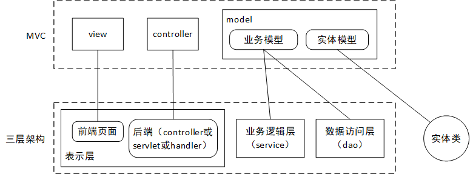
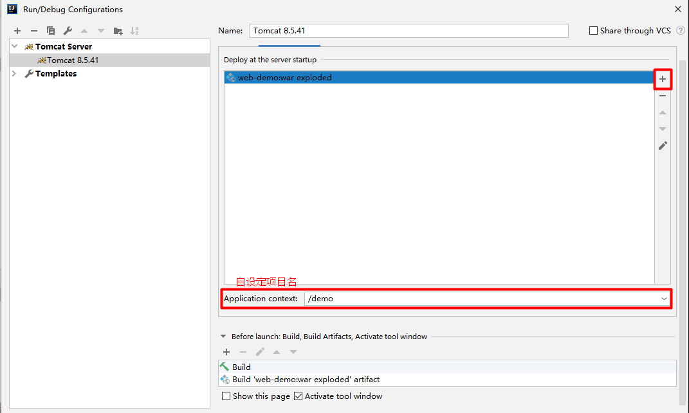

# JavaWeb

参考视频：[JavaWeb视频教程（JSP/Servlet/上传/下载/分页/MVC/三层架构/Ajax）](https://www.bilibili.com/video/BV18s411u7EH)。

##   Tomcat

### 常见状态码

404：资源（文件）不存在。

200：一切正常（正常也就不用显示次状态码了）。

403：权限不足，不能访问。

300/301：页面跳转（重定向）。

500：服务器内部错误（代码有误）。

### 原生站点目录

在tomcat服务器的webapp目录里自建原生站点，须至少具备以下文件：

```
BasicProject：站点根目录
  WEB-INF
    classes：存放源程序编译生成的字节码文件
    lib：存放从外部拷贝的jar包
    web.xml：配置文件
```

WEB-INF目录里的资源不能直接通过浏览器访问，只能通过内部转发（重定向也不行）访问。

注：理解为什么要令classes为字节码目录及为什么要将外部jar包放在lib里。要在tomcat上运行一个编译好的web项目，就得先找到字节码文件路径，按照tomcat自己的规定，tomcat会从两个classpath（字节码文件的根目录）开始找，先找其中的WEB-INF/classes，后找另一个WEB-INF/lib，一个放的是项目自己源文件的字节码，另一个放的是外部jar包（本质也是字节码，只是字节码被封在jar内部）。

### 虚拟路径和虚拟主机

webapp目录本身就是虚拟路径。可在server.xml中增加虚拟主机（包括虚拟路径）。

```xml
<Host appBase="myapps" autoDeploy="true" name="www.zcf.com" unpackWARs="true">
	<Valve className="org.apache.catalina.valves.AccessLogValve" directory="logs" pattern="%h %l %u %t &quot;%r&quot; %s %b" prefix="localhost_access_log" suffix=".txt"/>
    <Context docBase="D:\Van\virtualHost" path="/virtual"/>
</Host>
```

appBase：虚拟主机根目录。

name：自定义的域名。

Context是基于外链式部署的虚拟路径，其中有两个重要的参数：

- docBase：实际路径，就是启动服务器时系统要访问的站点的路径（注意站点目录可不在虚拟主机根目录中），如`D:\server\apache-tomcat-8.5.41\myapps\ssm`，又如`D:\Van\Eclipse\ssm\WebContent`。

- path：虚拟路径，就是在浏览器地址栏域名（可能加端口号）后输入的路径，90%的情况用相对路径（相对于myapps），取值随意，如`/father`，那么域名（加端口号）拼上path值就映射了docBase这个站点。

eclipse提供了界面化的外链部署，前提是要设定使用的是安装到本地的tomcat，自不必多言。

## JSP

### 概述

jsp（Java Server Page）是实现动态网页的核心技术，本质是servlet。虽然在形式上有代码同前端语言html很相似，但它是属于后端的技术，jsp文件会转成java文件进一步转成class文件。 

由于前后端分离的大趋势，jsp逐渐不那么流行。

### 执行

第一次访问：服务器会将jsp文件翻译为java文件，再将java文件编译为class文件，然后全部字节码转成浏览器可识别的内容，交付浏览器执行。

第二次访问：若源文件没修改，无需经过翻译、编译；若修改了，则需从头开始。

### 页面元素

#### 脚本

英文为scriptlet，形似java代码。脚本有以下三种格式：

- 定义局部变量，专门负责执行的代码块：

  ```jsp
  <%
  	String hobby = "computer science";
  	init();
  	out.print(hobby + "and more...<br/>");
  %>
  ```

- 定义全局变量和方法的代码块：

  ```jsp
  <%!
      // 全局变量
  	public String name;
  	// 方法
  	public void init() {
  		name = "Van";
  		// 貌似方法体内不能写打印语句，而应交由专门负责输出的代码块打印
  	}
  %>
  ```

- 专门负责输出的代码块：

  ```jsp
  <%= "<font color='red'>Hello</font>" + name %>
  ```

注：一般而言，修改了xml配置文件和源文件，需要重启服务器才能生效；修改了jsp、css等文件，则不需要。

来看个直观的例子，就将上面三段拼成一个jsp文件。

```jsp
<html>
	<head>
		<title>Hello Van</title>
	</head>
	<body>
		<%
			String hobby = "computer science";
			init();
			out.print(hobby + "and more...<br/>");
		%>
		<%!
			public String name; 
			public void init() {
				name = "Van";
				// 貌似方法体内不能出现打印语句
			}
		%>
		<%= "<font color='red'>Hello</font>" + name %>
		<h2>Hello World</h2>
	</body>
</html>
```

最终浏览器看不懂的页面元素都会转为浏览器看得懂的HTML、CSS等，我们看浏览器中打开的网页源代码：

```html
<html>
<head>
<title>Hello Van</title>
</head>
<body>
computer scienceand more...<br/>
<font color='red'>Hello</font>Van
<h2>Hello World</h2>
</body>
</html>
```

#### 指令

这里仅记录page指令，其他指令自行了解。

```jsp
<%@ page language="java" contentType="text/html; charset=UTF-8" pageEncoding="UTF-8"%>
```

它一般写在页眉，由`<%@ %>`包裹。以下是几个属性的介绍。

- language：jsp页面使用的脚本语言。
- import：导入的类。
- pageEcoding：jsp文件自身的编码方案。
- contentType：浏览器解析jsp文件的编码方案。

#### 注释

html注释：`<!-- html注释 -->`。

java注释：`// java注释`、`/* java注释 */`。

jsp注释：`<% jsp注释 %>`。

### 内置对象

jsp有九大内置对象，不用new关键字就能直接使用的对象。

- pageContext：jsp页面容器。

- out：输出对象，在客户端页面上输出内容。
- request：请求对象，存储客户端向服务端发送的请求信息。
- response：响应对象，存储服务端想客户端返回的响应信息。
- sesssion：会话对象，记录会话信息，从访问某站点到结束访问为一个session的范围。
- application：全局对象。
- config：配置对象，关系到服务器的配置。
- page：当前jsp页面对象。
- exception：异常对象。

下面拣几个重要的铺开来讲。

#### request

有几个常用的方法需要掌握：

- void setCharacterEncoding(String env)：设置请求信息（只针对post）的字符集。
- String getParameter(String name)：获取参数。
- String[] getParameterValues(String name)：获取多个参数。
- RequestDispatcher getRequestDispatcher(String path)（连同forward方法）：页面跳转-转发，数据保留且地址不变。

关于get和post，地址栏、超链接、表单默认使用get方式。get方式和post方式的区别：

- get的参数是显式的，post的参数是隐式的。
- get所容纳的请求信息有限（4-5kb），若请求大文件如图片等，会报错，故上传文件最好用post。
- 乱码处理上，如果使用tomcat，建议在server.xml文件里统一设定get的编码方案。post的编码方案对应上面第一个方法。

#### response

有几个重要的方法需要掌握：

- void addCookie(Cookie cookie)：服务端向客户端增加cookie对象。

- void sendRedirect(String location)：页面跳转-重定向，导致业已携带的数据丢弃且地址改变。注：请求转发和重定向的辨析可参见下面的图表。

  

  

  |                | 转发    | 重定向   |
| -------------- | ------- | -------- |
  | 地址栏是否改变 | 否      | 是       |
  | 数据是否保留   | 是      | 否       |
  | 请求次数       | 1       | 2        |
  | 所属对象       | request | response |
  
  关于数据保留，后面学范围对象的知识会再叙及。

- void setCharacterEncoding(String charset)：设置响应体的字符集。

- void setContentType(String type)：设置响应体的内容类型。

  ```java
  //两种都得设置，且设置为一样的
  response.setCharacterEncoding("utf-8");
  response.setContentType("text/html; charset=UTF-8");
  ```

#### session

关于session和cookie机制的理解，可参考此文章：[session和cookie 区别](https://blog.csdn.net/qq_35257397/article/details/52967241)。联系生活实际：session相当于门锁，cookie相当于钥匙。

有以下几个重要的方法：

- setAttribute(String name, Object value)：往会话中添加或修改属性。
- Object getAttribute(String name)：获取会话中的属性值。
- String getId()：获取sessionID。
- boolean isNew()：判断会话是不是新创建的。
- void setMaxInactiveInterval(int interval)：设定最大非活动（用户不操作浏览器）有效时间，单位是秒。
- int getMaxInactiveInterval()：获取最大非活动有效时间。
- void invalidate()：让当前session失效。

下面是一个session封装信息的小例子：

```jsp
<!-- source.jsp -->
<%
	session.setAttribute("name", "Van");
	session.setAttribute("age", 22);
	
	//转发、重定向都可
	request.getRequestDispatcher("destination.jsp").forward(request, response);
%>

<!-- destination.jsp -->
<%
	String name = (String)session.getAttribute("name");
	int age = (int)session.getAttribute("age");
	String sessionID = session.getId();
	
	out.println(name);
	out.println(age);
	out.println(sessionID);
%>
```

session和cookie的比较：

|            | session | cookie   |
| ---------- | ------- | -------- |
| 保存的位置 | 服务端  | 客户端   |
| 安全性     | 较安全  | 不够安全 |
| 保存的内容 | Object  | String   |

#### application

有下面几个重要的方法：

- String getContextPath()：获取当前项目的虚拟路径即path。
- String getRealPath(String path)：获取当前项目绝对路径即docBase。

#### 范围对象

有4个范围对象，从小到大依次是：pageContext、request、session、application。

他们共有的方法：

- setAttribute(String name, Object value)：新增或修改属性。
- Object getAttribute(String name)：获取属性值。
- void removeAttribute(String name)：删除属性。

当前对象的使用范围：

- pageContext：当前页面有效。

- request：本次请求有效，包括转发。下一次请求无效。

- session：本次会话有效，本次会话指从访问某站点到退出访问，包括转发和重定向。

  关闭或切换浏览器无效。关闭浏览器，相应cookie清空；切换浏览器，相应cookie不存在。当然可以通过一些设置让cookie存起来，让浏览器共享cookie。

- application：当前web项目运行期间有效。服务器宕机等无效。

尽量使用最小的范围对象以减少不必要的开销，因为对象范围越大，服务器性能损耗越大。

### 非内置对象

#### cookie

它由服务端生成，发送给客户端保存，相当于本地缓存，为各浏览器所共享。它与内置对象里的session密切相关。虽然是非内置对象，但即使我们没有手动创建它，服务端也会在必要的时候生成cookie并通过响应发送到客户端。

作用：提高访问服务端的效率，但安全性较差。

语法：格式类似于json，是一个键值对。有以下几个重要的方法：

- public Cookie(String name, String value)：构造器。
- public String getName()：获取键。
- public String getValue()：获取值。
- Cookie[] getCookies()：获取本次请求中附带的cookie对象数组。
- public void setMaxAge(int expiry)：设定最大有效期，超时后客户端的此Cookie失效，单位是秒。

下面是个基于cookie交互的小例子：

```jsp
<!-- source.jsp -->
<%
	//服务端第一次处理请求。构造Cookie对象
	Cookie cookie1 = new Cookie("name", "Van");
	Cookie cookie2 = new Cookie("gender", "man");
	Cookie cookie3 = new Cookie("age", "21");
		
	//第一次发送响应并告知新地址，响应中封装了多个Cookie对象
	response.addCookie(cookie1);
	response.addCookie(cookie2);
	response.addCookie(cookie3);
	//重定向
	response.sendRedirect("show.jsp");
%>

<!-- destination.jsp -->
<%
	//服务端处理第二次请求，取请求中附带的Cookie对象
	Cookie[] cookies = request.getCookies();
	//遍历
	for(Cookie cookie : cookies){
		out.println(cookie.getName() + ": " + cookie.getValue() + "<br>");
	}
%>		
```

## JDBC

主要内容省略，补充新增知识。

### 关闭连接

```java
try{
	if(resultSet != null){
		resultSet.close();
	}
	if(statement != null){
		statement.close();
	}
	if(connection != null){
		connection.close();
	}
} catch (SQLException e) {
	e.printStackTrace();
}
```

### 预编译语句的优势

编码更加简便：普通语句依靠字符串拼接传入特定参数，形式上不够整洁。

提高性能：这一点在jdbc笔记中分析过。比如当SQL语句执行多次，普通语句就需要编译多次，执行多次；而预编译语句只需编译一次，执行多次。

安全：有效地防止SQL注入。sql注入指的是用户恶意地输入含sql语法格式的内容（本来只该输入个人信息），传到后台后与SQL语句拼接在一起，可能会破坏安全性，比如下面这个例子：

```java
//后台sql语句
String sql = "select count(*) from login where name='" + name + "' where password='" + password + "'";
//前端用户输入name
xxx' or 1=1 --
```

这会导致where子句失效（恒为真），普通语句存在注入问题，而预编译语句能够避免。

### 调用存储内容和存储函数

参考数据库相关书籍

### 处理大文本和二进制数据

参考数据库相关书籍

### jsp访问数据库

就是将源程序里的核心代码移植到jsp页面中，并通过起头标签中的import属性导包，这样就能用jsp实现访问数据库的功能。

```jsp
<!--login.jsp-->

<%@ page language="java" contentType="text/html; charset=UTF-8"
    pageEncoding="UTF-8"%>
<!DOCTYPE html>
<html>
<head>
<meta charset="UTF-8">
<title>登录界面</title>
</head>
<body>
<form action="index.jsp">
	姓名：<input type="text" name="username"><br>
	密码：<input type="password" name="password"><br>
	<button type="submit">提交</button>
</form>
</body>
</html>

<!--index.jsp-->

<%@ page language="java" contentType="text/html; charset=UTF-8"
    pageEncoding="UTF-8"%>
<%@page import="java.sql.*"%>
<!DOCTYPE html>
<html>
<head>
<meta charset="UTF-8">
<title>检验登录是否成功</title>
</head>
<body>
<%
	String username = request.getParameter("username");
	String password = request.getParameter("password");

	final String DRIVER = "com.mysql.cj.jdbc.Driver";
	final String URL = "jdbc:mysql://localhost:3306/bean";
	final String USER = "root";
	final String PASSWORD = "root";
	
	Class.forName(DRIVER);
	Connection connection = DriverManager.getConnection(URL, USER, PASSWORD);
	String sql = "select count(*) from user where name = ? and password = ?";
	PreparedStatement pre=connection.prepareStatement(sql);
	pre.setString(1, username);
	pre.setString(2, password);
	pre.execute();
	ResultSet result = pre.getResultSet();
	result.next();
	int count = result.getInt(1);
	if(count > 0){
		out.println("登录成功");
	} else {
		out.println("登录失败");
	}
	
%>
</body>
</html>
```

但是出于业务分离、各司其职的思想，我们一般不提倡在jsp中写本属于dao层的java代码，于是我们引出JavaBean的知识。

## JavaBean

```java
//LoginDao.java
package dao;

import java.sql.Connection;
import java.sql.DriverManager;
import java.sql.PreparedStatement;
import java.sql.ResultSet;
import java.sql.SQLException;

/**
 * 封装业务逻辑的bean
 * @author Van
 *
 */
public class LoginDao {

	public int checkLogin(String username, String password) {

		final String DRIVER = "com.mysql.cj.jdbc.Driver";
		final String URL = "jdbc:mysql://localhost:3306/bean";
		final String USER = "root";
		final String PASSWORD = "root";

		PreparedStatement pre = null;
		Connection connection = null;
		ResultSet result = null;

		try {
			Class.forName(DRIVER);
		} catch (ClassNotFoundException e) {
			e.printStackTrace();
		}
		String sql = "select count(*) from user where name = ? and password = ?";
		try {
			connection = DriverManager.getConnection(URL, USER, PASSWORD);
			pre = connection.prepareStatement(sql);
			pre.setString(1, username);
			pre.setString(2, password);
			pre.execute();
			result = pre.getResultSet();
			result.next();// 指针移至首行
			return result.getInt(1);
		} catch (SQLException e) {
			e.printStackTrace();
			return -1;
		}
	}
}
```

```jsp
<!--index.jsp-->

<%@ page language="java" contentType="text/html; charset=UTF-8"
    pageEncoding="UTF-8"%>
<%@page import="dao.LoginDao"%>
<!DOCTYPE html>
<html>
<head>
<meta charset="UTF-8">
<title>检验登录是否成功</title>
</head>
<body>
<%
	String username = request.getParameter("username");
	String password = request.getParameter("password");

	LoginDao dao = new LoginDao();
	int count = dao.checkLogin(username, password);
	out.println(count > 0 ? "login succeed" : "login fail");
%>
</body>
</html>
```

JavaBean 是用Java语言的一种可重用组件，用于实现业务逻辑。参考[JavaBean百科](https://baike.baidu.com/item/javaBean)。

作用：减轻jsp页面的复杂度；实现代码复用（写在jsp里面就只有当前页面能用，写成bean就能让多个jsp调用）。

它就是一个类，它的必要条件：

- 所有方法的权限修饰符为public。
- 有公有的无参构造方法（可由系统自动提供）。
- 所有实例域（有实例域的话）的权限修饰符为private，并且提供set、get方法（boolean类型的实例域的get换成is）。

在使用层面，它分为封装业务逻辑的JavaBean（如dao层类）和封装数据的JavaBean（如模型类或实体类）。一个实体类对应数据库的一张表；实体类的一个对象对应数据表的一个元组。封装业务逻辑的bean操作封装数据的bean。

```java
//User.java
package entity;

/**
 * 封装数据的bean
 * @author Van
 *
 */
public class User {

	private String name;
	private String password;

	public User(String name, String password) {
		this.name = name;
		this.password = password;
	}

	public User() {
		name = null;
		password = null;
	}

	public String getName() {
		return name;
	}

	public void setName(String name) {
		this.name = name;
	}

	public String getPassword() {
		return password;
	}

	public void setPassword(String password) {
		this.password = password;
	}

}

//LoginDao.java
package dao;

import java.sql.Connection;
import java.sql.DriverManager;
import java.sql.PreparedStatement;
import java.sql.ResultSet;
import java.sql.SQLException;

import entity.User;

/**
 * 封装业务逻辑的bean（LoginDao）使用封装数据的bean（User）
 * @author Van
 *
 */
public class LoginDao {

    /**
	 * @param user 将离散的参数封装为对象参数
	 * @return 检查登录的结果，1为成功
	 */
	public int checkLogin(User user) {

		final String DRIVER = "com.mysql.cj.jdbc.Driver";
		final String URL = "jdbc:mysql://localhost:3306/bean";
		final String USER = "root";
		final String PASSWORD = "root";

		PreparedStatement pre = null;
		Connection connection = null;
		ResultSet result = null;

		try {
			Class.forName(DRIVER);
		} catch (ClassNotFoundException e) {
			e.printStackTrace();
		}
		String sql = "select count(*) from user where name = ? and password = ?";
		try {
			connection = DriverManager.getConnection(URL, USER, PASSWORD);
			pre = connection.prepareStatement(sql);
			pre.setString(1, user.getName());
			pre.setString(2, user.getPassword());
			pre.execute();
			result = pre.getResultSet();
			result.next();// 指针移至首行
			return result.getInt(1);
		} catch (SQLException e) {
			e.printStackTrace();
			return -1;
		}
	}
}
```

```jsp
<!--index.jsp-->

<%@ page language="java" contentType="text/html; charset=UTF-8"
    pageEncoding="UTF-8"%>
<%@page import="dao.LoginDao" import="entity.User"%>
<!DOCTYPE html>
<html>
<head>
<meta charset="UTF-8">
<title>检验登录是否成功</title>
</head>
<body>
<%
	String username = request.getParameter("username");
	String password = request.getParameter("password");

	User user = new User(username, password);
	LoginDao dao = new LoginDao();
	int count = dao.checkLogin(user);
	out.println(count == 1 ? "login succeed" : "login fail");
%>
</body>
</html>
```

进一步地，我们的Web项目会越做越大，包、类、jsp等也会越来越多，如何对它们的分布结构进行合理地管理呢？我们引出了MVC的知识。

## MVC设计模式


上图中的控制层一般由servlet主导，由此引出servlet的知识。

注：既然用到了servlet，那么需对上面JavaBean的代码进行修改，把index.jsp中的所有java代码移到servlet中去。

## Servlet

### 概述

servlet继承自javax.servlet.http.HttpServlet，要想发挥作用，我们需重写doGet方法或doPost方法或service方法。

要想让servlet生效，还得做一些操作。对于2.5版本，需要配置web.xml；对于3.0版本，需要用到@WebServlet注解。

```xml
<servlet>
    <!--这里的name与mapping里的name对应相同，作为某请求到处理该请求的servlet之间的桥梁-->
	<servlet-name>xxx</servlet-name>
    <servlet-class>com.controller.MyServlet</servlet-class>
</servlet>
  
<servlet-mapping>
  	<servlet-name>xxx</servlet-name>
    <!--拦截请求，斜杠代表根目录-->
  	<url-pattern>/MyServlet</url-pattern>
</servlet-mapping>
```

页面触发的请求会先由url-pattern或WebServlet注解拦截，再按后续步骤交由响应servlet处理。

### 理解斜杠

上面提到，请求名里的斜杠表示项目根目录，而项目根目录有两个：src和WebContent（前后分离）。src存放源程序及其他配置文件，WebContent存放视图层文件。

项目运行过程中，当接收到一个请求，系统会根据请求名同时在两个目录中查找，因为两个都是根目录。那么应注意区分的是，请求目标是页面文件的话，后缀如jsp、html需加上，而请求目标是servlet的话，后缀就不用加了，因为项目跑起来时servlet已经变成了字节码（联想虚拟机运行程序的指令：`java Hello`，同理这里也不用加后缀）。

在web.xml的url-pattern标签中，顶头斜杠代表项目根目录，其后写什么自定。在jsp中，顶头斜杠代表域名（加端口号）的路径，此路径映射到项目根目录。若Context标签中的path值不指定，则两种顶头斜杠同义。

### 生命周期


饿汉式（类）加载：让init方法随tomcat服务器启动而执行。对于2.5版本，修改web.xml；对于3.0版本，修改注解。

```xml
<servlet>
	<load-on-startup>1</load-on-startup>
</servlet>
```

```java
@WebServlet(value="/MyServlet" loadOnStartup=1)
```

### 源码分析

由HTTP软件包和非HTTP软件包组成，故servlet API适用于任何通信协议。我们当前学的servlet是位于javax.servlet.http包里的类和接口，它不存在于JDK库中，属基础的HTTP协议。

理论性内容这里就不记了，以后待深入学习。

## 三层架构

### 概念

从上到下是：

- 表示层：USL-User Show Layer，也叫视图层。

- 业务逻辑层：SLL-Service Logic Layer，也叫Service层。

- 数据访问层：DAL-Data Access Layer，也叫Dao层。

它与MVC设计模式的目的相同，即解耦合、提高代码复用度。但它们对Web项目结构的理解不同。它比MVC更加细化。

三层架构与MVC的对应关系：



### 详解

Dao层的方法都是单纯的原子性的增删改查操作。

Service层的方法是逻辑性的操作，对Dao层方法进行整合使用。

三层间的关系：上层将分析之后的请求传递给下层（调用下层），下层处理后返回给上层；上层依赖于下层，依赖意即持有其他类的对象，如servlet依赖于service，service又依赖于dao（dao依赖于数据库）。

一个servlet对应一项功能，功能太多的话就显得臃肿，于是之后学的框架SpringMVC就能把诸多功能集成到一个Controller之中。

其他详细内容参考项目ThreeLayers。

### 三层优化

主要是加入接口以及DBUtil的抽取。

## EL表达式

### 概述

Expression Language-表达式语言，用于替代、简化jsp里的代码。

示例：

```jsp
${域对象A.A的属性B.B的属性C…… }
```

可见可获取级联（嵌套）属性。除了点操作符，也可用中括号操作符：

```
${requestScope['A']["B"]['C'] }
```

中括号操作符`['']`、`[""]`比点操作符`.`适用细节更全：

- 功能强大：可含特殊字符。如.  、-。
- 获取变量值：带引号的是常量，不带引号的是变量。如`${requestScope[name] }`、`${requestScope['name'] }）`。
- 访问数组：如`${requestScope.students[0] }`。

取map对象：

```jsp
${requestScope.映射名.键 }
```

表达式里可使用运算符，具体写法太多，这里省略，可参考[菜鸟教程](https://www.runoob.com/jsp/jsp-expression-language.html)。

### 隐式对象

作用域访问对象（域对象）有pageScope、requestScope、sessionScope、applicationScope。若不指定域对象，则会按照范围从小到大取值。

参数访问对象：获取请求（包括表单、超链接）数据。示例如下：

```jsp
<!-- 用param拿单个数据，用paramValues拿数组数据 -->
${param.username }
${param.email }
${paramValues.hobbies[0] }
${paramValues.hobbies[1] }
${paramValues.hobbies[2] }
```

jsp隐式对象：通过pageContext拿其他jsp隐式对象，可级联取值。示例如下：

```jsp
${pageContext.request }
${pageContext.response }
${pageContext.session }
${pageContext.request.serverPort }
```

## JSTL

### 概述

Java Standard Tag Libray-Java标准标签库，是EL表达式的升级版。

### 导包

- jstl。
- standard。

### 引入

```jsp
<%@ taglib prefix="c" uri="http://java.sun.com/jsp/jstl/core" %>
```

其中`prefix="c"`指明标签前缀为c，其他值也行，我们约定用c。

### 标签库

核心标签库：通用标签库、条件标签库、迭代标签库。

看通用标签库的一些例子：

```jsp
<!-- 赋值标签c:set -->
<!-- 给变量赋值 -->
<c:set var="name" value="Van" scope="request" />
<!-- 给对象的属性赋值 -->
<c:set target="${requestScope.student }" property="student" value="Van" />
<!-- 给map对象的属性（键）赋值 -->
<c:set target="${requestScope.map }" property="China" value="中国" />
<!-- 新增变量赋值 -->
<c:set var="dog" value="柯基" scope="request" />
```

```jsp
<!-- 取值标签c:out，比EL更强大 -->
<c:out value="${student }"></c:out>
<!-- 若所取值不存在， 则设一个默认值-->
<c:out value="${student.height }" default="190cm"></c:out>
```

```jsp
<!-- 删除标签c:remove -->
<c:remove var="student" scope="request" />
```

条件与迭代标签库包括`c:if`、`c:forEach`等标签，详见[菜鸟教程](https://www.runoob.com/jsp/jsp-jstl.html)。

注：这些标签属性值是用双引号包裹的，注意el表达式后不能接空格，接了的话数据解析会失效。

## 过滤器

servlet、过滤器filter、监听器listener构成Javaweb的三大组件。

大体上容易理解过滤器及其操作，可参考[菜鸟教程](https://www.runoob.com/servlet/servlet-writing-filters.html)。

## 监听器

监听器主要监听这三个对象：request、session、application。

而这三个对象各由各的监听器监听：

- request：由ServletRequestListener监听。
- session：由HttpSessionListener监听。
- application：由ServletContextListener监听。

这三类监听器都提供了两个方法：监听开始的方法和监听结束的方法。

下面这个例子类包办了，三个对象都能监听：

```java
package com.van.listener;

import javax.servlet.ServletContextEvent;
import javax.servlet.ServletContextListener;
import javax.servlet.ServletRequestEvent;
import javax.servlet.ServletRequestListener;
import javax.servlet.http.HttpSessionEvent;
import javax.servlet.http.HttpSessionListener;

/**
 * 监听三个域对象的监听器
 * 
 * @author Van
 */
public class ContextSessionRequestListener
		implements ServletRequestListener, HttpSessionListener, ServletContextListener {

	/**
	 * 监听application（ServletContext）销毁
	 */
	@Override
	public void contextDestroyed(ServletContextEvent sce) {
		System.out.println("正在销毁ServeltContext对象：" + sce);
	}

	/**
	 * 监听application（ServletContext）初始化
	 */
	@Override
	public void contextInitialized(ServletContextEvent sce) {
		System.out.println("正在创建ServeltContext对象：" + sce);
	}

	/**
	 * 监听session（HttpSession）初始化
	 */
	@Override
	public void sessionCreated(HttpSessionEvent se) {
		System.out.println("正在创建HttpSession对象：" + se);
	}

	/**
	 * 监听session（HttpSession）销毁
	 */
	@Override
	public void sessionDestroyed(HttpSessionEvent se) {
		System.out.println("正在销毁HttpSession对象：" + se);
	}

	/**
	 * 监听request（ServletRequest）销毁
	 */
	@Override
	public void requestDestroyed(ServletRequestEvent sre) {
		System.out.println("正在销毁ServletRequest对象：" + sre);
	}

	/**
	 * 监听request（ServletRequest）销毁
	 */
	@Override
	public void requestInitialized(ServletRequestEvent arg0) {
		System.out.println("正在创建ServletRequest对象");
	}

}
```

另外还有监听域对象属性的监听器：

- ServletRequestAttributeListener。
- HttpSessionAttributeListener。
- ServletContextAttributeListener。

下面这个例子也是包办的：

```java
package com.van.listener;

import javax.servlet.ServletContextAttributeEvent;
import javax.servlet.ServletContextAttributeListener;
import javax.servlet.ServletRequestAttributeEvent;
import javax.servlet.ServletRequestAttributeListener;
import javax.servlet.http.HttpSessionAttributeListener;
import javax.servlet.http.HttpSessionBindingEvent;

/**
 * 监听三个域对象的属性的监听器
 * 
 * @author Van
 */
public class AttributeListener
		implements ServletRequestAttributeListener, HttpSessionAttributeListener, ServletContextAttributeListener {

	/**
	 * 往application中添加attribute
	 */
	@Override
	public void attributeAdded(ServletContextAttributeEvent event) {
		// 获取属性名
		String attrName = event.getName();
		// 获取属性值
		Object attribute = event.getServletContext().getAttribute(attrName);
		System.out.println("正在往application中添加attribute，属性名：" + attrName + "，属性值：" + attribute);
	}

	/**
	 * 从application中移除attribute
	 */
	@Override
	public void attributeRemoved(ServletContextAttributeEvent event) {
		// 获取属性名
		String attrName = event.getName();
		System.out.println("正在从application中移除attribute，属性名：" + attrName);

	}

	/**
	 * 在application中更新attribute的值
	 */
	@Override
	public void attributeReplaced(ServletContextAttributeEvent event) {
		// 获取属性名
		String attrName = event.getName();
		// 获取属性值
		Object attribute = event.getServletContext().getAttribute(attrName);
		System.out.println("正在在application中更新attribute，属性名：" + attrName + "，新属性值：" + attribute);

	}

	/**
	 * 往session中添加attribute
	 */
	@Override
	public void attributeAdded(HttpSessionBindingEvent event) {
		// TODO Auto-generated method stub
	}

	/**
	 * 从session中移除attribute
	 */
	@Override
	public void attributeRemoved(HttpSessionBindingEvent event) {
		// TODO Auto-generated method stub
	}

	/**
	 * 在session中更新attribute的值
	 */
	@Override
	public void attributeReplaced(HttpSessionBindingEvent event) {
		// TODO Auto-generated method stub
	}

	/**
	 * 往request中添加attribute
	 */
	@Override
	public void attributeAdded(ServletRequestAttributeEvent srae) {
		// TODO Auto-generated method stub
	}

	/**
	 * 从request中移除attribute
	 */
	@Override
	public void attributeRemoved(ServletRequestAttributeEvent srae) {
		// TODO Auto-generated method stub
	}

	/**
	 * 在request中更新attribute的值
	 */
	@Override
	public void attributeReplaced(ServletRequestAttributeEvent srae) {
		// TODO Auto-generated method stub
	}

}
```

要想让监听器生效，还需在web.xml中添加配置：

```xml
<!-- 监听器 -->
<listener>
    <listener-class>com.van.listener.ContextSessionRequestListener</listener-class>
</listener>
<listener>
    <listener-class>com.van.listener.AttributeListener</listener-class>
</listener>
```

注：域对象属性监听器的操作还没完全搞清楚，这个代码也不是好例子，待日后再进一步学习。

## session补充

本章主要谈session的绑定解绑和钝化活化。

当内存空间不足以容纳众多session服务器或要重启，于是需考虑将session暂存入硬盘（外存）以给内存腾出空间且防数据丢失，这个过程叫钝化或持久化，相反的过程就叫活化。

围绕着attribute，session对象可进行四种过程：

- 绑定：执行session.setAttribute()以添加attribute。
- 解绑：执行session.removeAttribute()以移除attribute。
- 钝化。
- 活化。

HttpSessionBindingListener接口用于监听绑定和解绑；HttpSessionActivationListener接口用于监听钝化和活化。这两个监听器不需要在web.xml中配置。

```java
package com.van.listener;

import javax.servlet.http.HttpSessionBindingEvent;
import javax.servlet.http.HttpSessionBindingListener;

/**
 * 监听session的绑定和解绑
 * 
 * @author Van
 */
public class BindingListener implements HttpSessionBindingListener {

	/**
	 * 绑定（添加attribute）
	 */
	@Override
	public void valueBound(HttpSessionBindingEvent event) {
		System.out.println("绑定对象：" + this + "，SESSIONID：" + event.getSession().getId());
	}

	/**
	 * 解绑（移除attribute）
	 */
	@Override
	public void valueUnbound(HttpSessionBindingEvent event) {
		System.out.println("解绑对象：" + this + "，SESSIONID：" + event.getSession().getId());
	}

}
```

```java
package com.van.listener;

import javax.servlet.http.HttpSessionActivationListener;
import javax.servlet.http.HttpSessionEvent;

/**
 * 监听session的钝化和活化
 * 
 * @author Van
 */
public class ActivationListener implements HttpSessionActivationListener {

	/**
	 * 监听钝化（内存->外存），在钝化之前执行
	 */
	@Override
	public void sessionWillPassivate(HttpSessionEvent se) {
		// TODO Auto-generated method stub
	}

	/**
	 * 监听活化（外存->内存），在活化之后执行
	 */
	@Override
	public void sessionDidActivate(HttpSessionEvent se) {
		// TODO Auto-generated method stub
	}

}
```

钝化是通过在Tomcat的context.xml中添加配置实现的，具体操作暂且省略。活化无需额外操作，在取session里的attribute时自动完成。

## Ajax

### 概念

朴素理解：譬如我们在B站看视频，看到一半了觉得这视频不错，于是点个赞。按以前的套路发送点赞请求，后台处理后跳转回本页面，可是进度条归零了，这是个很恐怖的事情，以后没人点赞了（偷笑）。

承上所述，我们希望页面能局部刷新而非全部刷新，Ajax异步请求就能满足这一需求。

用到ajax的典型场景是搜索框的智能提示。

异步刷新：局部更新页面数据。

### 实现

用js实现的具体写法这里省略，因为很少用。

这里详述jQuery实现：

```js
// 属性顺序随便
$.ajax({
    // 请求路径
    url:'login',
    // 请求类型：get或post
    type:'post',
    // 传递参数（在向 web 服务器发送数据时，数据必须是字符串）：key=value
    data:'name=Van&gender=male&age=22',
    success:function(){
        // 成功则执行
    },
    error:function(){
        // 失败则执行
    }
});

// 属性顺序固定
$.get({
    // 请求路径
    url:'login',
    // 传递参数：key=value
    data:'name=Van',
    function(){
        // 成功则执行
    },
    // "xml" "json" "text"
});

// 属性顺序固定
$.post({
    // 请求路径
    url:'login',
    // 传递参数：key=value
    data:'name=Van',
    function(){
        // 成功则执行
    },
    // "xml" "json" "text"
});

/**
 *属性顺序固定
 *将后端传回（可用return也可用输出流）的数据写进匹配元素的内容
 */
$('#tip').load({
    // 请求路径
    url:'login',
    // 传递参数：key=value
    data:'name=Van',
    function(){
        // 成功则执行，一般省略function属性
    },
});
```

变体太多，可参见[jQuery 参考手册 - Ajax](https://www.w3school.com.cn/jquery/jquery_ref_ajax.asp)。

### 处理json

借助不同平台提供的jar包来处理，具体就要看使用哪种jar包了，此处暂不记。

## 使用IDEA

这里只针对Javaweb说明一下如何创建Web项目并设定热部署。

下面是建项目和配置Tomcat的步骤图：


注意上图第一步Add Configuration。



设定热部署：


引入Tomcat环境依赖（加号加的是第二个列表项-Library）：


tomcat依赖（或环境）就是一组jar包，它们可见于tomcat根目录的lib文件夹内。

最后关于classes文件存放路径的修改可参考此[博客](https://www.cnblogs.com/printN/p/6537903.html)。

附带谈一下jar包的问题。可参考[视频-IDEA中的JAR问题](https://www.bilibili.com/video/BV18s411u7EH?p=52)。这里记录一下自己在两个IDE上的实验结果：

- eclipse：

  - web项目：只要把jar包拷贝到lib目录下，eclipse就自动对它们Add to build path，体现于编译不报错。按住ctrl点击从某个jar中引入的类时打开的是反编译的结果，从反编译的结果是看不出类的详细信息的。

  - 普通项目：无论jar包在项目内还是项目外，eclipse都不会自动对它们Add to build path，体现于编译报错，此时就得手动点Add to Build Path。即使我们把jar包放在项目内，编译器javac也不知道它们在哪，Add to Build Path意即向javac指明jar包的地址。编译通过后按住ctrl点击引入的类同样打开反编译结果。

- idea：

  - web项目：只把jar包拷贝到lib目录下，仅编译的话会报错。此时就得对它们逐一进行Add as Library或Project Structure->Modules->Denpendencies->+Jars or directories->选中lib目录（推荐）。但运行的话能成功，运行成功则说明编译成功，这就意味着运行时idea才自动将它们加入编译路径，而只编译不运行，idea就不帮忙了，需要我们手动加。
  - 普通项目：同eclipse。

在eclipse里，为让放在项目里面的jar包加进编译路径，我们既可选中它们点击Add to build path，也可打开Java Build Path窗口点开Add Jars再做后续操作。为让项目外的jar包加进编译路径，我们可打开Java Build Path窗口点开Add External Jars再做后续操作。

最后不由得感叹maven的强大之处，它通过Scope标签帮我们安排某个依赖（jar包）在指定阶段起作用，并实现按住Ctrl点击某个引入的类时得到API文档而非反编译结果。

## JNDI

### 概述

即Java命名与目录接口（Java Name Directory Interface)。

先回顾一下四大作用域对象或范围对象：PageContext（当前页面有效）<Request（当前请求有效）<Session（当前会话有效）<Application（项目运行期有效）。

如果我们想在不同的项目间共享资源或对象，那么上述四个对象爱莫能助，可通过JNDI实现，其作用即将某资源（对象）以配置文件的形式（Tomcat根目录/conf/context.xml）读出与写入。

### 案例

往context.xml中写入：

```xml
<Environment name="jndiName" value="jndiValue" type="java.lang.String"/>
```

在jsp页面中写：

```java
Context jndi = new InitialContext();
// java:comp/env/ 这个前缀一定要加
String value = (String)jndi.lookup("java:comp/env/jndiName");
out.print(value);
```

## 连接池

### 概述

服务端打开、关闭数据库及创建、销毁连接带来很大开销，可在服务端和数据库间插入一个连接池以提高效率。连接池中存放的是经常打开的数据库连接，服务端向连接池借还连接与原始操作相比就高效得多。

常见的连接池有：Tomcat-dbcp、dbcp、c3p0、druid。

另有一个概念叫数据源（DataSource），它承载并管理着连接池，于是我们通过数据源拿到连接池进一步拿到连接，一个数据源对象唯一与一个数据库相关联。java里专门的数据源类叫javax.sql.DataSource。

### Tomcat-dbcp

即tomcat连接池。

应提前在WEB-INF目录中创建lib文件夹，往里面添加mysql驱动jar包并将其加入编译路径。

使用步骤：

1. 类似上一章JNDI的相关操作，需在context.xml的Context标签里添加：

   ```xml
   <!-- 数据源有多个，即可以有多个Resource标签 这些属性都是顶重要的 -->
   <Resource	
   	name="student"
       auth="Container"
       type="javax.sql.DataSource"
       maxActive="400"
       maxIdle="20"
       maxWait="5000"
       username="root"
       password="root"
       driverClassName="com.mysql.cj.jdbc.Driver"
       url="jdbc:mysql://localhost:3306/test"
   />
   ```

2. 在web.xml中引入外部tomcat的配置：

   ```xml
   <resource-ref>
       <!-- 注意顺序有要求 -->
       <res-ref-name>student</res-ref-name>
       <res-type>javax.sql.DataSource</res-type>
       <res-auth>Container</res-auth>
   </resource-ref>
   ```

3. 使用：

   ```java
   // 本函数写在工具类，名如DBUtil中
   public Connection getConnection() {
       Context context = null;
       DataSource dataSource = null;
       Connection connection = null;
       try {
           context = new InitialContext();
           //获取数据源
           dataSource = (DataSource) context.lookup("java:comp/env/student");
       } catch (NamingException e) {
           e.printStackTrace();
       }
       try {
           //从数据源（所含连接池）中获取连接
           connection = dataSource.getConnection();
       } catch (SQLException e) {
           e.printStackTrace();
       }
       return connection;
   }
   ```

### DBCP

#### 概述

即Database Connection Pool-数据库连接池。

原来是与数据库进行直接连接，现在是从数据源的连接池借用连接。

获取DataSource有两种方式：利用BasicDataSource或利用BasicDataSourceFactory，这俩类都由相关jar包提供。

#### BasicDataSource方式

即利用硬编码。

首先需导入两个jar包（mysql驱动包已导）：

- commons-dbcp-1.4.jar。
- commons-pool-1.6.jar。

然后编码，利用BasicDataSource对象设置好各个参数。

```java
/**
 * 硬编码方式，用诸setter设定参数值
 *
 * @return 数据源
 */
public static DataSource getDataSourceWithDbcp() {
    BasicDataSource basicDataSource = new BasicDataSource();
    basicDataSource.setDriverClassName("com.mysql.cj.jdbc.Driver");
    basicDataSource.setUrl("jdbc:mysql://localhost:3306/test?useSSL=false");
    basicDataSource.setUsername("root");
    basicDataSource.setPassword("root");
    basicDataSource.setInitialSize(20);
    basicDataSource.setMaxActive(10);
    // 自动向上转型 BasicDataSource->DataSource
    return basicDataSource;
}
```

#### BasicDataSourceFactory方式

即利用properties文件。

先在src下创建dbcpconfig.properties文件并写入：

```properties
driverClassName=com.mysql.cj.jdbc.Driver
url=jdbc:mysql://localhost:3306/test?useSSL=false
username=root
password=root
initialSize=20
```

再用java代码加载配置，得到数据源：

```java
/**
 * 从配置文件中取配置
 *
 * @return dbcp所属数据源 其实这里名字没起好，毕竟连接池和数据源不是一种东西
 */
public static DataSource getDataSourceWithDbcpByProperties() {
    DataSource dbcp = null;
    Properties props = new Properties();
    // 基于配置文件构造输入流
    InputStream inputStream = new Dbcp().getClass().getClassLoader().getResourceAsStream("dbcpconfig.properties");
    try {
        // 由输入流加载配置
        props.load(inputStream);
    } catch (IOException e) {
        e.printStackTrace();
    }
    try {
        // 关键代码，根据配置获取数据源
        dbcp = BasicDataSourceFactory.createDataSource(props);
    } catch (Exception e) {
        e.printStackTrace();
    }
    return dbcp;
}
```

### C3P0

再次理解连接池和数据源的关系：数据源含有并管控连接池，不同连接池产生自不同的数据源类，如BasicDataSource是dbcp连接池的数据源，ComboPoolDataSource是c3p0连接池的数据源。虽然它们取自不同jar包，但均为DataSource接口的实现类。

ComboPoolDataSource将硬编码和配置文件两种方式合二为一，通过构造方法的参数判别：有参则用配置文件；无参则用硬编码。

使用步骤：

1. 导包：c3p0.jar（mysql驱动包已导）。

2. 使用：

   有参方式所需的配置文件可命名为c3p0-config.xml，置于src下。它的写法如：

   ```xml
   <?xml version="1.0" encoding="utf-8" ?>
   <c3p0-config>
       <!--不指定特定配置则用默认配置-->
       <default-config>
           <!--若要研究某类可设置哪些属性，可寻找相关类（本类及超类）的属性或setter-->
           <property name="user">root</property>
           <property name="password">root</property>
           <property name="jdbcUrl">jdbc:mysql://localhost:3306/test?useSSL=false</property>
           <property name="driverClass">com.mysql.cj.jdbc.Driver</property>
           <property name="checkoutTimeout">30000</property>
       </default-config>
       <!--个性化的配置，可存在多个不重样的-->
       <named-config name="Van">
           <property name="user">root</property>
           <property name="password">root</property>
           <property name="jdbcUrl">jdbc:mysql://localhost:3306/test?useSSL=false</property>
           <property name="driverClass">com.mysql.cj.jdbc.Driver</property>
           <property name="checkoutTimeout">20000</property>
       </named-config>
   </c3p0-config>
   ```

   拿c3p0数据源的java代码如下：

   ```java
   package com.van.util;
   
   import com.mchange.v2.c3p0.ComboPooledDataSource;
   
   import javax.sql.DataSource;
   import java.beans.PropertyVetoException;
   import java.sql.SQLException;
   
   public class C3p0 {
       /**
        * 无参-硬编码
        *
        * @return 含c3p0连接池的数据源
        */
       public static DataSource getDataSourceWithC3p0() {
           ComboPooledDataSource c3p0 = new ComboPooledDataSource();
           try {
               c3p0.setDriverClass("com.mysql.cj.jdbc.Driver");
           } catch (PropertyVetoException e) {
               e.printStackTrace();
           }
           c3p0.setJdbcUrl("jdbc:mysql://localhost:3306/test?useSSL=false");
           c3p0.setUser("root");
           c3p0.setPassword("root");
           return c3p0;
       }
   
       /**
        * 有参-加载xml文件
        *
        * @return 含c3p0连接池的数据源
        */
       public static DataSource getDataSourceWithC3p0ByXml() {
           ComboPooledDataSource c3p0 = new ComboPooledDataSource("c3p0-config.xml");
           return c3p0;
       }
   
       public static void main(String[] args) throws SQLException {
           // 验证两种方式，获取数据库连接
           System.out.println(C3p0.getDataSourceWithC3p0().getConnection());
           System.out.println(C3p0.getDataSourceWithC3p0ByXml().getConnection());
       }
   }
   ```

做项目时，我们可将dbcp和c3p0等多种数据源的获取代码写在同一个工具类中。

### 注

能看出一个共同点：这些连接池的名称，包括jar包的名称确实都表达连接池的意思，而实际拿出来用的类都表达数据源的意思。


## Apache DbUtils

==用时再记==

## 元数据

即描述数据的数据。比如有个student表，其字段id、name、age、gender等就叫元数据，每行记录就是元数据的数据，即通常意义上的数据。

元数据有三类：

- 数据库元数据（DataBaseMetaData)。
- 参数元数据（ParameterMetaData）。
- 结果集元数据（java.sql.ResultMetaData）。

### 数据库元数据

有java.sql.DataBaseMetaData，本类实例由Connection对象调用相应方法获得，可参考API文档以了解其详细信息。

### 参数元数据

此处的参数指传入sql语句的参数。有java.sql.ParameterMetaData，本类实例由PreparedStatement对象调用相应方法获得，可参考API文档以了解其详细信息。

### 结果集元数据

有java.sql.ResultMetaData，本类实例由ResultSet对象调用相应方法获得，可参考API文档以了解其详细信息。

==此处有几节暂且不记==

## 集群

### 集群简介

集群的优点：

- 负载均衡：多个服务器分担大量请求。注：单结点Tomcat能稳定地处理200-300个并发请求。
- 失败迁移：

集群的分类：

- 水平集群：多台计算机上安装服务端软件。
- 垂直集群：一台计算机上安装多台服务端软件。

那么当一台计算机炸掉了，垂直集群也就无意义了。在实际开发中两种方式结合着用。

主流使用Apache和Niginx（牵涉到的技术较多，以后再介绍）来搭建集群，它们属软件负载。

Apache长于处理静态资源，Tomcat长于处理动态资源，那么Apache+Tomcat可实现动静分离。

这之后服务端的处理情况应该如下图：


### Apache环境搭建

==未完待续==