# Java设计模式

参考视频：[尚硅谷Java设计模式，韩顺平图解java设计模式](https://www.bilibili.com/video/BV1G4411c7N4)。

### 前导知识

设计模式本身不依赖任何语言，但需要用某种语言来呈现，就用目前主流的语言Java，并以图解的方式讲解。

#### 设计模式的重要性

软件工程中，设计模式（design pattern）是对软件设计中普通存在（反复出现）的各种问题所提出的解决方案，该术语是由埃里希·伽马（Erich Gamma）在上世纪90年代从建筑设计领域引入到计算机科学的。

- 联想一座大厦和一间小破屋比，大厦要考虑与解决的问题要多得多。
- 拿实际工作尽力来说，我们会碰到如下问题：
- 一个项目已经开发完了，但客户又提出增加新的功能。
- 项目开发完了，原来的程序员离职了，你要接受来维护该项目，就怕可维护性（可读性）低、规范性低。
- 好的公司面试你，会问你在做项目时用到了哪些设计模式，怎样使用的，解决了什么问题。
- 设计模式在软件中的哪些地方得到体现。由低到高：OOP->功能模块（设计模式+算法+数据结构）->框架（多种设计模式）->架构（服务器集群）。
- 想成为合格的软件工程师，花时间来研究设计模式是非常有必要的。

#### 七大设计原则

##### 设计模式的目的

编写软件的过程中，程序员面临着来自耦合性、内聚性、可维护性、可扩展性、重用性、灵活性等多方面的挑战，设计模式就能使程序（软件）具有更好的代码重用性（相同的代码不多次编写）、可读性（即编程规范性，其他程序员容易阅读、理解）、可扩展性（即可维护性，很方便增加新功能）、可靠性（增加新功能并不影响原有的功能，耦合度低）、高内聚且低耦合。

##### 设计模式七大原则

设计模式的原则其实就是程序员在编程时应当遵守的原则，也是各种设计模式的基础或依据。

- 单一接口原则。
- 接口隔离原则。
- 依赖倒转（倒置）原则。
- 里氏替换原则
- 开闭原则。
- 迪米特法则。
- 合成复用原则。

##### 单一职责原则（Single Responsibility Principle)

一个应该只承担“一项职责”，这一项职责的范围是不好界定的，需根据实际情况划定。

例如，类A负责多个职责，当测试其功能时发现由职责范围过大（或职责过多）引起错误的情况，就说明类A的粒度不够高（分得不够细），应该对其进行分解，分解得到更具体的类。

```java
package singleResponsibility;

/**
 * 原始类包揽所有交通工具的运行方法，都在马路上跑，结果可想而知，是不合适的
 * 
 * @author 21708
 *
 */
public class Primitive {

	public void run(String vehicle) {
		System.out.println(vehicle + "在公路上运行。");
	}

	public static void main(String[] args) {
		Primitive vehicle = new Primitive();
		vehicle.run("公交车");
		vehicle.run("私家车");
		vehicle.run("大货车");
		// 由于run方法的职责过于宽泛或职责过多，下面三个参数传进run就有问题
		vehicle.run("火车");
		vehicle.run("飞机");
		vehicle.run("轮船");
	}
}
```

```java
package singleResponsibility;

/**
 * 在一个方法内部使用判断语句，分情况讨论
 * 
 * @author 21708
 *
 */
public class Improve2 {

	// 这版既在类级别上违反单一职责原则，且在方法级别上违反，有很大隐患
	public void run(String vehicle) {
		// 判断性代码是最丑的，复杂度会变高，可读性低，耦合性高
        //越高级的代码，越少使用多分支语句，宁愿用类来代替
		if (vehicle == "飞机")
			System.out.println(vehicle + "在天上运行");
		else if (vehicle == "火车")
			System.out.println(vehicle + "在铁路上运行");
		else if (vehicle == "轮船")
			System.out.println(vehicle + "在水上运行");
		else
			System.out.println(vehicle + "在公路上运行。");
	}

	public static void main(String[] args) {
		Improve2 vehicle = new Improve2();
		vehicle.run("公交车");
		vehicle.run("私家车");
		vehicle.run("大货车");
		// 改进之后，虽然下面三个没问题，但有隐患
		vehicle.run("火车");
		vehicle.run("飞机");
		vehicle.run("轮船");
	}
}
```

```java
package singleResponsibility;

/**
 * 写多个类分别担负不同职责，真正实现单一职责
 * 
 * @author 21708
 *
 */
public class Improve1 {

	public static void main(String[] args) {
		Car car = new Car();
		car.run("汽车");
	}
}

class Car {
	public void run(String vehicle) {
		System.out.println(vehicle + "在公路上运行。");
	}
}

class Train {
	public void run(String vehicle) {
		System.out.println(vehicle + "在铁路上运行。");
	}
}

class Plane {
	public void run(String vehicle) {
		System.out.println(vehicle + "在天上运行。");
	}
}

class Boat {
	public void run(String vehicle) {
		System.out.println(vehicle + "在水上运行。");
	}
}
```

```java
package singleResponsibility;

/**
 * 在一个类内部写多个方法，分别担负不同职责，假性实现单一职责。在类级别违反该原则，而在方法级别没有违反。只有在逻辑足够简单、方法足够少的情况下，才在类级违反，在方法级别保持。
 * 
 * @author 21708
 *
 */
public class Improve3 {

	public void skyRun(String vehicle) {
		System.out.println(vehicle + "在天上运行");
	}

	public void railwayRun(String vehicle) {
		System.out.println(vehicle + "在铁路上运行");
	}

	public void waterRun(String vehicle) {
		System.out.println(vehicle + "在水上运行");
	}

	public void roadRun(String vehicle) {
		System.out.println(vehicle + "在公路上运行");
	}

	public static void main(String[] args) {
		Improve3 vehicle = new Improve3();
		vehicle.roadRun("汽车");
		vehicle.railwayRun("火车");
		vehicle.waterRun("轮船");
		vehicle.skyRun("飞机");
	}
}
```

总结：

- 降低类的复杂度，一个类只负责一项职责。
- 提高类的可读性、可维护性（只新增，不修改）。
- 降低变更引起的风险。一个类越复杂，担责越多，修改就极不方便，牵一发而动全身。

##### 接口隔离（分离更准确）原则（Interface Segregation Principle)

可理解为单一职责原则的接口版。

客户端不应该依赖存在浪费情况的接口即没有用完它里面的所有功能，亦即一个类对另一个类的依赖应该建立在最小的接口上。

举例：类A通过某接口依赖类B，类C通过该接口依赖类D，如果此接口对于A和C来说都不是最小接口即其中总有部分方法A和C是用不到的，而B和D都不得不将接口里的方法全部实现，于是造成了不必要的冗余。


如果不分离的话，各实现类就得把与自己无关、不该自己负责重写的方法给重写，增加了开销（额外的工作）。

```java
package interfaceSegregation;

public class Primitive {

	public static void main(String[] args) {
		Beast beast = new Beast();
		beast.run(new BeastMoveImpl());

		Bird bird = new Bird();
		bird.fly(new BirdMoveImpl());
	}
}

/**
 * 兽类和鸟类共用的接口
 * 
 * @author 21708
 *
 */
interface IAnimalMove {

	String run();

	String fly();

	String swim();

	String creep();
}

class BeastMoveImpl implements IAnimalMove {

	@Override
	public String run() {
		return "在奔跑";
	}

	@Override
	public String fly() {
		// 冗余
		return null;
	}

	@Override
	public String swim() {
		// 冗余
		return null;
	}

	@Override
	public String creep() {
		// 冗余
		return null;
	}

}

class BirdMoveImpl implements IAnimalMove {

	@Override
	public String run() {
		// 冗余
		return null;
	}

	@Override
	public String fly() {
		return "在飞翔";
	}

	@Override
	public String swim() {
		// 冗余
		return null;
	}

	@Override
	public String creep() {
		// 冗余
		return null;
	}

}

class Beast {

	private String name;

	/**
	 * 使用未隔离的接口，依赖实现类
	 * 
	 * @param move
	 */
	public void run(IAnimalMove move) {
		name = "兽类";
		System.out.println(name + move.run());
	}

	/**
	 * 使用隔离的接口，依赖实现类
	 * 
	 * @param move
	 */
	public void run(IBeastMove move) {
		name = "兽类";
		System.out.println(name + move.run());
	}
}

class Bird {

	private String name;

	public void fly(IAnimalMove move) {
		name = "小鸟";
		System.out.println(name + move.fly());
	}

	public void fly(IBirdMove move) {
		name = "小鸟";
		System.out.println(name + move.fly());
	}
}
```

将IAnimalMove进行拆分成两个接口，供不同类使用，避免了开销。


```java
package interfaceSegregation;

public class Improve {

	public static void main(String[] args) {
		Beast beast = new Beast();
		beast.run(new BeastMove());

		Bird bird = new Bird();
		bird.fly(new BirdMove());
	}
}

/**
 * 拆分后专属兽类的接口
 * 
 * @author 21708
 *
 */
interface IBeastMove {
	String run();
}

/**
 * 拆分后专属鸟类的接口
 * 
 * @author 21708
 *
 */
interface IBirdMove {
	String fly();
}

/**
 * 兽类接口的实现类
 * 
 * @author 21708
 *
 */
class BeastMove implements IBeastMove {

	@Override
	public String run() {
		return "在奔跑";
	}
}

/**
 * 鸟类接口的实现类
 * 
 * @author 21708
 *
 */
class BirdMove implements IBirdMove {

	@Override
	public String fly() {
		return "在飞翔";
	}
}
```

在实际应用中，我们就要具体看某个实现类是否存在冗余覆盖情况，有的话就得拆分接口。

##### 依赖倒转原则（Dependency Inversion Principle）

不应该是抽象依赖细节，而应该是细节依赖抽象。

高层模块应该依赖抽象而非底层模块，底层模块也应该依赖抽象。

中心思想：面向接口编程。

设计理念：相对于细节的多变性，抽象的东西要稳定得多，以抽象为基础搭建的架构要比以细节为基础搭建的架构稳定得多。那么在Java中，抽象的载体就是接口或抽象类，细节的载体就是实现类。使用接口或抽象类的目的是制定好规范，而并不涉及到任何具体操作，把展现细节的具体操作交给它们的实现类去完成。

注意事项：底层模块尽量要有所继承的抽象类或所实现的接口，或两者兼有，这样一来程序稳定性会更好；变量声明的类型也尽量是抽象类或接口，这样我们的对象引用和实际对象间就存在一个缓冲，便于程序的扩展和优化；继承时需遵循里氏替换原则。

```java
package dependendyInversion;

public class Primitive {

	public static void main(String[] args) {
		Receiver receiver = new Receiver();
		Email email = new Email();
		receiver.receive(email);
	}

}

/**
 * 实现发送消息的功能
 * 
 * @author 21708
 *
 */
class Email {

	public String send() {
		return "电子邮件信息：Hello World!";
	}
}

/**
 * 实现接收消息的功能
 * 
 * @author V
 *
 */
class Receiver {

	/**
	 * 耦合性高，传入参数居然是个对象 一旦新增其他发送方式如QQ、微信那么还得加方法，用不同参数 用Object要判断类型还要向下强转，麻烦且有隐患
	 * 用泛型也不行
	 * 
	 * @param email 实例对象
	 */
	public void receive(Email email) {
		System.out.println(email.send());
	}

}
```

```java
package dependendyInversion;

public class Improve {

	public static void main(String[] args) {
		AnotherReceiver receiver = new AnotherReceiver();
		receiver.receive(new QQ());
		receiver.receive(new WeChat());
	}

}

/**
 * 发送信息的接口，可由多种聊天软件实现
 * 
 * @author 21708
 *
 */
interface ISender {
	String send();
}

/**
 * QQ
 * 
 * @author 21708
 *
 */
class QQ implements ISender {

	@Override
	public String send() {
		return "QQ信息：Hello World!";
	}

}

/**
 * 微信
 * 
 * @author 21708
 *
 */
class WeChat implements ISender {

	@Override
	public String send() {
		return "微信信息：Hello World!";
	}

}

class AnotherReceiver {

	/**
	 * 这里参数用的就是接口，有了缓冲，有了多态，避免增加额外方法
	 * 
	 * @param sender
	 */
	public void receive(ISender sender) {
		System.out.println(sender.send());
	}
}
```

用传递实现依赖关系的三种方式：

- 接口传递
- 构造器传递
- setter传递

##### 里氏替换原则（Liskove Substitution Principle）

该原则讨论了类的继承的问题。

继承包含这样一层含义：父类中的凡是已经实现好、很完善（就是子类没必要重写）的方法实际上设定了规范或契约，虽然他不强制要求所有子类必须遵循这些契约，但若子类对这些已经实现的方法进行任意修改（重写），就会对整个继承体系造成破坏。

继承在给程序设计带来便利的同时，也带来了弊端。比如使用继承会给程序带来侵入性，程序的可移植性降低，对象间的耦合性增强。若一个类被其他类继承，则当它需要修改时，必须考虑到对所有子类可能产生的影响，一旦做了不合理的修改，子类可能出问题。

核心思想：使用继承时，子类尽量不要重写父类的方法。举一个极端的例子，子类重写了父类的所有方法，那这继承没有任何意义，这哪叫继承，这不是要造老子的反吗？

里氏替换原则告诉我们，继承实际上让两个类的耦合（依赖关系）增强了。在适当情况下，可以用聚合、组合或依赖来解决问题。

继承的目的不是重写，而是利用现有的写好的加扩展出新的。

##### 开闭原则（Open-Closed Principle）

开闭原则是编程中最基础、最重要的原则，它既是设计模式的原则又是设计模式的目标。

一个软件实体（如函数、类、模块）应该开放扩展（允许扩展出新的代码），关闭修改（不允许修改现有的代码），用抽象构建框架，用实现完成细节。

编程中遵循其他原则和设计模式的终极目的就是不违背开闭原则。

典例就是用依赖倒置（新增类去实现接口）实现开闭原则。

##### 迪米特法则（Demeter Principle）

又称最少知道原则（Least Knowledge Principle），意即一个对象应该对其他对象保持最少的了解。

类与类之间的关系越密切，耦合度越大。

迪米特法则又称为最少知道原则，即一个类对自己所依赖的类知道得越少越好。也就是说，被依赖的类不管多么复杂，都应该尽量将逻辑封装在内部（而不是写在依赖类的方法中），对外除了提供public方法，不泄露任何消息。

耦合的方式包括依赖、聚合、组合、关联等。有耦合关系的两个对象之间是朋友关系，那么朋友分直接的朋友和陌生的朋友。以局部变量的形式出现在某类的内部的另一个类就是陌生的朋友，那么我们就不希望交陌生的朋友即避免让其他类充当局部变量。

迪米特法则只是要求降低类间（对象间）的耦合关系，并非要求它们间完全没有依赖关系。

##### 合用复用法则（Composite Reuse Principle）

意即尽量使用聚合或合成，而不用继承。

##### 总结

针对接口编程，不针对（具体）实现编程。

为了解耦而不断优化。

#### UML

##### 概述

Unified Modeling Language-统一建模语言。

是一种用于软件系统分析和设计的语言工具，用于帮助软件开发人员思考和记录思路。

UML本身是一套符号化的规定，这些符号用于描述软件模型中的各个元素和他们之间的关系，如类、接口、实现、泛化、依赖、组合、聚合等。

常用UML建模工具有Rational Rose、starUML及一些插件。

重中之重是一些关系：

- 依赖（Dependency）：一个类用到了另一个类（不管它出现在什么地方，如成员变量、返回值、参数、局部变量），就产生了依赖关系。
- 关联（Association）：一个类充当另一个类的成员变量，就产生了关联关系。
- 聚合（Aggregation）：类B充当类A的成员变量，且B是A的setter和构造器的参数（即仅使用A的引用而非堆中的实际对象），就产生了聚合关系（不完整，还有条件就是不能出现实例化）。
- 组合（Composite）：类B充当类A的成员变量，在A的字段声明处初始化B（或在构造器体内声明并初始化，也就是使用到A的实际对象），就产生了组合关系。
- 泛化（Generalization）：一个类继承另一个类，就产生了泛化关系。
- 实现（Realization）：一个类实现了一个接口，就产生了实现关系。

分析以上可得：关联、聚合、组合、泛化、实现都是依赖的特殊形式。

##### 类图（Class Diagram）

类图是描述类与类之间的关系的，是UML中最核心的。

类之间的关系即以上六种。

下面用人和烟、人和水的关系来阐述前四个关系。

##### 依赖

```java
package uml;

public class Person {

	public void smoke() {
		// 最一般化的依赖，其他类作局部变量
		Cigarette cigarette = new Cigarette();
		System.out.println("I love " + cigarette.getBrand());
	}

	public static void main(String[] args) {
		Person person = new Person();
		person.smoke();
	}
}

class Cigarette {

	private String brand = "中华";

	public String getBrand() {
		return brand;
	}

	public void setBrand(String brand) {
		this.brand = brand;
	}

}
```

##### 关联

关联具有导向性，分单向关系和双向关系。

关联具有多重性：有0、1、n..m、m...等情形。


```java
public class Person {
    // 关键就是类作为实例域
	private IDCard idCard;
}
class IDCard {
	private Person person;
}
```

##### 聚合

被依赖类和依赖类的亲密度不那么高，即没有被依赖类对象，依赖类也可存在。聚合是关联的特例，故也具有导向性和多重性。


注：方法写法错误，应是：方法名（参数 :参数类型) :返回值类型。

```java
package uml;

public class Person {

	// 作实例域是前提，先有关联关系，再往聚合关系发展
	private Cigarette cigarette;

	/**
	 * @param cigarette 作构造器的参数
	 */
	public Person(Cigarette cigarette) {
		this.cigarette = cigarette;
	}

	/**
	 * @param cigarette 作setter的参数
	 */
	public void setCigarette(Cigarette cigarette) {
		this.cigarette = cigarette;
	}
    
    public void setCigarette() {
		this.cigarette = null;
	}

    // 我们可以看出，耦合性没组合关系强的原因在于Person对象不依赖具体的某个Cigarette实例对象（没用到new关键字，没创建Cigarette对象，上面出现的都是对象引用），即使Cigarette对象无法产生，Person对象也可产生
    
	public void smoke() {
		System.out.println("I love " + cigarette.getBrand());
	}

	public static void main(String[] args) {
		Cigarette cigarette = new Cigarette();
		Person person = new Person(cigarette);
		person.smoke();
	}
}

class Cigarette {

	private String brand = "中华";

	public String getBrand() {
		return brand;
	}

	public void setBrand(String brand) {
		this.brand = brand;
	}

}
```

##### 组合

被依赖类和依赖类的亲密度高。没有被依赖类就没有依赖类，两者不可分割，同生同灭。组合也是关联的特例。


```java
package uml;

public class Person {

	// 作实例域是前提，先有关联关系，基于实例化要求往组合关系发展
	private Water water = new Water();

    // 从上下两处new我们就看出相比于聚合，组合的耦合度就强了，因为Water对象无法产生的话，Person对象亦无法产生
    
	public Person() {
		// 借助无参构造器实现组合，声明局部变量并初始化，初始化是关键
		this.water = new Water();
	}
}

class Water {
	
    // 盯着public，将其改为private的话就印证了上面的分析
    public Water(){}
    
}
```

##### 泛化

省略

##### 实现

省略

#### 设计模式概述和分类

设计模式不是具体代码，而是某类问题的通用解决方案，故具有普适性。设计模式代表了最佳实践，解决方案是众多软件开发人员经过相当长一段时间后从经验中总结出来的。

设计模式在本质上提高软件的维护性、通用性和扩展性，并降低软件的复杂度。

仔细阅读别人写的很多源码和框架，渐渐地就能领会出设计模式的精妙和好处。

设计模式分三类，供23种：

- 创建型模式（类层面）：单例、抽象工厂、原型、建造者、工厂。
- 结构型模式（整个系统层面）：适配器、桥接、装饰、组合、外观、享元、代理。
- 行为型模式（方法层面）：模板方法、命令、访问者、迭代器、观察者、中介者、备忘录、解释器、状态、策略、职责链（责任链）。

不同书籍的模式分类或模式名称有差异。

### 构建型模式

#### 单例模式（Singleton Pattern）

所谓类的单例模式，就是采取一定方法使得在整个软件系统中，某个（不是所有）类只能存在一个对象实例，且该类提供一个取得对象实例的方法。

它有8种实现方式。

##### 饿汉式（静态常量）

步骤：

1. 构造器私有化。
2. 在类的内部创建对象。
3. 向外提供一个静态的公用方法。

理解：创建实例就只靠构造器，构造器不能用的话实例也就无法创建，故构造器一旦私有化，外部就不能调用构造器（new关键字被废掉），也就不能创建实例对象。构造器不是完全失效，而是仅在内部使用，那么类就可以在内部创建对象，然后通过一个公用方法向外提供唯一的对象。

```java
package singleton;

/**
 * 饿汉式（静态常量）
 * 
 * @author 21708
 *
 */
public class Singleton {

	// final关键字不必要
    // 类一加载，对象就被创建（JVM解决线程安全问题，不存在创建多个对象的情况）
	private final static Singleton INSTANCE = new Singleton();

	private Singleton() {

	}

	public static Singleton getInstance() {
		return INSTANCE;
	}

	public static void main(String[] args) {
		Singleton singleton1 = Singleton.getInstance();
		Singleton singleton2 = Singleton.getInstance();
		// 这俩引用引用同一个堆内对象
		System.out.println(singleton1 == singleton2);
	}

}
```

优点：写法简单。在类装载的时候就完成实例化，避免了线程安全问题（线程同步：以可预知的进度执行线程，不存在死等的情况）。

缺点：类装载时就完成实例化，没有实现懒加载（lazy loading）效果。就是说，如果自始至终都没有用到这个实例，那么会造成内存的浪费。

结论：此单例模式可用，可能造成内存浪费，适用于确定某个类一定会使用的情况。

##### 饿汉式（静态代码块）

把内部创建对象放在静态代码块里进行。

```java
package singleton;

/**
 * 饿汉式（静态代码块）
 * 
 * @author Van
 *
 */
public class Singleton {

	private static Singleton instance;
    
    // 静态代码块
    static {
        // 类一加载，对象就被创建
        instance = new Singleton();
    }

	private Singleton() {

	}

	public static Singleton getInstance() {
		return instance;
	}

	public static void main(String[] args) {
		Singleton singleton1 = Singleton.getInstance();
		Singleton singleton2 = Singleton.getInstance();
		// 这俩引用引用同一个堆内对象
		System.out.println(singleton1 == singleton2);
	}

}
```

这种写法跟上一种是等价的，只不过将实例化工作交给静态代码块。

##### 懒汉式（线程不安全）

意即在使用到实例时，它才被创建出来。

```java
package singleton;

/**
 * 懒汉式（线程不安全）
 * 
 * @author Van
 *
 */
public class Singleton {

    // 类加载时，实例不会被创建
	private static Singleton instance;

	private Singleton() {

	}

    // 调用到此方法即要用到对象时才创建
	public static Singleton getInstance() {
        if(instance == null)
            instance = new Singleton();
		return instance;
	}

	public static void main(String[] args) {
		Singleton singleton1 = Singleton.getInstance();
		Singleton singleton2 = Singleton.getInstance();
		// 这俩引用不一定引用同一个堆内对象
		System.out.println(singleton1 == singleton2);
	}

}
```

优点：实现了懒加载。

缺点：只能在单线程下使用，在多线程下存在线程安全问题。意思就是线程A执行到判断语句为真时恰好卡住而尚未赋值，故instance为null，刚好线程B也执行到判断语句且无阻塞，于是执行赋值语句产生了一个实例，接着线程A执行赋值语句又产生了一个实例，最终结果就是空间里有两个实例。

结论：在实际开发中，不要使用此方式。

##### 懒汉式（线程安全）

使用synchronized关键字，使得各线程顺序地执行该方法。

```java
package singleton;

/**
 * 懒汉式（线程安全）
 * 
 * @author Van
 *
 */
public class Singleton {

    // 类加载时，实例不会被创建
	private static Singleton instance;

	private Singleton() {

	}

    // 调用到此方法即要用到对象时才创建
	public static synchronized Singleton getInstance() {
        if(instance == null)
            instance = new Singleton();
		return instance;
	}

	public static void main(String[] args) {
		Singleton singleton1 = Singleton.getInstance();
		Singleton singleton2 = Singleton.getInstance();
		// 这俩引用引用同一个堆内对象
		System.out.println(singleton1 == singleton2);
	}

}
```

优点：解决了线程不安全的问题。

缺点：效率低。每个线程想获取实例、执行该方法都得经历同步操作，且除了第一个线程外，后续线程其实无需再走判断语句，直接返回实例就行了。

结论：实际开发中，不推荐使用此方式。

##### 懒汉式（线程不安全，同步代码块）

```java
package singleton;

/**
 * 懒汉式（线程不安全，同步代码块）
 * 
 * @author 21708
 *
 */
public class Singleton {

    // 类加载时，实例不会被创建
	private static Singleton instance;

	private Singleton() {

	}

    // 调用到此方法即要用到对象时才创建
	public static Singleton getInstance() {
        if(instance == null) {
            // 缩小同步控制范围（同步范围越小，所牺牲的效率也就越少）
            synchronized(Singleton.class) {
            	instance = new Singleton();
            }
        }
		return instance;
	}

	public static void main(String[] args) {
		Singleton singleton1 = Singleton.getInstance();
		Singleton singleton2 = Singleton.getInstance();
		// 这俩引用引用同一个堆内对象
		System.out.println(singleton1 == singleton2);
	}

}
```

这种方法本意是想对上一种方法进行改进，因为上一种同步效率太低，但是改了后其实是线程不安全的，原因同第三种。故在实际开发中不能使用。

##### 懒汉式（双重检查Double-check）

```java
package singleton;

/**
 * 懒汉式（线程不安全，同步代码块）
 * 
 * @author Van
 *
 */
public class Singleton {

	private static volatile Singleton instance;
    
	private Singleton() {}

	public static Singleton getInstance() {
        // 一重检查，此处可能有线程卡住
        if(instance == null) {
            synchronized(Singleton.class) {
                // 二重检查，此处线程即使卡住也是独占处理机
            	if(instance == null) 
                    instance = new Singleton();
            }
        }
		return instance;
	}

	public static void main(String[] args) {
		Singleton singleton1 = Singleton.getInstance();
		Singleton singleton2 = Singleton.getInstance();
		// 这俩引用引用同一个堆内对象
		System.out.println(singleton1 == singleton2);
	}

}
```

Double-check概念是多线程开发中经常使用到的，可保证线程安全。

实例化代码只执行一次（第一个线程执行），且后续线程不会再执行同步代码块，直接返回实例，从而提升了效率。

优点：线程安全；延迟加载（懒加载实例）；效率较高。

结论：实际开发中，推荐使用。

##### 静态内部类

```java
package singleton;

/**
 * 静态内部类
 * 
 * @author Van
 *
 */
public class Singleton {
    
	private Singleton() {}

	private static class SingletonInstance {
        private static final Singleton INSTANCE = new Singleton();
    }

    public static Singleton getInstance() {
        return SingletonInstance.INSTANCE;
    }
    
	public static void main(String[] args) {
		Singleton singleton1 = Singleton.getInstance();
		Singleton singleton2 = Singleton.getInstance();
		// 这俩引用引用同一个堆内对象
		System.out.println(singleton1 == singleton2);
	}

}
```

加载外部类时，静态内部类不会被加载。调用外部类的getInstance方法时才加载静态内部类且实例化只有一次（最早执行时，加载内部类的同时实例化其静态实例域INSTANCE）。不存在线程安全问题，也满足懒加载。

值得注意，第一次加载内部类且实例化静态实例域时，JVM帮我们保证线程的安全性，当某线程执行到此处时，其他线程无法进入。

结论：推荐使用。

##### 枚举

```java
package singleton;

/**
 * 枚举
 * 
 * @author 21708
 *
 */
public class Test {

	public static void main(String[] args) {
		Singleton instance1 = Singleton.INSTANCE;
		Singleton instance2 = Singleton.INSTANCE;

		System.out.println(instance1 == instance2);
		System.out.println(instance1.hashCode());
		System.out.println(instance2.hashCode());
		instance1.sayHello();
		instance2.sayHello();
	}

}

enum Singleton {

	INSTANCE;

	public void sayHello() {
		System.out.println("Hello");
	}

}
```

枚举的特性就在于构造器私有，实例唯一，故天然地带有单例的属性。

这不仅能避免多线程同步问题，还能防止（利用反射）反序列化重新创建对象。

此方式是Effective Java的作者提倡的。

结论：推荐使用。

##### 小结

单例模式保证了对于某个类，内存中只有一个对象，节约了系统资源。好比家里有两台电视机，爷爷在客厅里看，奶奶在卧室里看，但俩人看的是一个频道，那么应该让其中一个跟另外一个一起看。

对于某些需要频繁销毁和创建的对象（尤其是重量级对象），使用单例模式可以节省处理及资源、提高系统性能。

若想使用某类的实例，则须记住不得用new关键字，而是用返回实例的公有方法。

区分单例创建的线程安全问题和单例使用的线程安全问题。前者的分析在上面各种方法中已经给出，后者的分析就以SpringMVC和Struts2为例，它里面的Controller、Service和Dao默认都是单例的，这几个类本身是线程不安全的，因此不要在其中定义实例域，不然有混数据的危险，但是其中的各个方法都是线程安全的。Struts2就没有单例模式，每个线程都分配一个新的实例化对象。

#### 工厂模式（Factory Pattern）

##### 简单工厂模式

###### 场景

搞一个披萨订购的小项目，要便于披萨种类的扩展、要便于维护。

披萨店有好几种披萨，如希腊披萨、奶酪披萨。每种披萨的制作都有四道工序：准备、烘烤、切块、打包。

类图如下：


下面是各个源文件：

```java
package simpleFactory;

/**
 * 披萨抽象类
 * 
 * @author Van
 */
public abstract class Pizza {

	// 显然，每种披萨都有自己独一无二的名字
	private String name;

	public Pizza(String name) {
		this.name = name;
	}

	public String getName() {
		return name;
	}

	public void setName(String name) {
		this.name = name;
	}

	/**
	 * 不同披萨的准备工序不一样
	 */
	public abstract void prepare();

	public void bake() {
		System.out.println(name + " is being baked.");
	}

	public void cut() {
		System.out.println(name + " is being cut.");
	}

	public void box() {
		System.out.println(name + " is being boxed.");
	}

}
```

```java
package simpleFactory;

/**
 * 希腊披萨
 * 
 * @author Van
 */
public class GreekPizza extends Pizza {

	public GreekPizza(String name) {
		super(name);
	}

	@Override
	public void prepare() {
		System.out.println("The Greek pizza is being prepared.");
	}

}
```

```java
package simpleFactory;

/**
 * 奶酪披萨
 * 
 * @author Van
 */
public class CheesePizza extends Pizza {

	public CheesePizza(String name) {
		super(name);
	}

	@Override
	public void prepare() {
		System.out.println("The cheese pizza is being prepared.");
	}

}
```

```java
package simpleFactory;

import java.io.BufferedReader;
import java.io.IOException;
import java.io.InputStreamReader;

/**
 * 披萨订购类
 * 
 * @author Van
 */
public class OrderPizza {

	/**
	 * 输入所订购披萨的名字并返回
	 * 
	 * @return
	 */
	public String getPizzaType() {
		BufferedReader reader = new BufferedReader(new InputStreamReader(System.in));
		System.out.print("Input the type of pizza: ");
		String pizzaType = "";
		try {
			pizzaType = reader.readLine();
		} catch (IOException e) {
			e.printStackTrace();
		}
		return pizzaType;
	}

	/**
	 * 订购披萨
	 */
	public void order() {
		String pizzaType = getPizzaType();
		Pizza pizza = null;
		// 根据输入初始化不同种类的披萨对象并调用不同的prepare方法。待抽取
		switch (pizzaType) {
		case "cheese":
			pizza = new CheesePizza("cheese");
			pizza.prepare();
			break;
		case "Greek":
			pizza = new GreekPizza("Greek");
			pizza.prepare();
			break;
		default:
			break;
		}
		// 后续三道工序同流
		pizza.bake();
		pizza.cut();
		pizza.box();
	}

}
```

```java
package simpleFactory;

/**
 * 冒充客户端
 * 
 * @author Van
 */
public class Customer {

	public static void main(String[] args) {
		new OrderPizza().order();
	}

}
```

上述方式的优点是比较好理解，容易操作。

缺点是违反了设计模式的OCP原则。对扩展开放，对修改关闭。即当我们给类增加新功能的时候，尽量不要修改代码，或尽可能少地修改代码。

比如说假如我们要新增一种披萨-pepperPizza（胡椒披萨），那么就得新建一个PepperPizza类，再在OrderPizza的order方法里修改if-else语句，不好。

注：关于开闭原则这里作进一步理解，对于十分简单的项目包括代码，违反开闭原则即修改而不扩充自然是很轻松的，因为扩充要写的东西可能比修改的多。但项目一旦十分庞大，情况就相反了。扩充（耦合度低）的话很方便，但采用修改（耦合度高）方式的话可能要改许多地方（尤见于多分支语句），找都不好找。另一点，修改的方式体现了程序的不稳定性，总要改许多地方，可能会未将来埋下某种颠覆性的隐患。

改进：把Pizza对象的创建工作封装到一个类中，这样我们有新的披萨种类时，只需修改这个类，而需要用到这个类即需创建Pizza对象的地方的代码无需改变。于是引出简单工厂模式。

###### 概念

简单工厂模式属于创建型模式，是工厂模式的一种。简单工厂模式是指由一个工厂对象创建产品类的实例。简单工厂模式是工厂模式家族中最简单实用的模式。

简单工厂模式：定义一个用来创建对象的类，由它来封装实例化对象的行为。

在软件开发中，当我们需要创建某个或某批对象时，就会用到工厂模式。

###### 改进

下面就针对上面的例子，设计简单工厂模式：定义一个用来实例化Pizza对象的类，封装创建Pizza对象的行为。

类图如下：


改动的源代码如下：

```java
package simpleFactory;

/**
 * 生产Pizza对象的简单工厂
 * 
 * @author Van
 */
public class SimpleFactory {

	// 单例模式
	private static final SimpleFactory SIMPLEFACTORY = new SimpleFactory();

	private SimpleFactory() {

	}

	public static SimpleFactory getSimpleFactory() {
		return SIMPLEFACTORY;
	}

	/**
	 * 根据传入的披萨类型实例化相应的披萨对象
	 * 
	 * @param pizzaType 披萨类型
	 * @return
	 */
	public Pizza createPizza(String pizzaType) {
		Pizza pizza = null;
		switch (pizzaType) {
		case "cheese":
			pizza = new CheesePizza("cheese");
			break;
		case "Greek":
			pizza = new GreekPizza("Greek");
			break;
		default:
			break;
		}
		System.out.println("Pizza对象出厂");
		return pizza;
	}

}
```

```java
// 见实例化知是组合
private SimpleFactory simpleFactory = SimpleFactory.getSimpleFactory();

/**
* 订购披萨
*/
public void order() {
    Pizza pizza = simpleFactory.createPizza(getPizzaType());
    pizza.prepare();
    // 后续三道工序同流
    pizza.bake();
    pizza.cut();
    pizza.box();
}
```

改进之后，提高了复用度。现在要添加新种类披萨的话，只用改工厂的方法即可，而不需处处修改if-else语句。

##### 工厂方法模式

梳理可得：简单工厂-工厂在类级别且一个工厂类负责创建一种对象；工厂方法-工厂在方法级别且一个工厂方法负责创建一种状态独特的对象，多个工厂方法隶属一个类；

###### 场景

场景变化：新增一级分类-不同厂家。比如有北京和和伦敦两家，那么组合之后就得到四种-北京奶酪披萨、北京希腊披萨；伦敦奶酪披萨、伦敦希腊披萨。

对此，我们有两种方法解决：一是方法工厂，二是抽象工厂。先看方法工厂。

###### 概念

设计方案：将披萨的实例化功能抽象成抽象方法，由不同子类具体实现。

做法：定义一个创建对象的抽象方法，由子类决定要实例化的类。工厂方法模式将对象的实例化推迟到子类。

###### 改进

遗憾的是，我做的改进和上面的思路不同，互为对照吧。

类图如下：


改动的源代码如下：

```java
package factoryMethod;

import simpleFactory.Pizza;

public class FactoryMethod {

	/**
	 * 创建北京披萨对象
	 * 
	 * @param pizzaType 品种
	 * @return
	 */
	public Pizza createBeijingPizza(String pizzaType) {
		Pizza pizza = null;
		switch (pizzaType) {
		case "cheese":
			pizza = new BeijingCheesePizza("cheese");
			break;
		case "Greek":
			pizza = new BeijingGreekPizza("Greek");
			break;
		default:
			break;
		}
		System.out.println("北京的Pizza对象出厂");
		return pizza;
	}

	/**
	 * 创建伦敦披萨对象
	 * 
	 * @param pizzaType 品种
	 * @return
	 */
	public Pizza createLondonPizza(String pizzaType) {
		Pizza pizza = null;
		switch (pizzaType) {
		case "cheese":
			pizza = new LondonCheesePizza("cheese");
			break;
		case "Greek":
			pizza = new LondonGreekPizza("Greek");
			break;
		default:
			break;
		}
		System.out.println("伦敦的Pizza对象出厂");
		return pizza;
	}

}
```

```java
// 见实例化知是组合
private FactoryMethod factoryMethod = new FactoryMethod();

/**
 * 订购北京产的披萨
 */
public void orderBeijing() {
    Pizza pizza = factoryMethod.createBeijingPizza(getPizzaType());
    pizza.prepare();
    // 后续三道工序同流
    pizza.bake();
    pizza.cut();
    pizza.box();
}

/**
 * 订购伦敦产的披萨
 */
public void orderLodon() {
    Pizza pizza = factoryMethod.createLondonPizza(getPizzaType());
    pizza.prepare();
    // 后续三道工序同流
    pizza.bake();
    pizza.cut();
    pizza.box();
}
```

```java
public static void main(String[] args) {
    OrderPizza orderPizza = new OrderPizza();
    // 订购北京产的
    orderPizza.orderBeijing();
    // 订购伦敦产的
    orderPizza.orderLodon();
}
```

##### 抽象工厂模式

###### 概念

定义了一个接口用于创建有依赖关系的对象簇，而无需指明具体的类。

从设计层面看，抽象工厂模式就是对简单工厂模式的改进（或者称为进一步的抽象）。

将工厂抽象为两层，AbstarctFactory（工厂的抽象）和负责实现的工厂子类（实例化行为的抽象）。程序员可根据工厂类别使用对应的工厂子类。这样单个的工厂类就变成了工厂簇，更利于代码的维护和扩展。

###### 改进

类图如下：


改动的源代码如下：

```java
package abstractFactory;

import simpleFactory.Pizza;

/**
 * 抽象工厂
 * 
 * @author Van
 */
public interface AbstractFactory {

	Pizza createPizza(String pizzaType);

}
```

```java
package abstractFactory;

import factoryMethod.BeijingCheesePizza;
import factoryMethod.BeijingGreekPizza;
import simpleFactory.Pizza;

/**
 * 北京工厂类
 * 
 * @author Van
 */
public class BeijingFactory implements AbstractFactory {

	@Override
	public Pizza createPizza(String pizzaType) {
		Pizza pizza = null;
		switch (pizzaType) {
		case "cheese":
			pizza = new BeijingCheesePizza("cheese");
			break;
		case "Greek":
			pizza = new BeijingGreekPizza("Greek");
			break;
		default:
			break;
		}
		System.out.println("北京的Pizza对象出厂");
		return pizza;
	}

}
```

```java
package abstractFactory;

import factoryMethod.LondonCheesePizza;
import factoryMethod.LondonGreekPizza;
import simpleFactory.Pizza;

/**
 * 伦敦工厂类
 * 
 * @author Van
 */
public class LondonFactory implements AbstractFactory {

	@Override
	public Pizza createPizza(String pizzaType) {
		Pizza pizza = null;
		switch (pizzaType) {
		case "cheese":
			pizza = new LondonCheesePizza("cheese");
			break;
		case "Greek":
			pizza = new LondonGreekPizza("Greek");
			break;
		default:
			break;
		}
		System.out.println("伦敦的Pizza对象出厂");
		return pizza;
	}

}
```

```java
/**
* 根据厂址订购披萨
* 
* @param factoryMethod 生产地址，向上转型
*/
public void order(AbstractFactory abstractFactory) {
    Pizza pizza = abstractFactory.createPizza(getPizzaType());
    pizza.prepare();
    // 后续三道工序同流
    pizza.bake();
    pizza.cut();
    pizza.box();
}
```

```java
public static void main(String[] args) {
    OrderPizza orderPizza = new OrderPizza();
    // 订购北京产的
    orderPizza.order(new BeijingFactory());
    // 订购伦敦产的
    orderPizza.order(new LondonFactory());
}
```

##### 小结

意义：将实例化对象的代码提取出来，放到一个类中统一管理和维护（代码复用、统一修改），达到和主项目的依赖关系的解耦，从而提高项目的扩展和可维护性。

创建对象时，不要直接new，而是把new的动作及可能附带的其他特定的动作放在一个工厂的方法中并返回。有的书上说，变量不要直接持具体类的引用。

#### 原型模式（Prototype Pattern）

##### 场景

现有一个绵羊类，实例化一个对象，名叫多利，年龄1岁，颜色为白色。实现将其克隆10份甚至100份。

```java
package prototype;

/**
 * 绵羊类
 * 
 * @author Van
 */
public class Sheep {

	private String name;
	private int age;
	private String color;

    public Sheep(String name, int age, String color) {
		super();
		this.name = name;
		this.age = age;
		this.color = color;
	}
    
	public String getName() {
		return name;
	}

	public void setName(String name) {
		this.name = name;
	}

	public int getAge() {
		return age;
	}

	public void setAge(int age) {
		this.age = age;
	}

	public String getColor() {
		return color;
	}

	public void setColor(String color) {
		this.color = color;
	}

}
```

传统方式实现：

```java
@Test
void testTraditional() {
	Sheep dolly = new Sheep("Dolly", 1, "white");

	// 苕写
	Sheep dolly1 = new Sheep(dolly.getName(), dolly.getAge(), dolly.getColor());
	Sheep dolly2 = new Sheep(dolly.getName(), dolly.getAge(), dolly.getColor());
	Sheep dolly3 = new Sheep(dolly.getName(), dolly.getAge(), dolly.getColor());
	// ……

	// 或用循环
	Sheep[] dollies = new Sheep[10];
	for (int i = 0; i < dollies.length; i++) {
		dollies[i].setName(dolly.getName());
		dollies[i].setAge(dolly.getAge());
		dollies[i].setColor(dolly.getColor());
	}
}
```

##### 传统方式的优缺点

优点：好理解且容易操作。

缺点：每创建一个新对象都要调用被克隆对象的访问器，一旦被克隆对象的属性特别多，克隆的效率就很低；总是要重新初始化对象，而不是动态获取对象运行时的状态，不够灵活。

改进思路：超类Object提供了一个clone方法，用来将对象复制一份，且想用clone方法的类必须实现Cloneable接口。由上引出原型模式。

##### 改进

关于原型模式的原理和概念，由于原视频知识点实在是看不懂，故此处省略。简单而言就是用clone方法实现原型模式。

下面是改动的代码：

```java
public class Sheep implements Cloneable{

	@Override
	public Sheep clone() {
		Sheep sheep = null;
		try {
			sheep = (Sheep) super.clone();
		} catch (CloneNotSupportedException e) {
			System.out.println("克隆失败");
			e.printStackTrace();
		}
		return sheep;
	}

}
```

```java
@Test
void testPrototype() {
	Sheep dolly = new Sheep("Dolly", 1, "white");

	Sheep[] dollies = new Sheep[10];
	for (int i = 0; i < dollies.length; i++) {
		dollies[i] = dolly.clone();
	}
}
```

改进以后，程序就有更高的效率和可扩展性。

前者稍微记住就行了，因为目前还不了解clone底层是如何实现的。后者该如何理解呢？加入Sheep类增加了一个属性，按原来非循环的方法那得改到死且违反开闭原则，按原来循环的方法虽然不改到死（增加极多个属性也相当于改到死），但也违反开闭原则。

##### 浅拷贝和深拷贝

此处省略，详细知识尽可参考《Java核心技术》。

值得一提，视频所推荐的第二种深拷贝实现方法-序列化在卷一貌似没见过，类似的也没见过。有小伙伴说卷二有，留待查阅。

若本类关联多个类，那第一种深拷贝方法就力不从心，故推荐序列化的方法。

##### 小结

创建的对象比较复杂时，可利用原型模式简化对象的创建过程，同时也能够提高效率（这大概是clone方法的功劳）。

不用初始化对象，而是动态获取对象运行时的状态（这大概是clone方法的核心）。

若原始对象发生变化（增减属性或属性值改变），则其他克隆出来的对象会自动发生变化，而无需手动修改代码。 

注意深拷贝的实现。

缺点：要为每个类配一个clone方法，对于新的类当然可以，但对于已有的类就不友好了，破坏了开闭原则，这一点需注意。

#### 建造者模式（Builder Pattern）

##### 场景

场景：盖房子，盖各种各样的房子，步骤都是打地基、搭结构、装修等等，但不同的房子各步骤具体操作是不同的。那么就编写个程序来盖各种各样的房子。

首先给出这样的类图：


下面源代码：

```java
package builder;

/**
 * 抽象类-造房子
 * 
 * @author Van
 */
public abstract class BuildHouse {
	/**
	 * 打地基
	 */
	public abstract void buildBasic();

	/**
	 * 搭结构
	 */
	public abstract void buildStructure();

	/**
	 * 装修
	 */
	public abstract void decorate();

	/**
	 * 完整流程，把房子造出来
	 */
	public void build() {
		buildBasic();
		buildStructure();
		decorate();
	}
}
```

```java
package builder;

/**
 * 实现类-造小木屋
 * 
 * @author Van
 */
public class BuildCabin extends BuildHouse {
	public void buildBasic() {
		System.out.println("正在打小木屋的地基");
	}

	public void buildStructure() {
		System.out.println("正在搭小木屋的结构");
	}

	public void decorate() {
		System.out.println("正在装修小木屋");
	}
}
```

```java
package builder;

/**
 * 实现类-造公寓
 * 
 * @author Van
 */
public class BuildApartment extends BuildHouse {
	public void buildBasic() {
		System.out.println("正在打公寓的地基");
	}

	public void buildStructure() {
		System.out.println("正在搭公寓的结构");
	}

	public void decorate() {
		System.out.println("正在装修公寓");
	}
}
```

```java
package builder;

import static org.junit.jupiter.api.Assertions.fail;

import org.junit.jupiter.api.Test;

/**
 * 客户端测试
 * 
 * @author Van
 */
class Client {

	@Test
	void test() {
		fail("Not yet implemented");
	}

	@Test
	void testBuildCabin() {
		new BuildCabin().build();
	}

	@Test
	void testBuildApartment() {
		new BuildApartment().build();
	}
}
```

优点：比较好理解，简单易操作。

缺点：程序在结构上过于简单，没有设计缓存层对象，程序的扩展和维护不够好，因为这个设计把产品和产品的制造过程揉在一起了（我反正没看出来），耦合性增强了。

改进方案：将产品和产品的建造过程分离，即得出建造者模式（包工头模式）。

##### 基本介绍

建造者模式：又叫生成器模式，是一种对象构建模式。它可以将复杂对象的建造过程抽象出来，使这个抽象过程的不同实现方法可以构造出不同表现（属性）的对象。

建造者模式是一步一步创建一个复杂的对象，它允许用户只通过复杂的类型和内容就可以构建它们，用户不需要知道内部具体的构建细节。

| 建造者模式的四个角色          | 角色说明                                                     |
| ----------------------------- | ------------------------------------------------------------ |
| Product（产品角色）           | 一个具体的产品对象。                                         |
| Builder（抽象建造者）         | 创建Product对象的接口或抽象类。                              |
| ConcreteBuilder（具体建造者） | 实现上面这个接口，构建和装配各部件。                         |
| Directer（指挥者）            | 使用Builder接口的复杂对象，作用是隔离客户与产品的生产过程以及控制产品的生产过程。 |

四者的关系如下图所示：

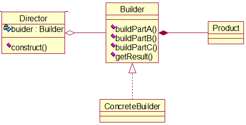

那么在Client和ConcreteBuilder之间就塞了个缓冲层Director。

##### 改进

```java
package builder.improve;

/**
 * 产品-房子
 * 
 * @author Van
 */
public class House {
	private String basic;// 地基
	private String wall;// 墙
	private String roof;// 屋顶

	public String getBasic() {
		return basic;
	}

	public void setBasic(String basic) {
		this.basic = basic;
	}

	public String getWall() {
		return wall;
	}

	public void setWall(String wall) {
		this.wall = wall;
	}

	public String getRoof() {
		return roof;
	}

	public void setRoof(String roof) {
		this.roof = roof;
	}

	@Override
	public String toString() {
		return "House [basic=" + basic + ", wall=" + wall + ", roof=" + roof + "]";
	}
}
```

```java
package builder.improve;

/**
 * 抽象建造者
 * 
 * @author Van
 */
public abstract class HouseBuilder {
	/**
	 * 造地基
	 */
	public abstract void buildBasic();

	/**
	 * 造墙
	 */
	public abstract void buildWall();

	/**
	 * 造屋顶
	 */
	public abstract void buildRoof();

	/**
	 * 完整流程
	 */
	public abstract House build();
}
```

```java
package builder.improve;

/**
 * 具体建造者-小屋建造者
 * 
 * @author Van
 */
public class CabinBuilder extends HouseBuilder {
	// 小木屋
	private House house = new House();

	@Override
	public void buildBasic() {
		house.setBasic("小木屋的地基");
	}

	@Override
	public void buildWall() {
		house.setWall("小木屋的墙");
	}

	@Override
	public void buildRoof() {
		house.setRoof("小木屋的屋顶");
	}

	@Override
	public House build() {
		buildBasic();
		buildWall();
		buildRoof();
		// 得到成品小木屋
		return house;
	}

}
```

```java
package builder.improve;

/**
 * 具体建造者-公寓建造者
 * 
 * @author Van
 */
public class ApartmentBuilder extends HouseBuilder {
	// 公寓
	private House house = new House();

	@Override
	public void buildBasic() {
		house.setBasic("公寓的地基");
	}

	@Override
	public void buildWall() {
		house.setWall("公寓的墙");
	}

	@Override
	public void buildRoof() {
		house.setRoof("公寓的屋顶");
	}

	@Override
	public House build() {
		buildBasic();
		buildWall();
		buildRoof();
		// 得到成品公寓
		return house;
	}

}
```

```java
package builder.improve;

/**
 * 建造总指挥
 * 
 * @author Van
 */
public class HouseDirector {
	// 建造者
	private HouseBuilder houseBuilder;

	/**
	 * 构造器（向上转型）
	 * 
	 * @param houseBuilder 建造者的实现类
	 */
	public HouseDirector(HouseBuilder houseBuilder) {
		super();
		this.houseBuilder = houseBuilder;
	}

	public HouseBuilder getHouseBuilder() {
		return houseBuilder;
	}

	public void setHouseBuilder(HouseBuilder houseBuilder) {
		this.houseBuilder = houseBuilder;
	}

	/**
	 * 指挥建造者造出房子
	 * 
	 * @return 房子
	 */
	public House constructHouse() {
		return houseBuilder.build();
	}
}
```

```java
package builder.improve;

import static org.junit.jupiter.api.Assertions.fail;

import org.junit.jupiter.api.Test;

class ClientTest {

	@Test
	void testBuildCabin() {
		// 勒令指挥者完成一套小木屋
		HouseDirector houseDirector = new HouseDirector(new CabinBuilder());
		House house = houseDirector.constructHouse();
		System.out.println(house);
	}

	@Test
	void testBuildApartment() {
		// 勒令指挥者完成一套公寓
		HouseDirector houseDirector = new HouseDirector(new ApartmentBuilder());
		House house = houseDirector.constructHouse();
		System.out.println(house);
	}
}
```

##### 小结

客户端不必知道产品构造的细节。产品和产品的构造过程解耦合，使得相同的创建过程可得到不同的对象（抽象类或接口由不同的实现类实现）。

每一个具体的建造者都是相互独立的，因此可以很方便地替换或添加具体建造者（满足开闭原则），且使用不同的建造者可得到不同的产品对象。

可以灵活地编写方法来更加精细地控制产品创建过程。

### 结构型模式

#### 适配器模式（Adapter Pattern）

##### 基本介绍

适配器的概念来源于生活：各国的插头的样貌构造是不一样的，可以通过多功能转换插头进行转换，进而灵活地使用电器。

适配器模式将某个类的接口转换成客户端所期望的另一种接口，主要目的是兼容性，即让本因接口不匹配而不能一起工作的两个类能协同工作。别名为包装器（Wrapper）。

适配器模式属结构型模式。

适配器模式主要分三类：类适配器模式、对象适配器模式、接口适配器模式。

##### 工作原理

将一个类的接口转换为另一个类的接口，让原本接口不兼容的类可以兼容。

用户看不到被适配者，而感觉只是和目标接口交互。

用户调用适配器转换得到的目标接口方法，适配器再调用被适配者对应的接口方法。

原理简图：


从上可看出适配器就是一种媒介。

##### 类适配器模式

Adapter类继承src类，并实现dst接口，完成src->dst的转换。

Adapter类好比充电器，将src为220V的交流电转换为dst为5V的直流电。


根据上图生成代码如下：

```java
package adapter;

/**
 * 被适配者src类
 * 
 * @author Van
 */
public class Voltage220V {
	/**
	 * 返回220V的电压值
	 * 
	 * @return
	 */
	public int output220V() {
		int voltage = 220;
		return voltage;
	}
}
```

```java
package adapter;

/**
 * 适配者dst接口
 * 
 * @author Van
 */
public interface IVoltage5V {
	/**
	 * 返回5V的电压
	 * 
	 * @return
	 */
	int output5V();
}
```

```java
package adapter;

/**
 * 适配器，src的子类兼dst的实现类
 * 
 * @author Van
 */
public class VoltageAdapter extends Voltage220V implements IVoltage5V {
	
    /**
	 * 在接口方法内部调用继承下来的方法
	 * 
	 * @return
	 */
	@Override
	public int output5V() {
		// 原始电压
		int srcVoltage = output220V();
		// 转换为目标电压
		int dstVoltage = srcVoltage / 44;
		return dstVoltage;
	}

}
```

```java
package adapter;

/**
 * 手机类，要充电的
 * 
 * @author Van
 */
public class Phone {
	/**
	 * 充电
	 * 
	 * @param voltage5V 适配者
	 */
	public void charging(IVoltage5V voltage5V) {
		System.out.println("手机正在充电，电压：" + voltage5V.output5V() + "V");
	}
}
```

```java
package adapter;

import static org.junit.jupiter.api.Assertions.fail;

import org.junit.jupiter.api.Test;

class ClientTest {

	@Test
	void testCharging() {
		Phone phone = new Phone();
		phone.charging(new VoltageAdapter());
	}

}
```

类适配器模式小结：

- java只支持单继承，故适配器类在继承src类的条件下只能要求dst为接口，有一定局限性。
- src类的方法会在适配器类中暴露出来，增加了使用成本。
- 适配器类继承了src类，就可重写父类方法（但也违反了里氏替换原则），使得适配器类的灵活性增强了。

##### 对象适配器模式

之前学过合用复用原则，关联优于继承，于是可将类适配器改进为对象适配器。即对适配器类作修改，让其不继承src类，而是持有src类的实例，解决兼容性问题。

对象适配器模式是常用的一种适配器模式。

类图就省略了，代码也只给出改变的部分：

```java
package adapter.objectAdapter;

/**
 * 适配者dst接口
 * 
 * @author Van
 */
public interface IVoltage5V {
	/**
	 * 返回5V的电压
	 * 
	 * @param voltage220V 聚合用的src类参数
	 * @return
	 */
	int output5V(Voltage220V voltage220V);
}
```

```java
package adapter.objectAdapter;

/**
 * 适配器类，dst的实现类
 * 
 * @author Van
 */
public class VoltageAdapter implements IVoltage5V {

	@Override
	public int output5V(Voltage220V voltage220V) {
		// 原始电压
		int srcVoltage = voltage220V.output220V();
		// 转换为目标电压
		int dstVoltage = srcVoltage / 44;
        System.out.println("适配器转换完成");
		return dstVoltage;
	}

}
```

```java
package adapter.objectAdapter;

/**
 * 手机类，要充电的
 * 
 * @author Van
 */
public class Phone {
	/**
	 * 充电
	 * 
	 * @param voltage5V 适配者
	 */
	public void charging(IVoltage5V voltage5V) {
		System.out.println("手机正在充电，电压：" + voltage5V.output5V(new Voltage220V()) + "V");
	}
}
```

这样一来dst类就不必是接口，使用成本也更低，更灵活。

##### 接口适配器模式

一些书也称其为缺省适配器模式。

当适配细节尚不明确时，可预先设计一个抽象类来实现dst接口，并为该接口里的每一个方法提供一个空实现（空方法体），于是乎该抽象类的子类可选择性地重写父类方法。

实例代码参考eclipse里的相应项目。

##### 小结

实际开发中适配器模式的实现方式不局限于以上三种。

#### 桥接模式（Bridge Pattern）

##### 场景

譬如有像下面这样的手机类图：


缺点：扩展性问题（类爆炸）-如果我们增加手机的样式，比如旋转式，就得在第二级、第三级添加类，一旦品牌极其多，我们加的类就也非常之多；如果我们增加手机品牌，那也得由各样式类派生出该品牌的第三级类。无论如何都增加了代码的维护成本。

##### 基本介绍

桥接模式是指将抽象和实现放在不同的类层次中，使两个层次相互独立，各自改变而互不影响。

是一种结构型设计模式。

桥接模式基于类的最小设计原则-类的数目尽量少，通过封装、继承、聚合等方式让不同的类承担不同的职责。它的主要特点是把抽象（abstraction）和行为实现（implementation）分开，从而保持它们的独立性。

原理类图如下：


桥接模式的“桥”在图中表现为Abstraction，红框画出的就是两个层次。

##### 改进

根据桥接模式的思路，可将手机类图改造为下面这个类图，避免了类的大量扩充。


我们可以看出，无论是扩充样式还是品牌，都只需在各自的层次添加一个类即可。

源代码如下：

```java
package bridge;

/**
 * 手机品牌接口
 * 
 * @author Van
 */
public interface IPhoneBrand {
	/**
	 * 开机
	 */
	void open();

	/**
	 * 关机
	 */
	void close();

	/**
	 * 打电话
	 */
	void call();
}
```

```java
package bridge;

/**
 * 华为手机
 * 
 * @author Van
 */
public class Huawei implements IPhoneBrand {

	@Override
	public void open() {
		System.out.println("华为手机开机");
	}

	@Override
	public void close() {
		System.out.println("华为手机关机");
	}

	@Override
	public void call() {
		System.out.println("华为手机通话");
	}

}
```

```java
package bridge;

import org.junit.jupiter.api.Test;

/**
 * 客户端
 * 
 * @author Van
 */
class ClientTest {

	/**
	 * 测试小米滑屏手机
	 */
	@Test
	void testSlideMi() {
		SlidePhone slideMi = new SlidePhone(new Mi());
		slideMi.open();
		slideMi.call();
	}

	@Test
	void testUpRightVivo() {
		UpRightPhone upRightVivo = new UpRightPhone(new Vivo());
		upRightVivo.open();
		upRightVivo.close();
	}

	@Test
	void testFolderHuawei() {
		FolderPhone folderHuawei = new FolderPhone(new Huawei());
		folderHuawei.open();
	}

}
```

```java
package bridge;

/**
 * 小米手机
 * 
 * @author Van
 */
public class Mi implements IPhoneBrand {

	@Override
	public void open() {
		System.out.println("小米手机开机");
	}

	@Override
	public void close() {
		System.out.println("小米手机关机");
	}

	@Override
	public void call() {
		System.out.println("小米手机通话");
	}

}
```

```java
package bridge;

/**
 * 手机（以各种样式为子类）
 * 
 * @author Van
 */
public abstract class PhoneStyle {
    // 受保护修饰符-子类可用
	protected IPhoneBrand phoneBrand;

	/**
	 * 有参构造器
	 * 
	 * @param phoneBrand IPhoneBrand的实现类
	 */
	public PhoneStyle(IPhoneBrand phoneBrand) {
		super();
		this.phoneBrand = phoneBrand;
	}

	/**
	 * 开机
	 */
	protected abstract void open();

	/**
	 * 关机
	 */
	protected abstract void close();

	/**
	 * 打电话
	 */
	protected abstract void call();
}
```

```java
package bridge;

/**
 * 翻盖手机
 * 
 * @author Van
 */
public class FolderPhone extends PhoneStyle {

	public FolderPhone(IPhoneBrand phoneBrand) {
		super(phoneBrand);
	}

	@Override
	public void open() {
		System.out.println("当前是翻盖手机");
		phoneBrand.open();
	}

	@Override
	public void close() {
		System.out.println("当前是翻盖手机");
		phoneBrand.close();
	}

	@Override
	public void call() {
		System.out.println("当前是翻盖手机");
		phoneBrand.call();
	}

}
```

```java
package bridge;

/**
 * 直立按键式手机
 * 
 * @author Van
 */
public class UpRightPhone extends PhoneStyle {

	public UpRightPhone(IPhoneBrand phoneBrand) {
		super(phoneBrand);
	}

	@Override
	public void open() {
		System.out.println("当前是直立按键手机");
		phoneBrand.open();
	}

	@Override
	public void close() {
		System.out.println("当前是直立按键手机");
		phoneBrand.close();
	}

	@Override
	public void call() {
		System.out.println("当前是直立按键手机");
		phoneBrand.call();
	}

}
```

```java
package bridge;

/**
 * 滑屏式手机
 * 
 * @author Van
 */
public class SlidePhone extends PhoneStyle {

	public SlidePhone(IPhoneBrand phoneBrand) {
		super(phoneBrand);
	}

	@Override
	public void open() {
		System.out.println("当前是滑屏手机");
		phoneBrand.open();
	}

	@Override
	public void close() {
		System.out.println("当前是滑屏手机");
		phoneBrand.close();
	}

	@Override
	public void call() {
		System.out.println("当前是滑屏手机");
		phoneBrand.call();
	}

}
```

```java
package bridge;

import org.junit.jupiter.api.Test;

/**
 * 客户端
 * 
 * @author Van
 */
class ClientTest {

	/**
	 * 测试小米滑屏手机
	 */
	@Test
	void testSlideMi() {
		SlidePhone slideMi = new SlidePhone(new Mi());
		slideMi.open();
		slideMi.call();
	}

	/**
	 * 测试直立按键Vivo手机
	 */
	@Test
	void testUpRightVivo() {
		UpRightPhone upRightVivo = new UpRightPhone(new Vivo());
		upRightVivo.open();
		upRightVivo.close();
	}

	/**
	 * 测试华为翻盖手机
	 */
	@Test
	void testFolderHuawei() {
		FolderPhone folderHuawei = new FolderPhone(new Huawei());
		folderHuawei.open();
	}

}
```

仔细观察上面的手机树，发现二级属性和三级属性可以对调，即把品牌放在第二级，把样式放在第三级。我们甚至可以推广，不光能搭一个桥，还可以根据分类属性的数目搭n多个桥，参见下面这个手绘图。


另外，联想之前学的工厂模式，发现披萨的制作也具有分类属性，如种类、厂家等等，故那个项目也可改造为桥接模式的项目。

##### 小结

桥接模式实现了抽象和实现部分的分离，从而极大提高了系统的灵活性，并有助于对系统进行分层设计，产生更好的结构化系统。

对于系统的高层部分，只需知道抽象部分和实现部分的接口就行了，其他部分由具体业务来完成。

桥接模式替代多层继承方案，减少了一级级子类的个数，降低了系统的管理和维护成本。

桥接模式的引入增加了系统的理解和设计难度。

桥接模式要求我们能正确识别出系统中两个独立变化的维度，因此其使用范围有一定的局限性。

#### 装饰者模式（Decorator Pattern）

##### 场景

星巴克咖啡订单：

- 咖啡种类（单品）：Espresso（意大利浓咖啡）、ShortBlack、LongBlack（美式咖啡）、Decaf（无因咖啡）。
- 配品：Milk、Soy（豆浆）、Chocolate。
- 要求在扩展咖啡种类时，具有良好的扩展性，改动、维护方便。
- 计算咖啡的费用。客户可以单点各个种类单品，也可点加上配品。

方案一：最初我们能想到的就是跟上一节手机树一样的咖啡树，产生类爆炸效应。

方案二：可以将配品作为实例域放进单品类中，而不使用单品和配品的随机组合，提高项目的维护性。类图如下：


其中的hasXXX方法作用是指明是否添加某配品，故返回值应为boolean。

方案二的优缺点分析：

- 可以控制类的数量。
- 增减大量配品时，代码的维护性也不是很好。
- 配品可以加多份，于是hasXXX的返回值应不止boolean，还需int。

由上引出装饰者模式。

##### 定义

动态地将新功能附加（装饰）到对象上。在对象的功能扩展方面，它比继承更富有弹性，也体现了开闭原则OCP。

核心依赖：继承并聚合。

##### 改进

源代码参考eclipse里的相应项目，我用两种方式实现，一种是以抽象配品列表作实例域，另一种就是装饰者模式。

#### 组合模式（Composite Pattern）

##### 场景

编写程序展示一个大学的专业结构。在页面中，大学名字是第一级，院系名是第二级，专业名是第三级。

分析：我们的要求应该是对院系和专业能进行很好的管理（增删改查），于是我们应把学校院系专业看作一个组织结构（树形结构），上级包含下级且上下级对象差异性很低，由此引出组合模式。

##### 基本介绍

组合模式又叫部分整体模式，它将对象组合成树状结构以表示整体-部分的层次关系。

组合模式属结构型模式。

组合模式使得用户对单个对象和组合对象的访问具有统一性，即基于同一种方式，用户既能处理个别对象又能处理组合对象。

我们对树状结构的结点进行操作时，无需考虑其为叶子结点还是非叶子结点，操作方式一致。

##### 实现

类图如下：

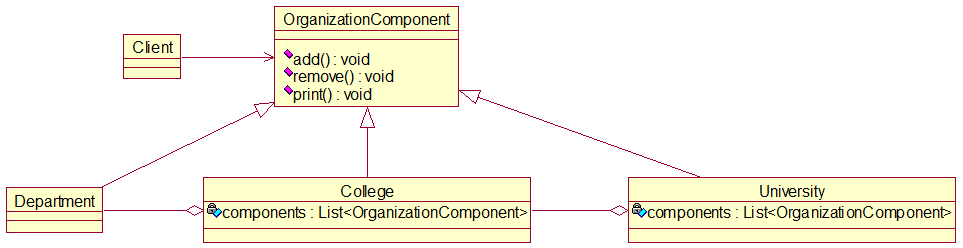

源代码如下：

```java
package composite;

/**
 * 对树状结构中各级结点的统一抽象
 * 
 * @author Van
 */
public abstract class OrganizationComponent {
	// 机构名
	private String name;
	// 描述
	private String description;

	public OrganizationComponent(String name, String description) {
		super();
		this.name = name;
		this.description = description;
	}

	public String getName() {
		return name;
	}

	public void setName(String name) {
		this.name = name;
	}

	public String getDescription() {
		return description;
	}

	public void setDescription(String description) {
		this.description = description;
	}

	/**
	 * 增加子组件。不用abstract修饰，叶子结点不必重写add方法
	 */
	protected void add(OrganizationComponent component) {
		// 默认实现
		throw new UnsupportedOperationException();
	}

	/**
	 * 删除子组件。不用abstract修饰，叶子结点不必重写remove方法
	 */
	protected void remove(OrganizationComponent component) {
		// 默认实现
		throw new UnsupportedOperationException();
	}

	/**
	 * 打印本组件信息。无论叶子结点还是非叶子结点，都要print方法，故用abstract修饰
	 */
	protected abstract void print();
}
```

```java
package composite;

import java.util.LinkedList;
import java.util.List;

/**
 * 大学组件类，管理下一级院系组件
 * 
 * @author Van
 */
public class University extends OrganizationComponent {

	// 院系列表
	private List<OrganizationComponent> components = new LinkedList<OrganizationComponent>();

	public University(String name, String description) {
		super(name, description);
	}

	@Override
	protected void add(OrganizationComponent component) {
		components.add(component);
	}

	@Override
	protected void remove(OrganizationComponent component) {
		components.remove(component);
	}

	/**
	 * 打印所含院系
	 */
	@Override
	protected void print() {
		System.out.println("======" + getName() + "======");
		for (OrganizationComponent component : components)
			component.print();
	}

}
```

```java
package composite;

import java.util.LinkedList;
import java.util.List;

/**
 * 院系组件类，管理下一级专业组件
 * 
 * @author Van
 */
public class College extends OrganizationComponent {

	// 专业列表
	List<OrganizationComponent> components = new LinkedList<OrganizationComponent>();

	public College(String name, String description) {
		super(name, description);
	}

	@Override
	protected void add(OrganizationComponent component) {
		components.add(component);
	}

	@Override
	protected void remove(OrganizationComponent component) {
		components.remove(component);
	}

	@Override
	protected void print() {
		System.out.println("  " + getName());
		for (OrganizationComponent component : components)
			component.print();
	}

}
```

```java
package composite;

/**
 * 目前专业组件类是叶子结点，无下一级组件可管理，无需重写add和remove方法
 * 
 * @author Van
 */
public class Department extends OrganizationComponent {

	public Department(String name, String description) {
		super(name, description);
	}

	@Override
	protected void print() {
		System.out.println("      " + getName());
	}

}
```

```java
package composite;

import org.junit.jupiter.api.Test;

/**
 * 测试
 * 
 * @author Van
 */
class ClientTest {

	@Test
	void testUniversityInfo() {
		// 利用add方法组织起结构
		Department softwareEngineerDepartment = new Department("软件工程", "高薪就业");
		Department digitalMediaDepartment = new Department("数字媒体技术", "计算机和艺术的融合");
		Department folkDepartment = new Department("民俗学", "");
		Department chineseDepartment = new Department("中国文学", "最好的语言-汉语");
		Department foreignDepartment = new Department("外国文学", "外文");

		College computerCollege = new College("计算机学院", "最高薪的学院");
		computerCollege.add(softwareEngineerDepartment);
		computerCollege.add(digitalMediaDepartment);
		College chinaCollege = new College("国学院", "人文底蕴极深");
		chinaCollege.add(folkDepartment);
		College literaturecollege = new College("文学院", "才子佳人聚集之地");
		literaturecollege.add(chineseDepartment);
		literaturecollege.add(foreignDepartment);

		University university = new University("清华大学", "北大死敌");
		university.add(computerCollege);
		university.add(chinaCollege);
		university.add(literaturecollege);
		university.print();
	}

}
```

##### 小结

简化客户端操作。用户只需面对一致的对象而无需考虑结点是不是叶子结点。

扩展性强。当我们需要更改树状结构时，无需改动现有代码，只用增删一些组件（结点）。

组合模式很适用于处理具有树状结构的诸对象及遍历结构树的各级结点。

组合模式要求各级结点对象具有高度的相似性，可抽象出统一的抽象类或接口。那么方法或属性大不相同的类就不适合使用组合模式。

#### 外观模式（Facade Pattern）

此模式过于简单，存在感不强，也容易理解，故代码就不写了，仅作简要叙述。

大意是：调用一系列对象（子系统）的一系列方法来完成某个流程，传统方式即在客户端按部就班地一个个地调用这些方法，外观模式则创建一个“充门面”的接口，利用其中的若干方法将子系统的所有方法分门别类聚集，然后客户端只需使用接口，而无需了解内部细节。

特点：

- 对客户端屏蔽了子系统的内部构造，因而降低了客户端对子系统使用的复杂性。
- 降低了客户端与子系统的耦合关系，让子系统更容易维护和维护。
- 合理使用外观模式，可帮助我们更好地划分系统的层次，可类比三层架构。
- 注意不能过多地或不合理地使用外观模式，要以利于系统的层次化和维护性强为目的。

#### 享元模式（Flyweight Pattern）

##### 场景

有一个外包项目，给客户A做一个产品展示网站，随后又有客户B想要这个网站，不过他们的要求不尽相同：

- 有客户想以新闻的形式发布。
- 有客户想以博客的形式发布。
- 有客户想以微信公众号的形式发布。

分析可知，网站的相似度很高，且访问量都不大，如果分成多个虚拟空间来处理，即状态完全一样的网站对象实例很多，那么会造成服务器资源的浪费。

改进的思路是像单例模式那样，仅用一个网站，共享其中的代码和数据，对硬盘、CPU、内存、数据库等服务器资源都可达成共享。

对代码而言，由于只有一份实例，维护和扩展都更加容易。

##### 基本介绍

享元模式也叫蝇量模式，意为运用共享技术有效支持大量细粒度（难以再分）的对象。

常用于系统底层开发，提高系统性能。比如数据库连接池，它里面都是创建好的对象，我们可以直接拿来用，避免重新创建，若没有我们需要的，则在其中新建。这样一来就很好地解决相同实例的内存浪费问题。其他例子诸如：String常量池、缓冲池。

享元模式是池技术的重要实现方式。

##### 内部状态和外部状态

这两种状态是享元模式中的概念。享元模式提出两大要求：细粒度和共享对象，那么对象的信息就分为这两个部分。

内部状态指对象所共享的信息，存储在享元对象内部且不随环境改变而改变。

外部状态指依赖一个标记、随环境改变而改变、不可共享的对象信息。

##### 实现

类图如下：


源代码如下：

```java
package flyWeight;

/**
 * 抽象网站类
 * 
 * @author Van
 */
public abstract class Website {
	/**
	 * 指明由谁使用何种网站
	 */
	public abstract void use(User user);
}
```

```java
package flyWeight;

/**
 * 指明形式的具体站点类，继承抽象站点类
 * 
 * @author Van
 */
public class ConcreteWebsite extends Website {

	// 网站类别或发布形式
	private String catagory;

	public ConcreteWebsite(String catagory) {
		this.catagory = catagory;
	}

	@Override
	public void use(User user) {
		System.out.println("网站的发布形式为：" + catagory + "；" + "此类站点的使用者为：" + user.getName());
	}

}
```

```java
package flyWeight;

/**
 * 网站使用者
 * 
 * @author Van
 */
public class User {
	private String name;

	public User(String name) {
		this.name = name;
	}

	public String getName() {
		return name;
	}

	public void setName(String name) {
		this.name = name;
	}
}
```

```java
package flyWeight;

import java.util.HashMap;
import java.util.Map;

/**
 * 网站工厂类
 * 
 * @author Van
 */
public class WebsiteFactory {
	// 各形式站点的存放池
	private Map<String, ConcreteWebsite> websitePool = new HashMap<>();

	/**
	 * 从池中获取所需形式的站点对象
	 * 
	 * @return 某形式的站点对象
	 */
	public Website getWebsite(String catagory) {
		// 若指定类别的站点存在，则直接拿，否则先新加入该类别的站点，再拿
		if (websitePool.containsKey(catagory))
			return (ConcreteWebsite) websitePool.get(catagory);
		websitePool.put(catagory, new ConcreteWebsite(catagory));
		return (ConcreteWebsite) websitePool.get(catagory);
	}

	/**
	 * 统计一下站点池中有多少种站点
	 * 
	 * @return 站点类别总数
	 */
	public int getCatagoryCount() {
		return websitePool.size();
	}
}
```

```java
package flyWeight;

import org.junit.jupiter.api.Test;

/**
 * 测试类
 * 
 * @author Van
 */
class Client {

	@Test
	void testWebsiteCatagory() {
		WebsiteFactory websiteFactory = new WebsiteFactory();
		Website website1 = websiteFactory.getWebsite("新闻");
		website1.use(new User("小明"));

		Website website2 = websiteFactory.getWebsite("博客");
		website2.use(new User("小红"));
		Website website3 = websiteFactory.getWebsite("博客");
		website3.use(new User("小刚"));

		Website website4 = websiteFactory.getWebsite("微信公众号");
		website4.use(new User("小华"));
		Website website5 = websiteFactory.getWebsite("微信公众号");
		website5.use(new User("小张"));

		System.out.println("现有站点的总数为：" + websiteFactory.getCatagoryCount());
	}

}
```

#### 代理模式（Proxy Pattern）

##### 基本介绍

概念：为一个对象提供一个替身，以控制对这个对象的访问，即通过代理对象访问目标对象，好处是在目标对象基础上，增加额外的功能操作。

这样想：我想让目标对象满足OCP原则，很稳定，不修改，但又想随着环境的变化扩充其功能，那么代理对象就应运而生，我们可以通过创建多个代理对象来保留多种扩充，也让代理对象本身满足OCP原则。

目标对象可以是远程对象、创建时开销大的对象或需要安全控制的对象。

代理模式的形式有三种：静态代理、动态代理（jdk代理、接口代理）和Cglib（在内存中动态地创建对象，不需要实现接口，属动态代理范畴）代理。

使用代理模式时，要求被代理对象和代理对象实现相同的接口或继承相同的父类。

##### 应用实例

###### 静态代理

类图：


可以看出，若让多个目标对象实现接口，那么代理对象就能像AOP那样，给多个目标对象切入相同的扩展功能。也可创建多个代理对象给多个目标对象切入多种相同扩展功能。

还可以想：代理类的属性可不可写成：`target：Object`，借助多实现，该代理类就可以给实现不同接口的目标对象切入相同功能扩展，实用性强否？

源代码：

```java
package proxy.staticProxy;

/**
 * 目标对象和代理对象共同实现的接口
 * 
 * @author Van
 */
public interface ITeacherDao {
	/**
	 * 教学
	 */
	public void teach();
}
```

```java
package proxy.staticProxy;

/**
 * 目标对象或被代理对象
 * 
 * @author Van
 */
public class TeacherDaoImpl implements ITeacherDao {

	@Override
	public void teach() {
		System.out.println("正在教学中");
	}

}
```

```java
package proxy.staticProxy;

/**
 * 代理对象
 * 
 * @author Van
 */
public class TeacherDaoProxy implements ITeacherDao {

	private ITeacherDao teacherDao;

	public TeacherDaoProxy(ITeacherDao teacherDao) {
		this.teacherDao = teacherDao;
	}

	/**
	 * 扩展目标对象的功能
	 */
	@Override
	public void teach() {
		System.out.println("在前面扩展功能");
		teacherDao.teach();
		System.out.println("在后面扩展功能");
	}

}
```

```java
package proxy.staticProxy;

import org.junit.jupiter.api.Test;

/**
 * 测试类
 * 
 * @author Van
 */
public class ClientTest {
	@Test
	void testStaticProxy() {
		ITeacherDao teacherDaoProxy = new TeacherDaoProxy(new TeacherDaoImpl());
		teacherDaoProxy.teach();
	}
}
```

优点：在不修改目标对象的前提下，能通过代理对象对其进行功能扩展。

缺点：可能会有很多代理类，不好管理；一旦接口增加很多方法，目标对象和代理对象就都要写很多，难以维护。

###### 动态代理

代理对象不需要实现接口，但目标对象要实现。

利用JDK的API动态地在内存中生成代理对象。代理类所在包：java.lang.reflect.Proxy，具体是使用newProxyInstance方法。

类图：


源代码：

```java
package proxy.dynamicProxy;

/**
 * 目标对象实现的接口
 * 
 * @author Van
 */
public interface ITeacherDao {
	/**
	 * 教学
	 */
	public void teach();
}
```

```java
package proxy.dynamicProxy;

/**
 * 目标对象
 * 
 * @author Van
 */
public class TeacherDaoImpl implements ITeacherDao {

	@Override
	public void teach() {
		System.out.println("正在教学中");
	}

}
```

```java
package proxy.dynamicProxy;

import java.lang.reflect.InvocationHandler;
import java.lang.reflect.Method;
import java.lang.reflect.Proxy;

/**代理对象工厂，利用反射技术生成为聚合的目标对象创建代理对象
 * @author Van
 */
public class ProxyFactory {
	private Object teacherDao;

	public ProxyFactory(Object teacherDao) {
		this.teacherDao = teacherDao;
	}

	public Object getProxyInstance() {
		/*
		 * public static Object newProxyInstance(
		 *     ClassLoader loader,    当前目标对象使用的类加载器
		 *     Class<?>[]interfaces,  目标对象实现的接口类型，使用泛型确认类型
		 *     InvocationHandler h    执行目标对象的方法时，会触发事件处理器
		 * )
		 */ 
		return Proxy.newProxyInstance(teacherDao.getClass().getClassLoader(), teacherDao.getClass().getInterfaces(),
				new InvocationHandler() { 

					@Override
					public Object invoke(Object proxy, Method method, Object[] args) throws Throwable {
						System.out.println("JDK代理开始");
						//利用反射机制调用目标对象的方法
						Object returnValue = method.invoke(teacherDao, args);
						System.out.println("JDK代理提交");
						return returnValue;
					}
				});
	}
}
```

```java
package proxy.dynamicProxy;

import org.junit.jupiter.api.Test;

/**
 * 测试类
 * 
 * @author Van
 */
class ClientTest {

	@Test
	void testDynamicProxy() {
		// 目标对象
		ITeacherDao teacherDao = new TeacherDaoImpl();
		// 将目标对象送进代理工厂，生成ITeacherDao的代理对象
		ProxyFactory proxyFactory = new ProxyFactory(teacherDao);
		ITeacherDao teacherDaoProxy = (ITeacherDao) proxyFactory.getProxyInstance();
		// teacherDaoProxy = class com.sun.proxy.$Proxy8。$符号表示该对象是代理对象
		System.out.println("teacherDaoProxy = " + teacherDaoProxy.getClass());
		teacherDaoProxy.teach();
	}

}
```

###### Cglib代理

静态代理和动态代理都要求目标对象实现一个接口，但有时目标对象就是一个单独的对象，并没有实现接口，这时可用目标对象的子对象来完成代理，从而引出Cglib代理。

Cglib代理又叫子类代理，是在内存中动态构建一个子类对象从而实现对目标对象的功能扩展。

Cglib是一个强大的高性能的代码生成包，它可以在运行期实现扩展java类与实现java接口，因而广泛用于AOP框架，以实现方法拦截。

Cglib的底层是通过字节码处理框架ASM来转换字节码并生成新的类。

需要引入4个jar包：

- asm.jar。
- asm-commons.jar。
- asm-tree.jar。
- cglib.jar。

类图如下：


源代码如下：

```java
package proxy.cglib;

/**
 * 目标对象
 * 
 * @author Van
 */
public class TeacherDao {
	public void teach() {
		System.out.println("老师授课中，使用Cglib代理，不需实现任何接口");
	}
}
```

```java
package proxy.cglib;

import java.lang.reflect.Method;

import net.sf.cglib.proxy.Enhancer;
import net.sf.cglib.proxy.MethodInterceptor;
import net.sf.cglib.proxy.MethodProxy;

/**
 * 代理对象工厂，生产代理对象
 * 
 * @author Van
 */
public class ProxyFactory implements MethodInterceptor {

	// 目标对象
	private Object teacherDao;

	public ProxyFactory(Object teacherDao) {
		this.teacherDao = teacherDao;
	}

	/**
	 * 重写接口里的方法，调用目标对象的方法
	 */
	@Override
	public Object intercept(Object arg0, Method method, Object[] args, MethodProxy arg3) throws Throwable {
		System.out.println("Cglib代理模式开启");
		Object returnValue = method.invoke(teacherDao, args);
		System.out.println("Cglib代理模式提交");
		return returnValue;
	}

	/**
	 * 返回目标对象的代理对象
	 * 
	 * @return
	 */
	public Object getProxyInstance() {
		// 创建工具栏
		Enhancer enhancer = new Enhancer();
		// 设置父类
		enhancer.setSuperclass(teacherDao.getClass());
		// 设置回调函数
		enhancer.setCallback(this);
		// 创建子类对象即代理对象
		return enhancer.create();
	}

}
```

```java
package proxy.cglib;

import org.junit.jupiter.api.Test;

/**
 * 测试类
 * 
 * @author Van
 */
class ClientTest {

	@Test
	void testCglibProxy() {
		// 创建目标对象
		TeacherDao teacherDao = new TeacherDao();
		// 获取目标对象的代理对象
		TeacherDao teacherDaoProxy = (TeacherDao) new ProxyFactory(teacherDao).getProxyInstance();
		// 调用代理对象的方法，一经执行就会触发intercept方法的执行
		teacherDaoProxy.teach();
	}

}
```

##### 变体

代理模式的变体有：防火墙代理、缓存代理、远程代理、同步代理等。

### 行为型模式

#### 模板模式（Tempalte Pattern）

##### 场景

编写制作豆浆的程序，说明如下：

- 流程：选材->添加配料->浸泡->放到豆浆机打碎。
- 通过添加不同配料，可以制作出不同口味的豆浆。
- 选材、浸泡和打碎这几个步骤对于制作每种口味的豆浆都是一样的。（这不跟制作披萨一样吗，而且选材选了个寂寞？都不同口味了，选材能一样？）
- 直接使用模板方法模式完成。因为模板模式比较简单，能直接想到。

##### 基本介绍

模板方法模式（Template Method Pattern），又叫模板模式，即在一个抽象类中公开定义方法的模板，其子类按需重写方法以实现，但调用抽象类中的方法执行。

模板方法模式就是定义一项操作的算法骨架，而将步骤细节延迟到子类中，使得实现各种各样的细节的子类都遵照统一的算法结构（模板）。

该模式属行为型模式。

##### 实现

类图：


源代码：

```java
package template;

/**
 * 豆浆制作模板类
 * 
 * @author Van
 */
public abstract class SoymilkMakeTemplate {
	/**
	 * 完整制作，不用重写
	 */
	public final void make() {
		selectMaterial();
		addCondiment();
		soakBean();
		beatBean();
	}

	/**
	 * 第一步：挑食材
	 */
	public void selectMaterial() {
		System.out.println("开始挑选食材");
	}

	/**
	 * 第二部：加配料
	 */
	public abstract void addCondiment();

	/**
	 * 第三部：泡豆子
	 */
	public void soakBean() {
		System.out.println("开始浸泡豆子");
	}

	/**
	 * 第四步：打豆子
	 */
	public void beatBean() {
		System.out.println("开始打豆子");
	}
}
```

```java
package template;

/**
 * 黑豆豆浆的制作类
 * 
 * @author Van
 */
public class BlackBeanSoymilkMake extends SoymilkMakeTemplate {

	@Override
	public void addCondiment() {
		System.out.println("加入黑豆");
	}

}
```

```java
package template;

/**
 * 红豆豆浆制作类
 * 
 * @author Van
 */
public class RedBeanSoymilkMak extends SoymilkMakeTemplate {

	@Override
	public void addCondiment() {
		System.out.println("加入红豆");
	}

}
```

```java
package template;

/**
 * 花生豆浆制作类
 * 
 * @author Van
 */
public class PeanutSoymilkMake extends SoymilkMakeTemplate {

	@Override
	public void addCondiment() {
		System.out.println("加入花生");
	}

}
```

```java
package template;

import org.junit.jupiter.api.Test;

/**
 * 测试类
 * 
 * @author Van
 */
class ClientTest {

	@Test
	void testBlackBean() {
		SoymilkMakeTemplate blackBeanMake = new BlackBeanSoymilkMake();
		blackBeanMake.make();
	}

	@Test
	void testRedBean() {
		SoymilkMakeTemplate redBeanMake = new RedBeanSoymilkMak();
		redBeanMake.make();
	}

	@Test
	void testPeanut() {
		SoymilkMakeTemplate peanutMake = new PeanutSoymilkMake();
		peanutMake.make();
	}

}
```

##### 钩子方法

在模板方法模式的父类中可以定义一个钩子方法，它不做任何事，即空实现，子类视情况决定覆不覆盖它。

比如用上面做豆浆的例子，我们希望做纯豆浆，不添加任何配料，可用钩子方法实现。

修改父类：

```java
package template;

/**
 * 豆浆制作模板类
 * 
 * @author Van
 */
public abstract class SoymilkMakeTemplate {
	/**
	 * 完整制作，不用重写
	 */
	public final void make() {
		selectMaterial();
		if (customizeCondiment())
			addCondiment();
		soakBean();
		beatBean();
	}

	/**
	 * 第一步：挑食材
	 */
	public void selectMaterial() {
		System.out.println("开始挑选食材");
	}

	/**
	 * 第二部：加配料
	 */
	public abstract void addCondiment();

	/**
	 * 第三部：泡豆子
	 */
	public void soakBean() {
		System.out.println("开始浸泡豆子");
	}

	/**
	 * 第四步：打豆子
	 */
	public void beatBean() {
		System.out.println("开始打豆子");
	}

	/**
	 * 自制定要不要配料
	 * 
	 * @return true：加；false：不加
	 */
	public boolean customizeCondiment() {
		// 默认要加
		return true;
	}
}
```

新增纯豆浆类：

```java
package template;

/**
 * 纯豆浆，什么配料都不加
 * 
 * @author Van
 */
public class PureSoymilkMake extends SoymilkMakeTemplate {

	/**
	 * 不加配料
	 */
	@Override
	public boolean customizeCondiment() {
		return false;

	}

	@Override
	public void addCondiment() {
		// 空实现
	}

}
```

测试：

```java
@Test
void testPure() {
    SoymilkMakeTemplate pureSoymilkMake = new PureSoymilkMake();
    pureSoymilkMake.make();
}
```

当然想做出纯豆浆不一定非要用钩子方法，也可去掉final关键字，直接在子类重写make方法。

##### 小结

即统一了算法，又提供了很大的灵活性。这体现在父类留有大部分统一的方法又提供部分方法给子类按需实现。

不足之处：子类个数可能过多，使得系统十分庞大。

一般而言，模板方法都需加上final关键字，以阻止子类覆盖。

使用场景：完成某个过程，该过程的步骤中大部分是稳定的，极个别的在实现时是可变的。

#### 命令模式（Command Pattern）

##### 场景

我们买了一套智能家电，它们来自不同的厂家，只需在手机上安装一个APP就可控制它们工作。

要实现一个APP控制所有家电，则需每个智能家电厂家都提供一个统一的接口供APP调用，这时可考虑用命令模式。

命令模式将动作的请求者从动作的执行者从解耦出来。本例中，动作的请求者是手机APP，动作的执行者是各个厂家的智能家电产品。

##### 基本介绍

结合多态思想理解，在软件设计中，我们经常需要向某些对象发送请求，但事先不知道请求的接收者是谁或它们随机而变，也不知道它们具体的操作（一般是各不相同的）。那么我们可在程序运行时指定具体的请求接收者（符合运行时多态的思想）。

命令模式就消除了命令的请求者和接收者之间的耦合，通过在两者之间加一个缓冲层-命令对象。

命令模式将一个请求或命令封装为一个对象，并凭不同的接收者对象入参表示不同的命令，指定不同的接收者，同时还支持撤销操作。

原理类图：

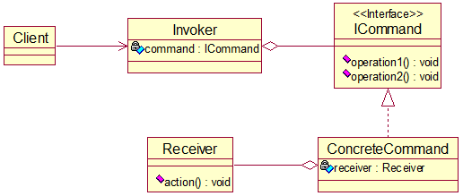

##### 实现

类图：

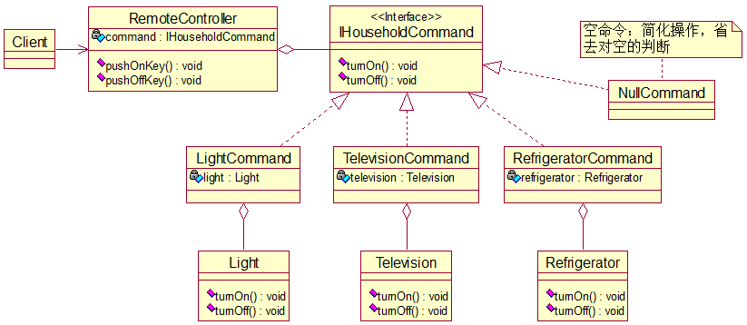

上面这个类图跟老师画的思路不一样，结因本模式听得有点绕，不好理解，==待日后进一步学习==。

源代码亦省略，可参考eclipse里的相应项目。

##### 小结

命令对象起到命令的请求者和接收者之间的纽带桥梁作用。

容易设计一个命令队列，把命令对象放到命令队列，就可以多线程地执行命令。

容易实现对请求的撤销和重做。

不足：可能导致系统有过多的具体命令类，增加系统的复杂度。

命令模式的经典应用场景：界面的每个按钮都是一条命令、模拟CMD订单的撤销和恢复、触发-反馈机制。

#### 访问者模式（Visitor Pattern）

##### 场景

完成一个歌手测评系统：将观众分成男人和女人，当看完一个歌手的表演后，分两拨对同一名歌手进行测评（成功或失败）。

传统方式即继承，从Person类派生出Man和Woman。如果系统比较小，还是不错，但如果系统增加越来越多的功能，对代码改动比较大，就违反OCP，不好维护。另外，扩展性不好，比如增加新的人员类型或管理方法都不好弄。

##### 基本介绍

概念：封装一些作用于某些数据结构的各元素的操作，它可以在不改变数据结构的前提下定义作用于这些元素的新操作。

主要将数据结构和数据操作分离，解决数据结构和数据操作的耦合性问题。

基本工作原理：在被访问的类里面加一个对外提供接待访问者的接口。

原理类图：

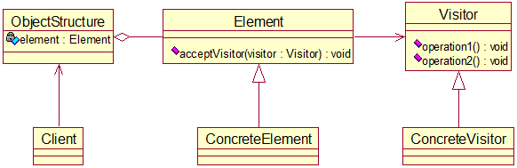

##### 实现

类图：


源代码省略，参考eclipse里的相应项目。

思索：能不能把Assess类中的两个方法合并为一个，并去掉该方法的参数，即取消双关联？原样式的优点在哪儿呢？

##### 双分派

是指不管类怎么变化，我们都能找到期望的方法运行。（迷之解释）

意味着得到执行的操作取决于请求的种类和两个接收者的类型。

##### 小结

优点：符合单一职责原则，扩展性好、灵活性高。适合数据结构相对稳定的系统。

缺点：访问者关注了其他类的内部细节，违反了迪米特法则；违背依赖倒转原则，使用了具体元素，而不是使用抽象元素。

#### 迭代器模式（Iterator Pattern）

##### 场景

为[组合模式](#组合模式（Composite Pattern）)中的三级机构创建统一的遍历操作。

##### 基本介绍

如果我们的集合元素是用不同方式实现的，如数组、集合或其他方式，那么遍历这些集合元素就得靠不同的遍历方式，且会暴露其内部结构。由此引出更好的办法-迭代器模式。

原理类图：


图例：

- Iterator：系统提供的迭代器接口，其三个方法也是内置的。
- ConcreteIterator：具体的迭代器，管理迭代。
- Aggregate：一个统一的聚合接口，将客户端和具体聚合解耦，提供一个返回迭代器的方法。
- ConcreteAggregate：具体的聚合，持有对象集合。
- Client：通过Aggregate接口和Iterator接口依赖两者的具体实现类。

##### 实现

类图：

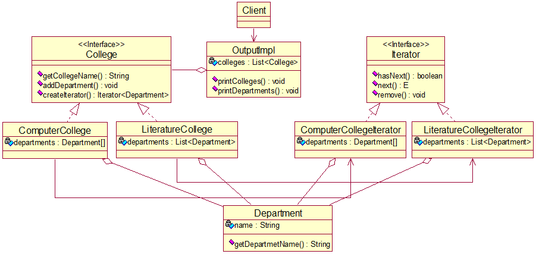

源代码：

```java
package iterator;

/**
 * 专业类
 * 
 * @author Van
 */
public class Department {
	// 专业名
	private String name;

	public Department(String name) {
		this.name = name;
	}

	public String getDepartmentName() {
		return name;
	}
}
```

```java
package iterator;

import java.util.Iterator;

/**
 * 计算机学院迭代器
 * 
 * @author Van
 */
public class ComputerCollegeIterator implements Iterator<Department> {

	// 下属专业（由外部指定）
	private Department[] departments;
	// 遍历到的当前下标
	private int position = -1;

	public ComputerCollegeIterator(Department[] departments) {
		this.departments = departments;
	}

	@Override
	public boolean hasNext() {
		// 下一个下标越界或下一个元素引用null
		if (position + 1 >= departments.length || departments[position + 1] == null)
			return false;
		// 后移1位
		position++;
		return true;
	}

	@Override
	public Department next() {
		// 取当前元素
		return departments[position];
	}

}
```

```java
package iterator;

import java.util.Iterator;
import java.util.List;

/**
 * 文学院迭代器
 * 
 * @author Van
 */
public class LiteratureCollegeIterator implements Iterator<Department> {

	// 下属专业（由外部指定）
	private List<Department> departments;
	// 遍历到的当前索引
	private int index = -1;

	public LiteratureCollegeIterator(List<Department> departments) {
		this.departments = departments;
	}

	@Override
	public boolean hasNext() {
		if (index + 1 >= departments.size())
			return false;
		// 后移1位
		index++;
		return true;
	}

	@Override
	public Department next() {
		// 取当前元素
		return departments.get(index);
	}

}
```

```java
package iterator;

import java.util.Iterator;

/**
 * 学院接口
 * 
 * @author Van
 */
public interface College {
	/**
	 * 返回学院名
	 * 
	 * @return
	 */
	String getCollegeName();

	/**
	 * 增加一个专业
	 * 
	 * @param name 专业名
	 */
	void addDepartment(String name);

	/**
	 * 返回一个作用于当前学院的迭代器
	 * 
	 * @return
	 */
	Iterator<Department> createIterator();
}
```

```java
package iterator;

import java.util.Iterator;

/**
 * 计算机学院实现类
 * 
 * @author Van
 */
public class ComputerCollege implements College {

	// 学院名
	private String name = "计算机学院";
	// 下属专业
	private Department[] departments;
	// 数组当前对象总数
	private int departmentCount = 0;

	/**
	 * 在内部填好专业数组
	 */
	public ComputerCollege() {
		this.departments = new Department[10];
		departments[0] = new Department("数字媒体技术");
		departments[1] = new Department("软件工程");
		departments[2] = new Department("网络工程");
		departments[3] = new Department("计算机科学与技术");
		departments[4] = new Department("大数据");
	}

	@Override
	public String getCollegeName() {
		return name;
	}

	@Override
	public void addDepartment(String name) {
		// 装填当前元素
		departments[departmentCount] = new Department(name);
		// 预装填下一元素
		departmentCount++;
	}

	@Override
	public Iterator<Department> createIterator() {
		// 传入专业数组，返回作用其上的迭代器
		return new ComputerCollegeIterator(departments);
	}
}
```

```java
package iterator;

import java.util.ArrayList;
import java.util.Iterator;
import java.util.List;

/**
 * 文学院实现类
 * 
 * @author Van
 */
public class LiteratureCollege implements College {

	// 学院名
	private String name = "文学院";
	// 下属专业
	private List<Department> departments = new ArrayList<Department>();

	/**
	 * 内部填好专业列表
	 */
	public LiteratureCollege() {
		departments.add(new Department("中国文学系"));
		departments.add(new Department("外国文学系"));
		departments.add(new Department("甲骨文研究所"));
	}

	@Override
	public String getCollegeName() {
		return name;
	}

	@Override
	public void addDepartment(String name) {
		departments.add(new Department(name));
	}

	@Override
	public Iterator<Department> createIterator() {
		// 传入专业列表，返回作用其上的迭代器
		return new LiteratureCollegeIterator(departments);
	}

}
```

```java
package iterator;

import java.util.Iterator;
import java.util.List;

/**
 * 输出实现类，打印遍历结果
 * 
 * @author Van
 */
public class OutPutImpl {
	// 学院列表
	private List<College> colleges;

	/**
	 * 从外部传入学院列表
	 * 
	 * @param colleges 学院列表
	 */
	public OutPutImpl(List<College> colleges) {
		this.colleges = colleges;
	}

	/**
	 * 遍历打印所有学院，包括遍历打印各学院下属所有专业
	 */
	public void printColleges() {
		// 得到列表自带的迭代器
		Iterator<College> collegeIterator = colleges.iterator();
		while (collegeIterator.hasNext()) {
			College college = collegeIterator.next();
			System.out.println(college.getCollegeName());
			// 得到自制的学院迭代器，遍历其下所有专业
			Iterator<Department> departmentIterator = college.createIterator();
			printDepartments(departmentIterator);
		}
	}

	/**
	 * 遍历打印某学院下属所有专业
	 * 
	 * @param departmentIterator 作用于该学院的迭代器
	 */
	public void printDepartments(Iterator<Department> departmentIterator) {
		while (departmentIterator.hasNext())
			System.out.println("\t" + departmentIterator.next().getDepartmentName());
	}
}
```

```java
package iterator;

import java.util.ArrayList;
import java.util.List;

import org.junit.jupiter.api.Test;

/**
 * 测试类
 * 
 * @author Van
 */
class ClientTest {

	@Test
	void testMyIterator() {
		List<College> colleges = new ArrayList<College>();
		colleges.add(new ComputerCollege());
		colleges.add(new LiteratureCollege());
		OutPutImpl outPutImpl = new OutPutImpl(colleges);
		outPutImpl.printColleges();
	}

}
```

##### 小结

优点：隐藏聚合的内部结构；把管理对象集合和遍历对象集合的责任分开，互不干扰；适合遍历一组相似对象。

缺点：每个聚合对象都需要一个迭代器，类一多便不好管理。

#### 观察者模式（Observer Pattern）

##### 场景

天气预报项目需求：

- 气象站可以将每天测量到的温度、湿度、气压等数据以公告的形式发布出去。
- 需设计开放型API，便于其他第三方也能接入气象站获取数据。
- 提供温度、气压和湿度的接口。
- 测量数据一经更新，要及时知会第三方。

##### 普通方案

类图：


说明：通过getXXX方法，为第三方平台提供接口；当数据要更新（可设置一个定时器控制更新周期），通过changeData方法同步更新第三方的数据。

源代码：

```java
package observer.ordinary;

/**
 * 第三方平台类
 * 
 * @author Van
 */
public class CurrentConditions {
	// 温度、气压、湿度
	private float temperature;
	private float pressure;
	private float humidity;

	/**
	 * 更新天气数据并展示
	 * 
	 * @param temperature 温度
	 * @param pressure    气压
	 * @param humidity    湿度
	 */
	public void update(float temperature, float pressure, float humidity) {
		this.temperature = temperature;
		this.pressure = pressure;
		this.humidity = humidity;
		display();
	}

	/**
	 * 显示天气状况
	 */
	public void display() {
		System.out.println("the temperature now is: " + temperature);
		System.out.println("the pressure now is: " + pressure);
		System.out.println("the humidity now is: " + humidity);
	}
}
```

```java
package observer.ordinary;

/**
 * 天气数据类
 * 
 * @author Van
 */
public class WeatherData {
	// 温度、气压、湿度
	private float temperature;
	private float pressure;
	private float humidity;
	// 第三方对象
	private CurrentConditions currentConditions;

	public WeatherData(CurrentConditions currentConditions) {
		this.currentConditions = currentConditions;
	}

	/**
	 * 温度接口
	 * 
	 * @return
	 */
	public float getTemperature() {
		return temperature;
	}

	public void setTemperature(float temperature) {
		this.temperature = temperature;
	}

	/**
	 * 气压接口
	 * 
	 * @return
	 */
	public float getPressure() {
		return pressure;
	}

	public void setPressure(float pressure) {
		this.pressure = pressure;
	}

	/**
	 * 湿度接口
	 * 
	 * @return
	 */
	public float getHumidity() {
		return humidity;
	}

	public void setHumidity(float humidity) {
		this.humidity = humidity;
	}

	/**
	 * 自更新数据，然后同步到第三方
	 * 
	 * @param temperature
	 * @param pressure
	 * @param humidity
	 */
	public void updateInnerData(float temperature, float pressure, float humidity) {
        // 自更新
		this.temperature = temperature;
		this.pressure = pressure;
		this.humidity = humidity;
		// 同步
		changeOuterData();
	}

	/**
	 * 同步更新第三方数据
	 */
	public void changeOuterData() {
		currentConditions.update(getTemperature(), getPressure(), getHumidity());
	}
}
```

```java
package observer.ordinary;

import org.junit.jupiter.api.Test;

/**
 * 测试类
 * 
 * @author Van
 */
public class ClientTest {
	@Test
	void testWeather() {
		// 创建数据接入方
		CurrentConditions currentConditions = new CurrentConditions();
		// 创建数据提供方并与接入方相关联
		WeatherData weatherData = new WeatherData(currentConditions);
		// 联动更新数据
		weatherData.updateInnerData(30.0f, 150.0f, 40.0f);
		// 联动更新数据
		weatherData.updateInnerData(32.0f, 160.0f, 20.0f);
	}
}
```

问题分析：无法在运行时动态地添加新的第三方；添加新的第三方需通过聚合新的第三方对象，这违反了OCP。总而言之，不利于维护。

##### 原理

观察者模式：对象之间多对一依赖设计方案之一，被依赖的对象为subject，依赖对象为observer，subject通知observer变化。

##### 改进

类图：


源代码：

```java
package observer.observer;

/**
 * 被观察者接口
 * 
 * @author Van
 */
public interface ISubject {
	/**
	 * 注册一个新的观察者
	 * 
	 * @param observer
	 */
	void registerObserver(IObserver observer);

	/**
	 * 移除一个现有的观察者
	 * 
	 * @param observer
	 */
	void removeObserver(IObserver observer);

	/**
	 * 自更新数据，并知会所有观察者同步更新
	 * 
	 * @param temperature
	 * @param pressure
	 * @param humidity
	 * 
	 */
	public void updateInnerData(float temperature, float pressure, float humidity);

	/**
	 * 知会观察者更新数据
	 */
	void notifyObservers();
}
```

```java
package observer.observer;

/**
 * 观察者接口
 * 
 * @author Van
 */
public interface IObserver {
	/**
	 * 更新数据
	 * 
	 * @param temperature
	 * @param pressure
	 * @param humidity
	 */
	void update(float temperature, float pressure, float humidity);

	/**
	 * 显示天气状况
	 */
	public void display();
}
```

```java
package observer.observer;

import java.util.LinkedList;
import java.util.List;

/**
 * 被观察者接口的实现类-天气数据类
 * 
 * @author Van
 */
public class WeatherData implements ISubject {

	// 温度、气压、湿度
	private float temperature;
	private float pressure;
	private float humidity;
	// 观察者注册表
	List<IObserver> observers = new LinkedList<IObserver>();

	@Override
	public void updateInnerData(float temperature, float pressure, float humidity) {
		// 自更新
		this.temperature = temperature;
		this.pressure = pressure;
		this.humidity = humidity;
		// 同步更新
		notifyObservers();
	}

	@Override
	public void registerObserver(IObserver observer) {
		observers.add(observer);
	}

	@Override
	public void removeObserver(IObserver observer) {
		if (observers.contains(observer))
			observers.remove(observer);
	}

	@Override
	public void notifyObservers() {
		// 遍历观察者列表，逐个更新数据
		for (IObserver observer : observers)
			observer.update(this.temperature, this.pressure, this.humidity);
	}

}
```

```java
package observer.observer;

public class BaiduWeather implements IObserver {

	// 温度、气压、湿度
	private float temperature;
	private float pressure;
	private float humidity;

	@Override
	public void update(float temperature, float pressure, float humidity) {
		this.temperature = temperature;
		this.pressure = pressure;
		this.humidity = humidity;
	}

	@Override
	public void display() {
		System.out.println("======百度天气======");
		System.out.println("the temperature now is: " + temperature);
		System.out.println("the pressure now is: " + pressure);
		System.out.println("the humidity now is: " + humidity);
	}

}
```

```java
package observer.observer;

public class SinaWeather implements IObserver {

	// 温度、气压、湿度
	private float temperature;
	private float pressure;
	private float humidity;

	@Override
	public void update(float temperature, float pressure, float humidity) {
		this.temperature = temperature;
		this.pressure = pressure;
		this.humidity = humidity;

	}

	@Override
	public void display() {
		System.out.println("======新浪天气======");
		System.out.println("the temperature now is: " + temperature);
		System.out.println("the pressure now is: " + pressure);
		System.out.println("the humidity now is: " + humidity);
	}

}
```

```java
package observer.observer;

import org.junit.jupiter.api.Test;

/**
 * 测试类
 * 
 * @author Van
 */
class ClientTest {

	@Test
	void testWeather() {
		// 创建被观察者
		WeatherData weatherData = new WeatherData();
		// 注册两个第三方平台
		IObserver baiduWeather = new BaiduWeather();
		IObserver sinaWeather = new SinaWeather();
		weatherData.registerObserver(baiduWeather);
		weatherData.registerObserver(sinaWeather);
		// 更新及同步数据
		weatherData.updateInnerData(30.0f, 150.0f, 40.0f);
		// 第三方平台展示数据
		baiduWeather.display();
		sinaWeather.display();
		// 更新及同步数据
		weatherData.updateInnerData(32.0f, 160.0f, 20.0f);
		// 第三方平台展示数据
		baiduWeather.display();
		sinaWeather.display();
	}

}
```

##### 小结

优点：以集合的方式管理观察者，能够方便地注册、移除和通知。于是增加新的第三方平台就不会违背OCP。

#### 中介者模式（Mediator Pattern）

##### 场景

场景同[外观模式](#外观模式（Facade Pattern）)，即智能家电项目，控制各个家电协同工作。

传统方式的弊病：

- 当各电器对象的状态发生较大改变，且相互之间调用关系很复杂，那么改起来很麻烦。
- 各个电器对象彼此紧密联系，不满足解耦。
- 各电器对象之间所传递的消息（参数）也很繁杂，改起来很麻烦。
- 当系统新增一个电器对象，很可能对现有的各个行为进行大改，可维护性不理想。

##### 基本介绍

中介者模式用一个中介对象来封装一系列的对象交互，使得各个对象不需要显式地相互引用，从而使其结构松散，而且能独立地改变他们之间的交互。总之使得代码易于维护。

比如在MVC模式中，C即M和V的中介者，控制前后端交互。

原理类图：


这是个简图，更详细的参见下面的类图。

##### 实现

类图：


源代码：

```java
package mediator;

/**
 * 中介者抽象类-控制各种家电对象
 * 
 * @author Van
 */
public abstract class Mediator {
	/**
	 * 接收家电对象发来的消息
	 * 
	 * @param state 消息码
	 * @param name  家电名
	 */
	public abstract void getMessage(int state, String name);

	/**
	 * 注册一个家电对象
	 * 
	 * @param name      家电名
	 * @param household 家电对象
	 */
	public abstract void registerHousehold(String name, Household household);

	/**
	 * 发送消息
	 * 
	 * @param state 消息码
	 */
	public abstract void sendMessage(int state);
}
```

```java
package mediator;

/**
 * 智能家电抽象类
 * 
 * @author Van
 */
public abstract class Household {
	// 家电名
	private String name;
	// 依赖的中介者
	private Mediator mediator;

	public Household(String name, Mediator mediator) {
		this.name = name;
		this.mediator = mediator;
	}

	public String getName() {
		return name;
	}

	public Mediator getMediator() {
		return mediator;
	}

	/**
	 * 家电向中介者发送消息
	 * 
	 * @param state 消息码
	 */
	public abstract void sendMessage(int state);

	/**
	 * 开机
	 */
	public abstract void start();

	/**
	 * 关机
	 */
	public abstract void stop();
}
```

```java
package mediator;

import java.util.HashMap;
import java.util.Map;

/**
 * 中介者实现类-家电中介者类
 * 
 * @author Van
 */
public class HouseholdMediator extends Mediator {

	// 管理的家电对象映射
	private Map<String, Household> households;

	public HouseholdMediator() {
		households = new HashMap<String, Household>();
	}

	/**
	 * 核心方法：根据消息码和家电名取家电对象，进而控制该家电的下一步行为
	 */
	@Override
	public void getMessage(int state, String name) {
		if (households.containsKey(name)) {
			Household household = households.get(name);
			if (state == 1)
				household.start();
			else if (state == 0)
				household.stop();
		}
	}

	/**
	 * 注册家电，即将家电加入家电映射
	 */
	@Override
	public void registerHousehold(String name, Household household) {
		if (!households.containsKey(name))
			households.put(name, household);
	}

	@Override
	public void sendMessage(int state) {
		// TODO Auto-generated method stub

	}

}
```

```java
package mediator;

/**
 * 具体家电-时钟类
 * 
 * @author Van
 */
public class Alarm extends Household {

	/**
	 * 初始化时钟对象同时将其注册给中介者
	 * 
	 * @param name     家电名
	 * @param mediator 中介者对象
	 */
	public Alarm(String name, Mediator mediator) {
		super(name, mediator);
		mediator.registerHousehold(name, this);
	}

	@Override
	public void sendMessage(int state) {
		getMediator().getMessage(state, getName());
	}

	@Override
	public void start() {
		System.out.println("启动闹钟");
	}

	@Override
	public void stop() {
		System.out.println("关闭闹钟");
	}

}
```

```java
package mediator;

/**
 * 具体家电-咖啡机类
 * 
 * @author Van
 */
public class CoffeeMachine extends Household {

	/**
	 * 初始化咖啡机对象同时将其注册给中介者
	 * 
	 * @param name     家电名
	 * @param mediator 中介者对象
	 */
	public CoffeeMachine(String name, Mediator mediator) {
		super(name, mediator);
		mediator.registerHousehold(name, this);
	}

	@Override
	public void sendMessage(int state) {
		getMediator().getMessage(state, getName());
	}

	@Override
	public void start() {
		System.out.println("启动咖啡机");
	}

	@Override
	public void stop() {
		System.out.println("关闭咖啡机");
	}

}
```

```java
package mediator;

/**
 * 具体家电-电视机类
 * 
 * @author Van
 */
public class Television extends Household {

	/**
	 * 初始化咖啡机对象同时将其注册给中介者
	 * 
	 * @param name     家电名
	 * @param mediator 中介者对象
	 */
	public Television(String name, Mediator mediator) {
		super(name, mediator);
		mediator.registerHousehold(name, this);
	}

	@Override
	public void sendMessage(int state) {
		getMediator().getMessage(state, getName());
	}

	@Override
	public void start() {
		System.out.println("启动电视机");
	}

	@Override
	public void stop() {
		System.out.println("关闭电视机");
	}

}
```

```java
package mediator;

import org.junit.jupiter.api.Test;

/**
 * 测试类
 * 
 * @author Van
 */
class ClientTest {

	@Test
	void testMeidator() {
		// 创建中介者
		Mediator householdMediator = new HouseholdMediator();
		// 创建诸家电
		Household alarm = new Alarm("时钟", householdMediator);
		Household coffeeMachine = new CoffeeMachine("咖啡机", householdMediator);
		Household television = new Television("电视机", householdMediator);
		// 开工
		alarm.sendMessage(1);
		coffeeMachine.sendMessage(1);
		television.sendMessage(1);
		// 休工
		alarm.sendMessage(0);
		coffeeMachine.sendMessage(0);
		television.sendMessage(0);
	}

}

```

##### 小结

中介者模式的优缺点：

- 减少类间依赖，降低耦合。
- 中介者是系统中枢，作用最大，故一旦它出现问题，则系统就无法起作用。
- 如果设计不当，那么中介者对象本身的结构就很复杂，不利于维护。

#### 备忘录模式（Memento Pattern）

##### 场景

场景：游戏角色有攻击力和防御力，某角色在大战boss前备份了自身状态（攻击力和防御力），大战boss后他的攻击力和防御力下降了，现欲恢复其状态。

传统方式是一个游戏对象对应一个备忘录对象，这样不利于管理，开销也大，还通过new关键字暴露了备忘录对象的内部细节。

##### 基本介绍

概念：在不破坏封装性的前提下，捕获一个对象的内部状态，并在对象之外保存此状态，这样一来就可在未来将该对象恢复到此状态。

原理类图：

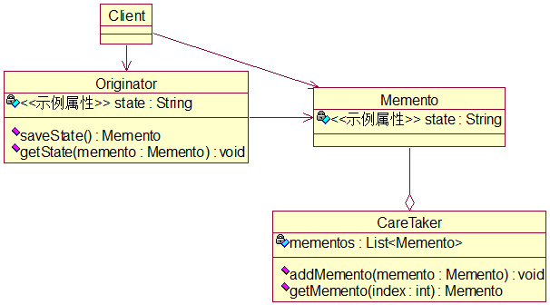

可将CareTaker里的mementos类型改为`Map<String, ArrayList<Memento>>`以存放不同Originator对象的不同状态。相应地，可在Originator中添加name属性以示对象区分。

##### 实现

源代码如下：

```java
package memento;

/**
 * 游戏角色类
 * 
 * @author Van
 */
public class GameRole {
	// 角色名、攻击力、防御力
	private String name;
	private int attackPower;
	private int defendPower;

	public GameRole(String name, int attackPower, int defendPower) {
		this.name = name;
		this.attackPower = attackPower;
		this.defendPower = defendPower;
	}

	public String getName() {
		return name;
	}

	public void setName(String name) {
		this.name = name;
	}

	public int getAttackPower() {
		return attackPower;
	}

	public void setAttackPower(int attackPower) {
		this.attackPower = attackPower;
	}

	public int getDefendPower() {
		return defendPower;
	}

	public void setDefendPower(int defendPower) {
		this.defendPower = defendPower;
	}

	@Override
	public String toString() {
		return "GameRole [name=" + name + ", attackPower=" + attackPower + ", defendPower=" + defendPower + "]";
	}

	/**
	 * 保存状态到新的备忘录
	 * 
	 * @return 备忘录对象
	 */
	public Memento saveState() {
		return new Memento(attackPower, defendPower);
	}

	/**
	 * 通过备忘录恢复到过去的某一状态
	 * 
	 * @param memento 备忘录对象
	 */
	public void getState(Memento memento) {
		attackPower = memento.getAttackPower();
		defendPower = memento.getDefendPower();
	}
}
```

```java
package memento;

/**
 * 备忘录类
 * 
 * @author Van
 */
public class Memento {
	// 攻击力、防御力
	private int attackPower;
	private int defendPower;

	public Memento(int attackPower, int defendPower) {
		this.attackPower = attackPower;
		this.defendPower = defendPower;
	}

	public int getAttackPower() {
		return attackPower;
	}

	public int getDefendPower() {
		return defendPower;
	}
}
```

```java
package memento;

import java.util.ArrayList;
import java.util.HashMap;
import java.util.List;
import java.util.Map;

/**
 * 备忘录的结构与操作类
 * 
 * @author Van
 */
public class CareTaker {
	// 备忘录映射
	private Map<String, ArrayList<Memento>> mementoMap;

	/**
	 * 针对每个角色名创建一个备忘录列表
	 * 
	 * @param names 角色名列表
	 */
	public CareTaker(List<String> names) {
		mementoMap = new HashMap<String, ArrayList<Memento>>();
		for (String name : names) {
			mementoMap.put(name, new ArrayList<Memento>());
		}
	}

	/**
	 * 向某角色的备忘录列表中添加新备忘录
	 * 
	 * @param name    角色名
	 * @param memento 备忘录对象
	 */
	public void addMemento(String name, Memento memento) {
		List<Memento> mementos = mementoMap.get(name);
		mementos.add(memento);
	}

	/**
	 * 得到某角色某一时刻的备忘录
	 * 
	 * @param name  角色名
	 * @param index 备忘录号
	 * @return
	 */
	public Memento getMemento(String name, int index) {
		return mementoMap.get(name).get(index);
	}
}
```

```java
package memento;

import java.util.ArrayList;
import java.util.List;

import org.junit.jupiter.api.Test;

/**
 * 测试类
 * 
 * @author Van
 */
class ClientTest {

	@Test
	void testMemento() {
		// 创造两种角色
		GameRole role1 = new GameRole("关公", 200, 100);
		GameRole role2 = new GameRole("秦琼", 200, 200);
		System.out.println("======原始状态======");
		System.out.println(role1);
		System.out.println(role2);
		// 存储原始状态
		List<String> names = new ArrayList<String>();
		names.add(role1.getName());
		names.add(role2.getName());
		CareTaker careTaker = new CareTaker(names);
		careTaker.addMemento(role1.getName(), role1.saveState());
		careTaker.addMemento(role2.getName(), role2.saveState());
		// 俩哥们大战boss，导致状态改变
		role1.setAttackPower(100);
		role1.setDefendPower(50);
		role2.setAttackPower(80);
		role2.setDefendPower(100);
		System.out.println("======大战boss后的状态======");
		System.out.println(role1);
		System.out.println(role2);
		// 俩哥们恢复状态
		role1.getState(careTaker.getMemento(role1.getName(), 0));
		role2.getState(careTaker.getMemento(role2.getName(), 0));
		System.out.println("======恢复状态======");
		System.out.println(role1);
		System.out.println(role2);
	}

}
```

##### 小结

给用户提供一个恢复状态的机制。

实现了状态的封装，使用户不必了解机制的实现细节。

若类的成员变量过多，则每次备忘都会占用很多内存。

应用场景：存档、撤销、数据库的事务管理等等。

为了节省内存，可将备忘录模式和原型模式搭配使用。

#### 解释器模式（Interpreter Pattern）

##### 基本介绍

原理类图：


说明：

- Context：环境角色，含有解释器之外的全局信息。
- AbstractExpression：抽象表达式，声明抽象的解释操作，其中方法为抽象方法树上的所有结点共享。
- TerminalExpression：终结符表达式，实现与文法中的终结符相关的解释操作。
- NonTerminalExpression：非终结表达式，实现与文法中的非终结符相关的解释操作。
- Client：输入Context和TerminalExpression的信息。

##### 实现

利用解释器模式实现四则运算，如a+b-c。

类图：

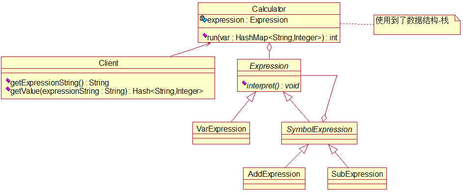

由于很难理解且==尚未理解==，源代码省略，可参考eclipse里的相应项目。

##### 小结

应用场景：编译器、运算表达式、正则表达式、机器人。

问题：此模式可能会引起类膨胀。另外，采用递归调用的方法会导致调试非常复杂，还降低运行效率。

#### 状态模式（State Pattern）

##### 基本介绍

状态模式主要解决对象在多种状态之间转换时，需要对外输出不同行为的问题。状态和行为是一一对应的，状态之间相互转换。当一个对象的内在状态改变时，允许改变其行为。

原理类图：


##### 实现

用此模式实现一个APP抽奖活动。

该活动的状态图如下：

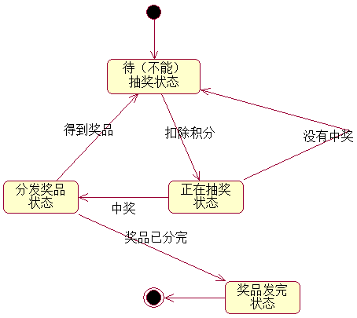

类图：

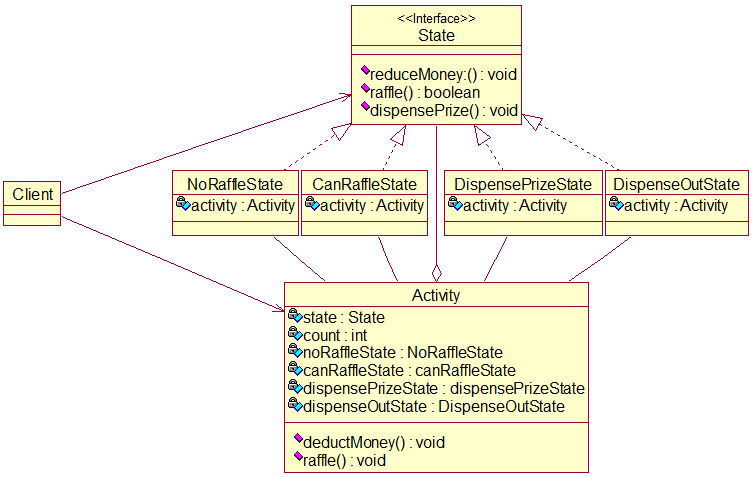


其中，最后一个状态类DispenseOutState看起来很尴尬，因为在奖品送完的情况我还是扣除了积分。另外，图中最亮眼的就是Activity和四个实现类的互关联，注意理解运行逻辑。

源代码：

```java
package state;

/**
 * 状态接口
 * 
 * @author Van
 */
public interface State {
	/**
	 * 扣除积分，准备抽奖
	 */
	void reduceMoney();

	/**
	 * 能否抽奖
	 * 
	 * @return true：能；false：否
	 */
	boolean raffle();

	/**
	 * 抽完奖且中奖，分发奖品
	 */
	void dispensePrize();
}
```

```java
package state;

/**
 * 不能抽奖的状态类
 * 
 * @author Van
 */
public class NoRaffleState implements State {

	// 抽奖活动对象
	private Activity activity;

	public NoRaffleState(Activity activity) {
		this.activity = activity;
	}

	@Override
	public void reduceMoney() {
		// 当前状态可扣积分
		System.out.println("【不能抽奖状态】正在扣除积分");
		activity.setState(activity.getCanRaffleState());
	}

	@Override
	public boolean raffle() {
		// 当前状态不能抽奖
		System.out.println("【不能抽奖状态】扣除积分后才能抽奖");
		return false;
	}

	@Override
	public void dispensePrize() {
		// 当前状态不能发放奖品
		System.out.println("【不能抽奖状态】抽了奖后才能进一步看结果，以决定是否发放奖品");
	}

}
```

```java
package state;

import java.util.Random;

/**
 * 可抽奖状态类
 * 
 * @author Van
 */
public class CanRaffleState implements State {

	// 抽奖活动对象
	private Activity activity;

	public CanRaffleState(Activity activity) {
		this.activity = activity;
	}

	@Override
	public void reduceMoney() {
		// 当前状态无需再扣除积分
		System.out.println("【已在抽奖状态】已扣除积分");
	}

	@Override
	public boolean raffle() {
		// 当前状态可抽奖，10%的中奖概率
		System.out.println("【已在抽奖状态】正在抽奖");
		// 利用随机数模拟抽奖
		Random random = new Random();
		int number = random.nextInt(10);
		if (number == 0) {
			System.out.println("恭喜您中奖了！");
			// 转到分发奖品状态
			activity.setState(activity.getDispensePrizeState());
			return true;
		} else {
			System.out.println("很遗憾，您没有中奖");
			// 转到不抽奖状态
			activity.setState(activity.getNoRaffleState());
			return false;
		}
	}

	@Override
	public void dispensePrize() {
		// 当前状态不能分发奖品，结果还没出来
		System.out.println("【已在抽奖状态】尚不能分发奖品，待结果出来才能分发奖品");
	}

}
```

```java
package state;

/**
 * 分发奖品状态类
 * 
 * @author Van
 */
public class DispensePrizeState implements State {

	// 抽奖活动对象
	private Activity activity;

	public DispensePrizeState(Activity activity) {
		this.activity = activity;
	}

	@Override
	public void reduceMoney() {
		// 当前状态无需再扣除积分
		System.out.println("【发放奖品状态】已扣除积分");
	}

	@Override
	public boolean raffle() {
		// 当前状态已过抽奖环节
		System.out.println("【发放奖品状态】已抽过奖");
		return false;
	}

	@Override
	public void dispensePrize() {
		// 当前状态可分发奖品
		int currentCount = activity.getCount();// 当前奖品数
		if (currentCount > 0) {
			System.out.println("正在为您发放奖品，您得到的是第" + currentCount + "个奖品");
			// 转到不抽奖状态
			activity.setState(activity.getNoRaffleState());
		} else {
			System.out.println("很遗憾，您来迟一步，奖品已发完");
			// 转到奖品发完状态
			activity.setState(activity.getDispenseOutState());
		}
	}

}
```

```java
package state;

/**
 * 奖品分完状态类，标志活动完全结束
 * 
 * @author Van
 */
public class DispenseOutState implements State {

	// 抽奖活动对象
	private Activity activity;

	public DispenseOutState(Activity activity) {
		this.activity = activity;
	}

	@Override
	public void reduceMoney() {
		// 当前状态不允许扣除积分
		System.out.println("【奖品发完状态】活动已结束，请下次再来参加");
	}

	@Override
	public boolean raffle() {
		// 当前状态不允许抽奖
		System.out.println("【奖品发完状态】活动已结束，请下次再来参加");
		return false;
	}

	@Override
	public void dispensePrize() {
		// 当前状态不允许分发奖品
		System.out.println("【奖品发完状态】活动已结束，请下次再来参加");
	}

	public Activity getActivity() {
		return activity;
	}

}
```

```java
package state;

/**
 * 抽奖活动类
 * 
 * @author Van
 */
public class Activity {
	// 抽奖活动的当前状态
	private State state;
	// 奖品数量
	private int count = 0;
	// 组合抽奖活动的四种状态
	private NoRaffleState noRaffleState = new NoRaffleState(this);
	private CanRaffleState canRaffleState = new CanRaffleState(this);
	private DispensePrizeState dispensePrizeState = new DispensePrizeState(this);
	private DispenseOutState dispenseOutState = new DispenseOutState(this);

	public Activity(int count) {
		// 初始是不能抽奖状态
		this.state = getNoRaffleState();
		this.count = count;
	}

	public void setState(State state) {
		this.state = state;
	}

	public int getCount() {
		// 先返回当前奖品数，再将其减1
		return count--;
	}

	public NoRaffleState getNoRaffleState() {
		return noRaffleState;
	}

	public CanRaffleState getCanRaffleState() {
		return canRaffleState;
	}

	public DispensePrizeState getDispensePrizeState() {
		return dispensePrizeState;
	}

	public DispenseOutState getDispenseOutState() {
		return dispenseOutState;
	}

	/**
	 * 调用当前状态的reduceMoney方法
	 */
	public void deductMoney() {
		state.reduceMoney();
	}

	/**
	 * 若当前状态的raffle方法为真，则调用当前状态的dispensePrize方法
	 * 
	 * @return
	 */
	public void raffle() {
		if (state.raffle())
			state.dispensePrize();
	}

}
```

```java
package state;

import org.junit.jupiter.api.Test;

/**
 * 测试类
 * 
 * @author Van
 */
class ClientTest {

	@Test
	void testState() {
		// 创建抽奖活动对象，指定初始奖品数为1
		Activity activity = new Activity(10);
		// 连续抽300次
		for (int i = 0; i < 300; i++) {
			System.out.println("======第" + (i + 1) + "次抽奖======");
			// 先扣除积分，再抽奖
			activity.deductMoney();
			activity.raffle();
		}
	}

}
```

##### 小结

代码有很强的可读性，状态模式将每一个状态所能做的特定性为封装到对应的状态类中，而其中其他实现接口的方法就形同虚设。

方便维护，状态模式各不同行为分插到不同类中，若揉在一个类中，用if-else语句来整合则很容易出错，也不好理解。

符合OCP，容易增删状态。

如果状态很多，则对应的类也很多，这加大了维护难度。

#### 策略模式（Strategy pattern）

##### 场景

描述一个抽象的鸭子和诸多具体的鸭子

##### 传统方案

类图：


缺陷：有的子类从父类继承得到不合理的方法，如北京烤鸭飞。超类的局部改动，可能会带来溢出问题。为了解决这一问题，我们会用覆盖的方式，让北京烤鸭类重写fly方法。而如果子类覆盖大部分父类方法，就违反里氏替换原则，导致无意义继承。由此，引出更好的方案-策略模式。

##### 基本介绍

所谓策略，就是算法族，即一系列策略。策略模式就是定义算法族并将它们封装起来并让它们能够相互替换，从而使得算法独立于使用算法的客户，互不影响。

好处：把变化的代码从不变的代码中分离出来；针对接口编程；多用组合或聚合，而不用继承。

原理类图：


##### 改进

类图：

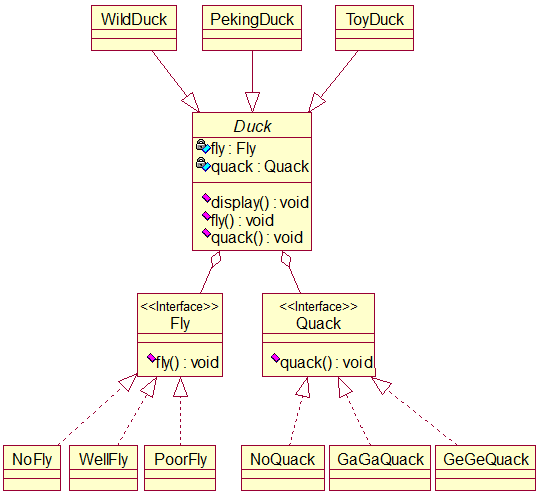

源代码过于繁琐，故省略，可参考eclipse里的对应项目。

##### 小结

本模式的关键：分析出项目中的可变部分和不可变部分。

本模式核心思想：多用组合或聚合，少用继承。用行为类的组合，而非行为类的继承。

体现了OCP，尤见于行为的添加与修改。

每添加一个策略（行为）就要增加一个行为类，策略过多就导致类爆炸。

#### 职责链模式（Chain of Responsibility Pattern）

##### 场景

学校OA系统的采购审批项目需求如下：

- 采购员采购教学器材。
- 若金额<=5000，则由教学主任（dean）审批。
- 若5000<金额<=10000，则由院长（principal）审批。
- 若10000<金额<30000，则由副校长（vice principal）审批。
- 若金额>30000，则有校党委书记（secretary）审批。

传统方式即接收到一个采购请求后，根据金额使用对应的审批人对象进行审批。而起核心作用的分支结构就存在着强耦合关系，不利于代码的扩展和维护。由此引出职责链模式。

##### 基本介绍

职责链模式又叫责任链模式，它为某个请求创造一个接收者对象链，对请求者和接收者进行解耦。那么这个链就体现在每个接收者都包含另一个接收者的引用，当前接收者若不能处理这一请求，则将其传递给下一个接收者，以此类推。

原理类图：


##### 实现

类图：

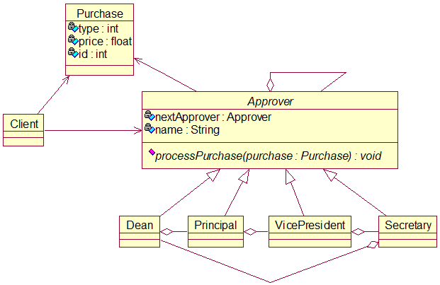

源代码：

```java
package chainOfResponsibility;

/**
 * 采购类
 * 
 * @author Van
 */
public class Purchase {
	// 类型、金额、编号
	private int type = 0;
	private float price = 0.0f;
	private int id = 0;

	public Purchase(int type, float price, int id) {
		this.type = type;
		this.price = price;
		this.id = id;
	}

	public int getType() {
		return type;
	}

	public float getPrice() {
		return price;
	}

	public int getId() {
		return id;
	}
}
```

```java
package chainOfResponsibility;

/**
 * 审批者类
 * 
 * @author Van
 */
public abstract class Approver {
	// 上一级或第一级审批者
	private Approver nextApprover;
	// 审批者名
	private String name;

	public Approver getNextApprover() {
		return nextApprover;
	}

	public void setNextApprover(Approver nextApprover) {
		this.nextApprover = nextApprover;
	}

	public String getName() {
		return name;
	}

	public void setName(String name) {
		this.name = name;
	}

	/**
	 * 处理采购
	 */
	public abstract void processPurchase(Purchase purchase);
}
```

```java
package chainOfResponsibility;

/**
 * 系主任类
 * 
 * @author Van
 */
public class Dean extends Approver {

	public Dean() {
		setName("系主任");
	}

	@Override
	public void processPurchase(Purchase purchase) {
		if (purchase.getPrice() <= 5000)
			System.out.println(getName() + "审批，请求编号为：" + purchase.getId());
		else {
			System.out.println(getName() + "不能审批，上交给上一级");
			getNextApprover().processPurchase(purchase);
		}
	}
}
```

```java
package chainOfResponsibility;

/**
 * 院长类
 * 
 * @author Van
 */
public class Principal extends Approver {

	public Principal() {
		setName("院长");
	}

	@Override
	public void processPurchase(Purchase purchase) {
		if (purchase.getPrice() > 5000 && purchase.getPrice() <= 10000)
			System.out.println(getName() + "审批，请求编号为：" + purchase.getId());
		else {
			System.out.println(getName() + "不能审批，上交给上一级");
			getNextApprover().processPurchase(purchase);
		}
	}

}
```

```java
package chainOfResponsibility;

/**
 * 副校长类
 * 
 * @author Van
 */
public class VicePresident extends Approver {

	public VicePresident() {
		setName("副校长");
	}

	@Override
	public void processPurchase(Purchase purchase) {
		if (purchase.getPrice() > 10000 && purchase.getPrice() <= 30000)
			System.out.println(getName() + "审批，请求编号为：" + purchase.getId());
		else {
			System.out.println(getName() + "不能审批，上交给上一级");
			getNextApprover().processPurchase(purchase);
		}
	}

}
```

```java
package chainOfResponsibility;

/**
 * 党委书记类
 * 
 * @author Van
 */
public class Secretary extends Approver {

	public Secretary() {
		setName("党委书记");
	}

	@Override
	public void processPurchase(Purchase purchase) {
		if (purchase.getPrice() > 30000)
			System.out.println(getName() + "审批，请求编号为：" + purchase.getId());
		else {
			System.out.println(getName() + "不能审批，回到第一级");
			getNextApprover().processPurchase(purchase);
		}
	}

}
```

```java
package chainOfResponsibility;

import org.junit.jupiter.api.Test;

/**
 * 测试类
 * 
 * @author Van
 */
class ClientTest {

	@Test
	void testApproval() {
		// 采购对象
		Purchase purchase = new Purchase(0, 5000.0f, 20);
		// 各级审批者对象
		Approver dean = new Dean();
		Approver principal = new Principal();
		Approver vicePresident = new VicePresident();
		Approver secretary = new Secretary();
		// 指定上一级或第一级（闭合）
		dean.setNextApprover(principal);
		principal.setNextApprover(vicePresident);
		vicePresident.setNextApprover(secretary);
		secretary.setNextApprover(dean);
		// 由于是闭合链，故从任意一级开始，都能找到最合适的审批者
		secretary.processPurchase(purchase);
	}

}
```

##### 小结

实现请求和处理的解耦，提高系统的灵活度。

在链很长的时候，性能会受到影响。一般会在Handler中设置一个结点阈值，避免超长链破坏系统性能。

调试不方便，调试时逻辑可能比较复杂。