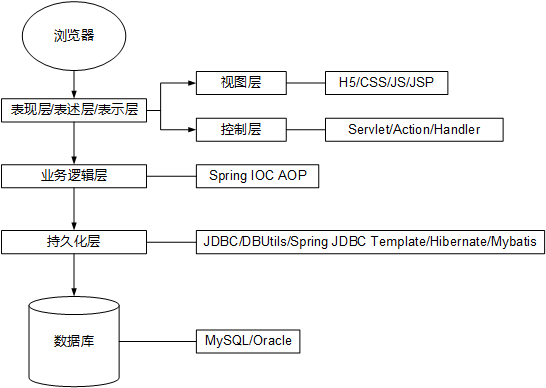
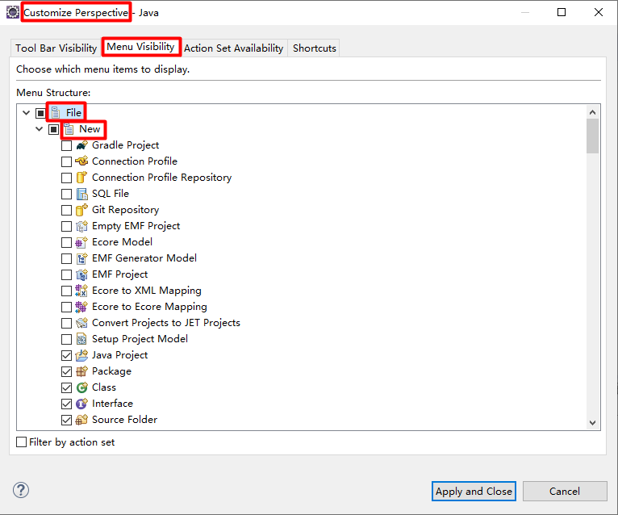

# Maven

参考视频：[尚硅谷Java视频教程_Maven视频](https://www.bilibili.com/video/BV1Pt411y7Rh)。

## 概述

### 引入

前端到后端结构图：



目前的技术在开发中遇到的问题：

一个项目就是一个工程，一旦项目非常庞大，用package来划分模块就不适合了，最好是一个模块对应一个工程，利于分工协作。通过Maven就可以将一个项目拆分成多个工程。

项目中所需jar包需要手动复制到lib文件夹里，那么同样的jar包就会出现在多个项目中，既浪费空间又使得项目变得臃肿。借助Maven可以将jar包保存在仓库中，哪个工程需要的话就引用文件接口，而不需把jar包复制过来。

jar包来源于他人或官网，不同技术的官网下载jar包的方式是五花八门的，而有些技术的官网就是通过SVN或Maven来提供下载的。借助Maven可以以一种规范的方式下载jar包，因为各大知名框架和第三方工具的jar包是按照统一的规范存放在Maven的中央仓库中。以规范的方式下载jar包的话，内容自然也是可靠的。

注：约定>配置>编码。

一个jar包所依赖的另一个jar包需要手动加载到项目中，那么程序员就得熟悉各jar包之间的依赖关系，这增加了极大的学习成本。Maven可以级联导入所有jar包。

### 是什么

Maven是一款用java编写的、服务于java平台的自动化构建工具。

### 构建

所谓构建，就是Maven以源文件、框架配置文件、jsp、html、图片等资源生产一个可运行项目的过程。它分为三步：编译、部署、搭建。对于一个基于B/S模式的项目，要运行的不是动态web工程本身，而是它编译、部署后的结果。

- java是一门编译型语言，.java源文件必须编译成.class字节码文件才能执行。
- 若我们想通过浏览器访问java程序就必须将包含该程序的web项目所编译的结果放到服务器的指定目录中并启动服务器，这个“放”的过程就是部署。
- 在实际项目中还需整合第三方框架。web工程除了有源程序、jsp、图片等静态资源外，还包括第三方框架的jar包及各类配置文件，所有这些资源需遵循正确的目录要求一并部署到服务器中。

注：普通的java工程中，我们在eclipse的文件视图所看到的JRE System Library和Apache Tomcat v8.5等运行时环境并不是工程里的目录，而是一个个jar包的引用。

构建过程的具体环节：

1. 清理-将旧class文件删除，为下一次编译做准备。
2. 编译-将源程序转化为class文件。
3. 测试-自动测试，自动调用Junit程序。
4. 报告-告知测试程序执行的结果。
5. 打包-动态web工程打成war包，普通java工程打成jar包。
6. 安装-将打包而得的文件复制到仓库的指定位置。
7. 部署-将war包复制到servlet容器（比如tomcat）的指定目录下，使其能够运行。

那么Maven的牛逼之处就是自动化构建，即将编译、打包、部署、测试等重复耗时的工作交给机器完成。

### 安装

安装Maven核心程序并做相关配置，步骤如下：

1. 检查环境变量JAVA_HOME。
2. 解压Maven核心程序的压缩包，放在非中文无空格的路径中。
3. 配置Maven相关环境变量-MAVEN_HOME及path。
4. 验证。执行`mvn -v`命令以查看版本信息。

安装完毕，最好要配置下面一些东西：

- 为了避免下载慢的问题，采用中央仓库镜像如阿里云等。修改setting.xml文件：

  ```xml
  <mirrors>
  	<mirror>  
     		<id>nexus-aliyun</id>  
     		<mirrorOf>central</mirrorOf>    
     		<name>Nexus aliyun</name>  
     		<url>http://maven.aliyun.com/nexus/content/groups/public</url>  
  	</mirror>
  </mirrors>
  ```

- 如遇到jdk版本的问题，需进行相关配置。修改setting.xml文件：

  ```xml
  <profile>
      <id>jdk-1.8</id>
      <activation>
          <activeByDefault>true</activeByDefault>
          <jdk>1.8</jdk>
      </activation>
      <properties>
          <project.build.sourceEncoding>UTF-8</project.build.sourceEncoding>
          <maven.compiler.source>1.8</maven.compiler.source>
          <maven.compiler.target>1.8</maven.compiler.target>
          <maven.compiler.compilerVersion>1.8</maven.compiler.compilerVersion>
      </properties>
  </profile>
  ```
  
  这是全局配置，即maven对任一工程都根据统一的JDK版本作处理。那么还可以针对具体工程作局部配置，具体写法不记在这里。
  
- 联网问题：

  Maven的核心程序仅仅定义了抽象的生命周期，但是具体的工作流程必须由特定的插件来完成，而插件不在Maven核心程序之中。当某些命令需要借助插件执行时，Maven核心程序会首先到本地仓库中查找（本地仓库的默认位置：[系统当前用户的主目录]\\.m2\repository），找不到的话，就自动连接外网，到中央仓库下载。若无法连接外网，则构建失败。修改本地仓库的位置可让Maven核心程序到自定义目录中查找插件。修改conf/setting.xml：

  ```xml
  <localRepository>D:\server\apache-maven-3.6.3\mvnrep</localRepository>
  ```

## 核心概念

### 目录结构

```
根目录：工程名
	src：源码
		main：存放主程序
			java：存放源文件
			resources：存放资源文件
		test：存放测试程序
	pom.xml：Maven的核心配置文件
```

### POM

Project Object Model-项目对象模型。pom.xml是Maven工程的核心配置文件，与构建过程相关的一切设置都以此文件为载体。

### 依赖

Maven解析依赖信息时会到本地仓库查找所依赖的jar包，那么当某项目依赖我们自己开发的项目，应使用`mvn install`命令将被依赖项目装入仓库，这样依赖信息才能成功解析。

#### 依赖的范围

直接上表：

| 范围     | 编译 | 测试 | 运行 | 打包 | 例子        |
| -------- | ---- | ---- | ---- | ---- | ----------- |
| compile  | 是   | 是   | 是   | 是   | spring-core |
| test     | 否   | 是   | 否   | 否   | junit       |
| provided | 是   | 是   | 否   | 否   | servlet-api |
| runtime  | 否   | 是   | 是   | 是   | jdbc driver |

稍微对表头这四个阶段作一番说明：

- 编译指编译除测试文件以外自己写的源文件，一个简单的判定法是看包内成员是否出现在代码中。
- 测试指对测试类的编译与运行，就包括对测试类及自己写的源文件的编译。参与编译的就一定会参与测试。
- 运行指除测试运行以外在生产环境中项目的运行。如servlet-api就不参与运行，因为tomcat提供了。
- 打包指依赖被打进当前项目的jar包或war包。provided范围与runtime范围的依赖关于编译和测试一定呈现相反的态势，如servlet-api参与编译而不参与测试，jdbc driver参与测试而不参与编译。

部署的前提是jar包或war包，故打包是跟部署紧密相关的。

maven官网有更为详细的介绍：

> - scope:
>
>   This element refers to the classpath of the task at hand (compiling and runtime, testing, etc.) as well as how to limit the transitivity of a dependency. There are five scopes available:
>
>   - **compile** - this is the default scope, used if none is specified. Compile dependencies are available in all classpaths. Furthermore, those dependencies are propagated to dependent projects.
>   - **provided** - this is much like compile, but indicates you expect the JDK or a container to provide it at runtime. It is only available on the compilation and test classpath, and is not transitive.
>   - **runtime** - this scope indicates that the dependency is not required for compilation, but is for execution. It is in the runtime and test classpaths, but not the compile classpath.
>   - **test** - this scope indicates that the dependency is not required for normal use of the application, and is only available for the test compilation and execution phases. It is not transitive.
>   - **system** - this scope is similar to `provided` except that you have to provide the JAR which contains it explicitly. The artifact is always available and is not looked up in a repository.

可参考文章[maven scope 的作用](https://blog.csdn.net/u010002184/article/details/87989164)。

#### 依赖的传递性

比方说，工程A依赖于工程B，工程B依赖于工程C，那么工程A传递依赖于工程C。进一步得到，工程C所引用的jar包都会自动地被工程A引用。test、provided依赖不具有传递性。

#### 依赖的排除

有时候我们不想让传递而来的不稳定的jar包引入工程，于是就得设置依赖的排除。排除操作也具有传递性，比如排除了A项目的某个jar包，那么依赖A项目的B项目的相应jar包也会被排除。

```xml
<exlusions>
	<exlusion>
		<groupId>common-logging</groupId>
		<artifactId>common-logging</artifactId>
	</exlusion>
</exlusions>
```

#### 依赖的原则

作用：解决jar包冲突的问题。

原则一：路径最短者优先。


原则二：路径相同的情况下，先声明者（dependency标签声明在前）优先。


#### 统一管理依赖的版本号

1. 在properties标签中用自定义标签定义统一的版本号。比如：

   ```xml
   <properties>
       <spring.version>4.3.7.RELEASE</spring.version>
   </properties>
   ```

2. 在dependency标签中用`${自定义标签名}`（这里标签名是`spring.version`）引用版本号。比如：

   ```xml
   <dependency>
   	<groupId>org.springframework</groupId>
   	<artifactId>spring-beans</artifactId>
   	<version>${spring.version}</version>
   </dependency>
   ```

注：properties标签的作用不止于统一定义版本号，凡是需要统一声明的东西都可以在其中定义。如统一项目源码的字符集：

```xml
<properties>
        <project.build.sourceEncoding>UTF-8</project.build.sourceEncoding>
</properties>
```

#### 在网上查找依赖信息

可上各类框架、类库的官网查找，也可去[mvnrepository](https://mvnrepository.com/)查找，这个网站收录了主流框架和类库的依赖信息。也可以去[阿里云仓库](https://maven.aliyun.com/mvn/search)或其他地方找。

### 坐标

使用下面三个分量唯一定位一个Maven工程（一个工程对应一个jar包）。

- groupid：公司或组织域名倒序+项目名（也可仅组织名）。

  ```xml
  <groupid>com.chaofan.maven</groupid>
  ```

- artifactid：模块名（也可是项目名）。

  ```xml
  <artifactid>Hello</artifactid>
  ```

- version：版本号。

  ```xml
  <version>1.0.0</version>
  ```

Maven工程的jar包坐标翻译为仓库路径：

```xml
<groupid>org.springframework</groupid>
<artifactid>spring-core</artifactid>
<version>4.0.0.RELEASE</version>

<!-- 路径：org/springframework/spring-core/4.0.0.RELEASE/spring-core-4.0.0.RELEASE.jar -->
```

可以看出，jar包名由artifactid与version拼接而成。

### 仓库

本地仓库：当前电脑磁盘上部署的仓库目录，为本地所有Maven工程服务。

远程仓库：

- 私服：搭建在局域网环境中，为局域网内所以Maven工程服务。
- 中央仓库：架设在Internet上，为全世界的Maven工程服务。
- 中央仓库镜像：架设在各大洲，为中央仓库分担流浪，减轻其压力，同时更快地相应客户。

### 生命周期、插件、目标

构建过程中的各个环节的执行顺序不能打乱。

Maven定义了抽象的生命周期，生命周期中各个阶段的具体任务是由插件来完成的。

为了更好地实现自动化管理，Maven核心程序不论执行生命周期的哪一阶段都会从当前生命周期的最初位置开始执行（如要执行install就得从执行compile开始）。

插件和目标：生命周期的各阶段仅定义了要执行的任务；各阶段的插件和插件目标的任务是对应的；相似的目标是由共同的插件完成的。下表仅举两个阶段的例子。

| 生命周期中的阶段 | 插件目标    | 插件                  |
| ---------------- | ----------- | --------------------- |
| compile          | compile     | maven—compiler-plugin |
| test             | testCompile | maven-compier-plugin  |

### 继承

针对非compile依赖传递性无效的问题，需要统一管理非compile依赖模块的版本。方法是将各工程的同一种依赖提取到父工程中，子类无需声明。步骤如下：

1. 创建一个Maven工程，打包方式设为pom。

   ```xml
   <!-- 管理多模块的非传递性依赖 -->
   <dependencyManagement>
   	<dependencies>
   		<dependency>
   			<gruopId>junit</groupId>
   			<artifactId>junit</artifactId>
   			<version>4.0</version>
   		</dependency>
   	</dependencies>
   </dependencyManagement>
   ```

1. 在子工程中声明对父工程的引用。

   ```xml
   <parent>
   	<groupId>com.chaofan.maven</groupId>
   	<artifact>Parent</artifact>
   	<version>0.0.1-SNAPSHOT</version>
   	<!-- 父工程pom.xml文件相对于当前工程pom.xml文件的路径 -->
   	<relativePath>../Parent/pom.xml</relativePath>
   </parent>
   ```

2. 删除子工程的重复坐标（不删也行，简洁起见）。

类比类的继承，相同的依赖提取到父工程中，不同的依赖各自声明。而且，一旦配置了继承，要安装子工程就必须先安装父工程。

### 聚合

作用：一键安装多个模块。

```xml
<!-- 聚合：子模块统一安装 -->
<modules>
	<!-- 指定各个子工程相对于父工程pom.xml文件的路径 -->
    <module>../Hello</module>
    <module>../HelloFriend</module>
    <module>../MakeFriend</module>
</modules>
```

要安装这些子工程模块的话直接用父模块的pom.xml文件安装即可。令人称道的是maven会智能地调整各模块的安装顺序以保证工程间的依赖。

## 常用命令

注意：执行与构建过程相关的命令，必须进入pom.xml所在目录。

```shell
#清理
mvn clear
#编译主程序
mvn compile
#编译测试程序
mvn test-compile
#执行测试
mvn test
#打包
mvn package
#安装
mvn install
#生成站点
mvn site
```

## 在eclipse中使用Maven

### 与eclipse的集成

eclipse已内置maven插件。

每新建一个工作区都要修改其部分设置：

- Installations：指定核心程序位置，不建议使用自带的，应使用本机安装的位置。

  

- User Settings：指定conf/settings.xml的路径，进而获取本地仓库的位置。

  

创建的Java工程和Web工程自然都是Maven版的。

方便起见，把Maven项目加入到新建菜单中：



### 使用

#### 创建Java工程


#### 执行Maven命令


上图中的Goals一栏除了可输入compile，当然也可输入test-compile、package等命令。也可连续执行多个命令，如输入`compile test package`。

项目文件结构示例：


注意main和test里包名的一致，以保证在同一包内。

#### 创建Web工程

1. 建工程

   

   

2. 改配置

   

   

   若成功则webapp目录中会有META-INF和WEB-INF两个目录，没有就去检查上图Dynamic Web Module选项勾上没有，有时候eclipse发神经。

3. 添加servlet-api（补充tomcat运行时环境）

   修改pom.xml：

   ```xml
   <dependencies>
   	<dependency>
     		<groupId>javax.servlet</groupId>
     		<artifactId>servlet-api</artifactId>
     		<version>2.5</version>
     		<scope>provided</scope>
     	</dependency>
   </dependencies>
   ```

接着上面的准备工作敲业务代码，整个项目写完后就通过package命令打成war包，再把war包放到tomcat服务器的webapp目录中，运行tomcat，就能访问项目网站了。

整体看来还没有之前做web项目简便，但实际开发是这样做的，把war包放在服务器而非本机。

#### Web工程的自动部署

针对上一节弄web项目不方便的问题，可以用web项目的自动部署。

此处省略，了解即可，因为操作过程比我们一般的部署过程还要繁琐。

