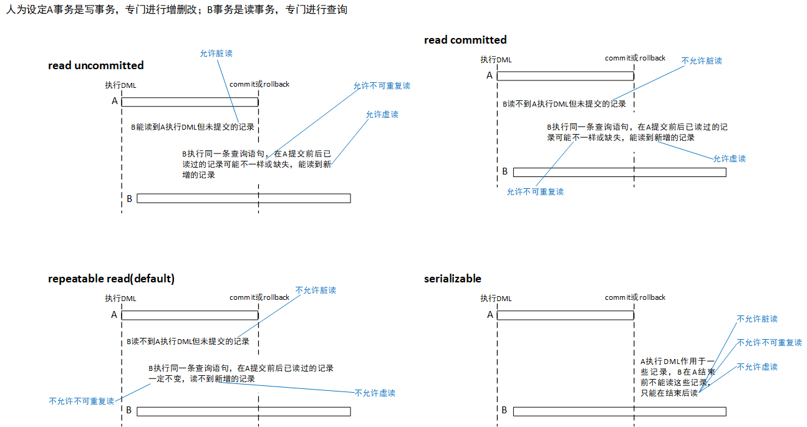

# MySQL

参考视频：[MySQL数据库教程](https://www.bilibili.com/video/BV1iq4y1u7vj?p=1)。

## 概述

### 安装配置

目前企业中大部分用5.7版本，两个版本的加密规则不同。

### 登录

客户端与服务端的连接基于TCP/IP协议栈。

端口号不同，不同版本可共存，登录时指定`-P`选项。如远程访问5.7：

```shell
# 若访问本机的3306端口，则-P -h可省略
mysql -u root -P 13306 -h http://www.xxx.com -p
```

登录后查看版本：

```shell
mysql -V
mysql --version
mysql> select version();
```

### 目录结构

windows下：

```
D:\Program Files\MySQL\MySQL Server 8.0\bin：可执行文件，如客户端程序mysql.exe、服务端程序mysqld.exe
D:\programdata\MySQL\MySQL Server 8.0\Data：数据库，包括系统的和自建的
D:\programdata\MySQL\MySQL Server 8.0\my.ini：配置
```

## SQL

### 概述

诞生于1974年的一篇论文，这几十年的变动不大。

虽然有统一的标准如SQL-99，但各数据库提供商对标准的实现不一致。

分类：

- DDL：create、alter、drop、truncate等。
- DML：insert、delete、update、select等。
- DCL：grant、revoke、commit、rollback等。

### 规范

规则就不扯了，规范扯一些。

MySQL在windows环境中大小写完全不敏感，在linux环境中部分不敏感，故采用保险统一的规范：

- 库名、表名、表别名、字段名、字段别名等自定义的东西小写，`_`作分隔符。
- 关键字、函数名等内置的东西大写。

给列别名、表别名加双引号避免可能产生的编译问题。

详细规范可参考阿里巴巴Java开发手册等。

### 注释

```mysql
# mysql特有单行
-- sql通用单行
/* 多行 */
```

### 查询

所有实例与说明参见SQL笔记文件query.sql、DDL.sql与DML.sql。

### 数据类型

#### 概述

这是个很要紧的东西，实际开发中字段类型设置得不好，会带来错误或缺陷，如金额的精度损失、空间浪费、查询性能低等。

数据类型有一些属性，除完整性相关的之外，数值类型有UNSIGNED（也算完整性），文本类型有CHARACTER SET。

```sql
CREATE TABLE temp (
	id INT,
    age UNSIGNED INT,
    `name` VARCHAR(15) CHARACTER SET 'gbk' -- 默认按表级编码方式
);
```

类型如何选取看单位的要求，也可参考阿里巴巴Java开发手册等。

#### 整数

一共五种，对比如下：

| 类型         | 字节数 | 有符号范围            | 无符号范围             |
| ------------ | ------ | --------------------- | ---------------------- |
| TINYINT      | 1      | $[-2^7,2^7-1]$        | $[0,2^8-1]$            |
| SMALLINT     | 2      | $[-2^{15}, 2^{15}-1]$ | $[0, 2^{16}-1]$        |
| MEDIUMINT    | 3      | $[-2^{23}, 2^{23}-1]$ | $[0,2^{24}-1]$         |
| INT或INTEGER | 4      | $[-2^{31},2^{31}-1]$  | $[0,2^{32}-1]$（10位） |
| BIGINT       | 8      | $[-2^{63},2^{63}-1]$  | $[0,2^{64}-1]$         |

插入的分量超出范围当然会报越界异常。

来看有哪些可选属性。

M：显示宽度，须配合以ZEROFILL函数。如`INT(5)`，上限是11，这里给的5，作用是当分量位数小于5，高位用0补，当位数大于5，实际保存的数值并不被截断。8.0不推荐使用，也取消了自动补0。

```sql
sno INT(5) ZEROFILL -- 自动补上一个UNSIGNED，因为用零填充，就只能非负
```

UNSIGNED：无符号。

```sql
sno INT UNSIGNED
```

适用场景：

- TINYINT：枚举数据，范围小且值固定。
- SMALLINT：较小范围数据。
- MEDIUMINT：较大范围数据。
- INT：范围已经足够大，一般不用考虑溢出问题。
- BIGINT：特别巨大的整数。

实际工作中考虑到网站数据量可能不断增大，首先要保证系统不能瘫痪，即因范围不够大而停机维护，故应先考虑取值范围足够大，再去考虑空间节省的问题，即用空间换可靠性。而对非累加性数据，后者就更要紧。

#### 浮点数

浮点数与定点数支持小数，取值范围也比整数类型的大。

| 类型   | 字节数 | 有符号范围（约）                                             | 无符号范围（约）                       |
| ------ | ------ | ------------------------------------------------------------ | -------------------------------------- |
| FLOAT  | 4      | $(-3\times10^{38},-1\times10^{-38}),0,(1\times10^{-38},3\times10^{38})$ | $0,(1\times10^{-38},3\times10^{38})$   |
| DOUBLE | 8      | $(-1\times10^{308},-2\times10^{-308}),0,(2\times10^{-308},1\times10^{308})$ | $0,(2\times10^{-308},1\times10^{308})$ |

另有REAL类型，根据SQL模式相当于FLOAT或DOUBLE：

```sql
SET sql_model = "REAL_AS_FLOAT";
```

参考IEEE754规定的浮点数存储格式-固定位数的符号（1）、阶码（8或11）、尾数（23或52）。

MySQL允许如下非标准语法：

```sql
-- M：精度=整数位数+小数位数，D：标度=小数位数
FLOAT(M, D)
DOUBLE(M, D)
FLOAT(5, 2) -- 范围是[-999.99, 999.99]
FLOAT(3, 2) UNSIGNED -- [0, 9.99]
```

上述表达规定了存储值的范围，那么分量溢出的话，要分情况讨论：

- 整数位溢出，报错。
- 小数位溢出：
  - 四舍五入后整数位未溢出，警告，如`FLOAT(5, 2) 222.996 -> 223.00`。
  - 四舍五入后整数位溢出，报错，如`FLOAT(5, 2) 999.996`。

存在精度损失（计算误差）问题，本质上是计算机的二进制造成的。由此引出定点数类型DECIMAL。

#### 定点数

MySQL中定点数类型就DECIMAL一个。

```sql
-- 三选一
DECIMAL(M, D)
DEC
NUMERIC
-- 字节数为M+2，范围随M、D变动
```

其中整数$M\in[0,65]$叫精度，整数$D\in[0,30]$叫标度。如`DECIMAL(5, 2)`的范围是$[-999.99,999.99]$。

底层定点数是用字符串存储的。

比较浮点数与定点数，前者范围更大，后者更精确。

#### 位

存储二进制数。

```sql
-- M取自[0, 64]，表位数
BIT(M)
BIT(5) -- [0, 31]
-- 查出来的值以十六进制即以0x开头展示
```

#### 日期时间

| 类型      | 字节数 | 格式                | 最小值                  | 最大值                  |
| --------- | ------ | ------------------- | ----------------------- | ----------------------- |
| YEAR      | 1      | YYYY或YY            | 1901                    | 2155                    |
| TIME      | 3      | HH:MM:SS            | -838:59:59              | 838:59:59               |
| DATE      | 3      | YYYY-MM-DD          | 1000-01-01              | 9999-12-03              |
| DATETIME  | 8      | YYYY-MM-DD HH:MM:SS | 1000-01-01 00:00:00     | 9999-12-31 23:59:59     |
| TIMESTAMP | 4      | YYYY-MM-DD HH:MM:SS | 1970-01-01 00:00:00 UTC | 2038-01-19 03:14:07 UTC |

YEAR的YY格式已不推荐使用，另外YYYY格式的YEAR没必要写成`YEAR(4)`，也不推荐显示宽度。

```sql
-- 插DATE
INSERT INTO tmp (hire_date)
VALUES ('1992-10-02');
INSERT INTO tmp (hire_date)
VALUES (19990420); -- 后续同理
INSERT INTO tmp (hire_date)
VALUES (CURRENT_DATE());

-- 插TIME
INSERT INTO tmp (birth_time)
VALUES ('2 12:30:20'); -- 多了个天数

-- 插DATETIME
INSERT INTO tmp (graduation)
VALUES ('1992-10-02 12:30:20');
```

相较于DATETIME，TIMESTAMP更适应时区变化、计算、排序相关的场景，因为底层TIMESTAMP存的是一个毫秒数，插入时会根据当前时区将分量转为格林威治时间，再转为一个毫秒数，后续查询时转化为当前时区。

#### 文本

文本、字符串类型很常见。

| 类型       | 长度范围               | 字节数          |
| ---------- | ---------------------- | --------------- |
| CHAR(M)    | $[0,255]$              | M+?             |
| VARCHAR(M) | $[0,65535]$            | 实际长度+2      |
| TINYTEXT   | $[0,255]$              | L+2             |
| TEXT       | $[0,65536]$            | L+2             |
| MEDIUMTEXT | $[0,16777215]$         | L+3             |
| LONGTEXT   | $[0,4294967295]$（4G） | L+4             |
| ENUM       | $[0,65535]$            | $\{1,2\}$       |
| SET        | $[0,64]$               | $\{1,2,3,4,8\}$ |

常对比CHAR与VARCHAR，前者叫定长字符串，即要求空间填满，不满则在值右侧补空格，查询的时候会去除这些空格（甚至自己插入时写的空格也一并被去除），后者叫变长字符串，不要求空间填满，有多少个字符给多大空间。

再对这俩细究一下长度与字节数。我们知道对英文系统，一个字符占一个字节，而对汉语系统，一个汉字至多占3个字节。

- 对CHAR，长度即字符数，那么一给定M，字符数就确定下来，但字节数不确定，受具体字符、编码方式影响。
- 对VARCHAR，长度指字节数，理论上最坏情况下（全3字节汉字）最多填$65535/3=21845$个字符，这21845也就是MySQL控制台上报的字符数上限即M的上限，但实际最多到21844，到21845MySQL就勒令我们改用TEXT。

空间上前者更浪费，时间上前者效率更高，故前者更适合存储量不大、对速度要求高、总体定长的场景，后者相反。

TEXT系列四个类型都是变长的，且无需预定义字符数上限。TEXT和BOLB的删除导致大的文件碎片，故建议频繁删除的表内不要放TEXT等字段，而另开一个扩展表专门存放大容量数据。

```sql
-- ENUM 插入时填多选一或其位置如1、'3'或NULL
season ENUM('春', '夏', '秋', '冬', 'unknown')
-- SET 插入时填多选多，自动去掉重复的
alpha SET('A', 'B', 'C')
```

#### 二进制

二进制字符串类型适用于图片、音视频等数据，当然字符串、数值也可以。

BINARY与VARBINARY可类比CHAR、VARCHAR来理解。

BLOB系列适用于二进制大对象-图片、音视频等，但在实际开发中，一般这些多媒体资源不会存在数据库里，而存到服务器的硬盘中，数据库里保存的是它们的URL。

| 类型       | 长度范围  | 字节数 |
| ---------- | --------- | ------ |
| TINYBLOB   | $[0,255]$ | L+1    |
| BLOB       | 64K       | L+2    |
| MEDIUMBLOB | 16M       | L+3    |
| LONGBLOB   | 4G        | L+4    |

#### JSON

```sql
-- js是列名，JSON是类型
js JSON VALUES ('{"name": "van", "age": 18, "address": {"provice": "hubei", "city": "huanggang"}}')
SELECT js -> '$.name' AS `name`, js - > '$.age' AS age
FROM tmp;
```

## 完整性

数据完整性理论就不赘述了，有三大完整性六大约束，交叉阅读[Oracle](oracle.md)笔记约束一章。

用CREATE TABLE语句增加约束，用ALTER TABLE语句添加、删除约束。具体例子参考SQL笔记文件constraint.sql。

建议开发中不要使用外键。当不用时，想保证完整性，要么靠程序员的自觉，要么靠Java等应用程序里的相关逻辑。用的话，一旦数据量特别大、访问量也大，就会带来巨大的检查开销。

NULL值是个不好的值，一来不方便比较，二来影响索引的效力，因此尽量给字段设默认值。

建表时可指定引擎如`CREATE TABLE tmp (...) ENGINE=InnoDB;`，本来取值可任意，但一旦有外键，那么主从表引擎须一致。

了解sql_mode，通过常用值的设定与否决定语法的宽松或严格。

```sql
SELECT @@session.sql_mode;
-- STRICT_TRANS_TABLES,NO_ENGINE_SUBSTITUTION
```

建议一律使用严格模式：

```sql
SET GLOBAL sql_mode = 'ONLY_FULL_GROUP_BY,STRICT_TRANS_TABLES,NO_ZERO_IN_DATE,NO_ZERO_DATE,ERROR_FOR_DIVISION_BY_ZERO,NO_ENGINE_SUBSTITUTION';
SET SESSION sql_mode = 'ONLY_FULL_GROUP_BY,STRICT_TRANS_TABLES,NO_ZERO_IN_DATE,NO_ZERO_DATE,ERROR_FOR_DIVISION_BY_ZERO,NO_ENGINE_SUBSTITUTION';
```

```ini
# 改my.ini然后重启
[mysqld]
sql_mode=ONLY_FULL_GROUP_BY,STRICT_TRANS_TABLES,NO_ZERO_IN_DATE,NO_ZERO_DATE,ERROR_FOR_DIVISION_BY_ZERO,NO_ENGINE_SUBSTITUTION
```

## 视图

主要理论亦不赘述。

总地来说视图用于查询，而不用于更新（增删改）。

语句实例参考SQL笔记文件view.sql。

## 存储过程

存储过程是一组预先编译好的SQL语句的封装，保存在DBS上，客户端只需发送调用指令，就可直接执行其中的一系列语句。显然好处是简化操作-提高SQL语句复用性、减轻网络压力、降低SQL语句的暴露风险。

暂弃，用时再记，且学oracle时学过。

## 变量

变量分系统变量与用户自定义变量。

系统变量由系统（服务器）定义。启动MySQL服务，生成一个MySQL服务实例，就会为对应内存空间中的系统变量赋值，它们定义了当前实例的属性，如编码方式。它们要么来自编译MySQL软件时的参数，要么来自my.ini里的参数。我们只需关注常用变量。

系统变量又分为全局系统变量与会话系统变量，前者在所有会话内有效（重启重置），后者仅在当前会话内有效。

用户自定义变量又分为会话用户变量与局部变量，前者在当前会话内有效，后者仅在BEGIN、AND语句块内有效。

其他内容参考SQL笔记文件variable.sql。

## 触发器

跟约束、事务同目的，触发器存在的意义是保证数据完整性。增删改事件引起触发器定义的逻辑执行。

代码举例参考SQL笔记文件trigger.sql，可交叉阅读Oracle笔记触发器一章。

优点：

- 保证数据完整性与事务特性。
- 为操作做日志、为数据做备份。

缺点：

- 可读性差。尤当触发器数目非常多，有时报异常自己都一时弄不清。
- 表结构的变更可能引起触发器原有逻辑不合理，导致操作报错。

外键约束造成的主表对副表的外键列操作不会引起副表触发器的执行，即触发器仅受本表内的操作驱动。

## 窗口函数

无论从执行效率、占用空间还是写法上，窗口函数都比等价的普通SQL语句要好很多。

机制与聚集函数相似，但后者是分组后必须聚集-总记录数被压缩，我们也看不到中间分组表，前者可实现分组而不聚集并且由窗口函数将单行操作结果或聚集操作结果分给各组内各记录。

具体应用参见SQL笔记文件window.sql。

## 公用表表达式

即common table expression-CTE，简单理解为可复用的子查询。

```sql
-- 普通CTE
WITH cte_original
AS (
	SELECT AVG(salary) AS avg_sal
	FROM employees
) -- 不要分号

SELECT employee_id, last_name, salary, avg_sal, salary - avg_sal AS diff
FROM employees JOIN cte_original;
```

## Linux

### 卸载

检查服务是否处启动状态：

```sh
systemctl status mysqld
```

关闭服务：

```sh
systemctl stop mysqld
```

查看有哪些mysql相关的安装包：

```sh
rpm -qa | grep -i mysql # -i表忽略大小写
```

删除安装包，用yum或rpm随意，途中反复执行上一条以确保删干净。

```sh
rpm -e 包名
```

删除相关文件：

```sh
find / -name mysql
rm -rf 文件（夹）路径
# 配置文件，对应windows下的my.ini
rm -f /etc/my.cnf
```

### 安装

centOS7可能自带产生冲突的数据库mariadb，先用rpm卸载掉。

这里就选社区版了，OS选Red Hat，用`uname -m`查看架构类型，下载RPM Bundle。

对8版本抽出这6个rpm文件：

```
mysql-community-common-8.0.30-1.el7.x86_64.rpm
mysql-community-client-plugins-8.0.30-1.el7.x86_64.rpm
mysql-community-libs-8.0.30-1.el7.x86_64.rpm
mysql-community-client-8.0.30-1.el7.x86_64.rpm
mysql-community-icu-data-files-8.0.30-1.el7.x86_64.rpm
mysql-community-server-8.0.30-1.el7.x86_64.rpm
```

由于安装过程中会自动创建mysql用户，他再在`/tmp`目录下新建tmp_db文件，故应事先给予其创建文件的权利。

```sh
# 干脆都敞开
chmod -R 777 /tmp
```

检查两个依赖：

```sh
rpm -qa | grep libaio
rpm -qa | grep net-tools
```

接着就是安装那几个文件，按上面的顺序。

验证是否安装成功了：

```sh
# 看版本并不依赖服务启动
mysql --version 
# 虽然那几个rpm文件在文件系统中，但只有安装成功，rpm工具才检索得到
rpm -qa | grep mysql
```

初始化：

```sh
# 让DBS相关目录与文件的owner为mysql用户
mysqld --initialize --user=mysql
# 查看root用户的密码
[root@SuperVan mysql]# cat /var/log/mysqld.log 
2022-07-28T14:31:42.152410Z 0 [System] [MY-013169] [Server] /usr/sbin/mysqld (mysqld 8.0.30) initializing of server in progress as process 1300
2022-07-28T14:31:42.162302Z 1 [System] [MY-013576] [InnoDB] InnoDB initialization has started.
2022-07-28T14:31:43.973675Z 1 [System] [MY-013577] [InnoDB] InnoDB initialization has ended.
2022-07-28T14:31:46.114646Z 6 [Note] [MY-010454] [Server] A temporary password is generated for root@localhost: )OQZswuwg7ly # 这是临时密码，登录时应当重设
```

启动服务：`systemctl start mysqld`，可设随开机启动。

用root登录后改密码：

```sql
ALTER USER 'root'@'localhost' IDENTIFIED BY 'xxxxxx';
```

### 远程连接

一般默认是不成功的，首先是防火墙的问题，要么直接关闭要么开放3306端口：

```sh
systemctl stop firewalld
systemctl disable firewalld

firewall-cmd --add-port=3306/tcp --permant
firewall-cmd reload
```

附带讲用云服务器，要去安全组->配置规则->手动添加，才能完全开放此端口。

然后是默认配置的问题：

```mysql
mysql> use msyql;
mysql> select host, user from user;
+-----------+------------------+
| host      | user             |
+-----------+------------------+
| localhost | mysql.infoschema |
| localhost | mysql.session    |
| localhost | mysql.sys        |
| localhost | root             |
+-----------+------------------+
4 rows in set (0.00 sec)
```

结果说明root用户只能在服务器上的客户端登录，把localhost改成`%`，便是允许在任何IP地址对应的客户端登录（一般不建议）。

```sql
UPDATE SET user host = '%' WHERE user = 'root';
flush privileges;
```

对8版本可能有密码安全策略的问题，简单来说就是嫌自己设的密码太简单，不想改的话可通过如下语句疏通：

```sql
ALTER USER 'root'@'%' IDENTIFIED WITH mysql_native_password BY '设的密码';
```

### 目录结构

直接用指令查：

```sh
[root@SuperVan ~]# find / -name mysql
/usr/bin/mysql # 相关命令，如mysqldump，另在/usr/sbin下也有一些，如mysqld
/usr/lib64/mysql
/etc/logrotate.d/mysql
/opt/mysql
/var/lib/mysql # 数据目录，也是变量datadir的值
/var/lib/mysql/mysql
```

配置文件为`/user/share/mysql-8.0`及`/etc/my.cnf`。

能查出有四个内置数据库：

- mysql：核心，存储了用户信息、存储过程的定义、日志、时区信息、帮助信息等。
- information_schema：存放DBS维护的其他库的信息，包括所含表、视图、索引等，这些信息又叫（用户数据的）元数据。
- performance_schema：存放DBS运行过程中的状态信息，用于监控各性能（空间上、时间上）指标。
- sys：主要用视图融合上两个库。

InnoDB、MyISAM之类的存储引擎负责将逻辑上的二维表存储到物理上的磁盘上，我们以他俩为例说明是怎么存放的。

对于InnoDB，比如创建了数据库atguigudb，再创建表student，那么在`/var/lib/mysql/atguigudb`里，就有<span id="attach">student.ibd</span>，此文件存放着表结构、表数据、索引等信息，验证如下：

```sh
# ibd2sdi命令由oracle提供
ibd2sdi --dump-file=student.txt student.ibd
# 然后打开student.txt发现JSON格式的信息
```

对于MyISAM，比如又造了个course表，且指定引擎为MyISAM，那么发现在atguigudb目录下多了三个文件course_365.sdi、<span id="myd">course.MYD</span>、course.MYI，依次存放元数据、表数据与索引（D-data，I-index）。

## 编码方式

```sh
mysql> show variables like 'character_%';
+--------------------------+---------------------------------------------------------+
| Variable_name            | Value                                                   |
+--------------------------+---------------------------------------------------------+
| character_set_client     | gbk                                                     |
| character_set_connection | gbk                                                     |
| character_set_database   | utf8mb4                                                 |
| character_set_filesystem | binary                                                  |
| character_set_results    | gbk                                                     |
| character_set_server     | utf8mb4                                                 |
| character_set_system     | utf8mb3                                                 |
| character_sets_dir       | D:\Program Files\MySQL\MySQL Server 8.0\share\charsets\ |
+--------------------------+---------------------------------------------------------+
8 rows in set, 1 warning (0.00 sec)
```

这是8.0的有关编码方式的系统变量，注意server和database的一致且支持中文。然后看排序（比较）规则：

```sh
mysql> show variables like 'collation_%';
+----------------------+--------------------+
| Variable_name        | Value              |
+----------------------+--------------------+
| collation_connection | gbk_chinese_ci     |
| collation_database   | utf8mb4_0900_ai_ci |
| collation_server     | utf8mb4_0900_ai_ci |
+----------------------+--------------------+
3 rows in set, 1 warning (0.00 sec)
```

后两个变量也都是uft8有关的，与编码方式相对应。注：utf8（utf8mb3）与utf8mb4不一样，后者能表示更多的字符。

所以8.0不用管了，但5.7有必要在my.cnf中修改编码方式与排列规则，最好在安装后马上改，再启动服务，否则改完要重启服务，而且已建的库表不受影响。

```sql
-- 修改表的编码方式 CONVERT TO可省
ALTER TABLE emp CONVERT TO CHARACTER SET 'utf8';
-- 附带讲由大范围字符集改到小范围字符集可能产生乱码
```

编码方式与排序规则是分级的：

1. 服务器级别，见character_set_server与collation_server。
2. 数据库级别，见character_set_database与collation_database。
3. 表级别。
4. 列级别。

对my.cnf的修改作用于前两级。下级继承上级，也可以覆盖上级。

## 用户管理

### 账户

用户分为普通用户和root用户，大部分操作是前者进行的。

创建用户：

```mysql
-- user表的主键是host+user
CREATE USER 'van'@'localhost' IDENTIFIED BY '123456';
-- 不给定host的话，默认是%
CREATE USER 'van' IDENTIFIED BY '654321'; -- 这就有两个用户了，虽然user值一样
```

修改用户：

```sql
UPDATE user SET user = 'supervan' WHERE user = 'van' AND host = '%';
flush privileges;
```

删除用户：

```sql
# @'%'可省略
DROP USER `van`@'%', 'van'@'localhost';
```

查询用户：就是查user表。

修改密码：

```sql
-- 底层自动将密码加密再赋予当前用户，见于user表的authentication_string列
ALTER USER USER() IDENTIFIED BY 'van666';
SET PASSWORD = 'van666';

-- 改非当前登录用户的密码
ALTER USER 'van'@'localhost' IDENTIFIED BY 'van666';
SET PASSWROD FOR 'van'@'localhost' PASSWORD = 'van666';
```

除了前面提到的要求强度高的密码安全策略，MySQL还要求定期修改密码、不允许使用原密码，若到期则只有登录与改密码的权利。

### 权限

#### 概述

查看拢共有多少权限：`SHOW PRIVILEGES;`，分布如下：

| 级别 | 语句                                                         |
| ---- | ------------------------------------------------------------ |
| 表   | SELECT INSERT UPDATE DELETE CREATE DROP GRANT REFERENCES INDEX ALTER |
| 列   | SELECT INSRET UPDATE REFRENCES                               |
| 过程 | EXECUTE `ALTER ROUTINE` GRANT                                |

出于安全考虑，须遵守以下几条原则：

- 授予满足需求的最小范围的权限。
- 限制用户登录的主机，指定IP地址或网段。
- 设置强度高的密码。
- 及时清理僵尸用户，就包括权限的回收。

授权有直接授权与通过角色间接授权，先看直接。

```sql
GRANT SELECT, UPDATE ON atguigudb.* TO 'van'@'%'; 
```

```sh
# 查看本用户权限获取情况
mysql> show grants;
+----------------------------------------------------+
| Grants for van@%                                   |
+----------------------------------------------------+
| GRANT USAGE ON *.* TO `van`@`%`                    |
| GRANT SELECT, UPDATE ON `atguigudb`.* TO `van`@`%` |
+----------------------------------------------------+
2 rows in set (0.00 sec)
```

```sql
-- 将对所有库所有表的操作权利赋给某用户
GRANT ALL PRIVILEGES ON *.* TO 'van'@'localhost';
-- 查看
SHOW GRANTS FOR 'van'@'localhost';
```

如此普通用户的权限与root的并不相当，隔一个GRANT，想补齐的话在GRANT语句尾部补一个`WITH GRANT OPTION`。

在注销用户前，须回收其所有权限。

```sql
-- 回收部分
REVOKE UPDATE ON atguigudb.course TO 'van'@'%';
-- 回收所有
REVOKE ALL PRIVILEGES ON *.* FROM 'van'@'%';
```

应强调，Web应用中的数据库配置不要涉及root用户，因为其密码暴露在外。

#### 权限表

权限表是MySQL进行权限控制的依据，上一节的收放权操作都落实为表里的记录。权限表位于系统库mysql中，包括user、db、tables_priv、columns_priv、procs_priv等，服务一启动，就将表里的权限信息读入内存。

```sh
mysql> desc user; # 截取了部分列部分行
+--------------------------+-----------------------------------+------+
| Field                    | Type                              | Null |
+--------------------------+-----------------------------------+------+
| Host                     | char(255)                         | NO   |
| User                     | char(32)                          | NO   |
| Select_priv              | enum('N','Y')                     | NO   |
| Insert_priv              | enum('N','Y')                     | NO   |
| Update_priv              | enum('N','Y')                     | NO   |
| Delete_priv              | enum('N','Y')                     | NO   |
| Create_priv              | enum('N','Y')                     | NO   |
| Drop_priv                | enum('N','Y')                     | NO   |
```

以`_priv`结尾的分量就是与权限相关的字段，当user表内某记录这类分量取Y，意味着对应用户获得对所有库所有表的对应操作权利。

```sh
mysql> desc db; # 截取了部分列
+-----------------------+---------------+------+-----+---------+
| Field                 | Type          | Null | Key | Default |
+-----------------------+---------------+------+-----+---------+
| Host                  | char(255)     | NO   | PRI |         |
| Db                    | char(64)      | NO   | PRI |         |
| User                  | char(32)      | NO   | PRI |         |
| Select_priv           | enum('N','Y') | NO   |     | N       |
| Insert_priv           | enum('N','Y') | NO   |     | N       |
| Update_priv           | enum('N','Y') | NO   |     | N       |
| Delete_priv           | enum('N','Y') | NO   |     | N       |
| Create_priv           | enum('N','Y') | NO   |     | N       |
| Drop_priv             | enum('N','Y') | NO   |     | N       |
| Grant_priv            | enum('N','Y') | NO   |     | N       |
| References_priv       | enum('N','Y') | NO   |     | N       |
| Index_priv            | enum('N','Y') | NO   |     | N       |
| Alter_priv            | enum('N','Y') | NO   |     | N       |
| Create_tmp_table_priv | enum('N','Y') | NO   |     | N       |
| Lock_tables_priv      | enum('N','Y') | NO   |     | N       |
| Create_view_priv      | enum('N','Y') | NO   |     | N       |
| Show_view_priv        | enum('N','Y') | NO   |     | N       |
| Create_routine_priv   | enum('N','Y') | NO   |     | N       |
| Alter_routine_priv    | enum('N','Y') | NO   |     | N       |
| Execute_priv          | enum('N','Y') | NO   |     | N       |
| Event_priv            | enum('N','Y') | NO   |     | N       |
| Trigger_priv          | enum('N','Y') | NO   |     | N       |
+-----------------------+---------------+------+-----+---------+
22 rows in set (0.00 sec)
```

db就比user更细化，多了个Db字段，比如当某记录的Select_priv分量取Y，意味着对应用户仅对Db分量对应的数据库拥有查询权利。

同理执行`DESC tables_priv;`发现多了个Table_name字段，与Host、Db、User共同构成主键，体现针对某库某表的权限。

同理执行`DESC columns_priv;`发现多了个Column_name字段，粒度越来越小。

#### 访问控制

当用户像MySQL服务器发来一条欲执行的语句，服务器要先做访问控制然后才能执行，访问控制包含连接核实与请求核实两个阶段。

1. 连接核实就是从报文中取出用户名、主机地址、密码，去比对user表内host、user、authentication_string三个字段。

2. 请求核实就是沿着权限表（从user到proc_priv）检查权限，只要有一张表匹配到Y值就说明有执行权，否则继续检查下一张表。

### 角色

角色是权限的集合，将角色赋予用户，它就拥有特定的一组权利。用户一多，往往存在若干用户拥有相同的一组权利，此时就很适合被赋予角色。

创建多个角色：

```sql
CREATE ROLE 'boss'@'%', 'emp'@'%';
```

给角色赋权：

```sql
GRANT SELECT, INSERT ON atguigudb.* TO 'boss'@'%';
```

查看角色拥有的权利：

```sql
SHOW GRANTS FOR 'boss'@'%';
```

回收权利：

```sql
REVOKE INSERT ON atguigu.* FROM 'boss'@'%';
```

删除角色：

```sql
-- 角色一删除，其影响的用户就失去了相应权利
DROP ROLE 'boss'@'%';
```

把角色赋给用户：

```sql
-- 一个角色对多用户
GRANT 'boss'@'%' TO 'van'@'%', 'zhang'@'%';
-- 多个角色对一个用户
GRANT 'emp'@'%' TO 'van'@'%';
```

激活角色才能使用户拥有这一组权利：

```sql
-- 查看哪些角色已激活
SELECT CURRENT_ROLE();
-- 激活
SET DEFAULT ROLE 'boss'@'%' TO 'van'@'%', 'zhang'@'%';

-- 另一种方式，对所有角色永久激活
SET GLOBAL activate_all_roles_on_login = ON;
```

从用户身上撤销角色：

```sql
REVOKE 'boss'@'%' FROM 'van'@'%';
```

强制角色是任何用户创建之初就被赋予的角色，对其无法进行REVOKE或DROP。典例是带登录权利的角色（不过这例子没意义）。

```sql
-- 并自动激活
GRANT USAGE ON *.* TO 'login'@'localhost';
```

设定强制角色，要么在服务启动前改好my.cnf：

```ini
[mysqld]
mandatory_roles='login@localhost,其他'
```

要么在服务运行时设置：

```sql
SET PERSISTENT mandatory_roles='login@localhost,其他'; # DBS重启后仍有效
SET GLOBAL mandatory_roles='login@localhost,其他'; # DBS重启后失效
```

## 配置文件

MySQL服务器启动时就加载配置文件my.cnf。

它对诸选项进行了分组，不同的选项组供不同的命令使用。

可设定针对特定版本的选项组，如`[mysqld-5.7]`只能为5.7版本的服务所读取。

当定义相同选项，后面的覆盖前面的。当启动服务时附加了重复选项，也会覆盖。

## 逻辑架构

我们基于5.7版本给一个MySQL服务端逻辑架构简图：


SQL执行流程：


然后粗谈各阶段相关组件。

连接池里的线程一来与客户端交互，如连接核实，二来控制后续处理。一个客户端与DBS建立的连接由一个线程控制。

查询缓存缓存了SQL语句的结果，以备下次发现完全一致的语句时直接返回结果，但8版本废弃了，理由是过于鸡肋：

- 命中率过低，归根结底是MySQL不够智能，对语句过于敏感，逻辑等价的语句写法上有一点不一样就被视为不同语句。
- 从某些系统函数、用户自定义变量、系统表得到的数据是不准被缓存的，如NOW函数两次得到一样的值就不合理了。
- 有的数据库的更新频率很高，用缓存就没意义了。

5.7版本监控命中率：`SHOW STATUS LIKE '%Ocache%';`

```ini
# 5.7版本配置文件 0：关闭，1：开启，2：按需开关
query_cache_type=1
```

```sql
# 按需-仅针对此语句使用缓存
SELECT SQL_CACHE * FROM student;
```

解析器分析SQL语句，具体做词法分析与语法分析。前者对单词与空格组成的序列，识别出当中每个元素指什么，如识别出关键字SELECT、表名employees、列名salary。后者检查语法有无问题。最终得到语法树，以下面这个语句为例，看树长什么样子。

```sql
SELECT sno, sname FROM student WHERE dept_no = 2 AND age > 20; 
```


同一条语句可能有不同的执行策略，比如是先筛选还是先连接，查询优化器旨在基于计算分析系统收集到的统计信息找出（它认为）最佳的执行计划。优化分为逻辑查询优化与物理查询优化，前者侧重于SQL逻辑的等价变换，如嵌套转连接，后者侧重于索引的使用与各表的连接策略。

执行器负责执行计划，执行前会进行请求核实，不通过就直接返回权限错误，否则执行，要调用存储引擎，后者调用文件系统。

然后我们可以用命令行监控语句的执行细节，后续针对性优化作铺垫：

```sql
SELECT @@profiling;
SHOW VARIABLES LIKE 'profiling';
-- 开启profiling
SET profiling = 1;
```

```sh
# 越往下越是近期的
mysql> show profiles;
+----------+------------+-------------------------+
| Query_ID | Duration   | Query                   |
+----------+------------+-------------------------+
|        1 | 0.00021000 | select @@profiling      | # 1、3的query分量相同证明缓存关闭
|        2 | 0.00050075 | select * from employees |
|        3 | 0.00020650 | select @@profiling      |
+----------+------------+-------------------------+
3 rows in set, 1 warning (0.00 sec)

mysql> show profile;
+----------------------+----------+
| Status               | Duration |
+----------------------+----------+
| starting             | 0.000099 |
| checking permissions | 0.000006 |
| Opening tables       | 0.000015 |
| init                 | 0.000007 |
| optimizing           | 0.000012 |
| executing            | 0.000013 |
| end                  | 0.000004 |
| query end            | 0.000008 |
| closing tables       | 0.000004 |
| freeing items        | 0.000019 |
| cleaning up          | 0.000019 |
+----------------------+----------+
11 rows in set, 1 warning (0.00 sec)

mysql> show profile for query 1;
+----------------------+----------+
| Status               | Duration |
+----------------------+----------+
| starting             | 0.000090 |
| checking permissions | 0.000008 |
| Opening tables       | 0.000014 |
| init                 | 0.000007 |
| optimizing           | 0.000011 |
| executing            | 0.000033 |
| end                  | 0.000005 |
| query end            | 0.000009 |
| closing tables       | 0.000004 |
| freeing items        | 0.000019 |
| cleaning up          | 0.000011 |
+----------------------+----------+
11 rows in set, 1 warning (0.00 sec)

# 时间之外的其他指标
mysql> show profile cpu, block io, context switches, ipc, source, memory, swaps, page faults for query 2;
```

## 存储引擎

### 概述

明显看出存储引擎与数据文件扩展名相对应。存储引擎以前叫表处理器（结果改了个故弄玄虚的名字），其功能是接收上层执行器传下来的指令，加载数据文件，对数据进行读取或写入。

用`SHOW ENGINES;`查看诸引擎，结果展示了MySQL对它们支持与否、它们支持事务与否、支持分布式与否、支持保存点与否。另发现默认是InnoDB（实际开发中较多使用），也可用如下语句查看默认引擎。

```sql
SHOW VARIABLES LIKE '%storage_engine';
SELECT @@default_storage_engine;
```

临时或永久地改用其他存储引擎：

```sql
SET default_storage_engine = MyISAM; -- 加SESSION、GLOBAL随意
```

```ini
default_storage_engine=MyISAM
# 别忘了重启服务
```

```sql
ALTER TABLE emp ENGINE = MyISAM;
```

关于具体引擎，主要掌握InnoDB与MyISAM的区别，它们在实际应用中占比最大，各有各的优缺点，其他的了解即可。

### InnoDB与MyISAM

InnoDB是一个支持外键与事务的存储引擎。

- 长于处理大量短期事务，确保提交与回滚。
- 长于处理UPDATE、DELETE操作。
- 数据量、并发量越大发挥出的性能越好，根本上是由于支持行锁（粒度更细）。

- 插入效率稍差。
- 数据与索引[糅](#attach)在一个文件里。

对比来看，MyISAM不支持事务、外键、行锁，及系统崩溃后无法安全恢复。

- 因为不支持事务（隔离性），长于处理SELECT、INSERT操作。
- 针对`COUNT(*)`等统计量查询效率更高，因为专门定义了常数实时记录。
- 数据与索引分属不同文件。

后者更适合以读为主的业务。

### 其他

有Archive、Blackhole、CSV、Memory、Federated、Merge、NDB等。

## 索引

### 概述

索引是一种有序性快速查找数据结构，用于快速定位到记录，效率最低的查找即全表扫描。本质是减少磁盘I/O的次数。

索引由存储引擎实现，故具体引擎实现的索引不相同，即意味着不尽相同的数据结构。

其他优点：

- 保证数据完整性。
- 加速表之间的连接。
- 减少分组与排序的时间。

一些缺点：

- 创建索引耗费时间，尤当数据量特别大，拖累性能。
- 索引占据磁盘空间，尤当索引特别多，有时达到几个G。
- 提升查询速度的同时降低更新速度，尤当频繁地增删改。

### 原理

以InnoDB的主键索引为例，了解行格式、数据页、目录页，每页所带的页目录等概念，每次加载一个页的时候都对页目录中主键分量组成的顺序表进行二分查找，产生N（B+树的深度）次磁盘IO。

我们看形成的B+树，所有结点都是页，叶子结点是存放用户记录（recorde_type取0-用户记录、2-链表头、3-链表尾）的数据页，每层结点都按主键顺序构成双向链表，叶子结点内部的用户记录按主键顺序构成单向链表，非叶子结点是存放目录项记录（recorde_type取1-目录项记录、2、3）的目录页。页号无序不重复。

那么深度越低IO次数就越少，一般最多到4层，4层就已经能为一张表存储大量数据了，如InnoDB设定的页大小为16K，假定单页存100个记录，三层树就能存一百万条记录。一次从磁盘加载一个页，这才有4层树对应4次IO的说法。


绝对有序性（唯一性）：任何索引的记录、页目录内顺序表都是按多级排序单调递增排列的。

### 分类

#### 聚簇

从物理上分，索引分为聚簇（聚集）索引与非聚簇索引。

所谓聚簇，是指索引与数据是一体的，我们看上述B+树结构便知，表面上数据展示成二维表，底层组织为B+数，索引就是数据。非聚簇就意味着数据页内记录不是完整的。

InnoDB自动地随着插入、删改数据创建、维护聚簇索引。非聚簇索引相反，因数据索引相分离，先有数据才能有索引。

聚簇索引长于条件围绕主键的精确查找，缺点是不难想到的：

- 插入速度依赖插入顺序，按主键非递减顺序插当然是最快的，故对InnoDB，提倡主键自增。
- 更换主键代价极大，相当于重搭一个B+树，主键分量也尽量不要更新。

其他要点：

- 就MySQL而言仅InnoDB支持聚簇索引。
- 主键就一个，表内数据也只一份，故聚簇索引只有一个。
- 若无主键，InnoDB先找一个非空唯一索引来代替，找不到则隐式定义一个主键，来搭聚簇索引。
- 为满足结构的绝对有序特性，尽量选一个有序的数值字段作主键。

#### 二级

二级索引又叫辅助索引，属非聚簇索引，针对的是条件围绕非主键单字段的查询。

鉴于绝对有序性，二级索引不得不依赖主键。可反证，记录不含主键分量，一旦有增删改操作，索引就得维护（记录变更、页面增减等），即调整B+树结构，比如插入，若在当前目录页内发现两记录的分量完全一样，就不确定去往哪一个子树了。

观察B+树任意页中的记录，依该字段与主键顺序构建链表，页目录内顺序表元素由字段分量与主键分量构成。由于记录不完整，若想查其他字段或全字段则须查两次，第一次用二级索引查出主键分量，第二次去聚簇索引查完整记录，此所谓二级之意，又叫回表。可看出主键分量一箭双雕，既保证唯一性，又支配回表。

那为什么叶子结点不干脆也存完整记录呢？因为这样一来索引一多，冗余空间就太大了，我们牺牲时间换空间。

二级索引的查询效率比不上聚簇索引，毕竟多查一次。

因二级索引也依赖主键，出于节省空间的考虑，主键分量的长度要尽量小-单字段值长度小、字段数少。

#### 联合

联合索引在诸结点内部以多字段（含主键分量）的顺序（如先按字段A排序，若A分量相等则按字段B排序）构建链表，页目录内顺序表元素亦含多字段、主键分量。属非聚簇索引，依赖主键，[必要时](#cover)回表，适合条件围绕多字段的查询。

#### InnoDB

理解InnoDB是怎么搭起B+树的。先有一个根结点，往里面填用户记录，等到填满了又来一条用户记录就建立第二层结点，并且把根结点里的用户记录连同新纪录复制进这一层结点并调整记录以保持有序，然后根结点里的记录就修改为目录项记录，等到根结点再次填满又来一条用户记录就建立第三层结点，同理将上层用户记录连同新记录复制进这一层结点，于是第二层结点里的记录修改为目录项记录，根结点记录一并调整，如此迭代，随着用户记录越来越多，树越来越深。 观察到刚新增到m层，从第2层到第m-1(m>2)层每层都有结点多余。

全体索引均位于idb文件中。

#### MyISAM

MyISAM也采用B+树来做索引。主键索引与数据分离，具体就是把聚簇索引数据页记录里的非主键字段部分替换成记录的磁盘地址，这个记录就位于[MYD文件](#myd)中，全体索引位于MYI文件中，属非聚簇，又因查到某地址后去MYD文件查记录，也算回表，故属二级。

#### 其他结构

全表扫描效率最低，平均时间复杂度为$O(n)$。

查精确值，（动态）哈希表的平均时间复杂度为$O(1)$，但对大范围查询、基于索引字段的`ORDER BY`无能为力，也不适合高重复率字段等。InnoDB吸收哈希表的优点，针对WHERE子句中高频出现的字段（组）定义自适应哈希索引。

```sql
SHOW VARIABLES LIKE '%adaptive_hash_index%';
```

BST的时间平均复杂度为$O(log_2n)$，但按插入顺序构造的树可能极不平衡，甚至退化成链表。

AVL的最坏时间复杂度也是$O(log_2n)$，可推广到M叉树（M>2），进一步降低深度。

B树是M叉平衡搜索树，结合索引来看内结点含用户记录，全体叶子结点并不形成链表，便不同于B+树，后者非搜索树。自己可以推算一下，等大页空间等大记录等记录数条件下，B+深度更低。

### 使用

补充一些概念（它们之间是有交叉的）：普通索引-创建时不带修饰的索引、唯一索引-保证字段（组）唯一性（故作唯一约束的支持）、主键索引、单列索引、多列索引、全文索引-利用分词技术等算法依赖FULLTEXT字段的索引（逐渐被elastic search替代）、降序索引-8.0之后InnoDB才支持的按字段降序构造B+树、隐藏索引-不删除而控制索引是否助力优化（主键索引不能被隐藏）。

索引的创建、删除等代码参考SQL笔记文件index.sql。

### 设计

索引的设计原则，经验之谈。

哪些字段适合创建索引：

- 业务上要求唯一的字段（组）。
- 频繁出现在（CRUD）WHERE子句中的字段。
- 经常做GROUP BY与ORDER BY的字段。
- DINSTINCT修饰的字段。
- 连接时，表不超过3张，连接字段可配索引。
- 考虑索引挺占空间，尽量选择容量小的字段类型。
- 为字符串创建前缀索引，依选择度`COUNT(DISTINCT LEFT(字段，长度)) / COUNT(*)`趋近1选取最佳前缀长度。但前缀索引不适合`ORDER BY`。
- 区分度（散列度）高-列的基数（不重复分量数）大的字段，一般选择度超过$\frac{1}{3}$。同理联合索引中区分度高的应靠左声明-<span id="left">最左前缀原则</span>。

限制索引的数目，建议单表索引数不大于6，理由有：

- 大量索引占据大量磁盘空间。
- 大量索引在增删改时需重构，严重影响性能。
- 优化器针对当前查询评估大量索引，带来巨大开销。

那么不适合创建索引的情况就是前面列表的反面。补充一些：数据量小的表、经常更新的表、取值无序的字段（如UUID、身份证号）、冗余的索引（如已经有了针对`(sno, sname)`的联合索引，又来了个创建针对`sno`的单列索引）。

## 调优

### 检查

#### 概述

服务器依次从这几个层面分析查询变慢的缘由：

- 周期性波动-增加缓存或修改缓存失效策略。

- 开启慢查询，设定阈值。
  - SQL等待时间长-调整服务器参数。
  - SQL执行时间长-索引、语句、表结构的优化。
- 前述优化已达到瓶颈，做读写分离、分库分表。

从SQL语句及索引、数据表、DBS配置、硬件这几个维度调优，越往右成本越大。

查看MySQL服务器的一些性能参数：

```sql
-- 总连接数
SHOW STATUS LIKE 'Connections';
-- 本次服务运行时长
SHOW STATUS LIKE 'Uptime';
-- 慢查询语句个数
SHOW STATUS LIKE 'Slow_queries';
-- 最近一次查询的成本，即所需读取的页的数量，结果上取整
SHOW STATUS LIKE 'last_query_cost';
```

有时页数多出一个数量级，但执行时间是同一个数量级，归功于页存进数据缓冲池或顺序IO。

#### 慢查询日志

处理时间超过阈值`long_query_time`变量的语句即我们认为查询慢的语句会被记录到慢查询日志文件中。默认慢查询日志是关闭的，如果不调优，不建议开启此变量，因为额外的日志工作给性能带来影响。

```sql
-- 临时开启与关闭
SET GLOBAL slow_query_log = on;
SET GLOBAL slow_query_log = off;
```

```sh
# 查看是否开启
mysql> SHOW VARIABLES LIKE '%slow_query_log%';
+---------------------+----------------------------------+
| Variable_name       | Value                            |
+---------------------+----------------------------------+
| slow_query_log      | ON                               |
| slow_query_log_file | /var/lib/mysql/SuperVan-slow.log |
+---------------------+----------------------------------+
2 rows in set (0.00 sec)
```

同样可在my.cnf文件中设定这几个变量：

```ini
[mysqld]
slow_query_log=ON
slow_query_log_file=var/lib/mysql/atguigu-slow.log
# 执行时间超过3s的语句会进入慢查询日志，默认10s
long_query_time=3
log_output=FILE
```

MySQL提供的慢查询日志工具叫mysqldumpslow：

```sh
# 本例中尚无慢查询
[root@SuperVan ~]# mysqldumpslow -a -s t -t 5 /var/lib/mysql/SuperVan-slow.log 

Reading mysql slow query log from /var/lib/mysql/SuperVan-slow.log
Count: 1  Time=0.00s (0s)  Lock=0.00s (0s)  Rows=0.0 (0), 0users@0hosts
  

Died at /usr/bin/mysqldumpslow line 162, <> chunk 1.
```

日志的文件的删除与重建：

```sh
mysqldumpslow -uroot -p flush-logs slow
```

#### EXPLAIN

可用前面提到的`SHOW PROFILE`命令查看慢语句的执行详情，不过此命令将被弃用，代以查询information_schema里的profiling表。

EXPLAIN（或DESCRIBE）帮我们查看优化器生成的执行计划。只看执行计划并不执行。

EXPLAIN：

- 不考虑数据加载的来源，磁盘还是缓存。
- 不能[揭示](#trace)优化器的优化工作。
- 不考虑触发器、存储过程等对查询的影响。
- 所求得的部分统计信息并不精确。

执行结果各字段的意义解读参考SQL笔记文件explain.sql。

输出格式有4种：传统、JSON、TREE、可视化工具Workbench。JSON格式的结果最详细，尤其含执行成本。

```sql
EXPLAIN FORMAT=json SELECT * FROM employees WHERE employee_id = 100;
```

#### SHOW WARNINGS

```sql
-- 应紧接在EXPLAIN之后执行
SHOW WARNINGS\G;
```

展示执行计划相关的其他信息。从Message值容易看出语句的重写情况。

#### trace

此功能用于跟踪优化器做出的各种决策，将结果记录到`information_schema.optimizer_trace`表中。

此功能默认关闭，开启并设值输出格式为JSON，同时设置结果所占内存空间上线。

```sql
SET optimizer_trace = 'enabled=on', end_markers_in_json=on;
SET optimizer_trace_max_mem_size = 1000000; -- 1M左右
```

```sql
SELECT * FROM student WHERE dept_no = 2;
SELECT * FROM information_schema.optimizer_trace\G;
```

#### sys.schema视图

```sql
-- 冗余索引
SELECT * FROM sys.schema_redundant_indexes;
-- 未使用过的索引
SELECT * FROM sys.schema_unused_indexes;
-- 索引的使用情况
SELECT index_name, rows_selected, rows_inserted, rows_updated, rows_deleted FROM sys.schema_index_statistics WHERE table_schema = 'atguigudb';
-- 表的操作量
SELECT table_schema, table_name, SUM(io_read_request + io_write_request) AS io FROM sys.schema_table_statistics GROUP BY table_schema, table_name ORDER BY io DESC;
-- 占用buffer pool空间较大的对象
SELECT object_schema, object_name, allocated, `data` FROM sys.innodb_buffer_stats_by_table ORDER BY allocated LIMIT 10;
-- 表的全表扫描情况
SELECT * FROM sys.statements_with_full_table_scans WHERE db = 'atguigudb';
-- 语句执行的频率
SELECT db, exec_count, `query` FROM sys.statement_analysis ORDER BY exec_count DESC;
-- 很消耗磁盘IO的文件
SELECT file, avg_read, avg_write, avg_read + avg_write AS avg_io FROM sys.io_global_by_file_by_bytes ORDER BY avg_read LIMIT 10;
```

查询这些视图会使得服务器消耗大量资源取收集信息，故生产环境中不要频繁查询。

### 方法

#### 概述

可以按如下步骤：

1. 选择合适的DBMS并调节硬件及服务器参数。
2. 优化表设计。
3. 优化逻辑查询。
4. 优化物理查询。
5. 配合以Redis等缓存级数据库。
6. 库级优化。

#### 索引

优化器考虑是否使用索引主要依据运行成本。与算法的复杂度类似，这个成本不单指时间，因为时间不够绝对，深受CPU等影响。另外考虑版本、数据量、SELECT子句的选择度等。

对WHERE子句中AND连接的多字段条件，最好有全字段索引：

```sql
SELECT * FROM student WHERE name = 'li' AND age = 30 AND gender = 'M';
ALTER TABLE student ADD INDEX idx_name_age_gender(name, age, gender);
```

联合索引应遵循[最左前缀原则](#left)，使效率最优。

若条件有字段跳跃的情况，则此索引失效：

```sql
SELECT * FROM student WHERE name = 'li' AND gender = 'M';
```

主键插入最好递增进行，不然会引起B+树页分裂及结构的大幅度调整。

索引列上的计算、函数、类型转换等导致索引失效，故慎用。

```sql
-- 边把当前记录的id分量转为整型边匹配，故导致全表扫描（遍历B+树的叶子结点）
SELECT * FROM stuent WHERE id = 20;
-- 同理
SELECT * FROM student WHERE CONCAT(name, 'satamoto') = 'ryuichi satamoto';
SELECT * FROM student WHERE age + 10 = 30;
```

考察联合索引字段顺序，确保范围（BETWEEN、比较运算符、IN、OR）条件中的字段排最后，否则索引失效。

```sql
ALTER TABLE student ADD INDEX idx_name_age(name, age);
-- 优化器会自动调整，将age > 20挪到尾部
SELECT * FROM student WHERE age > 20 AND name = 'li'
```

条件含`!=`或`<>`时索引失效，同理可知含`IS NOT NULL`时索引失效，`IS NULL`则不会，由此推荐设计表时对全字段设非空约束（默认值不会取代NULL），附带还缩减行格式中NULL值所占空间。

LIKE后面接以通配符开头的值，索引会失效。

对OR，若前后条件形成的逻辑与索引不吻合，则索引失效。像把本节首例中的AND都替换成OR，索引就失效。

```sql
-- 索引有效的例子
(name = 'li' AND age = 20) OR gender = 'W' idx_name_age(name, age) idx_gender(gender)
name = 'li' OR age = 20 OR gender = 'W' idx_name(name) idx_age(age) idx_gender(gender)
```

上述失效并不都是绝对的，要切实地看优化器算出来的运行成本，总之尽量避免索引失效-不被优化器采用。

库、表的编码方式要统一，否则在匹配时由编码方式的转换引起索引绝对失效。

<span id="cover">索引覆盖</span>：二级索引不用回表，得益于SELECT子句中的字段包含于二级索引涉及的字段。

EXPLAIN结果中Extra分量可取Using index condition，表示产生索引条件下推（index condition pushdown, ICP），ICP意思是当使用到联合索引，先基于其他条件进行筛选再回表，从而可能避免回表。

```sql
ALTER TABLE student ADD idx_age_name(age, name);
-- 部分使用此索引查找age < 12的记录，且找到时一并判断name条件，最后回表，而不是找到时先回表，再过滤
SELECT * FROM student WHERE age < 12 AND name LIKE '%ang';
-- 完全使用索引，就不产生ICP了，因不用回表，如聚簇索引、索引覆盖
SELECT * FROM student WHERE age < 12 AND name LIKE 'Zh%';
```

ICP的开关：

```sql
-- 加GLOBAL/SESSION随意
SET optimizer_switch = 'index_condition_pushdown=off';
SET optimizer_switch = 'index_condition_pushdown=on';
```

#### 语句

##### 连接

对于连接查询，连接字段类型、编码方式（类型是文本的话）须一致，否则产生隐式转换，索引失效。

对左外连接或右外连接，一般说来被驱动表是固定的右表或左表，故应给被驱动表的连接字段添加索引，而对内连接，针对连接字段若仅一方有索引则该方会被优化器当作被驱动表，若两方都有或都没有索引，则优化器权衡运行成本，一般小结果集（原表已经过过滤、投影、分组等，而后总长度小-记录少、记录长度小）作驱动表。

MySQL只支持一种表间关联方式，即嵌套循环连接（nested loop join）。驱动表也叫主表，被驱动表也叫从表。对内连接，驱动表不固定为左表或右表。甚至对外连接，驱动表也不一定固定，因为有时两表皆不存在不满足连接条件的冗余记录，即相当于内连接。

效率从低到高排：简单嵌套循环连接（simple nested-loop join）-无索引；块嵌套循环连接（block nested-loop join）-无索引，驱动表以块为单位加载到join buffer并以一块匹配被驱动表的每一条；索引嵌套循环连接（index nested-loop join）。

```sql
-- 查看join buffer大小，默认是16K，为让一个块存放更多记录，不难想到应尽量增大其容量并让各记录长度尽量小。
SHOW VARIABLES LIKE 'join_buffer%';
-- 相较于SNLJ总匹配次数没少，但被驱动表的磁盘IO次数大幅下降
```

8版本废弃了BNLJ，转而引入hash join-为小结果集建立散列表，取大结果集的每一行来探测散列表，仅适用于等值连接。

##### 嵌套

子查询会带来临时表（结果集）的创建（视情况创建在内存或磁盘）与销毁，有时带来极大的CPU、IO等资源的开销。

临时表不能有索引，针对它的查询性能受影响，尤其当子查询结果集的记录数很大。

目前诸DBMS对嵌套查询的底层支持还不够完善。

故最好改用等价的连接查询。

##### 排序

MySQL支持两种排序-文件排序与索引排序，前者效率低得多，占用CPU也更多，甚至有时数据量大了产生临时IO。

有时WHERE子句与ORDER BY子句中的字段不同，可建立联合索引：

```sql
-- 联合索引中列的顺序应与WHERE、ORDER BY子句所涉及字段的顺序一致
ALTER TABLE student ADD INDEX idx_home_age(home, age);
SELECT * FROM student WHERE home = 'Beijing' ORDER BY age;
-- 不过有时因筛选出来的数据量过大，第二列不被采用（key len缩短），即不靠索引排序，加LIMIT可能解决
```

针对多字段排序，联合索引中列的声明顺序与ORDER BY子句中字段的声明顺序应一致，且升降序也应对应一致。

```sql
ALTER TABLE student ADD INDEX idx_home_age(home DESC, age); -- 默认ASC省略
SELECT * FROM student ORDER BY home DESC, age ASC;
-- 统一的升降序其实等价
ALTER TABLE student ADD INDEX idx_home_age(home, age);
SELECT * FROM student ORDER BY home DESC, age DESC;
```

没有对排序字段建立索引就只能用文件排序，底层算法又分两种-双路排序和单路排序：

双路排序（4.1前）：宏观上两次扫描磁盘，第一次将排序列读进buffer并排序得到有序列表，第二次是根据列表元素取相应记录。

单路排序：宏观上扫描磁盘一次，即将全列（即整个结果集）读进buffer，再基于排序列排序。

一般单路优于双路，特殊情况就是sort_buffer的容量过小，因为全列自然比排序列占的空间大，当容量过小微观上产生大量磁盘IO。

由此可得优化策略：

```sh
# 尽量增大此变量（单次加载的数据长度），专门针对单路 [1M, 8M]
mysql> SHOW VARIABLES LIKE '%sort_buffer_size%';
+-------------------------+-----------+
| Variable_name           | Value     |
+-------------------------+-----------+
| innodb_sort_buffer_size | 1048576   | # 1M
| myisam_sort_buffer_size | 141557760 |
| sort_buffer_size        | 262144    |
+-------------------------+-----------+
3 rows in set, 1 warning (0.00 sec)
# 尽量增大此变量值，选单路还是双路的阈值，若排序列总长度超过此值则取双路，否则取单路 [1024, 8192]
mysql> SHOW VARIABLES LIKE '%max_length_for_sort_data%';
+--------------------------+-------+
| Variable_name            | Value |
+--------------------------+-------+
| max_length_for_sort_data | 4096  |
+--------------------------+-------+
1 row in set, 1 warning (0.00 sec)
```

用单路的话，SELECT子句中字段就应该尽量少了，切忌`*`。

##### 分组

GROUP BY子句也可依赖索引，因为本质上分组也是靠等值匹配进行的，同组记录聚集有利于提升IO速率。

```sql
-- 同样应遵循最左前缀原则
ALTER TABLE student ADD INDEX idx_home_cno_age(home, cno, age);
SELECT cno, AVG(age) FROM student WHERE home = 'Shanghai' GROUP BY cno ORDER BY age; 
```

##### 其他

IN和EXISTS怎么选，若内查询表比外查询表长度小，则用IN，在外查询表上建立索引，否则用EXISTS，在内查询表上建立索引，毕竟数据规模越大索引的提速越明显。

关于COUNT，当使用`COUNT(字段)`，最好建立相应二级索引，当使用`COUNT(*)`或`COUNT(1)`，则DBS会自动采用占空间更小（根据key len）的二级索引进行统计-B+树深度更低，没有二级索引就采用主键索引。

关于`SELECT *`，尽量避免，前面提过一些原因，补充一个明显的原因-做语法解析的时候会查数据字典将`*`转化成全列名，费时。

针对全表扫描，若只要找到满足条件的一条记录即可，则最好给语句加个`LIMIT 1`：

```sql
-- 只要找到一条cno=3的记录就停止遍历，而不是先遍历完再截取，但如果加了ORDER BY就完了
SELECT id FROM student WHERE cno = 3 LIMIT 1;
```

插入时：将多个VALUES子句写到一条INSERT语句中，避免重复解析、优化；MyISAM支持下使用`LOAD DATA INFILE`语句更快；临时删除索引；人工确保待插数据没问题情况下，禁用唯一性检查、外键检查；关闭自动提交，一波插入执行完后手动提交。

```sql
-- 删了唯一索引这个就不用了
SET unique_cheks = 0;
-- 没有外键这个就不用了
SET foreign_key_checks = 0;
```

ORDER BY、GROUP BY、DISTINCT比较耗费CPU资源，故减少使用，WHERE子句过滤完的记录数控制在1000以内，否则陡然变慢。

#### 主键设计

对核心业务不推荐自增值：暴露业务量如用户量、底层性能较差、分布式系统中不满足局部唯一等。

淘宝采用的方案：`时间+不重复值+用户ID后6位`

UUID占36个字节（32个字符+4个`-`），全球唯一、无序生成-插入性能差，故改造：

```sql
SET @uuid = UUID();
-- MySQL用一个16进制数存一个字符，故32个字符合16B，拆分换序变自增
SELECT @uuid, UUID_TO_BIN(@uuid), UUID_TO_BIN(@uuid, TRUE);
```

#### DBS配置

硬件方面，简单来说不外乎增大内存、使用高速磁盘系统、使用多处理器等。

DBS参数方面，有一系列参数可调节，但需要专业的DBA来做，就不赘述了。

#### 库表结构

冷热数据分离：把表的全字段按操作频率拆成两组。优点是减少磁盘IO，简化表结构，缺点是查询时免不了连接，让事务更加复杂。

建立中间表：把经常连接查询且不经常更新的多表数据抽离成中间表，连接查询就转为对此表的单表查询，但更新了就得重新构建。

增加冗余字段：反范式化，避免连接查询。

数据类型方面：

- 善用UNSIGNED。
- 文本和整数都可的话，选整数，占空间小。
- 避免使用TEXT、BLOB，拖累性能。
- 避免使用ENUM，结构相对复杂，代之以TINYINT。

在DBS不忙的时候分析表、检查表、优化表是有必要的，具体自行查资料。

当单表记录数过大，CRUD性能明显下降，有读写分离、分库分表等措施。

读写分离有多种模式，一主一从模式如下：


进一步的双主（互为主从）双从模式如下，另有一主多从、多主多从等。


有时把一个数据库分成多份，即将所有表按功能模块归类分到不同主机的DBS上，减少对单一DBS的访问压力。


在分库基础上可继续分表，垂直拆分（分字段）或水平拆分（分片-分记录），可继续读写分离。

凭两个虚拟机记录一下读写分离的步骤，建立起主从库的联系。

主库：修改配置文件；专门为从库创建用户。

```ini
log-bin=mysql-bin
# 值无所谓，只要区分开各DBS
server-id=1
# 重启服务
```

```sql
CREATE USER 'slave'@'192.168.44.131' IDENTIFIED BY 'slave';
GRANT replication SLAVE ON *.* TO 'slave'@'192.168.44.131';
```

```sh
# 查看效果，关注前两个分量
mysql> SHOW MASTER STATUS;
+------------------+----------+--------------+------------------+-------------------+
| File             | Position | Binlog_Do_DB | Binlog_Ignore_DB | Executed_Gtid_Set |
+------------------+----------+--------------+------------------+-------------------+
| mysql-bin.000001 |      709 |              |                  |                   |
+------------------+----------+--------------+------------------+-------------------+
1 row in set (0.00 sec)
```

从库：修改配置文件；执行重要语句。

```ini
server-id=2
```

```sql
STOP SLAVE;
# 主库DBS的重启引起MASTER STATUS的变化
CHANGE MASTER TO master_host = '192.168.44.130', master_user = 'slave', master_password = 'slave', master_log_file = 'mysql-bin.000001', master_log_pos = 709, get_master_public_key = 1;
START SLAVE;
# 查看效果，关注Slave_SQL_Running及Slave_IO_Running，确保值都是Yes，后者负责复刻bin.log到relay.log，前者负责语句的执行
SHOW SLAVE STATUS\G;
```

Java应用中的读写分离参见项目，依赖Sharding-JDBC。

### 其他策略

诸如语句超时处理、创建通用表空间。

## 范式

1NF：每个属性都是不可再分的。

2NF：任何非主属性完全函数依赖于任何候选码，即消除非主属性对候选码的部分函数依赖。

3NF：任何非主属性完全函数依赖于任何码且不传递函数依赖于任何码。

BCNF：任何属性完全函数依赖于任何码，没有任何属性完全函数依赖于非码的任何一组属性。

## 事务

众存储引擎中仅InnoDB支持事务。

理论知识Oracle笔记已做记录，这里补充一些。

事务的五种状态：

- 活动（active）：DML语句正在执行。
- 准提交（partially committed）：所有DML语句执行完毕，尚未提交。
- 失败（failed）：事务因异常无法继续推进。
- 中止（aborted）：当事务无法推进，不得不撤销事务内之前的DML操作，回滚完毕。
- 提交（committed）：准提交状态下更新的数据均同步到磁盘中。


其实也没必要割裂得这么细。

隐式提交的情况太多了，就不详举了，自行积累经验。

事务分扁平事务、链事务、带保存点的事务、分布式事务等。

关于隔离级别，补充脏写-并发执行的两事务修改同一记录。按业务常识，并发问题按严重性排序：脏写>脏读>不可重复读>幻读。



可见可重复读与序列化级别是等效的。

因脏写太过严重，SQL标准规定的四种隔离级别均解决脏写，即使得写事务并发执行时互斥地更新同一条记录。

```sql
# 查看全局隔离级别
SELECT @@transaction_isolation;
SHOW VARIABLES LIKE 'transaction_isolation';
# 设置隔离级别，若带GLOBAL，则不影响当前会话内的事务，若带SESSION，不影响当前事务，影响当前会话内后续事务
SET [GLOBAL|SESSION] transaction_isolation = 'READ-UNCOMMITTED';
SET [GLOBAL|SESSION] transaction_isolation = 'READ-COMMITTED';
SET [GLOBAL|SESSION] transaction_isolation = 'REPEATABLE-READ';
SET [GLOBAL|SESSION] transaction_isolation = 'SERIALIZABLE';
```

```ini
[mysqld]
transaction_isolation=read-committed
```

## 两大日志

### 概述

ACID里的隔离性靠锁机制或[MVCC](#MVCC)实现，其他三个靠redo（重做）日志与undo（回滚）日志保证。

redo日志提供再写入操作，恢复提交产生的页（操作系统层面）操作，是物理级别上的，直接跟页表打交道，保证事务的持久性。

undo日志回滚记录到某个版本，是逻辑级别上的，因为回滚本质上是执行原语句的逆语句（INSERT与DELETE互逆、UPDATE自反）。保证事务的原子性、一致性。

易知两个日志均由InnoDB生成。

### redo日志

InnoDB引擎是以页为单位管理存储数据的，但DML操作不是直接修改磁盘上的页，而是先将相关页读入内存中的buffer pool，然后所有的变更操作都是先作用于缓冲池，最后缓冲池里的脏页以一定频率刷入磁盘。

但当执行commit语句时DBS宕机，脏页都没了，如何保证重启时它们仍刷回磁盘呢？InnoDB采用WAL（write-ahead logging）技术，刷盘之前先做日志，记录当前事务内的变更操作（逻辑）对应的页操作（物理），那么即使刷盘期间宕机，重启后可从redo日志恢复页操作。做日志比刷盘快得多，一般认为宕机时日志一定业已完整，日志文件占空间也小。

既然做日志，内存中势必有一块专门的空间作源，叫redo log buffer，默认大小16M，又分成一个个redo log block。文件路径是：

```
D:\programdata\MySQL\MySQL Server 8.0\Data\ib_logfile0
D:\programdata\MySQL\MySQL Server 8.0\Data\ib_logfile1
/var/lib/mysql/ib_logfile0
/var/lib/mysql/ib_logfile1
```


上图中的第2步实时跟踪左侧的DML操作，只要发生DML操作，就向redo log buffer中写页操作记录。

上图中的第3步记录页操作受操作系统的优化影响，又分为redo log buffer到page cache、page cache到文件两个过程，那么InnoDB给出如下变量：

```sql
# 以一定频率做3（不关心何时提交何时做2），性能次之
SET innodb_flush_log_at_trx_commit = 0;
# 默认，每当做完2完做3，性能最差但安全性最佳
SET innodb_flush_log_at_trx_commit = 1;
# 提交时做3，但仅作其中的redo log buffer到page cache一步，后一步何时做由OS决定，性能最佳
SET innodb_flush_log_at_trx_commit = 2;
```

### undo日志

每当执行增删改语句，都要记录逆逻辑，具体地，当插入一条记录，记录一个DELETE语句；当删除一条记录，记录一个INSERT语句；当修改一条记录，记录一个UPDATE语句。这些记录均位于回滚日志中，想回滚就执行里面的逆逻辑。

一旦产生undo日志就随之产生redo日志，因为前者也需要持久性保护。

作用是支撑rollback及MVCC。

文件层面上，InnoDB对undo日志采用段的存储结构，即回滚段（rollback segment），每个回滚段含1024个undo log segment，在每个undo log segment里面申请undo页，undo页存放着前述逆逻辑。相关参数如下，一般不修改。

```sql
# 回滚段文件路径
SHOW VARIABLES LIKE 'innodb_undo_directory';
# 回滚段总数
SHOW VARIABLES LIKE 'innodb_undo_logs';
# 回滚段文件（一个文件就是一个独立表空间）数，一个回滚段文件含多个回滚段，名字以undo为前缀
SHOW VARIABLES LIKE 'innodb_undo_tablespaces';
```

一个事务使用一个回滚段。

其他内容省略。

## 锁

### 概述

DBMS对并发操作进行控制，由此产生锁，实现各隔离级别，影响着DBS的性能。

基于相同记录，讨论并发事务的几种情况：

- 读事务与读事务：因为不改变记录，不会有任何问题，故不考虑锁。
- 写事务与写事务：必须禁止脏写，于是产生排队执行-下一个等上一个提交完获得锁。
- 写事务与读事务：回顾三大问题。

注：本章很难懂，先去学好JUC等并发相关知识。

### 分类

对锁进行分类，以详细介绍各类锁。


读操作可以加（获得）S锁（shared lock）与X锁（exclusive lock），但一般两者都不加，多事务可同时读，不产生阻塞，S锁可叠加。写操作必须加X锁，使得其他读、写事务阻塞，加了排他锁就不能叠加S锁及X锁，直到前者释放或等待超时即`innodb_lock_wait_timeout`到点。对InnoDB，两种锁作用的粒度有表、行。

对InnoDB，增删改加X锁无需通过手动，DELETE、UPDATE加的是X锁，INSERT由于新记录未完全插入，加的是隐式锁。

暂弃，阅读文章。

## MVCC

### 概述

即multiversion concurrency control-多版本并发控制，三大核心是隐藏字段、undo log、ReadView。

MVCC通过记录的多版本管理实现事务并发控制，既实现了RC、RR级别又提升了并发度、降低死锁概率，如RR级别下， 写事务修改某条记录，持有X锁，读事务想读这条记录但不用阻塞，因为读到的是undo log支持的旧版本。

MVCC没有正式标准，故不同DBMS的具体实现不尽相同。像MySQL中仅InnoDB引擎实现了MVCC。

辨析快照度（一致性读）和当前读：快照读读到的可能是数据的最新版本，也可能是历史版本，当前读读到的一定是最新版本，如读加锁的记录一定是当前读。

### 核心

我们知道MySQL的可重复读与串行化级别是等效的，靠的就是MVCC，而且不是等价的，即前者一并解决幻读问题的同时并不以损失效率为代价，也就是不会有锁带来的阻塞情况，在写事务活动期间读事务是可以读的。

聚簇索引所存用户记录带隐藏字段：

- `trx_id`：最近一次更改当前记录的事务id。
- `roll_pointer`：undo日志为每条记录维护一个历次DML语句执行之后产生的版本连成的链表，其头结点就是最近一次执行后的版本，头结点由此字段引用。

ReadView是某事务进行快照读时产生的读视图。ReadView、MVCC不支持RU与串行化，后者加锁阻塞，前者连未提交的记录都读得到，都是当前读。

ReadView有如下四项工作：

- 创建这个快照读事务的id，记作`creator_trx_id`。

- 生成处活动状态的事务的id列表，记作`trx_ids`。

- 获取上述列表中值最小的id，记作`up_limit_id`。

- 生成分配给下一个事务的id，取值为迄今为止所有事务id里的最大值+1，记作`low_limit_id`。

设事务T要进行SELECT操作，随即使用ReadView，它就通过`roll_pointer`指针访问链表，按如下步骤从中选出到底去读哪个版本，`trx_id`为创建当前版本的事务的id，必有$trx\_id<low\_limit\_id$。

1. 若$creator\_trx\_id=trx\_id$，则说明此版本就是事务T创造的，当然可以读，退出，否则来到第2步。
2. 若$up\_limit\_id>trx\_id$，则说明创造此版本的事务是在事务T读之前提交的，可以读，退出，否则来到第3步。
4. 若$up\_limit\_id \leqslant trx\_id$，则说明创造此版本的事务要么活动要么已提交，进一步判断x是否在`trx_ids`中，否则可读，是则不可读，来到第4步。
5. 移动到下一个版本。

如何分化RC与RR：前者使用ReadView是每SELECT一次新建一个，后者则是SELECT时没有才新建，有则复用，区别在第3步。

## 日志

### 概述

前面谈了redo log与undo log，现在谈其他日志。日志不容小觑，对开发生产是非常有帮助的。

有六类日志：慢查询、通用查询、错误、二进制、中继、数据定义语句。

不难想到日志做得越勤DBS性能消耗越大，同时占用的磁盘空间也越多。

给出几种日志相关信息的展示，创建、删除、刷新等其他操作请自行积累经验。

```sh
# 统一查询日志
mysql> SHOW VARIABLES LIKE '%general%';
+------------------+---------------------+
| Variable_name    | Value               |
+------------------+---------------------+
| general_log      | OFF                 |
| general_log_file | LAPTOP-D74Q9RI2.log |
+------------------+---------------------+
2 rows in set, 1 warning (0.01 sec)
# 错误日志 linux上文件名叫mysqld.log
mysql> SHOW VARIABLES LIKE '%log_err%';
+----------------------------+----------------------------------------+
| Variable_name              | Value                                  |
+----------------------------+----------------------------------------+
| binlog_error_action        | ABORT_SERVER                           |
| log_error                  | .\LAPTOP-D74Q9RI2.err                  |
| log_error_services         | log_filter_internal; log_sink_internal |
| log_error_suppression_list |                                        |
| log_error_verbosity        | 2                                      |
+----------------------------+----------------------------------------+
5 rows in set, 1 warning (0.00 sec)
```

### 二进制日志

即bin log，也叫变更日志（update log），记录了所有已执行的DDL与DML语句等更新事件，像SELECT、SHOW等不属于更新事件。

有了这个二进制文件，我们可以做如下同步工作：

- 数据恢复：若因意外而连数据文件都丢失了，则可根据bin log保存的事件恢复。
- 数据复制：如主从复制。

```sh
mysql> SHOW VARIABLES LIKE '%log_bin%';
+---------------------------------+-----------------------------+
| Variable_name                   | Value                       |
+---------------------------------+-----------------------------+
| log_bin                         | ON                          |
| log_bin_basename                | /var/lib/mysql/binlog       | # 文件存放目录是msyql，binlog是名字前缀
| log_bin_index                   | /var/lib/mysql/binlog.index | 
| log_bin_trust_function_creators | OFF                         | # 存储函数创建权
| log_bin_use_v1_row_events       | OFF                         |
| sql_log_bin                     | ON                          |
+---------------------------------+-----------------------------+
6 rows in set (0.01 sec)
```

有些参数可以设定：

```ini
[mysqld]
# DBS每重启就生成一个新文件
log-bin=van-bin
# 文件保留时长，默认30天
binlog_expire_logs_seconds=259200
# 单文件最大容量，默认1G，但若快满的时候面对的是长事务，则允许突破一个G
max_binlog_size=300M
```

由于是二进制文件，用vim等打开是看不懂的。

```sh
# 查看文件列表
mysql> SHOW BINARY LOGS;
+---------------+-----------+-----------+
| Log_name      | File_size | Encrypted |
+---------------+-----------+-----------+
| binlog.000001 |       180 | No        |
| binlog.000002 |     66066 | No        |
| binlog.000003 |       157 | No        |
+---------------+-----------+-----------+
3 rows in set (0.00 sec)
# 查看日志，将事件转为伪SQL语句
mysqlbinlog -v "/var/lib/mysql/binlog.000002"
# 查看事件及其在文件中出现的位置
mysql> SHOW BINLOG EVENTS IN "/var/lib/mysql/binlog.000001";
+---------------+-----+----------------+-----------+-------------+-----------------------------------+
| Log_name      | Pos | Event_type     | Server_id | End_log_pos | Info                              |
+---------------+-----+----------------+-----------+-------------+-----------------------------------+
| binlog.000001 |   4 | Format_desc    |         1 |         126 | Server ver: 8.0.30, Binlog ver: 4 |
| binlog.000001 | 126 | Previous_gtids |         1 |         157 |                                   |
| binlog.000001 | 157 | Stop           |         1 |         180 |                                   |
+---------------+-----+----------------+-----------+-------------+-----------------------------------+
3 rows in set (0.00 sec)
# 有许多变体
mysql> SHOW BINLOG EVENTS;
mysql> SHOW BINLOG EVENTS IN "/var/lib/mysql/binlog.000002" FROM 468 LIMIT 1, 3;
mysql> SHOW BINLOG EVENTS IN "/var/lib/mysql/binlog.000002" FROM 105 LIMIT 10;
```

根据bin log恢复数据：

```sh
# 恢复操作也会成二进制日志，另开一个文件存放
mysql> FLUSH LOGS 
# 不转伪SQL语句，找事件的TIMESTAMP
mysqlbinlog "/var/lib/mysql/binlog.000002"
# 生产环境下，由于数据量大，一般采用时间点恢复而不用Pos区间恢复，把时间点转成一般格式
mysqlbinlog --start-datatime="2022-01-01 12:00:00" --stop-datatime="2022-01-01 13:00:00" --database=atguigudb /var/lib/mysql/binlog.000002 | mysql -uroot -proot -v atguigudb
```

删除bin log：

```sql
PURGE MASTRE LOGS TO 'binlog-000005'; # 不包括
```

写入过程：事务每当执行DDL或DML语句，就把日志写到内存里的binlog cache中，从binlog cache转存到binlog文件的时机受`binlog_cache_size`变量控制，一旦binlog cache容量超过其值便刷盘。类比redo log，这个刷盘也分为write和fsync过程，即先存到page cache，再存到外存以减少磁盘IO，相关变量是`sync_binlog`：

- 取0：每次提交时只write，何时fsync由OS决定。
- 取1：每次提交时write且fsync，性能就差了。
- 取$N(N>1)$：每次提交时仅write，累积N个事务后再fsync。

bin log与redo log均保证持久性，不过前者是逻辑日志，后者是物理日志。有时提交DBS宕机了，redo log完整但bin log不完整，从库无法同步，对此InnoDB给redo log设置了两阶段提交，保证这两个日志的一致性。

- prepare阶段：执行DML语句之后从buffer pool存页操作到redo log buffer，完事后附上此阶段标记。
- commit阶段：提交之后进行redo log buffer与binlog cache的刷盘，完事后附上此阶段标记。

那么提交时DBS宕机，重启后检查redo log文件是否含commit阶段标记，是则从redo log文件恢复页操作并提交，否则说明binlog cache的刷盘之前或期间发生了异常，于是参照redo log文件检查bin log文件中有无完整相应事件（两日志文件均存多事务id），有则从redo log文件恢复页操作并提交，否则必须回滚，不然主库能恢复，从库怎么办。

bin log文件内容的格式有几种：STATEMENT模式、ROW模式、MIXED模式-视情况选前两个中更好的。

### 中继日志

中继日志（relay log）位于主从DBS架构中的从服务器中，作用是实现主从一致性。

配合二进制日志实现主从复制，给一张过程图：


一个master对应多个slave，一个slave对应一个master，每个master、slave的数据库服务器id在本架构中唯一。

默认复制master里的所有事件。复制三步骤：

1. master将DDL、DML操作写入二进制日志，保存的内容叫二进制日志事件（binary log events）。
2. slave将二进制日志事件拷贝到自己的中继日志中。
3. slave重做中继日志里的事件。

复制的明显问题就是延时，在复制过程中读slave，读到的就不是最新的。对此了解异步复制、半同步复制、组复制方案。

## 备份与恢复

逻辑备份：导出的是SQL语句，占空间小。MySQL提供了工具mysqldump。

物理备份：导出的是原始文件，占空间大。MySQL提供了工具xtrabackup。

```sh
mysqldump -uroot -hlocalhost -proot atguigudb > /var/tmp/atguigudb.sql
# 备份所有数据库，不含建库语句
mysqldump -uroot  -proot --all-databases > /var/tmp/all.sql
mysqldump -uroot -proot -A > /var/tmp/atguigudb.sql
# 备份若干数据库
mysqldump -uroot -proot --databases atguigudb test  > /var/tmp/several.sql
# 备份库内若干表
mysqldump -uroot -proot atguigudb employees departments> /var/tmp/part_tables.sql
# 按条件备份
mysqldump -uroot -proot atguigudb employees --where="id < 100" > /var/tmp/condition.sql
# 备份除指定表以外的表
mysqldump -uroot -proot atguigudb --ignore-table=atguigudb.jobs > /var/tmp/exclude.sql
# 只备份结构
mysqldump -uroot -proot atguigudb --no-data > /var/tmp/define.sql
# 只备份数据
mysqldump -uroot -proot atguigudb --no-create-info > /var/tmp/data.sql
mysqldump -uroot -proot atguigudb -t > /var/tmp/data.sql
# 包含存储过程与函数
mysqldump -uroot -proot -R -E atguigudb > /var/tmp/routine.sql
```

还有其他许多选项。

逻辑恢复：

```sh
# 有建库语句
mysql -uroot -hlocalhost -proot < atguigudb.sql
# 无建库语句 目标库可非空
mysql -uroot -hlocalhost -proot atguigudb < atguigudb.sql
```

从全部数据库备份中恢复单库、从整库备份中恢复单表等自行了解。
