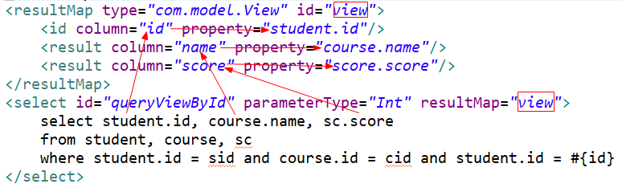

# Mybatis

参考视频：[Mybatis视频教程](https://www.bilibili.com/video/BV1gs411j7kA)。

## 概述

MyBatis的含义：一个ORM的框架。看到这句话就会纳闷-orm是啥？框架又是啥？

### 框架

框架就是一组协同工作的类，它们为特定类型的软件构筑了一个可重用的设计（可以类比API，基础类库等等）。框架其实就是某种应用的半成品，就是一组组件，供你使用完成你的系统。框架总是解决应用中某个领域的问题。

框架不是万能的，一个框架一般只解决某一个领域的问题。框架本身是很死板、固定的，它如何工作取决于开发人员怎么去使用它。

最佳实践：实际上是无数程序员经历过无数次尝试之后总结出来的处理特定问题的特定方法。如果把程序员的自由发挥看作是一条通往成功的途径，最佳实践就是其中的最短路径，能极大地解放生产力。

最佳实践三要素：可读性、可维护性、可拓展性，可理解为：消除重复、化繁为简。

框架用起来真地比我们用底层的（原生的）简单吗？ 不一定；框架的功能比底层的功能更加强大吗？不一定。但能肯定的是，框架会帮我们规范代码。

### ORM

即object relational mapping-对象关系映射。

| 面向对象概念           | 面向关系概念         |
| ---------------------- | -------------------- |
| 类（class）            | 表                   |
| 对象（instance）       | 表的行（记录、元组） |
| 属性（instance field） | 表的列（字段、属性） |

实现思想：将关系数据库中表中的记录映射成为对象，以对象的形式展现，即数据表中的每一个记录对应一个实例对象，每一个字段对应该实例对象的一个实例域，于是程序员可以把对数据库的操作转化为对对象的操作，因此ORM的目的是方便开发人员以面向对象的思想来实现对数据库的操作。

ORM采用元数据来描述对象-关系映射的细节，元数据通常采用 XML 格式，并且存放在专门的对象-关系映射文件中。

| 流行的ORM框架 | 描述                                                         |
| ------------- | ------------------------------------------------------------ |
| JPA           | java persistence API，本身是一种ORM规范，不是ORM框架，由各大ORM框架提供实现。 |
| Hibernate     | 目前最流行的ORM框架，设计灵巧、性能一般（需要自己控制性能而且极不好控制)、文档丰富。Hibernate是一个完整的ORM框架，一句SQL都不用写。 |
| MyBatis       | 本是apache的一个开源项目iBatis。它提供的持久层框架包括SQL Maps和DAO，允许开发人员直接编写SQL（更好更灵活），故MyBatis 并不是一个完整的ORM框架，因为我们还需要自己去写SQL语句。 |

### MyBatis

MyBatis 本是apache的一个开源项目iBatis，2010年这个项目由apache software foundation 迁移到了google code，并且改名为MyBatis ，2013年11月迁移到Github。iBATIS一词来源于internet和abatis的组合，是一个基于Java的持久层框架。iBATIS提供的持久层框架包括SQL Maps和Data Access Objects（DAO）。

MyBatis 是一个支持普通 SQL查询、存储过程和高级ORM映射的优秀持久层框架。它消除了几乎所有的JDBC代码和手工设置参数以及结果集的检索。MyBatis 使用简单的 XML或注解来配置原始映射，将接口和 Java 的POJOs（Plain Old Java Objects-普通的 Java对象）映射成数据库中的记录。

## 基本使用

### jar包

版本可变。

- mybatis-3.1.1.jar。

- mysql-connector-java-5.1.16-bin.jar。

### 数据库连接

之所以采用属性配置文件的方式，是因为后期要改数据源的话，容易找到这些属性并修改。

创建db.properties文件，放在src中。

```properties
jdbc.driver = com.mysql.cj.jdbc.Driver
jdbc.url = jdbc:mysql://localhost:3306/mybatis
username = root
password = root
```

注意形式：`key=value`。

### 全局配置文件

#### 代码提示

访问不到mybatis相关网址时，可提取本地dtd文件以实现代码提示。

先提取dtd文件。解压缩下图中mybatis的jar包，按所示路径找到这两个dtd文件-mybatis-3-mapper.dtd、mybatis-3-config.dtd。

然后在eclipse中配置如下：


取名mybatis-config.xml或者mybatis.xml，放在src中，与com同级。下面是一个例子：

```xml
<?xml version="1.0" encoding="UTF-8"?>
<!DOCTYPE configuration PUBLIC "-//mybatis.org//DTD Config 3.0//EN"
"http://mybatis.org/dtd/mybatis-3-config.dtd">
<configuration>
    <!-- 动态引入数据库连接配置文件，resource值为配置文件名 -->
	<properties resource="db.properties"></properties>
	<settings>
        <!-- 遵循驼峰命名规则生成实例域 -->
        <setting name="mapUnderscoreToCamelCase" value="true" />
    </settings>
    <!-- 给实体类指定别名 -->
    <typeAliases>
		<typeAlias type="com.model.Student" alias="student"/>
	</typeAliases>
    <!-- 指定开发环境，即数据库环境 -->
	<environments default="development">
        <!-- 这里可配多个environment，然后由上面的default指定用哪一个 -->
		<environment id="development">
            <!-- 事务提交方式
 				JDBC：利用JDBC方式（手动方式）处理事务，如commit、rollback、close
				MANAGED：将事务交由其他组件管理，如spring、jobss，默认事务结束会关闭连接
			-->
			<transactionManager type="JDBC"/>
            <!-- 数据源有UNPOOLED（无连接池，传统JDBC模式）、POOLED、JDNI等 -->
			<dataSource type="POOLED">
				<property name="driver" value="${jdbc.driver}"/>
				<property name="url" value="${jdbc.url}"/>
				<property name="username" value="${username}"/>
				<property name="password" value="${password}"/>
			</dataSource>
		</environment>
	</environments>
    <!-- 映射器，即实现接口的那些xml文件 -->
	<mappers>
		<package name="com.van.dao"/>
	</mappers>
</configuration>
```

去[官方文档](https://mybatis.org/mybatis-3/zh/configuration.html#)了解详尽的配置说明，本章拣几个标签谈谈，还有一些后续章节会讲到。

#### 全局参数

全局参数比较敏感，牵一发而动全身。settings标签下的一个setting标签对应一种全局参数。

各参数意义可见于[settings](https://mybatis.org/mybatis-3/zh/configuration.html#settings)。

#### 类别名

用typeAliases标签设定类的别名。别名适用于ParameterType、resultType等属性。

```xml
<!-- 批量地对domain.blog包中里的所有类设别名，具体使用Bean的首字母小写的非限定类名来作为它的别名 -->
<typeAliases>
  <package name="domain.blog"/>
</typeAliases>

<!-- 非批量方式 type值为类的全限定类名，默认别名是首字母小写的非限定类名，不用默认的话加alias属性以自指定别名，忽略大小写 -->
<typeAliases>
    <typeAlias alias="user" type="com.van.pojo.User"/>
</typeAliases>
```

另有注解支持非批量方式。

```java
@Alias("user")
class User{...}
```

mybatis内置的类型别名见于[typeAliases](https://mybatis.org/mybatis-3/zh/configuration.html#typeAliases)。

#### 类型转换器

mybatis内置类型处理（转换）器见于[typeHandlers](https://mybatis.org/mybatis-3/zh/configuration.html#typeHandlers)。

若想自定义类型处理器，需要实现TypeHandle接口（根本），也可以继承其实现类BaseTypeHandle，重写方法，然后在配置文件中添加相应配置。

因为暂时没用到，这里就不给出具体做法了，参见[typeHandlers](https://mybatis.org/mybatis-3/zh/configuration.html#typeHandlers)。

### SQL映射文件

#### 概述

文件名形如<span id="mapper">xxxMapper.xml</span>，放在dao中。示例如下：

```xml
<?xml version="1.0" encoding="UTF-8"?>
<!DOCTYPE mapper PUBLIC "-//mybatis.org//DTD Mapper 3.0//EN"
"http://mybatis.org/dtd/mybatis-3-mapper.dtd">

<!-- 命名空间namespace是本映射文件的唯一标识符，值对应实现的DAO层接口 -->
<mapper namespace="com.dao.IStudentDao">
	<!-- 多参数查询，脚标 -->
	<select id="queryScore" resultType="Int">
		select score 
		from sc 
		where sid = #{0} and cid = #{1}
	</select> 
	<!-- 多参数查询， mybatis封装的格式-->
	<select id="queryByHomeAndDept" resultType="com.model.Student">
		select * 
		from student
		where home = #{param1} and dept = #{param2}
	</select> 
	<!-- 多参数查询，注解 -->
	<select id="queryByAgeAndHome" resultType="com.model.Student">
		select * 
		from student
		where age = #{age} and home = #{home}
	</select>
	<!-- 多参数查询，map -->
	<select id="queryByAgeAndGender" parameterType="hashMap" resultType="com.model.Student">
		select * 
		from student
		where age = #{age} and gender = #{gender}
	</select>
	<select id="queryById" parameterType="Int" resultType="com.model.Student">
		select *
		from student
		where id = #{id}
	</select>
	<!-- 注意resultMap的写法 -->
	<resultMap type="com.model.View" id="view">
		<id column="id" property="student.id"/>
		<result column="name" property="course.name"/>
		<result column="score" property="score.score"/>
	</resultMap>
	<select id="queryViewById" parameterType="Int" resultMap="view">
		select student.id, course.name, sc.score
		from student, course, sc
		where student.id = sid and course.id = cid and student.id = #{id}
	</select>
</mapper>
```

#### resultMap

当我们碰到属性名和字段名不同及类的组合（内部类，一般用于实现关系型到非关系型的转换）问题时，resultMap是个很好的解决工具。针对属性名和字段名不同，更简单的解决方法是在select语句中给属性起别名。

以解决内部类问题为例，梳理一下resultMap的数据传递机制：resultMap标签里的id值要与select标签里的resultMap值一致。数据从SQL查询结果传递到resultMap，具体是column属性（故值应与SQL语句里对应字段名相同），接着从column传递到property（值是实体类的内部类的字段）。以一个例子展示传递过程：



其中id标签针对主键字段；result标签针对非主键字段。

应认真学习官方文档的[结果映射与高级结果映射](https://mybatis.org/mybatis-3/zh/sqlmap-xml.html#Result_Maps)部分，尤注意association、collection标签。辅以resultMap标签的多层嵌套结构适用于多表连接查询，比如类A的一个实例域是类B对象组成的列表，而类B的一个实例域又是一个类C对象，即表A对表B作一对多查询，表B对表C作一对一查询。来看一个例子-根据班级号查询某班全体学生包括健康码在内的所有信息：

```xml
<mapper namespace="com.van.dao.IClassDao">
	<resultMap type="class" id="clsMap">
		<id column="cno" property="cno" />
		<result column="cname" property="cname" />
		<collection property="students" ofType="student">
			<id column="sno" property="sno" />
			<result column="sname" property="sname" />
			<result column="gender" property="gender" />
			<result column="age" property="age" />
			<result column="cno" property="cno" />
			<association property="code" javaType="code">
				<id column="sno" property="sno" />
				<result column="state" property="state" />
			</association>
		</collection>
	</resultMap>
    <!-- 注意三及以上张表的外连接的写法 两张表先外连接再与下一张表外连接 -->
	<select id="selectStudentsByCno" resultMap="clsMap">
		select class.cno, cname, student.sno, sname, gender, age, state
		from class left outer join student on class.cno = student.cno
		left outer join code on student.sno = code.sno
		where class.cno = #{cno}
	</select>
</mapper>
```

应题目要求，此代码选定所有字段以注入三个类的所有实例域。mybatis并不强制要求选定所有字段，未注入的实例域填充默认值。

附带讲上述SQL语句可优化：

```sql
select class.cno, cname, student.sno, sname, gender, age, state
# 避免做连接2班的冗余扫描
from ( select cno, cname from class where cno = 1) as class
left outer join student on class.cno = student.cno
left outer join code on student.sno = code.sno;
```

#### 两种取值符号

当参数为简单类型（8大基本类型+字符串）：

```xml
#{任意值}
${value}
```

尤当参数为字符串，#会给参数包上单引号，$则不会，故要手动加：

```xml
#{deptName} -> 'CS'
${value} -> CS
<!-- 传入字段值的话就应写为'${value}' -->
```

对于字符串类型，#会将参数包上单引号，$则不会。

对此特点，#适用于字段值参数，$适用于字段名参数。来看个动态排序的例子：

```xml
<select id="queryOrderByName" resultTpe="student">
    <!-- 这里传入的是字段名，故不加引号 这里用#就不可行 -->
	select * from student order by ${value}
</select>
```

#可防止SQL注入，$则防不了。

当参数为对象：

```xml
#{属性名}
${属性名}
```

#### 模糊查询

即用到like关键字。

可在传入实参前给它拼上%或_：

```java
student.setName("张%");
```

也可在标签中使用MySQL的CONCAT函数：

```xml
<select id="fuzzyQuery" parameterType="string" resultType="string">
	select name
	from course
	where name like CONACT(#{name}, '%')
</select>
<select id="fuzzyQuery" parameterType="string" resultType="string">
	select name
	from course
	where name like CONACT('${value}', '%')
</select>
```

也可直接像第4行这样写：

```xml
<select id="fuzzyQuery" parameterType="string" resultType="string">
	select name
	from course
	where name like '%${value}%'
</select>
<!-- 此处换成#就不好了 -->
```

#### HashMap

HashMap可作parametType的值，有几节已讨论过。

HashMap也可作resultType的值。一个map对应一组实例域或一条记录，若返回多组实例域，则需将dao层方法的返回值类型设为`List<HashMap<String, Object>>`。

```xml
<select id="selectAsMap" resultType="hashMap">
    select id as goodId, name as goodName from good limit 2
</select>
<!-- 结果为[{goodName=联想电脑, goodId=1}, {goodName=戴尔笔记本, goodId=2}]，像前端的json -->
```

#### 调用存储函数


#### CRUD标签

mybatis提供增删改查标签，对它们嵌入SQL语句。

```xml
<!-- id属性值指SQL语句在此空间内的唯一标识符 -->
<select>select……</select>
<insert>insert……</insert>
<update>update……</update>
<delete>delete……</delete>
```

#### 多参数处理

参数超过1个的话parameterType就没意义了，且它本来就是可选的。附带讲对函数来说，参数的类型远比名称重要。

- 采用脚标。不够好，因为顺序没有名字直观，而且改了顺序自己又可能记不住容易出错。

- 采用mybatis封装格式。同样不够好。
- 采用注解。
- 采用map封装。
- 采用po（pojo）方式。

前4种处理法的具体实现前面的[mapper.xml](#mapper)示例文件已给出。当参数很多，往往用po方式，将它们挂载到实体类对象上。

#### 动态SQL

有if标签、where标签、choose标签、foreach标签等等。理解它们的用法。

关于前三个标签，可参考下面的代码：

```xml
<resultMap type="com.model.View" id="view">
		<id column="id" property="student.id"/>
		<result column="name" property="student.name"/>
		<result column="gender" property="student.gender"/>
		<result column="age" property="student.age"/>
		<result column="dept" property="student.dept"/>
		<result column="cname" property="course.name"/>
		<result column="score" property="score.score"/> 
</resultMap>
<!-- 动态SQL -->
<select id="queryView" resultMap="view">
	select 
		student.id, 
		student.name,
		student.gender,
		student.age,
		student.dept,
		course.name as cname,
		sc.score
	from student, course, sc
	<where>
		student.id = sc.sid and course.id = sc.cid
		<if test="age!=null">
			and age = #{age}
		</if>
		<if test="gender!=null">
			and gender = #{gender}
		</if>
		<if test="dept!=null">
			and dept = #{dept}
		</if>
	</where>
</select>
<select id="queryViewByOne" resultMap="view">
	select 
		student.id, 
		student.name,
		student.gender,
		student.age,
		student.dept,
		course.name as cname,
		sc.score
	from student, course, sc
	<where>
		student.id = sc.sid and course.id = sc.cid
		<choose>
			<when test="age!=null">
				and age = #{age}
			</when>
			<when test="gender!=null">
				and gender = #{gender}
			</when>
			<when test="dept!=null">
				and dept = #{dept}
			</when>
		</choose>
	</where>
</select>
```

我们知道where后面不能直接跟一个and，where标签会自动处理掉第一个成立分支里的and。不用where标签的话，可代之以恒真表达式如：

```xml
<select id="queryStudent" resultType="student">
	select 
		id, 
		name,
		gender,
		age,
		dept,
	from student
    <!-- 1=1作where和and之间的有效媒介 -->
	where 1 = 1
		<if test="age!=null">
			and age = #{age}
		</if>
		<if test="gender!=null">
			and gender = #{gender}
		</if>
		<if test="dept!=null">
			and dept = #{dept}
		</if>
</select>
```

至于第四个标签，它适用于数组、集合、列表等属性。可参考下面的例子：

```xml
<!-- 遍历属性（属性的类型是集合或数组） -->
<select id="queryStudentsByProperty" parameterType="com.model.Sno" resultType="com.model.Student">
    select *
    from student
	<where>
		<if test="snos != null and snos.size > 0">
        <!-- snos是参数名 -->
		<foreach collection="snos" item="sno" open=" id in (" close=")" separator=",">
			#{sno}
		</foreach>
		</if>
	</where>
</select>
<!-- 遍历数组，约定用array一词 -->
<select id="queryStudentsByArray" parameterType="int[]" resultType="com.model.Student">
    select *
    from student
    <where>
		<if test="array != null and array.length > 0">
        <foreach collection="array" item="sno" open=" id in (" close=")" separator=",">
			#{sno}
        </foreach>
        </if>
    </where>
</select>
<!-- 遍历列表，约定用list一词 -->
    <select id="queryStudentsByList" parameterType="list" 						resultType="com.model.Student">
    	select *
		from student
	<where>
		<if test="list != null and list.size > 0">
		<foreach collection="list" item="sno" open=" id in (" close=")" 			separator=",">
			#{sno}
		</foreach>
		</if>
	</where>
</select>
<!-- 遍历对象数组，自行看各处名字的变化 -->
<select id="queryStudentsByObjectArray" parameterType="Object[]" resultType="com.model.Student">
    select *
    from student
    <where>
        <if test="array != null and array.length > 0">
        <foreach collection="array" item="student" open=" id in (" close=")" 		separator=",">
            #{student.id}
        </foreach>
        </if>
	</where>
</select>
```

#### SQL的提取

我们提取SQL语句以跨文件使用。

```xml
<!-- 提取用很多次的某段SQL，这里只是举例子，属性值和语句都不重要 -->
<sql id="selectAll">
    select *
    from student
</sql>

<!-- 引用某段SQL，若SQL片段在其他文件里，则需采用命名空间.标识符的写法 -->
<select id="selectAllStudents">
    <include refid="selectAll"></include>	
</select>
```

### DAO层接口

文件名形如xxxDao.java，放在dao中。

```java
package com.dao;

import java.util.List;
import java.util.Map;

import org.apache.ibatis.annotations.Param;

import com.model.Student;
import com.model.View;

public interface IStudentDao {

	/**
	 * 根据学号课程号查成绩
	 *
	 * @param sid
	 * @param cid
	 * @return
	 */
	public int queryScore(int sid, int cid);

	/**
	 * 根据学号查学生
	 *
	 * @param id
	 * @return
	 */
	public Student queryById(int id);

	/**
	 * 根据籍贯和系别查学生
	 *
	 * @param home
	 * @param dept
	 * @return
	 */
	public List<Student> queryByHomeAndDept(String home, String dept);

	/**
	 * 根据年龄和籍贯查学生，注意param注解
	 *
	 * @param age
	 * @param home
	 * @return
	 */
	public List<Student> queryByAgeAndHome(@Param("age") int age, @Param("home") String home);

	/**
	 * 根据年龄和性别查学生，注意参数map
	 *
	 * @param age
	 * @param gender
	 * @return
	 */
	public List<Student> queryByAgeAndGender(Map<String, Object> map);

	/**
	 * 根据学生id查询成绩视图（多表连接）
	 *
	 * @return
	 */
	public List<View> queryViewById(int id);
}
```

### 测试

```java
package com;

import java.io.IOException;
import java.io.InputStream;
import java.util.HashMap;
import java.util.List;
import java.util.Map;

import org.apache.ibatis.io.Resources;
import org.apache.ibatis.session.SqlSession;
import org.apache.ibatis.session.SqlSessionFactory;
import org.apache.ibatis.session.SqlSessionFactoryBuilder;
import org.junit.jupiter.api.Test;

import com.dao.IStudentDao;
import com.model.Student;
import com.model.View;

class MybatisTest {

	private static IStudentDao mapper;

	static {
		String source = "mybatis.xml";
		InputStream inputStream = null;
		try {
			// 读取配置文件，即将磁盘里的配置文件mybatis.xml读取到内存中
			inputStream = Resources.getResourceAsStream(source);
		} catch (IOException e) {
			e.printStackTrace();
		}
		// 基于写好的配置（主要是数据库环境），生成SqlSessionFactory（工厂模式了解一下）
		SqlSessionFactory sqlSessionFactory = new SqlSessionFactoryBuilder().build(inputStream);
		// 工厂生产SqlSession对象
		SqlSession session = sqlSessionFactory.openSession();
		// 通过SqlSession对象创建dao接口的代理对象
		mapper = session.getMapper(IStudentDao.class);
		// 附释放资源：session.close(); inputStream.close();
	}

	@Test
	void testQueryScore() {

		// 使用代理对象执行方法
		int score = mapper.queryScore(1, 2);
		System.out.println(score);
	}

	@Test
	void testQueryById() {
		System.out.println(mapper.queryById(10));
	}

	@Test
	void testQueryByHomeAndDept() {
		List<Student> students = mapper.queryByHomeAndDept("黄梅", "数计");
		for (Student student : students) {
			System.out.println(student);
		}
	}

	@Test
	void testQueryByAgeAndHome() {
		List<Student> students = mapper.queryByAgeAndHome(20, "宁夏");
		for (Student student : students) {
			System.out.println(student);
		}
	}

	@Test
	void testQueryByAgeAndGender() {
		Map<String, Object> map = new HashMap<String, Object>();
        // 用map封装参数
		map.put("age", 21);
		map.put("gender", "男");
		List<Student> students = mapper.queryByAgeAndGender(map);
		for (Student student : students) {
			System.out.println(student);
		}
	}

	@Test
	void testQueryViewById() {
		List<View> views = mapper.queryViewById(1);
		for (View view : views) {
			System.out.println(
					view.getStudent().getId() + "\t" + view.getCourse().getName() + "\t" + view.getScore().getScore());
		}
	}

}
```

使用诸sql语句的方式有两种，这里用的是非基础方式，也叫约定代替配置方式。基础方式是用`namespace.id值`的形式定位sql语句，但是无复用性，每用一个sql就写一次namespace。

约定也可理解为默认。接口里的方法必须遵循以下约定：

- 方法名须和sql标签的id值相同。
- 方法的参数类型须和sql标签的parameterType值相同。
- 方法返回值的类型须和sql标签的resultType值相同。

## 整合log4j

常见的日志框架有：

- SLF4J。
- Apache Commans Logging。
- Log4j 2。
- Log4j。
- JDK Logging。

这里老师只介绍log4j（log for java）。

在全局配置文件中开启日志：

```xml
<settings>
	<!-- 开启日志并指定日志框架为log4j -->
    <setting name="logImpl" value="LOG4J"/>
</settings>
```

如果不加上述配置，mybatis根据此顺序选用日志框架：SLF4J、Apache Commons Logging、Log4j 2、Log4j、JDK Logging。

然后编写日志输出的配置文件log4j.properties，这个不用自己写，请参考官方文档的[日志部分](https://mybatis.org/mybatis-3/zh/logging.html)。

日志级别：DEBUG<INFO<WARN<ERROR。比如若指定级别为INFO，则只打印INFO及其以上级别的信息，其余的省略。建议在开发时指定级别为DEBUG，上线运行时为INFO。

可以通过日志，查看mybatis的详细执行情况，如SQL语句及其参数、返回值。

## 延迟加载

即懒加载-lazy load，简单描述为将一次主副表间的连接查询等价优化为多次单表查询。具体地，先仅查询主表并将结果注入主类对象，后等到访问副表映射的实体类对象即主类对象的内部类实例域时才动态地根据连接字段查询副表，并将结果注入主类对象的内部类实例域。那么虽然单次查询变成了多次查询，看起来查询次数变多了，但可想见连接查询的开销是很大的，尤当字段数特别多时。

欲激活延迟加载，先配置：

```xml
<!-- 开启延迟加载 -->
<setting name="lazyLoadingEnabled" value="true"/>
<!-- 关闭立即加载 -->
<setting name="aggressiveLazyLoading" value="false"/>
```

我们列举几个例子。现有班级表、学生表、健康码表，对应地，有班级类、学生类、健康码类，且学生类列表作班级类的一个实例域，健康码类对象作学生类的一个实例域。先看一对一查询：查询包括健康码信息在内的所有学生信息。

```xml
<!-- studentMapper.xml内 -->
<resultMap type="student" id="stuLazyMap">
    <id column="sno" property="sno"/>
    <result column="sname" property="sname"/>
    <result column="gender" property="gender"/>
    <result column="age" property="age"/>
    <result column="cno" property="cno"/>
    <!-- 懒加载 -->
    <association property="code" javaType="code" select="com.van.dao.ICodeDao.selectBySno" column="sno"></association>
</resultMap>
<select id="selectAllWithCodeLazy" resultMap="stuLazyMap">
    select sno, sname, gender, age, cno from student
</select>

<!-- codeMapper.xml内 -->
<select id="selectBySno" resultType="code">
    select sno, state from code where sno = ${value}
</select>
```

```java
@Test
void testStudentLazyLoad() {
    // 看到students，就知道开始查询学生表
    List<Student> students = studentDao.selectAllWithCodeLazy();
    // 学生表有多少条记录，就查多少次健康码表
    for (Student student : students) {
        // 看到code，就知道动态地根据当前学生记录的sno查询健康码表
        Code code = student.getCode();
        System.out.println(code);
    }
}
```

再看一对多查询：根据班级号查询该班所有学生的包括健康码信息在内的所有信息。

```xml
<!-- classMapper.xml内 -->
<resultMap type="class" id="clsLazyMap">
    <id column="cno" property="cno" />
    <result column="cname" property="cname" />
    <!-- 懒加载 -->
    <collection property="students" ofType="student" select="com.van.dao.IStudentDao.selectByCnoLazy" column="cno"></collection>
</resultMap>
<select id="selectStudentsByCnoLazy" resultMap="clsLazyMap">
    select cno, cname from class where cno = ${value}
</select>

<!-- studentMapper.xml内 -->
<resultMap type="student" id="stuLazyMap">
    <id column="sno" property="sno"/>
    <result column="sname" property="sname"/>
    <result column="gender" property="gender"/>
    <result column="age" property="age"/>
    <result column="cno" property="cno"/>
    <!-- 懒加载 -->
    <association property="code" javaType="code" select="com.van.dao.ICodeDao.selectBySno" column="sno"></association>
</resultMap>
<select id="selectByCnoLazy" resultMap="stuLazyMap">
    select sno, sname, gender, age, cno from student where cno = ${value}
</select>

<!-- codeMapper.xml内 -->
<select id="selectBySno" resultType="code">
    select sno, state from code where sno = ${value}
</select>
```

```java
@Test
void testClassLazyLoad() {
    Class classOne = classDao.selectStudentsByCnoLazy((short) 1);
    for (Student student : classOne.getStudents()) {
        // 调用student.toString()访问到了实例域code
        System.out.println(student);
    }
}
```

附带讲，即使不延迟加载地进行非连接查询也能大大提升效率。故应关注association、collection标签的select属性。

## 多级查询缓存

### 概述

顾名思义，多级缓存只针对查询，不针对增删改。

### 一级缓存

一级缓存机制为：以两次非查询提交间隔为一个缓存有效期，第一次作某一种查询后会将结果缓存到类静态内存区的SqlSeesion对象中，下一次作同一种查询时就不会连接、访问数据库，而是更快捷地从前述缓存中拿结果，数据库访问耗性能不少。

mybatis默认开启一级缓存，自己可以验证一下，即两次紧挨着调用DAO接口的同一个方法，会发现控制台日志不会显示两遍对应SQL语句。继续试，简单地在两次调用之间直接插一句`session.commit()`，运行起来发现SQL语句显示两遍。提交操作会使得SqlSession清理缓存。

### 二级缓存

二级缓存就更灵活了，它只关注映射器的namespace即接口的全限定类名，只要两个代理对象（mapper对象）来自同一个命名空间，就能从硬盘缓存（文件）中取结果。二级缓存的缓存操作于SqlSession对象关闭时进行。给个例子：

```java
SqlSession session1 = sqlSessionFactory.openSession();
mapper1 = session1.getMapper(IStudentDao.class);
SqlSession session2 = sqlSessionFactory.openSession();
// mapper1、mapper2虽由不同session产生，但都对应同一个命名空间
mapper2 = session2.getMapper(IStudentDao.class);
mapper1.selectBySno(10);
// 为减少IO带来的开销，在session对象关闭时将本次会话内得到的多个SQL结果按命名空间分门别类序列化（钝化）进外存
session1.close()
// 不会再发一次SQL语句，而是直接从硬盘中取结果（活化）
mapper2.selectBySno(10);
// ...
// 将session2活动期间得到的多个新SQL结果序列化
session2.close();
```

在一级缓存够用时没必要用二级缓存，只有一级缓存不够用才使用二级缓存，这就要看诸代理对象是否由同一session对象生成。

mybatis默认关闭二级缓存。想开启的话，要做下面这几件事：

- 去全局配置文件：

  ```xml
  <!-- 全局开启 -->
  <settings>
      <setting name="cacheEnabled" value="true"/>
  </settings>
  ```

- 去对应的映射文件：

  ```xml
  <mapper namespace="com.van.dao.IStudentDao">
      <!-- 命名空间开启 适用于本空间下所有SQL语句 -->
      <cache/>
  </mapper>
  ```

- 实体类实现序列化接口：`public class Student implements Serializable {...}`。有时还应让作此类实例域的内部类等一干类全部实现序列化接口。

附带一提。正常情况下命名空间（接口名）与映射器一一对应，但当不同的映射器文件写同一个命名空间，本来针对各自命名空间的这些映射器就乱套地共享二级缓存里的同一块区域，当然我们应该规避这种情况。

我们可能想让某个SQL语句禁用二级缓存：

```xml
<select useCache="false">...</select>
```

与一级缓存相同，二级（硬盘）缓存的清理操作亦触发于非查询提交操作，原因不难想到是避免脏数据产生。另外我们也可对select标签施加属性`flushCache="true"`，使得一旦此语句被调用，就清空一二级缓存。

有些第三方（非mybatis、数据库）提供的二级缓存，如ehcache、mencache，它们必定实现mybatis下的Cache接口。这里老师只介绍了ehcache，暂且不记，用到再说。

## 逆向工程

关系表、实体类、DAO层接口及映射器是一个有机整体，已知其中任何一个，再据此得到其他三个，这就是逆向工程。一般地，根据关系表生成其他三个。

看起来挺智能的，但其实生成的东西不太符合我们的预期，所以这个仅作了解。

## 环境切换

通过build方法绕过全局配置文件，指定数据库环境。
