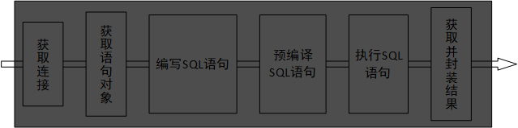
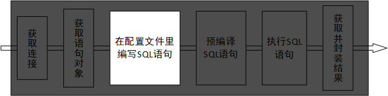
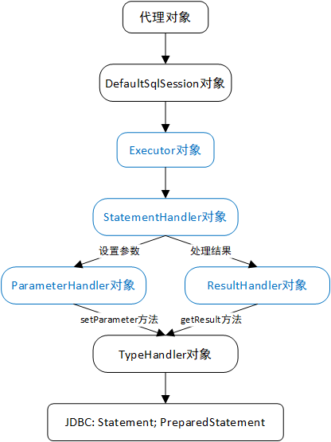

# Mybatis

参考视频：

- [Mybatis视频教程](https://www.bilibili.com/video/BV1gs411j7kA)。
- [SSM联讲](https://www.bilibili.com/video/BV1d4411g7tv?p=120)。

## 概述

MyBatis 是一个用于和数据库交互的持久化层框架或SQL映射框架。

回顾往昔，从原始的JDBC到DBUtils-自己写的、QueryRunner、JdbcTemplate，后者是工具，是较为简单的一些功能封装，框架则是某个领域的整体解决方案。比如数据库方面的框架应考虑到缓存、异常处理、部分字段映射等方方面面的问题。

原生JDBC写起来繁杂且是硬编码（维护性差-改了SQL语句就得重新打包部署项目）-数据库层与dao层代码的耦合，梳理一下流程：


工具的繁杂程度降低了点，但仍是硬编码。

先熟悉ORM的概念，即object relational mapping-对象关系映射。

| 面向对象概念                  | 面向关系概念     |
| ----------------------------- | ---------------- |
| 类（class）                   | 表               |
| 对象（instance）              | 行（记录、元组） |
| 属性（实例域-instance field） | 列（字段、属性） |

将关系数据库中表中的记录映射成为对象，以对象的形式展现，即数据表中的每一个记录对应一个实例对象，每一个字段对应该实例对象的一个实例域，于是对记录的操作与对对象的操作相互转化。因此ORM的目的是方便开发人员以面向对象的思想来实现对数据库的操作。

早前十分流行的框架Hibernate就是一个ORM框架，它是一个极为完整框架，使用户只需专注于创建标有Table注解JavaBean及调用相关方法，它自动创建表、更新表结构、增删改查，即包揽了全部SQL语句。

Hibernate为用户完全屏蔽了底层JDBC细节，相当于把流程做成黑箱：



这样子缺点就显现出来，当我们针对复杂业务需要定制SQL语句（如多表关联、部分字段映射）时，虽然也可以基于hibernate的HQL技术实现，但大大增加了不必要的学习成本。

于是我们希望框架既能持有其他强大功能，又能为我们保留定制SQL语句的余地，且SQL语句以软编码形式存在，由此引出mybatis。



SQL语句处在外部文件中，修改了就不用重新打包部署，但服务器要重启，因为运行时不会再将文件加载到内存。

流程中其他步骤的设定都可在全局配置文件中进行，相关的优化问题mybatis也在底层都解决了。

MyBatis本是apache的一个开源项目iBatis，2010年这个项目从apache迁移到了google code，并且改名为MyBatis ，此时的版本就是3.x，2013年11月迁移到Github。iBatis一词是internet和abatis的组合，是一个基于Java的持久化层框架，主要提供了SQL Maps和Data Access Objects。

## 实例

导入mybatis的那一个包与MySQL驱动包，另建议导入log4j。

编写log4j配置文件，本地已有先例，或去网上找。

JavaBean的定义就省略了。

编写dao层接口：

```java
public interface EmployeeDao {
	public Employee getEmpById(Integer id);
}
```

编写全局配置文件置于类路径下，名称随意，如mybatis-config.xml。从官网摘录示例然后稍加修改：

```xml
<?xml version="1.0" encoding="UTF-8" ?>
<!DOCTYPE configuration
  PUBLIC "-//mybatis.org//DTD Config 3.0//EN"
  "http://mybatis.org/dtd/mybatis-3-config.dtd">
<configuration>
  <!-- 数据库环境 -->
  <environments default="development">
    <environment id="development">
      <transactionManager type="JDBC"/>
      <dataSource type="POOLED">
        <property name="driver" value="com.mysql.cj.jdbc.Driver"/>
        <property name="url" value="jdbc:mysql://localhost:3306/mybatis"/>
        <property name="username" value="root"/>
        <property name="password" value="root"/>
      </dataSource>
    </environment>
  </environments>
  <!-- 引入各接口对应的SQL映射文件 -->
  <mappers>
  	<!-- resource值起始于classpath -->
    <mapper resource="mappers/employeeMapper.xml"/>
  </mappers>
</configuration>
```

编写SQL映射文件，起名如employeeMapper.xml，也置于源码包下，相当于EmployeeDao的实现类。从官网摘录示例并稍加修改：

```xml
<?xml version="1.0" encoding="UTF-8" ?>
<!DOCTYPE mapper PUBLIC "-//mybatis.org//DTD Mapper 3.0//EN" "http://mybatis.org/dtd/mybatis-3-mapper.dtd">
<!-- 命名空间namespace是本映射文件的唯一标识符，值是对应dao层接口的全限定类名 -->
<mapper namespace="dao.EmployeeDao">
  <!-- id值是对应方法名，是此方法在当前命名空间内的唯一标识符，resultType值是方法的返回值类型 -->
  <select id="getEmpById" resultType="bean.Employee">
    SELECT id, last_name AS lastName, email, gender FROM employee WHERE id = #{id}
  </select>
</mapper>
```

测试：

```java
InputStream inputStream = null;
// 读取配置文件到内存，相对路径其实于classpath
inputStream = Resources.getResourceAsStream("mybatis-config.xml");
// 基于全局配置，生成SqlSessionFactory对象
SqlSessionFactory sqlSessionFactory = new SqlSessionFactoryBuilder().build(inputStream);
// 通过SqlSessionFactory对象创建SqlSession对象
SqlSession session = sqlSessionFactory.openSession();
try {
    // 通过SqlSession对象创建dao层接口的代理对象
    EmployeeDao mapper = session.getMapper(EmployeeDao.class);
    // class com.sun.proxy.$Proxy8 底层用到动态代理
    System.out.println(mapper.getClass());
    // 使用代理对象执行方法
    Employee employee = mapper.getEmpById(2);
    System.out.println(employee);
} finally {
    // 释放资源，底层归还连接给连接池
    session.close();
}
```

运行期间，工厂对象一个即可，SqlSession对象则有多个，一个SqlSession对象对应多个代理对象。

从连接池获取的一个连接可以同步地服务多个SqlSession对象，一个SqlSession对象可以同步地产生多个事务。

## 提取DTD

访问不到mybatis相关网址时，可提取本地dtd文件以实现代码提示。解压图中的jar包，提出这两个dtd文件，然后在eclipse中配置。


这两个一个针对全局配置文件（config）一个针对SQL映射文件（mapper）。

## 全局配置文件

### 概述

可去[官方文档](https://mybatis.org/mybatis-3/zh/configuration.html#)了解详尽的配置说明，本章谈到的标签中重点关注settings和mappers。

全体标签的排列顺序是规则的。

### properties

此标签用于引用外部数据库环境配置文件。创建db.properties文件置于源码包下，配置数据库环境，然后引入。

```properties
jdbc.driver=com.mysql.cj.jdbc.Driver
jdbc.url=jdbc:mysql://localhost:3306/mybatis
jdbc.username=root
jdbc.password=root
```

```xml
<!-- 引入数据库环境配置文件 resource值起始于类路径，url值是绝对路径或网上资源地址 -->
<properties resource="db.properties"></properties>
<environments default="development">
    <environment id="development">
        <transactionManager type="JDBC" />
        <dataSource type="POOLED">
            <property name="driver" value="${jdbc.driver}" />
            <property name="url" value="${jdbc.url}" />
            <property name="username" value="${username}" />
            <property name="password" value="${password}" />
        </dataSource>
    </environment>
</environments>
```

### settings

官方强调此标签极为重要，影响mybatis的运行时行为，其下每一项setting都应当认真了解，参见[settings](https://mybatis.org/mybatis-3/zh/configuration.html#settings)。

属性太多，暂且介绍其中一个-mapUnderscoreToCamelCase-是否开启驼峰名自动映射，设为true则封装对象时将列的下划线分隔名映射到域的小驼峰名，就不用我们写SQL时设列别名了。

```xml
<settings>
    <!-- 驼峰名下划线分隔名自动映射 -->
    <setting name="mapUnderscoreToCamelCase" value="true" />
</settings>
```

### typeAliases

用typeAliases标签设定自定义类的别名。别名适用于ParameterType、resultType、ofType、javaType属性（这些属性不区分大小写）。mybatis内置的类型别名见于[typeAliases](https://mybatis.org/mybatis-3/zh/configuration.html#typeAliases)，自己取的不要和内置的冲突了。

```xml
<!-- 批量方式 对指定包里的所有类设别名，别名是实体类的首字母小写的类名 -->
<typeAliases>
  <package name="bean"/>
</typeAliases>

<!-- 非批量方式 type值是目标类的全限定类名，不指定alias属性则默认用首字母小写的类名作别名，否则定制别名 -->
<typeAliases>
    <typeAlias alias="emp" type="bean.Employee"/>
</typeAliases>
```

另可以给实体类打Alias注解起别名，优先级最高。

```java
@Alias("emp")
class Employee {}
```

不过还是推荐不起别名，仍使用全限定类名，方便查看实体类结构。

### typeHandlers

mybatis提供了类型处理（转换）器，用于预编译SQL语句时设置参数以及将字段分量赋给域，详见[typeHandlers](https://mybatis.org/mybatis-3/zh/configuration.html#typeHandlers)。

欲自定义类型处理器，需实现TypeHandle接口，或继承其实现类BaseTypeHandle，接着重写方法，添加配置，参见官方示例。

### plugins

插件是mybatis提供的一个强大的机制，可通过插件修改mybatis的核心行为，具体是利用动态代理，干涉四大对象下任何方法的执行，这四大对象分属以下四类：

- Executor接口。
- ParameterHandler接口。
- ResultHandler接口。
- StatementHandler接口。

### environments

即数据库环境。直接上例子解读：

```xml
<!-- （多）数据库环境 default值是某environment标签的id值，意即选用该环境 -->
<environments default="dev_mysql">
    <!-- id属性是此环境的唯一标识，一个environment对应一个环境 -->
    <environment id="dev_mysql">
        <transactionManager type="JDBC" />
        <!-- mybatis内置了对DataSource接口的实现，即内置了连接池 -->
        <dataSource type="POOLED">
            <property name="driver" value="${jdbc.driver}" />
            <property name="url" value="${jdbc.url}" />
            <property name="username" value="${username}" />
            <property name="password" value="${password}" />
        </dataSource>
    </environment>
    <environment id="dev_orcl">
        <!-- 这两个标签虽然必备，但不重要，因为事务控制与数据源最终都交由spring来做 -->
        <transactionManager type="JDBC"></transactionManager>
        <dataSource type="POOLED">
            <property name="driver" value="${orcl.driver}" />
            <property name="url" value="${orcl.url}" />
            <property name="username" value="${orcl.username}" />
            <property name="password" value="${orcl.password}" />
        </dataSource>
    </environment>
</environments>
```

附带熟悉一下Oracle数据库环境的配置，驱动包在Oracle安装目录下有。

### databaseIdProvider

此标签用于切换数据库SQL语法不统一的问题，但一般来说，项目开发前会确定好技术选型，包括用何种数据库等，不会中途更改，然后辛辛苦苦写好几套语句，除非市场大好、业务量剧增，当前厂商无法满足需求。

```xml
<!-- 对同一个SQL方法，根据不同数据库选用不同的SQL语句 DB_VENDOR指当前使用的数据库 -->
<databaseIdProvider type="DB_VENDOR">
    <!-- name指数据库厂商的标识（此表示已封进驱动包），value指给标识起的别名 -->
    <property name="MySQL" value="mysql"/>
    <property name="Oracle" value="orcl"/>
    <property name="SQL Server" value="sqlserver"/>
</databaseIdProvider>
```

```xml
<!-- 当前的环境（厂商）是MySQL，调用getEmpById方法时由于找不到databaseId值为别名mysql的语句，就用这默认的 -->
<select id="getEmpById" resultType="bean.Employee">
	select * from employee where id = #{id}
</select>
<!-- 当当前环境是Oracle，调用getEmpById方法时找到这个语句 -->
<select id="getEmpById" resultType="bean.Employee" databaseId="orcl">
    SELECT * FROM employee WHERE id = #{id}
</select>
```

### mappers

用此标签注册SQL映射文件。其下mapper标签有三种设定映射文件存放路径的属性：

- url：引用绝对路径或网络路径。
- resource：起始于类路径。
- class：接口的全限定类名，要求映射文件与对应接口同包且同名。

mybatis支持给接口方法标上值为SQL语句Select、Update、Delete、Insert注解，替代映射文件，这样就只能用class属性，不过没人这么用，因为硬编码、语句可读性差。

习惯上把所有映射文件集中在类路径下的某个目录中，故class属性很少用。

前面实例中的注册是逐文件注册，来看方便的批量注册：

```xml
<!-- 批量注册 name值是接口所在包名 -->
<package name="dao"/>
```

这要求接口对应的映射文件也在这个包内，我们仍想集中存放映射文件的话，一个巧妙的方法是把存放目录名改得与此包名一样，编译输出字节码时就会混在一起。

## CRUD标签

### 标签

mybatis提供增删改查标签，在标签体内嵌入SQL语句。

前面见过了select标签，来看其他三个：

```xml
<!-- id值-方法名在命名空间内唯一，故mybatis不支持重载 -->
<update id="updateEmp">
	<!-- SQL语句不要带分号，可能引发错误 -->
	UPDATE employee SET id = #{id}, last_name = #{lastName}, email = #{email}, gender = #{gender} WHERE id = #{id}
</update>
<delete id="deleteEmpById">
	DELETE FROM employee WHERE id = #{id}
</delete>
<insert id="insertEmp">
	INSERT INTO employee(last_name, email, gender) VALUES(#{lastName}, #{email}, #{gender})
</insert>
```

做增删改的时候，底层为当前会话设置的是手动提交，我们要么在SQL方法执行完调用SqlSession对象的commit方法，要么在调用sqlSessionFactory对象的openSession方法的时候传入一个true以开启自动提交。

增删改标签的resultType值无需指定，因为增删改操作没有结果集，返回的是影响行数，mybatis自动根据方法的返回值类型设定返回值：若为int、double等数值型，则赋以影响行数；若为boolean，影响0行则赋以false，否则赋以true。

### 属性

标签属性详情参考官网，这里选几个研究一下，其他的要么很少用要么放后面谈。

利用useGeneratedKeys与keyProperty属性获取执行插入时分配的自增值并赋给参数对象的某个属性，自增应用到主键上就意味着获取新插记录的主键分量。

```xml
<!-- 分配的自增主键值赋给参数对象的id域 -->
<insert id="insertEmp" useGeneratedKeys="true" keyProperty="id">
	INSERT INTO employee(last_name, email, gender) VALUES(#{lastName}, #{email}, #{gender})
</insert>
```

```java
Employee employee = new Employee(null, "张巡", "zhangxun@outlook.com", 1);
mapper.insertEmp(employee);
// 5
System.out.println(employee.getId());
```

注：MySQL规定一张表只能持有一个自增列。

对于不支持自动自增列的数据库如Oracle，我们只能手动地在插入时将序列分配的值填给某字段，此情况下可利用selectKey标签获取这个值。

```sql
CREATE sequence emp_seq
INCREMENT BY 1
START WITH 1;

INSERT INTO EMPLOYEE VALUES(emp_seq.nextval, '李白', 'libai@google.com', 1);
INSERT INTO EMPLOYEE VALUES(emp_seq.nextval, '杜甫', 'dufu@google.com', 1);
```

```xml
<insert id="insertEmp" databaseId="orcl">
    <!-- 下面的插入语句执行前，先执行这条查询语句，查出序列当前自增值，赋给keyProperty指定的POJO属性 -->
    <selectKey keyProperty="id" order="BEFORE" resultType="Integer">
        SELECT emp_seq.nextval FROM dual
    </selectKey>
    <!-- 查出的值继续由取值符获取 -->
    INSERT INTO employee(id, last_name, email, gender) VALUES(#{id}, #{lastName}, #{email}, #{gender})
</insert>
```

注意第8行的`#{id}`就不能写成`emp_seq.nextval`了，因为每调用一次nextval序列指针就后移。若实在想写成这个，则可更改order属性及查询语句得到等价效果，如下所示：

```xml
<insert id="insertEmp" databaseId="orcl">
    INSERT INTO employee(id, last_name, email, gender) VALUES(emp_seq.nextval, #{lastName}, #{email}, #{gender})
    <!-- 插入语句执行后执行，且调用currval，指针不动 -->
    <selectKey keyProperty="id" order="AFTER" resultType="Integer">
    	SELECT emp_seq.currval FROM dual
    </selectKey>
</insert>
```

## 参数处理

### 概述

parameterType属性是可选的，SQL方法只有一个参数时它的值是此参数的类型，参数超过1个它就没意义了。

当参数只有一个且非POJO非容器且不带Param注解，语句里的取值符名字任意，如`SELECT * FROM employee WHERE id = #{dog}`，这个名字其实没意义。

面对多参数，mybatis会做特殊处理，有以下几种处理方式：

- 用数字索引取参数值。不好，因为顺序没有名字直观，而且改顺序很麻烦。
- 用mybatis提供的字符串索引取参数值。不好，原因与上同。
- 给参数标Param注解，用注解值取参数值。
- 多参数封装成map（表面上看单参数），用键取参数值。
- 多参数封装成有序容器（表面上看单参数）-Collection对象、列表、数组，用特定的名称加下标取参数值，名称分别是collection、list、array。
- 多参数封装成POJO（表面上看单参数），用属性名取参数值。

下面我们对每种方式都尝试一下。

```xml
<!-- 数字索引 -->
<select id="getEmpByIdAndLastName" resultType="bean.Employee">
    SELECT * FROM employee WHERE id = #{0} AND last_name = #{1}
</select>
<!-- 内置索引 -->
<select id="getEmpByLastNameAndEmail" resultType="bean.Employee">
    SELECT * FROM employee WHERE last_name = #{param1} AND email = #{param2}
</select>
<!-- Param注解 -->
<select id="getEmpByEmailAndGender" resultType="bean.Employee">
    SELECT * FROM employee WHERE email = #{email} AND #{gender}
</select>
<!-- 映射 -->
<select id="getEmpByIdAndEmail" resultType="bean.Employee">
    SELECT * FROM employee WHERE id = #{id} AND email = #{email}
</select>
<!-- 有序容器 -->
<select id="getEmpByOrderContainer" resultType="bean.Employee">
    SELECT * FROM employee WHERE id = #{list[0]} AND last_name = #{list[1]} AND gender = #{list[2]}
</select>
<!-- POJO -->
<select id="getEmpByEmp" resultType="bean.Employee">
    SELECT * FROM employee WHERE id = #{id} AND last_name = #{lastName} AND email = #{email}
</select>
```

```java
/**
 * 数字索引
 * 
 * @param id
 * @param name
 * @return
 */
public Employee getEmpByIdAndLastName(Integer id, String name);

/**
 * 内置索引
 * 
 * @param name
 * @param email
 * @return
 */
public Employee getEmpByLastNameAndEmail(String name, String email);

/**
 * Param注解
 * 
 * @param email
 * @param gender
 * @return
 */
public Employee getEmpByEmailAndGender(@Param("email") String email, @Param("gender") Integer gender);

/**
 * 映射
 * 
 * @param map
 * @return
 */
public Employee getEmpByIdAndEmail(Map<String, Object> map);

/**
 * 有序容器 这里仅举列表例
 * 
 * @param ids
 * @return
 */
public Employee getEmpByOrderContainer(List<Object> list);

/**
 * POJO
 * 
 * @param emp
 * @return
 */
public Employee getEmpByEmp(Employee emp);
```

```java
// 测试诸方式
Employee employee = mapper.getEmpByIdAndLastName(2, "杜甫");
System.out.println(employee);

Employee employee = mapper.getEmpByLastNameAndEmail("杜甫", "dufu@qq.com");
System.out.println(employee);

Employee employee = mapper.getEmpByEmailAndGender("dufu@qq.com", 1);
System.out.println(employee);

Map<String, Object> map = new HashMap<>();
map.put("id", 2);
map.put("email", "dufu@qq.com");
Employee employee = mapper.getEmpByIdAndEmail(map);
System.out.println(employee);

List<Object> list = new ArrayList<>();
list.add(2);
list.add("杜甫");
list.add(1);
System.out.println(mapper.getEmpByOrderContainer(list));

Employee employee = mapper.getEmpByEmp(new Employee(2, "杜甫", "dufu@qq.com", null));
System.out.println(employee);
```

思考复杂的取值情况：

```
(@Param("id") Integer id, String lastName) 假定值分别是2、杜甫
id = #{id或param1} last_name = #{param2或1}

(int id, @Param("emp") Employee emp) 假定值分别是2、Employee对象（其中仅lastName设了值杜甫，其他均默认）
id = #{param1或0} last_name = #{emp.lastName或param2.lastName}
```

### 源码解读

代理对象调用SQL方法，方法体是MapperProxy类的invoke方法体，附带讲此类就是代理类，不过它不像设计模式里的例子那样依赖Proxy类，而是实现InvocationHandler接口，方法体内，先判断被代理方法是不是在Object中定义的，是则直接放行去调用，否则说明该方法是dao层接口定义的，接着关注MapperMethod类对象调execute方法，传入代理对象的SqlSession类型的属性sqlSession及存放SQL方法参数的Object数组args。方法体内，注意convertArgsToSqlCommandParam方法，传入args。此方法体内通过MapperMethod内部类MethodSignature对象的ParamNameResolver类型paramNameResolver调用getNamedParams方法，继续传入args。观察此方法前，先看paramNameResolver的构造器，拿到SQL方法的所有参数及其注解，准备好一个键值类型分别为Integer和String、类型为SortedMap、名为map的映射，接着一个for循环遍历参数，循环变量叫paramIndex，循环体内，判断当前参数是否标有Param注解，有则取注解值并赋给字符串name，否则map的容量转字符串赋给name（这是按jdk 1.7说的，1.8及以上开始支持配置以将参数名赋给name），然后paramIndex与name组成键值对存入map，退出循环，上面两个例子对应的底层的这个map就可描述为`0=id, 1=1`、`0=0, 1=emp`，最后map传入一个方法返回给SortedMap类型的属性names，本质没变。再看此方法体，若仅一个参数且无注解，则直接返回参数值，反之即参数有多个或存在注解，则构造映射param，接着遍历names，将当前的值与参数值构成键值对存入param，额外地，还拼一个`param + 循环变量`字符串作键与参数值构成键值对也存入param，那么再联系那两个例子，param可描述为`id=2, 1=杜甫, param1=2, param2=杜甫`、`0=2, emp=Employee对象, param1=2, param2=Employee对象`，最后返回param，因此SQL语句里给取值符号填入东西其实都是param的键。

基于源码我们就知道，6个处理方式中，前3个底层构造了映射，后3个则没有。

## 取值符号

有两种取值符号：`#{}`与`${}`。

应该填什么名字前面已经讨论过了。

当参数值为字符串，#会自动给参数包上单引号，$则不会，故要手动加。看个例子：

```xml
UPDATE employee SET email = '${email}' WHERE id = ${id}
UPDATE employee SET email = #{value} WHERE id = #{id}
```

#支持预编译，相当于将参数值填进SQL语句时套了层反引号，参数值无法被识别为关键字，故可防止SQL注入，$则防不了。

当然$也有其长处，它不支持预编译，就可充当关键字、列名、表名等。来看个动态排序的例子：

```xml
<select id="getEmpsDynamicOrder" resultTpe="bean.Employee">
	SELECT * FROM employees ORDER BY ${column} ${order}
</select>
```

```java
mapper.getEmpsDynamicOrder("email", "desc").forEach(System.out::println);
```

#涉及一些规则：javaType、jdbcType、mode、numericScale、resultMap、typeHandler、jdbcTypeName、expression。像jdbcType在有些情况下是必要的，如oracle等数据库不接受mybatis处理的null，从底层来看是因为mybatis将null转成原生JDBC制定的other类型的值other（见于JdbcType枚举），所以其实是oracle不认识other。

```xml
<select id="getEmpById" resultType="bean.Employee" databaseId="orcl">
    SELECT * FROM employee WHERE id = #{id, jdbcType=NULL}
</select>
```

或者面向所有数据库，统一地取消null向other的映射，让null仍映射为null：

```xml
<setting name="jdbcTypeForNull" value="OTHER"/>
```

## 返回集合

前面例子里的结果集基本都是单记录，SQL方法的返回值类型是实体类。对多记录结果集，应将方法的返回值类型改为数组、列表、映射，至于select标签的resultType值是实体类全限定类名还是集合类型，视情况而定。

看个列表的例子，顺带用一下模糊查询：

```xml
<!-- 返回列表+模糊查询 -->
<select id="getEmpsByLastNameLike" resultType="bean.Employee">
    SELECT * FROM employee WHERE last_name LIKE CONCAT('%', #{pattern}, '%')
    <!-- CONCAT('%', #{pattern}, '%')等价于'%${pattern}%'，只是后者不安全 -->
</select>
```

```java
mapper.getEmpsByLastNameLike("张").forEach(System.out::println);
// 或不用concat函数，传参的时候就拼起来
// mapper.getEmpsByLastNameLike("%张%").forEach(System.out::println);
```

再来看映射的例子，先看单条记录的封装：

```java
/**
 * @param id
 * @return 单条记录化为一个映射，列名作键，分量作值
 */
public Map<String, Object> getEmpByIdAsMap(Integer id);
```

```xml
<!-- resultType值取集合类型 -->
<select id="getEmpByIdAsMap" resultType="Map">
    SELECT * FROM employee WHERE id = #{id}
</select>
```

再看多条记录的封装：

```java
/**
 * @return 多条记录化为一个映射，记录的主键值作键，记录对应的对象作值
 */
@MapKey("id") // 指定对象的id属性作键
public Map<Integer, Employee> getEmpsAsMap();
```

```xml
<!-- resultType值取实体类全类名 -->
<select id="getEmpsAsMap" resultType="bean.Employee">
    SELECT * FROM employee LIMIT 0, 2;
</select>
```

## resultMap

### 概述

resultType用于自动的字段到属性的映射，resultMap支持定制映射，可解决列别名映射、级联属性封装问题。自动映射依赖autoMappingBehavior设置项，默认值是PARTIAL，即要求属性名列名完全一致。

比如将开篇实例用resultMap等价实现：

```xml
<!-- 推荐全字段映射 type指封装成的对象所属实体类的全类名，id指本定制映射的唯一标识，供select标签引用 -->
<resultMap type="bean.Employee" id="empMap">
    <!-- 主键映射 column指结果集里的列名，property指实体类的属性名 -->
    <id column="id" property="id"/>
    <!-- 非主键列映射 -->
    <result column="last_name" property="lastName"/>
    <result column="email" property="email"/>
    <result column="gender" property="gender"/>
</resultMap>
<!-- resultMap属性引用某resultMap的id值 -->
<select id="getEmpById" resultMap="empMap">
    SELECT * FROM employee WHERE id = #{id}
</select>
```

关于级联属性封装，通过一个例子直观理解，给出三个实体类如下：

```java
// 其他省略
public class Student {
	private Integer no;
	private String name;
	private Integer gender;
	private Integer deptNo;
    // 级联属性
	private Code code;
}

public class Code { // 健康码
	private Integer no;
	private Integer state;
}

public class Department {
	private Integer no;
	private String name;
    // 级联属性
	private List<Student> students;
}
```

所谓级联属性就是类型是其他实体类的属性，类实例化时会引用这个类对象。给出三张表-student、department、code，具体表结构请参考数据库。现在想查询所有学生信息，包括健康码信息，使用resultMap如下：

```xml
<resultMap type="bean.Student" id="studentSimpleMap">
    <id column="no" property="no"/>
    <result column="name" property="name"/>
    <result column="gender" property="gender"/>
    <result column="dept_no" property="deptNo"/>
    <!-- 使用点操作符，将这两个分量注入code属性-Code对象 -->
    <result column="code_no" property="code.no"/>
    <result column="state" property="code.state"/>
</resultMap>
<select id="getStudents" resultMap="studentSimpleMap">
    SELECT
    	<!-- 查询结果里的列是不带前缀的，故前面id标签的column值不用带student前缀 -->
        student.no,
        name,
        gender,
        dept_no,
        code_no,
        state
    FROM student JOIN code ON student.code_no = code.no
</select>
```

这是最为简易的写法。

### association

参阅官方文档的[结果映射与高级结果映射](https://mybatis.org/mybatis-3/zh/sqlmap-xml.html#Result_Maps)部分，尤关注association、collection标签。上例是个简易写法，那么来看association标签支持的更优雅的写法：

```xml
<resultMap type="bean.Student" id="studentMap">
    <id column="no" property="no"/>
    <result column="name" property="name"/>
    <result column="gender" property="gender"/>
    <result column="dept_no" property="deptNo"/>
    <!-- property指级联属性名，javaType指级联属性类型 -->
    <association property="code" javaType="bean.Code">
        <!-- 就不用带属性名前缀了 -->
        <id column="code_no" property="no"/>
        <result column="state" property="state"/>
    </association>
</resultMap>
```

### collection

association标签适用于实体类兼表的一对一关联，collection标签则适用于一对多关联、级联属性类型是集合，相当于SQL转化为NoSQL。现在想查询所有系的所有学生信息，包括健康码信息，使用resultMap如下：

```xml
<resultMap type="bean.Department" id="deptMap">
    <id column="no" property="no"/>
    <result column="name" property="name"/>
    <!-- property指级联属性名，ofType指级联属性所存元素的类型 -->
    <collection property="students" ofType="bean.Student">
        <id column="studentNo" property="no"/>
        <result column="studentName" property="name"/>
        <result column="gender" property="gender"/>
        <result column="no" property="deptNo"/>
        <association property="code" javaType="bean.Code">
            <id column="code_no" property="no"/>
            <result column="state" property="state"/>
        </association>
    </collection>
</resultMap>
<select id="getDepts" resultMap="deptMap">
    SELECT
        department.no,
        department.name,
        student.no AS studentNo,
        student.name AS studentName,
        gender,
        code_no,
        state
    FROM department JOIN student ON department.no = student.dept_no JOIN code ON student.code_no = code.no
</select>
```

### 延迟加载

先理解分步查询，意指将原有的SQL语句拆成多个SQL语句分步执行，亦即将一个select标签等价为多个select标签，那么这些标签必须有关联字段。在此基础上，延迟加载使得只有某属性被访问时，才会执行其映射的字段所处的SQL语句，好处是节省DBS资源。

延迟加载默认关闭，先在全局配置中开启：

```xml
<!-- 开启延迟加载 -->
<setting name="lazyLoadingEnabled" value="true"/>
<!-- 关闭立即加载 -->
<setting name="aggressiveLazyLoading" value="false"/>
```

比如将上例改成延迟加载的样子：

```xml
<!-- 延迟加载 -->
<resultMap type="bean.Department" id="lazyDeptMap">
    <id column="no" property="no"/>
    <result column="name" property="name"/>
    <!-- 分步查询 标签体就空了，因为映射工作交给下一个select标签引用的resultMap标签去做了，select就指下一个标签，column是关联字段 -->
    <collection property="students" select="dao.StudentDao.getStudentsByDeptNo" column="no"></collection>
</resultMap>
<select id="getDepts" resultMap="lazyDeptMap">
    <!-- 只查询本表，不用担心列名冲突了，因为级联属性通过关联字段交由下一个SQL语句从关联表中去查 -->
    SELECT * FROM department
</select>
```

```xml
<!-- 延迟加载 -->
<resultMap type="bean.Student" id="lazyStudentMap">
    <id column="no" property="no"/>
    <result column="name" property="name"/>
    <result column="gender" property="gender"/>
    <result column="dept_no" property="deptNo"/>
    <!-- 分步查询 -->
    <association property="code" select="dao.CodeDao.getCodeByNo" column="code_no"></association>
</resultMap>
<select id="getStudentsByDeptNo" resultMap="lazyStudentMap">
    SELECT * FROM student WHERE dept_no = #{deptNo}
</select>
```

```xml
<select id="getCodeByNo" resultType="bean.Code">
    SELECT * FROM code WHERE no = #{codeNo}
</select>
```

三个select标签分布在三个SQL映射文件中。看下面的测试，由于仅访问Department的属性，故仅执行第一个语句。

```java
System.out.println(deptMapper.getDepts().get(0).getName());
```

association、collection标签中可指定fetchType属性为eager，以覆盖全局配置，让引用的下一条语句立即执行。

当关联字段不止一个，就该像Param注解那样给每个关联字段起个便于取值的名字，譬如`column{deptNo=dept_no, codeNo=code_no}`。

### discriminator

鉴别器仅作了解，它取代id、result、association或collection标签，用于根据字段的取值情况，制定针对性映射规则。

## 动态SQL

### if

if标签的典型应用场景是网站中的动态多字段条件查询，还有一个应用就是配合update标签取代springmvc里的ModelAttribute注解。标签内test值遵循的语法叫OGNL（object-graph navigation language），详见[Apache OGNL](https://commons.apache.org/proper/commons-ognl/language-guide.html)。

我们先看全字段条件查询：

```xml
<select id="getNoByEmp" resultType="bean.Employee">
    SELECT * FROM employee WHERE id = #{id} AND last_name = #{lastName} AND email = #{email} AND gender = #{gender}
</select>
```

很明显有问题，比方说此刻我只想根据id与last_name来查，参数对象里就只有id、lastName属性设了值，其他都是null（假定没用基本类型作属性类型），那么本来能查到就查不出来，显然要消除null值属性判断的干扰，由此看if标签的解决：

```xml
<select id="getNoByEmp" resultType="bean.Employee">
    <!-- SELECT * FROM employee WHERE id = #{id} AND last_name = #{lastName} AND email = #{email} AND gender = #{gender} -->
    SELECT *
    FROM employee
    WHERE
        <if test="id != null">
            id = #{id}
        </if>
        <!-- 还考虑了去两边的空格后非空串 -->
        <if test="lastName != null and !lastName.trim().equals(&quot;&quot;)">
            AND last_name = #{lastName}
        </if>
        <if test="email != null and !email.trim().equals(&quot;&quot;)">
            AND email =#{email}
        </if>
        <!-- 还考虑了gender的取值 -->
        <if test="gender == 0 or gender == 1">
            AND gender = #{gender}
        </if>
</select>
```

这样还有问题，假如只想根据last_name来查，第11行行首的AND就多余了，致使数据库报语法错误，我们希望智能地去留if标签体里的AND，由此引出where标签。

### where

不用where也可以解决上一节末提到的问题，第一个满足条件的if标签体里的AND之所以多余，是因为它前面没有条件表达式，使得WHERE后面直接跟了AND，那么可以插一个不影响原逻辑的恒真表达式。

```xml
<select id="getNoByEmp" resultType="bean.Employee">
    <!-- SELECT * FROM employee WHERE id = #{id} AND last_name = #{lastName} AND email = #{email} AND gender = #{gender} -->
    SELECT *
    FROM employee
    WHERE 1 = 1
        <if test="id != null">
            id = #{id}
        </if>
        <if test="lastName != null and !lastName.trim() neq &quot;&quot;">
            AND last_name = #{lastName}
        </if>
        <if test="email != null and !email.trim() neq &quot;&quot;">
            AND email = #{email}
        </if>
        <if test="gender == 0 or gender == 1">
            AND gender = #{gender}
        </if>
</select>
```

用where标签改进：

```xml
<select id="getNoByEmp" resultType="Integer">
    <!-- SELECT * FROM employee WHERE id = #{id} AND last_name = #{lastName} AND email = #{email} AND gender = #{gender} -->
    SELECT id
    FROM employee
    <where>
        <if test="id != null">
            id = #{id}
        </if>
        <if test="lastName != null and lastName.trim() neq &quot;&quot;">
            AND last_name = #{lastName}
        </if>
        <if test="email != null and email.trim() neq &quot;&quot;">
            AND email = #{email}
        </if>
        <if test="gender == 0 or gender == 1">
            AND gender = #{gender}
        </if>			
    </where>
</select>
```

where标签仍有缺陷，它只能去除第一个满足条件的if标签体里的行首AND，却不能在另一种写法下去除最后一个满足条件的if标签体里的行末AND。像下面另一种写法的例子，只根据id查数据库就报语法错误，语句尾部多了个AND。

```xml
<select id="getLastNameByEmp" resultType="String">
    SELECT last_name
    FROM employee
    <where>
        <if test="id != null">
            id = #{id} AND
        </if>
        <if test="lastName != null">
            last_name = #{lastName} AND
        </if>
        <if test="email != null">
            email = #{email} AND
        </if>
        <if test="gender != null">
            gender = #{gender}
        </if>			
    </where>
</select>
```

### trim

不管AND写在行首还是行末，都可通过trim标签进行动态去除：

```xml
<select id="getLastNameByEmp" resultType="String">
    SELECT last_name
    FROM employee
    <!-- prefix指给标签体加前缀，suffixOverrides指动态去除后缀，另有suffix属性指给标签体加后缀，prefixOverrides指动态去除前缀 -->
    <trim prefix="WHERE" suffixOverrides="AND">
        <if test="id != null">
            id = #{id} AND
        </if>
        <if test="lastName != null">
            last_name = #{lastName} AND
        </if>
        <if test="email != null">
            email = #{email} AND
        </if>
        <if test="gender != null">
            gender = #{gender}
        </if>			
    </trim>
</select>
```

这个用得不多。

### choose

对比choose标签与if标签，后者是取任意个选择条件，前者是取1个条件。

```xml
<select id="getEmailByEmp" resultType="String">
    SELECT email
    FROM employee
    <where>
        <choose>
            <when test="id != null">
                id = #{id}
            </when>
            <when test="lastName != null">
                last_name = #{lastName}
            </when>
            <when test="email != null">
                email = #{email}
            </when>
            <when test="gender != null">
                gender = #{gender}
            </when>
            <!-- otherwise不写就可能取0个条件 -->
            <otherwise>
                1 = 1
            </otherwise>
        </choose>
    </where>
</select>
```

### set

[if](#if)一节开头提到了if标签参与update标签进行按条件更新，那么跟AND多余类似，SET子句中也可能存在逗号多余的问题，可以用trim标签解决，还可以用本节介绍的set标签，删除最后一个满足条件的if标签体里的逗号。

```xml
<update id="updateEmpWithSet">
    UPDATE employee
    <set>
        <if test="id != null">
            id = #{id},
        </if>
        <if test="lastName != null">
            last_name = #{lastName},
        </if>
        <if test="email != null">
            email = #{email},
        </if>
        <if test="gender != null">
            gender = #{gender}
        </if>
    </set>
    <where>
        id = #{id}
    </where>
</update>
```

### foreach

foreach标签用于遍历集合，这个集合可以是参数本身，也可以是引用型参数的实例域。

给个确定集合查询的例子：

```xml
<select id="getStudentsByDept" resultType="bean.Student">
    SELECT *
    FROM student
    WHERE no IN
    <!-- 遍历参数对象的集合型域 collection值为域名，item是给元素起的别名，后三个属性用于构造后续语句 -->
    <foreach collection="students" item="student" open="(" separator="," close=")">
        <!-- 重复取元素 -->
        #{student.no}
    </foreach>
</select>
```

```java
Department dept = new Department();
List<Student> students = new ArrayList<>();
students.add(new Student(2, null, null, null, null));
students.add(new Student(3, null, null, null, null));
dept.setStudents(students);
studentMapper.getStudentsByDept(dept).forEach(System.out::println);
```

一个常见应用是批量保存：

```xml
<insert id="batchInsert" databaseId="mysql">
    INSERT INTO employee(last_name, email, gender)
    VALUES
    <!-- 参数是对象列表，collection值固定为list，参数处理一节有解释 -->
    <foreach collection="list" item="emp" separator=",">
        <!-- 相当于把list[i]赋给emp -->
        (#{emp.lastName}, #{emp.email}, #{emp.gender})
    </foreach>
</insert>
```

```java
List<Employee> emps = new ArrayList<>();
emps.add(new Employee(null, "李清照", "liqingzhao@qq.com", 0));
emps.add(new Employee(null, "薛涛", "xuetao@qq.com", 0));
empMapper.batchInsert(emps);
```

这体现了insert语句的特性，一个语句执行插入多条记录。还有一种写法是每遍历一个元素就构造一条语句，最终向MySQL发送批量语句，执行起来效率会低一些。应先开启数据库的多查询设置：

```properties
jdbc.url=jdbc:mysql://localhost:3306/mybatis?allowMultiQueries=true
```

```xml
<insert id="batchInsert" databaseId="mysql">
    <!-- 参数是对象数组，故collection值固定为array，分号作分隔符，也可不设分隔符，而将分号写在语句尾部 -->
    <foreach collection="array" item="dept" separator=";">
        INSERT INTO department(name) VALUES(#{dept.name})
    </foreach>
</insert>
```

```java
Department[] depts = new Department[2];
depts[0] = new Department(null, "古代汉语", null);
depts[1] = new Department(null, "计算机科学", null);
deptMapper.batchInsert(depts);
```

oracle不支持insert特性即逗号分隔的多VALUES子句，对批量执行要将多语句套上begin、end关键字才支持。于是我们看针对oracle的批量插入，写法包括蠕虫复制与批量发送执行。

```xml
<insert id="batchInsert" databaseId="orcl">
    <!-- 依赖begin、end的批量发送执行 -->
    <foreach collection="list" item="emp" open="BEGIN" close="END;">
        <!-- 分号就不能给separator属性了，因为每条语句都要带分号 -->
        INSERT INTO employee(id, last_name, email, gender)
        VALUES(emp_seq.nextval, #{emp.lastName}, #{emp.email}, #{emp.gender});
    </foreach>
</insert>
```

```xml
<!-- 蠕虫复制 -->
<insert id="batchInsert" databaseId="orcl">
    INSERT INTO department(no, name)
    <!-- 用UNION ALL作分隔符 被查表和被插表的列名要一致 -->
    <foreach collection="array" item="dept" separator="UNION ALL" open="SELECT dept_seq.nextval, name FROM (" close=")">
        SELECT #{dept.name} name FROM DUAL
    </foreach>
    <!-- 由于oracle关于序列的规定，这里不得不嵌套多套一层查询 -->
</insert>
```

separator、open、close三属性值都会智能地拼上空格。

### 内置参数

mybatis提供两个内置参数：

- _parameter：单参数情况下指这个参数，多参数情况下指参数封装成的映射。
- _databaseId：配置了databaseIdProvider标签的前提下，指当前环境的别名。

譬如利用if标签与_databaseId等价实现在一个select标签体内根据当前环境切换语句。

```xml
<select id="getCodesByState" resultType="bean.Code">
    <!-- 好例子找不到，假装这俩不一样 -->
    <if test="_databaseId == 'mysql'">
        SELECT * FROM code WHERE state = #{_parameter}
    </if>
    <if test="_databaseId == 'orcl'">
        SELECT * FROM code WHERE state = #{_parameter}
    </if>
</select>
```

### bind

CRUD标签内的bind标签用于定义变量及其值，供父标签体使用。举例如下：

```xml
<select id="getLastNamesByLkie" resultType="String">
    <!-- value值符合OGNL，取值方式不包括参数处理一节归纳的前两种 -->
    <bind name="_lastName" value="'%' + _parameter + '%'"/>
    SELECT last_name FROM employee WHERE last_name LIKE #{_lastName}
</select>
```

### SQL提取

提取SQL语句以复用，相关标签有sql、include及include下的property。

```xml
<!-- SQL片段 id值在当前命名空间内唯一标识此片段 -->
<sql id="wholeColumn">
    <!-- 取定义的属性值，只能用$取 -->
    ORDER BY state LIMIT 0, ${size}
</sql>
<select id="getTopCodes" resultType="bean.Code">
    SELECT *
    FROM code
    <!-- 引用某SQL片段 若SQL片段在其他文件里，则需采用命名空间.标识符的写法 -->
    <include refid="wholeColumn">
        <!-- 定义属性及其值 -->
        <property name="size" value="3"/>
    </include>
</select>
```

## 整合日志

常见日志框架有：

- SLF4J。
- Apache Commans Logging。
- Log4j 2。
- Log4j（log for java）。
- JDK Logging。

比如要使用Log4j，导入jar包，先在全局配置文件中指定日志框架：

```xml
<setting name="logImpl" value="LOG4J"/>
```

也可以不配，mybatis会照此顺序选用框架：SLF4J、Apache Commons Logging、Log4j 2、Log4j、JDK Logging，那么得确保当前项目中不含Log4j之外的框架jar包。

然后编写日志输出的配置文件log4j.properties。

日志级别：DEBUG<INFO<WARN<ERROR。比如若指定级别为INFO，则只打印INFO及其以上级别的信息，其余的省略。建议在开发时指定级别为DEBUG，上线运行时为INFO。

日志展示了mybatis的详细执行情况，如SQL语句、参数、结果集记录数。

## 多级缓存

### 概述

缓存机制是持久化层框架一个非常重要的机制。

缓存机制只针对查询，不针对增删改，因为只有查询有结果集，结果集缓存起来重用，这样就提高查询效率。

mybatis定义两级缓存，默认一级开启而二级关闭，有Cache接口供我们实现以自定义二级缓存。

### 一级缓存

一级缓存（本地缓存）机制：代理对象调用SQL方法时会先根据一大串标识符（包括全限定方法名、实参列表等，后面源码会谈到）检查所属的SqlSession对象中有没有保存结果数据（底层用了映射），有则不向数据库发送请求，而是直接拿此数据，没有则访问数据库并将结果缓存到所属的SqlSession对象中。

一个最原始的测试例子就体现了一级缓存：

```java
// Java 7引入的try-with-resources
try (SqlSession sqlSession = sqlSessionFactory.openSession(true);) {
    EmployeeDao mapper1 = sqlSession.getMapper(EmployeeDao.class);
    // 同一个SqlSession对象产生的又一个代理对象
    EmployeeDao mapper2 = sqlSession.getMapper(EmployeeDao.class);
    // 事务内再次执行同一条语句，控制台日志只显示该语句一次
    Employee emp1 = mapper1.getEmpById(2);
    Employee emp2 = mapper1.getEmpById(2);
    // true 同一份封装数据
    System.out.println(emp1 == emp2);
    // true
    Employee emp3 = mapper2.getEmpById(2);
    System.out.println(emp3 == emp1);
}
```

数据库层面的缓存跟事务相关，联系事务的隔离机制，在其他因素相同条件下一级缓存失效的四种情况：

- 代理对象由不同SqlSession对象生成。不同事务的缓存是不能共享的，不同会话内的事务当然不同。
- SQL方法的实参列表没有重复。实参列表是新的意味着SQL语句也是新的，而当前事务只缓存已见过语句的结果。
- 事务结束-提交或回滚-显式或隐式。当前事务结束，缓存自然清空。
- 执行DML语句。事务内对缓存表的更改应当反映给DBS的客户端。
- 手动清空SqlSession对象里的一级缓存。

给出后三种情况的实例：

```java
try (// 关闭自动提交
        SqlSession sqlSession = sqlSessionFactory.openSession();) {
    EmployeeDao mapper = sqlSession.getMapper(EmployeeDao.class);
    Employee emp1 = mapper.getEmpById(2);
    // 事务结束-提交或回滚-显式或隐式
    // sqlSession.commit();
    sqlSession.rollback();
    Employee emp2 = mapper.getEmpById(3);
    // false
    System.out.println(emp1 == emp2);
}
```

```java
try (// 关闭自动提交
        SqlSession sqlSession = sqlSessionFactory.openSession();) {
    EmployeeDao mapper = sqlSession.getMapper(EmployeeDao.class);
    Employee emp1 = mapper.getEmpById(2);
    // 执行DML但未提交，事务未结束
    mapper.updateEmailById(2, "dufu@qq.com");
    // 需求上对缓存表的修改要反映给客户端，逻辑上参数变了，缓存数据映射的标识符跟着变了
    Employee emp2 = mapper.getEmpById(3);
    // false
    System.out.println(emp1 == emp2);
}
```

```java
try (SqlSession sqlSession = sqlSessionFactory.openSession(true);) {
    EmployeeDao mapper = sqlSession.getMapper(EmployeeDao.class);
    Employee emp1 = mapper.getEmpById(2);
    // 清空一级缓存
    sqlSession.clearCache();
    Employee emp2 = mapper.getEmpById(3);
    // false
    System.out.println(emp1 == emp2);
}
```

### 二级缓存

二级缓存（全局缓存）范围更广：每当会话关闭或事务提交，就将SqlSession对象保存的一级缓存数据（底层也是映射）根据命名空间分门别类地持久化到外存中，一个命名空间对应一个文件，那么又一个SqlSession对象产生，它产生的对应某命名空间（dao层接口）的代理对象调用某SQL方法时，先去外存里对应命名空间的二级缓存中（文件）看有没有对应数据，没有则去内存里的一级缓存中查找，还没有则访问数据库。

mybatis默认关闭二级缓存，开启步骤：

- 全局开启对二级缓存的支持：

  ```xml
  <setting name="cacheEnabled" value="true"/>
  ```
  
- 开启映射文件对二级缓存的支持，cache标签属性的详细说明参见[缓存](https://mybatis.org/mybatis-3/zh/sqlmap-xml.html#cache)。

  ```xml
  <cache eviction="FIFO" flushInterval="60000" readOnly="true" size="1024"></cache>
  ```
  
- 实体类实现Serializable 接口，注意级联实现。

使用：

```java
try (SqlSession sqlSession1 = sqlSessionFactory.openSession(true);
        SqlSession sqlSession2 = sqlSessionFactory.openSession(true);) {
    EmployeeDao mapper1 = sqlSession1.getMapper(EmployeeDao.class);
    EmployeeDao mapper2 = sqlSession2.getMapper(EmployeeDao.class);
    Employee emp1 = mapper1.getEmpById(2);
    // 关闭会话，释放资源，持久化一级缓存为二级缓存
    sqlSession1.close();
    Employee emp2 = mapper2.getEmpById(2);
    // 从二级缓存（外存）加载数据
    System.out.println(emp1 == emp2);
}
```

观察控制台日志，带命中率就说明加载了二级缓存：

```shell
Cache Hit Ratio [dao.EmployeeDao]: 0.5
```

### 禁用

上一节中的全局配置决定全体命名空间二级缓存的禁用与否。

上一节中的cache标签决定当前命名空间二级缓存的禁用与否。

select标签的useCache属性决定二级缓存的禁用情况：

```xml
<!-- true-开启，false-禁用 -->
<select useCache="false"></select>
```

CRUD标签的flushCache属性决定一、二级缓存的清空与否：

```xml
<!-- true-清空，false-不清空 -->
<update flushCache="true"></update>
```

设置项localCacheScope，取值SESSION或STATEMENT，后者禁用一级缓存。

### 第三方

有更为专业的第三方来实现缓存行为-数据的存取，于是mybatis提供了Cache接口给第三方去实现，缓存机制仍由自己规定。这里介绍EhCache。

准备四个jar包，参考项目；复制网上的配置文件；测试即可。

```xml
<!-- 引用别的映射文件的缓存配置 -->
<cache-ref namespace="dao.EmployeeDao"/>
```

## Spring整合

直接参考spring笔记的SSM整合。

mybatis一旦由spring整合，SqlSessionFactory、SqlSession就都是单例的，各dao层接口对应的代理类也是单例的。

## 逆向工程

所谓逆向工程，是指mybatis自动根据数据表分析得到实体类、dao层接口及SQL映射文件。凭[参考文档](https://mybatis.org/generator/index.html)深入了解。

导入mybatis-generator-core包，然后在项目根目录中编写配置文件：

```xml
<?xml version="1.0" encoding="UTF-8"?>
<!DOCTYPE generatorConfiguration PUBLIC "-//mybatis.org//DTD MyBatis Generator Configuration 1.0//EN" "http://mybatis.org/dtd/mybatis-generator-config_1_0.dtd">
<generatorConfiguration>
  <!-- targetRuntime指定是要简单版还是豪华版-增强WHERE子句 -->
  <context id="DB2Tables" targetRuntime="MyBatis3">
  	<!-- 数据库环境 -->
    <jdbcConnection driverClass="com.mysql.cj.jdbc.Driver"
        connectionURL="jdbc:mysql://localhost:3306/mybatis_generator"
        userId="root"
        password="root">
    </jdbcConnection>
    <javaTypeResolver >
      <property name="forceBigDecimals" value="false" />
    </javaTypeResolver>
	<!-- JavaBean -->
    <javaModelGenerator targetPackage="com.van.bean" targetProject=".\src">
      <property name="enableSubPackages" value="true" />
      <property name="trimStrings" value="true" />
    </javaModelGenerator>
	<!-- SQL映射文件 -->
    <sqlMapGenerator targetPackage="com.van.dao"  targetProject=".\conf">
      <property name="enableSubPackages" value="true" />
    </sqlMapGenerator>
	<!-- dao层接口 -->
    <javaClientGenerator type="XMLMAPPER" targetPackage="com.van.dao"  targetProject=".\src">
      <property name="enableSubPackages" value="true" />
    </javaClientGenerator>
	<!-- 分析表 -->
    <table tableName="department" domainObjectName="Departmet"></table>
    <table tableName="employee" domainObjectName="Employee"></table>
  </context>
</generatorConfiguration>
```

基于XML配置的测试代码参考文档里给了。关于所生成代码的使用就看个例子吧：

```java
try (SqlSession sqlSession = sqlSessionFactory.openSession(true);) {
    EmployeeMapper mapper = sqlSession.getMapper(EmployeeMapper.class);
    // EmployeeExample负责SQL语句的灵活构造
    EmployeeExample example = new EmployeeExample();
    // 一个Criteria对象相当于WHERE里的一段与逻辑
    Criteria criteria1 = example.createCriteria();
    // Criteria下面有跟属性名相关的许多方法，这里测试几个
    criteria1.andNameLike("苏%");
    criteria1.andGenderEqualTo(1);
    // 又一串AND子句
    Criteria criteria2 = example.createCriteria();
    criteria2.andEmailIsNotNull();
    // 第一个Criteria对象已在底层的一个Criteria集合里，调用or方法把第二个Criteria对象添加进去，且形成语句时用OR连接
    example.or(criteria2);
    List<Employee> emps = mapper.selectByExample(example);
    emps.forEach(System.out::println);
}
```

## 源码解读

尤注意[plugins](#plugins)一节提到的四类对象，为后续自己的插件开发作铺垫。

SqlSessionFactoryBuilder对象调用build方法，传入承载全局配置文件的输入流。此方法体内调用重载的build方法，继续传入输入流。方法体内，创建XMLConfigBuilder对象，构造器传入输入流，这个对象调用parse方法。方法体内，调用parseConfiguration方法凭借DOM4J自根结点configuration开始解析。方法体内对settings等结点逐一解析，底层将解析结果保存在Configuration类型的属性configuration中，接着关注mapperElement方法，因涉及到SQL映射文件的解析。方法体内，有个负责解析映射文件的XMLMapperBuilder对象，它调用parse方法。此方法体内，调用到configurationElement方法，自根结点mapper开始解析。方法体内，逐一对namespace等结点进行解析，关注到与增删改查有关的buildStatementFromContext方法，传入所有CRUD结点组成的列表。体内调用重载的buildStatementFromContext方法。方法体内，遍历这些结点，遍历当前结点时创建负责解析SQL语句的XMLStatementBuilder对象，它调用parseStatementNode方法。体内逐一获取当前结点所含属性的值，后面调用addMappedStatement方法，传入这些值，得到一个MappedStatement对象，这个对象就保存着当前标签的详情，它也被保存在configuration属性中，底层就是键值对，带所属接口全类名的标签id值作键，MappedStatement对象作值。回到前一个parse方法，返回configuration属性引用的对象，这个对象保存着全局配置与诸映射文件的完整信息，关注mappedStatements属性，是由刚才提到的CRUD标签对应的键值对组成的映射，以及mapperRegistry属性下的knowMappers属性，是由各dao层接口全类名作键、创建其代理对象的MapperProxyFactory对象作值的键值对组成的映射。回到重载的build方法，将parse方法返回的Configuration对象传入又一个重载的build方法。方法体内，创建并返回DefaultSqlSessionFactory对象，构造器传入Configuration对象。最后这个对象又作第一个build方法的返回值。

SqlSessionFactory对象调用openSession方法。体内调用openSessionFromDataSource方法，传入configuration属性下的defaultExecutorType属性，此属性对应全局配置里的defaultExecutorType设置项。方法体内，有事务相关的Transaction类型的对象tx，注意到configuration属性调用newExecutor方法，传入tx对象与接收defaultExecutorType属性值的ExecutorType类型的对象execType，得到四大对象中首先出现的Executor类型的对象executor。此方法体内，先创建Executor类型的对象executor，接着基于cacheEnabled属性判断是否开启二级缓存，是则将executor对象传入CachingExecutor进行封装，然后interceptorChain属性调用pluginAll方法又对executor对象进行封装-这是插件干涉的关键之处，最后返回executor对象。回到openSessionFromDataSource方法体，创建并返回DefaultSqlSession对象，将executor对象、configuration属性及boolean类型的autoCommit变量传入构造器。这个对象继续作openSession方法的返回值。

SqlSession对象调用getMapper方法，传入了dao层接口对应的Class实例。体内调用configuration属性的getMapper方法，传入Class实例与当前DefaultSqlSession对象。体内调用mapperRegistry属性的getMapper方法，继续传Class实例及SqlSession对象。此方法体内，knownMappers属性调用get方法，根据Class实例得到对应的MapperProxyFactory类对象mapperProxyFactory，然后调用这个对象的newInstance方法并返回，传入的是SqlSession对象。方法体内，创建一个MapperProxy对象，构造器传入SqlSession对象、mapperInterface属性-对应接口的Class实例及methodCache映射属性，这个对象再传入重载的newInstance方法并返回。体内返回使用Java的Proxy类调用newProxyInstance方法产生对应接口的代理对象，此处没有被代理对象，是对接口直接进行代理，因为参数是接口Class实例的类加载器、接口的Class实例以及MapperProxy对象，类MapperProxy实现了InvocationHandler接口及其下invoke方法。通过观察MapperProxy类体可知这个代理对象保存着当前SqlSession对象、dao层接口的Class实例。

代理对象调用SQL方法，其实是调用MapperProxy类的invoke方法。方法体内使用mybatis包装过的MapperMethod对象调用execute方法，传入sqlSession属性-当前SqlSession对象及SQL方法的参数。此方法体内，判断增删改查类型，接着convertArgsToSqlCommandParam方法前面已经分析过了，然后用SqlSession对象调用selectOne方法（针对当前测试），传入SQL方法的全限定方法名与解析得到的参数。体内还是会调用selectList方法，只不过取第一个元素，传入的是全限定方法名及解析参数。体内又调用重载的selectList方法，继续传入方法名与参数。此方法体内，configuration属性调用getMappedStatement方法，根据方法名得到封装了标签详情的MappedStatement类对象ms，接着executor属性调用query方法，传入ms对象与解析参数的包装对象（这个包装过程就包括前面提到的Collection、List等类型的参数被封装成映射，键即list、array字符串）。该方法体内，传入的ms对象调用getBoundSql方法，传入包装参数得到BoundSql类对象boundSql，其中封装着select标签的详情，包括语句、诸属性值、参数映射等，而后调用createCacheKey方法返回CacheKey对象，即本地缓存映射里的键（适用于一级、二级），由SQL方法全限定名+语句等一大串组成，最后调用重载的query方法。体内判断二级缓存开启与否，开启则用delegate属性调用query方法，否则继续判断缓存中有没有相应数据，有则直接返回，否则用delegate属性调用query方法，将返回数据存入缓存。此方法体内，判断一级缓存中有没有相应数据，有则直接返回，否则调用queryFromDatabase方法，结果作返回值。体内调用doQuery方法，将结果存入一级缓存，并作返回值。方法体内，从MappedStatement对象拿到configuration属性值赋给configuration对象，它再调用newStatementHandler方法返回第二个露脸的四大对象之一StatementHandler类对象handler。方法体内，底层默认（与标签的statementType属性有关）创建PreparedStatementHandler对象并赋给statementHandler变量，statementHandler对象接着传入interceptorChain属性调用的pluginAll方法，结果作返回值，这里又体现了插件的干涉。回到doQuery方法体，调用prepareStatement方法进行预编译，传入handler对象。方法体内，先获取原生的Connection对象，再用handler对象调用prepare方法，传入连接对象，做预编译，返回一个原生Statement对象赋给变量stmt，接着用handler对象调用parameterize方法，传入stmt对象，对占位符填充参数。该方法体内，parameterHandler属性调用setParameters方法，传入Statement对象强转成的PreparedStatement对象，应注意这个ParameterHandler类型的属性在BaseStatementHandler类构造器中由configuration属性初始化，这就有了第三个露脸的四大对象之一，且初始化底层也有pluginAll方法的干涉。方法体内，只需关注TypeHandler对象调用setParameter方法设置参数，传入PreparedStatement对象。再次回到doQuery方法体，handler对象调用query方法返回结果列表，底层用最后出现的四大对象之一ResultHandler对象处理查询结果集（此对象形成时也受pluginAll方法干涉），再底层也用到TypeHandler对象调用getResult方法得到每列分量，返回前还调用closeStatement方法关闭stmt对象。结果列表一层层往上返回。

由上一段归纳出一个流程图：



## 插件

### 概述

由上一章可知，创建四大对象，即调用newExecutor、newStatementHandler、newParameterHandler、newResultSetHandler四个方法的时候，都有interceptorChain属性调用pluginAll方法对四大对象进行包装的环节，这就是插件的介入，底层是动态代理，插件扩展四大对象的方法逻辑。

我们看pluginAll方法定义：

```java
public Object pluginAll(Object target) {
for (Interceptor interceptor : interceptors) {
  target = interceptor.plugin(target);
}
return target;
}
```

Interceptor是插件实现的接口。遍历所有插件对象，调用它们的plugin方法对原四大对象target一层层包装最后返回代理对象。

### 自制

自定义插件并使用。

首先编写Interceptor的实现类：

```java
// 介入哪些对象的哪些方法
@Intercepts({ @Signature(type = StatementHandler.class, method = "parameterize", args = java.sql.Statement.class) })
public class MyPlugin implements Interceptor {
	@Override
	public Object intercept(Invocation invocation) throws Throwable {
		System.out.println("intercept\t" + invocation.getTarget());
		// 执行目标方法
		Object proceed = invocation.proceed();
		// 直接返回目标方法的返回值
		return proceed;
	}

	/**
	 * 生成目标对象（四大对象）的代理对象
	 */
	@Override
	public Object plugin(Object target) {
		System.out.println("plugin\t" + target);
		// 可以用原生的动态代理写法，也可以用mybatis提供的写法
		Object wrap = Plugin.wrap(target, this);
		return wrap;
	}

	@Override
	public void setProperties(Properties properties) {
		System.out.println(properties);
	}
}
```

然后将其注册进全局配置：

```xml
<plugins>
    <plugin interceptor="plugin.MyPlugin">
        <!-- 相关配置 -->
        <property name="username" value="dog"/>
        <property name="password" value="root"/>
    </plugin>
</plugins>
```

最后测试。

观察Plugin类的结构可知，代理对象有三个属性：

- interceptor-自制插件的实例。
- signatureMap-目标类Class实例作键、被代理方法集合作值的映射。
- target-目标类实例。

当注册了多个插件，从全局配置文件上到下扫描的顺序执行各插件对象的plugin方法生成代理对象，如此一来上面第三个属性target最底层的才是四大代理对象之一，往上每一层都是下一层代理对象，于是代理对象的intercept方法会按插件配置的逆序执行。

对四大对象方法的扩展就体现于intercept方法，那么我们弄个偷梁换柱的例子，篡改占位符参数：

```java
@Override
public Object intercept(Invocation invocation) throws Throwable {
    System.out.println("intercept\t" + invocation.getTarget());
    // 拿到StatementHandler实对象的parameterHandler属性的parameterObject属性即占位符参数
    MetaObject metaObject = SystemMetaObject.forObject(invocation.getTarget());
    Object param = metaObject.getValue("parameterHandler.parameterObject");
    System.out.println(param);
    // 篡改这个属性值
    metaObject.setValue("parameterHandler.parameterObject", 3);
    // 执行目标方法
    Object proceed = invocation.proceed();
    return proceed;
}
```

### PageHelper

这是一个分页插件，有[使用文档](https://github.com/pagehelper/Mybatis-PageHelper/blob/master/wikis/zh/HowToUse.md)。我们自己写的分页查询不够灵活，比如有时不想要了，有时又想要了，虽然可以留着，但代码量过大。而这个分页插件就可以动态增减分页SQL，具体通过intercept方法改写SQL语句并覆盖SQL方法的执行。

## 批量操作

前面[foreach](#foreach)一节提到的批量保存严格来说不是批量操作，因为DBS一次不能接收太长的SQL语句，比如以分号分隔的insert长语句差不多1000条就满了。

mybatis提供了批量执行器，即BatchExecutor类。若在全局配置中指定defaultExecutorType设置项为BATCH则所有SQL方法执行的时候底层都用的是BatchExecutor对象，那么SQL语句都会变成批量发送，这是不必要的。可以在调用openSession方法时传入执行器类型以仅针对当前会话使用批量发送。

来看批量保存的例子：

```java
long start = System.currentTimeMillis();
// 指定底层要用到的执行器为BatchExecutor
try (SqlSession session = sqlSessionFactory.openSession(ExecutorType.BATCH);) {
    EmployeeDao mapper = session.getMapper(EmployeeDao.class);
    // 联系JDBC知识，先发一个占位符语句进行编译并缓存，再填2万次参数，囤积2万个具体语句，一次性发给DBMS，DBMS收到后逐条执行
    for (int i = 0; i < 20000; i++) {
        String name = UUID.randomUUID().toString().substring(0, 5);
        String email = name + "@qq.com";
        mapper.insertEmp(new Employee(null, name, email, 1));
    }
    session.commit();
    long end = System.currentTimeMillis();
    System.out.println(end - start);
}
```

spring整合时加上对批处理的配置：

```xml
<!-- 注册用于批处理的SqlSession对象 -->
<bean id="sqlSessionTemplate" class="org.mybatis.spring.SqlSessionTemplate">
    <constructor-arg name="sqlSessionFactory" ref="sqlSessionFactory"></constructor-arg>
    <constructor-arg name="executorType" value="BATCH"></constructor-arg>
</bean>
```

在service层组件下使用：

```java
// 专用于批处理
@Autowired
private SqlSession sqlSessionTemplate;

@Override
public int batchInsertEmps() {
    @SuppressWarnings("unused")
    // 这里创建的代理对象可就不是单例了
    EmployeeDao empDao = sqlSessionTemplate.getMapper(EmployeeDao.class);
    // ...
    return 1;
}
```

## 存储过程

存储过程常针对复杂的SQL逻辑，mybatis也支持存储过程。

oracle不支持LIMIT，故借实现oracle的LIMIT功能体验mybatis存储过程，请参考项目。

## 处理枚举

如在插入记录时，默认会把枚举对象的名字赋给对应分量，底层调用枚举对象的父类方法name，也就是说设置占位符参数及取分量值时，javaType与jdbcType互转，这个javaType就是枚举类，jdbcType默认是字符串，假使想将jdbcType改为整型，可针对javaType配置TypeHandler以指定jdbcType，底层则调用枚举对象的另一个父类方法ordinal-枚举对象的序号。

```xml
<typeHandlers>
    <typeHandler handler="org.apache.ibatis.type.EnumOrdinalTypeHandler" javaType="bean.TeacherStatus"/>
</typeHandlers>
```

但还是自定义类型处理器比较好，应对有些枚举含重要属性的情况。

```java
public enum TeacherStatus {
	LOGIN(100, "用户登入"), LOGOUT(200, "用户登出"), REMOVE(300, "用户不存在");

	private final Integer code;
	private final String msg;

	private TeacherStatus(Integer code, String msg) {
		this.code = code;
		this.msg = msg;
	}

	public Integer getCode() {
		return code;
	}

	public String getMsg() {
		return msg;
	}

	/**
	 * 根据状态码返回枚举对象
	 * 
	 * @param code
	 * @return
	 */
	public static TeacherStatus getTeacherStatusByCode(int code) {
		switch (code) {
		case 100:
			return TeacherStatus.LOGIN;
		case 200:
			return TeacherStatus.LOGOUT;
		case 300:
			return TeacherStatus.REMOVE;
		default:
			return TeacherStatus.REMOVE;
		}
	}
}
```

```java
public class EnumTeacherStatusTypeHandler implements TypeHandler<TeacherStatus> {
	@Override
	public void setParameter(PreparedStatement ps, int i, TeacherStatus parameter, JdbcType jdbcType)
			throws SQLException {
		// 提取出枚举对象的code属性，填入占位符
		ps.setInt(i, parameter.getCode());
	}

	@Override
	public TeacherStatus getResult(ResultSet rs, String columnName) throws SQLException {
		// 取出的分量值是整型的状态码，要封装为枚举对象
		return TeacherStatus.getTeacherStatusByCode(rs.getInt(columnName));
	}

	@Override
	public TeacherStatus getResult(ResultSet rs, int columnIndex) throws SQLException {
		return TeacherStatus.getTeacherStatusByCode(rs.getInt(columnIndex));
	}

	@Override
	public TeacherStatus getResult(CallableStatement cs, int columnIndex) throws SQLException {
		return TeacherStatus.getTeacherStatusByCode(cs.getInt(columnIndex));
	}
}
```

应在typeHandler标签中指定handler值为自定义的类型处理器。或者不配置这个，转而在保存-写insert语句时，在取值符里添加typeHandler属性，在查询-写resultMap时，在result标签中添加typeHandler属性。
