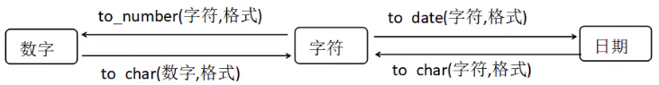
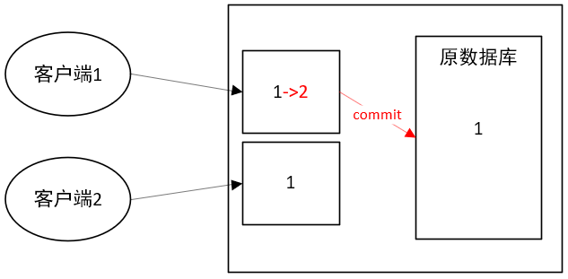

# Oracle

参考视频：[oracle数据库教程](https://www.bilibili.com/video/BV1z4411W771?p=28)。

## 安装

去Oracle官网下载安装包（我已经存到onedrive了），11g的安装包有两个，要把两个文件夹解压到一起。安装过程参考视频。最后验证一下，输入用户名和密码，登录数据库：

```sql
sqlplus scott/tiger;
```

注：拉长打印宽度：`set linesize = 300;`。拉长打印高度（减少分页）：`set pagesize = 300`。

## 概述

数据类型中有一种形如`NUMBER(7,2)`，表示7位数，其中小数2位。

## DQL

### 基础语法

原来学过的不记，只记新的。

```sql
-- 语句写错了，用c修改
SQL> select * form emp;
select * form emp
         *
第 1 行出现错误:
ORA-00923: 未找到要求的 FROM 关键字


SQL> c /form/from
  1* select * from emp
SQL> /

-- 或用ed修改
SQL> select * form emp;
select * form emp
         *
第 1 行出现错误:
ORA-00923: 未找到要求的 FROM 关键字


SQL> ed -- 弹出文件，改正form，然后保存并关闭文件
已写入 file afiedt.buf

  1* select * from emp
SQL> /
```

对null的关系运算只能用is或is not。

任何数字与null计算均得null，需对null进行处理，如将其变为0：

```sql
-- 如果comm值为null，则将其变为0
SQL> select ename, nvl(comm, 0) from emp;
-- 如果comm值为null，则将其置0，否则保持原值
SQL> select ename, nvl2(comm, comm, 0) from emp;
```

字符串拼接：

```sql
-- 两种方式：concat函数和||符号。dual是内置的仅一行记录的表
SQL> select concat('hello', 'world') from dual;
SQL> select 'hello' || 'world' from dual;
```

修改oracle默认的日期格式（不过最好别改，保持默认）：

```sql
-- 默认：DD-MON-RR
alter session set NLS_DATE_FORMAT = 'yyyy-mm-dd';
```

范围查询只能按自然地左小右大。

模糊查询可适用于所有数据类型，不限于字符（串）。

转义字符可以任意指定，一般用反斜杠。

in和not in子句中也不能出现null，这个很好理解：`in(a, b, c)`等价于`value = a or value = b or value = c   `，加个null等价后就无意义了。

上一条语句若有遗漏，则用a补上：

```sql
-- 注意分号前有空格，不然补后接头处就成了emporder
SQL> select empno, ename, sal from emp ;
-- 结果省略
SQL> a order by sal desc;
  1* select empno, ename, sal from emp order by sal desc
SQL> /
```

### 单行函数

单行函数有：

- 字符函数。
- 数值函数。
- 日期函数。
- 转换函数。
- 通用函数。

字符函数有：lower、upper、initcap等。例如：

```sql
-- 转小写
SQL> select lower(ename) as ename from emp;
-- 截取字符串。substr(string, begin, end)，最小值为1
SQL> select substr(ename, 2, 3) from emp;
-- 字符数length和字节数lengthb，对英文和数字，一个字符占一个字节
SQL> select length(ename), lengthb(ename) from emp;
-- 返回子串在父串中的位置
SQL> select instr('hello', 'll') from dual;
-- 左填充和右填充。此处填满10位
SQL> select lpad('hello', 10, '*') 左填充, rpad('hello', 10, '&') 右填充 from dual;
-- 去左右两边指定字符
SQL> select trim('X' from 'XXhello worldXXXX'）from dual;
SQL> select trim('  hello world      ') from dual; -- 默认去空字符              
-- 替换子串为其他字符
SQL> select replace('hello', 'll', '*') from dual;
```

数值函数：

```sql
-- 四舍五入，保留若干位小数
SQL> select round(62.183, 2), round(62.183, 0) from dual;
-- 直接舍掉，保留若干位小数
SQL> select trunc(62.183, 2), trunc(62.183, 0) from dual;
-- 求余
SQL> select mod(123,3) from dual;
```

日期函数：

```sql
-- 输出当前日期
SQL> select sysdate from dual;
-- 输出格式化日期
SQL> select to_char(sysdate, 'yyyy-mm-dd') from dual;
-- 日期+数字或-数字，数字单位是天
SQL> select sysdate+2 from dual;
-- 日期-日期得到相隔天数
SQL> select sysdate-hiredate from emp;
-- months_between()计算相隔月数
SQL> select months_between(sysdate, hiredate) from emp;
-- add_months()在日期上加月数
SQL> select add_months(sysdate, 2) from dual;
-- 当月最后一天日期
SQL> select last_day(sysdate) from dual;
-- next_day()得到离某天最近的星期几的日期
SQL> select next_day(sysdate, '星期六') from dual;
-- 对当前日期按月及按年进行舍入处理
SQL> select round(sysdate, 'month'), round(sysdate, 'year') from dual;
```

### 通用函数

也属于单行函数，只不过单独提出来讨论。

nvl与nvl2前面写过。

```sql
-- 两者相等，返回null（null打印出来是空白），否者返回前者
SQL> select nullif('abc', 'abc') from dual;
-- coalesce()从左往右遍历诸字段，返回第一个非null的字段值
SQL> select comm, sal, coalesce(comm, sal) from emp;
-- decode()类似于switch语句，针对某字段，根据不同值对某字段进行处理，最后一个是缺省处理
select ename,job, sal 涨工资前, decode('job', 'PRESIDENT', sal+1000, 'MANAGER', sal+500, sal+300) 涨工资后 from emp;
-- 另一个类似于switch语句的case语句
select ename, job, sal 涨工资前, case job when 'PRESIDENT' then sal+1000 when 'MANAGER' then sal+500 else sal+300 end 涨工资后 from emp;
```

### 转换函数

有隐式转换（自动转换）和显示转换。

比如数字和字符就可自动转换，字符和日期可以自动转换。例如：

```sql
-- empno字段是数值类型的，这里自动将字符类型转为数值类型
SQL> select * from emp where empno = '7788';
```

隐式转换了解即可，不常用，也不是很讲逻辑，我们一般用显示转换。

显示转换的图解如下：



可见日期与数字不能直接转。

```sql
-- 字符转数字
SQL> select to_number('￥123,456.7', 'L999,999.9') from dual;
-- 数字转字符
SQL> select to_char(123456.7, 'L999,999.9') from dual;
-- 字符转日期
SQL> select to_date('2019-5-25', 'yyyy-mm-dd') from dual;
-- 日期转字符
SQL> select to_char(sysdate, 'yyyy-mm') from dual; -- 年月
SQL> select to_char(sysdate, 'day') from dual; -- 星期几
```

### 多行函数

主要内容就是原来学过的聚集函数。

### 伪列

主要是rownum和rowid，它们不属于任何一张表，但是为所有表所共享。

rownum是逻辑序列（自然数序列），rowid是物理序列（18位的硬盘存放地址）。两者可与任意一张表横向拼接。比如下面这个例子：

```sql
-- 排序之后，取前3个
select rownum, ename, sal, from (
	select * from emp order by sal desc
) where rownum < 3;
```

## DML

SQL语句的类型：

- DML：数据操纵语言，包括insert、delete、update、select。民间将select单独分出来叫DQL，但Oracle官方没有DQL。
- DDL：数据定义语言，有create、drop、truncate、alter。
- DCL：数据控制语言，有grant、revoke。

关于insert等语句的使用参考教材。

```sql
-- 从键盘输入值，它们组成一条记录插入表中
SQL> insert into emp(empno, ename, job) values(&empno, &ename, &job);
输入 empno 的值:  1234
输入 ename 的值:  'THOMAS'
输入 job 的值:  'MANAGER'
```

批量插入数据：

```sql
-- 将旧表中的所有数据复制到新表。连创建和插入一块搞定
create table mytab as select * from emp;
create table mytab as select empno, ename, job from emp;
create table mytab as select empno, ename, job from emp where sal < 6000;
-- 复制旧表，不插数据
create table mytab as select * from emp where 1 = 0;
-- 也可以用后面接触到的事务begin...end
begin
	insert ...;
	insert ...;
	insert ...;
end;
-- 蠕虫复制
insert into mytab(myno, myname) select empno, ename from emp;
```

注：插入海量数据的方式还有数据泵、SQL Loader、外部表等。

关于删除，对于少量数据，delete的效率高，它是一行一行删除，对于海量数据，truncate效率高，它的执行过程等价于先drop整张表，再重新create一张表。

```sql
truncate table emp;
```

删除完如果后悔，可用后面接触到的事务中的[rollback](#rollback)命令。

delete支持回退，truncate不支持，因为DML都能回退，而truncate属于DDL，不支持。

执行时间的打开和关闭：

```sql
set timing on;
set timing off;
```

delete支持闪回，truncate不支持。

delete删除数据但不会释放空间，相当于把文件放进回收站，但没有完全删除，truncate会。

delete会产生碎片，即删除一行记录后对应空间就空在那里，下一条插入的数据只能继续从最后插，truncate不会。如果我们经常进行增删操作，那么须整理碎片合并空间（仅插入则不用）：

```sql
alter table move;
```

另外一个方法是合并导出碎片空间然后导回到本表。

## DDL

创建表的注意事项：

- 权限和空间问题。

- 命名规范：

  - 必须以字母开头，仅包含字母数字下划线及$与#。

  - 长度为1-30个字符。

  - 不能与数据库其他对象和关键字重名。

    ```sql
    -- 切换到超级管理员查看保留字
    sqlplus / as sysdba
    用户名：sys as sysdba 
    口令：change_on_install
    或退出用system登录：sqlplus system/manager
    SQL> select * from v$reserved_words order by keyword asc;
    ```

修改表举例：

```sql
-- 增加列
alter table	mytab add myother varchar2(10);
-- 修改列长度
alter table mytab modify myother varchar2(20);
-- 修改列类型
alter table mytab modify myother number;
-- 删除列
alter table mytab drop column myother;
-- 重命名列
alter table mytab rename column myother to myanother;
```

删除表举例：

```sql
-- 查看回收站
show recyclebin;
-- 清空回收站
purge recyclebin;
-- 彻底删除
drop table mytab purge;
```

## 约束

即对数据的限制条件。常见约束有以下这么几种：

- 检查约束（check）。
- 唯一约束（unique）。
- 主键约束（primary key）。
- 外键约束（foreign key）。
- 非空约束（not null）。
- 默认约束（default）。

注意多个null并不违反唯一约束。

约束分为列级约束和表级约束：

| 列级约束               | 表级约束                        |
| ---------------------- | ------------------------------- |
| 作用于一个列           | 作用于一列或多列                |
| 建表时写于当列之后     | 建表时写在所有列之后            |
| 可有多个约束，空格分隔 | 可有多个约束，逗号分隔          |
| 6种约束都可加          | 只能加4中约束（非空、默认不行） |

可以给列级约束命名，使得在报错时自己能看得懂错误是什么意思。其规范是：`constraint 约束类型_字段名`。

```sql
-- 示例
检查约束：CK_字段名
唯一约束：UQ_字段名
主键约束：PK_字段名
外键约束：FK_参照表_被参照表（或FK_字段名_参照表_被参照表或FK_参照表_被参照表_字段名）
非空约束：NN_字段名
默认约束：不需要命名，因为一般无错可出
```

约束名在表内和表间不能重复。

关于外键约束，我们需注意参照表和被参照表之间的级联处理。被参照表决定参照表，冲突解决手段包括级联删除、级联更新等。

关于添加约束，检查、唯一、主键、外键约束都用add。比如：

```sql
alter table student add constraint UQ_sname unique(sname);
```

而非空和默认约束用的却是modify，而且默认约束连constraint都不用写。比如：

```sql
alter table student modify sname constraint NN_sname not null;
alter table student modify sname default '无名氏';
```

关于删除约束，前5种约束的删除语句形如：

```sql
alter table 表名 drop constraint 约束名;
```

那么默认约束由于没有约束名，故其删除语句同追加：

```sql
alter table 表名 modify 字段名 default null; -- 没设默认值的字段的默认值就是null
```

没有约束的直接修改方法，只能先删除后重新添加。

## 三大范式

关于本章知识请直接参考教材。

三大范式只是一种建议，实际开发中不必严格遵守。有时某数据库可能很满足规范性，但易用性和性能都不好，我们需要综合考量。

## 视图和级联更新

参考教材。

强烈建议视图只用来做查询，不要对其进行DML（增删改）操作。

oracle自带语句录制功能：

```sql
-- 所写全部sql语句被存入note.txt中
spool d:\note.txt;
sql语句...
spool off;
```

## 事务

概念：一组逻辑操作单元（一系列DML操作），让数据从一种状态变成另一种状态。

它具有四大特性-ACID：

- atomicity：原子性，指事物是一个不可分割的工作单位，即让多条语句的执行要么都成功要么都不做，不能仅部分成功。
- consistency：一致性，指事物让数据库从一个一致性状态变为另一个一致性状态。简而言之即数据值总和不变，如某次转账前后，两者金额总数不变。
- isolation：隔离性，指一个事务的执行（具体指对数据的操作）不受其他并发的事务干扰。
- durability：持久性，指一旦事务被提交，对数据库的改变就是永久性的。

原子性是重中之重。

事务生命周期：如下图所示，开始于第一条增删改语句，终结于提交或回滚。注：对MySQL，语句一执行完就自动提交。


理解提交的机制。每一个客户端在访问数据库服务器时访问的是各自的缓存，若修改了数据，则只有在提交（commit）之后才能更新并共享给其他客户端。

如下图所示。客户端1和客户端2各自进行着事务，原数据库中存在某数据1，客户端1现对其进行修改，改成2，那么对应服务器缓存中的该数据更新为2，而客户端2对应缓存中的该数据仍为1，接着执行commit指令之后，原数据库的该数据就变为2，那么客户端2下一次查询时该数据就是2。



提交的实现方式：

- 显式（手动）提交：输入commit命令。
- 隐式（自动）提交：关闭连接，执行DCL、DDL等语句。

理解回滚（回退）的机制，回滚就是撤销，只针对已执行而未提交的DML语句（针对缓存而非原库），实现方式有两种：

- 显式回滚：输入<span id="rollback">rollback命令</span>，默认回滚到当前事务开始之前。
- 隐式回滚：异常退出，如宕机、断电等。

我们还能回滚到某一保存点的状态：

```sql
-- 已执行若干条增删改语句
savepoint 保存点名;
-- 还原到某保存点
rollback to [savepoint] 保存点名;
```

下面讨论事务的隔离级别，多个事务会产生一些并发问题，给定事务A和事务B：

- 脏读：B读到A执行DML语句但未提交时的字段值。临时内容绝不可取。
- 不可重复读：B在A提交DML语句前后对某记录的字段读到不一样的值。
- 幻读（虚读）：B在A提交DML语句前后读到增多的记录数。

SQL99标准定义了四种隔离级别来克服并发问题：

| 隔离级别                  | 脏读 | 不可重复读 | 虚读 |
| ------------------------- | ---- | ---------- | ---- |
| read uncommitted-读未提交 | 可   | 可         | 可   |
| read committed-读已提交   |      | 可         | 可   |
| repeatable read-可重复读  |      |            | 可   |
| serializable-序列化       |      |            |      |

理解这几个级别的工作：

- 读未提交：使得A对原库乃至缓存的DML结果均响应给B。
- 读已提交：只允许A对原库的DML结果响应给B。
- 可重复读：只允许A对原库的insert结果响应给B。
- 序列化：使得各事务互斥地对某张表进行访问。

将并发变成串行化（即序列化），就能从根本上解决并发问题，但事实上我们需在高效率（高并发）和高稳定性之间做平衡考虑。

oracle只支持read committed和serializable，另外oracle自身扩充了一种叫read only，但它其实从属于serializable。

```sql
-- 针对当前连接，切换隔离级别为序列化
set transaction isolation level serializable;
-- 切回到默认
set transaction isolation level read committed;
-- 切换到连当前事务都只能读而不能增删改
set transaction read only;
```

一般我们只解决脏读问题，即采用read committed，后者性能太低。

## 序列

序列的作用是模拟自增，本质是内存中的数组，数组长度固定，里面的元素可以一直在变。

```sql
-- 创建序列
create sequence 序列名
increment by 步长
start with 起始值
maxvalue 最大值 | nonmaxvalue 最大值 -- 循环数组才用到
minvalue 最小值 | nonminvalue 最小值 -- 循环数组才用到
cycle | noncycle -- 循环与否（默认否）
cache 缓存值 | no cache -- 缓存与否（默认否），用于为多张争夺id的表分配号码
-- 从数据字典查看序列
select * from user_sequences;
-- 使用序列（这条例子不好）
select myseq.nextval, myseq.currval, empno, ename from emp;
--  通过序列实现主键自增
insert into person(myseq.nextval, 'Van');
```

显然使用非循环序列，不会归零。注意循环序列不能用于主键。

裂缝问题：比方说数组长度为20，当前拿到6，但下一次拿到的是21。列举一些情况：

- 异常：比如排到6突然断电。
- 回滚：比如撤销两条插入语句，回到排6之后的状态。
- 多表使用：多表抢着用同一个序列。

想修改序列只需将语句中的create改为alter，后续设置同上。

## 索引

想想字典的索引-查字表，每一个独一无二的字都唯一地关联后面正文中的一个条目，当中记载着本字的详细释义，数据库里的索引同理。

索引类型默认是B树索引，其他的类型有位图索引等。

主键是索引。

```sql
-- 创建索引
create index 索引名 on 表名(字段名);
-- 多级索引
create index 索引名 on 表名(字段1, 字段2);
-- 删除索引
drop index 索引名;
```

索引的适用场景：

- 在where中频繁使用的列。
- 数据量大，记录数非常多。

在字段相当多的情况下，索引表的查找效率比原表的查找效率要高，就好比看目录找字比看正文找字快得多，因为其他字段信息造成了不必要的干扰。

## 同义词

可以给数据库对象（表、视图、索引）起别名。

```sql
-- 先必须由超级管理员授予某用户起别名的权限
conn / as sysdba -- 切到超级管理员
grant create synonym to scott;
-- 切回到某用户
conn / scott/tiger;
-- 起别名
create synonym 别名 for 原名;
```

同义词还分私有和共有。私有指只有在当前用户下才能使用，公有指任何用户都能使用。

```sql
-- 创建公有同义词
create public synonym 别名 for 原名;
```

删除同义词：

```sql
-- 删私有的不用授权
drop synonym 别名;
-- 删公有的要授权
conn / as sysdba -- 切到超级管理员
grant drop public synonym to scott;
-- 切回到某用户
conn / scott/tiger;
drop public synonym 别名;
```

建议由管理员来建立、删除公有同义词。

## PLSQL

即procedural language/SQL-过程化SQL语句，对原生SQL作了扩展。

开发工具有：

- plsql developer。
- oracle sql developer（官方提供）。

老师用第二个，去[SQL Developer Downloads](https://www.oracle.com/tools/downloads/sqldev-downloads.html)下载。 下载好了直接解压到某目录，再点开sqldeveloper.exe进行安装，最后新建连接。注：欲建立连接，必先打开Oracle的监听器服务：OracleOraDb11g_home1TNSListener，之后1521端口才可以产生，接着要在cmd中输入`lsnrctl start`-启用oracle监听器才能建立连接。

基本语法：

```plsql
declare
	变量、常量、光标（游标）
begin
	逻辑代码（可能包括exception）
end;
```

示例如下：

```plsql
-- 开启打印功能
set serveroutput on;
declare
    -- 普通变量
    psex char(3) := '男';
    -- 引用型变量
    pname emp.ename%type;
    -- 记录型变量
    emp_info emp%rowtype;
begin
    -- 查询并赋值
    select ename into pname from emp where empno = 7788;
    select * into emp_info from emp where empno = 7788;
    -- 打印
    dbms_output.put_line('hello world' || psex || pname);
    dbms_output.put_line(emp_info.empno || emp_info.ename || emp_info.job);
end;
```

```plsql
-- 分支结构
set serveroutput on;
declare
    pnum number := 1;
begin
    if pnum = 1 then dbms_output.put_line('一');
    elsif pnum = 2 then dbms_output.put_line('二');
    else dbms_output.put_line('其他');
    end if;
end;
```

```plsql
-- for循环结构
set serveroutput on;
declare
    
begin
    for pnum in 1 .. 5 loop
        dbms_output.put_line(pnum);
    end loop;
end;
```

```plsql
-- do-while循环结构
set serveroutput on;
declare
    pnum number := 1;
    psum number := 0;
begin
    loop
        exit when pnum > 5;
        psum := psum + pnum;
        pnum := pnum + 1;
    end loop;
    dbms_output.put_line(psum);
end;
```

游标（光标-cursor）用于存储记录集。它的基本语法是：

```plsql
cursor 光标名(参数列表) is select...
```

它的属性有：`%isopen`、`%rowcount`、`%found`、`%notfound`。

示例如下：

```plsql
-- 打印员工的名字及工资
set serveroutput on;
declare
    cursor cemp is select ename, sal from emp;
    -- 光标中有几个字段就要相应定义几个变量
    pename emp.ename%type;
    psal emp.sal%type;
begin
    -- 打开光标
    open cemp;
    -- 一行一行取
    loop
        -- 存到那几个变量中。fetch的动作为两步：取当前行并移到下一行
        fetch cemp into pename, psal;
        -- 退出条件
        exit when cemp%notfound;
        dbms_output.put_line(pename || '的工资是' || psal);
    end loop;
    -- 也可用for循环
    -- for pemp in cemp loop
    --	  pename := pemp.ename;
    --	  psal := pemp.sal;
    -- end loop;
    -- 关闭光标
    close cemp;
end;
```

```plsql
-- 根据职位高低涨不等量的工资
set serveroutput on;
declare
    cursor cemp is select empno, job from emp;
    pempno emp.empno%type;
    pjob emp.job%type;
begin
    open cemp;
    loop
        fetch cemp into pempno, pjob;
        exit when cemp%notfound;
        -- plsql与sql语法杂糅
        if pjob = 'PRESIDENT' then update emp set sal = sal + 1000 where empno = pempno;
        elsif pjob = 'MANAGER' then update emp set sal = sal + 800 where empno = pempno;
        else update emp set sal = sal + 400 where empno = pempno;
        end if;
    end loop;
    close cemp;
    -- 增加需要提交
    commit;
    dbms_output.put_line('ok');
end;
```

```plsql
-- 传入参数，查询某部门全体员工的名字
set serveroutput on;
declare
    cursor cemp(dno number) is select ename from emp where deptno = dno;
    pename emp.ename%type;
begin
    open cemp(20); -- 传入部门号
    loop
        fetch cemp into pename;
        exit when cemp%notfound;
        dbms_output.put_line(pename);
    end loop;
    close cemp;
end;
```

用for循环遍历游标：

```plsql
-- 统计各部门不同工资区间里的人数及该部门工资总数
set serveroutput on;
declare
	-- 游标存储各个部门号
    cursor cdept is select deptno from dept;
    -- 各工资区间里的人数
    count1 number;
    count2 number;
    count3 number;
    -- 某部门工资总额
    sal_sum number;
begin
	-- 不用写游标的打开与关闭
	-- 遍历每个部门号，做不同的查询再分别填入变量
    for pdept in cdept loop
        select count(empno) into count1 from emp where deptno = pdept.deptno and sal < 2000;
        select count(empno) into count2 from emp where deptno = pdept.deptno and sal between 2000 and 4000;
        select count(empno) into count3 from emp where deptno = pdept.deptno and sal > 4000;
        select sum(sal) into sal_sum from emp where deptno = pdept.deptno;
        -- 打印结果
        dbms_output.put_line(pdept.deptno || ' ' || count1 || ' ' || count2 || ' ' || count3 || ' ' || sal_sum);
    end loop;
end;

-- 另外一种写法
set serveroutput on;
declare
	-- 游标存储各个部门号
    cursor cdept is select deptno from dept;
    -- 游标存储某部门下的所有员工的工资，传入部门号
    cursor cemp(pdeptno dept.deptno%type) is select sal from emp where deptno = pdeptno;
    -- 各工资区间里的人数
    count1 number := 0;
    count2 number := 0;
    count3 number := 0;
    -- 部门工资总额
    sal_sum number := 0;
begin
	-- 遍历部门号
    for pdept in cdept loop
    	-- 遍历某部门下的员工工资
        for pemp in cemp(pdept.deptno) loop
        	-- 依据条件让特定值自增
            if pemp.sal < 2000 then count1 := count1 + 1;
            elsif pemp.sal between 2000 and 4000 then count2 := count2 + 1;
            else count3 := count3 + 1;
            end if;
            sal_sum := sal_sum + pemp.sal;
        end loop;
        -- 打印结果
        dbms_output.put_line(pdept.deptno || ' ' || count1 || ' ' || count2 || ' ' || count3 || ' ' || sal_sum);
        -- 本部门情况统计完毕，即清零各个变量，不然造成累加，导致后续结果有误
        count1 := 0;
        count2 := 0;
        count3 := 0;
        sal_sum := 0;
    end loop;
end;
```

## 例外

例外跟异常是一个意思。有下列例外：

- 系统例外：
  - no_data_found
  - too_many_rows
  - zero_divide
  - value_error：算数或转换错误。
  - timeout_on_resource：资源等待超时（分布式产生）。
- 自定义例外。

```plsql
-- 系统例外
set serveroutput on;
declare
    pnum number;
begin
    pnum := 1/0;
    exception
        when zero_divide then dbms_output.put_line('0不能作除数');
        when too_many_rows then dbms_output.put_line('行数太多');
        when others then dbms_output.put_line('其他例外');
end;
```

```plsql
-- 自定义例外
set serveroutput on;
declare
    pnum number;
    myexc exception; -- 自定义例外
begin
    pnum := 1;
    if pnum = 1 then raise myexc;
    end if;
    exception
        when myexc then dbms_output.put_line('自定义例外生效');
end;
```

```plsql
-- 查询某部门下的所有员工姓名，无此部门则抛出例外
set serveroutput on;
declare
    cursor cemp(dno number) is select ename from emp where deptno = dno;
    pname emp.ename%type;
    -- 自定义空员工记录异常
    no_emp_found exception;
begin
    open cemp(50);
    -- fetch cemp into pname;
    if cemp%notfound then raise no_emp_found;
    else
        loop
        fetch cemp into pname;
        exit when cemp%notfound;
        end loop;
    end if;
    exception
        when no_emp_found then dbms_output.put_line('无此部门');
    close cemp;
end;
```

## 存储过程

相当于java里的方法。

存储过程语法：

```plsql
-- 创建（新建或覆盖现有的）存储过程 参数可选
create [or replace] procedure 过程名(参数列表)
as
	变量等
begin
	plsql语句
end;
```

```plsql
-- 执行存储过程
exec 过程名();
-- 或
begin
	过程名();
end;
```

关于参数，注意in与out关键字的用法，in是输入参数，out是输出参数。示例如下：

```plsql
-- 给指定员工的工资涨500
create or replace procedure raiseSalary(pid in number)
as
    psal emp.sal%type;
begin
    select sal into psal from emp where empno = pid;
    update emp set sal = sal + 500 where empno = pid;
    dbms_output.put_line(psal || ' ' || (psal + 500)); 
    commit;
end;
```

注：为了增进与公司同事的友好交流，不让友谊的小船被掀翻，与他人协作管理数据库时，写过程最好不要用到replace关键字，不然可能不知不觉把别人千辛万苦写的东西给改了。

## 存储函数

与存储过程相比，存储函数必须有return语句。示例如下：

```plsql
-- 根据员工编号计算年终奖
-- 定义函数
create or replace function gettotalsal(pid in number)
    return number
as
    empSal emp.sal%type;
    empComm emp.comm%type;
begin
    select sal, comm into empSal, empComm from emp where empno = pid;
    return empSal * 12 + nvl(empComm, 0);
end;
```

以上是函数的创建（定义），我们可通过java代码来调用函数，但那是以后的事，现在我们可以在图形界面里的函数名上单击右键点运行，接着在弹窗中调整代码然后点确定以执行。

还可以对函数进行调试，前提是当前用户需要有`DEBUG CONNECT SESSION` 和 `DEBUG ANY PROCEDURE`权限。

用命令执行上面这个函数：

```plsql
-- 执行函数
declare
    sumSal emp.sal%type;
begin
	-- 单变量接收返回值即可
    sumSal := getTotalSal(7788);
    dbms_output.put_line(sumSal);
end;
```

若返回值仅一个，则用存储函数或存储过程；若返回值有多个，则用存储过程并out关键字更好：

```plsql
-- 获取某员工的姓名和工资
-- 创建过程，使用多out in和out都写在参数列表中
create or replace procedure getNameAndJob(pempno in emp.empno%type, pename out emp.ename%type, pjob out emp.job%type)
as
begin
	-- 依次对应赋值
    select ename, job into pename, pjob from emp where empno = pempno;
end;
--执行过程
declare
    pempno emp.empno%type := 7788;
    pename emp.ename%type;
    pjob emp.job%type;
begin
	-- 直接把入参和出参传进去
    getNameAndJob(pempno, pename, pjob);
    dbms_output.put_line(pename || ' ' || pjob);
end;
```

## 包

当我们用存储过程来实现查询某部门所有员工的信息（就比多输出还要高一档次了），可以用光标充当返回值或输出参数，而且还要借助包（package）来实现。

结构上，包=包头+包体。

实践上，在当前连接的程序包上右键单击，接着单击”创建程序包“，然后命名就得到一个包头文件最后在其中写代码，示例如下：

```plsql
-- mypackage的包头
-- 查询某个部门下的所有员工
create or replace package mypackage as
	-- 自定义类型
    type empcursor is ref cursor;
    -- 将结果集传给自定义的类型
    procedure queryEmpList(dno number, empList out empcursor);
end mypackage;
```

下面建包体。右键单击包头文件，接着单击“创建主体”，然后在其中写代码，示例如下：

```plsql
-- mypackage的包体
create or replace package body mypackage as
    procedure queryEmpList(dno number, empList out empcursor)
    as
    begin
    	-- 注意for关键字
        open empList for 
        select * from emp where empno = dno;
        -- 因为要返回给调用处，故不关闭游标
    end queryEmpList; -- 结束时带上过程名
end mypackage; -- 结束时带上包名
```

oracle sql developer无法直接验证包能不能完成相应sql效果，只可用`desc mypackage`测试其正确性。以后可通过java代码验证正确性。

## 触发器

当执行DML时，会自动执行触发器。

基本语法：

```plsql
create [or replace] trigger 触发器名
before | after
delete | insert | update [of 字段名]
on 表名
for each row [when 条件]
plsql代码
/
```

示例如下：

```plsql
-- 新增一条学生记录后打印“成功”
create trigger logInsertStudent
after
insert
on student
declare
begin
    dbms_output.put_line("成功");
end;
/
```

```plsql
-- 修改学生表某字段后打印成功信息
create trigger logUpdateStudent
after
update of stuname
on student
declare
begin
    dbms_output.put_line("姓名修改成功");
end;
/
```

应注意，当且仅当修改stuname时，上面这个logUpdateStudent触发器才执行。而且，无论修改多少行的stuname，触发器只执行一次，原因是它是语句级触发器，作用于表而非作用于列。那么想让它变为行级触发器就需加上`for each row`子句。

```plsql
-- 只能在工作时间插入学生记录
create trigger securityInsertStudent
before insert
on student
begin
    if to_char(sysdate, 'day') in ('星期六', '星期日') or to_number(to_char(sysdate, 'hh24')) not between 9 and 18
    -- 自定义例外id和例外信息
    then raise application_error(-20001, '禁止非工作时间插入学生记录'); 
end;
/
```

```plsql
-- 涨后工资不能低于等于涨前工资
create trigger checkSalary
after update
on emp
for each row
begin
    -- :new和:old都属于伪列
    if :new.sal <= :old.sal
    then raise application_error(-10001, '涨后工资不能低于等于涨前工资');
    end if;
end;
/
```

由上例可知，我们系统的校验可以在前端、后端、数据库多处进行，当然越早拦截越好。

## 数据字典

元数据，即数据库的各种描述信息，具体载体是oracle自带的系统表，如dictionary、user_objects、user_tables、user_tab_columns、all_objects、all_tables。

命名规范与含义：

- user开头：当前用户能访问到的。
- all开头：系统所有的。
- dba开头：管理员能访问到的。
- v$：性能相关的。

## DBCA

这是oracle带的数据库配置工具，可点应用程序打开，也可在cmd输入`dbca`打开。示例操作看视频。

顺带一提快速恢复区flash_recovery_area，用来实现commit之后的撤销，它容量越大，则可恢复的数据越多，但也会拖累性能，容量越小，恢复的数据也就越小。

## 闪回

在commit之前，可用rollback撤销；在commit之后，可用闪回撤销。

闪回的作用：

- 对错误的且已提交的DML进行撤销（撤销已提交的事务）。
- 还原已经删除（drop）的表。
- 获取表的历史版本。

### 闪回DML

切换到管理员，查看闪回表中的数据（闪回属性）：

```sql
show parameter undo;
```

结果中的undo_retention为闪回时间，默认为900秒，意即超过闪回区容量的数据必须在900秒以内闪回，不然无法闪回。可修改闪回时间：

```sql
-- both意为当前数据库当前时间有效，重启亦有效
alter system undo_retention = 1200 scope = both;
```

闪回的重点在于时间点，要闪回就必须知道回退的时间点或SCN（显示为一串数字），我们一般用SCN表征闪回时间点（统一各国家不同的时间格式）。将时间转为SCN：

```sql
select timestamp_to_scn(sysdate) scn from dual;
```

闪回的前提条件：

- 待闪回的表的结构不能中途更改。

- 授权：

  ```sql
  -- 有权闪回任何表
  grant flashback any table to 用户名;
  ```

闪回单表数据的实现：

```sql
flashback table 表名 to scn xxxxxxx;
```

那么结尾的这串数字就很重要了，知道目标日期的话，我们需借助timestamp_to_scn函数将目标年月日转为scn，以达到将数据回退到当天状态的目的。

### 闪回已删除表

默认，如果回收站中有同名的多张表，则闪回的是最近删除的表。如果闪回的表的表名和库中现有的表的表名冲突，则需重命名。

```sql
flashback table 表名 to before drop rename to 新名;
-- 也可不用默认，表名相同的话，则可指定回收编号名各异的表闪回
flashback table "xxxxxxxxxx" to before drop;
```

需注意，普通用户删除表会经回收站，而管理员删除表不经回收站。

### 闪回事务

虽然记不得历次提交的时间，但知道历次提交的次号（commit一次就标个号），于是根据提交次号执行的闪回叫做闪回事务。显而易见，闪回dml+commit依赖的是时间点，闪回事务依赖的是提交次数。

通过版本查询得到版本号，进而知晓次数，同一事务中的DML操作共享一个版本号，根本上仍是伪列的作用。示例如下：

```sql
select id, name,
versions_xid, -- 版本号
versions_operation, -- dml操作
versions_starttime, -- 当次事务开始时间
versions_endtime, -- 当次事务结束时间
from tb_version -- 版本表（事务的历史记录）
versions between timestamp minvalue and maxvalue; -- 指定时间戳范围
```

bug：如果在短时间内进行dml且commit，即操作太快，可能会丢失版本号。

事务闪回的核心：undo_sql（某次事务中所执行诸DML语句的逆语句），可以找到它并执行。一定要注意在DML提交之前，应开启日志，以对历史版本有所记录（当然用前面的方法闪回的话，日志不用开）。

```sql
-- 开启日志
SQL> alter database add supplemental log data;
-- 随后才能执行DML并commit
```

```sql
-- undo_sql存在于此表
SQL>desc flashback_transaction_query;
-- 切到管理员授权
SQL> grant select any transaction to scott;
-- 根据版本号查询undo_sql
SQL> select operation, undo_sql from flashback_transaction_query where xid = 'xxxxxxxxxxxxx';
-- 找到结果中的目标逆语句执行即可撤销当时的DML操作。待实验，代码省略
```

## 数据的导入导出

### 导出

利用图形界面导入导出都很简单，那我们重点要掌握的是底层的cmd命令。示例如下：

```shell
# 表方式导出（非sql指令）
exp scott/tiger@127.0.0.1/ORCL file = d:/back/bk.dmp log = d:/back/log.log tables = emp, dept;
```

导出去的两个文件分别是log和bmp格式的，前者为日志，后者为以二进制形式存储的数据。

```shell
# 用户方式导出
exp scott/tiger@127.0.0.1/ORCL file = d:/back/bk.dmp log = d:/back/log.log;
```

可见下面这条指令中没有tables属性，意即本用户所能管理的所有对象（表、同义词等）都导出了。

```shell
# 全库导出
exp system/manager@127.0.0.1/ORCL file = d:/back/bk.dmp log = d:/back/log.log full = y;
```

只有sys或sysdba才有全库导出的权限。

### 导入

示例如下：

```shell
# 表方式：将数据文件里的表导入到数据库，scott的东西传给hr
imp hr/hr@127.0.0.1/ORCL file = d:/back/bk.dmp log = d:/back/log.log tables = emp, dept fromuser = scott touser = hr commit = y ignore = y;
```

```shell
# 用户方式：DBA将数据文件里的对象导入到数据库。scott的东西传给hr
imp system/manager@127.0.0.1/ORCL file = d:/back/bk.dmp log = d:/back/log.log fromuser = scott touser = hr commit = y ignore = y;
```

```shell
# 全库导入：DBA将数据文件里的整库数据导入到数据库
imp system/manager@127.0.0.1/ORCL file = d:/back/bk.dmp log = d:/back/log.log commit = y ignore = y destroy = y;
```

以上都是命令行的形式，如果实在不好搞那就用图形界面一步步操作，图形操作当然更加简单明了。

## 分布式

单独的一个数据库存储庞大的数据可能放不下，于是有了分布式数据库的概念。这多个数据库在物理上分开存放，在逻辑上是一个整体。用户在使用基于数据库的产品时并不关心底层数据如何分类和存储，只关心与自己相关的数据本身。

分布式数据库的三种操作：

- 本地操作。

- 远程操作：先要关闭远程的防火墙以及将oracle的admin目录下的文件tnsnames.ora和listener.ora的Host值改为IP地址或计算机名。

  ```shell
  # scott是远程服务器上的用户
  sqlplus scott/tiger@远程服务器IP地址/数据库名
  ```

- 链路操作（分布式操作）：大意是远程地访问数据库服务器A，但A内部又转到访问数据库服务器B，这个转到的过程需借助链路实现。

  ```sql
  -- 创建链路。scott是A的用户。l2vm是链路名，remoteORCL是本地服务名
  create database link l2vm connect to scott identified by tiger usering 'remoteORCL';
  ```

  值得注意，本地服务需要提前在本机上手动创建，用于连接远程的服务，有了使用A的远程服务的机会，才能进一步搭起链路转到下一个远程服务器B。我们用oracle自带的net manager工具创建服务名。

  链路是单向的，即B由A访问本地需在B处另建链路。

  ==未完待续==

## EM管理器

这是oracle自带一个图形界面，仅作了解，==未完待续==。

## 用户权限

预定义用户：

- scott。
- sys：拥有最高权限，即一切权限。
- sysdba：拥有DBA权限。

权限分为：

- 系统权限：允许用户执行对数据库的特定行为。
- 对象权限：允许用户执行对对象的特定行为。

## SQL优化（指导原则）

sql优化的前提条件：数据量特别庞大。

优化的方面：

- 索引类型：普通索引、复合索引、全文索引。视表决定用哪种索引。
- 缓存：数据库缓存、缓存中间件Redis。
- 锁机制：排他锁、共享锁、读锁、写锁、行锁、页锁。视当前业务使用哪种锁。
- 表的设计：权衡三大范式和效率。
- 架构设计：读写分离。就是将读操作的数据和写操作的数据分别置于两个数据库，从而只需对写库进行加锁，防止并发冲突，而不对读库加锁，保证其运行效率。
- 细节：相近的数据类型的选择。

具体到oracle来说：

- 不要让oracle做得太多：譬如使用jdbc时，就应把一些负责操作交给java去做，让sql语句尽量简单，避免一些复杂查询。
- 查询时避免使用星号：意在去除多余的字段及提高效率（用星号的话会多解析过程）。
- 避免使用一些消耗资源的操作：如不用关键字distinct（exists替代）、union、minus、intersect、order by等。
- 避免索引失效：如不要在where子句中基于索引用函数、计算、not、is null、自动转换等，这些都会使索引失效。
- 尽量减少访问次数：这与第一条相矛盾，我们需要根据实际、经验、压力（性能）测试来权衡。

## 附：课程练习

### 实验二

```sql 
-- 创建课程表
create table Class(
	CNO number(2) primary key,
	CNAME varchar(20),
	NUM number(3)
);
-- 给课程表加注释
comment on column Class.CNO is '班号';
comment on column Class.CNAME is '班名';
comment on column Class.NUM is '人数';

-- 创建学生表
create table Student(
	SNO number(4) primary key,
	SNAME varchar2(10) unique,
	SAGE number,
	SEX char(2) default 'F' check(SEX in('M', 'F')),
	CNO number(2),
	foreign key(CNO) references Class(CNO)
);
-- 给学生表加注释
comment on column  Student.SNO is '学号';
comment on column  Student.SNAME is '姓名';
comment on column  Student.SAGE is '年龄';
comment on column  Student.SEX is '性别';
comment on column  Student.CNO is '班级号';

-- 创建单级索引
create unique index class_index on Class(CNAME);	

-- 创建表空间
create tablespace stbs1 datafile 'C:\app\Administrator\oradata\orcl\stbs1.dbf' size 50m;
create tablespace stbs2 datafile 'C:\app\Administrator\oradata\orcl\stbs2.dbf' size 50m;
create tablespace stbs3 datafile 'C:\app\Administrator\oradata\orcl\stbs3.dbf' size 50m;
-- 范围分区。不同范围的分区保存在不同的表空间中
create table Student_range(
	SNO number(4) primary key,
	SNAME varchar2(10) unique,
	SAGE number,
	SEX char(2) default 'F' check(SEX in('M', 'F')),
	CNO number(2),
	foreign key(CNO) references Class(CNO)
) partition by range(SAGE)(
	partition part1 values less than(20) tablespace stbs1,
	partition part2 values less than(30) tablespace stbs2,
	partition part3 values less than(maxvalue) tablespace stbs3 
);

-- 创建表空间
create tablespace male datafile 'C:\app\Administrator\oradata\orcl\male.dbf' size 50m;
create tablespace female datafile 'C:\app\Administrator\oradata\orcl\female.dbf' size 50m;
-- 列表分区
create table Student_list(
	SNO number(4) primary key,
	SNAME varchar2(10) unique,
	SAGE number,
	SEX char(2) default 'F' check(SEX in('M', 'F')),
	CNO number(2),
	foreign key(CNO) references Class(CNO)
) partition by list(SEX)(
	partition student_male values('M') tablespace male,
	partition student_female values('F') tablespace female
);

-- 创建簇和两个聚簇表
create cluster class_number(
	CNO number(2)
) size 600 tablespace users;
create table classes(
	CNO number(2) primary key,
	CNAME varchar2(10)  
) cluster class_number(CNO); -- 指明属于哪个簇
create table students(
	SNO number(5) primary key,
	SNAME varchar2(15) not null,
	CNO number(2) references classes(CNO)
) cluster class_number(CNO);

-- 创建序列
create sequence student_sequence
increment by 2
start with 10000
maxvalue 1000000
nocycle;
```

### 实验三

```sql
-- 1.
-- 创建用户
create user usera_exer
identified by usera -- 密码
default tablespace USERS -- 默认表空间
quota 10M on USERS -- 指定表空间及配额
account lock; -- 初始状态为锁定

-- 2.
create user userb_exer
identified by userb;

-- 3.
-- 授予系统权限
grant
	create session
to
	usera_exer
with admin option; -- 允许转授
-- 授予对象权限
grant
	select, update on scott.emp 
to
	usera_exer 
with grant option; -- 允许转授

-- 4.
-- 修改用户（属性）
alter user usera_exer
account unlock; -- 解锁

-- 5.
grant
	select, update on scott.emp
to
	userb_exer;

-- 6.
-- 先回收
revoke
	create session
from 
	usera_exer;
-- 再重新授权，以解除转授权
grant
	create session
to 
	usera_exer;

-- 7.
-- 先回收
revoke
	select, update on scott.emp
from 
	usera_exer;
-- 再重新授权
grant
	select, update on scott.emp
to 
	usera_exer;

-- 8.
-- 创建角色
create role rolea not identified; -- 使用角色时无需密码
create role roleb not identified;
-- 授予角色权限
grant
	insert, delete on scott.emp
to
	rolea;
-- 授予角色角色
grant
	connect, resource
to
	roleb;

-- 9.
-- 授予用户角色
grant
	rolea, roleb
to
	usera_exer;
```

### 实验四

```plsql
alter user scott indentified by 'tiger';
set serveroutput on;

-- 1.查询名为“SMITH”的员工信息，输出其员工号、工资、部门号。如果该员工不存在，则插入一条新记录，员工号为2007，员工名为“SMITH”，工资为1500，部门号为10。
declare
	-- 引用型变量，仅存一条员工记录
	pemp emp%rowtype;
begin
	select * into pemp from emp where ename = 'SMITH';
	dbms_output.put_line('empno: ' || pemp.empno || ',ename: ' || pemp.ename || 'sal: ' || pemp.sal || 'deptno: ' || pemp.deptno);
exception
	when no_data_found then
	insert into emp(empno, ename, sal, deptno) values(2007, 'SMITH', 1500, 10);
	commit;
	when too_many_rows then
		-- 隐式光标
		for pemp in (select * from emp where ename = 'SMITH') loop
			dbms_output.put_line('empno: ' || pemp.empno || ', ename: ' || pemp.ename || ', sal: ' || pemp.sal || ', deptno: ' || pemp.deptno);
		end loop;
end;

-- 2.创建一个存储过程，以员工号为参数，修改该员工的工资。若该员工属于10号部门，则工资增加150；若属于20号部门，则工资增加200；若属于30号部门，则工资增加250；若属于其他部门，则工资增加300。
-- 创建
create or replace procedure updateSal(emp_no emp.empno%type) 
as
	-- 部门号和工资变量
	dept_no emp.deptno%type;
	emp_sal emp.sal%type;
begin
	-- 查询该员工所属部门号及其工资
	select sal, deptno into emp_sal, dept_no from emp where empno = emp_no;
	-- 对工资做判断并做相应的工资处理
	if dept_no = 10 then emp_sal := emp_sal + 150;
	elsif dept_no = 20 then emp_sal := emp_sal + 200;
	elsif dept_no = 30 then emp_sal := emp_sal + 250;
	end if;
	-- 涨其工资
	update emp set sal = emp_sal where empno = emp_no;
end;
-- 调用
declare
	-- 定义入参
	emp_no emp.empno%type := 7788;
begin
	updateSal(emp_no); -- 也可不写declare部分，直接把7788传进去
	dbms_output.put_line('修改成功');
end;

-- 3.创建一个函数，以员工号为参数，返回该员工所在部门的平均工资。
-- 创建
create or replace function deptAverageSal(emp_no emp.empno%type)
	return number is average_sal emp.sal%type -- 或return 
as
    avgSal emp.sal%type;
begin
	-- 查询该部门平均工资并存入变量
	select avg(sal) into average_sal from emp where deptno = (
		select deptno from emp where empno = emp_no
	);
	return average_sal;
end;
-- 调用
-- select deptAverageSal(7788) from emp; 这种方式不好理解
declare
	avgSal emp.sal%type;
begin
	avgSal := deptAverageSal(7788);
	dbms_output.put_line(avgSal);
end;

-- 4.在emp表上创建一个触发器，当插入、删除或修改员工信息时，统计各个部门的人数及平均工资，并输出。
create or replace trigger my_trigger
before insert or delete or update on emp -- 注意or关键字
for each row
begin
	-- 隐式游标
	for item in (select deptno, count(*) as population, avg(sal) as average_salary from emp group by deptno) loop
		dbms_output.put_line('deptno: ' || item.deptno || 'population: ' || item.population || 'average_salary: ' || item.population);
	end loop;
end tigger; -- 结束时带上触发器名

-- 5.在dept表上创建触发器，使得当DEPT表的deptno（主键）发生变化时，EMP表的相关行也要跟着进行适当的修改。
create or replace trigger foreignKeyUpdate
after update or delete on dept -- 变化只包括更新和删除
for each row
begin
	-- 更新和删除参照表。并列分支
	if updating then update emp set deptno = :new.deptno where deptno = :old.deptno;
	end if;
	if deleting then delete from emp where deptno = :old.deptno;
	end if;
end;

-- 6.创建一个存储过程，以两个整数为参数，输出工资排序在两个参数之间的员工信息。
create or replace procedure gapSalary(sal_bottem number, sal_top number)
as
	-- 定义游标存入多员工记录
	cursor cemp is select * from emp where sal between sal_bottem and sal_top order by sal;
begin
	-- 遍历游标，打印员工信息
	for pemp in cemp loop
		dbms_output.put_line('empno: ' || pemp.empno || ',ename: ' || pemp.ename || 'sal: ' || pemp.sal || 'deptno: ' || pemp.deptno);
	end loop;
end;
-- 执行过程
declare
	-- 传入的工资下限和工资上限
	sal_bottem number := 7000;
	sal_top number := 7788;
begin
	gapSalary(sal_bottem, sal_top);
	dbms_output.put_line('执行成功');
end;

-- 7.创建一个包，包中包含一个函数和一个过程。函数以部门号为参数，返回该部门员工的最高工资；过程以部门号为参数，输出或返回该部门中工资最高的员工名、员工号。
-- 包头
create or replace package myPackage as
	function deptMaxSal(pdeptno dept.deptno%type)  return emp.sal%type;
	-- 自定义类型，引用光标。类型套类型
	type empcursor is ref cursor;
	procedure nameAndNoOfDeptMaxSal(pdeptno dept.deptno%type, pemp out empcursor);
end myPackage;
-- 包体
create or replace package body myPackage as
	function deptMaxSal(pdeptno dept.deptno%type) return emp.sal%type
	as
		maxSal emp.sal%type;
	begin
		-- 查询最高工资，存入变量并返回
		select max(sal) into maxSal from emp where deptno = pdeptno;
		return maxSal;
	end deptMaxSal; -- 结束时带上函数名
	procedure nameAndNoOfDeptMaxSal(pdeptno in dept.deptno%type, pemp out empcursor)
	as
		maxSal emp.sal%type;
	begin
		-- 求最高工资
		select max(sal) into maxSal from emp where deptno = pdeptno;
		-- 根据最高工资找人，可能该部门下多人同时拥有最高工资，故用游标存放
		open pemp for select name, empno from emp where sal = maxSal and deptno = pdeptno;
	end nameAndNoOfDeptMaxSal;
end myPackage;
```

