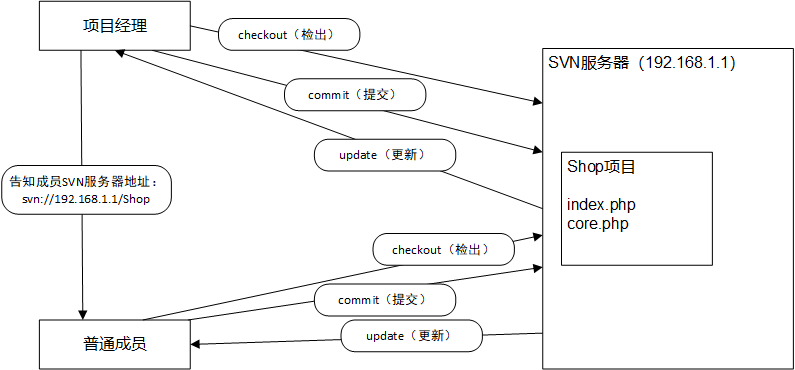
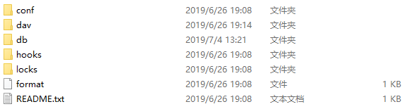

# SVN

## 概述

SVN（SubVersion）是一个版本控制软件，主要解决备份、协作开发、远程开发、版本管理（更新与回退）等方面的问题。解决之道：SCM（Software Configuration Management-软件配置管理），即对软件源代码进行控制和管理。

SVN是近年来崛起的版本管理工具，是CVS（元老级产品）的接班人。

特点：

- 操作简单、入门容易。
- 支持跨平台操作。
- 支持版本回退功能（业界爱称为时间机器）。

它属于C/S模式（客户端和服务端）的软件。服务端软件：VisualSVN，下载地址http://www.visualsvn.com/；客户端软件：TortoiseSVN，下载地址http://www.tortoisesvn.net/。

项目开发的工作流程：



## 服务端

### 安装

推荐勾选具有可视化界面。必须勾选SVN指令到系统环境变量中。

标准版免费，企业版收费，标准版足够使用。

安装路径（Location）不能出现中文、空格和特殊字符。

避免占用，推荐使用8443端口。

在cmd输入`svn --version`以验证安装成功与否。

项目组长需要安装服务端和客户端，而组员只需安装客户端。

### 使用

#### 创建项目

1. 选一个路径创建SvnRep文件夹作为版本库的根目录（一个服务器可存放多个版本库）。

2. 再在SvnRep中创建文件夹作为版本仓库（SVN中无项目概念，一个项目就是一个版本仓库）的载体，命名如ssm。

3. 构建版本仓库。在cmd中输入`svnadmin create D:/Van/SvnRep/ssm`。如果成功那么该目录中会有如下目录结构：

   

#### 启动服务

有命令行和注册windows服务两种方式。

- 命令行方式：

  ```shell
  svnserve -d -r D:/Van/SvnRep
  ```

  -d意为后台运行，-r意为版本库目录。

  它的缺陷是想让服务器一直启动命令行就得一直开着。

- 注册Windows服务方式：

  将SVN注册为Windows服务就可让SVN服务随系统一起启动。

#### 权限控制

默认情况下，SVN是不允许匿名用户上传文件到服务端的，故需要修改项目的配置文件。打开对应项目的conf/svnserve.conf：`anon-access = write`。

更严谨的用户管理需在图形界面中完成，因为修改文件以设置权限的方式太复杂，图形界面更好用。具体操作看后续再记。

#### 代码还原

在eclipse的History一栏中可查看项目的所有版本，在对应地的版本上右键->获取内容即可还原到之前的版本。

## 客户端

### 安装

安装路径没有无中文空格等要求。

安装后需要重启电脑不然右键目录中SVN图标无法显示（新版本不需要）。

可安装附带汉化包。

### 使用

#### 三大指令

checkout-检出：连接SVN服务端，然后拉取最新SVN数据到本地。

```shell
svn checkout svn://ip地址/项目名
```

注意：checkout只在第一次连接时操作一次，以后的更新操作须用update。checkout后会在本地目录中生成一个隐藏的.svn文件夹（巨重要），没有它就不能继续与服务端保持数据的交流了。

commit-提交：提交本地修改或新增的数据到服务端。

```shell
#纳入版本控制
svn add 文件名
#提交到服务端（描述信息不能遗漏）
svn commit -m 'my first commitment' 文件名
```

update-更新：从服务端拉取最新的数据。

```shell
svn update 文件名（不写则拉取所有修改了的文件）
```

#### TortoiseSVN

就是和eclipse中的操作性质相同的客户端操作，此处省略，靠在实践中熟悉。

## 与eclipse的集成

命令行操作了解即可，实战还是要靠eclipse。

首先要装插件。去商店里搜subclipse安装，在首选项的Team中发现了SVN就表示装好了。

### 分享

分享就是项目组长将本地项目上传到SVN服务器。无论在eclipse的哪一个工作空间，只要上传了某个项目它就会出现在版本仓库根目录之中。

### 检出

## 注

### URL分析

`svn://IP地址/项目名`

前提是安装服务端时需设置仓库为SvnRep这一根目录，故这一写法体现了多仓库的特点。相反，`svn://IP地址`体现了单仓库的特点（后面没有项目名了，意即定位到设定好的项目中了）。

### 冲突

场景：组员A修改了项目里的某个文件并提交到了服务端，随后组员B在不知道A修改的情况下修改了本地的该文件，接着也进行提交。

于是乎，会报错，这错误好比“不知有汉何论魏晋”。比如俩人都没改之前此文件的版本号是8，A一改并提交它就变成了9，那么B在8的基础上修改此文件再提交就会产生过时冲突（B的8相对于服务端的9冲突）。B想拉取9版本的文件的话还会报错，即跟本地文件冲突了。

这一问题需手动解决：右键该文件->Team->编辑冲突，会打开一个两相对比的界面，其中右边的作为参照，改不了，左边就是我们要修改的。左边的改好后保存，于是会发现错误消失。接着右键该文件->Team->标记为解决，于是该文件带了星号，等待提交。

为了减少冲突，对于公共文件各成员应该异步修改，即先更新再提交，一定要先更新。在eclipse中就必须只用“与资源库同步”而不用单独操作。对于非公共文件，小组内部就应该分工明确、互不干扰。

