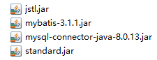

## Servlet

#### 概念

Servlet（Server Applet，applet意即java的小型应用程序，那么冠以server后整体即可理解为java的服务端程序）是Java Servlet的简称，称为小服务程序或服务连接器。它是用Java编写的服务器端程序，具有独立于平台和协议的特性，主要功能在于交互（前端后台交互）式地浏览和生成数据，生成动态Web内容。

狭义的Servlet是指Java的一个接口，广义的Servlet是指任何实现了这个Servlet接口的类，即自创的类。一般情况下，人们将Servlet理解为后者。Servlet运行于支持Java的应用服务器中。从原理上讲，Servlet可以响应任何类型的请求，但绝大多数情况下Servlet只用来扩展基于HTTP协议的Web服务器。Servlet是一个继承了httpServlet类的java类，也是一种资源，故它在服务器中，应该能被客户端访问到。

#### web项目的逻辑结构

自顶向下：

- controller：控制层（servlet），接收前端请求并分发任务。

- service：业务处理层，调用下一层，带有接口及其实现类。
- dao：数据库连接及操作层，带有接口及其实现类。
- model：模型层，与数据库里的各张关系表对应。

#### web项目的文件结构

- mybatisServlet：动态web项目名。
  - src：java源文件包，包括controller、service、dao包即各类配置文件等。

  - build：存储java源代码编译后的文件。

  - WebContent：存放项目资源，如html、image、js、jsp等文件（夹）。
    - META-INF
    - WEB-INF：存放项目资源，客户不能访问，程序可访问。
      - lib：存放web项目所需的jar包。
      - web.xml：web项目的主控制器。
      - 可能放有用户不能访问的jsp文件。

#### servlet程序的结构

新建一个servlet，该类继承自HttpServlet，默认会有构造方法、doGet方法和doPost方法，其他的一大堆方法或对象就不赘述了。

#### 使用servlet

##### 部署servlet

相当于部署网站，这里我们用外链式，站点根目录本是webapps，而项目文件夹并没有真正放入其中。相反有内嵌式，即把项目文件夹放入webapps，缺点就是项目一多，启动会慢。

打开server.xml文件，在Host标签里新建Context标签，其中docBase为该项目在磁盘下的路径，要写到WebContent那一级，path的值可以不写，但最好写上，且要跟其他项目的不一样。

```xml
<Context docBase = "D:\Van\Eclipse\mybatisServlet\WebContent" path = ""></Context>
```

##### 修改字节码文件的存储路径

前面配置的项目路径写到WebContent，而默认编译后的文件是在build下，所以此时访问不了Servlet，需修改编译文件的保存路径。

方法：对该项目点开Java Build Path，将Default output folder改为根目录/WebContent/WEB-INF/classes，这样一来Servlet在编译后会生成一个.class文件，该文件被存储在classes文件夹里；也可以在创建动态web项目时，将Default output folder改为\WebContent\WEB-INF\classes。

##### 创建web.xml文件

创建web项目时就可勾选自动生成，自己创建时放在WEB-INFO中，与lib同级。

```xml
<?xml version="1.0" encoding="UTF-8"?>
<web-app xmlns:xsi="http://www.w3.org/2001/XMLSchema-instance" xmlns="http://xmlns.jcp.org/xml/ns/javaee" xsi:schemaLocation="http://xmlns.jcp.org/xml/ns/javaee http://xmlns.jcp.org/xml/ns/javaee/web-app_3_1.xsd" id="WebApp_ID" version="3.1">
  <display-name>mybatisServlet</display-name>
  <welcome-file-list>
    <welcome-file>index.html</welcome-file>
    <welcome-file>index.htm</welcome-file>
    <welcome-file>index.jsp</welcome-file>
  </welcome-file-list>
</web-app>
```

##### 导入jar包

对于本项目而言，需要导入如下所示的4个jar包，还有个log4j可加可不加（最好加上，以便更好地查看bug，对应的log4j.properties文件放在src中）。对于单纯的servlet项目，可不加jar包，但项目就没什么功能了。



对于web项目，jar包应放在WEB-INF中的lib里面，放外面无效，放进去还没完，还得导入项目：右键->Build Path->Add to Build Path。

##### 创建项目文件

由于此项目是基于mybatis和servlet的，大部分文件与项目mybatis的文件相同，故下面列出不同或新增文件的部分代码。

对象关系映射文件mapper.xml如下，注意where、if、等标签的用法，另外关于choose标签的使用参见mybatis.md。

```xml
<?xml version="1.0" encoding="UTF-8"?>
<!DOCTYPE mapper PUBLIC "-//mybatis.org//DTD Mapper 3.0//EN"
"http://mybatis.org/dtd/mybatis-3-mapper.dtd">
<mapper namespace="com.dao.StudentDao">
	<resultMap type="com.model.View" id="view">
		<id column="id" property="student.id"/>
		<result column="name" property="student.name"/>
		<result column="gender" property="student.gender"/>
		<result column="age" property="student.age"/>
		<result column="dept" property="student.dept"/>
		<result column="cname" property="course.name"/>
		<result column="score" property="score.score"/> 
	</resultMap>
	<!-- 动态SQL -->
	<select id="queryView" resultMap="view">
		select 
			student.id, 
			student.name,
			student.gender,
			student.age,
			student.dept,
			course.name as cname,
			sc.score
		from student, course, sc
		<where>
			student.id = sc.sid and course.id = sc.cid
			<if test="age!=null">
				and age = #{age}
			</if>
			<if test="gender!=null">
				and gender = #{gender}
			</if>
			<if test="dept!=null">
				and dept = #{dept}
			</if>
		</where>
	</select>
</mapper>
```

后台servlet程序如下，注意创建本文件时选servlet而非普通java类。

```java
package com.controller;

import java.io.IOException;
import java.io.InputStream;
import java.util.HashMap;
import java.util.List;
import java.util.Map;

import javax.servlet.ServletException;
import javax.servlet.annotation.WebServlet;
import javax.servlet.http.HttpServlet;
import javax.servlet.http.HttpServletRequest;
import javax.servlet.http.HttpServletResponse;

import org.apache.ibatis.io.Resources;
import org.apache.ibatis.session.SqlSession;
import org.apache.ibatis.session.SqlSessionFactory;
import org.apache.ibatis.session.SqlSessionFactoryBuilder;

import com.dao.StudentDao;
import com.model.View;
import com.util.StringUtil;

@WebServlet("/view")
public class StudentServlet extends HttpServlet {
	private static final long serialVersionUID = 1L;

	@Override
	protected void service(HttpServletRequest request, HttpServletResponse response)
			throws ServletException, IOException {

		// 设定字符编码
		request.setCharacterEncoding("utf-8");

		// 获取mapper
		String source = "mybatis.xml";
		InputStream inputStream = null;
		try {
			inputStream = Resources.getResourceAsStream(source);
		} catch (IOException e) {
			e.printStackTrace();
		}
		SqlSessionFactory sqlSessionFactory = new SqlSessionFactoryBuilder().build(inputStream);
		SqlSession session = sqlSessionFactory.openSession();
		StudentDao mapper = session.getMapper(StudentDao.class);

		// 接收前端传入的参数
		String ageS = request.getParameter("age");
		String gender = request.getParameter("gender");
		String dept = request.getParameter("dept");

		Map<Object, Object> map = new HashMap<>();
		if (!StringUtil.isNull(ageS)) {
			int age = Integer.parseInt(ageS);
			map.put("age", age);
		}
		if (!StringUtil.isNull(gender)) {
			map.put("gender", gender);
		}
		if (!StringUtil.isNull(dept)) {
			map.put("dept", dept);
		}

		List<View> views = mapper.queryView(map);
		request.getSession().setAttribute("views", views);
		request.getRequestDispatcher("index.jsp").forward(request, response);
	}

}
```

前端主页如下，注意第3行jstl标签的引入。css文件省略。

```jsp
<%@ page language="java" contentType="text/html; charset=UTF-8"
    pageEncoding="UTF-8"%>
<%@ taglib uri="http://java.sun.com/jsp/jstl/core" prefix="c" %>
<!DOCTYPE html>
<html>
<head>
<meta charset="UTF-8">
<title>mybatisServlet：动态SQL</title>
<link rel="stylesheet" href="index.css"/>
</head>
<body>
    <form action="/view" method="post">
        <div class="factor">
            <select name="age" class="factor-item">
            	<option value="" style="display:none"></option>
                <option value="20">20</option>
                <option value="21">21</option>
                <option value="22">22</option>
            </select>
            <select name="gender" class="factor-item">
            	<option value="" style="display:none"></option>
                <option value="男">男</option>
                <option value="女">女</option>
            </select>
            <select name="dept" class="factor-item">
            	<option value="" style="display:none"></option>
                <option value="数计">数计</option>
                <option value="经管">经管</option>
                <option value="机械">机械</option>
            </select>
            <button type="submit">提交</button>
        </div>
    </form> 
	<div class="table">
         <ul class="head">
             <li class="head-item">学号</li>
             <li class="head-item">姓名</li>
             <li class="head-item">性别</li>
             <li class="head-item">年龄</li>
             <li class="head-item">系别</li>
             <li class="head-item">课程名</li>
             <li class="head-item">成绩</li>
         </ul>
         <c:forEach items="${views}" var="view">
         	<ul class="data">
                 <li class="data-item">${view.student.id}</li>
                 <li class="data-item">${view.student.name}</li>
                 <li class="data-item">${view.student.gender}</li>
                 <li class="data-item">${view.student.age}</li>
                 <li class="data-item">${view.student.dept}</li>
                 <li class="data-item">${view.course.name}</li>
                 <li class="data-item">${view.score.score}</li>
         	</ul>
         </c:forEach>
    </div>
</body>
</html>
```

工具类StringUtil中判断字符串非空的方法如下，注意第8行判空的写法。

```java
/**
	 * 判断字符串是否为完全的空串，即要么为null（空引用）要么为""（空内容）
	 * 
	 * @param str 待查字符串
	 * @return
	 */
	public static boolean isNull(String str) {
		if (str == null || "".equals(str)) {
			return true;
		} else {
			return false;
		}
	}
```

#### JSTL（java标准标签库）

##### 导入jar包

- jstl。
- standard。

##### 使用

引入语句及常用标签格式：

```jsp
<%@ taglib uri="http://java.sun.com/jsp/jstl/core" prefix="c" %>

<c:if test=""></c:if>
<c:forEach items="" var=""></c:forEach>
<c:choose>
	<c:when test=""></c:when>
	<c:when test=""></c:when>
	<c:when test=""></c:when>
	<c:otherwise></c:otherwise>
</c:choose>
```

