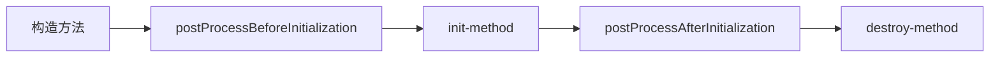
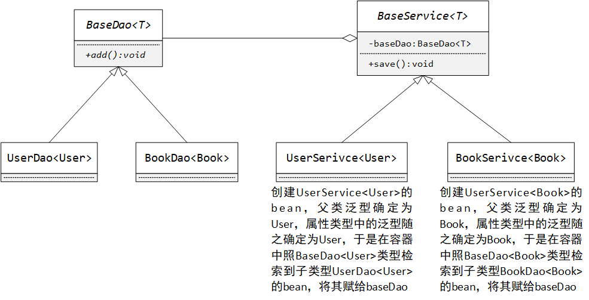
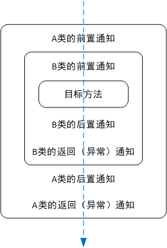

# Spring

参考视频：

- [Spring教程](https://www.bilibili.com/video/BV1ds411V7HZ)。
- [SSM联讲](https://www.bilibili.com/video/BV1d4411g7tv)。

## 概述

将所有web应用共有的东西如基础servlet、事务控制、日志记录、权限验证抽取成web框架，实现复用。框架就是多个可重用模块的集合，作为某领域的一站式解决方案，可理解为半成品软件。

Spring是分层（Spring SE/EE）的应用于全栈的轻量级开源框架。它以IOC和AOP为核心，提供了展示层的Spring MVC、业务层的事务管理、持久化层的Spring JDBC等众多企业级应用技术，还能够整合众多知名第三方开源框架和类库，逐渐成为使用最多的Java EE应用开源框架。

最早是2002年，一个大神叫Rod Johnson，发表了文章《Expert One-on-One J2EE Design and Development》，随后有人据此研发出Spring框架。最初Spring框架只有两大基石-面向切面编程与控制反转，后来越来越多的新东西被开发出来，诸如Spring data、Spring Boot、Spring Cloud、Spring Social。

框架=注解+反射+设计模式。

好处如下：

- 方便解耦、简化开发。

- 支持切面编程；支持声明式事务。

- 方便程序的测试。

- 方便集成各种优秀框架。

- 降低Java EE API的使用难度。

- 源码是经典的学习范例。

这是它的模块分布图：


从下往上看：

- Test：单元测试。

  ```
  Test: spring-test
  ```

- Core Container：核心容器，即IOC，具体有四个jar包。

  ```
  Beans: spring-bean
  Core: spring-core
  Context: spring-context
  SpEL: spring-expressions
  ```

- 往往AOP与Ascpects联合：实现AOP。Instrumentation-设备整合与Messaging-消息服务都不用管。

  ```
  AOP: spring-aop
  Aspects: spring-aspects
  ```

- Data Access/Integration：<span id="dataAccess">数据访问</span>，具体有3个jar包。OXM-object xml mapping、JMS-消息服务不用管，这两个跟Integration（数据集成）有关。

  ```
  JDBC: spring-jdbc
  ORM: spring-orm
  Transactions: spring-tx
  ```
  
- Web：开发Web应用，具体有四个jar包。

  ```
  WebSocket: spring-websocket
  Servlet: spring-web
  Web: spring-webmvc
  Portlet: spring-webmvc-portlet
  ```

## IOC

### 概述

IOC-inversion of control-控制反转：控制的客体是资源获取的方式，正向方式就是传统的用new手动创建，对象一复杂，手动创建起来就蛮麻烦。反转之后容器帮我们创建资源，并且集中管理所有组件（注册进容器的类）。

DI-dependency injection-依赖注入：容器通过反射为某组件对象的域赋值，尤指给组件类型的域赋上所依赖（关联、聚合）的组件对象，spring可梳理出bean之间关联关系然后级联注入。

### 容器

通过一个实例了解IOC容器的相关特点。

因为使用Core Container模块，故应导入4个jar包，且还依赖一个日志包commons-logging。

容器配置文件应置于项目的源码包中，以便进入类路径。写法如下：

```xml
<?xml version="1.0" encoding="UTF-8"?>
<beans xmlns="http://www.springframework.org/schema/beans"
	xmlns:xsi="http://www.w3.org/2001/XMLSchema-instance"
	xsi:schemaLocation="http://www.springframework.org/schema/beans http://www.springframework.org/schema/beans/spring-beans.xsd">
	<!-- 注册一个组件对象，spring自动调用无参构造器创建此对象并根据下面的配置调用诸setter注入 -->
	<!-- bean：组件对象，id：对象的唯一标识，class：组件的全限定类名 -->
	<bean class="bean.Person" id="van">
		<!-- property：属性，name：属性名，value：属性值 -->
		<property name="name" value="van"></property>
		<property name="age" value="18"></property>
		<property name="gender" value="男"></property>
	</bean>
    <!-- 注入对应类型的默认值 -->
    <bean class="bean.Person" id="jenny"></bean>
</beans>
```

```java
// 其他省略
public class Person {
	private String name;
	private Integer age;
	private String gender;

	public void setName(String name) {
		this.name = name;
		// 注入时打印，打印两次
		System.out.println(name);
	}

	public Person() {
		super();
		// 容器启动时就打印
		System.out.println("我被IOC容器创建出来");
	}
}
```

通过id拿对象的测试：

```java
// 见名知义，由classpath下的某个xml文件生成IOC容器
ApplicationContext ioc = new ClassPathXmlApplicationContext("context.xml");
System.out.println("容器已创建");
// 传入对象的id值
Person van1 = (Person) ioc.getBean("van");
Person jenny = (Person) ioc.getBean("jenny");
// false
System.out.println(van1 == jenny);
Person van2 = (Person) ioc.getBean("van");
// true 两变量引用同一个对象
System.out.println(van1 == van2);
```

所有对象随着容器的启动而创建，而不是等到获取才创建。一个id值对应一个对象，不能重复。

容器通过拼接set和property标签的name值得到此域的setter名，从而调用匹配的setter，故本类须含此setter。

通过Class实例拿对象的测试：

```java
ApplicationContext ioc = new ClassPathXmlApplicationContext("container.xml");
// 抛异常，说明容器中存在多个此组件实例，不过减省了强转 存在唯一实例的话就不错
// Person person = ioc.getBean(Person.class);
// 这样就可以既保证唯一性又避免强转
Person person = ioc.getBean("van", Person.class);
System.out.println(person);
```

### 注入

#### 概述

详细来看向注册组件之间的关联关系产生的花式注入。

对于8大基本类型与String，基于value属性写实际值；对于其他引用类型，常基于ref属性写所依赖bean的id值。只有后者体现了DI中的依赖概念，即对象间的依赖关系。

有三种方式来实现属性的注入。

- 首先是上一节用过的setter方式。联系反射技术，它先要调用组件的无参构造器。

  ```java
  // 其他省略
  public class Teacher {
  	private String name;
  	private String gender;
  	private int age;
    
      // 自己写了有参的，Java就不提供无参的了
      public Teacher() {
      	super();
  	}
  }
  ```
  
  ```java
  // 其他省略
  public class Course {
  	private String name;
  	// 达到对象依赖（具体是关联）
  	private Teacher teacher;
  	private int credit;
  }
  ```
  
  ```xml
  <bean id="teacher" class="bean.Teacher">
      <property name="name" value="Mr.Zhang"></property>
      <property name="gender" value="male"></property>
      <property name="age" value="22"></property>
  </bean>
  <bean id="course" class="bean.Course">
      <property name="courseName" value="CS"></property>
      <!-- 针对引用类型的域，不用value，用ref -->
      <property name="teacher" ref="teacher"></property>
      <property name="credit" value="2"></property>
  </bean>
  ```
  
- 构造器方式。

  ```java
  // 底层调用这有参构造器进行注入
  public Teacher(String name, String gender, int age) {
      super();
      this.name = name;
      this.gender = gender;
      this.age = age;
  }
  ```
  
  ```xml
  <bean id="teacher" class="bean.Teacher">
      <!-- 默认从上至下按构造器参数列表的顺序赋值，也可借助索引index、参数名name、参数类型type等属性匹配位置 -->
      <constructor-arg value="Mr.Zhang" index="0"></constructor-arg>
      <constructor-arg value="male" name="gender"></constructor-arg>
      <!-- value值的类型是字符串，根据type值自动转成Integer -->
      <constructor-arg value="22" type="int"></constructor-arg>
  </bean>
  ```
  
- p命名空间注入方式。要先引入命名空间，特定标签或属性依赖特定命名空间。

  ```xml
  <beans xmlns:p="http://www.springframework.org/schema/p"></beans>
  ```
  
  ```xml
  <bean id="course" class="bean.Course" p:name="CS" p:teacher-ref="teacher" p:credit="2"></bean>
  ```

```java
ApplicationContext ioc = new ClassPathXmlApplicationContext("set.xml");
Course course = (Course) ioc.getBean("course");
// 类的聚合，被依赖类生命周期可不与依赖类生命周期同步
Teacher teacher = ioc.getBean("teacher", Teacher.class);
// true
System.out.println(teacher == course.getTeacher());
```

使用ref属性反映了类的聚合，还可以用内部bean标签，反映了类的组合：

```xml
<bean id="course" class="bean.Course">
    <property name="name" value="OS"></property>
    <property name="teacher">
        <!-- 内部bean不受容器管理，这个id就是废的，这个bean就不是从容器中拿的，即时创建，和外部bean同生共死 -->
        <bean class="bean.Teacher" id="innerTeacher"></bean>
    </property>
    <property name="credit" value="3"></property>
</bean>
```

#### 容器

建一个类，5个实例域的类型分别对应5个容器（此容器指的便是Java容器了）类。

```java
// 其他省略
public class CollectionInjection {
	private String[] numberArray;
	private List<String> nationList;
	private Set<String> fruitSet;
	private Map<String, String> sportMap;
	private Properties animalProps;
}
```

```xml
<bean id="collectionInjection" class="bean.CollectionInjection">
    <!-- Array的注入 -->
    <property name="numberArray">
        <array>
            <value>1</value>
            <value>2</value>
            <value>3</value>
        </array>
    </property>
    <!-- List的注入 -->
    <property name="nationList">
        <list>
            <value>China</value>
            <value>Russia</value>
            <value>France</value>
            <value>Britain</value>
            <value>America</value>
        </list>
    </property>
    <!-- Set的注入 -->
    <property name="fruitSet">
        <set>
            <value>apple</value>
            <value>banana</value>
            <value>pink</value>
        </set>
    </property>
    <!-- Map的注入 -->
    <property name="sportMap">
        <map>
            <!-- 针对键值对里引用类型的值，要么在entry标签里用value-ref属性填id值，要么在标签体里写bean标签，要么在标签体里写ref标签，其bean属性填id值 -->
            <entry key="volleyball">
            	<value>排球</value>
            </entry>
            <!-- 可嵌套使用entry标签 -->
            <entry key="football" value="足球"></entry>
            <entry key="basketball" value="篮球"></entry>
        </map>
    </property>
    <!-- Properties的注入 -->
    <property name="animalProps">
        <props>
            <!-- 键与值类型均为String -->
            <prop key="cat">猫</prop>
            <prop key="dog">狗</prop>
            <prop key="bird">鸟</prop>
        </props>
    </property>
</bean>
```

我们想让list等标签独立出来，作为非内部bean被引用。

```xml
<!-- 依靠util命名空间 -->
<bean xmlns:util="http://www.springframework.org/schema/util"></bean>
```

```xml
<util:list id="outerList">
    <value>China</value>
    <value>Russia</value>
    <value>France</value>
    <value>Britain</value>
    <value>America</value>
</util:list>
<util:set id="outerSet">
    <value>apple</value>
    <value>banana</value>
    <value>pink</value>
</util:set>
<util:map id="outerMap">
    <entry key="volleyball" value="排球"></entry>
    <entry key="football" value="足球"></entry>
    <entry key="basketball" value="篮球"></entry>
</util:map>
<util:properties id="outerProps">
    <prop key="cat">猫</prop>
    <prop key="dog">狗</prop>
    <prop key="bird">鸟</prop>
</util:properties>
<!-- 引用 -->
<bean id="collectionInjection" class="bean.CollectionInjection">
    <property name="nationList" ref="outerList"></property>
    <property name="fruitSet" ref="outerSet"></property>
    <property name="sportMap" ref="outerMap"></property>
    <property name="animalProps" ref="outerProps"></property>
</bean>
```

#### 特殊值

特殊值包括特殊字符、空字符串、null等。

property标签里的赋值不仅可用value属性，还可用value标签。比如：

```xml
<bean class="bean.Teacher" id="teacher">
    <property name="name">
        <!-- 特殊字符 -->
        <value type="java.lang.String"><![CDATA[<>]]></value>
    </property>
    <!-- 空字符串的另一种处理方法 前面说过value属性值类型为String，即使赋null得到的也是"null" -->
    <property name="gender">
        <value></value>
    </property>
</bean>
```

value属性和value标签的区别：

|              | value标签                                 | value属性                 |
| ------------ | ----------------------------------------- | ------------------------- |
| 值位置       | 双标签之间                                | 双引号包裹                |
| type属性     | 可选，指定数据类型                        | 无                        |
| 值含特殊字符 | 使用`<![CDATA[]]>`转义xml预定义的实体引用 | 直接写xml预定义的实体引用 |

xml预定义的实体引用同HTML的特殊字符，给一个[参考手册](https://www.w3school.com.cn/charsets/ref_html_8859.asp)。

再来看对空串和null的处理。

```xml
<bean id="course" class="bean.Course">
    <!-- 空字符串 -->
    <property name="name" value=""></property>
    <property name="credit">
        <value>2</value>
    </property>
    <!-- null -->
    <property name="teacher">
        <null />
    </property>
</bean>
```

#### 继承

此继承（parent标签）不是类继承的意思，而是使用现成的注入配置。

```xml
<bean class="bean.Person" id="van">
    <property name="name" value="van"></property>
    <property name="age" value="18"></property>
    <property name="gender" value="man"></property>
</bean>
<!-- 自注入能覆盖，其他的就同父bean的 -->
<bean class="bean.Person" id="bob" parent="van">
    <property name="age" value="30"></property>
</bean>
```

能通过abstract属性让某bean专用于共享配置，而不能被创建、获取，id废了。

```xml
<bean class="bean.Person" id="no" abstract="true">
    <property name="name" value="anonymous"></property>
    <property name="age" value="0"></property>
    <property name="gender" value="BL"></property>
</bean>
```

#### 创建顺序

默认bean的创建顺序同配置顺序，从上到下扫描XML，但可用depends-on属性定制顺序。

```xml
<!-- teacher->course->person 可以填多个，用逗号分隔 -->
<bean class="bean.Person" id="person" depends-on="course"></bean>
<bean class="bean.Teacher" id="teacher"></bean>
<bean class="bean.Course" id="course" depends-on="teacher"></bean>
```

#### 外部属性文件

本节重点倒不是这个，而是通过引用外部属性文件让spring管理数据库连接池单例。

本来数据库连接池的bean是在容器配置文件里配置的：

```xml
<bean id="dataSource" class="com.mchange.v2.c3p0.ComboPooledDataSource">
    <property name="user" value="root"></property>
    <property name="password" value="root"></property>
    <property name="jdbcUrl" value="jdbc:mysql://localhost:3306/jdbc_learn"></property>
    <property name="driverClass" value="com.mysql.cj.jdbc.Driver"></property>
</bean>
```

虽然XML已经实现了软编码，解耦了源码和配置，改已部署项目的XML不用对其重新构建而只需重新运行，但从用户使用的角度考虑，可进一步解耦XML里的配置代码与相关数据，所以常把数据抽成外部文件。

```properties
# there is prefix available such as jdbc.user
user=root
password=root
jdbcUrl=jdbc:mysql://localhost:3306/jdbc_learn
driverClass=com.mysql.cj.jdbc.Driver
```

```xml
<!-- 依赖context命名空间 -->
<bean xmlns:context="http://www.springframework.org/schema/context"></bean>
```

```xml
<!-- 引用外部属性文件 -->
<context:property-placeholder location="classpath:dbcpconfig.properties"/>
<!-- 数据源 -->
<bean id="dataSource" class="com.mchange.v2.c3p0.ComboPooledDataSource">
    <!-- 注：username是spring定义的关键字，指当前系统用户名 -->
    <property name="user" value="${user}"></property>
    <property name="password" value="${password}"></property>
    <property name="jdbcUrl" value="${jdbcUrl}"></property>
    <property name="driverClass" value="${driverClass}"></property>
    <!-- 留心填value时别多敲空格 -->
</bean>
```

#### 自动装配

自动装配是指在为某个bean的组件类型域做注入（装配）时，无需显式指定bean，可基于类型、名称自动引用。

```xml
<bean id="teacher" class="bean.Teacher">
    <constructor-arg value="苏轼"></constructor-arg>
    <constructor-arg value="male"></constructor-arg>
    <constructor-arg value="985"></constructor-arg>
</bean>
<bean id="course" class="bean.Course" autowire="byName">
    <property name="name">
        <value>Spring入门到入坟</value>
    </property>
    <property name="credit">
        <value>2</value>
    </property>
    <!-- 不用写name值为teacher的property标签，容器会自动检索id值为teacher的bean注入，找不到则注入null -->
</bean>
```

byName跟setter相关。那么上例中所寻id值为teacher，这个teacher就不是从属性名得来的，而是从setTeacher方法名得来的，要是找不到跟名称相同的id值，就注入null。那么setTeacher怎么来的，排除掉那些经过拼接set与自己给的name值所得setter筛出来的。

autowire的值还可取以下这几个：

- byType：与byName一起适用于setter注入方式。检索与setter返回值类型相同或为其子类的bean，调用setter注入，没找到就注入null，但若存在多个此类型的bean，则报错。
- constructor：适用于构造器注入方式。先按参数类型找bean，若找不到则报错，若该类型的bean不唯一则继续按参数名找，找不到就报错。

针对容器域也有自动装配，且检索类型是所存元素的类型。例如：

```xml
<!-- School类含List<Teacher>域teachers -->
<bean id="school" class="bean.School" autowire="byType"></bean>
<!-- 将IOC容器中所有元素类型的bean添加进去，所以基于byType方式检索的不是域类型List，constructor方式同理 -->
<bean id="teacher1" class="bean.Teacher">
    <constructor-arg value="张老师"></constructor-arg>
    <constructor-arg value="male"></constructor-arg>
    <constructor-arg value="20"></constructor-arg>
</bean>
<bean id="teacher2" class="bean.Teacher">
    <constructor-arg value="李老师"></constructor-arg>
    <constructor-arg value="male"></constructor-arg>
    <constructor-arg value="30"></constructor-arg>
</bean>
<bean id="teacher3" class="bean.Teacher">
    <constructor-arg value="汪老师"></constructor-arg>
    <constructor-arg value="male"></constructor-arg>
    <constructor-arg value="40"></constructor-arg>
</bean>
```

#### 注解

注解大大简化了注入的写法。

本节就不展开了，请参见[三层架构](#三层架构)一章，结合实际应用来学习更好。

### 作用域

这个名字不好，感觉作用域和单例不是一个意思啊。bean的作用域主要关心两种：

- singleton（默认）：单例，每个bean标签的id值只对应一个对象，所有bean随容器创建而生成。
- prototype：原型（联系原型模式）或叫多实例，与上一种相反，所有bean跟容器不同生只共死，即要获取某个bean时才创建一个且每获取一次就创建一个，故一个id值可对应多个对象。

第一种已经见识过了，验证一下第二种：

```xml
<!-- 通过scope属性修改默认作用域 -->
<bean class="bean.Person" id="person" scope="prototype"></bean>
```

```java
ApplicationContext ioc = new ClassPathXmlApplicationContext("scope.xml");
// id值一样，状态一样，却是两个对象
Person person1 = ioc.getBean("person", Person.class);
Person person2 = ioc.getBean("person", Person.class);
// false
System.out.println(person1 == person2);
// true
System.out.println(person1.equals(person2));
```

我们希望最大程度节省内存，即既要单例又要懒加载，那么保持默认作用域并使用lazy-init属性：

```xml
<bean class="bean.Teacher" id="teacher" lazy-init="true"></bean>
```

```java
ApplicationContext ioc = new ClassPathXmlApplicationContext("scope.xml");
// 此前容器不创建Teacher实例
Teacher teacher1 = ioc.getBean("teacher", Teacher.class);
Teacher teacher2 = ioc.getBean("teacher", Teacher.class);
// true
System.out.println(teacher1 == teacher2);
```

### 工厂方法

bean默认是由spring利用反射创建出来的，不适合结构复杂的组件（本来用反射创建对象的效率就不如正向创建，对象结构越复杂创建得越慢），这时可通过静态工厂、实例工厂的方法创建bean，联系工厂模式，专门封装实例化对象的细节，外部无需过多了解。

- 静态工厂：工厂类无需实例化，自动调用静态方法创建对象。
- 实例工厂：工厂类要实例化，自动调用实例方法创建对象。

```java
public class PersonStaticFactory {
    /**
	 * 随容器启动而执行
	 * 
	 * @param name
	 * @return Person的bean，饿汉式
	 */
	public static Person getPerson(String name) {
		System.out.println("static factory is creating a person");
		Person person = new Person();
		person.setName(name);
		person.setGender("male");
		person.setAge(0);
		return person;
	}
}
```

```xml
<!-- 注册静态工厂 底层id值作键，但映射的值是Person对象-->
<bean id="staticPerson" class="factory.PersonStaticFactory" factory-method="getPerson">
    <!-- 静态方法的参数 -->
    <constructor-arg value="黄飞鸿"></constructor-arg>
</bean>
```

```java
public class PersonInstanceFactory {
	public Person getPerson(String name) {
		System.out.println("instance factory is creating a person");
		Person person = new Person();
		person.setName(name);
		person.setGender("male");
		person.setAge(0);
		return person;
	}
}
```

```xml
<!-- 注册实例工厂，创建实例工厂bean -->
<bean id="instanceFactoryBean" class="factory.PersonInstanceFactory"></bean>
<!-- 然后调用实例工厂bean的创建对象方法创建Person的bean -->
<bean id="instancePerson" class="bean.Person" factory-bean="instanceFactoryBean" factory-method="getPerson">
    <!-- 实例方法的参数 -->
    <constructor-arg value="霍元甲"></constructor-arg>
</bean>
```

有了工厂，Spring就不再用反射创建对象了，转而用自定义工厂方法体里的new操作。

<span id="implFactoryBean">另外Spring提供了FactoryBean（不要跟后面的BeanFactory搞混了）接口供我们实现，应实现三个回调。</span>

```java
public class TeacherFactoryBean implements FactoryBean<Teacher> {
	/**
	 * 工厂方法，默认懒加载
	 */
	@Override
	public Teacher getObject() throws Exception {
        System.out.println("teacher factory is creating a teacher");
		Teacher teacher = new Teacher();
		teacher.setName("anonymous");
		teacher.setGender("unknown");
		teacher.setAge(0);
		return teacher;
	}

	/**
	 * 获取对象类型
	 */
	@Override
	public Class<?> getObjectType() {
		return Teacher.class;
	}

	/**
	 * 是否将当前创建的对象设为单例
	 */
	@Override
	public boolean isSingleton() {
		return false;
	}
}
```

```xml
<!-- 注册Teacher工厂类 同静态工厂，底层id值作键，但映射的值是Person对象 -->
<bean id="teacherFactoryBean" class="factory.TeacherFactoryBean"></bean>
```

### 生命周期

bean的生命周期概括起来有这几个阶段：实例化、初始化、销毁。

```xml
<!-- 围绕bean的生命周期，在Person类中定义一些回调方法-->
<bean id="singletonPerson" class="bean.Person" init-method="initPersonBean" destroy-method="destroyPersonBean"></bean>
```

```java
// 它们不能含参数但可以抛异常
public void initPersonBean() {
    System.out.println("Person bean is being initialized");
}

public void destroyPersonBean() {
    System.out.println("Person bean is being destroyed");
}
```

```java
// 随容器启动创建bean，触发init
ConfigurableApplicationContext ioc = new ClassPathXmlApplicationContext("lifeCycle.xml");
// 随容器关闭销毁bean，触发destroy
ioc.close(); // 关闭方法由ConfigurableApplicationContext接口定义
```

结合bean的作用域，讨论这两个回调的调用情况：

- singleton：如上所述，两个都仅调用一次。
- prototype：初始化回调在每次获取bean时被触发，容器关闭不触发销毁回调。

此外spring提供bean的后置处理器-BeanPostProcessor接口，其中定义了bean初始化前后的回调方法。

```java
public class PersonBeanPostProcessor implements BeanPostProcessor {
	@Override
	public Object postProcessBeforeInitialization(Object bean, String beanName) throws BeansException {
		System.out.println("before initializing a Person bean");
		System.out.println(bean);
		// id值
		System.out.println(beanName);
		return bean;
	}

	@Override
	public Object postProcessAfterInitialization(Object bean, String beanName) throws BeansException {
		System.out.println("after initializing a Person bean");
		System.out.println(bean);
		System.out.println(beanName);
		// 这里可以偷梁换柱，在bean完全形成之前被别的东西代替
		return bean;
	}
}
```

```xml
<!-- 注册bean的后置处理器 -->
<bean id="personBeanProcessor" class="postProcessor.PersonBeanPostProcessor"></bean>
```

由测试结果可看出针对单实例bean一些方法的调用顺序：



### SpEL

即sping expression language，与JSP的EL表达式类似，根据JavaBean风格的getter逻辑访问对象属性。

如何使用请自行参考文档。

## 三层架构

### 概述

本章只是借用三层架构的概念学习spring提供的一些注解，并不涉及web部分。

本章算是上一章的延续。

### 注解注册

通过给组件添加注解快速地（不用配置XML）将其加入IOC容器。注解有4种，任何一种都能注册任一组件，不过各有讲究。

- @Component：推荐作用于非三层组件。

- @Repository：推荐作用于dao层组件。
- @Service：推荐作用于service层组件。
- @Contoller：推荐作用于controller层组件。

spring底层不会验证注解所作用的组件是不是相应层的，所以推荐做法非强制，与程序员方便之用，不要自找麻烦。

准备好Core Container的4+1个jar包外加AOP包。注册步骤：

1. 给组件打注册注解。

2. 告诉spring去哪个包下面（含子包）扫描。

来看个例子：

```java
// 对照bean标签，id值是首字母小写的组件名
@Component
public class Book {}
```

```xml
<?xml version="1.0" encoding="UTF-8"?>
<beans xmlns="http://www.springframework.org/schema/beans"
	xmlns:xsi="http://www.w3.org/2001/XMLSchema-instance"
	xmlns:context="http://www.springframework.org/schema/context"
	xsi:schemaLocation="http://www.springframework.org/schema/beans http://www.springframework.org/schema/beans/spring-beans.xsd
		http://www.springframework.org/schema/context http://www.springframework.org/schema/context/spring-context-4.0.xsd">
	<!-- 开启对指定包的扫描，只要组件带有上述4中注解之一，就纳入IOC容器 此标签依赖context命名空间 -->
	<context:component-scan base-package="com.van"></context:component-scan>
</beans>
```

同样通过注解更改bean的默认设置。例如用@Scope更改作用域、用@Component等指定id值。

实现注册等功能，注解方式不是绝对地比XML方式好，<span id="division">各有分工</span>，前者只能做自定义组件的注册，后者适合非自定义组件的注册。

### 排除规则

扫描某包时可指定排除规则，无非两种：

- 不想让某些组件纳入IOC容器。
- 只想让某些组件纳入IOC容器。

```xml
<context:component-scan base-package="com.van">
    <!-- 带指定注解的组件被容器排除在外 -->
    <context:exclude-filter type="annotation" expression="org.springframework.stereotype.Service"/>
    <!-- 指定的组件（包括子类）被容器排除在外 -->
    <context:exclude-filter type="assignable" expression="com.van.controller.BookController"/>
</context:component-scan>
```

```xml
<!-- 禁用默认过滤规则，默认就是只要带注册注解就被纳入 -->
<context:component-scan base-package="com.van" use-default-filters="false">
    <!-- 只纳入指定组件（包括子类）以及带指定注解的组件 -->
    <context:exclude-filter type="assignable" expression="com.van.controller.BookController"/>
    <context:include-filter type="annotation" expression="org.springframework.stereotype.Service"/>
</context:component-scan>
```

### 自动装配

@Autowired在DI上大显神威，比XML方式中的autowire属性更胜一筹-摒除了注入对setter的依赖。我们给有关联关系的组件簇的诸实例域打上此注解，IOC容器启动创建这些组件的bean时就级联注入。

以三层架构为例梳理详细过程：

```java
@Repository
public class BookDao {
}

@Service
public class BookService {
	@Autowired
	private BookDao bookDao;
}

@Controller
public class BookController {
	@Autowired
	private BookService bookService;
}
```

三层组件均被纳入IOC容器，容器一启动就创建三个bean，接着面对BookService的bean准备注入，先按属性的类型BookDao检索bean，分三种情况讨论：

- 没找到：抛异常。

- 找到一个：赋值。
- 找到多个：按属性名继续检索，即用属性名bookDao匹配这些bean的id值（姑且叫id值，本质上是键），又分两种情况：
  - 找到且只会找到一个：赋值。
  - 没找到：抛异常。我们可以给属性打上Qualifier注解，一开始就用属性名的别名去跟诸id值匹配。

如此BookDao的bean就注入BookService的bean，后者注入BookController的bean同理，便不赘述了。

由上可知@Autowired要求最终一定要检索成功，不然抛异常。可以改为非强制装配，找不到拉倒，装配null：

```java
@Autowire(required = false)
```

@Autowired还可以打给方法、构造器，对参数进行自动装配。例如：

```java
@Autowired
public void autoFun(BookDao bookDao, @Qualifier("service") BookService bookService) {
    System.out.println("容器启动，自动执行");
}
```

注入原理同属性注入，先按参数类型检索，再按参数名检索。

### 单元测试

使用spring提供的测试模块进行单元测试。首先要导入spirng的test包与JUnit，然后给测试类打两个注解：

- @RunWith：由JUnit提供，意即用其他测试引擎（这里就指spring）而非默认的进行单元测试。
- @ContextConfiguration：由spring的test包提供，指定容器配置文件的路径。

```java
@RunWith(SpringJUnit4ClassRunner.class)
@ContextConfiguration(locations = "classpath:application.xml")
public class SpringTest {
	@Autowired
	BookService bookService;

	@Test
	public void test() {
		bookService.saveBook();
	}
}
```

好处就是容器会自动启动，不像之前需要手动new出ApplicaitonContext对象。

### 泛型DI

注册子类，对子类继承得来的类型带泛型的属性进行自动注入，泛型确定为继承时指定的泛型。

通过下面这个例子理解一下：



```java
// 不用打注册注解，要注册的是子类，打在子类头上，何况这还是个抽象类，不能实例化
public abstract class BaseDao<T> {
	public abstract void add();
}

@Repository
public class UserDao extends BaseDao<User> {
	@Override
	public void add() {
		System.out.println("add a user");
	}
}

@Repository
public class BookDao extends BaseDao<Book> {
	@Override
	public void add() {
		System.out.println("add a book");
	}
}

// 同理不用打注册注解，打在子类头上
public class BaseService<T> {
	@Autowired
	private BaseDao<T> baseDao;

	public void save() {
		System.out.println("属性自动装配：" + baseDao);
		baseDao.add();
	}
}

@Service
public class UserService extends BaseService<User> {
}

@Service
public class BookService extends BaseService<Book> {
}

/* 测试 */
ClassPathXmlApplicationContext ioc = new ClassPathXmlApplicationContext("generic.xml");
BookService bookService = ioc.getBean("bookService", BookService.class);
UserService userService = ioc.getBean("userService", UserService.class);
// 属性自动装配：generic.dao.BookDao@19e4653c
bookService.save();
// 属性自动装配：generic.dao.UserDao@795509d9
userService.save();
// generic.service.BaseService<generic.bean.Book>
System.out.println(bookService.getClass().getGenericSuperclass());
```

## 源码解读

已知IOC容器启动时创建所有注册组件的单实例对象，我们可以从容器中获取这些对象。那么要问IOC启动时是如何创建bean的？

执行ClassPathXmlApplicationContext构造器，关键是执行refresh方法，这个方法体加了锁，保证多线程环境下容器仅创建一次。refresh方法体内解析XML中的所有定义，保存在BeanFactory对象中，然后注意finishBeanFactoryInitialization方法，它负责创建并初始化所有非懒加载单实例bean，接着关注其方法体内的preInstantiateSingletons方法，再接着关注此方法体内的getBean方法，这个方法又去调用doGetBean方法，doGetBean方法体内关注getSingleton方法，它负责最终创建或获取bean，其所属类下的Map属性singletonObjects就存放着自己注册的组件的bean，id值作键，bean作值。更多细节可参见后面的[容器创建过程](#容器创建过程)一节。

IOC容器可以从不同角度理解：

- 一个映射集，有的映射保存内置组件的bean，有的保存自定义组件的bean。
- BeanFactory或ApplicationContext对象。

spring中最宏观的设计模式是工厂模式，解耦对象的创建与使用。BeanFactory接口负责在方法调用栈底层创建对象并加入映射，ApplicationContext是BeanFactory的子接口，负责容器的管理，包括对象依赖注入的准备工作、AOP等。我们基于调用栈统计上述重要方法与俩接口的关系：

| 方法                            | 直属类与所属接口                                    |
| ------------------------------- | --------------------------------------------------- |
| ClassPathXmlApplicationContext  | ClassPathXmlApplicationContext；ApplicationContext  |
| refresh                         | AbstractApplicationContext；ApplicationContext      |
| finishBeanFactoryInitialization | AbstractApplicationContext；ApplicationContext      |
| preInstantiateSingletons        | DefaultListableBeanFactory；BeanFactory             |
| getBean                         | AbstractBeanFactory；BeanFactory                    |
| doGetBean                       | AbstractBeanFactory；BeanFactory                    |
| getSingleton                    | DefaultSingletonBeanRegistry；SingletonBeanRegistry |

可见沿着调用栈越往下越是BeanFactory发挥作用，越往上越是ApplicationContext发挥作用。

## AOP

### 概述

即Aspect-Oriented Programming-面向切面编程，一种基于OOP的新的编程思想，是指在程序运行期间动态地将某段代码插入到相对于指定方法的指定位置去执行的编程理念。

AOP解除了业务逻辑与辅助逻辑的耦合，提升代码的维护性。

应用：

- 日志。
- 权限验证。
- 事务控制。

自行回顾动态代理，项目里给了计算器日志实例，实现了前置、返回、异常、后置通知。

这是一张AOP的相关概念图：


其中，通知方法所在的类叫切面类（通知类），被通知方法（业务方法、目标方法）所在的类叫业务类（目标类）。一个通知方法可切给多个目标方法（横向多个连接点），一个目标方法也可由多个通知方法所切（纵向多个连接点）。

我们仍以计算器日志为例实践spring的AOP。先导包，准备基本的4+1加AOP包加再加Ascpects包，且往往额外带上3个包以实现增强的AOP：

```
com.springsource.net.sf.cglib
com.springsource.aopalliance
com.springsource.org.aspectj.weaver
```

业务类和切面类都需要注册到容器中。

### 基于注解

5种通知对应5种注解，需要开启：

```xml
<?xml version="1.0" encoding="UTF-8"?>
<beans xmlns="http://www.springframework.org/schema/beans"
	xmlns:xsi="http://www.w3.org/2001/XMLSchema-instance"
	xmlns:aop="http://www.springframework.org/schema/aop"
	xmlns:context="http://www.springframework.org/schema/context"
	xsi:schemaLocation="http://www.springframework.org/schema/beans http://www.springframework.org/schema/beans/spring-beans.xsd
		http://www.springframework.org/schema/aop http://www.springframework.org/schema/aop/spring-aop-4.0.xsd
		http://www.springframework.org/schema/context http://www.springframework.org/schema/context/spring-context-4.0.xsd">
	<context:component-scan base-package="aop.annotation"></context:component-scan>
	<!-- 使Aspect注解生效 -->
	<aop:aspectj-autoproxy></aop:aspectj-autoproxy>
</beans>
```

编写通知类，在诸通知注解处构造切入点表达式即可，就不用动容器配置文件了。

```java
/**
 * 本切面类囊括全部5种通知
 */
@Component
@Aspect // 声明本类是一个通知类 6个注解均来自aspectj.weaver包
public class AnnotationAdvice {
	/**
	 * 前置通知
	 * 
	 * @param joinPoint 封装目标方法的详细信息 通知方法是由spring调用的，他对参数列表很敏感
	 */
	// 切入点表达式 
	@Before("execution(public int aop.annotation.MathCalculator.add(int, int))")
	public void myBefore(JoinPoint joinPoint) {
		System.out.println("执行前置通知 目标对象：" + joinPoint.getTarget() + "；目标方法名：" + joinPoint.getSignature().getName()
				+ "；目标方法参数：" + Arrays.toString(joinPoint.getArgs()));
	}

	/**
	 * 返回通知
	 * 
	 * @param joinPoint
	 * @param returningValue 返回值，名称由返回通知注解决定，类型不要写小了
	 */
	@AfterReturning(pointcut = "execution(public int aop.MathCalculator.minus(int, int))", returning = "result") // 指定接收目标方法返回值的参数
	public void myAfterReturning(JoinPoint joinPoint, Object result) {
		System.out.println("执行返回通知 目标方法返回值：" + result);
	}

	/**
	 * 异常通知
	 * 
	 * @param joinPoint
	 * @param e         可让参数接收目标方法所抛异常，范围尽量写大
	 */
	@AfterThrowing(pointcut = "execution(public int aop.annotation.MathCalculator.divide(int, int))", throwing = "e") // 指定接收目标方法所抛异常的参数
	public void myException(JoinPoint joinPoint, Exception e) {
		System.out.println("执行异常通知：" + e.getMessage());
        // 可以继续抛出
	}

	/**
	 * 后置通知
	 */
	@After("execution(public int aop.annotation.MathCalculator.time(int, int))")
	public void myAfter() {
		System.out.println("执行后置通知");
	}
    
	/**
	 * 环绕通知，一箭四雕，还可自定制通知切入顺序
	 * 
	 * @param joinPoint
	 * @return
	 * @throws Throwable
	 */
	@Around("execution(public double aop.annotation.MathCalculator.divide(int, int))")
	public Object myAround(ProceedingJoinPoint joinPoint) throws Throwable {
		// 前置通知
		System.out.println("环绕-前置通知");
		Object result = null;
		try {
			// 执行目标方法
			result = joinPoint.proceed();
			// 返回通知
			System.out.println("环绕-返回通知");
			return result;
		} catch (Exception e) {
			// 异常通知
			System.out.println("环绕-异常通知：" + e);
            // 可继续抛出 throw new RuntimeException(e);
		} finally {
			// 后置通知
			System.out.println("环绕-后置通知");
		}
        // 返回值类型要和目标方法的相统一
		return Double.NaN;
	}
}
```

关于切入点表达式，上例中的都是精确的写法，格式为`execution(权限修饰符 返回值类型 全限定类名.方法签名)`，权限修饰符可选，因为实际只能作用于public方法，自行积累带通配符的模糊写法、带逻辑运算符的写法。

接着看两种测试：

```java
@RunWith(SpringJUnit4ClassRunner.class)
@ContextConfiguration(locations = "classpath:annotationAop.xml")
public class AOPDyamicProxySpringTest {
    // 底层用的是动态代理，故属性类型必须是接口，自动装配实现类-代理类的实例
	@Autowired
	Calculator calculator;

	@Test
	public void test() {
		int add = calculator.add(2, 3);
	}
}

// 另一个测试类的测试方法，此测试类无属性，没用spring单元测试模块
@Test
public void testDynamicProxy() {
    ClassPathXmlApplicationContext ioc = new ClassPathXmlApplicationContext("annotationAop.xml");
    // 底层用到动态代理，故想获取代理对象指定的类型必须是接口，照父类类型检索到子类对象
    Calculator calculator = ioc.getBean("mathCalculator", Calculator.class);
    System.out.println(calculator.add(1, 1));
    // aop.MathCalculator@ca30bc1 这里调用代理对象的toString方法，返回被代理对象所属类及虚拟地址
    System.out.println(calculator);
    // class com.sun.proxy.$Proxy17
    System.out.println(calculator.getClass());
}
```

看上例打印结果，取到的bean的Class实例反射的是代理类，而非`class aop.MathCalculator`-业务类，这就说明底层动态代理起了作用，bean是代理对象而非业务类对象。业务类和代理类实现同一接口，容器创建的就是代理类的bean，但对应的id值是业务类名。

业务类可以不实现接口，那么代理类也不用实现，底层转而采用cglib代理。

```java
// 另一种使用spring单元测试模块的测试就不给了，注意把自动装配属性的类型从接口改为业务类
@Test
public void testCglibProxy() {
    ClassPathXmlApplicationContext ioc = new ClassPathXmlApplicationContext("annotationAop.xml");
    // 底层用到Cglib代理，故给代理对象指定的类型就是业务类，同样是照父类类型能检索到子类对象，代理类是业务类的子类
    MathCalculator calculator = ioc.getBean("mathCalculator", MathCalculator.class);
    System.out.println(calculator.add(1, 1));
    // class aop.MathCalculator$$EnhancerByCGLIB$$9e68ad1f
    System.out.println(calculator.getClass());
}
```

可以用一个空方法体、空参、返回值类型为void的方法以及Pointcut注解定义可复用的切入点表达式。

```java
@Pointcut("execution(* com.van.service.*.*(..))")
public void commonPointcut() {
};
// 关于其使用参考全注解开发一章AOP一节，可供本类或外类使用
```

### 基于XML

#### 接口实现

一个普通类可通过实现4种接口之一变成对应切面类，这里我们给一个完整地实现4个接口的例子。

```java
/**
 * 实现MethodBeforeAdvice接口，变为前置通知类；实现AfterReturningAdvice接口，变为返回通知类；实现ThrowsAdvice接口，变为异常通知类；实现MethodInterceptor接口，变为环绕通知类，可容纳前置、后置、异常及最终通知。前3个来自aop包，最后1个来自aopalliance包
 */
public class ImplAdvice implements MethodBeforeAdvice, AfterReturningAdvice, ThrowsAdvice, MethodInterceptor {
	/**
	 * 前置通知
	 */
	@Override
	public void before(Method method, Object[] args, Object target) throws Throwable {
		System.out.println("执行前置通知方法 " + "目标对象：" + target + "；目标方法名：" + method.getName() + "；目标方法参数个数：" + args.length);
	}

	/**
	 * 返回通知
	 */
	@Override
	public void afterReturning(Object returnValue, Method method, Object[] args, Object target) throws Throwable {
		System.out.println("执行返回通知方法" + " 目标方法返回值" + returnValue);
	}

	/**
	 * 异常通知：相当于给目标方法套了个try-catch语句体 方法签名、返回值类型固定
	 * ThrowsAdvice下没有方法，故这里没有产生覆盖，其父接口为AfterAdvice，它也是AfterReturningAdvice的父接口，MethodBeforeAdvice的父接口为BeforeAdvice，BeforeAdvice与AfterAdvice派生自Advice，它来自aopalliance包
	 * 
	 * @param method
	 * @param args
	 * @param target
	 * @param exception
	 */
	public void afterThrowing(Method method, Object[] args, Object target, Throwable exception) {
		System.out.println("执行异常通知方法：" + exception.getMessage());
	}

   	/**
	 * 环绕通知：一箭四雕
	 */
	@Override
	public Object invoke(MethodInvocation invocation) throws Throwable {
		Object result = null;
		try {
			// 切入前置通知
			System.out.println("通过环绕通知实现前置通知");
			// 执行目标方法，其返回值作proceed的返回值，继续作本方法的返回值
			result = invocation.proceed();
			// 切入返回通知
			System.out.println("通过环绕通知实现返回通知");
			return result;
		} catch (Exception e) {
			// 切入异常通知
			System.out.println("通过环绕通知实现异常通知");
		} finally {
			// 切入后置通知
			System.out.println("通过环绕通知实现后置通知");
		}
		return Double.NaN;
	}
}
```

没有专门的后置通知方法，因为AfterAdvice接口分化为AfterReturningAdvice和ThrowsAdvice即后置通知分化为返回通知和异常通知。接着编写容器配置文件：

```xml
<?xml version="1.0" encoding="UTF-8"?>
<beans xmlns="http://www.springframework.org/schema/beans"
	xmlns:xsi="http://www.w3.org/2001/XMLSchema-instance"
	xmlns:aop="http://www.springframework.org/schema/aop"
	xsi:schemaLocation="http://www.springframework.org/schema/beans http://www.springframework.org/schema/beans/spring-beans.xsd
		http://www.springframework.org/schema/aop http://www.springframework.org/schema/aop/spring-aop-4.0.xsd">
	<!-- 注册切面类、业务类 -->
	<bean id="implAdvice" class="aop.xml.ImplAdvice"></bean>
	<bean id="mathCalculator" class="aop.xml.MathCalculator"></bean>
	<!-- 配置AOP -->
	<aop:config>
		<!-- 切入点-目标方法，便于复用-->
		<aop:pointcut expression="execution(* aop.xml.MathCalculator.*(..))" id="calc"/>
		<!-- 指明哪个切面类切给哪个方法 -->
		<aop:advisor advice-ref="implAdvice" pointcut-ref="calc"/>
		<!-- 或不复用，现写 <aop:advisor advice-ref="implAdvice" pointcut="execution(* aop.xml.impl.MathCalculator.*(..))"/> -->
	</aop:config>
</beans>
```

环绕通知通知是最强大的通知，以一敌四。

能想到普通异常通知不执行，因为异常已经被环绕通知捕获了，除非继续抛出。

环绕通知虽然以一敌四，但不够安全，因为能干扰目标的正常执行，比如篡改实参、返回值。

#### 配置实现

也可以不实现接口，通过XML配置让普通类变成切面类。

先定义一个普通类，里面完整地定义了所有通知：

```java
/**
 * 此处看起来就是个普通类，要去容器配置文件中变成切面类
 */
public class ConfigAdvice {
	public void beforeAdvice(JoinPoint joinPoint) {
		System.out.println("执行前置通知 目标对象：" + joinPoint.getTarget() + "；目标方法名：" + joinPoint.getSignature().getName()
				+ "；目标方法参数：" + Arrays.toString(joinPoint.getArgs()));
	}

	public void afterReturningAdvice(JoinPoint joinPoint, Object result) {
		System.out.println("执行返回通知 目标方法返回值：" + result);
	}

	public void afterThrowingAdvice(JoinPoint joinPoint, Exception e) {
		System.out.println("执行异常通知：" + e.getMessage());
	}

	public void afterAdvice() {
		System.out.println("执行后置通知");
	}

	public Object aroundAdvice(ProceedingJoinPoint joinPoint) throws Throwable {
		Object result = null;
		try {
			System.out.println("环绕-前置通知");
			result = joinPoint.proceed();
			System.out.println("环绕-返回通知");
			return result;
		} catch (Exception e) {
			System.out.println("环绕-异常通知：" + e);
		} finally {
			System.out.println("环绕-后置通知");
		}
		return Double.NaN;
	}
}
```

然后写配置：

```xml
<!-- 注册准切面类、业务类 -->
<bean id="configAdvice" class="aop.xml.ConfigAdvice"></bean>
<bean id="mathCalculator" class="aop.xml.MathCalculator"></bean>
<!-- 配置AOP -->
<aop:config>
    <!-- 切入点-目标方法，便于复用-->
    <aop:pointcut expression="execution(* aop.xml.MathCalculator.*(..))" id="calc"/>
    <!-- 让某准切面类变成真正的切面类 自定嵌套顺序 -->
    <aop:aspect ref="configAdvice" order="2">
        <aop:before method="beforeAdvice" pointcut-ref="calc"/>
        <aop:after-returning method="afterReturningAdvice" returning="result" pointcut-ref="calc"/>
        <aop:after-throwing method="afterThrowingAdvice" throwing="e" pointcut-ref="calc"/>
        <aop:after method="afterAdvice" pointcut-ref="calc"/>
        <aop:around method="aroundAdvice" pointcut-ref="calc"/>
        <!-- 或不复用，用pointcut属性直接写 -->
    </aop:aspect>
</aop:config>
```

[前面](#division)说了XML方式与注解方式各有所长，这里补充一下，注解快速方便，XML功能完善，我们提倡重要的配置归XML做，不重要的归注解做。

### 通知顺序

当我们为目标方法切入了全部4种通知，执行顺序是这样的：

- 若目标方法无异常：前置通知->方法执行->后置通知->返回通知。
- 若目标方法抛异常：前置通知->方法执行->后置通知->异常通知。

环绕通知其实就是个动态代理，允许我们定制通知的切入顺序，故它造成的通知执行顺序不唯一。环绕通知与普通通知均存在情况下的切入顺序暂且不谈，从spring4到spring5有变化。

当多个切面类作用于同一个目标方法，则按切面类名首字母顺序安排嵌套，也可使用Order注解制定嵌套顺序。

```java
// 打给切面类 数越小，越靠外边
@Order(-3)
```



## 事务

### 概述

承接上一章，AOP功能强大，应用广泛，其中的典型就是事务控制。

随便看看spring提供的玩具JDBCTemplate，它和apache提供的DBUtils大致相当，以它为辅助学习大头-事务控制。

事务根据实现方式分为两种：

- 编程式事务：就是获取连接、执行、提交、回滚、关闭连接这一完整的直观的逻辑，也是声明式事务的基础。

- 声明式事务：spring利用AOP分离执行逻辑与其他逻辑，即将后者封装为切面类，将提交、回滚等变成通知方法。

spring已经为我们准备好了一系列事务切面类，它们是事务管理器-PlatformTransactionManager接口的实现类。

事务控制是由AOP支撑的，那么在IOC容器中事务管理器管理的业务类的bean就是个代理对象。

关于导包，准备基本的4+1、AOP包、[数据访问](#dataAccess)模块里的3个包、数据源及驱动。

### 基于注解

给个例子，着重看配置：

```xml
<?xml version="1.0" encoding="UTF-8"?>
<beans xmlns="http://www.springframework.org/schema/beans"
	xmlns:xsi="http://www.w3.org/2001/XMLSchema-instance"
	xmlns:context="http://www.springframework.org/schema/context"
	xmlns:aop="http://www.springframework.org/schema/aop"
	xmlns:tx="http://www.springframework.org/schema/tx"
	xsi:schemaLocation="http://www.springframework.org/schema/beans http://www.springframework.org/schema/beans/spring-beans.xsd
		http://www.springframework.org/schema/context http://www.springframework.org/schema/context/spring-context-4.0.xsd
		http://www.springframework.org/schema/aop http://www.springframework.org/schema/aop/spring-aop-4.0.xsd
		http://www.springframework.org/schema/tx http://www.springframework.org/schema/tx/spring-tx-4.0.xsd">
	<context:component-scan base-package="com.van"></context:component-scan>
    <!-- 数据源 -->
	<context:property-placeholder location="classpath:c3p0.properties" />
	<bean id="dataSource" class="com.mchange.v2.c3p0.ComboPooledDataSource">
		<property name="user" value="${jdbc.user}"></property>
		<property name="password" value="${jdbc.password}"></property>
		<property name="jdbcUrl" value="${jdbc.jdbcUrl}"></property>
		<property name="driverClass" value="${jdbc.driverClass}"></property>
	</bean>
    <!-- 注册JDBCTemplate以支持dao层组件的属性自动装配 -->
	<bean id="jdbcTemplate" class="org.springframework.jdbc.core.JdbcTemplate">
		<constructor-arg name="dataSource" ref="dataSource"></constructor-arg>
	</bean>
	<!-- 事务管理器 -->
	<bean id="txManager" class="org.springframework.jdbc.datasource.DataSourceTransactionManager">
		<!-- 事务控制依托的是连接，连接对象又是从数据源中得到的 -->
		<property name="dataSource" ref="dataSource"></property>
	</bean>
	<!-- 开启事务注解，该注解打给目标方法 依赖tx命名空间-->
	<tx:annotation-driven transaction-manager="txManager"/>
</beans>
```

```java
@Repository
public class BookDao {
	@Autowired
	JdbcTemplate jdbcTemplate; // JdbcTemplate做的工作与BaseDao的相同，不过使用JdbcTemplate基于聚合，使用BaseDao基于继承

	public int getPrice(String isbn) {
		String sql = "SELECT price FROM book WHERE isbn = ?";
		return jdbcTemplate.queryForObject(sql, Integer.class, isbn);
	}

	public void updateStock(String isbn) {
		// 简便起见，每次只减1
		String sql = "UPDATE book_stock SET stock = stock - 1 WHERE isbn = ?";
		jdbcTemplate.update(sql, isbn);
	}
}

@Repository
public class UserDao {
	@Autowired
	JdbcTemplate jdbcTemplate;

	public void updateBalance(String username, int price) {
		String sql = "UPDATE account SET balance = balance - ? WHERE username = ?";
		jdbcTemplate.update(sql, price, username);
	}
}
```

```java
/**
 * 被代理类，id值bookService对应的bean是其代理对象
 */
@Service
public class BookService {
	@Autowired
	private BookDao bookDao;
	@Autowired
	private UserDao userDao;
    
	/**
	 * 哪个用户买了哪本书
	 * 
	 * @param username
	 * @param isbn
	 */
    @Transactional // 声明此方法被事务控制
	public void checkout(String username, String isbn) {
		// 减库存
		bookDao.updateStock(isbn);
		// 查价格
		int price = bookDao.getPrice(isbn);
		// 减余额
		userDao.updateBalance(username, price);
	}
}
```

这个Transactional注解有一些属性值得注意：

- timeout：int类型（秒），事务执行时间超过阈值后自动终止并回滚。
- readOnly：boolean类型，如果事务内都是查询，没有增删改，则最好设为true，取消关闭自动提交等额外操作，节省时间。
- rollbackFor：Class数组类型，回滚底层是在针对非受检异常的catch语句体中进行的，可设此属性使得catch能针对受检异常，那么对于应当触发回滚的异常我们自己不要提前用try-catch彻底处理掉了。
- noRollbackFor：Class数组类型，设此属性以排除对某些异常的捕获，不针对这些异常进行回滚。
- isolation：Isolation类型，指事务的隔离级别，取值为Isolation枚举的几个实例。
  - propagation：Propagation类型，事务传播，决定着本方法对应连接的获取途径，常取值为Propagation枚举下`REQUIRED`与`REQUIRES_NEW`实例，前者指若上层方法有连接则沿用此连接否则另起新连接，后者指另起连接。


针对难理解的最后一个，项目里有实例，这里就不贴了，转而基于伪代码看更复杂的业务方法的嵌套：

```java
// 方法调用的嵌套，设定仅B、C、F、G这些不再往下套的调用dao层方法 我用数字标识连接，同一个连接上的操作会一致回滚
multiTx() { // 1
    // REQUIRED 1
    A() {
        // REQUIRES_NEW 2
        B() {...}
        // REQUIRED 1
        C() {...}
    }
    // REQUIRES_NEW 3
    D() {
        // REQUIRED 3
        E() {
            // REQUIRES_NEW 4
            F() {...}
        }
        // REQUIRES_NEW 5
        G() {...}
    }
    // 1回滚
    int num = 2 / 0;
}
// B、F、G里的DML不被回滚，C里的被回滚
```

```java
// 设定仅B、C、E、G、H这些不再往下套的调用dao层方法
multiTx() { // 1
    // REQUIRED 1
    A() {
        // REQUIRES_NEW 2
        B() {...}
        // REQUIRED 1
        C() {...}
    }
    // REQUIRES_NEW 3
    D() {
        // REQUIRED 3
        E() {...}
        // REQUIRED 3
        F() {
            // REQUIRES_NEW 4
            G() {
                ...
                // 4回滚
    			int num = 2 / 0;
            }
        }
        // REQUIRES_NEW 5
        H() {...}
    }
}
// B里的不被回滚，C、E、G里的被回滚，H还没轮到被调用
```

事务管理器相当于环绕通知，用try-catch-finally语句体，try提交、catch回滚并继续抛异常、finally关资源。

若某业务方法沿用上层方法的连接，则注解的所有属性均会失效，因为这些属性只能生效于另起的连接。

```java
// 所以使用Propagation.REQUIRED尤为小心，不要被嵌套还设定属性 
@Transactional(propagation = Propagation.REQUIRED, timeout = 3, readOnly = true)
```

同样地，当下层方法传播行为是`Propagation.REQUIRES_NEW`，不要在上层方法体中被this调用，否则仍沿用上层连接，只有新的代理对象才能另起连接。例如不要这样写：

```java
// 三者属同类
@Transactional(propagation = Propagation.REQUIRES_NEW)
public void checkout(String username, String isbn) {
    bookDao.updateStock(isbn);
    int price = bookDao.getPrice(isbn);
    userDao.updateBalance(username, price);
}

@Transactional(propagation = Propagation.REQUIRES_NEW)
public void updatePrice(String isbn, int price){
    bookDao.updatePrice(isbn, price);
}

//这三个方法由一个代理对象调用，共用一个连接
@Transactional
public void multiTx() {
    // 沿用multiTx前置通知获取的连接，propagation成了摆设
    checkout("Tom", "ISBN-001");
    updatePrice("ISBN-002", 98);
}
```

### 基于XML

即利用AOP的XML配置，那些@Transactional就不需要了。

```xml
<?xml version="1.0" encoding="UTF-8"?>
<beans xmlns="http://www.springframework.org/schema/beans"
	xmlns:xsi="http://www.w3.org/2001/XMLSchema-instance"
	xmlns:context="http://www.springframework.org/schema/context"
	xmlns:aop="http://www.springframework.org/schema/aop"
	xmlns:tx="http://www.springframework.org/schema/tx"
	xsi:schemaLocation="http://www.springframework.org/schema/beans http://www.springframework.org/schema/beans/spring-beans.xsd
		http://www.springframework.org/schema/context http://www.springframework.org/schema/context/spring-context-4.0.xsd
		http://www.springframework.org/schema/aop http://www.springframework.org/schema/aop/spring-aop-4.0.xsd
		http://www.springframework.org/schema/tx http://www.springframework.org/schema/tx/spring-tx-4.0.xsd">
	<context:component-scan base-package="com.van"></context:component-scan>
	<context:property-placeholder location="classpath:c3p0.properties" />
   	<bean id="jdbcTemplate" class="org.springframework.jdbc.core.JdbcTemplate">
		<constructor-arg name="dataSource" ref="dataSource"></constructor-arg>
	</bean>
	<!-- 数据源 -->
	<bean id="dataSource" class="com.mchange.v2.c3p0.ComboPooledDataSource">
		<property name="user" value="${jdbc.user}"></property>
		<property name="password" value="${jdbc.password}"></property>
		<property name="jdbcUrl" value="${jdbc.jdbcUrl}"></property>
		<property name="driverClass" value="${jdbc.driverClass}"></property>
	</bean>
	<!-- 事务管理器 -->
	<bean id="txManager" class="org.springframework.jdbc.datasource.DataSourceTransactionManager">
		<property name="dataSource" ref="dataSource"></property>
	</bean>
	<!-- 事务管理器作切面类 -->
	<tx:advice id="txAdvice" transaction-manager="txManager">
		<tx:attributes>
			<!-- *代表切入点表达式匹配的所有方法 -->
		 	<tx:method name="*" rollback-for="java.lang.Exception"/>
			<tx:method name="checkout" propagation="REQUIRED" timeout="10"/>
			<!-- 切入点表达式匹配的方法中以get开头的，不控制了 -->
			<tx:method name="get*" read-only="true"/>
		</tx:attributes>
	</tx:advice>
    <!-- 就是AOP配置，哪个事务管理器（切面类）管理（切给）哪些业务类的哪些方法 -->
	<aop:config>
		<aop:pointcut expression="execution(* com.van.service.*.*(..))" id="txPoint" />
		<aop:advisor advice-ref="txAdvice" pointcut-ref="txPoint"/>
	</aop:config>
</beans>

```

对于相当重要的业务方法比如结账，推荐采用基于XML的方式。

## 整合Web

我们对bookstore-upper项目进行改造，引入spring。

整合主要有以下几步：

1. 导包。
2. 配置：
   1. 将下两层组件加入IOC容器。
   2. 自动级联装配各个bean（就省略了大量new）。
   3. 实现声明式事务（就不用做全局事务控制了）。
3. 测试。

servlet对象是由tomcat创建的，故不能注册进容器，即不由spring创建，于是不能给其下service层组件类型的属性打@Autowired做自动装配了，只能自行先获取容器、从容器中获取对象然后赋值。

```java
// 工具类中定义方法
public static <T> T getBean(Class<T> cls) {
    // 获取IOC容器 底层考虑了多线程、子父容器等问题
    WebApplicationContext ioc = ContextLoader.getCurrentWebApplicationContext();
    // 获取service层组件的bean
    return ioc.getBean(cls);
}

// servlet中service层属性的赋值
private BookService bookService = WebUtils.getBean(BookService.class); // 业务类实现接口，那么底层采用动态代理，故应传入接口类型
```

对前面的普通项目，我们是经由测试方法手动启动容器的，而对于Web项目，它没有程序入口，如何启动IOC容器呢？做法是利用spring的Web包提供的一个监听器监听项目的加载与卸载，加载时就创建容器，卸载时就销毁容器。

监听器需要我们自己配置：

```xml
<!-- 此监听器实现了8大监听器之一的ServletContextListener接口，实现两个回调 -->
<listener>
   <description>启动spring容器</description>
   <listener-class>org.springframework.web.context.ContextLoaderListener</listener-class>
</listener>
<!-- IOC容器的位置-->
<context-param>
   <param-name>contextConfigLocation</param-name>
   <param-value>classpath:application.xml</param-value>
</context-param>
```

具体重构请参考bookstore-spring项目。

## SSM整合

学完springmvc与mybatis，来到这一章。

别的就不说了，导包参考项目，重点熟悉几个配置文件的编写。

这里只提一下没见过的spring整合mybatis：

```xml
<!-- 此组件属mybatis-spring包，用于注册SqlSessionFactory -->
<bean class="org.mybatis.spring.SqlSessionFactoryBean">
    <!-- 数据源 -->
    <property name="dataSource" ref="c3p0"></property>
    <!-- 全局配置文件地址 -->
    <property name="configLocation" value="classpath:mybatis.xml"></property>
    <!-- SQL映射文件地址 -->
    <property name="mapperLocations" value="classpath:mappers/*.xml"></property>
    <!-- 其他配置一般不在这里弄，在mybatis全局配置文件里弄 -->
</bean>
<!-- 扫描指定包，才能让SqlSession对象创建代理对象，以支持service层组件下dao层接口属性的自动注入 -->
<!-- <bean class="org.mybatis.spring.mapper.MapperScannerConfigurer">
    <property name="basePackage" value="com.van.dao"></property>
</bean> -->
<mybatis-spring:scan base-package="com.van.dao"/>
```

## 全注解开发

### 概述

本章有的东西极少用，但有助于对springboot源码的理解。

### 容器

#### 组件注册

##### Configuration

IOC容器可以两种形式存在：

- xml配置文件。
- 配置类：标有Configuration注解的类。

两种形式的IOC容器共存且互不影响。

尝试一下第二种：

```java
/**
 * IOC容器配置类
 */
@Configuration // 被Component注解标注，意味着配置类也是组件
public class ContextConfig {
    // 默认对应的键是方法名
	@Bean
	public Person person() {
		return new Person("钱锺书", 22);
	}
    
    // 等价于bean标签的id值
    @Bean("book")
	public Book getBook() {
		return new Book();
	}
}

// 测试：根据配置类启动IOC容器，然后获取bean
AnnotationConfigApplicationContext context = new AnnotationConfigApplicationContext(ContextConfig.class); // 这一行在后续测试中就省略了
System.out.println(context.getBean("person"));
```

根据单例特性，我们首次调用getBean方法时@Bean所标回调才被触发仅被触发这一次，执行对象创建逻辑。

四个注册注解适合自定义组件，Bean注解适合非自定义组件。

##### ComponentScan

之前的组件注册是通过四种注册注解外加`context:component-scan`标签实现的，现在可用ComponentScan注解取代此标签。此标签依附于容器配置文件，同理此注解依附于容器配置类。

```java
// 等价于标签的base-packages属性值
@ComponentScan("com.van")
@Configuration
public class ContextConfig
```

测试那些加了注册注解的类是否被纳入容器：

```java
// 所有bean映射的键
String[] beanDefinitionNames = context.getBeanDefinitionNames();
for (String beanId : beanDefinitionNames) {
    System.out.println(beanId);
}
// 打印出来有contextConfig，印证配置类也是组件 @Configuration被@Component所标，故其生效也依赖@ComponentScan
```

同样可通过此注解制定排除规则，给几个例子：

```java
// 排除service、dao层所有组件
@ComponentScan(value = "com.van", excludeFilters = {@Filter(type = FilterType.ANNOTATION, classes = { Service.class, Repository.class }) })
// 只纳入某个controller层组件，同理不采用默认的过滤规则
@ComponentScan(value = "com.van", includeFilters = {@ComponentScan.Filter(type = FilterType.ASSIGNABLE_TYPE, value = BookController.class) }, useDefaultFilters = false)
```

此注解又被Repeatable注解标注，意即可重复使用。

现有规则依据（注解、类名、正则等）不够灵活的话，还可以实现TypeFilter接口定制排除规则：

```java
/**
 * 围绕类详细信息定制排除规则
 */
public class MyTypeFilter implements TypeFilter {

	/**
	 * metadataReader：正在扫描的类的信息；metadataReaderFactory：用于获取其他类的信息 返回true表示纳入
	 */
	@Override
	public boolean match(MetadataReader metadataReader, MetadataReaderFactory metadataReaderFactory)
			throws IOException {
		// 注解信息
		AnnotationMetadata annotationMetadata = metadataReader.getAnnotationMetadata();
		// 类信息
		ClassMetadata classMetadata = metadataReader.getClassMetadata();
		// 类路径
		Resource resource = metadataReader.getResource();
		// 全限定类名
		String className = classMetadata.getClassName();
		// 随便弄些规则
		if (className.endsWith("er")) {
			return true;
		}
		return false;
	}
}
```

```java
// 鉴于上例的特定规则，这里只能用includeFilters
@ComponentScan(value = "com.van", includeFilters = { @Filter(type = FilterType.CUSTOM, classes = MyTypeFilter.class) })
```

##### Scope

这个注解用于设定组件的作用范围，即是单实例还是多实例。点开它就知道能取哪些值，不过后两个不会用到。

```java
@Bean
@Scope("prototype") // 作用域-多实例
public Person person() {...}
```

前面讨论过默认单实例对应饿加载，多实例对应懒加载，我们想单例+懒加载就依靠lazy-init属性，对应地就有Lazy注解。

##### Lazy

单实例+懒加载：

```java
@Bean
@Scope("singleton")
@Lazy // 懒加载
public Person person() {...}
```

##### Conditional

此注解为springboot底层大量采用，意思是根据一定的条件决定是否纳入某组件。前面@ComponentScan的规则也是条件。

我们实现Condition接口并构造条件。来看一个根据当前系统类型注册Book组件的例子：

```java
public class WindowsCondition implements Condition {
	/**
	 * 根据当前上下文信息判断注册条件是否满足
	 */
	@Override
	public boolean matches(ConditionContext context, AnnotatedTypeMetadata metadata) {
		ConfigurableListableBeanFactory beanFactory = context.getBeanFactory();
		ClassLoader classLoader = context.getClassLoader();
		BeanDefinitionRegistry beanDefinitionRegistry = context.getRegistry();
		Environment environment = context.getEnvironment();
		if (environment.getProperty("os.name").contains("Windows")
				&& beanDefinitionRegistry.containsBeanDefinition("person")) {
			return true;
		}
		return false;
	}
}

public class LinuxCondition implements Condition {
	@Override
	public boolean matches(ConditionContext context, AnnotatedTypeMetadata metadata) {
		ConfigurableListableBeanFactory beanFactory = context.getBeanFactory();
		ClassLoader classLoader = context.getClassLoader();
		BeanDefinitionRegistry beanDefinitionRegistry = context.getRegistry();
		Environment environment = context.getEnvironment();
		if (environment.getProperty("os.name").contains("Linux")) {
			return true;
		}
		return false;
	}
}
```

```java
@Bean("windowsBook")
// 自动调用WindowsCondition对象的match方法判断
@Conditional({ WindowsCondition.class })
public Book getWindowsBook() {
    return new Book(1, "windows用户手册");
}

@Bean("linuxBook")
// 自动调用LinuxCondition对象的match方法判断
@Conditional(LinuxCondition.class) 
public Book getLinuxBook() {
    return new Book(2, "Linux用户手册");
}

// 测试 只能由类型获取，因为底层用哪个@Bean值作键是不确定的
System.out.println(context.getBean(Book.class));
```

也可以打给配置类，意思是条件满足时，本类下的所有注册方法都生效，不满足则所有注册方法均失效且本配置类也不能进容器。延伸注解ConditionalOnMissingBean、ConditionalOnClass等同理。

##### Import

快速地向容器中注册组件，相当于@Bean配一个返回某组件无参构造器的方法，底层映射的键是组件全类名。

```java
// 从左往右注册，打给配置类
@Import({ Cat.class, MyImportSelector.class, MyImportBeanDefinitionRegistrar.class })
```

点开可知，除了传入组件的Class实例，还可传入ImportSelector或ImportBeanDefinitionRegistrar接口实现类的Class实例，通过实现方法构造更灵活的注册逻辑。

```java
public class MyImportSelector implements ImportSelector {
	@Override
	public String[] selectImports(AnnotationMetadata importingClassMetadata) {
        // 根据全类名找到组件，调用空参构造器创建bean
		return new String[] { "com.van.bean.Dog" };
	}
}
```

```java
public class MyImportBeanDefinitionRegistrar implements ImportBeanDefinitionRegistrar {
	@Override
	public void registerBeanDefinitions(AnnotationMetadata importingClassMetadata, BeanDefinitionRegistry registry) {
		if (registry.containsBeanDefinition("com.van.bean.Cat")
				&& registry.containsBeanDefinition("com.van.bean.Dog")) {
			registry.registerBeanDefinition("PigPage", new RootBeanDefinition(Pig.class));
		}
	}
}
```

```java
/* 测试 */
System.out.println(context.containsBean("com.van.bean.Dog"));
System.out.println(context.containsBean("PigPage"));
System.out.println(context.containsBean("com.van.bean.Cat"));
```

##### FactoryBean

实现FactoryBean接口，用实现方法注册-创建组件对象、指定作用范围。这些[前面](#implFactoryBean)已经提过。

```java
/**
 * 注册时确定泛型-Sheep
 */
public class SheepFactoryBean implements FactoryBean<Sheep> {
	/**
	 * 创建Sheep组件实例，后续置于容器中
	 */
	@Override
	public Sheep getObject() throws Exception {
		return new Sheep();
	}

	/**
	 * 注册组件的类型
	 */
	@Override
	public Class<?> getObjectType() {
		return Sheep.class;
	}

	/**
	 * 注册组件的作用范围 true：单实例；false：多实例
	 */
	@Override
	public boolean isSingleton() {
		return true;
	}
}
```

但是这个工厂类的注册方式就不一样了，不靠XML了，而在配置类中注册-先由配置类对象调用注册方法实例化工厂类，再由工厂类对象调用getObject方法实例化目标组件。

```java
@Bean
public SheepFactoryBean sheepFactoryBean() {
    return new SheepFactoryBean();
}
```

不难得出若isSingleton方法返回的是false，则测试时每调用一次getBean方法，底层就由工厂类单例调用一次getObject方法。

测试时我们发现这样的现象：

```java
// com.van.bean.Sheep@1e81f160，打印的是Sheep对象的虚拟地址
System.out.println(context.getBean("sheepFactoryBean"));
```

原因是BeanFactory接口有个字符串属性`FACTORY_BEAN_PREFIX`，默认值为`&`，作用是在将FactoryBean对象存入映射时拼上原键作新键（原来的键让给目标组件的bean了），验证如下：

```java
// com.van.bean.SheepFactoryBean@1acaf3d
System.out.println(context.getBean("&sheepFactoryBean"));
```

#### 生命周期

用一些回调方法监控bean的生命周期，有好几波，注解接口都来了。

可以在Bean注解中指定它们。

```java
@Bean(initMethod = "initPerson", destroyMethod = "destroyPerson")
```

顺便理解这里的销毁不是对象的销毁，而是bean从底层映射中被移除，我们又知道映射里的值存放的是bean的引用，就算移除了，这个对象还在。来验证一下：

```java
AnnotationConfigApplicationContext context = new AnnotationConfigApplicationContext(ContextConfig.class);
Person person = context.getBean("person", Person.class);
context.close();
// Person [name=钱锺书, age=22] 等着由GC销毁
System.out.println(person);
```

那么对于多实例bean，它并不存在于映射内，也就没有移除的行为，也就不会调用销毁回调。

可以让组件实现InitializingBean与DisposableBean接口，实现的方法也是初始化与销毁的回调：

```java
// 其他省略
public class Person implements InitializingBean, DisposableBean {
	@Override
	public void destroy() throws Exception {
		System.out.println("destroy");
	}

	@Override
	public void afterPropertiesSet() throws Exception {
		System.out.println("afterPropertiesSet");
	}
}
```

根据JSR250（Java Specification Requests 250-Java规范提案第250条），javax下提供了这两个注解（标准的落实）：

- @PostConstruct-bean属性赋值之后执行。
- @PreDestroy-容器移除bean之前执行。

```java
// 其他省略
public class Person implements InitializingBean, DisposableBean {
    // 容器启动，创建对象过程中扫到这俩注解就调用相应回调，此乃标准的遵守
	@PostConstruct
	public void postConstruct() {
		System.out.println("postConstruct");
	}

	@PreDestroy
	public void preDestroy() {
		System.out.println("preDestroy");
	}
}
```

最后联系[bean的生命周期](#bean的生命周期)一节里的BeanPostProcessor接口，追本溯源，打开AbstractAutowireCapableBeanFactory类，下面有个configureBean方法，体内调用的populateBean方法就是给bean填充属性值的，而后调用<span id="postProcessor">initializeBean方法</span>。此方法体内，invokeInitMethods方法的执行底层就是初始化后诸回调方法的执行，且发现它执行之前有applyBeanPostProcessorsBeforeInitialization的执行，执行之后有applyBeanPostProcessorsAfterInitialization的执行。在<span id="invokeInitMethods">invokeInitMethods</span>体内，先是调用当前bean的afterPropertiesSet方法，而后调用invokeCustomInitMethod方法即调用@Bean的initMethod属性对应的方法。综上得出对围绕单实例bean的诸回调方法的执行顺序：


#### 注入

##### Value

等价于XML配置中property标签的value属性，即String及基本类型域的赋值。

```java
// 等价于context:property-placeholder标签
@PropertySource({ "classpath:person.properties" })
public class ContextConfig {}
```

```java
// 其他省略
public class Person {
	@Value("1")
	private Integer id;
	@Value("${person.name}") // $符检索外部properties文件
	private String name;
	@Value("#{2 * 9}") // SpEL
	private Integer age;
}
```

在注册方法体内，不管调用组件的有参构造器还是无参构造器，@Value携带的值都会覆盖为最终值。

@Value还能标给组件方法的参数，例子见[Profile](#Profile)一节。

##### Autowired

@Autowired与@Qualifier前面讲过了，这里补充一些东西。

易知当@Autowired遇到@Lazy，懒加载就退化成非懒加载，因为容器一创建就得自动注入，就得创建组件对象。

当配置类下方法含组件类型的参数时，默认省略@Autowired，也就是说实参是容器中的某个bean。

```java
/**
 * 参数的自动装配
 * 
 * @param bookDao 省略了@Autowired
 * @return
 */
@Bean
public BookService bookService(BookDao bookDao) {
    return new BookService(bookDao);
}
```

##### Primary

将Primay注解打给注册方法，使得重复注册同类组件情况下自动装配时，优先装配指定的bean。例如：

```java
@Bean()
public Person person() {
    return new Person("钱锺书", 22); // 有了@Value，构造器参数形同虚设
}

@Bean("Luis")
@Primary
public Person getPerson() {
    return new Person();
}
```

@Qualifier一上来就按属性别名检索，@Primary就没啥意义了。

##### Resource与Inject

响应JSR250定义的Resource注解，也能实现自动装配，按属性名检索bean，同样可按别名检索，于是@Primary失效。

```java
@Resource(name = "tom") // 按属性别名检索bean
private Cat cat;
```

响应JSR330定义的Inject注解，也能实现自动装配，检索套路同@Autowired，故支持@Primary与@Qualifier。

相较于@Autowired，这两个都不含required属性。

@Autowired是spring定义的，@Resource与@Inject是javax下的，到底用谁见仁见智。它们仨的生效原理见于AutowiredAnnotationBeanPostProcessor类。

##### Aware

组件实现Aware的子接口，实现方法被触发时，内置组件的bean或其他一些数据自动被注给实现方法的参数。

我们随便定义个组件，实现一些Aware子接口：

```java
/**
 * 实现某个接口，通过方法参数拿到对应的东西
 */
@Component
public class InnerComponent implements ApplicationContextAware, BeanNameAware, EmbeddedValueResolverAware {
	// 持有容器对象
	private ApplicationContext applicationContext;

	/**
	 * 拿到给本组件bean相应映射设定的键
	 */
	@Override
	public void setBeanName(String name) {
		System.out.println(name);
	}

	/**
	 * 拿到容器对象
	 */
	@Override
	public void setApplicationContext(ApplicationContext applicationContext) throws BeansException {
		System.out.println(applicationContext);
		this.applicationContext = applicationContext;
	}

	/**
	 * 拿到$、SpEL的解析器
	 */
	@Override
	public void setEmbeddedValueResolver(StringValueResolver resolver) {
		String value = resolver.resolveStringValue("${os.name} #{100 * 100}");
		System.out.println(value);
	}
}
```

参数注入同样是在创建单实例的时候由BeanPostProcessor的实现类完成。以这里对应ApplicationContextAware的ApplicationContextAwareProcessor为例，关注其实现的postProcessBeforeInitialization方法，体内调用了<span id="aware">invokeAwareInterfaces方法</span>。这个方法体内，用一大串if语句与instanceof关键字判断当前bean是否为一大波xxxAware接口的实例，是则调用对应setter，如本例中的bean是ApplicationContextAware的实例，就调用setApplicationContext方法，传入ConfigurableApplicationContext类型的applicationContext属性，即容器对象。

##### Profile

本节的知识点属组件注册，但例子糅合了组件注册与刚学的注入，故姑且归到注入一节。

Profile注解可用于动态激活、切换容器内的成套组件，很适合实际开发中的环境切换-开发环境、测试环境、生产环境的切换。

以数据源的切换为例：

```java
// 激活的标识，只有带此标识组件才被注册，值为default或不打此注解则不受约束
@Profile("dev")
@Bean("devDataSource")
public DataSource getDevDataSource(@Value("${dev.url}") String url, @Value("${dev.driver}") String driver, @Value("${dev.user}") String user, @Value("${dev.password}") String password) throws PropertyVetoException {
    ComboPooledDataSource dataSource = new ComboPooledDataSource();
    dataSource.setJdbcUrl(url);
    dataSource.setDriverClass(driver);
    dataSource.setUser(user);
    dataSource.setPassword(password);
    return dataSource;
}

// 持有内置组件，用于解析$符
private StringValueResolver stringValueResolver;

@Override
public void setEmbeddedValueResolver(StringValueResolver resolver) {
    this.stringValueResolver = resolver;
}

@Profile("prod")
@Bean("prodDataSource")
public DataSource getProdDataSource() throws PropertyVetoException {
    ComboPooledDataSource dataSource = new ComboPooledDataSource();
    dataSource.setJdbcUrl(this.stringValueResolver.resolveStringValue("${prod.url}"));
    dataSource.setDriverClass(this.stringValueResolver.resolveStringValue("${prod.driver}"));
    dataSource.setUser(this.stringValueResolver.resolveStringValue("${prod.user}"));
    dataSource.setPassword(this.stringValueResolver.resolveStringValue("${prod.password}"));
    return dataSource;
}

@Value("${test.url}")
private String url;
@Value("${test.driver}")
private String driver;
@Value("${test.user}")
private String user;
@Value("${test.password}")
private String password;

@Profile("test")
@Bean("testDataSource")
public DataSource getTestDataSource() throws PropertyVetoException {
    ComboPooledDataSource dataSource = new ComboPooledDataSource();
    dataSource.setJdbcUrl(this.url);
    dataSource.setDriverClass(this.driver);
    dataSource.setUser(this.user);
    dataSource.setPassword(this.password);
    return dataSource;
}
```

@Profile也可标给配置类，只有类带激活标识，体内同标识@Profile才有效，不带则即使体内@Profile标识是激活标识，也会被屏蔽。

如何指定标识，对web应用使用命令行参数。如eclipse打开Run Configurations->Arguments->VM arguments，填入`-Dspring.profiles.active=test`。

对单元测试，有三种办法：

- 给测试类标上`@AcvtiveProfiles("标识")`。

- 在测试方法中编写：

  ```java
  /* 参见AnnotationConfigApplicationContext的有参构造器，依样完成里面的三步 */
  // 第一步：调用无参构造器，创建容器对象
  AnnotationConfigApplicationContext context = new AnnotationConfigApplicationContext();
  // 第二步：调用register方法，传入配置类，注册组件，那么应在此之前激活标识
  context.getEnvironment().setActiveProfiles("dev", "test");
  context.register(ContextConfig.class);
  // 第三步：调用refresh方法
  context.refresh();
  Map<String, DataSource> beanMap = context.getBeansOfType(DataSource.class);
  System.out.println(beanMap.keySet());
  ```

- 命令行参数。如IDEA打开Edit Configurations->VM options，补上`-Dspring.profiles.active=dev`。

### AOP

还是计算器的例子：

```java
@Aspect
public class LogAspects {
	@Pointcut("execution(public * com.van.aop.MathCalculator.*(..))")
	public void commonPointcut() {
	}

	@Before("commonPointcut()")
	public void logBefore(JoinPoint joinPoint) {
		System.out.println("before advice");
	}

	@AfterReturning(pointcut = "com.van.aop.LogAspects.commonPointcut()", returning = "returningValue")
	public void logAfterReturning(Object returningValue) {
		System.out.println("after returning advice, returning value: " + returningValue);
	}

	@AfterThrowing(pointcut = "com.van.aop.LogAspects.commonPointcut()", throwing = "exception")
	public void logAfterThrowing(Exception exception) {
		System.out.println("after throwing advice, exception: " + exception);
	}

	@After("com.van.aop.LogAspects.commonPointcut()")
	public void logAfter() {
		System.out.println("after advice");
	}

	@Around("com.van.aop.LogAspects.commonPointcut()")
	public Object logAround(ProceedingJoinPoint proceedingJoinPoint) throws Throwable {
		System.out.println("around before advice");
		Object returningValue = null;
		try {
			returningValue = proceedingJoinPoint.proceed();
			System.out.println("around after returning advice");
			return returningValue;
		} catch (Exception e) {
			System.out.println("around after throwing advice");
		} finally {
			System.out.println("around after advice");
		}
		return Double.NaN;
	}
}

@Configuration
// 开启基于注解的AOP功能
@EnableAspectJAutoProxy 
public class AOPConfig {
	/**
	 * 注册切面类
	 * 
	 * @return
	 */
	@Bean
	public LogAspects logAspects() {
		return new LogAspects();
	}

	/**
	 * 注册业务类，采用cglib代理
	 * 
	 * @return
	 */
	@Bean
	public MathCalculator calculator() {
		return new MathCalculator();
	}
}
```

点进@EnableAspectJAutoProxy，发现@Import注册了AspectJAutoProxyRegistrar类。关注该类下的registerBeanDefinitions方法体，AopConfigUtils类调用静态方法registerAspectJAnnotationAutoProxyCreatorIfNecessary方法，而后层层深入到registerOrEscalateApcAsRequired方法。此调用栈旨在注册AnnotationAwareAspectJAutoProxyCreator类，我们重点看它的作用，它间接实现了SmartInstantiationAwareBeanPostProcessor接口与BeanFactoryAware接口。

由于实现了BeanFactoryAware，观察一个父类AbstractAdvisorAutoProxyCreator重写的setBeanFactory方法。回顾容器的创建过程，进入refresh方法体，调用到registerBeanPostProcessors方法来注册内置的后置处理器，传入ConfigurableListableBeanFactory对象，后者又调用PostProcessorRegistrationDelegate类的registerBeanPostProcessors方法，继续传入ConfigurableListableBeanFactory对象赋给beanFactory。此方法体内，beanFactory调用getBeanNamesForType方法传入BeanPostProcessor的Class实例返回字符串数组，意即得到自己实现的诸后置处理器的全类名，接着beanFactory调用addBeanPostProcessor方法记录这些全类名以及内置实现类的全类名，然后依次注册实现PriorityOrdered接口、Ordered接口、常规、内置的后置处理器，留心beanFactory调用的getBean方法。下面看注册AnnotationAwareAspectJAutoProxyCreator的细节，回顾容器的创建过程，关注doGetBean方法体内没提过的createBean方法（AbstractAutowireCapableBeanFactory类体内），后者调用doCreateBean方法。此方法体内，调用createBeanInstance方法创建目标对象，后调用populateBean方法给对象的属性赋值，后调用initializeBean方法进行其他初始化工作。initializeBean体内逻辑与生命周期[一处](#postProcessor)及Aware[一处](#aware)相呼应，注意调用的invokeAwareMethods调用了setBeanFactory方法，刚好呼应段首。这个重写的setBeanFactory方法体内，调用initBeanFactory方法， 而它又被子类AnnotationAwareAspectJAutoProxyCreator重写。最终该对象会进入某个映射。

上面梳理了AnnotationAwareAspectJAutoProxyCreator是怎么进容器的，下面就看它是如何发挥AOP作用的。回顾容器的创建过程，finishBeanFactoryInitialization方法体现了其他组件是怎么进容器的，包括业务类和切面类，沿着创建其对象的调用栈进入createBean方法，调用到resolveBeforeInstantiation方法，返回的就是代理对象，若代理对象非null就直接返回出去，否则调用doCreateBean方法得到原始对象。体内调用applyBeanPostProcessorsBeforeInstantiation与applyBeanPostProcessorsAfterInitialization方法。着重关注后者，体内，从容器中找到<span id="InstantiationAwareBeanPostProcessor">InstantiationAwareBeanPostProcessor</span>接口的对象，然后用它调用postProcessAfterInitialization方法对当前组件进行AOP操作，而恰好此方法被AbstractAutoProxyCreator实现。进入实现方法体，调用了wrapIfNecessary方法对当前组件（业务类）进行包装。这个方法体内，调用getAdvicesAndAdvisorsForBean方法得到一组增强器对象-封装了针对业务类的通知方法，返回的是对象数组，接着调用createProxy方法，创建并返回业务类的代理对象。体内，ProxyFactory对象保存了刚得到的增强器们，看最后一行，ProxyFactory对象调用getProxy方法作返回，往下进几层就发现JDK动态代理与cglib代理的迹象，根据业务类是否实现接口选择何种代理。这个代理对象一路往上返回。

来看业务方法具体是如何被通知方法切的以及它们的执行顺序，通过调试有选择地查看代理对象的结构如下：

```java
CglibAopProxy$DynamicAdvisedInterceptor
	ProxyFactory
    	// 一组增强器元素
    	ADVISOR[6]
    		// 自带增强器
    		ExposeInvocationInterceptor$1
    		// 自制增强器，包装了通知方法
    		InstantiationModelAwarePointcutAdvisorImpl
    			AspectJAfterThrowingAdvice
    		InstantiationModelAwarePointcutAdvisorImpl
    			AspectJAfterReturningAdvice
    		InstantiationModelAwarePointcutAdvisorImpl
    			AspectJAfterAdvice
    		(InstantiationModelAwarePointcutAdvisorImpl // 解读源码时暂不讨论环绕通知
    			AspectJAroundAdvice)
    		InstantiationModelAwarePointcutAdvisorImpl
    			AspectJMethodBeforeAdvice
CglibAopProxy$StaticUnadvisedInterceptor
	MathCalculator
```

调试到目标方法，实质会进到CglibAopProxy类的intercept方法，ProxyFactory属性调用getInterceptorsAndDynamicInterceptionAdvice方法得到一个MethodInterceptor列表（元素即由增强器对象转换而来），接着创建CglibMethodInvocation对象并用其调用proceed方法，返回业务方法的返回值。进入此方法体，从MethodInterceptor列表中取元素的invoke属性调用其invoke方法，第一个的是ExposeInvocationInterceptor对象，它实现的逻辑中又调用proceed方法，形成了伪递归。体内取第二个的invoke属性AspectJAfterThrowingAdvice对象，实现invoke同理调proceed方法。以此类推，第三个AfterReturningAdviceInterceptor对象，第四个AspectJAfterAdvice对象，直到取出MethodBeforeAdviceInterceptor对象，调invoke方法，注意实现逻辑里出现了before方法的调用，即前置通知的执行，然后才调用proceed方法-执行目标方法。最后就是proceed方法的层层向上返回了，那么我们自下而上观察这几个对象重写的invoke逻辑，发现有invokeAdviceMethod方法的调用-后置通知执行、afterReturning方法的调用-返回通知执行（因捕捉到异常可能不执行）、invokeAdviceMethod-异常通知执行（因未捕获到异常可能不执行）。由此我们理解了为什么诸通知是前置->目标->后置->返回（异常）这样的顺序。

### 声明式事务

```java
@Configuration
@ComponentScan("com.van")
// 开启基于注解的事务功能
@EnableTransactionManagement
public class TxConfig {
	@Bean
	public DataSource dataSource(@Value("${tx.url}") String url, @Value("${tx.driver}") String driver,
			@Value("${tx.user}") String user, @Value("${tx.password}") String password) throws PropertyVetoException {
		ComboPooledDataSource dataSource = new ComboPooledDataSource();
		dataSource.setJdbcUrl(url);
		dataSource.setDriverClass(driver);
		dataSource.setUser(user);
		dataSource.setPassword(password);
		return dataSource;
	}

	@Bean
	public JdbcTemplate jdbcTemplate() throws PropertyVetoException {
		return new JdbcTemplate(dataSource(null, null, null, null));
	}

	/**
	 * 事务管理器
	 * 
	 * @return
	 * @throws PropertyVetoException
	 */
	@Bean
	public PlatformTransactionManager dataSourceTransactionManager() throws PropertyVetoException {
		return new DataSourceTransactionManager(dataSource(null, null, null, null));
	}
}

@Service
public class UserService {
	@Autowired
	private UserDao userDao;

	@Transactional
	public void insert() {
		userDao.insert();
		System.out.println(10 / 0);
	}
}
```

点进@EnableTransactionManagement，发现用@Import导入了TransactionManagementConfigurationSelector类。点进去，它实现了ImportSelector接口于是重写了selectImports方法，逻辑是注册事务管理相关的一些组件，根据本例可知注册的是AutoProxyRegistrar类与ProxyTransactionManagementConfiguration类。进入前者的registerBeanDefinitions方法，再层层往下调发现会注册InfrastructureAdvisorAutoProxyCreator类，正如AOP中分析得那样，它也是一个后置处理器，在对象实例化后将其包装成代理对象，后面通过拦截器插入通知逻辑，故事务管理本质上也是基于动态代理。进入后者的transactionAdvisor方法，调用了transactionAttributeSource方法，后者又创建AnnotationTransactionAttributeSource对象。进入其构造方法体，发现有SpringTransactionAnnotationParser对象的创建，它就负责@Transactional的解析，其下parseTransactionAnnotation方法含对propagation等属性的解析。回到transactionAdvisor方法体，另调用了transactionInterceptor方法。体内创建了TransactionInterceptor对象，它保存了我们注册的事务管理器对象，它实现了MethodInterceptor接口，实现的invoke逻辑内调用到invokeWithinTransaction方法并作返回。此方法体内，获取@Transactional的系列属性及事务管理器对象，proceedWithInvocation方法的调用即目标方法的执行，然后点进catch语句块中的completeTransactionAfterThrowing方法，就能发现事务管理器对象调用rollback方法进行回滚，然后点进commitTransactionAfterReturning方法，就能发现事务管理器对象调用commit方法进行提交。

### 扩展原理

#### BeanFactoryPostProcessor

前面接触过在bean初始化前后扩展逻辑的BeanPostProcessor，现在来看和它名字相近的BeanFactoryPostProcessor，其下仅一个方法postProcessBeanFactory，引述其注释：

> Modify the application context's internal bean factory after its standard initialization. All bean definitions will have been loaded, but no beans will have been instantiated yet.

```java
public class MyBeanFactoryPostProcessor implements BeanFactoryPostProcessor {
	@Override
	public void postProcessBeanFactory(ConfigurableListableBeanFactory beanFactory) throws BeansException {
		System.out.println("beanDefinitionCount: " + beanFactory.getBeanDefinitionCount());
		String[] beanDefinitionNames = beanFactory.getBeanDefinitionNames();
		System.out.println(Arrays.toString(beanDefinitionNames));
	}
}

@Configuration
@Import(MyBeanFactoryPostProcessor.class)
public class ExtConfig {
	@Bean
	public Cat cat() {
		return new Cat();
	}
}
```

来到refresh方法体，见到<span id="invokeBeanFactoryPostProcessors">invokeBeanFactoryPostProcessors</span>方法的调用。体内使用PostProcessorRegistrationDelegate类调用invokeBeanFactoryPostProcessors方法。此方法体内，先从容器中按BeanFactoryPostProcessor类型获取这些bean的名称，再按名称及类型获取bean，并且根据其实现PriorityOrdered、Ordered接口的情况分门别类塞进不同的BeanFactoryPostProcessor列表，最后调用重载的invokeBeanFactoryPostProcessors方法。体内遍历列表，执行元素的postProcessBeanFactory方法。

refresh体内自定义单实例bean的创建体现于finishBeanFactoryInitialization方法，它在invokeBeanFactoryPostProcessors后面，故验证了BeanFactoryPostProcessor的活动时机。

#### BeanDefinitionRegistryPostProcessor

这是上一节BeanFactoryPostProcessor的子接口，也只定义一个方法postProcessBeanDefinitionRegistry，引述其注释：

> Modify the application context's internal bean definition registry after its standard initialization. All regular bean definitions will have been loaded, but no beans will have been instantiated yet.

对比父子，父在自注册组件信息被加载之后插入逻辑，而子在之前。

```java
public class MyBeanDefinitionRegistryPostProcessor implements BeanDefinitionRegistryPostProcessor {
	/**
	 * 保存自注册组件（配置）信息之后执行，继承自父接口
	 */
	@Override
	public void postProcessBeanFactory(ConfigurableListableBeanFactory beanFactory) throws BeansException {
        System.out.println("beanDefinitionCount: " + beanFactory.getBeanDefinitionCount());
		System.out.println("after the loading of beans");
	}

	/**
	 * 保存自注册组件信息之前，BeanDefinitionRegistry对象就是这些信息的保存中心，就从中获取组件配置进而创建bean
	 */
	@Override
	public void postProcessBeanDefinitionRegistry(BeanDefinitionRegistry registry) throws BeansException {
		System.out.println("before the loading of beans");
		// RootBeanDefinition beanDefinition = new RootBeanDefinition(Cat.class);
		AbstractBeanDefinition beanDefinition = BeanDefinitionBuilder.rootBeanDefinition(Cat.class).getBeanDefinition();
		// 甚至可以在此处额外注册组件
		registry.registerBeanDefinition("hiddenBean", beanDefinition);
	}
}

@Configuration
@Import(MyBeanDefinitionRegistryPostProcessor.class)
public class ExtConfig {
}
```

探究原理，仍去往上一节中第二个invokeBeanFactoryPostProcessors方法体内，关注invokeBeanDefinitionRegistryPostProcessors方法，其逻辑就是逐BeanDefinitionRegistryPostProcessor对象调用postProcessBeanDefinitionRegistry方法，我们发现它的调用在invokeBeanFactoryPostProcessors的调用之前。

#### ApplicationListener

此接口归属事件驱动模型。

```java
public class MyApplicationListener implements ApplicationListener<ApplicationEvent> {
	/**
	 * 当容器相关事件（容器刷新、关闭等）发生，此方法执行
	 */
	@Override
	public void onApplicationEvent(ApplicationEvent event) {
		System.out.println(event + " happened");
	}
}

@Configuration
@Import(MyApplicationListener.class)
public class ExtConfig {
}

@Test
public void testApplicationListener() {
    AnnotationConfigApplicationContext context = new AnnotationConfigApplicationContext(ExtConfig.class);
    // 抽象类的匿名子类的匿名对象，实参传入子类构造器
    context.publishEvent(new ApplicationEvent(new String("customized event")) {
        private static final long serialVersionUID = 6048754290119436434L;
    }); // 自发布事件
    context.close();
}

// 打印结果
// org.springframework.context.event.ContextRefreshedEvent...
// com.van.ExtTest$1[source=customized event] happened
// org.springframework.context.event.ContextClosedEvent...
```

进入refresh方法体末端的finishRefresh方法，就发现publishEvent的调用，传入的是ContextRefreshedEvent对象。体内调用重载的publishEvent方法。点进去，发现链式调用getApplicationEventMulticaster、multicastEvent方法，前者返回一个事件多播器（或叫派发器）对象，它调用后者意即通知各监听器对象。具体来看，后者体内，遍历容器中的所有ApplicationListener对象，它们逐一作参数连同ApplicationEvent参数来调用invokeListener方法。这个方法又调用doInvokeListener方法。后者体内就有了用ApplicationListener对象调用onApplicationEvent方法。

进入close方法体，调用到doClose方法。体内调用到publishEvent方法，传入的是ContextClosedEvent对象。

这个<span id="multicaster">多播器</span>哪儿来的呢？再进到refresh方法体，有一个initApplicationEventMulticaster方法。在它体内，按bean名称获取ApplicationEventMulticaster组件的bean，没有的话创建SimpleApplicationEventMulticaster对象，要赋给applicationEventMulticaster属性供后续使用。

各<span id="listener">监听器</span>对象又是哪儿来的呢？refresh体内有一个registerListeners方法，在initApplicationEventMulticaster方法之后调用。体内，按ApplicationListener类型从容器中获取诸bean名称保存到多播器对象中，待到这些bean被创建多播器对象也就持有这些bean。

#### EventListener

此注解是事件驱动模型的另一种表达。

```java
public class MyEventListener {
	/**
	 * 发布指定类型的事件时就调用此方法
	 */
	@EventListener(classes = { ApplicationEvent.class }) // 多事件类型
	public void listenEvent(ApplicationEvent event) {
		System.out.println("listening the event: " + event);
	}
}

@Configuration
@Import(MyEventListener.class)
public class ExtConfig {
}
```

我们点进去，它发挥作用主要靠EventListenerMethodProcessor类，又是一个后置处理器，它实现了SmartInitializingSingleton接口。这个接口只有一个方法afterSingletonsInstantiated，引用注释如下：

> Invoked right at the end of the singleton pre-instantiation phase, with a guarantee that all regular singleton beans have been created already.

进入refresh体内调用的finishBeanFactoryInitialization方法，末端用容器对象调用preInstantiateSingletons方法。此方法体内，先得到所有自定义（非懒加载单实例）bean，再遍历它们，判断当前bean是否实现SmartInitializingSingleton接口，是则发现调用其afterSingletonsInstantiated方法的迹象-非此刻调用而等到指定事件发生。故可知@EventListener标注的方法所属的类隐式实现了SmartInitializingSingleton接口，这也体现了注解的一大妙用。

#### 容器创建过程

梳理基于注解配置的IOC容器的较详细创建流程。

进入AnnotationConfigApplicationContext构造器，this与register方法做了预处理与解析的工作。重点看refresh方法-容器的创建（或刷新），开头就是加锁，保证线程安全-项目一启动容器创建且仅创建一次，接着是==prepareRefresh==方法，一些预处理工作。点进去，用一些属性标识容器未关闭、已激活，调用initPropertySources方法初始化上下文中的配置源，一般由所属类AbstractApplicationContext的子类定制配置，链式调用getEnvironment、validateRequiredProperties方法，校验环境中的这些配置，最后用LinkedHashSet承载ApplicationEvent对象赋给earlyApplicationEvents属性作早期事件。接着是==obtainFreshBeanFactory==方法，体内调用refreshBeanFactory方法给子类GenericApplicationContext的beanFactory属性设置序列版本号，调用子类实现的getBeanFactory方法返回其beanFactory属性，并继续作返回，赋给beanFactory变量。接着是==prepareBeanFactory==方法，传入beanFactory变量，体内设置它的类加载器、表达式解析器，注册一些后置处理器，忽略一些接口的自动注入，一些可解析接口的自动注入，最后是一些与环境相关的内置组件的注册。接着是==postProcessBeanFactory==方法，一般由子类重写来定制beanFactory对象创建之后的工作，不然走空方法。以上refresh体内这一段即bean工厂的创建及预处理工作。

接着是==invokeBeanFactoryPostProcessors==方法，传入beanFactory变量，让bean工厂的后置处理器完成标准初始化（即上一段）之后的一些工作，体内调用invokeBeanFactoryPostProcessors方法，其逻辑[前面](#invokeBeanFactoryPostProcessors)提到过。接着是==registerBeanPostProcessors==方法，体内调用PostProcessorRegistrationDelegate类的registerBeanPostProcessors方法，体内按实现PriorityOrdered、Ordered接口、为MergedBeanDefinitionPostProcessor的子接口等情况将所有后置处理器对象分门别类地装进诸BeanPostProcessor列表中，但最终都会存入bean工厂的beanPostProcessors属性，注意注册的顺序影响后续bean创建过程中不同后置处理器对象发挥作用的顺序。接着是==initMessageSource==方法-国际化相关的功能，讨论得不多，主要涉及到MessageSource组件的注册。接着是initApplicationEventMulticaster方法，注册事件多播器，[前面](#multicaster)讨论过了。接着是==onRefresh==方法，一般供子类重写来扩充逻辑。接着是==registerListeners==方法，注册监听器，[前面](#listener)讨论过。

接着是==finishBeanFactoryInitialization==方法，重中之重，初始化剩下的定制的非懒加载单实例bean，传入beanFactory变量，体内关注bean工厂调用preInstantiateSingletons方法。此方法体内，从beanDefinitionNames属性获取所有bean定义的名称（id），通过调用getBean方法、传入名称逐一创建它们，注意到有所属组件非抽象类、为单实例、非懒加载的要求。getBean又调deGetBean方法，传入名称，后者又调getSingleton方法，再后者又调重载的getSingleton方法，点开，开头是从singletonObjects映射属性（注释为单实例bean的缓存）中获取bean，获取不到便回到doGetBean方法体，往下面看，markBeanAsCreated方法的目的是保持bean的单例性，若当前bean对应注解配有DependsOn注解，则先行创建依赖的bean，随后调用getSingleton方法创建当前bean，传入名称及OjbectFactory接口的匿名实现类的匿名对象，它就调用这个对象重写的getObject方法，后者又调用createBean方法。体内，注意到先调用resolveBeforeInstantiation方法（可作返回），底层执行诸InstantiationAwareBeanPostProcessor对象（联系[AOP](#InstantiationAwareBeanPostProcessor)一节）的postProcessBeforeInstantiation方法（故须知各后置处理器都有特定的活动时机），最后调用doCreateBean方法作非代理对象返回。此方法体内，调用createBeanInstance方法，底层利用[工厂方法](#工厂方法)或组件的构造器创建实例，调用applyMergedBeanDefinitionPostProcessors方法，即让诸MergedBeanDefinitionPostProcessor对象调用postProcessMergedBeanDefinition方法，接着看注释-初始化bean实例，首先是populateBean方法填充属性值。体内先调用诸InstantiationAwareBeanPostProcessor对象的postProcessAfterInstantiation方法，还能见到自动注入的影子-通过名称、通过类型，最后调用applyPropertyValues方法做具体的赋值。紧接着是initializeBean方法。体内调用invokeAwareMethods方法执行bean所属组件实现几个Aware子接口实现的方法，调用applyBeanPostProcessorsBeforeInitialization方法，即执行诸BeanPostProcessor对象的postProcessBeforeInitialization方法（分清instantiation与initialization），调用invokeInitMethods，逻辑在[前面](#invokeInitMethods)讨论过，调用applyBeanPostProcessorsAfterInitialization方法，即执行诸BeanPostProcessor对象的postProcessAfterInitialization方法，调用registerDisposableBeanIfNecessary方法注册bean销毁的回调。回到最后那个getSingleton方法体，往下看到调用addSingleton方法，即将创建出来的bean同步地保存进singletonObjects属性，避免二次创建。回到preInstantiateSingletons方法体，所有bean都获取（创建）完毕，于是后面的逻辑便是[前面](#EventListener)谈过的知识。

回到refresh方法体，下面是==finishRefresh==方法。体内调用initLifecycleProcessor方法，初始化LifecycleProcessor组件对象，自实现此接口中的onRefresh、onDestroy方法，作容器刷新及销毁的回调，不实现也有默认的实现。接着是链式调用getLifecycleProcessor、onRefresh方法，便是执行刚才谈到的一个回调方法，而后调用publishEvent方法，传入ContextRefreshedEvent对象，即发布容器刷新完成事件，最后LiveBeansView类调用registerApplicationContext方法，暂不多言。

### Servlet 3.0

#### 注册组件

##### 概述

servlet3.0属JSR315，tomcat7及以上支持，这是相关[文档](https://jcp.org/en/jsr/detail?id=315)。

WebServlet等3个方便的注解并非重点，阅读文档，关注与后期框架整合息息相关的Shared libraries / runtimes pluggability（共享库及运行时插件）一节，重要内容在二、三段，关注ServletContainerInitializer接口与HandlesTypes注解。

```java
@HandlesTypes(value = { MyService.class })
public class MyServletContainerInitializer implements ServletContainerInitializer {
	/**
	 * c是感兴趣的所有类；ctx是最大的域对象
	 */
	@Override
	public void onStartup(Set<Class<?>> c, ServletContext ctx) throws ServletException {
		// 注册servlet
		Dynamic servletDynamic = ctx.addServlet("userServlet", new UserServlet());
		servletDynamic.addMapping("/my");
		// 注册监听器
		ctx.addListener(UserListener.class);
		// 注册过滤器
		FilterRegistration.Dynamic filterDynamic = ctx.addFilter("userFilter", new UserFilter());
		filterDynamic.addMappingForUrlPatterns(EnumSet.of(DispatcherType.REQUEST), true, "/*");
	}
}
```

上例以源文件方式注册了java web三大组件。其他代码参见项目。

##### springmvc整合

在此基础上就来看springmvc是如何不借助web.xml来注册组件的，就包括前端控制器。

打开spring-web包，发现也有一个`META-INF/services/javax.servlet.ServletContainerInitializer`文件：

```
org.springframework.web.SpringServletContainerInitializer
```

进入这个类体，发现它实现了ServletContainerInitializer接口，头上@HandleTypes的值是WebApplicationInitializer接口的Class实例，那么项目一启动，所有WebApplicationInitializer实现类就被加载，各自的Class实例被装进一个集合再传入onStartup方法。这个方法体内，利用反射为集合里非接口非抽象类的运行时类创建对象，并将它们存进一个WebApplicationInitializer列表，后面遍历此列表，逐元素调用onStartup方法。

看实现类AbstractContextLoaderInitializer实现的方法体，调用registerContextLoaderListener方法，这就跟web.xml中定义关于ContextLoaderListener的listener标签异曲同工了。再看其子类AbstractDispatcherServletInitializer实现的方法体，

#### 异步请求


