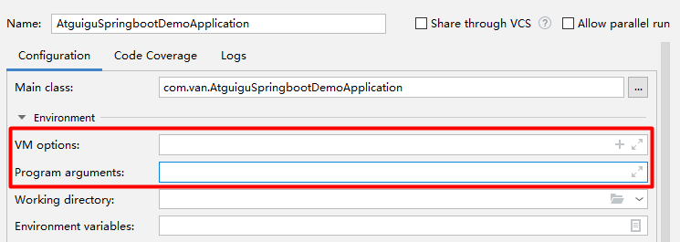

## SpringBoot

主讲：雷丰阳。

参考视频：[springboot核心篇+springboot整合篇-雷丰阳-尚硅谷](https://www.bilibili.com/video/BV1Et411Y7tQ?p=3)。

### 入门

#### 简介

入门简介和微服务简介这里就省略了，待日后参考一些书籍。

#### 环境准备

先导知识：

- spring框架的使用经验。
- 熟练使用maven进行项目构建和依赖管理。
- 熟练使用eclipse或idea。

环境要求（与时俱进，不一定拘泥于下面的）：

- jdk 1.8或以上。
- maven 3.x。
- idea 2017。
- Spring Boot 1.5.9.RELEASE。

#### 对pom.xml的探索

##### 爷爷依赖

钻进pom文件的parent的parent，可见一系列的依赖，系统都帮我们弄好了。当然也有一些依赖需要自己手动添加，尤其注意版本号。

##### 场景启动器

这里举较常用的srping-boot-starter-web。它帮我们导入了web模块正常运行所依赖的组件，具体有哪些可以自己点进去看。

打开[官方文档](https://docs.spring.io/spring-boot/docs/current-SNAPSHOT/reference/htmlsingle/#using-boot-starter)，聚焦3.1.5，从中我们可看出springboot为我们装配了多种场景启动器，对诸多功能场景进行抽取。

#### 主程序类

由于是刚入门，对主程序的分析，包括对源码的解读这里就不记了，待日后学力大增再行添补。

#### 使用向导快速创建springboot应用

eclipse和idea都支持快速向导。

对于idea，在new project中选spring initializr，然后选定要用的依赖模块，向导会联网创建springboot项目。另外，推荐使用阿里云的springboot镜像：https://start.aliyun.com/。

主程序会自动生成。注：@RestController一个顶俩：@Controller和@ResponseBody。

下面是文件结构：

- resource
  - static：保存所有的静态资源，包括js、css、images等。
  - templates：保存所有的模板页面。由于springboot自带tomcat环境，故其默认不支持jsp，可使用模板引擎，如freemarker、thymeleaf。
  - application.properties：springboot应用的配置文件。


对于eclipse，创建一个Spring Starter Project，前提是安装了sts插件，然后选定要用的依赖模块。

### 配置

#### yaml

springboot使用一个全局的配置文件（文件名固定）：application.properties或application.yml。作用是修改springboot自动配置的默认值，比如改端口号。

##### 简介

YAML：YAML Ain‘t Markup Language，意即是一种标记语言，又不是一种标记语言。yaml（yml）比xml更优秀一些，因为它以数据为中心。

以修改端口号为例，xml是这样写的：

```xml
<server>
	<port>8081</port>
</server>
```

而yml是这样写的：

```yml
server:
	port: 8081
```

可见得yaml在语法上更加简洁。

##### 语法

基本语法：`key: value`，注意空格必不可少；用缩进来控制层级关系，左对齐的一列数据属于同一层级；属性和值都是大小写敏感的。

值的写法：

- 字面量：普通值（数字、字符串、布尔值）。

  ```yaml
  # 字符串默认不用加单引号或双引号
  # 单引号中转义字符不生效
  # 双引号中转义字符生效
  name: "Van \n" # \n会转为换行
  name: 'Van \n'
  ```

- 对象、map：

  ```yaml
  friends:
  	lastName: Van
  	firstName: Thomas
  	age: 22
  ```

  行内写法：

  ```yaml
  friends: {lastName: Van,firstName: Thomas,age: 22}
  ```

- 数组（List、Set）：

  ```yaml
  # 用- 值表示数组中的一个元素
  pets:
  	- cat
  	- dog
  	- pig
  ```

  行内写法：

  ```yaml
  pets: [cat,dog,pig]
  ```

#### 配置

这里以配置一个实体类组件为例。

##### 配置文件方式

```xml
<!--导入配置文件处理器，配置组件时就有提示，同时激活@ConfigurationProperties-->
<dependency>
    <groupId>org.springframework.boot</groupId>
    <artifactId>spring-boot-configuration-processor</artifactId>
    <optional>true</optional>
</dependency>
```

```java
package com.van.bean;

import org.springframework.boot.context.properties.ConfigurationProperties;
import org.springframework.stereotype.Component;

import java.util.Date;
import java.util.List;
import java.util.Map;

/**应将配置文件中对应的配置与本类（组件）相映射
 *
 * @author Van
 */
@Component
//@ConfigurationProperties：告知springboot，将本类所有属性与配置文件里的相关配置进行绑定
//prefix：指定配置文件里的本组件属性
@ConfigurationProperties(prefix = "person")
public class Person {
    private String lastName;
    private Integer age;
    private Boolean boss;
    private Date birthday;

    private Map<String,Object> map;
    private List<Object> list;
    private Dog dog;

    public String getLastName() {
        return lastName;
    }

    public void setLastName(String lastName) {
        this.lastName = lastName;
    }

    public Integer getAge() {
        return age;
    }

    public void setAge(Integer age) {
        this.age = age;
    }

    public Boolean getBoss() {
        return boss;
    }

    public void setBoss(Boolean boss) {
        this.boss = boss;
    }

    public Date getBirthday() {
        return birthday;
    }

    public void setBirthday(Date birthday) {
        this.birthday = birthday;
    }

    public Map<String, Object> getMap() {
        return map;
    }

    public void setMap(Map<String, Object> map) {
        this.map = map;
    }

    public List<Object> getList() {
        return list;
    }

    public void setList(List<Object> list) {
        this.list = list;
    }

    public Dog getDog() {
        return dog;
    }

    public void setDog(Dog dog) {
        this.dog = dog;
    }

    @Override
    public String toString() {
        return "Person{" +
                "lastName='" + lastName + '\'' +
                ", age=" + age +
                ", boss=" + boss +
                ", birthday=" + birthday +
                ", map=" + map +
                ", list=" + list +
                ", dog=" + dog +
                '}';
    }
}
```

```yaml
server:
  port: 80
# 配置person
person:
  lastName: Van
  age: 22
  boss: false
  birthday: 1998/10/1
  map: {job: student, hobby: drawing}
  list:
    - Luyis
    - Bell
    - Torres
    - Costa
  dog:
    name: 小白
    age: 2
```

```java
package com.van;

import com.van.bean.Person;
import org.junit.Test;
import org.junit.runner.RunWith;
import org.springframework.beans.factory.annotation.Autowired;
import org.springframework.boot.test.context.SpringBootTest;
import org.springframework.test.context.junit4.SpringJUnit4ClassRunner;

/**
 * springboot单元测试
 *
 * @author Van
 */
@SpringBootTest
@RunWith(SpringJUnit4ClassRunner.class)
public class AtguiguSpringBootDemoTest {
    @Autowired
    Person person;

    @Test
    public void testPerson() {
        System.out.println(person);
    }
}
```

也可在application.properties中配置：

```properties
# 配置person
person.last-name=Van
person.age=22
person.birthday=1998/10/1
person.boss=false
person.map.job=student
person.map.hobby=volleyball
person.list=Luyis,Bell,Costa
person.dog.name=小白
person.dog.age=12
```

避免输出乱码，可在设置-文件编码里勾选Transparent native-to-ascii conversion。

##### 注解方式

比如像下面这样：

```java
// @value与property标签中的value属性是等价的，可用$符从配置文件、环境变量里取值和#符解析spring的EL
@Value("${person.last-name}")
private String lastName;
@Value("#{11*2}")
private Integer age;
@Value("#{true}")
private Boolean boss;
```

##### 对比

|                       | @ConfigurationProperties | @Value             |
| --------------------- | ------------------------ | ------------------ |
| 功能                  | 批量注入属性值           | 一个个地指定属性值 |
| 松散绑定              | 支持                     | 不支持             |
| SpEL                  | 不支持                   | 支持               |
| JSR303数据校验        | 支持                     | 不支持             |
| 复杂类型（如map）封装 | 支持                     | 不支持             |

如果我们在业务逻辑中仅只用组件的个别属性值，那么用@Value；如果某个JavaBean整体映射为配置文件中的一配置，那么应用@ConfigurationProperties。

##### @PropertySource、@ImportResource和@Bean

项目的所有配置都放在application.properties中的话它就显得臃肿，我们可以进行拆分，分出多个properties文件，那么就可用@PropertySource来为某个类指定。

把@PropertySource写在类头上：

```java
@PropertySource(value = {"classpath:person.properties"})
```

springboot项目里没有spring配置文件，我们自己写的spring配置文件（如applicationContext.xml、application.xml）默认也不能识别。想让spring配置文件生效，可将@ImportResource加到一个配置类头上。

受弹幕的点拨，当项目要用第三方库里的类时，通过注解方式将其纳入IOC容器就行不通了，人家类已经写好了，你再去改它，在它头上加个@Component等不合适。故而才有上一段导入手动配置文件的情形。那么springboot推荐用配置类并@Bean注解来实现这一需求。

##### 文件占位符

properties和yaml都支持文件占位符。

配置文件中可使用随机数，如：

```properties
${random.value}
${random.int}
${random.long}
${random.int(10)}
${random.int[1024, 65536]}
```

还用一种叫属性配置占位符，举例如下：

```properties
app.name=MyApp
# 引用业已配过的属性，:myapp指的是本属性找不到情况下的默认值
app.description=${app.name:myapp} is a SpringBoot application
```

##### Profile多环境支持

多文档方式：为了应对不同的环境（开发环境、生产环境、测试环境），我们可创建多个主配置文件，形如application-{Profile}.properteis/yaml。不指定环境的条件下，默认使用application.properties，可在其中激活指定环境的配置文件：`spring.properties.active=dev`。

yaml支持更简洁的多文档块方式，无需创建多个文档：

```yaml
server:
  port: 80
spring:
  profiles:
    active: dev
---
# 开发环境
server:
  port: 8081
spring:
  profiles: dev
---
# 生产环境
server:
  port: 8082
spring:
  profiles: prod
```

环境指定方法还有两种：

- 命令行：既可以在运行项目打成的jar包时指定，`java -jar atguigu-spring-boot-demo-0.0.1-SNAPSHOP.jar --spring.profiles.active=dev`；也可以直接在测试的时候，配置传入的命令行参数，见下图中的Program arguments。

  

- 虚拟机参数：比如在上图中的VM options一栏填入-Dspring.profiles.active=dev。（也可在Programarguments一栏中填入--spring.profiles.active=dev)

##### 内部配置文件的加载

springboot启动时会按优先级由高到低的顺序扫描以下位置的application.properties或application.yml作为默认主配置文件，高优先级的同项配置会覆盖低优先级的。

1. -file:./config/	（项目根目录里的config文件夹）

2. -file:./	（项目根目录）

3. -classpath:./config/	（resources目录里的config文件夹）

4. -classpath:./	（resources目录）

可见得，越外面的优先级越高。

我们也可通过命令行参数，在启动jar包时，添加外部配置文件，导入补充性配置（而不需要改变原有的），来辅助运维：

```shell
java -jar atguigu-spring-boot-demo-0.0.1-SNAPSHOP.jar --spring.config.location=D:/applicatino.properties
```

##### 外部配置文件的加载

[参考官方文档](https://docs.spring.io/spring-boot/docs/current-SNAPSHOT/reference/htmlsingle/#boot-features-external-config)。

##### 自动配置原理

==难以理解，暂且不记。==

##### @Conditional和自动配置报告

==待续。==

### 日志

#### 日志框架的分类和选择

市面上的日志框架：

JUL、JCL、Jboss-logging、logback、log4j、log4j2、slf4j。

将它们分类如下表：

| 日志的抽象层                                                 | 日志的实现层                                                 |
| ------------------------------------------------------------ | ------------------------------------------------------------ |
| ~~JCL~~（Jarkata Commons Logging，夕阳框架）、SLF4j（Simple Logging Facade for Java）、~~jboss-logging~~（适用范围太窄） | Log4j（不新）、JUL（java.util.logging，跟风的)、Log4j2（太好而尚不适配于框架）、Logback |

从左边选一个门面，从右边选一个实现。左边里面只能选SLF4j了，右边权衡一番选Logback。

spring默认是用JCL，springboot默认是用SLF4j和Logback。

#### 如何使用SLF4j

实际开发中，我们不应该直接调用日志的实现类，而应调用日志抽象层里的方法，简洁使用实现类。

首先要导入slf4j的jar包和logback的jar包。

示例代码如下：

```java
import org.slf4j.Logger;
import org.slf4j.LoggerFactory;

public class HelloWorld {
  public static void main(String[] args) {
    Logger logger = LoggerFactory.getLogger(HelloWorld.class);
    logger.info("Hello World");
  }
}
```

slf4j的类层次图如下：


可见得在用非原始实现类（如log4j）实现slf4j时，中间用到适配器模式，加入了适配层。

每一个日志实现框架都有自身的配置文件，即使经由适配层实现了slf4j，配置文件也还是自身原来的那一套写法。

#### 其他日志框架统一转换为SLF4j

各个框架用的日志框架五花八门、不统一，比如spring用commons-logging，hibernate用jboss-logging。那么我们需要统一日志记录，即让别的框架和我一起用slf4j输出记录。

怎么转换呢，我们看下面这个图：


由上得出转换步骤：

1. 将其他日志框架排除出去。
2. 用中间包替换被排除的。
3. 使用slf4j的实现层。

#### springboot日志关系

这是启动器依赖：

```xml
<dependency>
  <groupId>org.springframework.boot</groupId>
  <artifactId>spring-boot-starter</artifactId>
  <version>2.3.0.RELEASE</version>
  <scope>compile</scope>
</dependency>
```

下面这个是日志依赖，启动器依赖于日志。

```xml
<dependency>
  <groupId>org.springframework.boot</groupId>
  <artifactId>spring-boot-starter-logging</artifactId>
  <version>2.3.0.RELEASE</version>
  <scope>compile</scope>
</dependency>
```

springboot底层使用slf4j+logback进行日志记录，并可适配所有其他日志框架。

springboot利用中间替换包将其他的日志框架全都替换为slf4j。

那么如果我们想引入其他框架，就一定先要把它默认依赖的日志框架排除掉。

#### 默认日志配置

请看下面这个这个例子：

```java
package com.van;

import org.junit.jupiter.api.Test;
import org.slf4j.Logger;
import org.slf4j.LoggerFactory;
import org.springframework.boot.test.context.SpringBootTest;

@SpringBootTest
class SpringbootLoggingApplicationTests {

	// 记录器
	Logger logger = LoggerFactory.getLogger(getClass());

	@Test
	void contextLoads() {
		// 按级别由低到高为：trace->debug->info->warn->error
		logger.trace("这是trace日志");
		logger.debug("这是debug日志");
		// springboot默认只显示info及其以上的日志信息
		logger.info("这是info日志");
		logger.warn("这是warn日志");
		logger.error("这是error日志");
	}

}
```

可通过以下代码调整日志级别：

```properties
#com.van中的所有类显示所有日志
logging.level.com.van=trace
```

其他日志配置如下：

```properties
#在本项目跟目中生成日志文件，控制台打印日志并写入到该文件中
logging.file.name=springboot.log
#指定文件路径，控制台打印日志并写入到该文件中
logging.file.name=D:\\log\\springboot.log
#在当前磁盘根目录中生成spring文件夹，其中再生成log，再在其中创建spring.log文件
#当logging.file.name和logging.file.path同时存在，取前者
logging.file.path=spring/log
#指定控制台输出的日志的模板
logging.pattern.console=%d{yyyy-MM-dd} [%thread] %-5level %logger{50} - %msg%n
#指定日志文件存放的日志的模板
logging.pattern.file=%d{yyyy-MM-dd} === [%thread] === %-5level === %logger{50} === %msg%n
```

#### 指定日志文件和日志profile

可以在类路径下放上每个日志框架对应的配置文件以针对任何一个日志框架指定个性化配置，那么springboot就不会使用自身的默认配置了。

下表是官网给出的针对各日志框架的配置文件的命名规范：

| Logging System          | Customization                                                |
| :---------------------- | :----------------------------------------------------------- |
| Logback                 | `logback-spring.xml`, `logback-spring.groovy`, `logback.xml`, or `logback.groovy` |
| Log4j2                  | `log4j2-spring.xml` or `log4j2.xml`                          |
| JDK (Java Util Logging) | `logging.properties`                                         |

其中，带spring的文件不直接加载配置项，而是由springboot解析日志配置，且可使用springboot的高级profile功能，即指定某项配置只在某个环境下生效。下面这个是官方给的示例：

```xml
<springProfile name="staging">
    <!-- configuration to be enabled when the "staging" profile is active -->
</springProfile>

<springProfile name="dev | staging">
    <!-- configuration to be enabled when the "dev" or "staging" profiles are active -->
</springProfile>

<springProfile name="!production">
    <!-- configuration to be enabled when the "production" profile is not active -->
</springProfile>
```

#### 切换日志框架

==暂且不记。==

### Web开发

#### 简介

开发步骤：

1. 创建springboot应用，选择需要的模块。
2. 添加少量配置，以将项目跑起来。
3. 手动编写业务代码。

若想登堂入室，我们需要了解springboot的自动配置原理，在这儿就不详细地写了。下面结合一个restful的crud例子展开说明。

#### 静态资源的映射规则

##### webjars方式

只要满足/webjars/**，就去classpath:/META-INF/resources/webjars/找资源。webjars方式意即以jar包的形式引入静态资源。

我们可以访问这个网站：www.webjars.org（或https://mvnrepository.com/），去将诸如jQuery、bootstrap等前端框架以jar包（maven依赖）的形式导入，而不像之前手动把下载好的文件放进对应目录。	

比如引入jQuery资源：

```xml
<!-- https://mvnrepository.com/artifact/org.webjars.bower/jquery -->
<dependency>
    <groupId>org.webjars.bower</groupId>
    <artifactId>jquery</artifactId>
    <version>3.3.1</version>
</dependency>
```

那么可通过localhost/webjars/jquery/3.3.1/dist/jquery.js（路径可以自己在项目的目录结构上找）从浏览器访问该资源。

##### 自己写的静态资源

只要满足/**，就是访问当前项目的任何资源（静态资源文件夹里的文件）。

```java
"classpath:/META-INF/resources/"
"classpath:/resources/"
"classpath:/static/"
"classpath:/public/"
"/"
```

java和resources都是根目录。

##### 欢迎页面

即静态资源目录下的所有index.html文件。由/或什么都不写映射，形如localhost/或localhost。

##### 标签图标

只要满足**/favicon.ico，就在静态资源目录下寻找该图片文件。

##### 自定义静态资源目录

在主配置文件添加：

```properties
spring.resources.static-locations=classpath:/hello, classpath:/van
```

那么springboot就不再使用默认的静态资源目录了。

#### 模板引擎

##### 引入Thymeleaf

由于springboot应用以jar包的形式运行，且已自带Tomcat，故不支持jsp，而单纯的html又不能灵活地表现后台发来的数据，由此引入模板引擎，核心作用就是将动态数据填入静态页面。

这里我们学习springboot推荐的thymeleaf。

首先导入依赖（注意是以spring-boot起头的）：

```xml
<!-- https://mvnrepository.com/artifact/org.springframework.boot/spring-boot-starter-thymeleaf -->
<dependency>
    <groupId>org.springframework.boot</groupId>
    <artifactId>spring-boot-starter-thymeleaf</artifactId>
</dependency>
```

springboot默认指定了版本号，但不一定最新，我们可切换到最新版本。在properties标签里写入：

```xml
<!-- 切换到最新的thyemleaf -->
<thymeleaf.version>3.0.11.RELEASE</thymeleaf.version>
<thymeleaf-layout-dialect.version>2.2.2</thymeleaf-layout-dialect.version>
```

##### Thymeleaf语法

thymeleaf会自动解析templates目录中的html文件。

比如下面这个简单的访问：

```java
@RequestMapping(value = "success")
public String accessSuccess() {
    // 前提是在templates目录中创建了success.html
    return "success";
}
```

使用thymeleaf的前提是引入其命名空间：

```html
<html xmlns:th="http://www.thymeleaf.org">
```

关于thymeleaf的详细语法（诸如运算符、循环、日期格式化等等），可参考博客或官方文档，此处暂且不记。

#### SpringMVC自动配置原理

可参考官方文档：[Spring Web MVC框架](https://docs.spring.io/spring-boot/docs/current-SNAPSHOT/reference/htmlsingle/#boot-features-spring-mvc)。

==此部分内容目前尚未理解，暂且不记。==

#### 扩展与全面接管SpringMVC（修改springboot对springmvc的默认配置）

##### 扩展（自动与手动共存）

springboot在自动配置诸多组件时，都是先看有没有用户自定义的配置（带@Component、@Bean等注解的），如果有就用用户配置的，如果没有就用默认配置，还可将两者进行综合。

可通过@Configuration注解和实现WebMvcConfiger接口实现关于springmvc的扩展配置，即既保留自动配置，又扩展个性化配置。

注：

- springboot中有非常多的XXXConfigurer帮助我们扩展配置。
- springboot中有非常多的XXXCustomizer帮助我们定制（修改）配置。

比如下面这个例子：

```java
package com.van.config;

import org.springframework.context.annotation.Configuration;
import org.springframework.web.servlet.config.annotation.ViewControllerRegistry;
import org.springframework.web.servlet.config.annotation.WebMvcConfigurer;

/**
 * 对springmvc的手动配置类，通过重写WebMvcConfigurer接口的某方法自定义相应配置
 * 
 * @author Van
 */
@Configuration
public class MyMvcConfig implements WebMvcConfigurer {
    /**
	 * 自定义视图控制器
	 */
	@Override
	public void addViewControllers(ViewControllerRegistry registry) {
        //浏览器发送/success，便访问到success.html
		registry.addViewController("/success").setViewName("success");
	}
}
```

##### 全面接管（纯手动，无自动）

若想全面接管springmvc，所有配置都是自己写的，则需在自己写的配置类中打上@EnableWebMvc注解。虽然全面接管-自配置节省内存空间，但开发不推荐。

#### 引入资源

课件资源自己去网上下载。

比方说要访问主页，有两种做法：

- 利用控制器：

  ```java
  /**
   * 进入网站默认访问主页
   * 
   * @return
   */
  @RequestMapping(value = { "/", "/index", "/index.html" })
  public String accessIndex() {
      // thymeleaf自动添加前后缀
      return "index";
  }
  ```

- 利用配置类。可就在MyMvcConfig类中加入：

  ```java
  /**
   * 注意不要漏掉@Bean，将自定义的配置纳入IOC容器 
   *
   * @return WebMvcConfigurer接口，其下诸方法对应诸项配置
   */
  @Bean
  public WebMvcConfigurer WebMvcConfigurer() {
      WebMvcConfigurer webMvcConfigurer = new WebMvcConfigurer() {
          // 实现接口，覆盖视图控制器方法
          @Override
          public void addViewControllers(ViewControllerRegistry registry) {
              registry.addViewController("index").setViewName("index");
              registry.addViewController("").setViewName("index");
              registry.addViewController("index.html").setViewName("index");
          }
      };
      return webMvcConfigurer;
  }
  ```

比如要用到bootstrap框架。先引入jar包，再修改前端页面中标签的引用属性。

```xml
<!-- 引入bootstrap -->
<dependency>
    <groupId>org.webjars</groupId>
    <artifactId>bootstrap</artifactId>
    <version>4.0.0</version>
</dependency>
```

```html
<link href="asserts/css/bootstrap.min.css" th:href="@{/webjars/bootstrap/4.0.0/css/bootstrap.css}" rel="stylesheet">
```

应注意到以`th:href`并`@{…}`的形式引入有一大好处，即日后若修改项目的上下文路径，则thymeleaf会帮我们自动修改引用路径的前缀。所有标签的引用属性（href、src等）都应基于这种形式，以避免样式、图片加载等问题，其中的原理待以后深究，下面是一些样例：

```html
<link href="asserts/css/bootstrap.min.css" th:href="@{/webjars/bootstrap/4.0.0/css/bootstrap.css}" rel="stylesheet">
<link href="asserts/css/signin.css" th:href="@{/asserts/css/signin.css}" rel="stylesheet">

```

#### 国际化

##### 基本使用

###### 编写配置文件

编写国际化配置文件，抽取页面中需要显示的国际化信息。

以login.html页面为例，在resources目录下创建i18n文件夹，再在其中创建三个国际化文件：

```properties
#login.properties
login.btn=登录~
login.password=密码~
login.remember=记住我~
login.tip=请登录~
login.username=用户名~
```

```properties
#login_zh_CN.properties
login.btn=登录
login.password=密码
login.remember=记住我
login.tip=请登录
login.username=用户名
```

```properties
#login_en_US.properties
login.btn=login
login.password=password
login.remember=remember me
login.tip=please login
login.username=username
```

注：IDEA的Resources Bundle窗口能简化代码编写。

###### 管理国际化资源文件

springboot自动配置好了管理国际化资源文件的组件，可参见源码中的MessageSourceAutoConfiguration类。从该类中可看出资源文件的基础名为messages，即我们可直接将自定义的资源文件放在resources/messages目录下。若自定义的资源文件的基础名不是messages，则需在主配置文件中指定：

```properties
#国际化资源文件的基础名（从类根目录resources开始）
spring.messages.basename=i18n.login
```

###### 在页面中取国际化的值

利用thymeleaf的`#{...}`表达式取值。示例如下：

```html
<h1 class="h3 mb-3 font-weight-normal" th:text="#{login.tip}">Please sign in</h1>
<label class="sr-only" th:text="#{login.username}">Username</label>
<input type="text" class="form-control" placeholder="Username" th:text="#{login.username}" required="" autofocus="">
<label class="sr-only" th:text="#{login.password}">Password</label>
<input type="password" class="form-control" placeholder="Password" th:placeholder="#{login.password}" required="">
<div class="checkbox mb-3">
    <label>
        <input type="checkbox" value="remember-me"> [[#{login.remember}]]
    </label>
</div>
<button class="btn btn-lg btn-primary btn-block" type="submit" th:text="#{login.btn}">Sign in</button>
```

最后可通过切换浏览器的语言以切换国际化资源的显示。

##### 单击链接切换语言显示

###### 原理

springboot默认配置的区域信息解析器可参见WebMvcAutoConfiguration类的localeResolver方法。它的作用是获取区域信息对象Locale。

```java
@Bean
@ConditionalOnMissingBean
@ConditionalOnProperty(prefix = "spring.mvc", name = "locale")
public LocaleResolver localeResolver() {
    if (this.mvcProperties.getLocaleResolver() == WebMvcProperties.LocaleResolver.FIXED) {
        return new FixedLocaleResolver(this.mvcProperties.getLocale());
    }
    // 从请求头中拿到区域信息
    AcceptHeaderLocaleResolver localeResolver = new AcceptHeaderLocaleResolver();
    localeResolver.setDefaultLocale(this.mvcProperties.getLocale());
    return localeResolver;
}
```

根据第8行注释推，请求头里的区域信息又是决定于浏览器的语言设置。那么我们可以将默认的区域信息解析器取而代之，进而实现点击链接切换。

###### 实现

在login.html中写入链接：

```html
<a class="btn btn-sm" th:href="@{/index.html(l='zh_CN')}">中文</a>
<a class="btn btn-sm" th:href="@{/index.html(l='en_US')}">English</a>
```

在component目录下创建MyLocaleResolver类：

```java
package com.van.component;

import org.springframework.util.StringUtils;
import org.springframework.web.servlet.LocaleResolver;

import javax.servlet.http.HttpServletRequest;
import javax.servlet.http.HttpServletResponse;
import java.util.Locale;

/**
 * 自定义的区域信息解析器
 */
public class MyLocaleResolver implements LocaleResolver {

    @Override
    public Locale resolveLocale(HttpServletRequest request) {
        //获取地址栏的language参数
        String language = request.getParameter("l");
        //若参数为空，则用系统缺省语言
        Locale locale = Locale.getDefault();
        if (!StringUtils.isEmpty(language)) {
            //分离语言和国家
            String[] split = language.split("_");
            locale = new Locale(split[0], split[1]);
        }
        return locale;
    }

    @Override
    public void setLocale(HttpServletRequest request, HttpServletResponse response, Locale locale) {

    }
}
```

在MyMvcConfig类中注册组件，使用自己的区域信息解析器，屏蔽springboot默认的：

```java
/**
 * 注册自定义的区域信息解析器，屏蔽默认的
 *
 * @return 区域信息解析器对象
 */
@Bean
public LocaleResolver localeResolver() {
    return new MyLocaleResolver();
}
```

最后检验可知，浏览器的语言选项的改变对页面的中英文信息切换无效。

#### 登录与拦截器

开发期间修改带模板引擎的页面后实时生效（无需重启项目，直接刷新浏览器标签页）的做法：

1. 禁用模板引擎的缓存。

   ```properties
   #禁用模板引擎的缓存
   spring.thymeleaf.cache=false
   ```

2. 修改完后按下Ctrl+F9，即重新编译。

实践代码参见idea里的项目springboot-crud（注：之后所有的实践练习代码均省略），这里给出一些要点：

- 为避免刷新页面重复提交表单，将登录设为重定向。
- 用拦截器做登录检查。
- 理解业务逻辑。

#### Restful CRUD

Restful风格简而言之，即针对同名请求，根据请求方式区分请求操作。

从下表看看普通crud和Restful风格的crud的区别（注：请求名后可能跟随的参数列表省略）：

|      | 普通CRUD       | Restful CRUD            |
| ---- | -------------- | ----------------------- |
| 查询 | getEmployee    | employee-GET请求方式    |
| 添加 | addEmployee    | employee-POST请求方式   |
| 修改 | updateEmployee | employee-PUT请求方式    |
| 删除 | deleteEmployee | employee-DELETE请求方式 |

实践项目要点：

- PUT和DELETE请求的使用，注意2.3.0版springboot需手动启动HiddenHttpMethodFilter的自动配置。

- 利用thymeleaf自定义结点属性（参见5.2节Setting value to specific attributes）。

#### 利用thymeleaf抽取公共页面元素

具体是`th:fragment`、`th:insert`等。

下面是官方文档（见于第8章-Template Layout）给的小例子：

```html
<!--1. 抽取公共片段-->
<div th:fragment="copy">
	&copy; 2011 The Good Thymes Virtual Grocery
</div>
<!--2. 引用公共片段，~可省略-->
<div th:insert="~{footer :: copy}"></div>
```

引用时大括号内有两种写法：

- `模板名::选择器`。
- `模板名::片段名`。

insert必定会将引入的片段包裹某个标签，有些情况下可能造成一些显示上的问题。由此，再看一下其他两个th属性，并对三者进行比较：

- `th:insert`：将引入的带根标签的代码片段外面再包上某个标签。
- `th:replace`：引入带根标签的代码片段，外面不包标签。
- `th:include`：引入不带根标签的代码片段，外面包上某个标签。

那么在实践项目中应用第二个，原样移植。

引入片段时可传入若干参数，被引用片段处设形参，引用片段处传实参。详细知识可参考文档的8.2节-Parameterizable fragment signatures。利用这个可实现侧边栏选项的动态高亮显示，即鼠标点谁谁亮起来。

#### 错误处理机制

##### 默认机制

关于默认的处理机制：

- 浏览器：白底黑字，写明错误信息和状态码。所发送请求的请求头中有text/html。
- 其他客户端：一条json数据。所发送请求的请求头中有/*。

默认机制原理可参考源码里的ErrorMvcAutoConfiguration类。它往IOC容器中添加了以下组件：

- DefaultErrorAttributes：帮我们定制报告信息。源码中可看出其默认的信息。
- BasicErrorController：第2个登场。处理默认/error请求，根据请求头信息决定响应页面还是json数据。
- ErrorPageCustomizer：第1个登场。系统出现错误后来到error请求进行处理，等价于原来在web.xml中注册错误页面规则。
- DefaultErrorViewResolver：第3个登场。为BasicErrorController解析得到将要去往的页面。

##### 定制机制

###### 定制在浏览器显示的错误信息页面

关于页面，有模板引擎的情况下，可在templates目录（thymeleaf只会关注templates文件夹）里中自建error目录，放进404.html、500.html等文件。那么无论发生什么错误，能会在其中找到对应状态码的html文件。此外，还可放入4xx.html、5xx.html这类文件名含通配符的html文件。发生错误时，springboot会先找精确的，没有则找宽泛的。

关于页面中显示的报告信息（下列属性摘自DefaultErrorAttributes类）：

- timestamp：时间戳。
- status：状态码。
- error：错误提示。
- exception：异常对象。
- message：异常消息。
- errors：JSR303相关的错误信息。

上述对象均可在错误信息页面中用thymeleaf取出来显示。比如下面的小例子：

```html
<h1>status: [[${status}]]</h1>
<h1>timestamp: [[${#dates.format(timestamp,"yyyy-MM-dd HH:mm")}]]</h1>
<h1>exception: [[${exception}]]</h1>
<h1>message: [[${message}]]</h1>
```

（了解）关于页面，在没有模板引擎的情况下，springboot会去[静态资源文件夹](#自己写的静态资源)里找。

（了解）关于页面，若模板引擎没有且页面不在静态资源文件夹中，springboot就使用默认的错误提示页面。

###### 定制发给其他客户端的json数据

本节知识点与[SpringMVC.md](./springmvc.md)中的异常处理一节可对照来看。

这是自建的异常处理器：

```java
package com.van.controller;

import com.van.exception.UserNotExistException;
import org.springframework.web.bind.annotation.ControllerAdvice;
import org.springframework.web.bind.annotation.ExceptionHandler;
import org.springframework.web.bind.annotation.ResponseBody;

import javax.servlet.http.HttpServletRequest;
import java.util.HashMap;
import java.util.Map;

/**
 * 自定义的异常处理器（默认机制失效）
 */
//处理包括其他类在内的任意类抛出的异常
@ControllerAdvice
public class MyExceptionHandler {

    /**
     * 处理用户不存在异常
     *
     * @param e 异常对象
     * @return
     */
    //返回数据不跳转
    @ResponseBody
    //捕捉特定异常
    @ExceptionHandler(UserNotExistException.class)
    public Map<String, Object> handleException(Exception e) {
        Map<String, Object> map = new HashMap<>();
        map.put("code", "user.notExist");
        map.put("message", e.getMessage());
        return map;
    }
    
}
```

一旦发生UserNotExistException，就会由其处理，随后在浏览器或其他客户端都会看到这样的数据：

> {"code":"user.notExist","message":"用户不存在！"}

也可以转发到/error进行自适应响应效果处理：

```java
/**
 * 手动触发error请求，由BasicErrorController作进一步处理
 *
 * @param e
 * @return
 */
@ExceptionHandler(UserNotExistException.class)
public String handleException(Exception e) {
    Map<String, Object> map = new HashMap<>();
    map.put("code", "user.notExist");
    map.put("message", e.getMessage());
    //转发到/error请求，即默认处理，针对浏览器返回页面，针对其他客户的返回json数据
    return "forward:/error";
}
```

浏览器显示的结果：

> # Whitelabel Error Page
>
> This application has no explicit mapping for /error, so you are seeing this as a fallback.
>
> Sun Jul 19 11:12:47 CST 2020
>
> There was an unexpected error (type=OK, status=200).
>
> 用户不存在！

从中可看出问题，/error请求是手动触发的，状态码会是200而非4xx或5xx，而且BasicErrorController用默认的错误页面响应。

那么进一步地我们需自定状态码（原理参见源码BasicErrorController类）。改进如下：

```java
/**
 * 手动触发error请求，由BasicErrorController作进一步处理
 *
 * @param e
 * @param request
 * @return
 */
@ExceptionHandler(UserNotExistException.class)
public String handleException(Exception e, HttpServletRequest request) {
    Map<String, Object> map = new HashMap<>();
    //传入自己的错误状态码，如4xx、5xx，不然不会进入定制错误页面的解析流程
    request.setAttribute("javax.servlet.error.status_code", 500);
    map.put("code", "user.notExist");
    map.put("message", e.getMessage());
    //转发到/error请求，即默认处理，针对浏览器返回页面，针对其他客户的返回json数据
    return "forward:/error";
}
```

> status: 500
>
> timestamp: 2020-07-19 11:07
>
> exception: com.van.exception.UserNotExistException
>
> message: 用户不存在！

然后又看出新问题，我们写的code信息并没有展示。

那么再进一步，我们需将定制的错误信息数据也携带出去。

部分springboot源码：

```java
//BasicErrorController类

@RequestMapping(produces = MediaType.TEXT_HTML_VALUE)
public ModelAndView errorHtml(HttpServletRequest request, HttpServletResponse response) {
    HttpStatus status = getStatus(request);
    Map<String, Object> model = Collections
            .unmodifiableMap(getErrorAttributes(request, getErrorAttributeOptions(request, MediaType.TEXT_HTML)));
    response.setStatus(status.value());
    ModelAndView modelAndView = resolveErrorView(request, response, status, model);
    return (modelAndView != null) ? modelAndView : new ModelAndView("error", model);
}

@RequestMapping
public ResponseEntity<Map<String, Object>> error(HttpServletRequest request) {
    HttpStatus status = getStatus(request);
    if (status == HttpStatus.NO_CONTENT) {
        return new ResponseEntity<>(status);
    }
    Map<String, Object> body = getErrorAttributes(request, getErrorAttributeOptions(request, MediaType.ALL));
    return new ResponseEntity<>(body, status);
}
```

```java
//AbstractErrorController类

protected Map<String, Object> getErrorAttributes(HttpServletRequest request, ErrorAttributeOptions options) {
    WebRequest webRequest = new ServletWebRequest(request);
    return this.errorAttributes.getErrorAttributes(webRequest, options);
}
```

```java
//ErrorMvcAutoConfiguration类

@Bean
@ConditionalOnMissingBean(value = ErrorAttributes.class, search = SearchStrategy.CURRENT)
public DefaultErrorAttributes errorAttributes() {
    return new DefaultErrorAttributes();
}
```

分析以上源码可得：发生错误之后，会触发/error请求，它由BasicErrorController处理，而响应出去的数据是由getErrorAttributes方法（属AbstractErrorController类）得到（装进ModelAndView或Map）。返回到页面的数据或返回的json数据都是由errorAttributes.getErrorAttributes得到，而在不给定ErrorAttributes（一个接口）对象的情况下，springboot就生成并使用DefaultErrorAttributes（ErrorAttributes接口的实现类）对象。

于是我们有两种解决办法：

- 定义AbstractErrorController的子类来重写该方法，将其纳入IOC容器。这个办法比较麻烦。
- 自定义一个类继承DefaultErrorAttributes或实现ErrorAttributes。

下面是第二种方法的实现代码：

```java
//进一步改进handleException方法

@ExceptionHandler(UserNotExistException.class)
public String handleException(Exception e, HttpServletRequest request) {
    Map<String, Object> map = new HashMap<>();
    //传入自己的错误状态码，如4xx、5xx，不然不会进入定制错误页面的解析流程
    request.setAttribute("javax.servlet.error.status_code", 500);
    map.put("code", "user.notExist");
    map.put("message", e.getMessage());
    //将此处的map放入request域对象
    request.setAttribute("ext", map);
    //转发到/error请求，即默认处理，针对浏览器返回页面，针对其他客户的返回json数据
    return "forward:/error";
}
```

```java
package com.van.component;

import org.springframework.boot.web.error.ErrorAttributeOptions;
import org.springframework.boot.web.servlet.error.DefaultErrorAttributes;
import org.springframework.stereotype.Component;
import org.springframework.web.context.request.WebRequest;

import java.util.Map;

/**
 * 将自定义的ErrorAttributes纳入IOC容器
 */
@Component
public class MyErrorAttributes extends DefaultErrorAttributes {
    @Override
    public Map<String, Object> getErrorAttributes(WebRequest webRequest, ErrorAttributeOptions options) {
        Map<String, Object> map = super.getErrorAttributes(webRequest, options);
        //添加公司标识
        map.put("company", "Fly-Van");
        //取request域对象里的map属性并放入最终的map。进此方法所属的RequestAttributes接口可知0表request域
        Map<String, Object> ext = (Map<String, Object>) webRequest.getAttribute("ext", 0);
        map.put("ext", ext);
        //返回值map就携带了所有在页面展示或以json格式发回的错误信息
        return map;
    }
}
```

#### 嵌入式Servlet容器配置

修改servlet相关配置。

一种方法是通过主配置文件配置，可参照源码ServerProperties类进行配置：

```proper
#通用的servlet容器设置
server.xxx=……
#tomcat的设置
server.tomcat.xxx=……
```

另一种方法是通过WebServerFactoryCustomizer接口定制：

```java
/**
 * 进行嵌入式servlet配置，等价于在主配置文件中配置
 *
 * @return
 */
@Bean
public WebServerFactoryCustomizer myWebServerFactoryCustomizer() {
    return new WebServerFactoryCustomizer<ConfigurableServletWebServerFactory>() {
        @Override
        public void customize(ConfigurableServletWebServerFactory factory) {
            factory.setPort(80);
        }
    };
}
```

以上两种方法的底层原理是一样的。

#### 注册Servlet三大组件

三大组件即Servlet、Filter、Listener。

原先我们是在web.xml中注册的，而现在springboot打成的是jar包，没有web.xml，于是需采用编码的办法来注册。

已在项目中写了三个自定义组件，下面是注册它们的源码：

```java
/**
 * 注册三大组件之一-Servlet
 */
@Bean
public ServletRegistrationBean registerMyServlet() {
    //传入要注册的servlet及其映射的请求路径
    return new ServletRegistrationBean<>(new MyServlet(), "/myServlet");
}
```

```java
/**
 * 注册三大组价之一-Filter
 *
 * @return
 */
@Bean
public FilterRegistrationBean registerMyFilter() {
    FilterRegistrationBean<Filter> filterRegistrationBean = new FilterRegistrationBean<>();
    filterRegistrationBean.setFilter(new MyFilter());
    //传入集合，指定过滤路径
    filterRegistrationBean.setUrlPatterns(Arrays.asList("/hello", "/myServlet"));
    return filterRegistrationBean;
}
```

```java
/**
 * 注册三大组价之一-Listener
 *
 * @return
 */
@Bean
public ServletListenerRegistrationBean registerListener() {
    //传入自建的监听器
    ServletListenerRegistrationBean listenerRegistrationBean = new ServletListenerRegistrationBean(new MyListener());
    return listenerRegistrationBean;
}
```

上述代码中有三大关键类：ServletRegistrationBean、FilterRegistrationBean与ServletListenerRegistrationBean。进入它们的源码可查看各自的setter以了解更多设置。

原先我们需手动创建springmvc的前端控制器DispatcherServlet（创建springmvc.xml并在web.xml中配置），而现在springboot帮我们注册前端控制器，下面是源码DispatcherServletAutoConfiguration类中的一段：

```java
@Bean(name = DEFAULT_DISPATCHER_SERVLET_REGISTRATION_BEAN_NAME)
@ConditionalOnBean(value = DispatcherServlet.class, name = DEFAULT_DISPATCHER_SERVLET_BEAN_NAME)
public DispatcherServletRegistrationBean dispatcherServletRegistration(DispatcherServlet dispatcherServlet,
        WebMvcProperties webMvcProperties, ObjectProvider<MultipartConfigElement> multipartConfig) {
    DispatcherServletRegistrationBean registration = new DispatcherServletRegistrationBean(dispatcherServlet,
            webMvcProperties.getServlet().getPath());
    //默认拦截/，即所有请求，包括静态资源，但不包括jsp。/*会拦截jsp。
    //可通过配置spring.mvc.servlet.path来修改默认拦截路径
    registration.setName(DEFAULT_DISPATCHER_SERVLET_BEAN_NAME);
    registration.setLoadOnStartup(webMvcProperties.getServlet().getLoadOnStartup());
    multipartConfig.ifAvailable(registration::setMultipartConfig);
    return registration;
}
```

#### 使用其他嵌入式Servlet容器

springboot支持Jetty（长于处理长时间链接，如线上聊天）、Undertow（并发性能好，非阻塞，但不支持jsp）等其他servlet容器。默认使用的是Tomcat（它的一个身份就是servlet容器）。

使用方法即将Tomcat的依赖spring-boot-starter-tomcat排除掉，加进这俩哥们儿的依赖：

```xml
<dependency>
  <groupId>org.springframework.boot</groupId>
  <artifactId>spring-boot-starter-jetty</artifactId>
  <version>2.3.0.RELEASE</version>
  <scope>compile</scope>
</dependency>

<dependency>
  <groupId>org.springframework.boot</groupId>
  <artifactId>spring-boot-starter-undertow</artifactId>
  <version>2.3.0.RELEASE</version>
  <scope>compile</scope>
</dependency>
```

#### 嵌入式Servlet容器自动配置原理

==待续==

#### 嵌入式Servle容器启动原理

==待续==

#### 使用外部Servlet容器及JSP支持

嵌入式servlet容器的优缺点：

- 优点：简单、便捷。
- 缺点：默认不支持jsp、定制过程比较复杂。

jsp如今用得很少，后面是一些手工操作，==暂且不记==。

#### 外部Servlet容器的启动原理

==待续==

### Docker

#### 简介

docker是一个应用容器引擎。

docker支持将软件编译为镜像（软件），然后发布出去，其他用户可直接使用这个镜像。运行着的镜像叫做容器，容器的启动速度非常快。

#### 核心概念

docker主机（Host）：安装了docker程序的计算机。docker程序安装在操作系统之上。

docker客户端（Client）：用于连接主机进行进一步操作。

docker仓库（Registry）：保存各种打包好的软件镜像。

docker镜像（Image）：打好包的软件镜像，放在docker仓库中。

docker容器（Container）：启动了的镜像叫做容器。多个容器可一起独立运行。

附带一提，使用docker的步骤：

1. 安装docker。
2. 去docker仓库找所需软件的镜像。
3. 使用docker运行这个镜像，生成一个docker容器。
4. 对容器的启动停止就是对对应软件的启动停止。

==后续几节暂且不记==

#### 安装、启动和停止

#### 镜像操作常用命令

#### 容器操作常用命令

### 数据访问

#### 简介

对于数据访问层，无论是SQL还是NoSQL，springboot都默认采用Spring Data的整合方式进行统一处理，添加大量自动配置，引入xxxTemplate、xxxRepositoty来简化我们对数据访问层的操作。故我们只需进行简单的设置。

在参考文档中可看出与数据访问相关的场景启动器模式为spring-boot-starter-data-xxx。

#### JDBC和自动配置原理