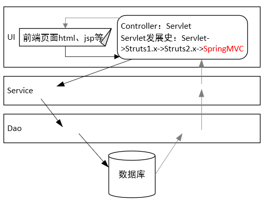

# SpringMVC

主讲：颜群。

参考视频：[SpringMVC视频教程](https://www.bilibili.com/video/BV1MW411A7Kn)。

参考项目：springmvc、atguiguSSM等。

注：eclipse环境下，整合SSM框架时，如果遇到配置文件访问网络报错的情况，可在首选项中取消XML Validation。


#### 发展



上层调下层，下层为上层服务。SpringMVC经历了如上图所示的发展历程。SpringMVC相当于Servlet的升级版。

#### 案例

##### 导包

除Spring的六个基本jar包外，加入spring-webmvc.jar。若是maven工程，pom.xml如下：

```xml
<project xmlns="http://maven.apache.org/POM/4.0.0"
	xmlns:xsi="http://www.w3.org/2001/XMLSchema-instance"
	xsi:schemaLocation="http://maven.apache.org/POM/4.0.0 https://maven.apache.org/xsd/maven-4.0.0.xsd"
>
	<modelVersion>4.0.0</modelVersion>
	<groupId>com.van</groupId>
	<artifactId>springmvc</artifactId>
	<version>0.0.1-SNAPSHOT</version>
	<packaging>war</packaging>
	<dependencies>
		<!-- 面向切面：spring-aop -->
		<dependency>
			<groupId>org.springframework</groupId>
			<artifactId>spring-aop</artifactId>
			<version>4.3.7.RELEASE</version>
		</dependency>
		<!-- spring-beans -->
		<dependency>
			<groupId>org.springframework</groupId>
			<artifactId>spring-beans</artifactId>
			<version>4.3.7.RELEASE</version>
		</dependency>
		<!-- spring-context -->
		<dependency>
			<groupId>org.springframework</groupId>
			<artifactId>spring-context</artifactId>
			<version>4.3.7.RELEASE</version>
		</dependency>
		<!-- spring-core -->
		<dependency>
			<groupId>org.springframework</groupId>
			<artifactId>spring-core</artifactId>
			<version>4.3.7.RELEASE</version>
		</dependency>
		<!-- spring-expression -->
		<dependency>
			<groupId>org.springframework</groupId>
			<artifactId>spring-expression</artifactId>
			<version>4.3.7.RELEASE</version>
		</dependency>
        <!-- 其实前面的都不用写，因为这最后的webmvc依赖它们 -->
		<!-- spring-webmvc -->
		<dependency>
			<groupId>org.springframework</groupId>
			<artifactId>spring-webmvc</artifactId>
			<version>4.3.7.RELEASE</version>
		</dependency>
</project>
```

##### 配置

创建springmvc配置文件springmvc.xml。

选用常用的命名空间：beans、aop、context、mvc。

```xml
<?xml version="1.0" encoding="UTF-8"?>
<beans xmlns="http://www.springframework.org/schema/beans"
	xmlns:xsi="http://www.w3.org/2001/XMLSchema-instance"
	xmlns:aop="http://www.springframework.org/schema/aop"
	xmlns:context="http://www.springframework.org/schema/context"
	xmlns:mvc="http://www.springframework.org/schema/mvc"
	xsi:schemaLocation="http://www.springframework.org/schema/mvc http://www.springframework.org/schema/mvc/spring-mvc-4.3.xsd
		http://www.springframework.org/schema/beans http://www.springframework.org/schema/beans/spring-beans-4.3.xsd
		http://www.springframework.org/schema/context http://www.springframework.org/schema/context/spring-context-4.3.xsd
		http://www.springframework.org/schema/aop http://www.springframework.org/schema/aop/spring-aop-4.3.xsd"
>
	<!-- SpringMVC注解扫描 -->
	<context:component-scan base-package="com.van"></context:component-scan>
    <mvc:annotation-driven/>
    <mvc:default-servlet-handler/>
    <!-- 视图解析器InternalResourceViewResolver -->
    <bean id="viewResolver" class="org.springframework.web.servlet.view.InternalResourceViewResolver">
    	<!-- 给所有返回地址增加前缀/ -->
    	<property name="prefix" value="/"/>
    	<!-- 给所有返回地址增加后缀.jsp -->
  	    <property name="suffix" value=".jsp"/>
    </bean>
</beans>
```

回想servlet收到请求的过程：地址栏输入或点击、提交等方式产生的请求或是通过注解拦截，或是通过servlet-mapping标签里的url-pattern标签拦截，进而传给servlet程序去处理。

那么现在用的是springmvc而非普通servlet，就需要配置springmvc自带的servlet-dispatcherServlet，让其介入。

在web.xml中新增：

```xml
<!-- springmvc前端控制器 -->
<servlet>
	<servlet-name>springmvc</servlet-name>
   	<servlet-class>org.springframework.web.servlet.DispatcherServlet</servlet-class>
   	<!-- 初始化参数：指定springmvc配置文件的位置 -->
   	<init-param>
     	<param-name>contextConfigLocation</param-name>
     	<param-value>classpath:springmvc.xml</param-value>
   	</init-param>
   	<!-- 初始化参数：tomcat启动时，此部分servlet配置自动加载 -->
   	<load-on-startup>1</load-on-startup>
</servlet>
<servlet-mapping>
   	<servlet-name>springmvc</servlet-name>
    <!-- 拦截一切请求 -->
   	<url-pattern>/</url-pattern>
</servlet-mapping>
```

在url-pattern标签中:

- `/`表示一切请求，注意不是`/*`。
- `/user`表示以user开头的请求。
- `/user/hello.do`表示唯一特定请求。
- `.action`表示以.action结尾的请求。

请求名不含.action的话，先找servlet再找springmvc的控制器，写了的话找springmvc控制器。

##### 使用

还是那个套路，要让一个普通类变成特殊类（这里是springmvc的前端控制器controller），不外乎四种方式：继承父类、实现接口、写配置、打注解，推荐第四种，清晰简洁。

由于练得不少，测试类（控制层类）这里就不写了，更多花式注解留待后面记录。

注：控制器包名有：servlet、controller、handler、action。

#### requestMapping注解

该注解既可写在方法级，也可写在类级，拼接起来得到最终访问地址。

```java
@Controller
@requestMapping("father")
public class Father{

	@requestMapping("son/abc")
	public String son(){
		return "success";
	}
	
}
```

要访问上面这个控制器，地址就该写成：`father/son/abc`。

对框架而言，注解比类和方法重要（注解才是我要找的）。

多写属性相当于给拦截增加条件。举一些例子来理解属性：

```java
// 映射值是login
@requestMapping(value="login")
// 请求方式必须是POST，当然还有很多其他的。注意这里用到枚举
@requestMapping(value="login", method=requestMethod.POST)
// 请求中必须带特定参数，可能参数值也有限制
@requestMapping(value="login", params={"name", "age=22", "weight!=55", "!height"})
// 满足特定请求头信息（控制信息）
@requestMapping(value="login", headers="……")
```

ant（一种项目构建工具）风格的的请求路径：value值支持通配符：？代表单个字符；*代表0或多个字符；**代表包括/的任意目录。

#### Rest（Restful）

rest指一种软件编程风格，特指前端请求类型，有四种：增-POST、删-DELETE、改-PUT、查-GET。普通浏览器只支持get和post请求，过滤器HiddenHttpMehtodFilter可通过对post请求进行加工以支持两种请求。

修改web.xml以开启对Rest的支持：

```xml
<!-- 请求加工过滤器 使用Rest风格的请求 -->
<filter>
	<filter-name>HiddenHttpMethodFilter</filter-name>
	<filter-class>org.springframework.web.filter.HiddenHttpMethodFilter</filter-class>
</filter>
<filter-mapping>
	<filter-name>HiddenHttpMethodFilter</filter-name>
	<url-pattern>/</url-pattern>
</filter-mapping>
```

过滤器规定若post请求想变为put或delete类型，则需满足请求的原类型为post。如果使用表单提交，输入框必须形如：

```jsp
<!-- 此输入控件是隐藏的 -->
<input type="hidden" name="_method" value="PUT或DELETE"/>
```

下面看个增删改查齐全的表单请求例子：

```jsp
<form action="testRest" method="post">
	<button type="submit">增加</button>
</form>

<form action="testRest" method="post"> 
 	<input type="hidden" name="_method" value="DELETE">
	<button type="submit">删除</button>
</form>

<form action="testRest" method="post">
	<input type="hidden" name="_method" value="PUT">
	<button type="submit">修改</button>
</form>

<form action="testRest" method="get">
	<button type="submit">查询</button>
</form>
```

当然对ajax这些非表单请求，则有各自特定写法。这里以jQuery的ajax方法为例：

```js
// 在data属性中指定请求类型
data: {
    'empId': $('#confirmDeleteBtn').attr('empId'),
    '_method': 'DELETE'
},
    
// 或者将属性值写成字符串形式
data: $('#editEmpForm').serialize() + '&_method=PUT'
```

最后控制器可像这样写：

```java
@Controller
public class RequestTypeController {
	@RequestMapping(value = "testRest", method = RequestMethod.POST)
	public String testPost() {
		System.out.println("正在添加");
		return "hello";
	}

	@RequestMapping(value = "testRest", method = RequestMethod.DELETE)
	public String testDelete() {
		System.out.println("正在删除");
		return "hello";
	}

	@RequestMapping(value = "testRest", method = RequestMethod.PUT)
	public String testPut() {
		System.out.println("正在修改");
		return "hello";
	}

	@RequestMapping(value = "testRest", method = RequestMethod.GET)
	public String testGet() {
		System.out.println("正在查询");
		return "hello";
	}
}
```

从上看出4个方法分别接收4中不同类型的请求。

#### 处理前端参数

常用注解：

- @RequestHeader：获取请求头信息。
- @CookieValue：获取Cookie相关信息。
- @RequestParam：参数名映射。
- @PathVariable：与请求参数作用一样而形式不同的路径变量。

springMVC的一个强大之处在于可将入参封装起来映射为实体类的对象，形参对象的实例域应与前端表单控件的name值一一对应。

前端表单可以这样写：

```jsp
<form action="objectParameter">
	学生编号：<input type="text" name="sid"><br>
	学生名:<input type="text" name="sname"><br>
	学生性别：<input type="text" name="gender"><br>
	学生年龄：<input type="text" name="age"><br>
	教师编号：<input type="text" name="teahcer.tid"><br>
	教师姓名：<input type="text" name="teacher.tname"><br>
	<button type="submit">提交</button>
</form>
```

处理方法可以这样写：

```java
/**
 * 将前端多参数封装为对象
 * 
 * @param student 学生对象
 * @return
 */
@RequestMapping(value = "objectParameter")
public String objectParameter(Student student) {
	System.out.println(student);
	return "hello";
}
```

提一下最后一个注解PathVariable，它的作用也是获取请求参数，只适合get方式。B站就用这种风格。

比如请求地址写成localhost/welcome/Thomas，而不使用问号。

控制器这样写：

```java
@Controller
public class Father{
	@requestMapping("welcome/{name}")
	public String son(@PathVariable("name") String name){
        // 动态获取尾项，这里即Thomas
		System.out.println(name);
		return "success";
	}
}
```

#### 处理模型数据

如果跳转时携带数据即既同View有关又同Model有关，我们可以通过ModelAndView、ModelMap、Map、Model等类来处理；也可通过@SessionAtrributes、@ModelAttribute等注解来处理。前者较为常见，且数据置于request对象中。

```java
package com.van.controller;

import java.util.Map;

import org.springframework.stereotype.Controller;
import org.springframework.ui.Model;
import org.springframework.ui.ModelMap;
import org.springframework.web.bind.annotation.RequestMapping;
import org.springframework.web.servlet.ModelAndView;

import com.van.entity.Student;

@Controller
public class HelloController {

	/**
	 * 用ModelAndView封装数据（模型）和视图
	 * 
	 * @return
	 */
	@RequestMapping(value = "testModelAndView")
	public ModelAndView testModelAndView() {
		ModelAndView mv = new ModelAndView("hello");
		Student student = new Student(1, "Van", "man", 22);
		mv.addObject("student", student);
		return mv;
	}

	/**
	 * 用Model封装数据
	 * 
	 * @param model
	 * @return
	 */
	@RequestMapping(value = "testModel")
	public String testModel(Model model) {
		Student student = new Student(2, "Bob", "man", 20);
		model.addAttribute("student", student);
		return "hello";
	}

	/**
	 * 用ModelMap封装数据
	 * 
	 * @param modelMap
	 * @return
	 */
	@RequestMapping(value = "testModelMap")
	public String testModelMap(ModelMap modelMap) {
		Student student = new Student(3, "John", "man", 20);
		modelMap.put("student", student);
		return "hello";
	}

	/**
	 * 用Map封装数据
	 * 
	 * @param map
	 * @return
	 */
	@RequestMapping(value = "testMap")
	public String testMap(Map<String, Object> map) {
		Student student = new Student(4, "Tom", "man", 21);
		map.put("student", student);
		return "hello";
	}
}
```

那么如何将上述放入request里的数据存入session中？使用@SessionAtrributes。

```java
//将本控制器类处理的Student对象放入session
@SessionAttributes(types = {Student.class})
//将本控制器类处理的Student对象和Teacher对象放入session
@SessionAttributes(types = {Student.class,Teacher.class})
```

另一个注解是@ModelAttribute，一般在数据更新时使用。此注解修饰的方法会在本类其他任何一个非此注解修饰的请求处理方法执行前执行，必须有Map类型的参数，目的是将对象（比如查询得到的）put进Map中，并传递给待执行的请求处理方法，默认key的值须与请求处理方法的参数类型的首字母小写单词相同。

#### 视图、视图解析器和国际化

Controller方法的返回值有String、View、ModelAndView，但都会转为ModelAndView，进一步地被视图解析器ViewResolver渲染为视图View（jsp、pdf等）。

视图的顶级接口：View，视图解析器的顶级接口：ViewResolver。常见的视图和解析器有InternalResourceView、InternalResourceViewResolver等，JstlView是InternalResourceView的子类，springMVC解析jsp时会默认处理成InternalResourceView，但如果发现jsp中有jstl，则自动转为JstlView。

JstlView支持jstl并实现国际化（主要针对语言）操作。实现国际化步骤：

1. 创建并配置资源文件，形如：`基名_语言_地区.properties`或`基名_语言.properties`。可在网上搜“国际化资源文件命名”。我们姑且创建文件名为i18n.properties（internationalization-国际化）与i18n_en_US.properties的资源文件。

   ```properties
   resource.welcome=\u6B22\u8FCE
   resource.hello=\u4F60\u597D
   ```

   ```properties
   resource.welcome=WELCOME
   resource.hello=HELLO
   ```

2. 加载国际化资源文件。在springmvc.xml中配置：

   ```xml
   <!-- 加载国际化资源文件：id必须为messageSource，这样项目启动，即IOC容器加载时，会自动加载id为messageSource的类。本类只有在服务器响应时才进行解析任务 -->
   <bean id="messageSource" class="org.springframework.context.support.ResourceBundleMessageSource">
   	<property name="basename" value="i18n"></property>
   </bean>
   ```

3. 通过jstl在jsp中使用国际化。

   首先须导入依赖jar包：

   ```xml
   <!-- jstl -->
   <dependency>
   	<groupId>jstl</groupId>
   	<artifactId>jstl</artifactId>
   	<version>1.2</version>
   </dependency>
   <!-- standard -->
   <dependency>
   	<groupId>taglibs</groupId>
   	<artifactId>standard</artifactId>
   	<version>1.1.2</version>
   </dependency>
   ```

   jsp头文件引入：

   ```
   <%@ taglib uri="http://java.sun.com/jsp/jstl/fmt" prefix="fmt" %>
   ```

   在jsp里使用：

   ```jsp
   <fmt:message key="resource.welcome"></fmt:message>
   <fmt:message key="resource.hello"></fmt:message>
   ```

可通过给InternalResourceViewResolver类的buildView方法打断点查看所解析出的视图是InternalResourceView还是JstlView。

#### 视图解析器

##### 内嵌式控制器

一个jsp页面向另一个jsp页面的跳转（转发或重定向）有三种情况：

- 有springMVC的介入，由控制器处理。

- 有springMVC的介入，但是没有控制器的处理：

  ```xml
  <!-- 可理解为tomcat内嵌的控制器。一旦使用此标签，所有自定义的控制器类均会失效，另外视图名也会自动由视图解析器补上前后缀 -->
  <mvc:view-controller path="testMVC" veiw-name="hello" />
  ```

  ```jsp
  <a href="testMVC">testMVC</a>
  ```

  想让控制器类不失效，即仅将指定的请求交付内嵌控制器，需在springmvc.xml中配置注解驱动：
  
  ```xml
  <mvc:annotation-driven></mvc:annotation-driven>
  ```

- 无springMVC的介入，直接跳转。

##### 指定请求方式

可在请求处理方法中指定跳转方式，例如：

```java
return "forward:/views/hello.jsp"
return "redirect:/views/hello.jsp"
```

但注意一旦指定了跳转方式，视图解析器的前后缀补全功能就会失效，故应手动补全前后缀。

#### 处理静态资源

静态资源包括：html、css、js、图片、视频、音频等。

若想将静态资源交付tomcat用默认的servlet处理，则须添加两个标签：

```xml
<mvc:annotation-driven></mvc:annotation-driven>
<mvc:default-servlet-handler></mvc:default-servlet-handler>
```

#### 类型转换器

spring自带一些类型转换器，譬如从控制器方法的参数上可看出。

可自定义类型转换器。步骤：

1. 编写类型转换器类，必须实现Converter接口。例如：

   ```java
   package com.van.converter;
   
   import org.springframework.core.convert.converter.Converter;
   
   import com.van.entity.Student;
   
   /**
    * 自定义类型转换器
    * 
    * @author Van
    */
   public class MyConverter implements Converter<String, Student> {
   
   	@Override
   	public Student convert(String source) {
   		// 将满足一定格式的字符串转成对象
   		String[] strArray = source.split("-");
   		Student student = new Student();
   		student.setSno(Integer.parseInt(strArray[0]));
   		student.setSname(strArray[1]);
   		student.setGender(strArray[2]);
   		student.setAge(Integer.parseInt(strArray[3]));
   		return student;
   	}
   
   }
   ```

2. 将此类放入IOC容器与springMVC提供的转换器工厂。

   ```xml
   <!-- 将自定义类型转换器纳入IOC容器 -->
   <bean id="myConverter" class="com.van.converter.MyConverter"></bean>
   <!-- 将自定义类型转换器纳入springMVC提供的转换器工厂 -->
   <bean id="conversionService" class="org.springframework.context.support.ConversionServiceFactoryBean">
   	<property name="converters">
       	<set>
      			<ref bean="myConverter"/>
     		</set>
    	</property> 
   </bean>
   ```

3. 在注解驱动中注册转换器集合

   ```xml
   <!-- 在注解驱动中注册转换器工厂 -->
   <mvc:annotation-driven conversion-service="conversionService"></mvc:annotation-driven>
   ```

使用的时候注意前后端参数应一致，不一致可以@RequestParam作缓冲。

#### 数据格式化

springMVC为我们提供了许多注解，以方便数据的格式化。

实现步骤：

1. 将数据格式化注解所依赖的类加入IOC容器：

   ```xml
   <!-- 纳入数据格式化注解依赖的类 -->
   <bean id="formattingConversionService" class="org.springframework.format.support.FormattingConversionServiceFactoryBean"></bean>
   ```

2. 使用：

   ```java
   // 规定前端输入的日期必须形如年-月-日
   @DateTimeFormat(pattern = "yyyy-MM-dd")
   private Date birthday;
   ```

数据格式化注解有：

- @DateTimeFormat
- @NumberFormat

数据格式化的bean可涵盖类型转换器的bean，故可将类型转换器bean里的property标签置于数据格式化bean之中。

数据格式化与数据校验有类似之处，即不符合指定的格式或不满足校验给定的格式都会生成下一节所讨论的错误消息，数据校验也会在下一节谈到。

#### 错误信息封装与数据校验

看这个标题，就知道它俩是配合使用的。

##### 错误信息封装

看下面这个例子：

```java
/**
 * 更新某员工数据
 * 
 * @param employee 员工对象
 * @param result   异常结果
 * @return
 */
@RequestMapping(value = "updateEmployee", method = RequestMethod.PUT)
@ResponseBody
public Msg updateEmployee(@Valid Employee employee, BindingResult result) {
    // 封装错误信息
    Map<String, Object> fieldErrors = new HashMap<>();
    // 邮箱地址的格式校验
    if (result.hasErrors()) {
        for (FieldError fieldError : result.getFieldErrors()) {
            fieldErrors.put(fieldError.getField(), fieldError.getDefaultMessage());
        }
        // 返回错误信息，在页面显示
        return Msg.fail("fieldErrors", fieldErrors);
    } else {
        // 更新数据
        employeeService.updateEmployeeByEmpName(employee);
        // 返回成功
        return Msg.success();
    }
}
```

该方法的第二个参数（必须放在第二位）就存着错误信息，可将其中错误信息装进Msg的实例，转成json传回前端。

##### 数据校验

安全起见，我们不仅需要前段校验，也需要后端校验。这里说的数据校验就是指后端的校验。

有一套专业的校验机制-JSR303（atguiguSSM项目用到了），我们具体以它为例，看看诸校验机制共同的使用流程及如何与错误消息处理机制相配合。

1. 导包：可在pom.xm中添加依赖，注意版本的适应性。如：

   ```xml
   <!-- hibernate-validator：实现JSR-303校验 -->
   <dependency>
       <groupId>org.hibernate</groupId>
       <artifactId>hibernate-validator</artifactId>
       <version>5.4.1.Final</version>
   </dependency>
   ```
   
2. 配置注解驱动：

   ```xml
   <mvc:annotation-driven></mvc:annotation-driven>
   ```

   要实现任何一种校验，必须实现ValidationFactory接口，LocalValidatorFactoryBean是ValidationFactory的一个实现类，而上面这句注解驱动能在springmvc容器中加载一个LocalValidatorFactoryBean实例，因此才可以直接用注解实现数据校验。

3. 使用注解

   在请求处理方法的被校验实体参数前打上@Valid，参见上一节代码的第10行。

   并在该实体类的相应实例域头上打上Pattern注解：

   ```java
   @Pattern(regexp = "^[a-zA-Z0-9_\\u4e00-\\u9fa5-]+$", message = "员工名中不能出现除_-之外的任何字符")
   private String empName;
   
   @Pattern(regexp = "^([a-z0-9_\\.-]+)@([\\da-z\\.-]+)\\.([a-z\\.]{2,6})$", message = "邮箱格式不正确")
   private String empEmail;
   ```

   于是乎一旦empName和empEmail中的某个值不满足指定格式，其对应message值就会存进上一节代码里的result对象中。

#### 处理异步请求

控制器方法处理请求，并返回json对象。步骤：

1. 导包：

   - jackson-annotations.jar。

   - jackson-core.jar。

   - jackson-databin.jar。

   可在pom.xml中添加：

   ```xml
   <!-- jackson-annotations -->
   <dependency>
   	<groupId>com.fasterxml.jackson.core</groupId>
   	<artifactId>jackson-annotations</artifactId>
   	<version>2.8.9</version>
   </dependency>
   <!-- jackson-core -->
   <dependency>
   	<groupId>com.fasterxml.jackson.core</groupId>
   	<artifactId>jackson-core</artifactId>
   	<version>2.8.9</version>
   </dependency>
   <!-- jackson-databind -->
   <dependency>
   	<groupId>com.fasterxml.jackson.core</groupId>
   	<artifactId>jackson-databind</artifactId>
   	<version>2.8.9</version>
   </dependency>
   ```

2. 使用

   ```java
   /**
   	* 有了Jackson一类的jar包，才能将任何返回类型的数据换转为json对象
   	* 
   	* @return
   	*/
   @RequestMapping(value = "ajaxJson")
   @ResponseBody // 此注解规定方法不再返回视图，而是针对异步请求返回数据
   public List<Student> testAjaxJson() {
   	Student stu1 = new Student(1, "Van", "man", 22);
   	Student stu2 = new Student(2, "Bob", "man", 20);
   	Student stu3 = new Student(3, "Marry", "woman", 18);
   	List<Student> students = new ArrayList<>();
   	students.add(stu1);
   	students.add(stu2);
   	students.add(stu3);
   	return students;
   }
   ```

#### 文件上传

springMVC实现文件上传的方式本质上和servlet的是一样的，都需要依赖commons-fileupload.jar和commons-io.jar，而springMVC的优点即简化代码。

实现步骤：

1. 导入jar包。可在pom.xml中添加：

   ```xml
   <!-- commons-fileupload -->
   <dependency>
   	<groupId>commons-fileupload</groupId>
   	<artifactId>commons-fileupload</artifactId>
   	<version>1.3.1</version>
   </dependency>
   <!-- commons-io -->
   <dependency>
   	<groupId>commons-io</groupId>
   	<artifactId>commons-io</artifactId>
   	<version>2.4</version>
   </dependency>
   ```

2. 配置CommonsMultipartResolver，将其加入IOC容器。在springmvc.xml中添加：

   ```xml
   <!-- 将CommonsMultipartResolver加入IOC容器，用于实现文件上传 -->
   <bean id="multipartResolver" class="org.springframework.web.multipart.commons.CommonsMultipartResolver">
   	<!-- 文件编码 -->
   	<property name="defaultEncoding" value="UTF-8"></property>
   	<!-- 单个文件大小的最大值，单位是字节，这里最大值是100KB，-1代表无限制 -->
   	<property name="maxUploadSize" value="102400"></property>
   </bean>
   ```

3. 使用：

   ```java
   /**
    * 文件上传
    * 
    * @param file 上传的文件
    * @return
    * @throws IOException
    */
   @RequestMapping(value = "fileUpload")
   public String testFileUpload(MultipartFile file) throws IOException {
   	InputStream inputStream = file.getInputStream();
   	OutputStream outputStream = new FileOutputStream("D:\\hello.txt");
   	byte[] bytes = new byte[1024];
   	int length = -1;
   	while ((length = inputStream.read(bytes)) != -1) {
		outputStream.write(bytes, 0, length);
   	}
	outputStream.close();
   	inputStream.close();
   	return "hello";
   }
   ```
   
   上面只是简单的上传文本文件，复杂的上传图片等文件的方法参见自己写的web项目，也可以这样：
   
   ```java
   @RequestMapping(value = "fileUpload")
   public String testFileUpload(MultipartFile file) throws IOException {
   	String fileName = file.getOriginalFilename();
   	InputStream inputStream = file.getInputStream();
   	OutputStream outputStream = new FileOutputStream("D:\\" + fileName);
   	byte[] bytes = new byte[1024];
   	int length = -1;
   	while ((length = inputStream.read(bytes)) != -1) {
   		outputStream.write(bytes, 0, length);
   	}
   	outputStream.close();
   	inputStream.close();
   	return "hello";
   }
   ```

#### 拦截器

拦截器的原理和过滤器相同。想做出自己的拦截器，需实现HandleInterceptor接口，其下有三个方法：

- preHandle：检测到请求，触发此方法。
- postHandle：检测到响应，触发此方法。
- afterCompletion：页面渲染完毕，触发此方法。

实现步骤：

1. 编写拦截器类：

   ```java
   package com.van.interceptor;
   
   import javax.servlet.http.HttpServletRequest;
   import javax.servlet.http.HttpServletResponse;
   
   import org.springframework.web.servlet.HandlerInterceptor;
   import org.springframework.web.servlet.ModelAndView;
   
   /**
    * 自定义的拦截器
    * 
    * @author Van
    */
   public class MyInterceptor implements HandlerInterceptor {
   
   	@Override
   	public boolean preHandle(HttpServletRequest request, HttpServletResponse response, Object handler)
   			throws Exception {
   		System.out.println("监测到请求");
   		// true表示放行，false表示不放行
   		return true;
   	}
   
   	@Override
   	public void postHandle(HttpServletRequest request, HttpServletResponse response, Object handler,
   			ModelAndView modelAndView) throws Exception {
   		System.out.println("监测到响应");
   	}
   
   	@Override
   	public void afterCompletion(HttpServletRequest request, HttpServletResponse response, Object handler, Exception ex)
   			throws Exception {
   		System.out.println("页面渲染完成");
   	}
   
   }
   ```

2. 将此拦截器纳入IOC容器。修改springmvc.xml：

   ```xml
   <!-- 将自定义拦截器纳入IOC容器，默认拦截全部请求 -->
   <mvc:interceptors>
   	<mvc:interceptor>
   		<!-- 指定要拦截的路径，表达式基于ant风格 -->
   		<mvc:mapping path="/**"/>
   		<!-- 指定不拦截的路径，若两者有交集，则各自取差集 -->
   		<mvc:exclude-mapping path="/testModel"/>
   		<bean id="myInterceptor" class="com.van.interceptor.MyInterceptor"></bean>
   	</mvc:interceptor>
   </mvc:interceptors>
   ```

3. 使用。那么针对上面的配置，结果就是除testModel之外的请求都会被拦截。

#### 异常处理

##### ExceptionHandler注解

springMVC提供HandlerExceptionResolver接口，其每个实现类都对应一种异常处理方式。它提供了ExceptionHandler注解。

在方法头上打该注解，以处理本类抛出的若干异常：

```java
/**
 * 处理本类若干种类的异常
 * 
 * @param exception
 * @return
 */
@ExceptionHandler({ ArithmeticException.class, IndexOutOfBoundsException.class, ClassNotFoundException.class })
public String handleException(Exception exception) {
	System.out.println("异常信息：" + exception);
	return "error";
}
```

ExceptionHandler注解标注的方法的参数必须是异常类型（Throwable）或其子类，不能是其他类型。

若有多个方法处理同类型的异常，则取距异常发生处最近的方法执行。

ControllerAdvice注解可实现本类抛出的异常由其他类的方法处理，于是我们可创建一个专门的异常处理类，捕获并处理所有类产生的异常。

```java
package com.van.controller;

import org.springframework.web.bind.annotation.ControllerAdvice;
import org.springframework.web.bind.annotation.ExceptionHandler;

// 打在自定义异常处理类头上
@ControllerAdvice
public class MyExceptionHandle {
	/**
	 * 处理来自任何类、指定类型的异常，这里指定了三种类型
	 * 
	 * @param exception
	 * @return
	 */
	@ExceptionHandler({ ArithmeticException.class, IndexOutOfBoundsException.class, ClassNotFoundException.class })
	public String handleException(Exception exception) {
		System.out.println("异常信息：" + exception);
		return "error";
	}
}
```

##### ResponseStatus注解

另一个接口叫ResponseStatusExceptionResolver，用于创建自己的异常类并自定义异常信息（包括额外的状态码和提示信息）界面。它提供的注解是ResponseStatus。

自定义的异常类：

```java
package com.van.exception;

import org.springframework.http.HttpStatus;
import org.springframework.web.bind.annotation.ResponseStatus;

/**
 * 自定义异常
 * 
 * @author Van
 */
@ResponseStatus(value = HttpStatus.FORBIDDEN, reason = "数组越界警告")
public class MyArrayIndexOutOfBoundsException extends Exception {

}
```

ResponseStatus注解也可以打在方法头上，下面这个是验证自定义异常信息的控制器类：

```java
package com.van.controller;

import org.springframework.http.HttpStatus;
import org.springframework.stereotype.Controller;
import org.springframework.web.bind.annotation.RequestMapping;
import org.springframework.web.bind.annotation.ResponseStatus;

import com.van.exception.MyArrayIndexOutOfBoundsException;

/**
 * 测试自定义异常信息（包括类级和方法级）的控制器类
 * 
 * @author Van
 */
@Controller
public class ExceptionController {
	/**
	 * 测试自定义的异常类
	 * 
	 * @param i
	 * @return
	 * @throws MyArrayIndexOutOfBoundsException
	 */
	@RequestMapping(value = "testException1")
	public String testException1(Integer i) throws MyArrayIndexOutOfBoundsException {
		if (i == 1)
			// 抛出自定义异常类
			throw new MyArrayIndexOutOfBoundsException();
		else
			return "success";
	}

	/**
	 * 测试方法级自定义异常信息
	 * 
	 * @param i
	 * @return
	 */
	@RequestMapping(value = "testException2")
	public String testException2(Integer i) {
		if (i == 2)
			// 触发自定义异常方法
			return "redirect:/myArrayIndexOutOfBoundsException";
		else
			return "success";
	}

	/**
	 * 方法级自定义异常信息
	 * 
	 * @return
	 */
	@RequestMapping(value = "myArrayIndexOutOfBoundsException")
	@ResponseStatus(code = HttpStatus.FORBIDDEN, reason = "数组越界")
	public String myArrayIndexOutOfBoundsException() {
		return "success";
	}
}
```

##### 其他两种异常处理方式

springmvc自带的异常处理实现类叫DefaultHandlerExceptionResolver，通过它springmvc在常见异常（404、403、500）的基础上新增了一些异常，可进入源码查看。

HandlerExceptionResolver的一个实现类叫SimpleMappingExceptionResolver，它是通过xml配置来实现异常处理的。

在springmvc.xml中添加：

```xml
<!-- 以配置的方式处理异常 -->
<bean id="simpleMappingExceptionResolver" class="org.springframework.web.servlet.handler.SimpleMappingExceptionResolver">
    <!-- 异常的模型数据，value的值e相当于catch语句块的参数e。本行可省略，默认模型数据名为exception -->
    <property name="exceptionAttribute" value="e"></property>
    <!-- 多种异常 -->
    <property name="exceptionMappings">
        <props>
            <!-- 若产生ArithmeticException，则跳转到error.jsp -->
            <prop key="java.lang.ArithmeticException">
                error
            </prop>
            <prop key="java.lang.NullPointerException">
                error
            </prop>
            <prop key="java.lang.ArrayIndexOutOfBoundsException">
                error
            </prop>
        </props>
    </property>
</bean>
```

