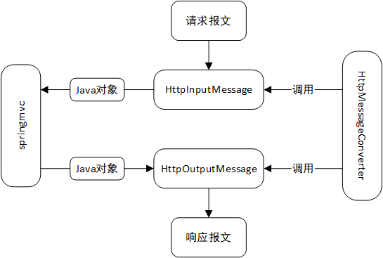

# SpringMVC

参考视频：

- [SpringMVC视频教程](https://www.bilibili.com/video/BV1MW411A7Kn)。
- [SSM联讲](https://www.bilibili.com/video/BV1d4411g7tv?p=120)。

## 概述

SpringMVC是spring的子框架，是spring专为视图层提供的web框架。3.0之后全面超越Struts。

它通过一套注解让POJO（plain old java object）成为处理请求的控制器。

它支持REST风格的URL。

它采用松散耦合的可插拔组件结构

理解spring框架基于注解对web项目的管理。bean的默认加载方式是非延迟加载，以三层架构为例，服务器一启动，三个层的所有类都会跟着加载，并生成单实例bean置于IOC容器中，此后所有bean长期存在，供多线程使用（类级线程不安全，方法级线程安全），直至关闭服务器，随之销毁。


SpringMVC相当于Servlet的升级版。

## 实例

导包：Core的4+1个；AOP的；Web的两个-Web与Servlet。

在类路径（源码包）下创建springmvc配置文件springmvc.xml。附带讲springmvc本就是spring的一部分，其配置与IOC容器配置是可以混在同一个xml文件里的，而实际应用中为了易读、避免单文件过大，就把它们分成两个的。IOC容器随tomcat启动而启动。

```xml
<?xml version="1.0" encoding="UTF-8"?>
<beans xmlns="http://www.springframework.org/schema/beans"
	xmlns:xsi="http://www.w3.org/2001/XMLSchema-instance"
	xmlns:aop="http://www.springframework.org/schema/aop"
	xmlns:context="http://www.springframework.org/schema/context"
	xsi:schemaLocation="http://www.springframework.org/schema/beans http://www.springframework.org/schema/beans/spring-beans.xsd
		http://www.springframework.org/schema/aop http://www.springframework.org/schema/aop/spring-aop-4.0.xsd
		http://www.springframework.org/schema/context http://www.springframework.org/schema/context/spring-context-4.0.xsd">
    <!-- 看看，一开始非常简单，没什么配置 -->
	<context:component-scan base-package="controller"></context:component-scan>
</beans>
```

在web.xml中配置springmvc提供的前端控制器-DispatcherServlet：

```xml
<!-- The front controller of this Spring Web application, responsible for handling all application requests -->
<servlet>
    <servlet-name>springDispatcherServlet</servlet-name>
    <servlet-class>org.springframework.web.servlet.DispatcherServlet</servlet-class>
    <!-- springmvc配置文件位置，可以不指定，默认去WEB-INF下找叫xxx-servlet.xml的文件，xxx就是servlet-name值-->
    <init-param>
        <param-name>contextConfigLocation</param-name>
        <param-value>classpath:springmvc.xml</param-value>
    </init-param>
    <!-- 随tomcat启动而创建对象 -->
    <load-on-startup>1</load-on-startup>
</servlet>
<!-- Map all requests to the DispatcherServlet for handling -->
<servlet-mapping>
    <servlet-name>springDispatcherServlet</servlet-name>
    <!-- /*会匹配一切请求，而/只匹配静态资源与servlet（控制器方法），不匹配jsp  -->
    <url-pattern>/</url-pattern>
</servlet-mapping>
```

POJO变成控制器：

```java
@Controller
public class MyController {
    // 起始斜杠可省略，springmvc摒弃了相对路径，你不带也是起始于项目根路径，不过最好带上，好看
	@RequestMapping("/private")
	public String toPrivate() {
        // 转发到WEB-INF下的jsp
		return "/WEB-INF/pages/private.jsp";
	}
    
	@RequestMapping("/continue")
	public String toNext() {
        // 转发到下一个处理方法
		return "/next";
	}

	@RequestMapping("/next")
	public String next() {
		return "/success.jsp";
	}
}
```

tomcat收到请求，对应项目的前端控制器根据路径名找到匹配的@RequestMapping值，调用对应方法处理，最后根据返回字符串转发到对应资源。

## url-pattern

我们记得tomcat全局web.xml中定义了JspServlet，处理jsp请求（包括转发），其中又定义了DefaultServlet，其url-pattern值为`/`，即处理静态资源请求。它们起作用的前提是其他servlet没干涉，如果前端控制器的url-pattern值是`/`，那么会取代DefaultServlet；如果值是`*.jsp`，那么会取代JspServlet；如果值是`/*`，那么会取代DefaultServlet与JspServlet。

分工明确，在实际开发中应当只用`/`只作处理方法的路径模板，并且通过配置将静态资源请求仍交由DefaultServlet处理，禁止干涉上述两个servlet，因为自定义的servlet（处理方法）无法有效处理jsp资源、静态资源的请求或转发，必须依靠这两个servlet，原因将在[注解驱动](#注解驱动)一章谈到。

## RequestMapping

两个方法的注解值不能一样，否则产生二义性，报错。

该注解既可写在方法级，也可写在类级，匹配拼接得到的URL。例如：

```java
@Controller
@requestMapping("/father")
public class Father{
    // 此方法处理URL为/father/son/success的请求
	@RequestMapping("/son/success")
	public String son() {
		return "/success.jsp";
	}
}
```

它的诸多属性定义了灵活的映射条件。举一些例子来理解：

```java
@requestMapping(value="login")
// 请求方法的要求 如这里仅映射POST方法
@requestMapping(value="login", method=requestMethod.POST)
// 请求参数的要求，如须携带、不准携带、值的要求
// 附带讲像xxx?name=&age=22，name值是空串；像xxx?name=bob，age值是null；像weight值是null也满足下面的weight!=55
@requestMapping(value="login", params={"name", "age=22", "weight!=55", "!height"}) // 且的关系
// 请求头的要求 如这里仅映射谷歌浏览器
@requestMapping(value="login", headers={"User-Agent=Mozilla/5.0 (Windows NT 10.0; Win64; x64) AppleWebKit/537.36 (KHTML, like Gecko) Chrome/101.0.4951.67 Safari/537.36"})
// 请求头、响应头中Content-Type，这俩看以后有没有机会用到
@requestMapping(value="login", consumes={"application/json")
@requestMapping(value="login", produces={"application/json", "charset=UTF-8"})
```

value值支持Ant风格的路径模板，就是模糊匹配，具体指三个通配符：

- `?`：匹配单个字符。注意匹配不了特殊字符如`/`、`?`。
- `*`：匹配任意个字符。
- `**`：匹配任意级路径。如`/user/**/login`、`/**`。

使用通配符不会产生二义性，越精确的优先级越高。例如：

```java
// 访问/handle1时不会冲突，优先找非模糊的handle1方法
@RequestMapping("handle1")
public String handle1() {
    // ...
}

// 如访问/handle2就找此方法
@RequestMapping("handle?")
public String handleN() {
    // ...
}
```

## 方法参数

### RequestParam

此注解一个作用是给请求参数与方法参数做映射，默认不打注解就行，让方法参数与请求参数同名，打了的话就要求注解值同请求参数名，那么方法参数名就自由了，匹配不上就给方法参数赋null。

```java
@RequestMapping("/getParam")
public String getParam(@RequestParam("user") String username) {
    System.out.println(username);
    return "/success.jsp";
}
```

它还有别的属性：

```java
@ReqeustParam(value = "user", required = true, defaultValue = "pig")
```

上例尽管要求此请求参数必备，但只要有了默认值，那相当于不必备了，而如果不指定默认值，就必须带了，否则报错。当我们的URL形如`/getParam?user`、`/getParam?user=`，都意味着参数值是空串，只有user不出现才给方法参数赋默认值。

当required值为false，不设默认值，不带时赋null，设了默认值就赋默认值。

### RequestHeader

此注解作用给请求头的某一项与方法参数做映射。

```java
@RequestMapping("/getHeader")
public String getHeader(@RequestHeader("Accept") String accept) {
    System.out.println(accept);
    return "/success.jsp";
}
```

其他属性同上一节。

### CookieValue

此注解作用是获取Cookie相关信息。

```java
@RequestMapping("/getCookie")
public String getCookie(@CookieValue("JSESSIONID") String sessionId) {
    // sessionId就是Name值为JSESSIONID的cookie对象的Value值
    System.out.println(sessionId);
    return "/success.jsp";
}
```

其他属性同上一节。

### PathVariable

此注解作用是等价于请求参数的路径变量。

```java
// 比如发送的URL是/welcome/Thomas
@requestMapping("welcome/{name}") // 占位符
public String handlePlaceholder(@PathVariable("name") String name){ 
    // 动态获取尾项，这里即Thomas
    System.out.println(name);
    return "/success.jsp";
}
```

填入占位符的值不能带`/`，也就是说只能动态获取到最后一项而不是多项，但确实能做到动态获取多项，通过多个占位符。

```java
@requestMapping("welcome/{name}/{age}")
public String handlePlaceholder(@PathVariable("name") String name, @PathVariable("age") int age){
    // ...
}
```

可惜它不像RequestParam，没有require属性，找不到路径变量就报错。

### POJO封装

springMVC的一个强大之处在于可将请求参数封装为实体类对象，要求对象各setter里的属性名与表单域的name值一一对应。

```jsp
<form action="encapsulateParam">
	学生编号：<input type="text" name="no"><br>
	学生姓名：<input type="text" name="name"><br>
	教师编号：<input type="text" name="teacher.no"><br>
	教师姓名：<input type="text" name="teacher.name"><br>
	<button type="submit">提交</button>
</form>
```

```java
@RequestMapping(value = "/encapsulateParam")
public String encapsulateParam(Student student) {
    // 基于反射调用无参构造器与setter，创建对象并对诸属性一一赋值
    System.out.println(student);
    return "/param.jsp";
}
```

若setter名中间里的属性名找不到匹配的请求参数名，则保持旧值。

### 原生API

```java
@RequestMapping("/useNative")
public String useNative(HttpServletRequest request, HttpSession session) {
    request.setAttribute("requestParam", "cat");
    session.setAttribute("sessionParam", "dog");
    return "/success.jsp";
}
```

如上所示，一些原生API可充当方法的参数，执行方法时，这些对象已经自动获取，可直接拿来用。

来梳理一下都有哪些API能自动获取并作参数：

```java
ServletRequest对象-请求对象
ServletResponse对象-响应对象
HttpSession对象 即请求对象.getSession()的返回值
java.security.Principal对象 这是与HTTPS有关的
Locale 跟国际化有关的区域信息
InputStream子类象 即请求对象.getInputStream()的返回值
OutputStream子类对象 即响应对象.getOutputStream()的返回值
Reader子类对象 即请求对象.getReader()的返回值
Writer子类对象 即响应对象.getWriter()的返回值
```

## REST

### 概述

REST是一种软件编程风格，简单来讲就是指四种请求方法：增加资源-POST、删除资源-DELETE、更改资源-PUT、获取资源-GET，详细解读请参考[什么是REST](http://restful.p2hp.com/)。

REST提倡项目URL架构的基本单元，像：

```
简洁统一的增删改查（CRUD）URL，形如/资源名/资源标识符/参数
/book/1 GET 获取1号图书
/book/1 PUT 更改1号图书 
/book/1 DELETE 删除1号图书
/book POST 添加图书

/books GET 获取所有图书
```

### 实现

目前HTML默认只支持get和post请求，springmvc提供的过滤器HiddenHttpMehtodFilter可通过加工post请求以支持另外两种请求。

修改web.xml以开启对Rest的支持：

```xml
<!-- POST请求加工过滤器 -->
<filter>
	<filter-name>HiddenHttpMethodFilter</filter-name>
	<filter-class>org.springframework.web.filter.HiddenHttpMethodFilter</filter-class>
</filter>
<filter-mapping>
	<filter-name>HiddenHttpMethodFilter</filter-name>
	<url-pattern>/*</url-pattern>
</filter-mapping>
```

我们点开源码看doFilter方法干了什么。过滤器定义了一个methodParam属性，默认值是`_method`，对应一个同名请求参数，doFilter方法体内获取此参数值并判断是不是POST，不是就新创建一个请求对象，指定请求方法（PUT或DELETE），针对新对象做后续处理。即通过偷换请求对象偷换请求方法。

如果通过表单提交，输入框必须形如：

```jsp
<!-- 隐藏的控件 -->
<input type="hidden" name="_method" value="PUT或DELETE"/>
```

下面配合PathVariable注解，看个增删改查齐全的例子：

```jsp
<form action="book" method="post">
	<button type="submit">增加图书</button>
</form>
<form action="book/1" method="post"> 
 	<input type="hidden" name="_method" value="DELETE">
	<button type="submit">删除图书</button>
</form>
<form action="book/1" method="post">
	<input type="hidden" name="_method" value="PUT">
	<button type="submit">修改图书</button>
</form>
<form action="book/1" method="get">
	<button type="submit">查询图书</button>
</form>
```

```java
@RequestMapping(value = "/book", method = RequestMethod.POST)
public String addBook() {
    System.out.println("添加图书");
    return "/success.jsp";
}

@RequestMapping(value = "/book/{id}", method = RequestMethod.DELETE)
public String deleteBook(@PathVariable("id") Integer id) {
    System.out.println("删除图书：" + id);
    return "/success.jsp";
}

@RequestMapping(value = "/book/{id}", method = RequestMethod.PUT)
public String updateBook(@PathVariable("id") Integer id) {
    System.out.println("更改图书：" + id);
    return "/success.jsp";
}

@RequestMapping(value = "/book/{id}", method = RequestMethod.GET)
public String getBook(@PathVariable("id") Integer id) {
    System.out.println("获取图书："+id);
    return "/success.jsp";
}
```

我们发现URL是一致的，就靠请求方法区分请求，这起码节省了取名的精力，还方便围绕同一资源进行管理。

对非表单提交方式，思路是一样的，必须带上额外参数。如异步请求（这里以jQuery的ajax方法为例）：

```js
data: {
    _method: 'DELETE'
},

data: $('#editBookForm').serialize() + '&_method=PUT'
```

又如超链接：`<a href="book/1?_method=PUT"></a>`。

参考restful-crud项目，里面涉及springmvc增强表单等额外知识。

## 乱码

乱码得分情况讨论，其他的处理方式照旧，唯一有变化的就是POST请求的乱码处理。

本来应当在早处理的地方如BaseServlet、过滤器设定编码方式，如今没有BaseServlet了，过滤器倒是还可以用，但人家已经帮我们写好了，即CharacterEncodingFilter。

```xml
<!-- springmvc提供了专攻POST请求乱码的过滤器 -->
<filter>
    <filter-name>CharacterEncodingFilter</filter-name>
    <filter-class>org.springframework.web.filter.CharacterEncodingFilter</filter-class>
    <init-param>
        <param-name>encoding</param-name>
        <!-- 大小写不区分 -->
        <param-value>UTF-8</param-value>
    </init-param>
</filter>
<filter-mapping>
    <filter-name>CharacterEncodingFilter</filter-name>
    <url-pattern>/*</url-pattern>
</filter-mapping>
```

这个过滤器一定要在其他所有过滤器之前，因为有的过滤器在执行doFilter方法时拿了参数，拿了参数编码方式就确定了，排在后面的这个过滤器再设编码方式就迟了。

## 模型数据

### 概述

springmvc提供了一些API，使得数据（主要是模型数据）更快捷地添加到域对象中。

### 类或接口

先看Model（接口）、Map（接口）、ModelMap这三个类型的参数：

```java
@RequestMapping("map")
public String useMap(Map<String, Object> map) {
    map.put("data", "齐白石");
    // class org.springframework.validation.support.BindingAwareModelMap
    System.out.println(map.getClass());
    return "/model.jsp";
}

@RequestMapping("model")
public String useModel(Model model) {
    model.addAttribute("data", "齐白石");
    // class org.springframework.validation.support.BindingAwareModelMap
    System.out.println(model.getClass());
    return "/model.jsp";
}

@RequestMapping("modelMap")
public String useModelMap(ModelMap modelMap) {
    modelMap.addAttribute("data", "齐白石");
    // class org.springframework.validation.support.BindingAwareModelMap
    System.out.println(modelMap.getClass());
    return "/model.jsp";
}
```

它们底层将数据保存在request域对象中。由上可见这些参数虽声明类型不同，但所引对象类型一样，BindingAwareModelMap类继承了ModelMap，同时实现了Model，ModelMap又继承了LinkedHashMap，即实现了Map。

再看ModelAndView类，它一并封装了视图（servlet资源或jsp资源）路径与数据，不过它的对象不作参数，作局部变量用。

```java
@RequestMapping("modelAndView")
public ModelAndView useModelAndView() {
    ModelAndView modelAndView = new ModelAndView("/model.jsp");
    modelAndView.addObject("data", "齐白石");
    // class org.springframework.web.servlet.ModelAndView
    System.out.println(modelAndView.getClass());
    return modelAndView;
}
```

它也是将数据保存在请求域对象中。

### 注解

springmvc提供SessionAtrributes注解来向session域对象中保存数据，只能打在类上。

```java
/* 本类中基于Model、Map、ModelMap、ModelAndView绑定的某些数据都会另绑定到session域对象上 */
// 用名称指定 
@SessionAttributes(value = { "data", "msg" })
// 在名称基础上进一步用类型限定
@SessionAttributes(value = "data", types = Student.class)
// 单用类型指定
@SessionAttributes(types = { Student.class })
```

往session中放数据推荐还是用原生写法，这个可能抛出异常。

另有一个注解叫ModelAttribute，学这个费力不讨好，因为主要是配合hibernate使用，当hibernate流行的时候它当然很常用，现在mybatis流行了，它就该归隐了。

问题描述：前面我们见识到了springmvc将请求参数封装成POJO的威力，原理是基于反射调用空参构造器创建对象，属性值就都是默认值，然后调用setter传入请求参数给它们赋值，这就可能带来问题了，有的请求参数可能是null，对应属性值就会为null，而后若全属性去更新数据库里的对应记录的话，就不对了，字段值碰到null应当保持原状。

mybatis提供的动态SQL能很好地对null进行处理，但在以前，只能想别的法子，一个办法是先从数据库查出对应记录封装成对象，然后用请求参数更新对象属性，且遇到null就不更新，最后用更新后的对象再去更新数据库。

```java
@RequestMapping("modelAttribute")
public String useModelAttribute(@ModelAttribute("student") Student student) {
    // 自动用请求参数更新属性，并帮我们检查新属性值是否为null，是则保持旧值
    System.out.println("preprocess方法查询得到的student再经过请求参数更新：" + student);
    // 更新数据库工作...
    return "/model.jsp";
}

@ModelAttribute
public void preprocess(Model model) {
    // 假定这就是查到的对象
    Student student = new Student(2, "miyuki", new Teacher(13, "nature"));
    model.addAttribute("student", student);
}
```

我们扩充了一些逻辑，观察打印结果：

```java
@RequestMapping("modelAttribute")
public String useModelAttribute(@ModelAttribute("student") Student student, ModelMap modelMap, Model model, Map<String, Object> map) { // @ModelAttribute的value属性的默认值是参数类型首字母小写
    // 全是true
    System.out.println((model == modelMap) + "," + (model == map));
    // 全是true 可惜model参数取不到这个数据
	System.out.println((modelMap.get("student") == student) + "," + (map.get("student") == student));
    System.out.println("preprocess方法查询得到的student再经过请求参数更新：" + student);
    return "/model.jsp";
}
```

可见@RequestMapping所修饰方法的Model、Map、ModelMap类型的参数全部引用同一个对象，对象直属类型就是上一节发现的BindingAwareModelMap，它还有个专有名称叫隐含模型。它保存的数据将由目标方法的Student参数引用。

## 源码解读

分析前端控制器（译自controller，又名处理器，译自handler）到底是什么样的结构，是如何处理请求的。

DispatcherServlet继承FrameworkServlet，后者继承HttpServletBean，后者继承HttpServlet。请求一过来，tocmat调用HttpServlet覆盖的service方法，体内调用HttpServlet重载的service方法。体内调用dotGet或doPost方法，这俩被FrameworkServlet覆盖了。体内调用processRequest方法。体内调用doService方法，它被DispatcherServlet覆盖了。体内调用doDispatch方法。

doDispatch就是处理请求的大头，梳理方法体的逻辑：调用checkMultipart方法处理文件上传，得到请求对象；调用getHandler方法传入请求对象找到对应的处理器对象；调用getHandlerAdapter方法获取此处理器相配的适配器对象；适配器对象调用handle方法返回ModelAndView对象，handle底层调用此控制器的目标方法；将得到的ModelAndView对象传入processDispatchResult方法，跳转到目标资源或报错页面。

具体看getHandler方法的执行，如何找到目标处理器：它返回的是目标处理器的执行链（HandlerExecutionChain对象），传入的请求对象就是原生的，值得关注的就是请求地址了，看方法体，遍历HandlerMapping列表类型的handlerMappings属性，着重看DefaultAnnotationHandlerMapping类型的元素，它下面又有一个LinkedHashMap类型的属性叫handlerMap，即一组路径模板与处理器键值对（这也印证了处理器方法头上路径模板不可重复），接着用此元素调用getHandler方法来匹配路径模板与请求路径后将找出的处理器对象作执行链的handler属性然后返回执行链，最后这个执行链作getHandler的返回值。

具体看getHandlerAdapter方法的执行，如何到找目标适配器：返回的是AnnotationMethodHandlerAdapter对象，传入的是目标处理器对象，方法体内，遍历HandlerAdapter列表类型的handlerAdapters属性，着重看AnnotationMethodHandlerAdapter类型的元素，用此元素调用supports方法传入目标处理器对象，用于判断它是否有@RequestMapping修饰的方法，有则返回此元素。

附带谈一下springmvc的九大组件，即前端控制器的九个属性，它们在源码的一些关键地方发挥着重要作用。

| 名称:类型                                                 | 作用                   |
| --------------------------------------------------------- | ---------------------- |
| multipartResolver:MultipartResolver                       | 文件上传解析器         |
| localeResolver:LocaleResolver                             | 区域信息解析器         |
| themeResolver:ThemeResolver                               | 主题解析器             |
| handlerMappings:List\<HandlerMapping>                     | 处理器映射             |
| handlerAdapters:List\<HandlerAdapter>                     | 处理器的适配器         |
| handlerExceptionResolvers:List\<HandlerExceptionResolver> | 处理器的异常解析器     |
| viewNameTranslator:RequestToViewNameTranslator            | 请求地址视图路径翻译器 |
| flashMapManager:FlashMapManager                           | 重定向携带数据         |
| viewResolvers:List\<ViewResolver>                         | 视图解析器             |

九大组件的类型全是接口，方便框架的扩展更新。

tomcat一启动会实例化前端控制器，并调用它的onRefresh方法，体内调用initStrategies方法。体内执行九个方法以初始化九大组件，以initHandlerMappings方法为例，大意是若自己在配置文件中配置了此组件对应的bean标签，则据此初始化，否则采用默认策略初始化，一般采用默认策略。其他方法同理，不过有的组件是按id值找的，有的是按类型找的。

具体看handle方法的执行，如何找到目标方法并执行。适配器相当于一个反射工具，给此方法传入的有请求对象、响应对象、目标处理器对象，看方法体，先对sessionAttribute注解进行处理，然后调用invokeHandlerMethod方法，传入请求对象、响应对象、目标处理器对象。在这个方法体内，获取处理器对象的方法解析器对象，方法解析器对象再根据请求地址找出Method类型的目标方法对象，接着根据方法解析器对象创建方法调用器对象，接着将请求对象、响应对象封装进一个ServletWebRequest对象，然后实例化BindingAwareModelMap得到隐含模型，然后用方法调用器对象调用invokeHandlerMethod方法，传入目标方法对象、目标处理器对象、ServletWebRequest对象、隐含模型。在这个方法体内，注意到遍历了所有ModelAttribute注解修饰的方法，循环体内先调用findBridgedMethod方法获取当前遍历到的前置通知对象，接着调用resolveHandlerArguments方法解析前置通知的参数，传入前置通知对象、目标处理器对象、ServletWebRequest对象、隐含模型，注意到此方法体内将隐含模型赋给Model、ModelMap、Map类型的参数，接着用前置通知对象调用invoke方法以执行前置通知，循环结束再次调用resolveHandlerArguments方法解析目标方法的参数，传入目标方法对象、目标处理器对象、ServletWebRequest对象、隐含模型，最后用目标方法对象调用invoke方法传入目标处理器对象与解析得到的参数以执行目标方法，返回的执行结果作invokeHandlerMethod方法的返回值。回到上一级invokeHandlerMethod方法，最后返回ModelAndView对象，它封装了数据和视图路径。再回到上一级，这个ModelAndView对象继续作handle的返回值。

另外关注resolveHandlerArguments调用的resolveModelAttribute方法，里面分情况处理自定义类型参数，是POJO封装的原理：

1. 此参数打了ModelAttribute注解，那么去隐含模型中找键与注解值吻合的数据，找到了则取此数据赋值。没打注解，那么去隐含模型中找键与首字母小写的参数类型吻合的数据，找到了则取此数据赋值。反正先要去隐含模型中找数据。
2. 隐含模型中找不到匹配数据就来到这一步。当处理器打了sessionAttributes注解，若此注解绑定了匹配（按名称或类型）的数据，则取此数据赋值，否则抛异常，这不太合理，所以不提倡使用这个注解。
3. 处理器没打sessionAttributes注解就来到这一步。那么基于反射，调用参数类型的空参构造器实例化，再赋值。
3. 从NativeWebRequest实现类（即传进来的ServletWebRequest对象）中逐一获取请求参数，若非null则按名称给参数对象下的相应属性赋值，否则保持原值。

## 视图解析器与视图

### 自动补全前后缀

在配置文件中添加：

```xml
<!-- id可以不给 -->
<bean class="org.springframework.web.servlet.view.InternalResourceViewResolver">
    <property name="prefix" value="/"></property>
    <property name="suffix" value=".jsp"></property>
</bean>
```

这样，处理方法的返回字符串前后部就可以省略，例如`return "success";`。

### 指定跳转方式

可在处理器方法的返回字符串中指定跳转方式是转发还是重定向。例如：

```java
/* 去往jsp */
// 绝对路径起始于项目根路径
return "forward:/pages/index.jsp";
// 回想原生的重定向绝对路径起始于服务器根路径，但这里springmvc帮忙了，自动补上项目名了
return "redirect:/pages/success.jsp";
/* 去往servlet */
return "forward:/toIndex";
return "redirect:/toSuccess";
```

一旦指定了跳转方式，视图解析器的前后缀补全功能就会自动失效。

前面说了springmvc摒弃了RequestMapping注解值的相对路径，写不写起始斜杠都一样，但此处字符串里的起始斜杠写和不写意义就是分开的，不写就是相对路径，JavaWeb里谈过相对路径不保险，此处同理，故应当带上斜杠。

### 原理

#### 概述

基于源码梳理视图解析的流程。

聚焦于上一章第三段的processDispatchResult方法，传入请求对象、响应对象、目标处理器的执行链对象、handle方法返回的ModelAndView对象及一个异常对象，方法体的主要工作就是将数据渲染到视图中，体内调用render方法，传入ModelAndView对象、请求对象、响应对象。方法体内，调用resolveViewName方法根据视图路径得到View对象。进这个方法体，for循环遍历九大组件之一的viewResolvers-全体视图解析器对象，来轮着解析，一旦有一个解析得到View对象了就返回，比如我们在XML中配了类型为InternalResourceViewResolver的视图解析器，故只检索到这一个，用我们配的视图解析器对象调用viewResolver方法，传入区域信息与视图路径。体内调用createView方法，也是传入区域信息与视图路径。此方法体内，依据视图路径的前缀做相应处理，若以`redirect:`起始，则创建RedirectView对象，若以`forward:`起始，则创建InternalResourceView对象，它们均为view接口的实现类，否则调用父类的createView方法创建View对象，底层就做了拼接所配的前后缀的操作。往上每一层都是将这个视图对象返回，直到回到render方法体，之后用此视图对象调用render方法，传入Map对象-ModelAndView对象封装的数据、请求对象、响应对象。体内先执行createMergedOutputModel方法，传入Map对象、请求对象、响应对象，得到Map对象-隐含模型与request域对象合并的数据，后执行InternalResourceView覆盖的renderMergedOutputModel方法，传入合并数据、请求对象、响应对象，此方法做了最终的渲染工作，即将合并数据全部暴露给请求域对象并转发或者重定向到下一个资源，注意此处的渲染还没到将数据填充进页面的阶段，回顾JavaWeb，填充工作反映在对应jsp翻译出的类对象的_jspService方法中。

宏观理解。不管目标方法返回值类型是String、ModelAndView还是别的，底层都是要以ModelAndView对象为核心，因为视图名（视图路径）与数据都由它封装着。而后视图解析器对象才能根据它实例化视图对象，接着视图对象才能渲染-暴露数据并跳转。

#### 概念

视图指的是View接口的实现类，作用是渲染模型数据（上一段末诠释得更准）。视图对象由视图解析器对象实例化。视图对象是无状态的，即使有缓存加速，也不会有线程安全问题。

View接口的实现类有很多，用来应对JSP文档、含JSTL的JSP文档、PDF文档、报表、JSON字符串等各式具体资源。

视图解析器指的是ViewResolver接口的实现类。程序员可配置多种视图解析器，且可能对同一个视图路径，多个视图解析器对象均能得到视图对象，而最终只能得到一个，那么有时我们需要定制视图解析器的解析顺序。

这波实现类也不少，同样每个实现类有各自的适用资源或技术。

### JstlView

承接上一节，我们实践一下，通过配置让InternalResourceViewResolver对象创建JstlView对象，默认创建的是InternalResourceView对象，前者是后者的子类。

```xml
<bean class="org.springframework.web.servlet.view.InternalResourceViewResolver">
    <property name="prefix" value="/"></property>
    <property name="suffix" value=".jsp"></property>
    <property name="viewClass" value="org.springframework.web.servlet.view.JstlView"></property>
</bean>
```

其实只要导了包，第三个property可以不配，底层会自动奔着JstlView类型创建视图对象。

其实默认的视图解析器就是InternalResourceViewResolver，没有前后缀补全需求的话，这个bean都不用配。

### 方法简化

有的处理方法体极为简单，就一个返回视图名语句，这类方法可以收束到配置文件中用一条简易标签表示。给一些实例：

```xml
<beans xmlns:mvc="http://www.springframework.org/schema/mvc"></beans>
```

```xml
<!-- 处理方法的等价表达，path值就是注解值，view-name值就是视图路径-->
<mvc:view-controller path="/success" view-name="/success"/>
<mvc:view-controller path="/index" view-name="forward:/index.jsp"/>
```

单用这个标签还不够，现有的处理方法头上的注解会失效，即处理方法失效，需开启注解驱动：

```xml
<mvc:annotation-driven></mvc:annotation-driven>
```

注：springmvc许多功能均依赖此标签，此标签只能出现一次。

### 自定义

尝试自定义视图与视图解析器，熟悉它们的工作原理。View与ViewResolver存在的一个意义就是方便我们扩展。

步骤如下：

1. 自定义识图与视图解析器。
2. 配置视图解析器，使其对象由spring生成并置于IOC容器中。
3. 发送请求，解析渲染。

要明白默认的视图解析器InternalResourceViewResolver理论上可处理任何视图路径，因为前面见识到了createView方法，它不管何种前缀，继续拼个前后缀就完了，同样能生成一个视图对象，只是访问结果一定是404。故我们有必要定制解析顺序，通过实现Order接口，让我们的视图解析器对象先一步解析。

```java
public class MiyukiView implements View {
	@Override
	public String getContentType() {
		// 响应体的内容类型，这可不是设置，设置在render里面
		return "text/html;charset=utf-8";
	}

	@Override
	public void render(Map<String, ?> model, HttpServletRequest request, HttpServletResponse response)
			throws Exception {
		System.out.println("模型数据：" + model);
		response.setContentType("text/html;charset=utf-8");
		response.getWriter().write("<h2>Nakajima Miyuki 夜会</h2>");
	}
}

public class MiyukiViewResolver implements ViewResolver, Ordered {
	private Integer order;

	@Override
	public View resolveViewName(String viewName, Locale locale) throws Exception {
		if (viewName.startsWith("miyuki:")) {
			// 此处实例化自定义的视图对象，那么容器中可不必配置视图，但试图解析器要配
			return new MiyukiView();
		} else {
			// 回想for循环遍历全体视图解析器对象，对当前视图路径有的解析不了就是返回null
			return null;
		}
	}

	@Override
	public int getOrder() {
		return this.order;
	}

	public void setOrder(Integer order) {
		this.order = order;
	}
}
```

```xml
<!-- 自定义的视图解析器 -->
<bean class="view.MiyukiViewResolver">
    <!-- 数值越小，优先级越高 -->
    <property name="order" value="1"></property>
</bean>
```

```java
@RequestMapping("/miyuki")
public String AtMiyuki(ModelMap modelMap) {
    modelMap.addAttribute("figure", "megami");
    return "miyuki:/handle";
}
```

### 处理静态资源

静态资源包括html、css、js、图片、视频、音频等。

添加两个标签，将静态资源请求交付tomcat用DefaultServlet处理，同时保证前端控制器继续生效。

```xml
<mvc:annotation-driven></mvc:annotation-driven>
<mvc:default-servlet-handler></mvc:default-servlet-handler>
```

## 数据绑定

### 概述

回顾旧源码，在resolveHandlerArguments方法体内，针对自定义类型的参数即POJO或JavaBean，关注doBind方法，它具体地做了请求参数与POJO的绑定工作。

我们知道浏览器传来的所有参数都是字符串，那么牵涉到如下操作：

- 数据类型转换-解析与格式化。
- 数据校验。

这些工作均由doBind方法的调用者-WebDataBinder对象完成，具体关注此对象从父类DataBinder继承得到的三个属性-ConversionService类型的conversionService、AbstractPropertyBindingResult类型的bindingResult、List\<Validator>类型的validators。

基于源码（ModelAttributeMethodProcessor类的resolveArgument方法）梳理数据绑定流程：

1. 调用WebDataBinderFactory对象的createBinder方法，传入请求对象与目标方法的自定义类型参数（POJO），生成WebDataBinder对象。
2. WebDataBinder对象调用bindRequestParameters方法，将请求参数赋给POJO的属性，期间使用IOC容器中的ConversionService组件实例（它的属性）进行数据的解析与格式化。
3. WebDataBinder对象调用validateIfApplicable方法即使用IOC容器中的Validator组件实例（它的属性），对已经绑定了请求参数的POJO进行数据合法性校验。
4. 将BindingResult组件实例（它的属性）保存的POJO与校验错误信息转存到隐含模型（ModelAndViewContainer对象）中，后续隐含模型里的这两个东西会赋给处理方法的参数。

### 类型转换

#### 转换器

spring自带许多类型转换器，譬如StringToBooleanConverter、StringToNumberConverterFactory等。

可自定义类型转换器。步骤：

1. 编写类型转换器，须实现spring定义的三种接口之一，一般实现Converter接口。

   ```java
   /**
    * 自定义类型转换器，第一个泛型指源类型，第二个泛型指目标类型
    * 
    * @author Van
    */
   public class StringToStudentConverter implements Converter<String, Student> {
   	/**
   	 * 自定义转换规则
   	 */
   	@Override
   	public Student convert(String source) {
   		// 将满足一定格式的字符串转成对象
   		String[] strs = source.split("-");
   		Student student = new Student();
   		student.setNo(Integer.parseInt(strs[0]));
   		student.setName(strs[1]);
   		Teacher teacher = new Teacher();
   		teacher.setNo(Integer.parseInt(strs[2]));
   		teacher.setName(strs[3]);
   		student.setTeacher(teacher);
   		return student;
   	}
   }
   ```
   
2. 借助ConversionServiceFactoryBean组件，让自定义类型转换器实例存入WebDataBinder对象的conversionService属性。tomcat（IOC容器）启动时，会将转换器实例存入此组件的Set<?>类型的属性converters中，后将converters保存的转换器实例（包括内置的）注册进另一个GenericConversionService类型的属性conversionService（里面有个Converter类型的列表converters），再调getObject方法将此属性赋给WebDataBinder对象的ConversionService属性。

   ```xml
   <!-- 将自定义类型转换器注册进IOC容器 -->
   <bean id="stringToStudentConverter" class="component.StringToStudentConverter"></bean>
   <!-- 借助类型转换器工厂，将自定义类型转换器实例转存入WebDataBinder对象的ConversionService实例域 -->
   <bean id="conversionServiceFactoryBean" class="org.springframework.context.support.ConversionServiceFactoryBean">
       <property name="converters">
           <set>
               <ref bean="stringToStudentConverter" />
           </set>
       </property>
   </bean>
   ```

3. 在注解驱动中注册类型转换器工厂：

   ```xml
   <mvc:annotation-driven conversion-service="conversionServiceFactoryBean"></mvc:annotation-driven>
   ```

若不注册类型转换器工厂，WebDataBinder对象的conversionService属性引用的是默认的类型转换器工厂对象即DefaultFormattingConversionService对象。

#### 格式化注解

除了类型转换器，springMVC还为提供了一系列也可做类型转换的格式化注解。注解值表示指定的格式，打在实体类的属性头上，就意味着将来所赋的值会照此格式解析，故方便定制解析（格式不对就报错）。

数据格式化注解有：

- @DateTimeFormat。
- @NumberFormat。

这些注解想生效就必须依附于ConversionService特定实现类的对象，如默认的DefaultFormattingConversionService对象，而若像上一节那样使用自定义的类型转换器，最终WebDataBinder对象的conversionService属性下面的converters列表是不含这些注解的。假若既想使用自定义的类型转换器，又想让注解生效，就得换一个转换器工厂。

实现步骤：

1. 将类型转换器工厂FormattingConversionServiceFactoryBean纳入IOC容器并在注解驱动标签中注册：

   ```xml
   <bean id="formattingConversionServiceFactoryBean" class="org.springframework.format.support.FormattingConversionServiceFactoryBean">
       <property name="converters">
           <set>
               <bean class="component.StringToStudentConverter"></bean>
           </set>
       </property>
   </bean>
   <mvc:annotation-driven conversion-service="formattingConversionServiceFactoryBean"></mvc:annotation-driven>
   ```

2. 添加注解：

   ```java
   @DateTimeFormat(pattern = "yyyy-MM-dd")
   private Date birthday;
   ```

### 校验

安全起见，不仅需要前端校验，也需要后端校验。任何浏览器都能关闭JS。

我们引入JSR303（Java Specification Requests 303-Java规范提案第303条），它为JavaBean的数据合法性校验指定了规范，具体是一系列标准注解。与JDBC类似，既然是规范，就需要有第三方来实现，时下通行的是Hibernate Validator，它除支持标准注解，还扩展出了一些注解。

使用步骤：

1. 导包。tomcat版本在7.0及以上，导下列包：

   ```
   hibernate-validator
   hibernate-validator-annotation-processor
   classmate
   jboss-logging
   validation-api
   ```

2. 开启注解驱动：

   ```xml
   <mvc:annotation-driven></mvc:annotation-driven>
   ```

3. 在处理方法的被校验参数前打上@Valid，并在对应实体类的实例域头上打注解。

   ```java
   /**
    * POJO参数与BindingResult参数间不得有其他参数
    * 
    * @param employee POJO
    * @param result   绑定结果，包括POJO与错误信息
    * @return
    */
   @RequestMapping("/validateEmployee")
   public String validateEmployee(@Valid Employee employee, BindingResult result, Model model) {
       // 待封装的错误信息
       Map<String, Object> fieldErrors = new HashMap<>();
       if (result.hasErrors()) {
           // 校验有误，错误信息封装在一个FieldError类型的列表中
           for (FieldError fieldError : result.getFieldErrors()) {
               // 封装：域作键，对应的错误信息作值，以便在jsp中取出来
               fieldErrors.put(fieldError.getField(), fieldError.getDefaultMessage());
           }
           System.out.println(fieldErrors);
           System.out.println(employee);
           model.addAttribute("fieldErrors", fieldErrors);
           return "validate";
       } else {
           // 校验无误
           System.out.println(employee);
           return "redirect:/success.jsp";
       }
   }
   ```

   ```java
   @NotEmpty // 不能为null及空串
   @Length(min = 6, max = 18)
   // message属性不指定的话会有默认的值
   @Pattern(regexp = "^[a-zA-Z0-9_\\u4e00-\\u9fa5-]+$", message = "员工名中不能出现除_-之外的特殊字符")
   private String lastName;
   @Email
   private String email;
   @Past // 须是过去的时间
   private Date birth;
   ```

关于错误消息的国际化，暂且不记。

## 注解驱动

本章详细说说注解驱动`<mvc:annotation-driven></mvc:annotation-driven>`是如何身兼多职的。

它有以下功能：

- 自动注册RequestMappingHandlerMapping、RequestMappingHandlerAdapter、ExceptionHandlerExceptionResolver三大组件。
- 支持ConversionService组件进行类型转换。
- 支持NumberFormat、DateTimeFormat注解完成数据的格式化。
- 支持Valid注解对POJO进行JSR303校验。
- 支持RequestBody、ResponseBody注解。

容器配置文件中的各个bean标签对应BeanDefinitionParser接口的各个实现类，那么注解驱动标签便是由AnnotationDrivenBeanDefinitionParser类支配。

理解为何处理器方法无法成功处理jsp资源、静态资源的请求或转发。当我们将其@RequestMapping值写成`/*`，它会取代JspServlet处理jsp请求或转发，那么势必返回一个以jsp结尾的字符串，或是本方法体内返回或是链式调用多个处理方法返回，若没有匹配此字符串的@RequestMapping值，则报错，本质原因就是前面源码解读中提到的handlerMappings列表下DefaultAnnotationHandlerMapping类型的元素的handlerMap属性不含对应键值对，若有，对应方法提也写不出获取并返回jsp资源的逻辑，可能造成死循环。对静态资源同理。

回想什么都没配的时候，不能成功访问静态资源，原因如上。而一旦加了`<mvc:default-servlet-handler></mvc:default-servlet-handler>`，就让DefaultServlet接管了，本质上体现于handlerMappings列表下DefaultAnnotationHandlerMapping类型的元素没了，而多了个SimpleUrlHandlerMapping类型的元素，其handlerMap属性仅含一个键值对，描述为`/**=org.springframework.web.servlet.resource.DefaultServlet`，意即所有请求转发均交给DefaultServlet处理，对动态资源当然就无效了。附带地handlerAdapters列表也有变化，不细说了。

接着我们再加`<mvc:annotation-driven></mvc:annotation-driven>`观察变化。还是看handlerMappings列表，发现多了个针对动态资源的RequestMappingHandlerMapping类型的元素，且排在SimpleUrlHandlerMapping类型的元素之前，关注其下LinkedHashMap类型的handlerMethods属性，即一组路径模板与方法详细处理规则的键值对。

对于适配器，之前的AnnotationMethodHandlerAdapter演变成了RequestMappingHandlerAdapter，后者实例调用handle方法，具体逻辑大不一样了，但基本思路不变。一大改进是将方法参数解析的逻辑封装成一个个解析器，它们均实现HandlerMethodArgumentResolver接口。

## 异步请求

### 概述

控制器方法处理请求，但返回不再是视图名，而是JSON格式的字符串。步骤：

1. 导包：

   ```
   jackson-annotations
   jackson-core
   jackson-databin
   ```

2. 使用

   ```java
   /**
    * 有了jackson系列jar包，能便捷地将任何类型的数据转换为JSON格式字符串
    * 
    * @return
    */
   @RequestMapping("/getAjaxStudents")
   @ResponseBody
   public List<Student> testAjaxJson() {
       Student stu1 = new Student(1, "元帝", new Teacher(13, "脱脱"));
       Student stu2 = new Student(2, "光绪", new Teacher(12, "翁同龢"));
       Student stu3 = new Student(3, "太宗", new Teacher(11, "虞世南"));
       List<Student> students = new ArrayList<>();
       students.add(stu1);
       students.add(stu2);
       students.add(stu3);
       return students;
   }
   ```

ResponseBody注解使得方法返回的是就是普通对象，后续不会让视图解析器、视图对象及其他处理方法来干预，既适合异步请求也适合同步请求，不过一般针对异步请求。配合以上述三个jar包，字符串以外的任何对象都自动转为JSON格式字符串。

jackson-annotation包下可见许多注解，如：

- @JsonIgnore：打给域，表转JSON时其值设为类型默认值。
- @JsonFormat：打给域，表转JSON时对其值按某模板进行格式化。

### RequestBody

RequestBody注解用于获取请求体。

```java
/**
 * @param requestBody 以字符串形式呈现的请求体
 * @return
 */
@RequestMapping("/useRequestBody")
public String useRequestBody(@RequestBody String requestBody) {
    System.out.println(requestBody);
    return "success";
}
```

回顾请求体内容类型（ABC）的知识，用以下不同的表单来验证。

```html
<form action="useRequestBody" method="post">
	username: <input type="text" name="username"><br>
	age: <input type="text" name="age"><br>
	file: <input type="file" name="file"><br>
	<input type="submit" value="submit">
</form>
<!-- 打空串，get请求没有请求体 -->
```

```html
<form action="useRequestBody" method="post">
	username: <input type="text" name="username"><br>
	age: <input type="text" name="age"><br>
	file: <input type="file" name="file"><br>
	<input type="submit" value="submit">
</form>
<!-- 打印username=van&age=18，图像等文件的流默认的A是拿不到的，A的格式是查询字符串 -->
```

```html
<form action="useRequestBody" method="post" enctype="multipart/form-data">
	username: <input type="text" name="username"><br>
	age: <input type="text" name="age"><br>
	file: <input type="file" name="file"><br>
	<input type="submit" value="submit">
</form>
<!-- 打印结果参见JavaWeb笔记，相当于请求对象调用getInputStream方法并将返回对象转成字符串，图像文件的那部分会乱码，文本文件（包括java、py等）的则不会 -->
```

附带讲enctype属性没有C。

可利用此注解接收JSON数据，打印出来形如`{"username":"凡","age":18}`，就不是查询字符串的形式了。

### HttpEntity

处理方法含此类型参数的话，参数对象存储请求报文的完整信息。

```java
/**
 * @param httpEntity 将完整的请求报文以字符串形式呈现出来
 * @return
 */
@RequestMapping("/useHttpEntity")
public String useHttpEntity(HttpEntity<String> httpEntity) {
    System.out.println(httpEntity);
    return "success";
}
```

回想RequestHeader注解只能获取请求头的某一项。

### ResponseEntity

ResponseEntity注解用于定制完整的响应报文。

```java
@RequestMapping("/useResponseEntity")
public ResponseEntity<String> usResponseEntity() {
    String body = "<h2>定制响应报文</h2>";
    // new的时候会设好固有的响应头信息
    MultiValueMap<String, String> headers = new HttpHeaders();
    headers.add("Content-Type", "text/html;charset=utf-8");
    return new ResponseEntity<String>(body, headers, HttpStatus.OK);
}
```

附带讲没导入那三个jar包就可以加ResponseBody注解，加不加等价，但导了包，返回的对象会被转成字符串，就构不成定制了。

## 文件相关

### 下载

springmvc支持的下载比较烂，还没原生的好。

```java
@RequestMapping("/download")
public ResponseEntity<byte[]> download(HttpServletRequest request) throws IOException {
    String fileName = "凡.jpg";
    // 得到目标文件的流
    FileInputStream fis = new FileInputStream(request.getServletContext().getRealPath("/upload/" + fileName));
    // 这里没有借助commons-io，整个把文件流装进字节数组，没搞一段段地装了
    byte[] bytes = new byte[fis.available()];
    // 读入内存
    fis.read(bytes);
    fis.close();
    HttpHeaders headers = new HttpHeaders();
    headers.set("Content-Type", request.getServletContext().getMimeType("/upload/" + fileName));
    headers.set("Content-Disposition", "attachment;filename=" + new String(fileName.getBytes("gbk"), "ISO-8859-1"));
    // 这个数组作请求体
    return new ResponseEntity<>(bytes, headers, HttpStatus.OK);
}
```

眼见得并没有多好用。

### HttpMessageConverter

HttpMessageConverter\<T>是spirng3.0新增的接口，适用于那些特殊的请求体或响应体类型，负责将请求信息转换成一个对象，或将对象输出为响应信息。工作流程涉及另外两个接口HttpInputMessage与HttpOutputMessage，大致工作流程如下：



HttpInputMessage与HttpOutputMessage相当于请求对象调用getInputStream与响应对象调用getOutputStream的结果，关注它们下面的getBody方法。

前面源码解读里提到的RequestMappingHandlerAdapter元素下面有个messageConverters属性，是个列表，元素类型皆为HttpMessageConverter的实现类，一旦导入jackson系列的jar包，就会多出一个MappingJackson2HttpMessageConverter类型的元素，负责对象与JSON字符串的转换。

HttpMessageConverter接口诸实现类的supports方法体指明了它们各自负责转换（与流相互转换）的数据类型，这也体现于它们指定的泛型。

像[RequestBody](#RequestBody)一节示例方法参数的类型可任意，那么会由相应的HttpMessageConverter对象负责转换。

### 上传

springMVC实现文件上传的本质上和servlet的是一样的，但是简化了代码。

实现步骤：

1. 导入那两个文件操作相关的jar包。

2. 配置文件上传解析器，将其纳入IOC容器：

   ```xml
   <!-- 文件上传解析器 -->
   <bean id="multipartResolver" class="org.springframework.web.multipart.commons.CommonsMultipartResolver">
       <!-- 文件编码方式 -->
       <property name="defaultEncoding" value="utf-8"></property>
       <!-- 单个文件空间的上限，单位是字节，这里设的是20MB，-1代表无限制 -->
       <property name="maxUploadSize" value="#{1024 * 1024 * 20}"></property>
   </bean>
   ```

   注：配置九大组件时，观察DispatcherServlet定义的init系列方法体内的getBean方法参数，即看springmvc从IOC容器中获取组件实例是按什么获取，按id值的话就不能配错了。

3. 使用：

   ```java
   /**
    * @param username 普通表单域
    * @param file     文件项
    * @param request
    * @param model
    * @return
    */
   @RequestMapping("/upload")
   public String upload(@RequestParam("username") String username, @RequestParam("avatar") MultipartFile file,
           HttpServletRequest request, Model model) {
       System.out.println(username);
       // 表单域的name值
       System.out.println(file.getName());
       // 文件名
	    System.out.println(file.getOriginalFilename());
       try {
	        // 输入并输出
           file.transferTo(new File(request.getServletContext()
                   .getRealPath("/upload/" + UUID.randomUUID().toString() + "_" + file.getOriginalFilename())));
           model.addAttribute("msg", "upload success");
       } catch (IllegalStateException | IOException e) {
           model.addAttribute("msg", "upload fail: " + e.getMessage());
       }
       return "forward:/success.jsp";
   }
   ```
   
   另有多文件上传，只需简单变换参数类型：
   
   ```java
   @RequestMapping("/multiUpload")
   public String multiUpload(@RequestParam("username") String username, @RequestParam("avatar") MultipartFile[] files, HttpServletRequest request, Model model) {
       try {
           for (MultipartFile file : files) {
               if (!file.isEmpty()) {
                   file.transferTo(new File(request.getServletContext().getRealPath(
                           "/upload/" + UUID.randomUUID().toString() + "_" + file.getOriginalFilename())));
               }
           }
           model.addAttribute("msg", "upload success");
       } catch (IllegalStateException | IOException e) {
           model.addAttribute("msg", "upload fail: " + e.getMessage());
       }
       return "forward:/success.jsp";
   }
   ```

## 拦截器

### 概述

springmvc提供的拦截器是过滤器的升级版，拦截机制使得在目标方法执行之前做一些工作，在目标方法执行之后又做一些工作。拦截器指的是HandleInterceptor接口，其下有三个方法：

- preHandle：在目标方法执行之前调用，返回true表示放行，返回false表示不放行，就此响应。
- postHandle：在目标方法正常执行、返回之后且目标资源获取之前调用。
- afterCompletion：在获取目标资源之后或获取报错页面之后或生成空响应体的响应之后等时刻调用。

实现步骤：

1. 编写拦截器类：

   ```java
   public class MyInterceptor implements HandlerInterceptor {
   	/**
   	 * 目标方法执行之前
   	 */
   	@Override
   	public boolean preHandle(HttpServletRequest request, HttpServletResponse response, Object handler) throws Exception {
   		System.out.println("preHandle");
   		return true;
   	}
   
   	/**
   	 * 目标方法执行并返回之后、目标资源获取之前
   	 */
   	@Override
   	public void postHandle(HttpServletRequest request, HttpServletResponse response, Object handler, ModelAndView modelAndView) throws Exception {
   		System.out.println("postHandle");
   	}
   
   	/**
   	 * 目标资源获取之后
   	 */
   	@Override
   	public void afterCompletion(HttpServletRequest request, HttpServletResponse response, Object handler, Exception ex) throws Exception {
   		System.out.println("afterCompletion");
   	}
   }
   ```
   
2. 将此拦截器纳入IOC容器，有不同写法。

   ```xml
   <!-- 拦截器 -->
   <mvc:interceptors>
       <!-- 默认拦截所有请求或转发 -->
       <bean class="interceptor.MyInterceptor"></bean>
   </mvc:interceptors>
   ```

   ```xml
   <mvc:interceptors>
       <mvc:interceptor>
           <!-- 指定要拦截的路径，表达式基于ant风格 -->
           <mvc:mapping path="/**"/>
           <!-- 排除指定路径 -->
           <mvc:exclude-mapping path="/next"/>
           <bean class="interceptor.MyInterceptor"></bean>
       </mvc:interceptor>
   </mvc:interceptors>
   ```

   ```xml
   <mvc:interceptors>
       <mvc:interceptor>
           <!-- 精确路径 -->
           <mvc:mapping path="/continue"/>
           <bean class="interceptor.MyInterceptor"></bean>
       </mvc:interceptor>
   </mvc:interceptors>
   ```

我们基于如下的链式访问来分析打印结果。

```java
@RequestMapping("/continue")
public String toNext() {
    System.out.println("continue");
    return "forward:/next";
}

@RequestMapping("/next")
public String next() {
    System.out.println("next");
    return "success";
}
```

```
preHandle toNext调用前
continue 
postHandle toNext执行完毕
preHandle next调用前
next 
postHandle next执行完毕
afterCompletion next的目标资源-success页面渲染之后
afterCompletion toNext的目标资源-next转发完成之后
```

多拦截器的配置如下：

```xml
<mvc:interceptors>
    <mvc:interceptor>
        <mvc:mapping path="/**"/>
        <bean class="interceptor.MyInterceptor"></bean>
    </mvc:interceptor>
    <mvc:interceptor>
        <mvc:mapping path="/**"/>
        <bean class="interceptor.AnotherInterceptor"></bean>
    </mvc:interceptor>
</mvc:interceptors>
```

看打印结果：

```
preHandle A
preHandle B
continue
postHandle B
postHandle A
preHandle A
preHandle B
next
postHandle B
postHandle A
afterCompletion B
afterCompletion A
afterCompletion B
afterCompletion A
```

与过滤器链的排布一样，先配置的拦截器（XML中靠上的）离目标方法越远，离浏览器越近。

可将preHandle方法比作前置通知、将postHandle方法比作返回通知、将afterCompletion方法比作后置通知。多拦截器就相当于切面类的嵌套。自行分析多拦截器条件下目标方法抛异常、某拦截器对象preHandle方法不放行的拦截情况，反正若拦截器对象的preHandle执行则其afterCompletion必然执行。

### 源码解读

doDispatch方法体内，首先看gentHandler方法，已知它返回的是个目标处理器执行链对象，之前关注的是其下的handler属性，现在关注interceptorList属性，是个存放内置拦截器与自定义拦截器对象的列表，然后用这个执行链对象调用applyPreHandle方法，底层执行所有拦截器对象的preHandle方法，只要有一个返回false，这个方法就返回false，注意到它外面还套个if语句，为假则直接返回，后续目标方法就不会执行。此方法体内，遍历本执行链对象的interceptors属性，是个存放所有拦截器对象的数组，循环体内，调用每个元素的preHandle方法，判断返回值为真，则记录一下当前索引到interceptorIndex属性中，继续下一轮，为假则调用triggerAfterCompletion方法，然后返回false。triggerAfterCompletion方法体内，也是遍历拦截器对象，但就不是所有了，而是根据interceptorIndex属性遍历那些执行了preHandle方法的拦截器对象，执行它们的afterCompletion方法。回到doDispatch方法体，随后用这个执行链对象调用applyPostHandle方法，但注意到若handle方法（底层执行目标方法）抛异常则不会调用applyPostHandle方法，最后不管抛没抛异常，都会调用processDispatchResult方法进行资源（目标资源或报错页面）的渲染工作，此方法在资源正常渲染条件下也用当前执行链对象调用了triggerAfterCompletion方法。在applyPostHandle方法体内，遍历所有拦截器对象，逆序调用它们的postHandle方法以满足链式排布，从这也能看出所有拦截器对象的postHandle方法要么都执行要么都不执行。再回到doDispatch方法体，如果processDispatchResult方法抛异常，就去catch语句体，底层用当前执行链对象调用triggerAfterCompletion方法。

### 与过滤器对比

拦截器更为强大，因为它注册进了IOC容器，就能利用容器的自动装配等功能。

tomcat与IOC容器虽能一起启动，但毕竟是相互独立的，也就是说JavaWeb三大组件等是不能注册进容器的。所以回想spring整合web项目时，我们的servlet里给属性打@Autowired注解是无意义的，自动装配无效，它受tomcat管控，无法使用IOC的功能。

当然过滤器的普适性更好，拦截器依赖springmvc框架。

## 国际化

JstlView支持jstl并实现国际化操作。实现步骤：

1. 创建资源文件，形如：`基础名_语言_地区.properties`或`基础名_语言.properties`。

   ```properties
   resource.welcome=\u6B22\u8FCE
   resource.hello=\u4F60\u597D
   ```

   ```properties
   resource.welcome=WELCOME
   resource.hello=HELLO
   ```

2. 加载国际化资源文件。

   ```xml
   <!-- id值固定，项目启动、IOC容器启动，自动加载此类并实例化 -->
   <bean id="messageSource" class="org.springframework.context.support.ResourceBundleMessageSource">
   	<property name="basename" value="i18n"></property>
   </bean>
   ```

3. 通过jstl在jsp中实现国际化。

注：可通过给InternalResourceViewResolver类的buildView方法打断点查看所解析出的视图是InternalResourceView还是JstlView。

## 异常处理

### 概述

HandlerExceptionResolver接口隶属九大组件之一，项目运行时默认有以下三个实现类负责处理异常：

- ExceptionHandlerExceptionResolver：调用标有@ExceptionHandler的方法处理指定类型的异常。
- ResponseStatusExceptionResolver：处理标有@ResponseStatus的自定义类型的异常，定制错误页面。
- DefaultHandlerExceptionResolver：对springmvc内置的异常，若我们不处理，则由此类处理。

那么不在上述情况中的异常都会交给tomcat处理。

异常处理流程体现在processDispatchResult方法调用的processHandlerException方法体内，遍历当前处理器对象的handlerExceptionResolvers属性，它含有三个分别对应上述类型的元素，它们调用resolveException处理当前异常，处理不了的就换下一个，都处理不了就继续往上抛给tomcat，有且仅有一个能处理的就处理然后将异常信息封装到ModelAndView对象中。

### ExceptionHandler

某处理器内定义一个方法，打上此注解，以处理本类诸处理方法抛出的某些异常：

```java
/**
 * 处理本处理器内的方法抛出的某种或若干种异常
 * 这类方法没有标RequestMapping注解，故Model参数无法引用隐含模型
 */
@ExceptionHandler({ ArithmeticException.class, NullPointerException.class })
public ModelAndView handleException(Exception exception) {
    ModelAndView mv = new ModelAndView();
    mv.setViewName("error");
    mv.addObject("ex", exception.getMessage());
    return mv;
}
```

所标方法的参数必须属异常类型即Throwable或其子类，不能是其他类型。

若存在多个所标方法处理同类型异常，则精确的优先，且这一个处理完了下一个当然就捕获不到了。

可能多个处理器之间对某些异常处理的逻辑是一样的，那么可以将其抽取到专门的一个类中，降低代码冗余。给这个类打上ControllerAdvice注解使其被纳入IOC容器，得以捕获并处理所有处理器产生的异常。

```java
@ControllerAdvice
public class CommonExceptionHandler {
	@ExceptionHandler(ArithmeticException.class)
	public ModelAndView handleArithmetic(ArithmeticException exception) {
		ModelAndView mv = new ModelAndView();
		System.out.println("logic for arithmetic exception");
		mv.addObject("ex", exception.getMessage());
		mv.setViewName("error");
		return mv;
	}

	@ExceptionHandler(NullPointerException.class)
	public ModelAndView handleNullPointer(NullPointerException exception) {
		ModelAndView mv = new ModelAndView();
		System.out.println("logic for null pointer exception");
		mv.addObject("ex", exception.getMessage());
		mv.setViewName("error");
		return mv;
	}
}
```

若这个类与某处理器下所标方法能处理同一类型异常，则本处理器优先，即使这个类捕获得更精确。

### ResponseStatus

此注解用于创建自己的异常类并自定义异常信息-提示信息与状态码，tomcat处理此异常时基于异常信息构建定制的页面。

来看个实例：

```java
/**
 * 自定义的用户名不存在异常
 * 
 * @author Van
 *
 */
@ResponseStatus(reason = "用户名未找到", value = HttpStatus.NOT_ACCEPTABLE)
public class UsernameNotFoundException extends RuntimeException {
	private static final long serialVersionUID = -2712816095728233256L;
}
```

```java
@RequestMapping("/login")
public String login(@RequestParam("username") String username) {
    if (!"admin".equals(username)) {
        // 抛出自定义异常
        throw new UsernameNotFoundException();
    }
    return "success";
}
```

### DefaultHandlerExceptionResolver

springmvc在常见异常（404、403、500等）的基础上新定制了一些异常，如HttpRequestMethodNotSupportedException。

springmvc自己针对内置异常的处理逻辑体现于DefaultHandlerExceptionResolver类的doResolveException方法，体内罗列着所有内置异常。

### SimpleMappingExceptionResolver

这个类也是HandlerExceptionResolver接口的实现类，它允许通过xml配置来实现异常处理。

```xml
<!-- 异常处理解析器 -->
<bean class="org.springframework.web.servlet.handler.SimpleMappingExceptionResolver">
    <!-- 异常类型与错误页面的映射 -->
    <property name="exceptionMappings">
        <!-- 配置时多多关注当前组件的源码，此属性类型为Properties -->
        <props>
            <prop key="java.lang.ArithmeticException">
                error
            </prop>
            <prop key="java.lang.NullPointerException">
                error
            </prop>
        </props>
    </property>
    <!-- 存入域对象的错误信息的属性名，查看源码可知默认值为exception -->
    <property name="exceptionAttribute" value="ex"></property>
</bean>
```

一旦配置了这个，源码中当前处理器对象的handlerExceptionResolvers属性下就有4个元素了，这个排在最后，所以如果前面的元素能处理掉相同异常，这最后的元素就捕获不到了，对应配置就失效了。

## Spring整合

spring整合springmvc的目的就是分工明确，具体让springmvc配置文件专门做控制层相关的工作，包括视图解析器、文件上传解析器、静态资源处理、注解驱动等，让spring配置文件专门做业务层相关的工作，包括事务控制、数据源等。

要求IOC容器是随tomcat一起启动的，现在有两个文件，得让它们里面的配置全部生效，而web.xml中又只能指定一个文件路径，那么一个思路是在一个文件中借助import标签将另一个文件合并进来。比如：

```xml
<import resource="application.xml"/>
```

更好的做法是让spring与springmvc各持一个IOC容器，让两个容器一起随tomcat启动，在web.xml中配置：

```xml
<!-- 指定spring配置文件，启动spring的IOC容器，回顾spring整合web -->
<context-param>
    <param-name>contextConfigLocation</param-name>
    <param-value>classpath:application.xml</param-value>
</context-param>
<listener>
    <listener-class>org.springframework.web.context.ContextLoaderListener</listener-class>
</listener>
<!-- 指定springmvc的配置文件，启动springmvc的IOC容器 -->
<servlet>
    <servlet-name>springDispatcherServlet</servlet-name>
    <servlet-class>org.springframework.web.servlet.DispatcherServlet</servlet-class>
    <init-param>
        <param-name>contextConfigLocation</param-name>
        <param-value>classpath:springmvc.xml</param-value>
    </init-param>
    <load-on-startup>1</load-on-startup>
</servlet>
<servlet-mapping>
    <servlet-name>springDispatcherServlet</servlet-name>
    <!-- /*会匹配一切请求，而/不匹配jsp  -->
    <url-pattern>/</url-pattern>
</servlet-mapping>
```

启动服务器时关注控制台打印的这些地方：

```
信息: Initializing Spring root WebApplicationContext
信息: Loading XML bean definitions from class path resource [application.xml]
信息: Initializing Spring FrameworkServlet 'springDispatcherServlet'
信息: Loading XML bean definitions from class path resource [springmvc.xml]
```

表明两个容器在同时启动。

一个重要的问题是两个容器的扫描范围。若有重合则某组件在各个容器内部是单例的，具体是DefaultSingletonBeanRegistry对象下singletonObjects属性中只有一个键值对的值类型是该组件，但是在两容器之间却重复了，这是应避免的。

方法就是各扫各的注解及包。给个例子：

```xml
<context:component-scan base-package="com.van">
    <context:exclude-filter type="annotation" expression="org.springframework.stereotype.Controller"/>
    <context:exclude-filter type="annotation" expression="org.springframework.web.bind.annotation.ControllerAdvice"/>
</context:component-scan>
```

```xml
<context:component-scan base-package="com.van" use-default-filters="false">
    <context:include-filter type="annotation" expression="org.springframework.stereotype.Controller"/>
    <context:include-filter type="annotation" expression="org.springframework.web.bind.annotation.ControllerAdvice"/>
</context:component-scan>
```

两者刚好形成全集，不漏不重。

两个容器有如下父子关系，子容器组件可以装配父容器组件，而反过来父容器组件不能装配子容器组件。


