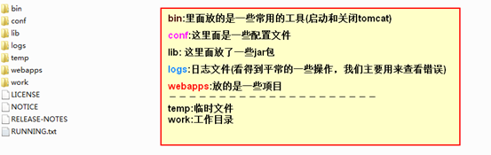

# Tomcat

主讲：张月函。

## 概述

Tomcat是一个免费的开放源代码的Servlet 容器。它是Apache软件基金会的一个顶级项目，由 Apache，Sun和其他一些公司及个人共同开发而成。由于有了Sun的参与与支持，最新的Servlet和 JSP 规范总是能在Tomcat中得到体现。

Tomcat 8 支持最新的 Servlet 3.1 和JSP 2.3 规范。Tomcat用java语言开发。Tomcat是一个符合J2EE（Servlet规范）标准的WEB服务器，但J2EE中的EJB程序无法在其上运行。

如果想在电脑上运行Tomcat，就必须要有java的运行环境，后面的JavaWeb学习都是基于Tomcat服务器的。

版本：以前的版本都是使用xml进行配置，但在Servlet3.0之后，我们可以使用注解进行配置。

安装路径：中间不能有空格，不能有中文，不能有特殊符号。

## 安装

1. 安装Java。Tomcat是用Java写的，要运行就必须得有jre。

2. 下载tomcat，免安装，直接放到无空格无中文路径中。
3. 配置环境变量。打开环境变量配置页面，新建系统变量。变量名：CATALINA_HOME，变量值：tomcat安装路径。PATH中加不加看情况，加的话lib和bin都要加进去。

## 运行

### 文件结构



work目录中放的是jsp生成的java和class文件。

### 启动

双击bin目录下面的startup.bat，或者通过cmd窗口启动。

### 关闭

双击bin目录下面的shutdown.bat。如果屏幕一闪而过，在cmd窗口中打开此文件可以看提示或在该文件中添加pause以查看提示。

### 访问

在浏览器中访问，格式：http://服务器主机名（域名）:服务器的端口号/资源名（文件夹名）。

## 常见配置

### 安装服务

把Tomcat启动程序配置成服务，这样它可以开机自启动。方法：打开cmd控制台，进入bin，执行service install命令。

### 删除服务

打开cmd控制台，进入bin，执行service remove命令。

### 修改端口

Tomcat的默认端口是8080，很多情况下我们都会修改成80，于是用浏览器访问时就不用输端口号，因为80就是web服务器的端口号。打开conf/server.xml文件，修改port值为80。

```xml
<Connector connectionTimeout="20000" port="80" protocol="HTTP/1.1" redirectPort="8443"/>
```

### 配置虚拟主机

打开server.xml文件，复制一个host标签，修改name（域名）和appBase（站点根目录）。

```xml
<Host appBase="myapps" autoDeploy="true" name="www.zcf.com" unpackWARs="true">
	<Valve className="org.apache.catalina.valves.AccessLogValve" directory="logs" pattern="%h %l %u %t &quot;%r&quot; %s %b" prefix="localhost_access_log" suffix=".txt"/>
	<Context docBase = "D:\Van\virtualHost" path = ""></Context>
</Host>
```

注：Context标签漏写的话会报404错误。

## 管理

在浏览器中打开Tomcat界面，可见下列三个大标题：

- Server Status：服务状态

- Manager App：管理发布项目

- Host Manager：管理主机

访问以上任意一个都需要输入账号和密码，此时点击取消，根据提示信息，打开conf/tomcat-users.xml，配置账号和密码。

```xml
<role rolename="admin-gui"/>
<role rolename="manager-gui"/>
<user username="tomcat" password="tomcat" roles="admin-gui,manager-gui"/>
```

## 与eclipse的集成

在eclipse安装tomcat插件，然后preferences里建立起插件和本机tomcat软件的联系。

## 注

### 端口占用

打开cmd命令行，先输入netstat -ano | findstr 8080，意即找出占用8080端口的进程的ID，回车后找到命中ID的进程，再输入taskkill -pid [ID] -f或通过任务管理器使该进程终止。也可在任务管理器中寻找命中进程，将其终止。


