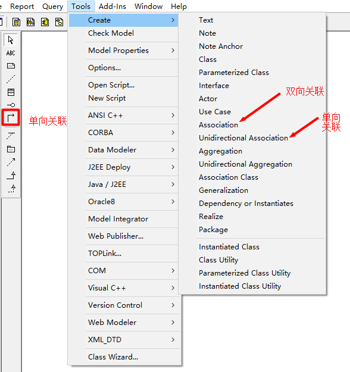
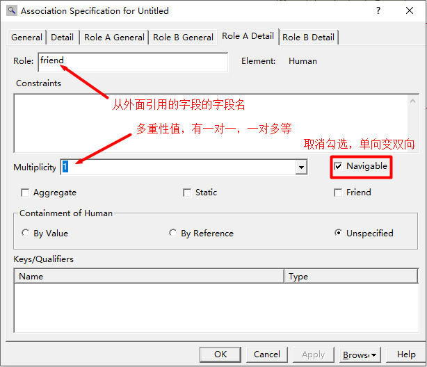
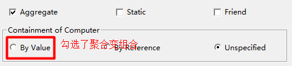

## UML

#### 概述

UML又叫标准建模语言。它是一个支持模型化和软件系统开发的图形化语言（非编程语言）。

做设计的当然比做具体编码的更值钱，没有设计编码就搞不掂。

软件开发初始，系统设计师/架构师给出UML设计图，程序员再根据UML图编码或开发。

#### UML建模工具

主要用Rational Rose 7.0.0。用法自行掌握。

下面是关联关系的部分用法：

Multiplicity：0、1、n..m（如0..4）、m...等。

#### 常见UML图

类图（Class Diagram）：描述类的信息（属性、方法），以及类和类之间的关系。

用例图（Use Case Diagram）：站在系统用户或系统角色的角度分析系统具有哪些功能。

时序图（Sequence Diagram）：描述程序的执行过程、方法的调用过程、方法的返回值等信息。

其他的如状态图、活动图等可以不看。

#### 类图

一般在Logical View里画类图。一般会创建一些目录来组织这些类图，因为一个项目的类可能会比较多。

#### 类和类之间的关系

##### 泛化

泛化（is a）：如猫是一种动物，那么猫类继承自动物类。子类是父类的特例，子类一定是父类，父类不一定是子类，如动物类继承自猫类就不合理了。

表示法：实线空心三角箭头指向父类。

##### 实现

实现：一个接口相当于一个任务清单，里面一个个方法相当于一个个具体任务，那么这份清单可由任意多个人做成。举个例子，有一份菜单，它可以由多名厨师做出来，对于同一道菜，每个厨子做出来的效果是不一样的。同理可得，多个类实现同一个接口，都会重写其中的一切方法，对于同名方法，各类方法体的写法可以是不同的（可以相同，只不过没有意义了）。我们还可由菜谱厨师的例子得到实现的意义，如果厨师不看菜谱，自主做菜，那么就不合餐馆规矩，应该是餐馆有什么你才做什么。同理可得，一个在特定情况下应当实现某一接口、遵循其规范的类就不能无视接口，自行造方法。

表示法：虚线空心三角箭头指向接口。

##### 关联

关联（has a）：如程序员有电脑，那么电脑类的对象充当程序员类的属性。一个类的对象作另一个类的属性（实例域），则产生了关联关系。注意有自关联的情况，比如下面这个例子:

上例是单向自关联，下例为双向自关联：

有趣的是一个Person对象会同时具有husband和wife属性，那么当意识里该对象是男的时其wife属性就应该为null了。

##### 聚合

聚合是特殊的关联。依赖对象的生命周期不决定被依赖对象的生命周期。具体阐释参见设计模式那一篇。

表示法：实线空心菱形箭头指向整体。

##### 组合

组合是特殊的关联。依赖对象的生命周期决定被依赖对象的生命周期，二者同生共死。具体阐释参见设计模式那一篇。

表示法：实线实心菱形箭头指向个体。

##### 依赖

依赖是耦合度最弱的关系。具体阐释参见设计模式那一篇。

表达法：虚线普通箭头指向被依赖类。

#### 用例图

概念前面已经说了。

画用例图的时候，需要先进行系统角色的抽取。

一般会在Use Case View里画用例图。

画法自行掌握。

##### 用例

用例是用户期望系统具备的功能，每一个用例说明一个系统提供给它的使用者的一种服务或功能。

用例的目标是要定义系统的一个行为，但并不显示系统的内部结构。

用例名一般为动宾短语，符号是椭圆加用例名。

#### 用例之间的关系

##### 包含关系

基本用例包含被包含用例。

借助数学语言描述，用例B是用例A的必要条件，若A成立，则B成立，即没有B就没有A。

若被包含用例无法实现，则基本用例亦无法实现。

##### 扩展关系

扩展用例扩展基本用例，当基本用例实现且满足某特定条件时，扩展用例才被实现。

故扩展关系与包含关系相反，基本用例不实现，则扩展用例亦无法实现。

与泛化关系相比，扩展关系中的基本用例可实现。

##### 泛化关系

当多个用例拥有共同的行为时，可抽象出它们的父用例。

与扩展关系里的基本用例相比，泛化关系里的父用例一般不实现。父用例往往跟抽象类很类似，在项目中没有它的实现，而有各种具体的子用例的实现，如注册用户本身不实现，而应实现本地注册和网上注册。

#### 时序图

时序图对项目的实现是最最重要的，因为它程序的执行流程、方法的调用情况及方法的返回值信息。

一般在Logical View里画时序图。

用例图中的一个用例会对应一个时序图，时序图描述了该用例的具体实现过程。

所有的时序图都写完了，基层程序员就根据时序图，先写Service和Dao，做单元测试，没问题了就接着写Controller，全程不用管逻辑，只顾机械地将思路转成代码，这就看出设计人员的价值更高之处。

表示法：

- 小人：用例的发起者。
- 矩形或圆圈：对象。
- 非回折实线箭头：调用下一层类的方法。
- 虚线箭头：方法的返回。
- 柱状条：对象的生命周期。
- 回折线：调用本类方法。

