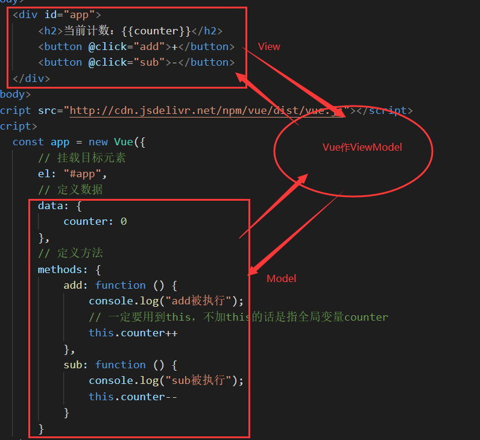

# Vue

参考视频：[2019年最全最新Vue、Vuejs教程，从入门到精通](https://www.bilibili.com/video/BV15741177Eh)。

## 概述

### 认识

#### 为什么学习

每个人学习vue的目的各不相同：

- 可能你的公司正要对原有的项目使用vue进行重构。
- 可能你的公司新项目决定使用vue技术栈。
- 可能你在换工作，你会发现招聘前端的10个中有8个对vue有要求。
- vue目前非常火，可以说是前端的必备技能。

#### 特点

 vue是一个渐进式的框架，什么叫渐进式呢？

- 你可以将vue作为你应用的一部分嵌入其中，带来更丰富的交互体验。
- 或者如果你希望将更多的业务逻辑使用vue实现，那么可以用vue的核心库及其生态系统。
- 比如core+vue+router+vuex，可以满足你的各种需求。

vue有很多特点和在web常见的高级功能：

- 解耦视图和数据。
- 可复用的组件。
- 前端路由技术。
- 状态管理。
- 虚拟DOM。

我们在后面的学习和开发中会慢慢体会到这些优点。

初学vue，并不需要我们具备angular、react，甚至jQuery等知识，但需具备一定的三大件（html、css、js）基础（尤其是es6）。

### 安装

#### CDN引入

```html
<!-- 开发环境版本，包含有帮助的命令行警告 -->
<script src="http://cdn.jsdelivr.net/npm/vue/dist/vue.js"></script>
<!-- 生产环境版本，优化了尺寸和速度 -->
<script src="http://cdn.jsdelivr.net/npm/vue"></script>
```

#### 下载到本地

开发环境：http://vuejs.org/js/vue.js。

生产环境：http://vuejs.org/js/vue.min.js。

#### NPM安装

后续学习到webpack和CLI的时候，再使用此方式。

### 入门案例

#### Hello World

```html
<!DOCTYPE html>
<html lang="en">

<head>
    <meta charset="UTF-8">
    <meta name="viewport" content="width=device-width, initial-scale=1.0">
    <title>Hello</title>
</head>

<body>
    <div id="app">{{info}}</div>
</body>
<script src="http://cdn.jsdelivr.net/npm/vue/dist/vue.js"></script>
<script>
    const app = new Vue({
        // 挂载目标元素
        el: "#app",
        // 定义数据
        data: {
            info: "你好啊，超凡"
        }
    })
</script>

</html>
```

js的做法：

```javascript
document.getElementById("app").innerText = "你好啊，李银河"
```

js的这种编程范式叫命令式编程，一步一步走，类比面向过程思想；而vue所属的编程范式叫声明式编程，或叫定义式，类比面向对象思想。后者更流行、更好用，做到数据和界面的分离。

这第一个程序体现了vue的响应式：即数据发生改变，则对应元素会作出响应，跟着改变。

再次理解下面这段核心代码：

```javascript
const app = new Vue({
    // 挂载目标元素
    el: "#app",
    // 定义数据
    data: {
        info: "你好啊，超凡"
    }
})
```

首先创建了一个vue对象。其中的el（element）属性决定了此对象挂载到哪个dom元素上，这里挂到id为app的div元素上。data属性通常存储一些数据，它们可以是我们定义的，也可能是从服务器加载来的。

可以在浏览器中动态修改数据。如`app.info = "Hello World!"`。

#### 列表渲染

```html
<!DOCTYPE html>
<html lang="en">

<head>
    <meta charset="UTF-8">
    <meta name="viewport" content="width=device-width, initial-scale=1.0">
    <title>列表显示</title>
</head>

<body>
    <div id="app">
        <ul>
            <li v-for="item in movies">
                {{item}}
            </li>
        </ul>
    </div>
</body>
<script src="http://cdn.jsdelivr.net/npm/vue/dist/vue.js"></script>
<script>
    const app = new Vue({
        el: "#app",
        data: {
            movies: ["敲开我心门", "雾都孤儿", "辛德勒的名单", "肖申克的救赎"]
        }
    })
</script>

</html>
```

可以在浏览器中动态添加数组元素：`app.movies.push("活着")`。

#### 计数器

```html
<!DOCTYPE html>
<html lang="en">

<head>
    <meta charset="UTF-8">
    <meta name="viewport" content="width=device-width, initial-scale=1.0">
    <title>计数器</title>
</head>

<body>
    <div id="app">
        <h2>当前计数：{{counter}}</h2>
        <button v-on:click="counter++">+</button>
        <button v-on:click="counter--">-</button>
    </div>
</body>
<script src="http://cdn.jsdelivr.net/npm/vue/dist/vue.js"></script>
<script>
    const app = new Vue({
        // 挂载目标元素
        el: "#app",
        // 定义数据
        data: {
            counter: 0
        }
    })
</script>

</html>
```

更好的写法是：

```html
<body>
    <div id="app">
        <h2>当前计数：{{counter}}</h2>
        <button @click="add">+</button>
        <button @click="sub">-</button>
    </div>
</body>
<script src="http://cdn.jsdelivr.net/npm/vue/dist/vue.js"></script>
<script>
    const app = new Vue({
        // 挂载目标元素
        el: "#app",
        // 定义数据
        data: {
            counter: 0
        },
        // 定义方法
        methods: {
            add: function () {
                console.log("add被执行");
                // 一定要用到this，不加this的话是指全局变量counter
                this.counter++
            },
            sub: function () {
                console.log("sub被执行");
                this.counter--
            }
        }
    })
</script>
```

这里我们认识到了新的属性methods，它用于在vue对象中定义方法。及新的指令@click，用于监听某元素的点击事件，其对应的回调方法通常在methods中定义。

注：@click之类的写法叫语法糖，即简写形式。

### MVVM架构

MVVM：Model View ViewModel。顾名思义，ViewModel是Model和View之间的桥梁，帮助Model和View进行通信。详细解读参见[维基百科](https://bk.tw.lvfukeji.com/wiki/MVVM)。


从上图不难看出View和Model的交互。

三者的分析如下。

View：

- 视图层。
- 在前端开发中通常就指dom层。
- 主要作用是给用户展示各种信息。

Model层

- 数据层。
- 数据可能是固定的死数据，而更大可能是来自服务器的、从网络请求中得来的活数据。

ViewModel：

- 视图模型层。
- 沟通View和Model。
- 一方面实现Data Binding（数据绑定），即将Model的改变实时反映（反应）到View上。
- 另一方面实现Dom Listener（dom监听），即当dom发生某些事件时，监听到并按需改变对应data。

针对计数器这个例子，下图体现了其对MVVM思想的反映：



### options

vue实例的optiongs（选项）详见[官方文档](https://cn.vuejs.org/v2/api/#data)。

目前掌握这些选项：

- el：

  - 类型：string | Element（dom元素）。
  - 作用：决定vue实例去管理哪一个dom元素。

- data：

  - 类型：Object | Function。
  - 作用：vue实例的数据对象。

- methods：

  - 类型：{ [key: string]: Function }。
  - 作用：定义vue实例的方法。

  注：关于函数与方法的辨析。方法（method）是特殊的函数（function），方法含于函数，类下属的函数一般叫做方法，故方法是函数，函数不一定是方法。

### 生命周期

我们直观看到的是非常简洁的`new Vue()`，但其实vue在底层执行了一系列操作，它们反映了vue的生命周期。

这里只对生命周期作简单介绍。下图反映了一个vue实例的完整生命周期：


我们常用生命周期函数来刻画生命周期并在某些节点做一些操作。比如我们常常在created回调函数中从后台取数据：

```javascript
const app = new Vue({
    // 挂载目标元素
    el: "#app",
    // 定义数据
    data: {
        counter: 0
    },
    // 定义方法
    methods: {
        add: function () {
            console.log("add被执行");
            // 一定要用到this，不加this的话是指全局变量counter
            this.counter++
        },
        sub: function () {
            console.log("sub被执行");
            this.counter--
        }
    },
    beforeCreated: function () {
        // 从后台取数据，接着传给data，最后传给dom元素
        // 暂不写
        console.log("created");
    },
    mounted: function () {
        console.log("mounted");
    }
})
```

上图中的红框就表示某时间节点处执行的回调函数。[官方文档](https://cn.vuejs.org/v2/api/#%E9%80%89%E9%A1%B9-%E7%94%9F%E5%91%BD%E5%91%A8%E6%9C%9F%E9%92%A9%E5%AD%90)对它们进行了详细说明，我们可以根据需求灵活使用。

着重理解el和template。这两个东西不能同时不存在，我们分三种情况讨论：

- 有el无template：把el对应元素当作template，去编译。
- 无el有template：直接编译template。
- 有el有template：用template替换掉el对应元素，去编译。

可看出归根结底template最重要。

## 基础语法

### 概述

官网上叫模板语法。

### 插值操作

简而言之，就是将模型层里的数据渲染到视图层元素内容中，而且视图层被渲染出来的数据会跟随模型层里数据的变化而变化，此之谓响应式。

##### mustache

注：许多大型开源项目采用2空格缩进。

mustache语法通俗点讲就是双大括号语法，作用是将数据渲染到元素中。

```html
<body>
    <div id="app">
        <h2>{{message}}</h2>
        <h2>{{message}}, Van</h2>
        <!-- +充当字符串连接符 -->
        <h2>{{message + ", " + firstName + " " + lastName}}</h2>
        <h2>{{firstName}}&ensp;{{lastName}}</h2>
        <!-- +充当算术运算符 -->
        <h2>{{counter + 2}}</h2>
    </div>
</body>
<script src="http://cdn.jsdelivr.net/npm/vue/dist/vue.js"></script>
<script>
    const app = new Vue({
        el: "#app",
        data: {
            // 自定义一些变量
            message: "Hello",
            firstName: "Kobe",
            lastName: "Bryant",
            counter: 100
        }
    })
</script>
```

##### v-once

顾名思义，once指绑定数据保持初始值，后续对其更改不会反映在界面上。

```html
<h2 v-once>{{message}}</h2>
```

该指令后面不需接任何表达式。该指令表示元素和组件（后面会学到）只渲染一次。

##### v-html

数据内容可能包括html代码，那么本指令后面往往接上字符串，解析其中的html代码。

```html
<body>
    <div id="app">
        <!-- 不可解析，html代码原样显示 -->
        <h3>{{url}}</h3>
        <!-- 可解析html代码成dom元素并展示 -->
        <h3 v-html="url"></h3>
    </div>
</body>
<script src="http://cdn.jsdelivr.net/npm/vue/dist/vue.js"></script>
<script>
    const app = new Vue({
        el: "#app",
        data: {
            url: "<a href=\"http://www.baidu.com\">访问百度</a>"
        }
    })
</script>
```

##### v-text

本指令接表达式，表示覆盖掉元素原内容。

```html
<body>
    <div id="app">
        <h2 v-text="message">Van</h2>
    </div>
</body>
<script src="http://cdn.jsdelivr.net/npm/vue/dist/vue.js"></script>
<script>
    const app = new Vue({
        el: "#app",
        data: {
            message: "Good evening"
        }
    })
</script>
```

##### v-pre

本指令表示原样展示数据内容，不作任何解析转义。

```html
<body>
    <div id="app">
        <span>{{message}}</span>
        <span v-pre="message">{{message}}</span>
        </span>
</body>
<script src="http://cdn.jsdelivr.net/npm/vue/dist/vue.js"></script>
<script>
    const app = new Vue({
        el: "#app",
        data: {
            message: "Good evening"
        }
    })
</script>
```

##### v-cloak

本指令作用是当网络或运行有较大延迟，避免显示类似`{{message}}`这种对用户不友好的内容。它后面不接表达式，且常配合css使用。

```html
<!DOCTYPE html>
<html lang="en">

<head>
    <meta charset="UTF-8">
    <meta name="viewport" content="width=device-width, initial-scale=1.0">
    <title>v-cloak</title>
    <style>
        /* 
         在vue渲染之前，v-cloak属性存在
         在vue渲染之后，v-cloak属性消失
         */
        [v-cloak] {
            display: none;
        }
    </style>
</head>

<body>
    <div id="app">
        <h4>{{message}}</h4>
        <h4 v-cloak>{{message}}</h4>
</body>
<script src="http://cdn.jsdelivr.net/npm/vue/dist/vue.js"></script>
<script>
    // 手动设置延时以模拟延迟情况
    setTimeout(function () {
        const app = new Vue({
            el: "#app",
            data: {
                message: "Good morning"
            }
        })
    }, 3000)
</script>

</html>
```

针对开头提到的问题，我们后面会学到更好的解决办法是将数据渲染过程封装到函数中，故v-cloak指令用得很少了。

### 属性绑定

前面所学的主要是将数据插入到元素的内容中，可我们也希望将数据插入到元素的属性中，譬如a元素的href、img元素的src等，此时我们就可用v-bind指令。属性绑定也是响应式的。

#### v-bind

mustache语法只作用于元素内容部分，写成src等属性的值的话是无效的。那么v-bind就登场了。 

下面就是一个关于src和href属性动态绑定的例子：

```html
<body>
    <div id="app">
        <!-- 动态绑定属性 -->
        
        <a v-bind:href="href">访问神秘网址</a>
    </div>
</body>
<script src="http://cdn.jsdelivr.net/npm/vue/dist/vue.js"></script>
<script>
    const app = new Vue({
        el: "#app",
        data: {
            imgUrl: "https://ss3.baidu.com/-fo3dSag_xI4khGko9WTAnF6hhy/zhidao/pic/item/9922720e0cf3d7cacdce834bf01fbe096b63a9d7.jpg",
            href: "http://www.jd.com"
        }
    })
</script>
```

v-bind的语法糖（简写）是一个冒号。形如：

```html

<a :href="href">访问神秘网址</a>
```

工作中常用简写。

#### 绑定类

我们有时候想动态绑定元素的class属性，就可写`v-bind:class="对象"`。示例如下：

```html
<!DOCTYPE html>
<html lang="en">

<head>
    <meta charset="UTF-8">
    <meta name="viewport" content="width=device-width, initial-scale=1.0">
    <title>绑定class</title>
    <style>
        .one {
            color: indigo;
        }

        .two {
            color: khaki;
        }
    </style>
</head>

<body>
    <div id="app">
        <!-- 绑定class -->
        <span :class="activeClass">{{message}}</span>
    </div>
</body>
<script src="http://cdn.jsdelivr.net/npm/vue/dist/vue.js"></script>
<script>
    const app = new Vue({
        el: "#app",
        data: {
            message: "我是中国人",
            // activeClass属性的值才是某个class名
            activeClass: "two"
        }
    })
</script>

</html>
```

更高级灵活的写法如下：

```html
<body>
    <div id="app">
        <!-- 绑定class。表达式中是一个json对象，value来自data，且须是布尔值 -->
        <span :class="{one: isOne, two: isTwo}">{{message}}</span>
    </div>
</body>
<script src="http://cdn.jsdelivr.net/npm/vue/dist/vue.js"></script>
<script>
    const app = new Vue({
        el: "#app",
        data: {
            message: "我是中国人",
            isOne: true,
            isTwo: false
        }
    })
</script>
```

注意到第4行的json对象。键one表class名，值表此class应用到此元素与否。比如所有值都是true就表示这些class都施加在此元素上。我们若接着写`class=“xxx”`，则此class会同它们拼合起来。

还可以把对象封装到方法中：

```html
<body>
    <div id="app">
        <!-- 绑定class，表达式里是一个方法 -->
        <span :class="getClasses()">{{message}}</span>
        <!-- btnClick后面的()是略掉了 -->
        <button v-on:click="btnClick">点我</button>
    </div>
</body>
<script src="http://cdn.jsdelivr.net/npm/vue/dist/vue.js"></script>
<script>
    const app = new Vue({
        el: "#app",
        data: {
            message: "我是中国人",
            isOne: true,
            isTwo: false
        },
        methods: {
            btnClick: function () {
                this.isTwo = !this.isTwo
            },
            getClasses: function () {
                // 注意this别掉了
                return { one: this.isOne, two: this.isTwo }
            }
        }
    })
</script>
```

`:class`的表达式里也可以放数组，数组元素就是类名。数组示例如下：

```html
<body>
    <div id="app">
        <!-- 绑定class。表达式中是一个数组 -->
        <span :class="getClasses()">{{message}}</span>
    </div>
</body>
<script src="http://cdn.jsdelivr.net/npm/vue/dist/vue.js"></script>
<script>
    const app = new Vue({
        el: "#app",
        data: {
            message: "我是中国人",
            // 诸类名
            classOne: "one",
            classTwo: "two"
        },
        methods: {
            getClasses: function () {
                // 返回数组
                return [this.classOne, this.classTwo]
            }
        }
    })
</script>
```

数组语法并不常用，对象语法更常用。

#### 绑定样式

有时我们想动态绑定元素的样式，就可写`:style="对象"`。示例如下：

```html
<body>
    <div id="app">
        <!-- 绑定style。表达式是data传来的json对象 -->
        <span :style="style">{{message}}</span>
    </div>
</body>
<script src="http://cdn.jsdelivr.net/npm/vue/dist/vue.js"></script>
<script>
    const app = new Vue({
        el: "#app",
        data: {
            message: "下雨天把女朋友带回家喜闻乐见",
            // 样式对象
            style: {
                fontSize: "30px",
                color: "blue"
            }
        }
    })
</script>
```

抑或是像这种：

```html
<body>
    <div id="app">
        <!-- 绑定style 表达式是json对象，各value由data里的style得来 -->
        <span :style="{fontSize: style.fontSize, color: style.color}">{{message}}</span>
    </div>
</body>
<script src="http://cdn.jsdelivr.net/npm/vue/dist/vue.js"></script>
<script>
    const app = new Vue({
        el: "#app",
        data: {
            message: "下雨天把女朋友带回家喜闻乐见",
            // 样式对象
            style: {
                fontSize: "30px",
                color: "blue"
            }
        }
    })
</script>
```

当然也可将fontSize和color属性剥离出来：

```html
<body>
    <div id="app">
        <!-- 绑定style。表达式是对象，各value由data得来 -->
        <span :style="{fontSize: fontSize, color: color}">{{message}}</span>
    </div>
</body>
<script src="http://cdn.jsdelivr.net/npm/vue/dist/vue.js"></script>
<script>
    const app = new Vue({
        el: "#app",
        data: {
            message: "下雨天把女朋友带回家喜闻乐见",
            // 诸样式属性
            fontSize: "30px",
            color: "blue"
        }
    })
</script>
```

更直观地，我们可以不传属性，直接写明：

```html
<body>
    <div id="app">
        <!-- 绑定style 表达式是属性值为字面量的对象 -->
        <span :style="{fontSize: '30px', color: 'red' }">{{message}}</span>
    </div>
</body>
<script src="http://cdn.jsdelivr.net/npm/vue/dist/vue.js"></script>
<script>
    const app = new Vue({
        el: "#app",
        data: {
            message: "下雨天把女朋友带回家喜闻乐见"
        }
    })
</script>
```

下面仍旧来看下不常用的数组语法。

```html
<body>
    <div id="app">
        <!-- 绑定style 数组语法：每个元素都是json对象，对应某个样式属性 -->
        <span :style="[attribution1, attribution2]">{{message}}</span>
    </div>
</body>
<script src="http://cdn.jsdelivr.net/npm/vue/dist/vue.js"></script>
<script>
    const app = new Vue({
        el: "#app",
        data: {
            message: "下雨天把女朋友带回家喜闻乐见",
            attribution1: { fontSize: "25px" },
            attribution2: { backgroundColor: "pink" }
        }
    })
</script>
```

显然这种写法极不简洁。

### 计算属性

#### 基本操作

有时我们想对data里的数据做一番处理之后再在dom元素上渲染出来，这时就应当使用到计算属性，具体即用vue实例的options中的computed属性。下面是一个小例子：

```html
<body>
    <div id="app">
        <!-- 不用加括号 -->
        <h3>{{fullName}}</h3>
    </div>
</body>
<script src="http://cdn.jsdelivr.net/npm/vue/dist/vue.js"></script>
<script>
    const app = new Vue({
        el: "#app",
        data: {
            firstName: "Joker",
            lastName: "Van"
        },
        // 计算属性：落脚点是属性，故方法名是名词而非动宾结构
        computed: {
            fullName: function () {
                return this.firstName + " " + this.lastName
            }
        }
    })
</script>
```

下面来看看更为复杂的操作：

```html
<body>
    <div id="app">
        <h3>书的总价格是：{{priceSummary}}</h3>
    </div>
</body>
<script src="http://cdn.jsdelivr.net/npm/vue/dist/vue.js"></script>
<script>
    const app = new Vue({
        el: "#app",
        data: {
            books: [
                { id: 150, name: "在细雨中呼喊", price: 20 },
                { id: 151, name: "许三观卖血记", price: 18 },
                { id: 152, name: "活着", price: 18 },
                { id: 153, name: "追风筝的人", price: 20 }
            ]
        },
        computed: {
            priceSummary: function () {
                var totalPrice = 0;
                for (let index in this.books) {
                    totalPrice += this.books[index].price
                }
                // for (let book of this.books) {
                //     totalPrice += book.price
                // }
                return totalPrice
            }
        }
    })
</script>
```

每个计算属性（比如上例中的fullName、priceSummary）都有一个getter（访问器）和setter（修改器），在上例中我们只是用了getter来读取，而在很少的情况下我们才想提供一个setter方法（故不常用）。

为什么我们不把计算属性给methods里的方法实现呢？因为computed对象会进入缓存（实质是所存方法的返回值会进入缓存），不像methods里的方法在dom中出现几次就被调用几次，计算属性只被调用一次因此拿到数据处理结果的效率会更高。

#### setter和getter

示例如下：

```html
<body>
    <div id="app">
        <h3>{{fullName}}</h3>
    </div>
</body>
<script src="http://cdn.jsdelivr.net/npm/vue/dist/vue.js"></script>
<script>
    const app = new Vue({
        el: "#app",
        data: {
            firsName: "James",
            lastName: "Gosling"
        },
        computed: {
            fullName: {
                // setter
                set: function (newName) {
                    console.log(newName)
                    const names = newName.split(" ")
                    this.firsName = names[0]
                    this.lastName = names[1]
                },
                // getter
                get: function () {
                    return this.firsName + " " + this.lastName
                }
            }
        }
    })
</script>
```

当我们在浏览器控制台修改（通过赋值）fullName的值时，setter方法就会被调用：

```js
app.fullName = "Van Thomas"
Van Thomas
```

绝大多数情况下我们是不写setter的，因为希望利用传入参数对原数据进行修改。

#### 优势

最后理解一下计算属性与mustache语法和普通方法封装对比所拥有的优势。

首先，基于数据的处理写在双大括号里的话显得很繁琐，而且不支持复杂操作，比如前面谈到的数组遍历。故不采用mustache语法。

其次，则最终的计算属性渲染多次，则相应的普通方法会被调用多次，而定义在computed选项中的方法只会调用一次，显然后者的效率更高。故可知若希望某个过程只执行一次，则两者皆可用；若此过程执行多次，则不采用普通方法封装。

### 事件监听

#### v-on

在前端开发中，事件占据很大的比重，用户经常同界面进行交互。于是我们须监听各类用户做出的事件，如点击、拖拽、按键等。在vue中我们使用v-on指令完成事件触发操作。

看一个小例子就可以：

```html
<!DOCTYPE html>
<html lang="en">

<head>
    <meta charset="UTF-8">
    <meta name="viewport" content="width=device-width, initial-scale=1.0">
    <title>v-on基本使用</title>
</head>

<body>
    <div id="app">
        <h3>{{counter}}</h3>
        <!-- 方法名后括号可接可不接 -->
        <button @click="add">+</button>
        <button v-on:click="subtract">-</button>
    </div>
</body>
<script src="http://cdn.jsdelivr.net/npm/vue/dist/vue.js"></script>
<script>
    const app = new Vue({
        el: "#app",
        data: {
            counter: 0
        },
        methods: {
            // ES6增强写法：省略function
            add() {
                this.counter++
            },
            subtract() {
                this.counter--
            }
        }
    })
</script>

</html>
```

#### v-on的参数

列举一下执行回调方法时传入参数的情况：

- 该方法无参数，则其后小括号可不加。
- 该方法有自定义参数，则就按常规理解-实参赋形参。
- 该方法定义处有参数（名称可任意，但常取event），调用处无参数，则默认地将原生事件（event）对象传入。
- 该方法既有自定义参数，又有事件对象参数，则在形参列表中第一个参数为自定义参数，第二个参数为事件对象参数，在实参列表中第一个实参为自定义实参，第二个实参为`$event`。

四种情况的实现如下：

```html
<body>
    <div id="app">
        <button @click="btnClick1">无参数</button>
        <button @click="btnClick2(name)">自定义参数</button>
        <button @click="btnClick3">事件对象参数</button>
        <button @click="btnClick4(age, $event)">自定义参数和事件对象参数</button>
    </div>
</body>
<script src="http://cdn.jsdelivr.net/npm/vue/dist/vue.js"></script>
<script>
    const app = new Vue({
        el: "#app",
        data: {
            name: "Van",
            age: 22
        },
        methods: {
            btnClick1() {
                // 无参数
                console.log("无参数")
            },
            btnClick2(selfParam) {
                // 自定义参数: Van
                console.log("自定义参数: " + selfParam)
            },
            btnClick3(event) {
                // 事件对象参数: [object MouseEvent]
                console.log("事件对象参数: " + event)
            },
            btnClick4(selfParam, event) {
                // 自定义参数:  22 事件对象参数:  MouseEvent {isTrusted: true, screenX: 302, screenY: 124, clientX: 302, clientY: 21, …}
                console.log("自定义参数: ", selfParam, "事件对象参数: ", event)
            }
        }
    })
</script>
```

#### v-on的修饰符

修饰符是修饰事件用的，有时候我们可能对事件有特殊的要求。

有以下修饰符：

- `.stop`：调用`event.stopPropagation()`。
- `.prevent`：调用`event.preventDefault`。
- `.{keyCode | keyAlias}`：特定按键触发回调函数。
- `.native`：监听组件元素的原生事件（如touchend等）。注意原生事件本仅适用于普通元素。
- `.once`：只触发一次回调函数。

下面对上述修饰符举例。

阻止事件冒泡：

```vue
<button @click.stop="btnClick">click me</button>
```

阻止默认事件如提交：

```vue
<form action="http://baidu.com">
    <input type="submit" value="submit" @click.prevent="">
</form>
```

监听某个按键的弹起如enter：

```vue
<input type="text" name="username" @keyup.enter="keyUp">
```

使某回调函数仅被触发一次：

```vue
<!-- 注意到注册多个回调，并不产生覆盖现象 -->
<button @click.once="onlyOne()" @click.prevent>只给一次反应</button>
```

### 分支语句

即v-if、v-else-if、v-else。作用是根据表达式的真假情况决定在dom中渲染或销毁元素、组件。

看一个最简单的例子：

```vue
<!-- h2不会在dom中生成 -->
<h2 v-if="false">{{message}}</h2>
```

然后配合v-else使用：

```vue
<div v-if="score>=60">及格</div>
<!-- v-else后面不需要跟条件 -->
<div v-else>不及格</div>
```

最后就是将v-else-if也加入进来，但v-else-if用得少，例子就不举了。

上述逻辑判断都通过v-if等分支命令写在视图层了，结合前面学的计算属性可高效处理复杂数据，应意识到比较复杂的分支应交由计算属性实现，简单的分支（如二分支）可通过v-if等写到视图层（html代码区）中。

```vue
<input type="text" placeholder="输入用户名" v-if="type='username'">
<input type="email" placeholder="输入用户邮箱" v-else>
```

观察上述代码，比如已经在当前输入框输入了文字，然后通过点击按钮修改type数据，从而切换输入框，但会发现输入框里仍然存在之前输入的文字。这是因为vue在进行dom的渲染时，出于性能（效率）的考虑，会尽可能复用已经存在的元素，而不是新建元素，于是该元素中没被修改的属性就保持原状，就比如上面的input元素的value属性保留着且取缔placeholder属性。

若我们不希望元素复用，可对元素添加key属性以实现。就上面的例子：

```vue
<input type="text" placeholder="输入用户名" v-if="type='username'" key="username-input">
<input type="text" placeholder="输入用户邮箱" v-else key="email-input">
```

key值相同的元素被视为可复用，反之不可复用。

有一个效果与v-if等指令相同的指令v-show，它们的不同点在于当条件为false时，v-if不会在dom中生成元素，而v-show会生成，只是将其display属性设为none。在实际开发中，若元素的显隐切换十分频繁，则建议使用v-show。

### v-for

来看一些例子：

```vue
<body>
    <div id="app">
        <!-- 数组的遍历 -->
        <ul>
            <!-- 不带下标 -->
            <li v-for="name in names">{{name}}</li>
        </ul>
        <ul>
            <!-- 带下标 -->
            <li v-for="(name, index) in names">{{index + 1}} {{name}}</li>
        </ul>
        <!-- 对象的遍历 -->
        <ul>
            <!-- 只有value -->
            <li v-for="value in student">{{value}}</li>
        </ul>
        <ul>
            <!-- value及key -->
            <li v-for="(value, key) in student">{{key}}-{{value}}</li>
        </ul>
        <ul>
            <li v-for="(value, key, index) in student">{{index}}-{{key}}-{{value}}</li>
        </ul>
    </div>
</body>
<script src="http://cdn.jsdelivr.net/npm/vue/dist/vue.js"></script>
<script>
    const app = new Vue({
        el: "#app",
        data: {
            names: ["tom", "bob", "john", "lily"],
            student: {
                no: 7,
                age: 20,
                gender: "man"
            }
        },
    });
</script>
```

官方推荐我们在使用v-for时，给对应元素或组件添加`:key`属性，以实现更高效的复用。

从本质来说，key属性与虚拟dom和diff算法有关。简单点谈，比如在同级若干li元素间再插入一个li，vue默认会按顺序表的方式，因此效率很低。那么`:key`属性的作用就是让vue按单链表的方式插入li元素，从而更高效地更新虚拟dom，注意属性值必须是唯一的。

为了保持诸元素`:key`属性的唯一性，一般用item来作属性值以互相区分。例如：

```vue
<li v-for="item in letters" :key="item">{{name}}</li>
```

### 双向绑定

v-model常用于数据和表单控件属性之间的双向绑定。

用一个例子理解：现有一个输入框，其v-model属性绑定了数据message。当我们输入了内容，它就实时地将内容传递给message，即更新message；当message先行改变，输入框的v-model属性值也会响应地发生改变。以上就反映了双向绑定机制。

```vue
<input type="text" v-model="message">{{message}}
```

基于上片代码，在浏览器会看到输入框初始就有内容，为message的值，然后输入修改输入框内容，会发现输入框后面的文字会跟着变。

本质上说，v-model双向绑定就是两个单向绑定的融合，一个单向绑定是属性绑定，另一个是input事件触发。下面给出最简单的等价写法：

```vue
<!-- 这里事件对象只能写作event -->
<input type="text" :value="message" @input="message = $event.target.value">{{message}}
```

下面是v-model配合radio、checkbox、select控件的使用案例：

```vue
<body>
    <div id="app">
        <label for="male">
            <!-- 用v-model绑定到了同一数据，就能满足互斥性，那么name属性可以省略 -->
            男<input type="radio" id="male" value="男" v-model="gender">
        </label>
        <label for="female">
            女<input type="radio" id="female" value="女" v-model="gender">
        </label>
        <h4>所选性别为：{{gender}}</h4>

        <label for="protocol">
            <input type="checkbox" id="protocol" v-model="isAgree">同意《用户协议》
        </label>
        <button :disabled="!isAgree">下一步</button>
        <h4>你{{isAgree ? "已同意" : "未同意"}}用户协议</h4>

        <input type="checkbox" value="volleyball" v-model="hobbies">排球
        <input type="checkbox" value="basketball" v-model="hobbies">篮球
        <input type="checkbox" value="football" v-model="hobbies">足球
        <input type="checkbox" value="pingpang" v-model="hobbies">乒乓球
        <h4>你的爱好有{{hobbies}}</h4>

        <!-- 还可以价格multiple属性，实现多选 -->
        <select v-model="fruit">
            <option value="苹果">苹果</option>
            <option value="香蕉">香蕉</option>
            <option value="菠萝">菠萝</option>
            <option value="梨子">梨子</option>
        </select>
        <h4>你喜欢的水果是：{{fruit}}</h4>

        <!-- 先根据数据生成选项列表 -->
        <select v-model="fruit">
            <option v-for=" item in originalFruits" :value="item">{{item}}</option>
        </select>
        <h4>你喜欢的水果是：{{fruit}}</h4>
    </div>
</body>
<script src="http://cdn.jsdelivr.net/npm/vue/dist/vue.js"></script>
<script>
    const app = new Vue({
        el: "#app",
        data: {
            gender: "男",
            isAgree: false,
            hobbies: [],
            fruit: "",
            originalFruits: ["草莓", "黄桃", "葡萄"]
        },
    });
</script>
```

v-model后面也可以接修饰符，这里主要讲三种修饰符：

- `v-model.lazy`：让数据在失去焦点或回车时才更新。
- `v-model.number`：让输入的内容自动转为数值型。不用此修饰符，那么即使你输入纯数字，也会被视为字符串。
- `v-model.trim`：过滤输入内容两边的空格。

### 注

数组的响应式问题。有些修改数组的方法是响应式的而有些不是，我们作一下梳理：

- push、pop、shift、unshift、splice、sort、reverse这些方法支持响应式。
- `this.array[2]="x"`这样的修改不支持响应式。
- `Vue.set(this.array, 2, "x")`这样的修改支持响应式。且注意Vue.set是一个重要方法，后面还会用到。

## 组件化开发

### 概述

欲知vue的组件化思想可参考[组件化应用构建](https://v3.cn.vuejs.org/guide/introduction.html#%E7%BB%84%E4%BB%B6%E5%8C%96%E5%BA%94%E7%94%A8%E6%9E%84%E5%BB%BA)。

玩儿转组件分成三个步骤：

1. 创建组件构造器。
2. 注册（挂载）组件。
3. 使用组件。

组件是vue的一大特色。我们可以将一坨html代码封装成一个自定义标签然后可对其进行复用，甚至能跨项目复用。看一个小例子：

```vue
<body>
    <div id="app">
        <!-- 使用组件 -->
        <my-cpn></my-cpn>
    </div>
</body>
<script src="http://cdn.jsdelivr.net/npm/vue/dist/vue.js"></script>
<script>
    // 创建组件（类）
    const cpn = Vue.extend({
        template: `
            <div>
                <h2>标题</h2>
                <p>内容</p>
            </div>
        `
    });
    // 用component方法注册组件，传入标签名和组件（类）
    Vue.component("my-cpn", cpn);
    const app = new Vue({
        el: "#app",
        data: {},
    });
</script>
```

代码理解：

- extend方法创建返回一个组件构造器（之前学过构造器就是类的等价表述）；extend方法的传入对象的template属性表示自定义的可复用的html代码；这种写法已被语法糖替代，但应作为先导知识了解。
- component方法将组件构造器注册到某个Vue对象或全局上，并给它起个标签名。
- 组件必须挂载到某个vue实例或全局上。

### 全局组件与局部组件

全局组件可以在可访问到的所有vue实例下使用。上面用component注册的就是全局组件。

不经由component方法而通过vue实例下component属性注册的组件即局部组件。承上模板，例如：

```js
const app = new Vue({
    el: "#app",
    // 注册组件 标签名: 组件名
    components: {
        myCpn: cpn
    }
});
```

显然它只能在当前实例中使用。

一个组件可以被注册到多个实例中。

### 父组件与子组件

先厘清一下结构，在一个组件对象（而非vue实例）中通过component属性注册另一个组件，从而形成父子组件。例如：

```js
// 子组件
const sonCpn = Vue.extend({
    template: `
        <div>
            <h2>我是儿</h2>
            <p>内容</p>
        </div>
    `
});
// 父组件
const fatherCpn = Vue.extend({
    template: `
        <div>
            <h2>我是爹</h2>
            <p>内容</p>
            <son></son>
        </div>
    `,
    components: {
        // 注册子组件
        son: sonCpn
    }
});
const app = new Vue({
    el: "#app",
    data: {},
    components: {
        // 注册父组件
        father: fatherCpn
    }
});
```

其实vue实例也可看作一个组件，叫根组件root。

注意一点：

> 附庸的附庸不是我的附庸。

比如上例里的子组件是通过component属性直接注册到父组件上，可以说是间接注册到app实例上，即并没有直接注册到app实例上，故不属于app实例的局部组件。所以若把它的对应标签写到app实例挂载的标签中，会报错。

也就是说，要想在某被挂载元素中使用组件，那么该组件必须要么是全局组件，要么是本实例的局部组件，上述子组件就不是局部组件。

实在想使用子组件的子组件的话，也好办，即单独把子组件的子组件注册一下：

```js
const app = new Vue({
    el: "#app",
    data: {},
    components: {
        // 注册父组件
        father: fatherCpn,
        // 注册子组件
        son: sonCpn
    }
});
```

### 语法糖

语法糖就是把组件的创建和注册融合了，略去extend：

```js
// 全局注册
Vue.component("my-cpn", {
    template: `
        <div>
            <h2>我是cpn</h2>
            <p>内容</p>
        </div>
    `
});

// 局部注册
const app = new Vue({
    el: "#app",
    data: {},
    components: {
        mycpn: {
            template: `
                <div>
                    <h2>我是cpn</h2>
                    <p>内容</p>
                </div>
            `
        }
    }
});
```

### 模板抽离

即将template属性的值分出来，使代码更美观、易读一些。

第一种：

```vue
<!-- 在script标签中单独写模板 -->
<script type="text/x-template" id="cpn">
<div>
    <h2>标题</h2>
    <p>段落</p>
</div>
</script>

Vue.component("my-cpn", {
    template: "#cpn"
});
const app = new Vue({
    el: "#app",
    data: {},
    components: {
        mycpn: {
            template: "#cpn"
        }
    }
});
```

第二种（最简单）：

```vue
<!-- template标签 -->
<template id="cpn">
	<!-- 模板必须具备一个根标签 -->
    <div>
        <h2>标题</h2>
        <p>段落</p>
    </div>
</template>
```

注册部分与上同。

### 组件数据

组件是一个独立功能模块的封装，故应当有自己的html模板，也应当有自己的数据。那么想象一下，组件的数据能不能放在vue中，如此就很恐怖了，不但实例数据属性会变得非常臃肿，而且还看不出各个数据哪个是组件的、是哪个组件的，哪个是实例的。

组件有自己专门存数据的地方，也叫data（它连同methods等属性，再次证明组件其实就是vue实例），但是其值必须为函数，返回值即封装诸数据的对象：

```vue
<!-- template标签 -->
<template id="cpn">
	<!-- 最外层必须包一个标签 -->
    <div>
        <h2>{{title}}</h2>
        <p>{{paragraph}}</p>
    </div>
</template>

Vue.component("my-cpn", {
    template: "#cpn",
    data() {
        return {
            title: "东坡名句",
            paragraph: "一蓑烟雨任平生"
        }
    }
});
```

至于为什么data必须是函数类型，我们先看个铺垫：

```js
function getObj() {
    return {
        name: "miyuki",
        age: 24
    };
}
obj1 = getObj();
obj2 = getObj();
// false
console.log(obj1 === obj2);
```

上例中，虽然两次调用同一个函数，但返回得到的俩对象的内存地址其实不同。可理解为每次调用此函数，都将基于新地址造一个状态完全相同的对象，返回出去。

推广到组件的data上，当然也有这样的特点。多个同名自定义标签关联到的组件数据是相互独立的，达到的效果就是呈现出来的几坨内容互不干扰，组件数据就很像类的成员变量，同类但不同实例的成员变量互不干扰。

如果我们想让这几个标签共享数据，则可将data函数返回的封装对象定义在函数外部。但一般来说，开发中我们不希望出现连锁反应，因此恪守准则，必须将data写作函数。

### 父子组件通信

上一节我们说到，一般而言data在组件之间是不能共享的。但是在实际开发中，却常见根组件将从后台请求来的数据向子组件传递的现象（注意是传递，因为子组件不能直接使用父组件的数据），并且层层传递的现象也很常见。同时开发中还有一些场景是子组件向父组件传递数据（同样父组件也不能直接使用子组件的数据）。

#### 父传子

直接上一个例子：

```vue
<template id="cpn">
    <div>
        <h3>{{greeting}}</h3>
        <ul>
            <li v-for="movie in movies">{{movie}}</li>
        </ul>
    </div>
</template>

<body>
    <div id="app">
        <!-- 理解为调用子组件时，格式a=b里的b须存在于父组件数据中，a须出现于子组件的prop所含元素或属性中，两者一一对应 -->
        <cpn v-bind:movies="movies" :greeting="greeting"></cpn>
    </div>
</body>
<script src="http://cdn.jsdelivr.net/npm/vue/dist/vue.js"></script>
<script>
    // 子组件
    const cpn = {
        template: "#cpn",
        // props属性响应式接收父组件传递来的数据
        props: ["movies", "greeting"],
        data() {
            return {};
        },
    };
    const app = new Vue({
        el: "#app",
        data: {
            movies: ["《千与千寻》", "《红猪》", "《龙猫》"],
            greeting: "我是你爹"
        },
        components: {
            // 注册组件的最简单写法
            cpn
        }
    });
</script>
```

props值的类型也可以是对象，而且对象更为常用，因为可以制定一些约束：

```js
props: {
    // 诸数据的名称及其类型
    movies: Array,
    greeting: String
},
```

我们还可以对属性作进一步的限定：

```js
props: {
    movies: Array,
    greeting: {
        // 所接收数据类型
        type: String,
        // 没接收到的话，默认值
        default: "我是你爹吗？",
        // 欲调用当前组件，必须传此数据
        required: true
    }
},
```

官方文档给了一个较全面的验证写法：

```js
app.component('my-component', {
  props: {
    // 基础的类型检查 (`null` 和 `undefined` 会通过任何类型验证)
    propA: Number,
    // 多个可能的类型
    propB: [String, Number],
    // 必填的字符串
    propC: {
      type: String,
      required: true
    },
    // 带有默认值的数字
    propD: {
      type: Number,
      default: 100
    },
    // 带有默认值的对象
    propE: {
      type: Object,
      // 对象或数组的默认值必须从一个工厂函数获取，目的还是避免数据污染
      default() {
        return { message: 'hello' }
      }
    },
    // 自定义验证函数
    propF: {
      validator(value) {
        // 这个值必须匹配下列字符串中的一个
        return ['success', 'warning', 'danger'].includes(value)
      }
    },
    // 具有默认值的函数
    propG: {
      type: Function,
      // 与对象或数组默认值不同，这不是一个工厂函数 —— 这是一个用作默认值的函数
      default() {
        return 'Default function'
      }
    }
  }
})
```

甚至可以设数据类型为自定义的类。

提醒一点，由于html不区分大小写，所以父组件传递的数据名（属性名）若为驼峰名，则在绑定时要转写为横杠分隔名。

#### 子传父

一般而言，子组件通过事件触发回调函数，从而传递数据给父组件。

上例子：

```vue
<!-- 子组件 -->
<template id="cpn">
    <div>
        <!-- 通过点击事件触发回调函数，以传递数据 -->
        <button v-for="category in categories" @click="btnClick(category)">{{category.name}}</button>
    </div>
</template>

<body>
    <!-- 父组件 -->
    <div id="app">
        <!-- 父组件通过自定义事件的回调函数接收数据 被监听事件应写到子组件标签中 不带参数 -->
        <cpn @cateclick="cpnClick"></cpn>
    </div>
</body>
<script src="http://cdn.jsdelivr.net/npm/vue/dist/vue.js"></script>
<script>
    // 子组件
    const cpn = {
        template: "#cpn",
        data() {
            return {
                categories: [
                    { id: "1", name: "数码" },
                    { id: "2", name: "家电" },
                    { id: "3", name: "办公" },
                    { id: "4", name: "日化" },
                ]
            };
        },
        methods: {
            btnClick(category) {
                // 通过执行注册给父组件的自定义事件的回调函数，发送数据 回想之前接触到的事件都是全小写，那么自定义的事件亦不例外
                this.$emit("oncateclick", category)
            }
        },
    };
    const app = new Vue({
        el: "#app",
        data: {

        },
        components: {
            cpn
        },
        methods: {
            /**
             * @description: 自定义事件cateclick的回调 接收子组件发来的数据
             * @param {object} cate 这里就不像之前那样是事件对象了
             * @return {*}
             */
            cpnCateClick(cate) {
                console.log(cate);
            }
        }
    });
</script>
```

#### 双向绑定问题

先上一个案例，对input控件的value属性与组件props属性里的数据进行双向绑定：

```html
<template id="son">
    <div>
        <h1>{{sonNum}}</h1>
        <input type="text" v-model="sonNum">
    </div>
</template>

<body>
    <div id="app">
        <son :son-num="popNum"></son>
    </div>
</body>
<script src="http://cdn.jsdelivr.net/npm/vue/dist/vue.js"></script>
<script>
    // 子组件
    const son = {
        template: "#son",
        props: {
            sonNum: Number
        }
    }
    // 父组件
    const app = new Vue({
        el: "#app",
        data: {
            popNum: 1
        },
        components: {
            son
        }
    })
</script>
```

出来的效果是不错的，但会报错，即vue不建议这样做，不建议用props里的数据进行双向绑定，建议用data里的数据。至于为什么不建议用props里的数据，我们可将props里的数据类比类的静态变量，它为同类多个实例共享，那么任何实例都能修改就带来脏数据的问题。下面就改写上述代码，且另立一个子组件实例：

```html
<template id="son">
    <div>
        <!-- 两个实例此处的值就各变各的 -->
        <h1>data: {{num}}</h1>
        <input type="text" v-model="num">
    </div>
</template>

<body>
    <div id="app">
        <!-- 一个子组件实例 -->
        <son :son-num="popNum"></son>
        <!-- 另一个子组件实例 -->
        <son :son-num="popNum"></son>
    </div>
</body>
<script src="http://cdn.jsdelivr.net/npm/vue/dist/vue.js"></script>
<script>
    // 子组件
    const son = {
        template: "#son",
        props: {
            sonNum: Number
        },
        data() {
            return {
                // 用this既可取data里的数据也可取props里的数据
                num: this.sonNum
            }
        }
    }
    // 父组件
    const app = new Vue({
        el: "#app",
        data: {
            popNum: 1
        },
        components: {
            son
        }
    })
</script>
```

再加上子传父的实现：

```html
<template id="son">
    <div>
        <h3>props: {{sonNum}}</h3>
        <h3>son data: {{num}}</h3>
        <!-- 通过双向绑定的原始写法，加入子传父 -->
        <input type="text" :value="num" @input="valueChange">
    </div>
</template>

<body>
    <div id="app">
        <h1>father data: {{popNum}}</h1>
        <!-- 注册自定义事件 -->
        <son :son-num="popNum" @onsonvaluechange="sonvalueChange"></son>
    </div>
</body>
<script src="http://cdn.jsdelivr.net/npm/vue/dist/vue.js"></script>
<script>
    // 子组件
    const son = {
        template: "#son",
        props: {
            sonNum: Number
        },
        data() {
            return {
                num: this.sonNum
            }
        },
        methods: {
            valueChange(event) {
                // 从value到data
                this.num = event.target.value
                this.$emit("onsonvaluechange", this.num)
            }
        }
    }
    // 父组件
    const app = new Vue({
        el: "#app",
        data: {
            popNum: 1,
        },
        components: {
            son
        },
        methods: {
            sonvalueChange(num) {
                this.popNum = parseInt(num)
            }
        }
    })
</script>
```

子传父会产生连锁反应，即让props数据也跟着变（props也只能由父传子来改变）。但注意不会再往后连锁了，看第27行，从props到data的传递有且仅有一次即首次。

#### watch属性

可用组件的watch属性替换oninput事件及其回调函数，它本来的职能是监听data数据的变化。修改上例：

```html
<!-- 其他代码省略 -->
<input type="text" v-model="num">

<script>
    // 子组件
    const son = {
        template: "#son",
        props: {
            sonNum: Number
        },
        data() {
            return {
                num: this.sonNum
            }
        },
        watch: {
            num() {
                this.$emit("onsonvaluechange", this.num)
            }
        }
    }
</script>
```

### 父子组件访问

#### 父访问子

访问意指父组件使用子组件对象，或子组件使用父组件对象，前面的通信是指两者之间仅传递数据。

首先看看`$children`：

```html
<tempalte id="boy">
    <div>
        <h3>boy</h3>
    </div>
</tempalte>
<script type="text/x-template" id="girl">
<div>
    <h3>girl</h3>
</div>
</script>

<body>
    <!-- 俩儿俩女 -->
    <div id="app">
        <boy></boy>
        <boy></boy>
        <girl></girl>
        <girl></girl>
        <button @click="showChildren">了解儿女</button>
    </div>
</body>
<script src="http://cdn.jsdelivr.net/npm/vue/dist/vue.js"></script>
<script>
    const app = new Vue({
        el: "#app",
        data: {},
        methods: {
            showChildren() {
                // 打印一个含4个元素的数组，元素类型为VueComponent
                console.log(this.$children);
                // 取第3个 打招呼
                console.log(this.$children[2].sayHello());
            }
        },
        components: {
            boy: {
                template: "#boy",
                methods: {
                    sayHello() {
                        console.log("I am a boy");
                    }
                }
            },
            girl: {
                template: "#girl",
                methods: {
                    sayHello() {
                        console.log("I am a girl");
                    }
                }
            }
        }
    })
</script>
```

可见`$children`就是个组件实例数组，用起来不太方便，故其相对于另一个`$ref`用得特别少。`$ref`是个组件实例字典，上例子：

```html
<!-- 其他代码省略 -->
<body>
    <div id="app">
        <boy></boy>
        <boy ref="andy"></boy>
        <girl></girl>
        <girl></girl>
        <button @click="showChildren">了解儿女</button>
    </div>
</body>

<script>
    const app = new Vue({
        el: "#app",
        data: {},
        methods: {
            showChildren() {
                // 打印一个含若干键值对的对象，值类型为VueComponent
                console.log(this.$refs);
                // 取二儿子andy 打招呼
                console.log(this.$refs.andy.sayHello());
            }
        }
    })
</script>
```

只有带ref属性的组件标签才会被纳入refs字典。

另外，也可对当前组件内的标签添加ref属性然后据此拿此元素对象：

```vue
<template>
  <div class="wrapper" ref="wrapper">
    <div class="content">
      <slot></slot>
    </div>
  </div>
</template>

<script>
import BScroll from "better-scroll"
export default {
    mounted(){
        this.scroll=new BScroll(this.$refs.wrapper, {
            probeType: 3,
            pullUpload: true,
        });
    }
};
</script>
```

#### 子访问父

这个就用得比较少，因为反耦合。

用`$parent`获得父组件对象；用`$root`获得根组件对象，局部组件的根组件就是某vue实例。

### 插槽

#### 基本使用

组件插槽让组件更具扩展性。

插槽就是组件模板里的一个预留抽象标签，让不同的组件实例用各自的具象标签替换它。来看个例子：

```html
<template id="cpn">
    <div>
        <h2>组件cpn</h2>
        <slot>
            <div>默认</div>
        </slot>
    </div>
</template>

<body>
    <div id="app">
        <!-- 4个组件实例，各自往插槽填不同的标签 -->
        <cpn><button>第一个填按钮</button></cpn>
        <cpn><span>第二个填行内</span></cpn>
        <cpn><a href="#">第三个填超链接</a></cpn>
        <cpn>
            <p>第四个填一坨</p>
            <div>略略略</div>
            <input type="text" name="" id="">
        </cpn>
        <!-- 这最后一个不填，就使用默认的 -->
        <cpn></cpn>
    </div>
</body>
<script src="http://cdn.jsdelivr.net/npm/vue/dist/vue.js"></script>
<script>
    const cpn = {
        template: "#cpn"
    }
    const app = new Vue({
        el: "#app",
        components: {
            cpn
        }
    })
</script>
```

#### 具名插槽

上例中只有一个插槽，不能应付更复杂的情况，于是我们需要多个插槽，且给它们取名字。示例如下：

```html
<template id="cpn">
    <div>
        <h2>组件cpn</h2>
        <slot name="left"></slot>
        <slot name="center"></slot>
        <slot name="right"></slot>
    </div>
</template>

<body>
    <div id="app">
        <!-- 比方说两种风格的header -->
        <cpn>
            
            <nav slot="center">导航栏</nav>
            <div slot="right">更多</div>
        </cpn>
        <cpn>
            <div slot="left">返回</div>
            <input type="text" slot="center">
            <a href="#" slot="right">主页</a>
        </cpn>
    </div>
</body>
<script src="http://cdn.jsdelivr.net/npm/vue/dist/vue.js"></script>
<script>
    const cpn = {
        template: "#cpn"
    }
    const app = new Vue({
        el: "#app",
        components: {
            cpn
        }
    })
</script>
```

尴尬的是上例并没有体现诸组件实例的共性，那么在做大型项目才能让组件的复用性发挥出来，无论对结构还是样式。

#### 作用域插槽

先理解编译作用域的概念，类比函数作用域，vue实例、组件的数据也都是有生效范围的。看一个例子：

```html
<template id="cpn">
    <div>
        <h2>组件cpn</h2>
        <!-- isShow存在于cpn组件的作用域 -->
        <button v-show="isShow"></button>
    </div>
</template>

<body>
    <div id="app">
        <!-- isShow、numbers存在于app实例的作用域 -->
        <cpn v-show="isShow"></cpn>
        <cpn v-for="number in nubmers"></cpn>
    </div>
</body>
```

可见所绑定的数据都是从距其最近一级的组件或vue实例中取来的。

再看作用域插槽，其功能简而言之就是让父组件填充子组件的插槽时，能得到子组件的数据，本质是使子组件数据跨作用域。文字太苍白，直接上代码：

```html
<template id="cpn">
    <div>
        <h2>组件cpn</h2>
        <!-- 跨作用域放出子组件数据 data这个名字任意 -->
        <slot :data="numbers">
            <ul>
                <li v-for="number in numbers">{{number}}</li>
            </ul>
        </slot>
    </div>
</template>

<body>
    <div id="app">
        <!-- 跨作用域获取子组件数据 数据名data跟上面的一致 -->
        <cpn>
            <!-- 低版本vue仅支持template标签 -->
            <div slot-scope="slot">
                {{slot.data.join(" - ")}}
            </div>
        </cpn>
        <!-- 默认的 -->
        <cpn></cpn>
    </div>
</body>
<script src="http://cdn.jsdelivr.net/npm/vue/dist/vue.js"></script>
<script>
    const cpn = {
        template: "#cpn",
        data() {
            return {
                numbers: [1, 2, 3, 4, 5]
            }
        }
    }
    const app = new Vue({
        el: "#app",
        components: {
            cpn
        }
    })
</script>
```

## 模块化开发

### 概述

这里专指前端的模块化开发，比如在node里学的就是后端模块化。在早期前端是没有模块化理念的，那么发展到现在，如前端三大框架都是基于模块化开发的。

随着用户交互越来越丰富，ajax兴起等等变革，JS的代码量越来越大，我们就自觉地对它们进行整合，于是不难捋出模块化开发的历程：从嵌在html文档里的script标签到独立出来的JS文件，再到进一步具有独立作用域的模块。

模块化理念解决的关键性问题是全局变量的污染。

> 一杯茶，一包烟，一个bug改一天。

解决方案就是借鉴面向对象思想，将每个文件当做像类一样的模块，文件中的属性和函数就成了模块成员，都具有文件（模块）作用域，同时为了保留复用性，通过接口将成员提供给外部使用。

我们可以练练手，通过普通对象和立即执行函数模拟模块化：

```js
var myModule = (function () {
    return {
        name: "van",
        age: 18,
        gender: "man",
        getName: function () {
            return this.name
        },
        showInfo: function () {
            return `${this.name} - ${this.age} - ${this.gender}`
        }
    }
})()
```

目前JS已经支持模块化了，即文件里的成员默认具有模块作用域，但通过script标签引入的JS代码是非模块化的。

有了模块化开发，开发者之间约定好不能冲突的就从变量名变成模块名（文件名）了。

上述代码应该是模块化的雏形，那么长期以来先驱们一直在优化实现模块化的代码，以至于今日形成了许多规范，如：

- CommonJS。
- AMD。
- CMD。
- ES6的模块化规范。

上述只是规范，并非具体实现。如nodeJS就对CommonJS进行了实现，没node环境的支持，单在浏览器跑node相关代码就会报错。

### ES6的模块化规范

面对如此多规范，我们主要学习最后一种。目前只需掌握导出和导入。

导出依靠[export](https://developer.mozilla.org/zh-CN/docs/Web/JavaScript/Reference/Statements/export)关键字；导入依靠[import](https://developer.mozilla.org/zh-CN/docs/Web/JavaScript/Reference/Statements/import)关键字。具体使用就不记了。

不难想到，有了模块化的限定，使用var关键字就不会造成JS文件之间命名冲突问题。而且我们应不能让思维停留在全局作用域阶段，随意使用别人JS文件里的变量或函数。

前面说了script标签引入的JS代码是非模块化的，想让模块化语法生效，要先开启浏览器对此语法的支持，建立起模块环境：

```html
<script scr="index.js" type="module"></script>
```

前端正努力向后端靠拢。

## Webpack

### 概述

官网给webpack下了这样的定义：

> At its core, webpack is a *static module bundler* for modern JavaScript applications.

其中有两个关键词-模块module和打包器bundler。

开发web应用时，初始的文件可能包含sass、less等不能直接给浏览器运行的文件，它们需要转化，又如js文件中可能存在ES6的语法，必要情况下也需要转化，这些工作都可让webpack帮我们完成。此外，它还帮我们对文件和目录进行整理。

再来谈模块和打包，面对着五花八门的模块化规范及相应语法，webpack能将任意一种转化为最终浏览器能运行的代码，转化过程就包含增加对各种规范的适配。而打包本质上是对无数个导入导出构成的关系网进行整合。此外，webpack所支持的模块化是广义的，即css文件、json文件、图片等都被视为模块。

webpack对整个项目打包的结果是一个文件夹，它最终被部署到服务器上。

### 安装

webpack本身依赖nodeJS环境。指定版本号安装：

```powershell
npm i webpack@3.6.0 --save-dev
```

### 基本使用

做实际项目时，一般把源码放在src目录里，把打包得到的东西会放在同级的dist目录里，dist的全名是distribution（发布），最终交付给服务器的是dist。

有了webpack，在js文件里想写服从任何一种规范的语法都没问题，因为webpack会帮我们转化成浏览器认识的代码。那么下面看一个小的开发案例：

1. 准备一个首页文件index.html置于src的同级目录、一个主js文件main.js和另一个js文件util.js均置于src里面。

2. 在main文件中采取commonJS规范，而在util文件中采用ES6规范，甚至可在同一个文件采用不同的规范。

   ```js
   /* util.js */
   module.exports = {
       add(num1, num2) {
           return num1 + num2
       },
       mul(num1, num2) {
           return num1 * num2
       }
   }
   ```

   ```js
   /* main.js */
   import { add, mul } from "./util";
   console.log(add(1, 2));
   console.log(mul(2, 2));
   ```

3. 局部安装webpack，并用它对main.js进行打包（转化）。

   ```powershell
   # 由于非全局安装webpack，注意webpack命令所处的鬼地方
   .\node_modules\.bin\webpack .\src\main.js .\dist\bundle.js
   Hash: ca42d3646b323f99ae5e
   Version: webpack 3.6.0
   Time: 50ms
        Asset     Size  Chunks             Chunk Names
   bundler.js  3.15 kB       0  [emitted]  main
      [0] ./src/main.js 84 bytes {0} [built]
      [1] ./src/util.js 138 bytes {0} [built]
   ```

   结果在src同级生成dist目录，当中有index.html与bundle.js。bundle.js里多出来的一坨稀奇古怪的代码：

   ```js
   /* bundler.js */
   /******/ (function(modules) { // webpackBootstrap
   /******/ 	// The module cache
   /******/ 	var installedModules = {};
   /******/
   /******/ 	// The require function
   /******/ 	function __webpack_require__(moduleId) {
   /******/
   /******/ 		// Check if module is in cache
   /******/ 		if(installedModules[moduleId]) {
   /******/ 			return installedModules[moduleId].exports;
   /******/ 		}
   /******/ 		// Create a new module (and put it into the cache)
   /******/ 		var module = installedModules[moduleId] = {
   /******/ 			i: moduleId,
   /******/ 			l: false,
   /******/ 			exports: {}
   /******/ 		};
   /******/
   /******/ 		// Execute the module function
   /******/ 		modules[moduleId].call(module.exports, module, module.exports, __webpack_require__);
   /******/
   /******/ 		// Flag the module as loaded
   /******/ 		module.l = true;
   /******/
   /******/ 		// Return the exports of the module
   /******/ 		return module.exports;
   /******/ 	}
   /******/
   /******/
   /******/ 	// expose the modules object (__webpack_modules__)
   /******/ 	__webpack_require__.m = modules;
   /******/
   /******/ 	// expose the module cache
   /******/ 	__webpack_require__.c = installedModules;
   /******/
   /******/ 	// define getter function for harmony exports
   /******/ 	__webpack_require__.d = function(exports, name, getter) {
   /******/ 		if(!__webpack_require__.o(exports, name)) {
   /******/ 			Object.defineProperty(exports, name, {
   /******/ 				configurable: false,
   /******/ 				enumerable: true,
   /******/ 				get: getter
   /******/ 			});
   /******/ 		}
   /******/ 	};
   /******/
   /******/ 	// getDefaultExport function for compatibility with non-harmony modules
   /******/ 	__webpack_require__.n = function(module) {
   /******/ 		var getter = module && module.__esModule ?
   /******/ 			function getDefault() { return module['default']; } :
   /******/ 			function getModuleExports() { return module; };
   /******/ 		__webpack_require__.d(getter, 'a', getter);
   /******/ 		return getter;
   /******/ 	};
   /******/
   /******/ 	// Object.prototype.hasOwnProperty.call
   /******/ 	__webpack_require__.o = function(object, property) { return Object.prototype.hasOwnProperty.call(object, property); };
   /******/
   /******/ 	// __webpack_public_path__
   /******/ 	__webpack_require__.p = "";
   /******/
   /******/ 	// Load entry module and return exports
   /******/ 	return __webpack_require__(__webpack_require__.s = 0);
   /******/ })
   /************************************************************************/
   /******/ ([
   /* 0 */
   /***/ (function(module, __webpack_exports__, __webpack_require__) {
   
   "use strict";
   Object.defineProperty(__webpack_exports__, "__esModule", { value: true });
   /* harmony import */ var __WEBPACK_IMPORTED_MODULE_0__util__ = __webpack_require__(1);
   /* harmony import */ var __WEBPACK_IMPORTED_MODULE_0__util___default = __webpack_require__.n(__WEBPACK_IMPORTED_MODULE_0__util__);
   
   console.log(Object(__WEBPACK_IMPORTED_MODULE_0__util__["add"])(1, 2));
   console.log(Object(__WEBPACK_IMPORTED_MODULE_0__util__["mul"])(2, 2));
   
   /***/ }),
   /* 1 */
   /***/ (function(module, exports) {
   
   module.exports = {
       add(num1, num2) {
           return num1 + num2
       },
       mul(num1, num2) {
           return num1 * num2
       }
   }
   
   /***/ })
   /******/ ]);
   ```

4. 在index.html中引入打包得到的bundle.js，即`<script src="./dist/bundle.js"></script>`。

### 配置

#### 打包命令

我们可将形如`.\node_modules\.bin\webpack .\src\main.js .\dist\bundler.js`的打包指令缩略为`.\node_modules\.bin\webpack`，前提是配置好打包的源路径和目标路径。

具体地，在src的同级目录新建webpack配置文件webpack.config.js，编写：

```js
const path = require("path")
module.exports = {
    entry: "./src/main.js",
    output: {
        path: path.join(__dirname, "dist"),
        filename: "bundle.js"
    }
}
```

然后就可直接使用`.\node_modules\.bin\webpack`命令了。

以后开发中会使用另一个更常用更简捷的打包命令`npm run build`，那么我们需要将原命令映射于此。具体地，在package.json中编写：

```json
"scripts": {
"test": "echo \"Error: no test specified\" && exit 1",
"build":"./node_module/.bin/webpack"
},
```

对scripts里配置的命令，webpack优先从局部模块开始找而非全局模块，故上述build属性值可改为`webpack`。

附带讲。package.json里的devDependencies存放的是开发期依赖，它们是生产的必要条件但不参与生产；而dependencies属性存放的是生产期依赖，它们在开发和生产期都不可或缺。

#### loader

##### 概述

loader是webpack的核心之一。

webpack本来只支持对js的打包转化，而我们希望它也能做其他事情如将ES6转为ES5；将TypeScript转为ES5；将scss、less转为css；将.jsx、.vue等转为.js；加载图片等静态资源。办法就是给webpack扩展相应的loader。

不同的工作对应不同的loader，loader大致的使用过程为：

1. 用npm命令安装所需的loader。
2. 在webpack.config.js文件中配置。

绝大部分loader及其用法都在[webpack官网](https://webpack.docschina.org/loaders/)中。

##### CSS

直接上一个处理CSS的例子：

1. 在src里面创建css目录，再在css里面新建一个CSS文件normal.css，随便写点。

2. 去官网找css-loader和style-loader安装下来，并在webpack配置文件引入这两个。前者负责加载；后者负责解析。

   ```powershell
   npm install css-loader@2.0.2 --save-dev
   npm install style-loader@0.23.1 --save-dev
   ```

   ```js
   // 往module.exports里添加
   module: {
       rules: [
           {
               test: /\.css$/i,
               // 面对多个loader，webpack会从右向左引入
               use: ["style-loader", "css-loader"],
           },
       ],
   },
   ```

3. 将css文件也当作模块，于是继续在main.js中引入它们：`require("./css/normal.css")`。

4. 在命令行输入`npm run build`。

打包时样式代码会封入bundle.js，于是浏览器运行index.html，加载bundle.js就会对添加内部样式表。

##### LESS

与上一节处理CSS的步骤相似，简略说明一下。

在css目录中创建一个less文件，在主文件中引入：`require("./css/special.less")`。

安装必要的加载器和包：`npm install less@3.9.0 less-loader@4.1.0 --save-dev`，其中less用于将LESS代码转为CSS代码。

在webpack配置文件中引入less-loader：

```js
// 在rules值中追加
{
    test: /\.less$/i,
    loader: [
        'style-loader',
        'css-loader',
        'less-loader',
    ],
},
```

编译打包：`npm run build`。

##### 图像

我们应先认识到：所有图片都最终要被放进dist下某目录如img中，它们的名字要有可读性、不能重复、最好保留原扩展名。那么webpack要满足这些要求。下面就看实现图像打包的具体步骤：

1. 安装url-loader与file-loader以支持对图片的加载：`npm install url-loader@1.1.2 file-loader@3.0.1 --save-dev`。

2. 在webpack配置文件中作相应配置：

   ```js
   /* 其他省略 */
   output: {
       path: path.join(__dirname, "dist"),
       filename: "bundle.js",
       // 将file-loader加载的图片放进dist下
       publicPath: "dist/"
   },
   module: {
       rules: [
           {
               test: /\.(png|jpg|gif|jfif|jpeg)$/i,
               use: [
                   {
                       loader: 'url-loader',
                       options: {
                           limit: 8192,
                           // 对目标文件名的约束
                           name: "img/[name].[hash:8].[ext]"
                       },
                   },
               ],
           },
       ],
   },
       
   // 另有更易理解的配置，即不配publicPath，对目标文件名的约束就写为 name: "./[name].[hash:8].[ext]"
   ```
   
   若被加载图片大小小于limit值，webpack会将图片编译为base64字符串格式（不以图像形式存在），否则由file-loader模块加载并打包成目标图像文件置于dist/img目录下，名称如`ren2.5642742f.jpg`。
   
3. 引用图像。比如在normal.css中用它作背景：

   ```css
   body {
       /* 浏览器运行时源路径就会被转化为目标路径dist/img/ren2.5642742f.jpg */
       background: url('../img/ren2.jpg') no-repeat;
   }
   ```

4. 编译打包。在命令行输入：`npm run build`。

我们在浏览器调试台所看到的就是目标路径。

##### ES6语法

必要时我们想将所有ES6语法转为ES5语法。现有的bundle.js只是对不同的模块化规范作了统一，并没有处理一些高级的ES6语法。

我们要借助一个工具叫babel。跟之前一样安装对应的loader然后配置，最后编译打包。

```powershell
npm install --save-dev babel-loader@7.1.5 babel-core@6.26.3 babel-preset-es2015@6.24.1
```

```js
// 在rules值中追加
{
    test: /\.js$/,
    // node_modules目录不参与打包，故其中js语法不用向下兼容
    exclude: /(node_modules|bower_components)/,
    use: {
        loader: 'babel-loader',
        options: {
            presets: ['es2015']
        }
    }
}
```

成功之后我们会发现bundle.js文件里完全没有ES6语法的痕迹。

### 配合Vue

有了webpack，我们就可将Vue也打包进bundle.js。已知项目引入Vue的方式有三种：

- 把vue源码下载到本地。
- 通过CDN、script标签引入。
- 用npm将vue引入为模块（运行时依赖）：`npm install vue@2.5.21 --save`。注意必要时在导入语句里要指定能编译template的版本：`import Vue from "vue/dist/vue.esm.js"`。

关于使用。我们在html页面应只留个空壳，即不要将涉及数据的代码写进去：

```html
<div id="app"></div>
```

转而写到创建的Vue实例的template属性里：

```js
/* main.js 其他省略 */ 
new Vue({
    el: "#app",
    template: `
    <div id="app">
     <h2>greeting</h2>
    </div>
    `,
    data: {
        greeting: "Hello World"
    }
})
```

在底层template所含代码会替换el对应的html标签，这一步骤在Vue实例或组件的生命周期图上亦有所体现。

进一步地，我们可以把模板html代码连同数据分离出来成一个组件，然后在实例中注册该组件，从而保持根实例的简单性。

```js
/* main.js 其他省略 */ 
const App = {
    template: `
    <div id="app">
     <h2>greeting</h2>
    </div>
    `,
    data() {
        return {
            greeting: "Hello World"
        }
    }
}
new Vue({
    el: "#app",
    template: "<App></App>",
    components: {
        App
    }
})
```

更进一步，我们把组件代码放到独立的js文件里，从而保持整个main.js的简单性。

```js
/* src/dist/app.js */ 
export default {
    template: `
    <div id="app">
     <h2>greeting</h2>
    </div>
    `,
    data() {
        return {
            greeting: "Hello World"
        }
    }
}
```

```js
/* main.js */ 
import App from "./vue/App.vue";

new Vue({
    el: "#app",
    template: "<App></App>",
    components: {
        App
    }
})
```

最终，相比js，vue自身提供了更佳的文件类型`.vue`，我们把app.js的内容转写到app.vue中：

```vue
<template>
  <div id="app">
    <h2 class="greeting">greeting</h2>
  </div>
</template>

<script>
export default {
  name: "App",
  data() {
    return {
      greeting: "Hello World",
    };
  },
};
</script>

<style scoped>
.greeting {
  color: orange;
}
</style>
```

可见vue文件里的代码是三大件分离的。

编译打包前，要安装加载vue文件的loader和template编译器，并作相应配置。

```powershell
npm install vue-loader@13.0.0 vue-template-compiler@2.5.21 --save-dev
```

```js
// 在rules值中追加
{
    test: /\.vue$/,
    use: ["vue-loader"]
}
```

最后编译打包，达到预期效果。

那么以后任何组件都可以vue文件的形式存在，要使用某组件在main.js中导入或在另一个组件中嵌套注册皆可。

附带讲，可在主配置文件中为导包作一些简化设置：

```js
// 在module.exports中追加
resolve: {
    // 文件名后缀省略
    extensions: [".js", ".css", ".vue"],
    // 模块名别名
    alias: {
        "vue$": "vue/dist/vue.esm.js"
    }
}
```

注意一旦设置了简化，原来的导入语句都得改写。

注：后续的编译打包步骤就略去了。

### plugin

#### 概述

顾名思义，插件用于对现有的架构进行扩展。那么webpack里的插件就用于扩展一些额外功能，如打包优化、文件压缩等。

辨析loader和plugin。loader是加载器、转换器，针对的是具体的文件类型或框架；plugin是扩展器，抽象地新增功能。

使用plugin分两步：

1. 用npm命令安装所需plugin（某些插件webpack已内置）。
2. 在主配置文件中作相应配置。

#### 版权声明

此插件BannerPlugin为webpack内置。

我们通过修改主配置文件，来为打包得到的bundle.js添加版权声明。

```js
/* 其他省略 */ 
const webpack = require("webpack")

// 在module.exports中追加
plugins: [
    new webpack.BannerPlugin("CopyRight Reserved Van")
]
```

成功了我们就发现bundle.js首行出现版权声明的注释。

#### 打包html

我们使用HtmlWebpackPlugin自动生成index.html并打包进dist目录。具体地，此插件可以根据模板生成html文档，且将打包得到的js文件自动通过script标签插到html文档中。

使用步骤：

1. 安装plugin：`npm install --save-dev html-webpack-plugin@3.2.0`。

2. 配置：

   ```js
   /* 其他省略 不配publicPath */ 
   const HtmlWebpackPlugin = require("html-webpack-plugin")
   
   // 在plugins中追加
   new HtmlWebpackPlugin({
       // 指定现有的index.html为模板
       template: "index.html"
   })
   ```

   那么现有的index.html中就不必有script标签。最后在dist目录中生成的index.html会多处一块导入bundle.js的script标签。

#### 压缩js

目前bundle.js文件有点大，我们通过UglifyWebpackPlugin对其进行瘦身（丑化）。 

使用步骤：

1. 安装：`npm install --save-dev uglifyjs-webpack-plugin@1.1.1`。

2. 配置：

   ```js
   /* 其他省略 */ 
   const uglifyjsWebpackPlugin = require("uglifyjs-webpack-plugin")
   
   // 在plugins中追加
   new UglifyjsWebpackPlugin()
   ```

成功了我们发现bundle.js的内容呈密密麻麻状。

#### 服务端

webpack基于node环境和express框架提供了一个本机的服务端用于在开发期模拟服务器，它依赖于WebpackDevServer插件。

使用步骤：

1. 安装：`npm install webpack-dev-server@2.9.1 --save-dev`。

2. 配置服务端相关属性：

   ```js
   // 在module.exports中追加
   devServer: {
       contentBase: "./dist",
       // 热部署
       inline: true,
       port: 80
   }
   ```

3. 在package.json中配置启动命令（scripts中追加）：

   ```json
   "dev": "webpack-dev-server"
   ```

4. 输入命令`npm run dev`。其后的执行过程就包含了服务器的启动及编译打包。
5. 在浏览器访问。

### 配置分离

目前接触到的loader、plugin统称为依赖，大部分依赖在开发和生产阶段都是必需的，但在开发阶段某些依赖我们不希望生效，如js的压缩，压缩导致调试不便，在生产阶段又某些依赖我们不希望生效，如本地服务器，生产会用公司的服务器。

据此可在项目根目录下建build目录，当中新建三个文件，然后通过配置的合并满足上述要求。

先要安装合并工具：`npm install webpack-merge@4.1.5 --save-dev`。

三个文件写法如下：

```js
/* base.config.js */
const path = require("path")
const webpack = require("webpack")
const HtmlWebpackPlugin = require("html-webpack-plugin")

module.exports = {
    entry: "./src/main.js",
    output: {
        // 注意配置文件路径变了，打包目标路径也要更改
        path: path.join(__dirname, "../dist"),
        filename: "bundle.js",
    },
    module: {
        rules: [
            {
                test: /\.css$/i,
                use: ["style-loader", "css-loader"],
            },
            {
                test: /\.less$/i,
                loader: [
                    'style-loader',
                    'css-loader',
                    'less-loader',
                ],
            },
            {
                test: /\.(png|jpg|gif|jfif|jpeg)$/i,
                use: [
                    {
                        loader: 'url-loader',
                        options: {
                            limit: 8192,
                            name: "./img/[name].[hash:8].[ext]"
                        },
                    },
                ],
            },
            {
                test: /\.js$/,
                exclude: /(node_modules|bower_components)/,
                use: {
                    loader: 'babel-loader',
                    options: {
                        presets: ['es2015']
                    }
                }
            },
            {
                test: /\.vue$/,
                use: ["vue-loader"]
            }
        ],
    },
    resolve: {
        extensions: [".js", ".css", ".vue"],
        alias: {
            "vue$": "vue/dist/vue.esm.js"
        }
    },
    plugins: [
        new webpack.BannerPlugin("CopyRight Reserved Van"),
        new HtmlWebpackPlugin({
            template: "index.html"
        }),
    ],
}
```

```js
/* dev.config.js */ 
const webpackMerge = require("webpack-merge")
const baseConfig = require("./base.config")

module.exports = webpackMerge(baseConfig, {
    devServer: {
        contentBase: "./dist",
        inline: true,
        port: 80
    }
})
```

```js
/* prod.config.js */ 
const UglifyjsWebpackPlugin = require("uglifyjs-webpack-plugin")
const webpackMerge = require("webpack-merge")
const baseConfig = require("./base.config")

module.exports = webpackMerge(baseConfig, {
    plugins: [
        new UglifyjsWebpackPlugin()
    ],
})
```

这样一来原主配置文件就可以删掉了。而后我们应在package.json中为`npm run build`和`npm run dev`命令指定不同的配置文件：

```json
"build": "webpack --config ./build/prod.config.js",
"dev": "webpack-dev-server --config ./build/dev.config.js"
```

可见得生产期只需编译打包，开发期另需本地服务器。我们就可用上述两种命令切换不同环境。

## Vue CLI

### 概述

Vue CLI俗称为脚手架。简单的程序用不到脚手架，而大型项目必然依靠脚手架。脚手架能大大提高开发效率，具体实现目录结构生成、热部署、单元测试等，像前面的webpack相关配置都能让脚手架帮我们完成，且它还生成其他的配置。

CLI全称为command-line interface，即命令行界面，俗称脚手架。那么Vue CLI就是Vue官方发布的VueJS项目的脚手架。

同样地，脚手架依赖node环境和webpack模块。

安装：

```powershell
# 推荐全局安装，因为太大了
npm install -g @vue/cli
# 拉取CLI2模板
npm install @vue/cli-init -g
```

这里有必要先讲CLI2再讲CLI3及以上。

### CLI2项目初始化

初始化命令：

```powershell
# 在项目所属目录输入 use-cli为新建目录名 后续导引都有默认值（不填、敲回车）
vue init webpack use-cli
# 项目名
? Project name 
# 项目描述
? Project description
# 用户名及邮箱
? Author van <van@google.com>
# 模式 后面会详谈runtime+compiler与runtime-only的区别，后者更轻量更高效，一般选它 上下键切换再敲回车
? Vue build (Use arrow keys)
> Runtime + Compiler: recommended for most users 
  Runtime-only: about 6KB lighter min+gzip, but templates (or any Vue-specific HTML) are ONLY allowed in .vue files - render functions are required elsewhere 
# 是否安装vue路由 没学到路由，暂不
? Install vue-router? (Y/n) n
# 是否使用ES语法规范检查
? Use ESLint to lint your code? n
# 是否建立单元测试 国内较少使用
? Set up unit tests (Y/n) n
# 是否建立端到端自动化测试 测试人员常用
? Setup e2e tests with Nightwatch? (Y/n) n
# 用哪个命令行工具管理项目，npm还是yarn
? Should we run `npm install` for you after the project has been created? (recommended) (Use arrow keys)
> Yes, use NPM
  Yes, use Yarn
  No, I will handle that myself
```

然后弄清楚目录结构的具体意义：

- build和config目录里存放的都是webpack的相关配置。
- src里存放我们自己写的东西。
- static存放静态资源（此静态资源不包括自己写的CSS等），它们最终会原封不动地被拷贝到dist目录中。
- 其他文件基本都是项目相关的配置。
- 另有模板文件index.html。

### runtime-compiler与runtime-only

vue处理template的完整流程：

1. 将template（html代码块）解析（parse）为抽象语法树（abstract syntax tree，AST）。
2. 再将AST编译（compile）为render函数。
3. render函数接着渲染出虚拟DOM（virtual DOM）。
4. 虚拟DOM变为真实DOM并呈现出来。

那么模式二的起点是render函数，前面的步骤就没有，模式一则囊括所有步骤。相比之下，模式二的性能显然更高，且所需代码量更少，此所谓更轻量更高效。

两种模式的选用条件就是template是否需要被解析编译。而vue文件vue-loader被加载时其中的template会被vue-template-compiler编译，得到render函数，后续就不再需要编译器了，故一般选用模式二就行了。来用示例main.js看一看直观上两者的区别：

```js
// The Vue build version to load with the `import` command
// (runtime-only or standalone) has been set in webpack.base.conf with an alias.
import Vue from 'vue'
import App from './App'

Vue.config.productionTip = false

/* eslint-disable no-new */
new Vue({
  el: '#app',
  components: { App },
  template: '<App/>'
})
```

```js
import Vue from 'vue'
// App组件对象中就包含template经1、2步处理得到的编译结果
import App from './App'

// 运行时是否展示提示信息
Vue.config.productionTip = false

/* eslint-disable no-new */
new Vue({
  el: '#app',
  render: h => h(App)
})
```

前者由于在js文件中使用到template属性，故项目运行起来时需额外的编译器去完成1、2步。后者则通过render函数使用已编译好的东西。附带详谈render函数，参数h原是vue封装的createElement函数，它有如下写法：

```js
render: function (createElement) {
  // 三参数：标签名 属性 内容
  return createElement(
    "div",
    { class: "replaced-app" },
    ["Hello World", createElement(
      "h2",
      ["Hello Van"]
    )]
  )
}
```

如前所示，h的参数也可以是组件对象。

### CLI3项目初始化

与CLI2相比CLI3的特点：

- CLI3基于webpack4，CLI2基于webpack3。
- CLI3的设计原则是零配置，build和config目录被移除。
- CLI3提供可视化操作。
- CLI3移除static文件夹，代之以public文件夹，且将index.html置于其中。

初始化命令：

```powershell
vue create use-cli3
Vue CLI v4.5.15
# 一般选最后一个 手动选特性
? Please pick a preset:
  Default ([Vue 2] babel, eslint)
  Default (Vue 3) ([Vue 3] babel, eslint) 
> Manually select features
# 选择所需模块
? Check the features needed for your project: (Press <space> to select, <a> to toggle all, <i> to invert selection)
>(*) Choose Vue version
 (*) Babel
 ( ) TypeScript
 ( ) Progressive Web App (PWA) Support
 (*) Router
 ( ) Vuex
 ( ) CSS Pre-processors
 ( ) Linter / Formatter
 ( ) Unit Testing
 ( ) E2E Testing
# 选版本 照本视频应选2
? Choose a version of Vue.js that you want to start the project with 
> 2.x
  3.x
# 某些特定配置是单独存放还是并入package.json 单独存放更为清晰
? Where do you prefer placing config for Babel, ESLint, etc.? 
> In dedicated config files
  In package.json
# 是否将上述设定保存为个人常用设定
? Save this as a preset for future projects? (y/N) y
# 保存名 保存于个人目录的.vuerc文件中 以后创建项目会自动读取此设定以供选择
? Save preset as: common
```

关于git忽略项，node_modules和dist目录都是不需要被跟踪与提交的。

相较于CLI2，我们看到CLI3的package.json文件里的依赖项少很多，是因为cli-service这个模块将其他一些模块封装、隐藏起来了，让开发人员更轻松。这一点也体现在运行指令`npm run serve`和`npm run build`上，即看不到配置文件，只看到`vue-cli-serve`。

### 配置的查看与修改

已知CLI3把配置都给隐藏了，如果我们想查看，有两种方法。

- 通过图形界面vue UI。它可以通过在任意路径通过`vue ui`命令打开，打开的是本地服务。后续操作参见[视频](https://www.bilibili.com/video/BV15741177Eh?p=98)。

- 寻找隐藏起来的配置在哪然后手动改，发现分布在node_modules/@vue/cli-service下。

如果想修改或添加，那么在项目目录下创建vue.config.js文件：

```js
module.exports = {
    //...
}
```

## Vue Router

### 前端路由

单页面复应用SPA（single page web application）日渐兴起，它必须由前端路由支持，vue-route的任务就是实现前端路由。

从本章案例我们能看出组件着实让三大件的关系糅成一个整体。

### hash与history

欲实现前端路由，应做到URL改变但也没并不刷新，即不去向后端发请求。那么具体方法有hash属性和history两种。

hash是location对象的属性，用于修改location对象的href（hyper reference）属性。我们学过锚链接，知道锚链接实现的是页面内跳转，并不涉及前后端交互，而hash的本质也是锚点，但注意与锚链接性质不同。

自己可以在浏览器控制台玩玩：

```powershell
# 发请求，刷新本页
location.href = "https://baidu.com"
# 以知乎为例，敲回车会发现本页URL由https://www.zhihu.com/collection/623542317变为https://www.zhihu.com/collection/623542317#change
location.hash = "change"
```

vue-router会制定一张映射表，此表以形如`#change`的东西为原象，以与其对应的组件或其他东西为象。

等价地，HTML5有history模式（本质是也window下的一个属性），不过不会产生#符号，其中有一些值得关注的方法。

也在浏览器控制台试试：

```powershell
# 入栈 http://localhost:8080/first
history.pushState({}, "", "first")
# 入栈 http://localhost:8080/second
history.pushState({}, "", "second")
# 入栈 http://localhost:8080/third
history.pushState({}, "", "third")
# 入栈 http://localhost:8080/fourth
history.pushState({}, "", "fourth")
# 出栈 等价于后退按钮 http://localhost:8080/third/
history.back()
# 入栈 等价于前进按钮 http://localhost:8080/fourth/
history.forward()
# 等价于前进并后退按钮，多次出入栈 http://localhost:8080/second/
history.go(-2) 
# http://localhost:8080/third/
history.go(1)
# 先清空栈再修改URL，故前进后退按钮失效 http://localhost:8080/home
history.replaceState({}, "", "home")
```

这些操作都不会导致向后端发送请求。

### vue-router概述

目前流行的三大框架都带有前端路由插件：

- Angular的ngRouter。
- React的ReatctRouter。
- Vue的vue-router。

vue-router与vue.js深度集成，用于构建单页面应用。它是基于路由与组件的，一个路由和一个组件构成一个映射，页面路径（路由）的改变意味着组件的切换。

我们依然借助webpack以模块化的方式使用vue-router，用脚手架初始化项目时一般是勾选路由插件的，若单独安装也很简单：`npm install vue-router --save`。对它的使用大致分下面几步：

1. 导入路由类。
2. 创建路由实例，配置诸映射。
3. 将路由实例挂载到vue实例上。
4. 在根组件使用router相关标签。

看一个示例。

```js
/* src/router/index.js */
import Vue from "vue"
import VueRouter from "vue-router"
// 准备好几个组件
import About from "../components/About"
import Home from "../components/Home"

// 使用插件
Vue.use(VueRouter)

// 配置映射表
const routes=[
  {
    // 接在URL里域名后面
    path: "/home",
    component: Home
  },
  {
    path: "/about",
    component: About
  }
]
// 创建VueRouter实例
const router =new VueRouter({
    routes
})

export default router
```

```js
/* main.js */
import Vue from 'vue'
import App from './App.vue'
// 默认导入自定义模块目录下的index文件
import router from './router'

Vue.config.productionTip = false

// 单页面 单根组件
new Vue({
  router,
  render: h => h(App),
  router
}).$mount('#app')

```

根组件App.vue：

```vue
<template>
  <div id="app">
    <!-- 最终被解析渲染为<a href="#/home" class="">首页</a> -->
    <router-link to="/home">首页</router-link>
    <!-- 最终被解析渲染为<a href="#/about" class="">关于</a> -->
    <router-link to="/about">关于</router-link>
    <!-- 占位符 渲染组件的模板 -->
    <router-view></router-view>
  </div>
</template>
<script>
export default {
  name: "App",
};
</script>

<style>
</style>
```

如此访问网站初始URL为`http://localhost:8080/#/`，点击首页链接就URL变为`http://localhost:8080/#/home`。

router-link和router-view都是全局组件。

我们可让根路径重定向到某路由，即默认激活某路由：

```js
// 在映射表里添加
{
  path: "/",
  redirect: "/home"
},
```

我们可对此项目设定history模式，以规避`#`：

```js
const router = new VueRouter({
  routes,
  mode: "history"
})
// 初始URL就会是http://localhost:8080/home
```

如此最终渲染router-link得到的a标签里的href属性值就不会带`#`：

```html
<a href="/home" aria-current="page" class="router-link-exact-active router-link-active">首页</a>
<a href="/about" class="">关于</a>
```

### router-link

主要补充一些属性：

- tag：指定本标签最终被渲染成什么元素。如若有`<router-link to="/home" tag="1i">`，那么此组件最终变为li元素。

- replace：无值属性，用于禁用浏览器的返回前进按钮。

- active-class：设定激活路由（组件、元素）的激活类名，默认是router-link-active。不过此种改法不能一劳永逸，可去路由配置文件index.js中设置：

  ```js
  const router = new VueRouter({
    routes,
    mode: "history",
    // 之后每个激活组件的激活类名都叫active
    linkActiveClass: "active"
  })
  ```

### 通过JS切换

我们也可以不使用router-link标签，转而通过对原始标签进行事件监听实现组件（路由）的切换。

```vue
<template>
  <div id="app">
    <button @click="homeClick">首页</button>
    <button @click="aboutClick">关于</button>
    <router-view></router-view>
  </div>
</template>
<script>
export default {
  name: "App",
  methods: {
    homeClick() {
      this.$router.push("/home");
    },
    aboutClick() {
      this.$router.replace("/about");
    },
  },
};
</script>

<style>
</style>
```

这样干貌似不能实现类名的动态切换了。

### 动态路由

联系实际，我们希望生成形如`/user/用户id`的路由及对应组件，其中用户id就是动态数据。

在映射表里追加：

```js
{
  // 冒号后跟参数
  path: "/user/:userId",
  component: User
}
```

准备好User.vue，其template部分如下：

```vue
<template>
  <div>
    <!-- 这里的名称userId要跟path:"/user/:userId"里的名称userId一致  -->
    <h3>你好，{{ $route.params.userId }}</h3>
  </div>
</template>
```

修改根组件App.vue：

```vue
<!-- 其他省略 -->
<!-- 明写Thomas也可 -->
<router-link :to="'/user/' + userId">用户</router-link>
<!-- ES6写法 <router-link :to="`user/${userId}`">用户</router-link> -->

data() {
  return {
    userId: "Thomas",
  };
},
```

### 路由懒加载

先理解一些打包得到的文件。不同于原始webpack打包得到的单个bundle.js，vue插手打包得到的文件有多个。这是一种优化：浏览器加载一个大的js文件的话可能很慢，给用户带来不好的体验。故vue在打包过程中将其拆为多个，这些js文件会被分步加载，其中app开头的文件与我们自己写的业务有关，vendor开头的与第三方模块有关。

我们希望进一步拆分，打包时将不同路由对应的组件封装进不同的js文件，且首次向服务端请求时并不一次性拿到所有的这些js文件，而是激活哪个路由就去请求哪个js文件。别忘了打包得到的东西都被部署于服务端。

但这样一来感觉前端路由的意义减弱了？后端仍然要腾出手来处理静态资源。

懒加载的一般实现是：

```js
/* index.js 其他省略 删除原来的若干导入语句 */
// 准备好几个组件 懒加载
const User = () => import("@/components/User")
const About = () => import("../components/About")
const Home = () => import("../components/Home")
```

我们调试时就会发现随着新路由的激活，请求下来的js目录里会产生新的js文件，且打包后会看到js文件数变多了。

### 路由嵌套

有父子组件的嵌套，对应地就有多级路由的嵌套。直接上例子。

在路由配置文件中配置嵌套路由：

```js
/* 其他省略 */
// 子组件
const HomeMessage = () => import("../components/HomeMessage")
const HomeNews = () => import("../components/HomeNews")

{
  path: "/home",
  component: Home,
  children: [
    {
      path: "news",
      component: HomeNews
    },
    {
      path: "message",
      component: HomeMessage
    }
  ]
},
```

在父组件中安排子组件，修改Home.vue的template部分：

```vue
<template>
  <div>
    <h2>首页</h2>
    <p>首页内容</p>
    <router-link to="/home/news">新闻</router-link>
    <router-link to="/home/message">消息</router-link>
    <router-view></router-view>
  </div>
</template>
```

### 带参跳转

前面提到的[动态路由](#动态路由)就是带参跳转的一种，参数夹杂在路由中。

负责传递参数的对象有两个-params和query，前者对应动态路由，故本节只学习后者。

顾名思义，使用请求字符串，它独立于路由之外，故无需修改映射，只需在to属性值里添加参数，然后在相应组件中获取。

以激活访问用户信息组件为例。准备好此组件，在映射表中配置，然后看下面几坨代码：

```vue
<!-- App.vue的template中新增 点击此元素会发现URL变为http://localhost:8080/profile?name=Thomas&gender=男&age=18 -->
<router-link
  :to="{
    path: '/profile',
    query: { name: 'Thomas', gender: '男', age: 18 },
  }"
>{{ userId }}的个人主页</router-link>
```

```vue
<!-- Profile.vue的template -->
<template>
  <div>
    <p>姓名：{{ $route.query.name }}</p>
    <p>性别：{{ $route.query.gender }}</p>
    <p>年龄：{{ $route.query.age }}</p>
  </div>
</template>
```

我们看下JS实现的带参跳转：

```js
this.$route.push(`/user/${this.userId}`);
this.$route.push({
  path: "/profile",
  query: {
    name: "Kobe",
    gender: "man",
    age: 34,
  },
});
```

附带讲，我们发现怎么点来点去，地址栏怎么变，浏览器控制台的Network一栏都毫无波澜，这就印证了前端路由的有效性，无需后端插手。

### router与route

辨析一下`$route`和`$router`（此处简写作route和router）。

router和route都是挂到Vue类原型上的属性，故任何组件与实例都能访问这两个东西。

联系到后面的钩子，route对象是个状态量，不是过程量，即恒指向当前（激活的）路由。

老师讲的内容省略。

### 导航守卫

即NavigationGuard，通俗地叫路由跳转监听器，用于在一个路由跳到另一个路由的过程中做一些事情。

比如想要激活某组件时修改文档标题，朴素地，我们可以通过created回调函数实现，但组件太多的话这样做就低效。这里我们改用全局导航守卫。

先去映射表给各路由添加标题数据：

```js
const routes = [
  {
    path: "/",
    redirect: "/home",
  },
  {
    path: "/home",
    component: Home,
    children: [
      {
        path: "news",
        component: HomeNews
      },
      {
        path: "message",
        component: HomeMessage
      }
    ],
    meta: {
      title: "首页"
    }
  },
  {
    // 接在URL里域名后面
    path: "/about",
    component: About,
    meta: {
      title: "关于"
    }
  },
  {
    path: "/user/:userId",
    component: User,
    meta: {
      title: "用户"
    }
  },
  {
    path: "/profile",
    component: Profile,
    meta: {
      title: "个人主页"
    }
  }
]
```

再在本文件中指定全局导航守卫的回调：

```js
// 全局导航守卫 前置钩子
router.beforeEach((to, from, next) => {
  document.title = to.matched[0].meta.title
  next()
})
```

### 路由钩子

在上一节我们见识到了VueRouter对象的前置钩子，钩子与回调函数是一个意思。本节我们详细说说这几个钩子。

具体有前置钩子beforeEach、后置钩子afterEach，这两个也都叫导航守卫，且属于全局导航守卫。另有路由独享守卫，即针对某个特定路由的一些钩子；以及组件内的守卫，即针对某组件的一些钩子。

多参考官方文档对[导航守卫](https://router.vuejs.org/zh/guide/advanced/navigation-guards.html)的详细介绍。看一些例子：

```js
/* 在/home路由对象中追加 */
beforeEnter: (to, from, next) => {
  // 准备从/about到/home
  console.log(`准备从${from.path}到${to.path}`);
  // 跳转
  next()
}
```

```js
/* 在Home.vue中添加 */
beforeRouteLeave(to, from, next) {
  console.log("离开home");
  // /home/news
  console.log(this.$route.path);
  // 离开
  next();
}
```

### keep-alive

keep-alive（标签名）是Vue内置（即全局注册）的一个组件，用于使其子组件保留状态，避免被重复创建销毁。

router-view是VueRouter内置的一个组件，那么将它嵌入keep-alive，就能让当前组件中的所有路由匹配到的视图组件被缓存。然后我们再利用一些手段，使得下一次激活某路由时一并激活上次离开时的该路由的子路由。

联系[生命周期](#生命周期)一节理解。当我们不用到keep-alive，每当切换一个路由，就对应切换一个组件，就会造成组件的创建与销毁。比如以Home组件为例，我们为创建和销毁事件定义回调函数体：

```js
created() {
  console.log("Home is created");
},
destroyed() {
  console.log("Home is destroyed");
},
```

用上keep-alive，activated与deactivated钩子才可用，同时created与destroyed钩子都会失效。

凭借activated与beforeRouteLeave钩子，我们实现上面提到的场景：

```html
<!-- 在App.vue中给router-veiw套上 -->
<keep-alive>
  <router-view></router-view>
</keep-alive>
```

```js
// 在Home.vue中添加
data() {
  return {
    path: "",
  };
},
activated() {
  console.log("home is activated");
  $router.push(this.path);
},
beforeRouteLeave(to, from, next) {
  this.path = this.$route.path;
  next();
```

我们设定keep-alive的exclude属性，使得只有指定组件的缓存权利才失效；设定include属性，使得只有指定组件的缓存权利才生效。比如我们仅不希望Profile与User组件被缓存：

```html
<!-- Profile、User都与对应组件的name保持一致 -->
<keep-alive exclude="Profile,User">
  <router-view></router-view>
</keep-alive>
```

注：这儿有反常规不加空格的情况，另一个情况见于正则表达式。

## Vuex

### 概述

一句话概括，VueX是一个专门为Vue.js应用程序开发的状态管理模式。

它采用集中式存储管理。简单理解，就是把多个组件共享的变量都存储在一个对象里。我们甚至可以自己朴素地实现此需求，因为组件继承Vue类，故组件并vue实例都可经由原型链访问到Vue类原型中的成员，那么我们可这样写：

```js
Vue.prototype.sharedObj = {
    com: "齐物社"
}
Vue.component("cpn", {
    data() {
        return {
            subCom: this.sharedObj.com
        }
    }
})
```

只是这达不到响应式的效果。Vuex就既能实现组件共享状态，又能实现渲染出的共享状态动态刷新。

联系实际，有些数据很适合作共享状态，如用户登录状态（名称、头像、地理位置等）、购物车、收藏等。

### 状态管理

我们之前学的前端路由都是基于单页面的，那么数据的传递不外乎父子组件通信及带参路由跳转。现在扩展到多页面-多组件，不再靠组件的嵌套和组件的切换，那么就得靠vuex插件，将数据传递参数的传递变为状态的共享。

单独安装vuex的话，应指定生产版本：`npm install vuex --save`。

同vue router，不要把配置都写在main.js里，单独在src目录下创建store（约定）文件夹，再在里面新建index.js文件，写配置：

```js
import Vue from "vue"
import Vuex from "vuex"

// 引入插件
Vue.use(Vuex)

// 创建状态管理对象
const store = new Vuex.Store({
    // 诸状态
    state: {
        counter: 1000
    },
    // 其他一些属性
    mutations: {},
    actions: {},
    getters: {},
    modules: {}
})

export default store
```

将这些配置挂载到主js文件：

```js
/* main.js */
import Vue from 'vue'
import App from './App.vue'
import router from './router'
// 引入配置
import store from './store'

Vue.config.productionTip = false

// 将状态管理器置于Vue类原型 以供组件与实例取用
Vue.prototype.$store = store

new Vue({
  router,
  // 使用配置
  store,
  render: h => h(App),
}).$mount('#app')
```

在组件中使用共享状态：

```html
<h3>公用计数为：{{ $store.state.counter }}</h3>
```

关于更详细的优点解读，请参考[什么是“状态管理模式”](https://vuex.vuejs.org/zh/#%E4%BB%80%E4%B9%88%E6%98%AF-%E7%8A%B6%E6%80%81%E7%AE%A1%E7%90%86%E6%A8%A1%E5%BC%8F)。我们着重看一下共享状态更新的流程：


不难看出组件并不是直接与State交互从而更新里面的变量（这样确实能自己实现），而是经由打补丁、提交等好几步。这样做的目的是让Devtools介入，Devtools是Vue官方提供的浏览器插件，用于跟踪状态更新，记录谁改过状态，以应对状态错误的情况。这个Devtools只针对同步修改过程跟踪，异步过程就跟踪不了了，于是又有Actions对异步过程进行处理，将包含修改的回调送入同步队列，再提交，进而实现Devtools对任何修改都能跟踪。Backend API（后端API，即网络请求）就是典型的异步过程。综上所述，状态的修改至少让Mutaions经手，有异步操作的话还需让Actions经手。

前述代码中store对象有一些属性：state、getters、mutations、actions、modules，它们都是vuex的核心概念，随后会一一讨论。

### Devtools

去谷歌网上应用店找Devtools插件安装下来，成功之后若检测到某页面涉及到Vue则控制台会多出一个Vue选项卡。

为了实践此插件，先接触一下mutations，点击按钮让状态变量自增与自减。

1. 在store/index.js中填充mutations，添加两个方法，负责自增与自减：

   ```js
   mutations: {
       increment(state) {
           state.counter++
       },
       decrement(state) {
           state.counter--
       }
   },
   ```

2. 在组件中为按钮注册点击事件，负责提交（修改）：

   ```js
   methods: {
     addCounter() {
       // 调用store对象的increment方法
       return this.$store.commit("increment");
     },
     subtractCounter() {
       this.$store.commit("decrement");
     },
   },
   ```

我们点击自增自减按钮，控制台就会对修改作跟踪：


### 单一状态树

vuex关于state属性提出单一状态树的概念，原文为single source of truth，又译为单一数据源。

联系生活实际理解。我们个人的所有信息（数据）分布在各个系统，比如银行、医保局、社保局、学校等，这样的好处是避免某一个系统被破坏，造成信息泄露，其他系统的信息并不会受到影响。缺点就是，若要对个人信息做大规模迁移，则要去各个系统进行办理，不方便，效率较低。

那么同理，我们在index.js中其实可声明多个Store实例，满足多状态。但vuex就不建议我们这么做，因为不利于维护不方便访问，而且这样做并不能提升安全性，系统一旦破坏，这多个Store实例均小命不保。

### Getters

本对象存放状态变量的计算属性，计算属性实现对状态变量访问前的加工。

例如我们想在About组件得到状态变量counter的平方。

1. 在getters属性中添加方法（计算属性）：

   ```js
   getters: {
       powerCounter(state) {
           return Math.pow(state.counter, 2)
       }
   },
   ```

2. 在About.vue中调用计算属性：

   ```html
   <div>计数的平方：{{ $store.getters.powerCounter }}</div>
   ```

另外。可将getters对象本身作方法的第二个参数，以使用其他计算属性。计算属性不支持自定义参数，故只能变返回普通值为返回函数，并将自定义参数作为内层函数的参数。这些都在[官方文档](https://vuex.vuejs.org/zh/guide/getters.html)有详细的说明与例子。

注意，此处计算属性的结果并不会进入缓存，意味着必要时计算属性会被多次调用。

对比getters与mutations，mutations负责状态变量的修改，getters负责状态变量的带加工获取。

### Mutations

vuex官方明确说状态更新的唯一方式就是提交mutations。

我们把mutations所存方法分两部分看待：

- 字符串形式的事件类型（type）。如前例中的方法名increment。
- 回调函数（handler）。如前例中方法名后跟的函数体，第一个参数state不是外部传入的，而就是store对象的state属性。

关于回调函数的自定义参数、对象风格的提交方式等，这些都不难，故请直接看[官方文档](https://vuex.vuejs.org/zh/guide/mutations.html)的解读与示例。

提一下mutations响应规则，即只有初始state中的数据才被纳入响应式系统，后续添加进来的数据不具备响应式特性。回顾什么叫响应式：数据变化导致页面对应区域跟着变化。若想让追加数据也具备响应式特性，则需依靠Vue.set方法，它可应用于数组、对象，如`Vue.set(state.info, "address", "Huanggang")`。同时，也常用set响应式删除数据，如`Vue.set(state.info, "tel")`。

另外官方推荐将事件名定义为常量，以避免字符串写错，这里不赘述。

### Actions

回顾那个状态更新图，具体谈谈异步问题。如果我们将状态更新语句置于异步任务的回调函数体，那么异步任务一经完成，状态变量就刷新，同时渲染出的内容也会更新，但是devtools感知不到，即状态变量确实更新了，但devtools不知道，控制台显示的State信息是错的，对调试无甚贡献。

由上所述，mutations里不能出现异步代码，而有时我们确实需要作异步操作，那么就用引入actions。

```js
/**
 * 5秒之后增2，并获取更改成功的结果
 */
addAfterTime() {
  this.$store
    .dispatch("addAsync", { timeout: 5000, step: 2 })
    .then((value) => {
      console.log(value);
    });
},
```

```js
actions: {
    addAsync(context, payload) {
        return new Promise((resolve, reject) => {
            setTimeout(() => {
                // context即store对象
                context.commit("addStep", payload.step)
                resolve("refreshed ok!")
            }, payload.timeout);
        })
    }
},
```

### Modules

虽然vuex推荐store对象只有一个，但允许在其中划分出多组{states、mutations...}。

具体语法不难理解亦无甚重点，还请参考[官方文档](https://vuex.vuejs.org/zh/guide/modules.html)。最好联系项目学习本节，也可参照下一节。

### store目录结构

与实际项目接轨，我们要对index.js进行拆分，重构代码，整理出有条理的目录结构。

给个例子：

```
store
  index.js
  actions.js
  getters.js
  mutations.js
  modules
	moduleA.js
	moduleB.js
```

我们一般不把根states抽离为文件，顶多抽成对象。

## 项目相关

### 调试

自己找有关资料，比如[官方文档](https://cn.vuejs.org/v2/cookbook/debugging-in-vscode.html)。

### 目录结构

这里主要谈src下面的目录：

```
views：存放较宏观的视图。如首页系、用户个人系、购物车等
components：存放公共组件
	common：存放跨项目的公共组件。如导航项
	content：存放相对只适合本项目的公共组件
network：存放网络请求相关的js文件
common：存放针对本项目的公共工具
	const.js：存放一些常量
	util.js：存放公用的函数
	mixin.js：存放混入操作相关的函数
```

### 自定配置

在根目录下新建vue.config.js（必须取此名）文件，其中自己写的配置最终都会并入主配置。

最好在根目录下新建.editorconfig文件，以制定一些统一规则。下面是个示例：

```ini
root = true

[*]
charset = utf-8
indent_style = space
indent_size = 2
end_of_line = lf
insert_final_newline = true
trim_trailing_whitespace = true
```

