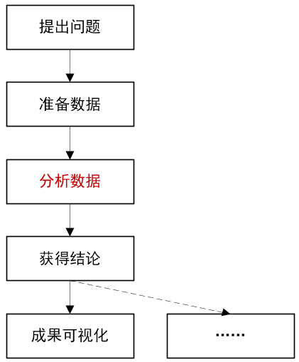

# 数据分析库

参考视频：[数据分析-numpy、pandas、matplotlib](https://www.bilibili.com/video/BV1hx411d7jb)

## Matplotlib

### 概述

为什么要学matplotlib：它能将数据进行可视化，更直观地呈现；使数据更加客观更具说服力。

而公司一般不用matplotlib，转而用前端的js框架等技术，但我们仍然要学。

matplotlib是最流行的python底层绘图库，主要做数据可视化图表，名字取自matlab，模仿matlab构建。

matplotlib可以画各种各样的普通图（折线、散点、柱状、直方、箱线、饼）、骚气图，我们可以去[官网样例](https://matplotlib.org/gallery/index.html)拷贝目标图的源码，然后调节参数或数据，就得到个性化的图像。

统计图的挑选：

- 折线图：显示数据的变化趋势，反映数据的变化情况。
- 直方图：展示一组或多组数据的分布情况。
- 条形图：比较数据间的差别。
- 散点图：判断变量之间的关联、趋势、分布规律。

### 图象设置

图片的修饰：

- 设置图片大小（想要一个高清无码大图）。
- 保存到本地。
- 描述信息，比如x、y轴各表示什么，这个图表示什么。
- 调整x、y轴的刻度（间距）。
- 线条的样式，如颜色、透明度。
- 标记特殊点，如最高点、最低点。
- 添加水印（防伪防盗）。

```python
# 调节图像参数
plt.figure(
    figsize=(20, 8),  # 图像尺寸-宽，高
    dpi=80  # 清晰度
)

# 保存图像
plt.savefig("./sig.svg")  # 矢量图，不会产生锯齿

# 设置坐标刻度
plt.xticks(range(2, 25, 1))
plt.xticks([i / 2 for i in range(4, 49)][::3])  # 列表取元素，步长为3
plt.yticks(range(min(y), max(y) + 1))

plt.xticks(  # 将坐标值映射为更易懂的唯一对应的字符串
    x[::10],
    (["10时{}分".format(i) for i in range(60)] + ["11时{}分".format(i) for i in range(60)])[::10]
)
#matplotlib默认不支持中文

# 添加描述信息
plt.xlabel("...", size=22, color="blue")
plt.ylabel("...")
plt.title("...")

# 绘制网格
plt.grid(
    alpha=0.5, # 透明度为0.5
    linestyle="--",  # 线形
)  

# 图例
plt.legend(loc="upper left")  # 位置在左上角
```

### 折线图

```python
plt.plot(
    x,
    y,
    color="cyan",  # 线条颜色
    linestyle="--",  # 线形
    label="my",  # 对应图例
    linewidth=5,  # 线条粗细
    alpha=0.5  # 透明度
)
```

### 散点图

只不过把plot函数改成scatter函数。

### 条形图

```python
# 纵向条形图
x = ["龙猫", "红猪", "千与千寻"]
y = [200, 100, 300]
plt.xticks(range(len(x)), x, rotation=90)  # x列表长度序列映射到x列表
plt.bar(
    range(len(x)),  # x列表序列作横坐标
    y,
    width=0.5  # 条子的宽度
)

# 横向条形图
y = [200, 100, 300]
plt.yticks(range(len(x)), x)  # x列表长度序列映射到x列表
plt.barh(
    range(len(x)),  # x列表序列作横坐标
    y,
    height=0.5,  # 条子的宽度
    color="orange"  # 条子的颜色
)
```

分类对比型条形图：

```python
x = ["9.1", "9.2", "9.3"]
# 三部电影三天的票房（纵坐标值）
y_1 = [200, 100, 300]
y_2 = [400, 200, 600]
y_3 = [100, 100, 200]
# 横坐标值
x_1 = range(len(x))
x_2 = [i + 0.2 for i in x_1]
x_3 = [i + 0.2 * 2 for i in x_1]
# 横坐标刻度
plt.xticks(x_2, x)
# 画条形图
plt.bar(x_1, y_1, width=0.2, label="film1")
plt.bar(x_2, y_2, width=0.2, label="film2")
plt.bar(x_3, y_3, width=0.2, label="film3")
# 三部电影图例
plt.legend(loc="upper right")
```

条形图常用于数量统计、频率统计。

### 同类工具

[Echarts](https://echarts.apache.org/examples/zh/index.html)：借助前端框架呈现数据。

[Plotly](https://plotly.com/python/)：比matplotlib更简单，图形更加漂亮，同时兼容matplotlib和pandas。

[Seaborn](https://seaborn.pydata.org/)：相较于以上两者，无动态交互效果。

###	注

随着接触的数据集越来越多，我们可能要画三维图、同窗口对比图等更复杂的图象，要么参考博客要么参考官方文档。

## Numpy

前面的基础理论我记得很少，因为主要想记录实践应用。

数据分析的流程：



那么更多内容参见一些网站文档：

- [numpy中文网](https://www.numpy.org.cn/)。

- [numpy菜鸟教程](https://www.runoob.com/numpy/numpy-tutorial.html)。

### 数组的创建

为什么要学习numpy？

- 快速。
- 方便。
- 科学计算的基础库。

什么是numpy：一个在python中做科学计算的基础库。重在数值计算，也是大部分python科学计算的基础库，多用在大型、多维数组（数组与列表、嵌套列表、矩阵是相通的）上执行数值运算。

```python
import numpy as np

t1 = np.array([1, 2, 3, ])
print(t1)
# <class 'numpy.ndarray'>
print(type(t1))

t2 = np.array(range(10))
print(t2)

# 起于4，终于9，步长为1
t3 = np.arange(4, 10, 2)
print(t3)
```

关于数据类型，详见[数据类型](https://www.numpy.org.cn/user/basics/types.html)。

```python
print("*"*100)

# python原始类型不用包上引号，扩展类型需要包，如“i1”、“float32”
t4 = np.array(range(1,4), dtype=float)
print(t4)
# float64
print(t4.dtype)

# bool类型
t5 = np.array([1, 1, 0, 1, 0, 0], dtype=bool)
# [True  True False  True False False]
print(t5)
print(t5.dtype)

# 调整数据类型
t6 = t5.astype("int8")
# [1 1 0 1 0 0]
print(t6)

# 取10个0到1的随机小数
t7 = np.array([random.random() for i in range(10)])
print(t7)

# 对t7所有元素进行四舍五入
t8 = np.round(t7, 2)
print(t8)
```

### 数组的计算

```python
# 一维数组
t1 = np.arange(12)
print(t1)
print(t1.shape)  # 个数：(12,)

# 二维数组（多个一维数组）
t2 = np.array([
    [1, 2, 3],
    [4, 5, 6]
])
print(t2)
print(t2.shape)  # (2, 3)

# 三维数组（多个二维数组）
t3 = np.array([
    [
        [1, 2, 3],
        [4, 5, 6]
    ],
    [
        [7, 8, 9],
        [10, 11, 12]
    ],
    [
        [13, 14, 15],
        [16, 17, 18]
    ]
])
print(t3)
print(t3.shape)  # (3, 2, 3)

# 改变形状
t4 = np.arange(24).reshape((2, 3, 4))  # 传入的形状参数是元组的形式，用括号包纳
print(t4)
```

注：调用有返回值的方法，原对象不发生改变。

```python
# 变为一维数组
>>> t4.reshape((24,))
>>> array([ 0,  1,  2,  3,  4,  5,  6,  7,  8,  9, 10, 11, 12, 13, 14, 15, 16,
       17, 18, 19, 20, 21, 22, 23])

#变为二维数组。比较不同参数顺序对应的结果
>>> t4.reshape((24,1))
>>> array([[ 0],
       [ 1],
       [ 2],
       [ 3],
       [ 4],
       [ 5],
       [ 6],
       [ 7],
       [ 8],
       [ 9],
       [10],
       [11],
       [12],
       [13],
       [14],
       [15],
       [16],
       [17],
       [18],
       [19],
       [20],
       [21],
       [22],
       [23]])
>>> t4.reshape((1,24))
>>> array([[ 0,  1,  2,  3,  4,  5,  6,  7,  8,  9, 10, 11, 12, 13, 14, 15,
        16, 17, 18, 19, 20, 21, 22, 23]])

# 万能转一维：shape的所有项相乘得到元素总数
>>> t4.reshape((t4.shape[0]*t4.shape[1]*t4.shape[2],))

# 更简洁的一步到位转一维
>>> t4.flatten()
```

可见得有多少行第二层就有多少个中括号。

数组与数字的计算具有广播机制，诸如`t+2`、`t-2`、`t*2`、`t/2`，那么t中的任一元素都会与2做运算。当数组除以0时，会得到类似这样的结果：

```python
# 0除以0得到nan，非0数除以0得到inf
>>> array([[[nan, inf, inf, inf],
        [inf, inf, inf, inf],
        [inf, inf, inf, inf]],
       [[inf, inf, inf, inf],
        [inf, inf, inf, inf],
        [inf, inf, inf, inf]]])

```

对两个形状完全相同的数组做加减运算时则像矩阵的加减运算一样，对应位置相加减。而乘法则不像矩阵的乘一样，它也是对应位置相乘。除法也是对应位置相除。注：关系运算符也是这种效果，即对每个元素都进行关系运算，最终得到一个布尔数组，后面还会接触到与之相关的布尔索引。

在行数或列数相同的前提下，行列数不完全相同的两个数组也做运算，可参见[numpy广播](https://www.runoob.com/numpy/numpy-broadcast.html)。可以想见行列数都不同的两个数组就无法进行计算了。

### 读取数据

#### 轴（axis）

数组的维度又叫维数又叫秩，关于轴，引用一条浅显的解释如下：

> 第一个轴相当于是底层数组，第二个轴是底层数组里的数组。

第一个轴对应axis=0，第二个轴对应axis=1，以此类推。秩等于轴总数。

对于二维数组，第一个轴是行方向，即对每一列进行处理；第二个轴是列方向，即对每一行进行处理。

#### 读取数据

以csv文件为例：

```python
content = np.loadtxt(
	us_file_path, # 文件路径（网络或本地）
    delimiter="," # 分隔符指定逗号
    dtype="int", # 指定数据类型，可避免科学计数法的形式
    unpack=True # 转置 
)
```

### 索引与切片

参考网站里有详细的示例和解释，这里举一些奇葩的：

```python
# 取第2行第5列元素
a = t[1, 4]

# 内层第一个列表为行标列表，第二个列表为列标列表，前后对应配对。这里就是取(1,1),(3,2),(3,4)这几个值，组成新数组
b = t[[0, 2, 2], [0, 1, 3]]

# 取三维数组第1块（层）第2行第1列的值
c = t1[0, 1, 0]
```

关于fancy indexing和numpy比较方面的知识还可参考[numpy中的比较和fancy indexing](https://www.bilibili.com/video/BV1gg4y167o3?p=19)。

### 修改数值

普通改法就就是借助索引和切片直接赋值。

```python
# 把t中小于3的值改为100，大于等于3的值改为300
np.where(t < 3, 100, 300)

# 保留t中10到18的值，小于10的值变为10，大于18的值变成18
t.clip(10, 18)
```

### 数组的拼接和行列交换

```python
# 沿着竖直方向拼接两个数组
np.vstack(t1, t2)
# 沿着水平分析拼接两个数组
np.hstack(t1, t2)
```

```python
# 交换两行
t1[[1, 0], :] = t1[[0, 1], :]
# 交换两列
t1[:, [0, 1]] = t1[:, [1, 0]]
```

### nan和inf

nan（NaN）：not a number，表示不是一个数值。读取文件时，缺失数据的位子为代以nan。当发生不合理的运算时（如无穷大减无穷大），也会得到nan。

任何非0数除以0会得到inf（无穷大）。

写的时候要表示成`np.nan`、`np.inf`。

```python
t5 = np.arange(24).reshape(4, 6)
# nan的类型是float
t5 = t5.astype(float)
t5[3, 4] = np.nan
# 结果是23，nan为非零数
print(np.count_nonzero(t5))
# True
print(np.nan != 0)

# nan和nan不相等
>>> t5!=t5 # 返回的不是布尔值，而是布尔数组
array([[False, False, False, False, False, False],
       [False, False, False, False, False, False],
       [False, False, False, False, False, False],
       [False, False, False, False,  True, False]])

# 返回布尔数组
>>> np.isnan(t5)
array([[False, False, False, False, False, False],
       [False, False, False, False, False, False],
       [False, False, False, False, False, False],
       [False, False, False, False,  True, False]])

# 任何数或nan跟nan做运算都得nan
>>> np.sum(t5)
nan

# 各列求和
>>> np.sum(t5,axis=0)
array([36., 40., 44., 48., nan, 56.])
# 各行求和
np.sum(t5,axis=1)
array([15., 51., 87., nan])
```

### 常用统计函数

面对包含nan的数组，我们不能简单地将其替换为0，因为这可能影响均值等统计量。可以代之以均值或中值（中位数）。由此引出一些常用统计函数。

常用函数包括求和、求均值、标准差等等，详见[统计相关](https://www.numpy.org.cn/reference/routines/statistics.html#order-statistics)。

下面是个小题目：

```python
# 针对t5，检查哪一列有nan，有就把该列均值填到nan的位置上
for i in range(t5.shape[1]):  # 遍历各列
    current_column = t5[..., i]  # 取当前列。t5[..., i]也可写成t5[:, i]
    nan_number = np.count_nonzero(current_column != current_column)  # 算当前列中nan个数
    if nan_number != 0:  # 存在nan
        no_nan_current_column = current_column[current_column == current_column]  # 取去nan的当前列
        no_nan_current_column_mean = no_nan_current_column.mean()  # 求均值
        current_column[np.isnan(current_column)] = no_nan_current_column_mean  # 将均值填入nan位置
```

### 注

numpy.random.rand。

numpy.partition。

可用numpy.random.choice作无放回抽样。

将arg套在一系列函数名前可得到该函数结果值对应索引的结果。

## Pandas

### 概述

为什么要学pandas？因为相较于numpy，它能处理更广泛的非数值型数据，如字符串、时间序列。

定位：高性能（high-performance）、易使用（easy-to-use）的数据结构及数据分析工具。

常用数据类型：

- Series：一维数组，带标签。
- Dataframe：二维数组，Series的容器，带两个标签。

### Series

#### 创建

```python
import pandas as pd

t = pd.Series(
    [1, 23, 2, 2, 1],
    index=list("abcde"),  # 标签。数目应和数组长度相等
)
print(t)
# 结果
a     1
b    23
c     2
d     2
e     1
dtype: int64
```

可以看出，它很像python里的字典，而确实可以通过字典创建series：

```python
# 通过字典创建series
temp_dict = {
    "name": "小红",
    "age": 30,
    "tel": 10086,
}
t = pd.Series(temp_dict)
print(t)
# 结果
name       小红
age        30
tel     10086
dtype: object
```

```python
# 重新指定series的索引（键），若有对应的则取值，否则取nan
a = {
    "A": 0,
    "B": 1,
    "C": 2,
    "D": 3
}
print(pd.Series(a))
print(pd.Series(a, index=list(string.ascii_uppercase[3:8])))
# 结果
A    0
B    1
C    2
D    3
dtype: int64
D    3.0
E    NaN
F    NaN
G    NaN
H    NaN
dtype: float64
```

numpy中nan的类型是float，pandas会根据数据类型更改series的dtype类型。

```python
# 改变元素数据类型
t.astype("int64")
t.astype(float)
```

#### 切片和索引

```python
# 按键取
>>> t["name"]
'小红'
>>> t["age"]
30
>>> t[["name", "age"]] # 组合键
name    小红
age     30
dtype: object
    
# 按下标取
>>> t[0]
'小红'
>>> t[:2] # 前两项
name    小红
age     30
dtype: object
>>> t[[0, 2]] # 不连续取
name       小红
tel     10086
dtype: object
```

布尔索引作用于值。

#### 索引和值

```python
# 打印键
>>> t.index
Index(['name', 'age', 'tel'], dtype='object')

# 遍历键
>>> for i in t.index:
...     print(i)
... 
name
age
tel

# 键的类型
>>> type(t.index)
<class 'pandas.core.indexes.base.Index'>

# 键可迭代，故能转为列表
>>> list(t.index)
['name', 'age', 'tel']

# 值及其类型
>>> t.values
array(['小红', 30, 10086], dtype=object)
>>> type(t.values)
<class 'numpy.ndarray'>
```

由于numpy和pandas很类似，numpy中的很多方法在pandas里也有，但有些方法的执行结果是不同的，比如where。各方法详情参见API文档。

### DataFrame

#### 创建

pandas可读取外部数据，数据可能存在csv文件中，我们用`pd.read_csv`方法来读，得到一个DataFrame对象。数据也可存在数据库中，我们用`pd.read_sql`方法来读。

```python
# 读取csv文件
dog_names = pd.read_csv("dognames2.csv")
print(dog_names)
```

DataFrame长得挺别致：

```python
t = pd.DataFrame(np.arange(12).reshape(3, 4))
print(t)
# 结果
   0  1   2   3
0  0  1   2   3
1  4  5   6   7
2  8  9  10  11
```

可见得，除了数据外，它还带着一个行索引（0轴）和列索引（1轴）。我们可以指定行列索引：

```python
>>> t = pd.DataFrame(np.arange(12).reshape(3, 4), index=list("abc"), columns=list("1234"))
>>> t
   1  2   3   4
a  0  1   2   3
b  4  5   6   7
c  8  9  10  11
```

可通过字典、列表等数据结构构造DataFrame：

```python
# 列表作值
d = {
    "name": ["Bob", "Tom"],
    "age": [20, 22],
    "tel": [10086, 10010]
}
t = pd.DataFrame(d)
print(t)
# 结果。字典无序，列表有序
  name  age    tel
0  Bob   20  10086
1  Tom   22  10010

# 字典列表
d = [
    {"name": "Bob", "age": 20, "tel": 10086},
    {"name": "Tom", "age": 22, "tel": 10010},
    {"name": "John", "age": 18, "tel": 10085}
]
t = pd.DataFrame(d)
print(t)
# 结果
   name  age    tel
0   Bob   20  10086
1   Tom   22  10010
2  John   18  10085
```

可见得，无论嵌套组合得多复杂，只要满足一定的二维结构，pandas都能智能地转化为DataFrame。

#### 属性和方法

```python
# 行索引
>>> t.index
RangeIndex(start=0, stop=3, step=1)
# 列索引
>>> t.columns
Index(['name', 'age', 'tel'], dtype='object')
# 值
>>> t.values
array([['Bob', 20, 10086],
       ['Tom', 22, 10010],
       ['John', 18, 10085]], dtype=object)
# 具体维度
>>> t.shape
(3, 3)
# 数据类型
>>> t.dtypes
name    object
age      int64
tel      int64
dtype: object
# 维数
>>> t.ndim
2
```

