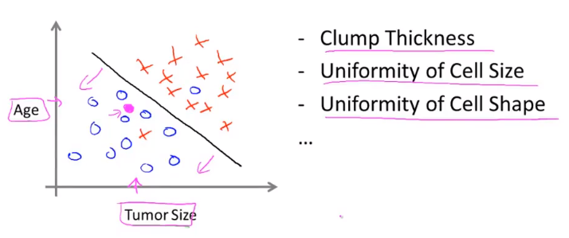

机器学习

主讲：吴恩达。

参考视频：[[中英字幕]吴恩达机器学习系列课程](https://www.bilibili.com/video/BV164411b7dx?spm_id_from=333.999.0.0)。

## 欢迎辞

课程目标：学习先进的机器学习（Machine Learning）技术并在实践中实现和实现这些算法。

我们没有意识到每天都在多次使用学习算法：

- Google或Bing给我们展示令人满意的搜索结果。
- Facebook或Apple能对我们的照片进行分类与识别。
- 垃圾邮件过滤器能帮我们过滤大量垃圾邮件。

我们不光要理解、会写算法，还需认识其背后的数学原理。

机器学习是从AI（人工智能）发展出来的一个领域，是为计算机开发的一项新功能。我们原来借助计算机完成一些基本的操作，但我们想它能够做一些更有趣的事情，如上述搜索、标识照片等等。它涉及工业和基础学科中的诸多领域，应用领域也甚广。比如在一周之内，一个机器学习研究者可能跟飞行员、生物学家等不同行业的工作者讨论。

机器学习的应用：

- 数据挖掘（Database mining）：比如在网络方面收集浏览数据并采用机器学习算法来挖掘数据，以更好地理解用户、为用户服务；在医疗方面，收集医疗记录并进行分析，就能更好地理解疾病；在生物学方面，生物学家们通过自动化收集基因序列、DNA序列等大量数据并分析，就能更好地理解人类基因组。还有工程技术领域等诸多领域的实例。
- 编写人无法编写的程序应用：比如直升机的自动飞行；手写识别；自然语言处理（Natural Language Processing-NLP）、计算机视觉等AL中理解语言或图像的领域。
- 私人订制的程序：譬如亚马逊、iTunes给我们推荐的商品或娱乐作品。
- 理解人的学习或大脑（这才是真正的AI）。

## 机器学习定义

我们将试着定义机器学习并了解在什么情况下使用它。

机器学习没有统一的定义。

Arthur Samuel下的定义：Field of study that gives the computers the ability to learn without being explicitly programmed. 让计算机在无明确设定（编码）的条件下自学习。

Tom Mitchell: A computer program is said to learn from experience E with respect to some task T and some performance measure P, if its performance on T, as measured by P, improves with experience E. 对于某项任务，经验越多，成功率就越高。

比如拿Samuel自己的例子来说。他写了一个跳棋程序，任务T就是玩跳棋，P就是获胜几率，E就是计算机跟玩家的对弈次数，那么计算机玩跳棋的胜率会随着下棋次数的增大而升高（基于T的E越大，基于T的P就越高），这里面就体现了计算机的学习（具体可能是分析布局）能力。

举一个生活中的例子-标记垃圾邮件。将邮件归类为垃圾邮件或非垃圾邮件为任务T，观察用户将诸邮件标记为垃圾邮件或非垃圾邮件就是经验E，正确归类为垃圾邮件或非垃圾邮件的邮件的数目或比率就是性能量度P。

## 课程目标

学习算法有很多种，最主要的两类是监督学习（Supervised learning）-教计算机做某件事和无监督学习（Unsupervised learning）-让计算机自学习，其他的比如强化学习（Reinforcement learning）和推荐系统（Recommender systems）。本课程主要介绍监督学习和非监督学习，此外，还会讨论应用学习算法的实际性建议。

## 监督学习

### 回归

一个监督学习（supervised learning）的实例：现有一张房价-面积散点图如下：


我们可以基于这些数据拟合出一条直线，然后估测750平方英尺的房子的价格。当然直线不是唯一的，还可用其他的一些算法拟合出二次函数或二阶多项式。

由上得出监督学习就是人先给定一个正确的数据集，然后制定算法让计算机算出更多的结果。有个更专业的术语叫回归（Regression: predict continuous valued output）即预测连续值。

另一个实例：乳腺癌（乳腺肿瘤）的样本图如下：


这跟上一个例子不同的地方在于预测结果不是连续的，而是离散的。所谓连续是指结果值可能不在现有的结果集中，且结果集往往很大；那反之，离散就是结果值一定在现有的结果集中，且结果集往往很小。

### 分类

由这个例子得出的专业术语叫分类（Classification: discrete valued output）即预测离散值。

进一步地，还可以让乳腺癌样本带上一些特征参数，如下图：



左图中仅两个参数，呈现了良性肿瘤和恶性肿瘤各自的区域，于是可划出一条直线，而后根据新的样本-肿瘤大小是多少、年龄是多少来估测肿瘤的阴阳性。右边则给出了更多的特征，现如今，我们能够制定算法，对带无穷多个特征的样本数据进行分析、预测。

## 无监督学习

### 聚类算法

基于之前的乳腺癌的例子，无监督学习（unsupervised learning）所给定的样本图可能是这样的：


即我们尚不清楚结果是阴性或阳性，那么根据无监督学习，这些结果可能被分成两个簇，相关的算法就叫聚类算法（clustering algorithms），应用聚类算法的典例是谷歌新闻，谷歌对成千上万条新闻进行分类，归于不同的标签，同类就被显示在一起。

另一个例子是一个DNA微阵列数据，系统可以通过聚类算法对大量个体的基因序列进行分析比较，而后归结出几大簇，尽管我们实现并没有指定分几个簇、各个簇都叫什么-所谓的正确答案，我们只是给定一大堆本来毫无关联的基因序列。

无监督学习或聚类算法的其他应用：组织大规模的计算机集群，让类型趋同的计算机在一起，从而更加高效地处理数据；分析社交网络，判断哪些人互相认识；分析市场，将企业的客户群分成更小的群体从而指定更细化、针对性更强的销售计划；分析天文，总结出星系形成理论。

总之，聚类是无监督学习的一种，机制是对机器数据进行分类，然后我们人才能观察各个类别，得出类型名。

### 鸡尾酒会算法

这个非主流的名字（cocktail party algorithm）来自于一个鸡尾酒会场景，场景就不赘述了。简单而言，就是从麦克风收集到的一段复合音频（音源不唯一）中提取出几段不同的音频。

想来代码肯定很多，但其实利用某些特定的编程环境（Octave、Matlab等）只需写一行，而且很多貌似很复杂的算法都只需几行代码实现，当然，基于C++、Java或Python的话就不是这么简单了。于是本课程会用Octave来进行算法的实现，而不用基础语言，因为对于入门者来说，效率是很重要的。

## 回归详解

### 模型描述

第一个学习算法-线性回归（linear regression）。从中我们会看到模型是什么样的及监督学习的全过程。

结果集更专业的叫法是训练集（training set），我们约定一些符号如下图：


线性函数的拟合是基础，在此基础上以后我们再更深入地处理更复杂的模型，学习更复杂的学习算法。下面会手动实现一元线性回归的拟合。

### 代价函数

#### 定义

下图阐释了代价函数（cost function）的数学定义：


注：除以2是为了方便之后求导约分。

代价函数又叫平方误差函数（square error function)。

#### 原理

上一节梳理：


代价函数简化式的计算及绘制示例如下：


代价函数原式的图像绘制如下：


它是一个3D曲面图，曲面在某一点的高度就是代价函数值。

我们往往更爱用下面这样的等高线图来表达：


同一椭圆上的点对应的代价函数值是相同的。距离诸椭圆中心点越近，该点作参数构成的假设函数的拟合就越好，像图中所标注的点的参数值是-0.15和800，拟合效果就不是很好。

那么我们需要能够算出那个椭圆中心对应的参数值及代价函数最小值。

### 梯度下降

本节将介绍一种很常用的算法-梯度下降（gradient descent），主要作用是最小化函数。

下图是对它的梗概：


俩参数同步更新是梯度下降算法的特点。

α控制以多大的幅度更新参数，其后接一个导数项，我们需理解它们拼在一起有啥用。


那么越接近最低点，导数项会越来越小，即梯度下降算法会自动地减小参数更新的幅度，而我们无需对α作调整。

还是回到两个参数（一个特征，x无下标）的情况，要分别对俩参数求偏导数：


### 线代基础

基础知识省略。

关于矩阵乘法，它在监督学习中的应用如下：


### 多特征

针对多特征（multiple features）的情况，我们作进一步处理，如下：


### 多元梯度下降法

即gradient descent for multiple variables。特征数量业已增多，那么前面所做的推导也应更新（x带下标）。


可看出上述过程属多元线性回归。

#### 特征缩放

以两个特征的情况为例，代价函数的图像可用等高线表示，诸等高线是扁椭圆形的，这不利于找到最低点，最终形成的探索轨迹是振荡的。我们可通过将诸特征值进行一定比例的缩放来使得等高线成正圆（诸特征值互相接近），这样找最低点的效率会更高，此做法即特征缩放（feature scaling）。

均值归一化（mean normalization）：特征缩放的一种方式，具体见下：


特征缩放并不需要太精确，只是为了能更好地进行梯度下降。

关于归一化理解，可参考以下文章：

[什么是数据归一化，数据为什么要做归一化处理](https://blog.csdn.net/u010916338/article/details/78436760)。

[为什么要对数据进行归一化处理？](https://zhuanlan.zhihu.com/p/27627299)

#### 学习率

数学家已证明，只要α足够小，每次迭代之后代价函数就会下降。当然我们也不希望α相当小，这样就会使代价函数收敛得很慢。

选定、调整学习率（learning rate）的工作可交给计算机来做。

### 一元多项式回归

看个房价预测的例子：


### 正规方程

正规方程（normal equation）是区别于迭代方法的直接解法，即一次性求解$\Theta$的最优值。


梯度下降和正规方程的比较：

| 梯度下降               | 正规方程                                                   |
| ---------------------- | ---------------------------------------------------------- |
| 需要选定$\alpha$       | 无需选定$\alpha$                                           |
| 需要多次迭代           | 不需要迭代                                                 |
| 即使特征相当多也很有用 | 特征相当多，计算会很慢，如计算$X^TX$的时间复杂度为$O(n^3)$ |

正规方程在矩阵不可逆情况下的解决方法：


### Octave

#### 基本操作

```octave
%加
>> 5+6
ans =  11
%减
>> 3-2
ans =  1
%乘
>> 5*8
ans =  40
%除
>> 1/2
ans =  0.50000
%乘方
>> 2^6
ans =  64
%判断相等
>> 1==2
ans = 0
%判断不等
>> 1~=2
ans = 1
%逻辑与
>> 1&&0
ans = 0
%逻辑或
>> 1||0
ans = 1
%逻辑异或
>> xor(1,0)
ans = 1
%给变量赋值
>> c=3
c =  3
%分号阻止即时输出
>> a="hello";
>> a
a = hello
%圆周率
>> d=pi;
>> d
d =  3.1416
%显示命令
>> disp(d)
 3.1416
%旧式C语言语法里的格式化输出
>> disp(sprintf("2 decimals: %0.2f",d))
2 decimals: 3.14
>> disp(sprintf("6 decimals: %0.6f",d))
6 decimals: 3.141593
%打印少量的小数点后位数
>> format short
>> d
d =  3.1416
%打印大量的小数点后位数
>> format long
>> d
d =  3.141592653589793
%矩阵。分号分隔每一行
>> A=[1,2;3,4;5,6]
A =

   1   2
   3   4
   5   6

>> A=[
1,2;
3,4;
5,6]
A =

   1   2
   3   4
   5   6

%行向量
>> v=[1 2 3]
v =

   1   2   3

%列向量
>> v=[1;2;3]
v =

   1
   2
   3

%元素为1到2（步长为0.1）的行向量
>> v=1:0.1:2
v =

 Columns 1 through 6:

    1.000000000000000    1.100000000000000    1.200000000000000    1.300000000000000    1.400000000000000    1.500000000000000

 Columns 7 through 11:
                                                                                                                                                  
    1.600000000000000    1.700000000000000    1.800000000000000    1.900000000000000    2.000000000000000

%元素为1到6（步长为默认1）的行向量
>> v=1:6
v =

   1   2   3   4   5   6

%元素为1的矩阵
>> ones(2,3)
ans =

   1   1   1
   1   1   1

>> C=2*ones(2,3)
C =

   2   2   2
   2   2   2

%元素为0的矩阵
>> w=zeros(1,3)
w =

   0   0   0

%元素为0到1之间的随机值的矩阵
>> w=rand(1,3)
w =

   9.843477801176019e-01   3.028241409008905e-01   6.772770318237605e-01

%元素为正态分布随机变量的矩阵。这些变量的均值为0，方差或标准差为1
>> W=randn(3,3)
W =

  -5.904639669676255e-01  -5.354677128868288e-01  -9.626998924171741e-01
   1.148550497937155e+00  -1.006299861988454e+00   9.617019934053010e-01
   1.036551848332681e+00   8.179050742013798e-01   5.206872122524813e-01
   
%一个复杂的有10000个元素的行向量
>> w=-6+sqrt(10)*(randn(1,10000));
%绘制直方图
>> hist(w)
%设定直方数为50
>> hist(w,50)
%4阶单位阵
>> I=eye(4)
I =

Diagonal Matrix

   1   0   0   0
   0   1   0   0
   0   0   1   0
   0   0   0   1

%显示有关单位矩阵的帮助函数
>> help eye
```

#### 移动数据

```octave
>> A=[1,2;3,4;5,6];
%矩阵的维度（几行几列）
>> size(A)
ans =

   3   2

%行数
>> size(A,1)
ans =  3
%列数
>> size(A,2)
ans =  2
%向量长度
>> v=[1,2,3,4];
>> length(v)
ans =  4
%命令行当前所在路径
>> pwd
ans = C:\Users\21708
%列出当前目录里的文件
>> ls
%加载文件，导入数据
>> load featuresX.dat
%或 
>> load('xxx.dat')
%显示featuresX中的数据
>> featuresX
%显示featuresX数据（矩阵）的维度
>> size(featuresX)
%展示当前ocatve在内存中储存的所有变量
>> who
Variables in the current scope:

A    I    ans  v    w

%显示关于变量更详细的信息
>> whos
Variables in the current scope:

   Attr Name        Size                     Bytes  Class
   ==== ====        ====                     =====  =====
        A           3x2                         48  double
        I           4x4                         32  double
        ans         1x1                          8  double
        v           4x1                         32  double
        w           1x10000                  80000  double

Total is 10027 elements using 80120 bytes

%删除featuresX变量（及其数据）
>> clear featuresX	
%将priceY的前10个数据赋给v
>> v=priceY(1:10)
%将v保存到二进制格式的文件中
>> save hello.mat v;
%清除当前工作空间里的所有变量
>> clear
%将v保存到文本格式的文件中
>> save hello.txt v -ascii
%取第3行第2列元素，A为任意矩阵
>> A（3,2）
ans =  6
%取第2行的所有元素，得行向量
>> A(2,:)
ans =

   3   4

%取第2列的所有元素，得列向量
>> A(:,2)
ans =

   2
   4
   6

%取第1、3行的所有元素
>> A([1,3],:)
ans =

   1   2
   5   6

%给第2列赋新值
>> A(:,2)=[10;11;12]
A =

    1   10
    3   11
    5   12

%加一列
>> A=[A,[100;101;102]]
A =

     1    10   100
     3    11   101
     5    12   102

%将矩阵的所有元素放入一个列向量
>>A(:)
ans =

     1
     3
     5
    10
    11
    12
   100
   101
   102

%自左向右拼合两个矩阵
>> A=[1 2;3 4;5 6];
>> B=[11 12;13 14;15 16];
>> C=[A B] %或C=[A,B]
C =

    1    2   11   12
    3    4   13   14
    5    6   15   16

%自上向下拼合两个矩阵
>> C=[A;B]
C =

    1    2
    3    4
    5    6
   11   12
   13   14
   15   16

```

#### 计算数据

```octave
>> A=[1 2;3 4;5 6];
>> B=[11 12;13 14;15 16];
>> C=[1 1;2 2];
%矩阵乘法
>> A*C
ans =

    5    5
   11   11
   17   17

%同索引元素相乘
>> A.*B
ans =

   11   24
   39   56
   75   96

%对每个元素作乘方运算
>> A.^2
ans =

    1    4
    9   16
   25   36

%对每个元素求倒数
>> v=[1;2;3];
>> 1./v
ans =

   1.00000
   0.50000
   0.33333

%取以2为底、以每个元素为真数的对数
>> log(B)
ans =

   2.3979   2.4849
   2.5649   2.6391
   2.7081   2.7726

%得以自然常数e为底，以每个元素为指数的幂
>> v=[1 2 3];
>> exp(v)
ans =

    2.7183    7.3891   20.0855

%对每个元素取绝对值
>> abs([-1 -2 -3])
ans =

   1   2   3

%对每个元素取相反数
>> -v
ans =

  -1  -2  -3

%所有元素加1
>> v=[1;2;3];
>> v+ones(length(v),1)
ans =

   2
   3
   4

>> v+1 %更简便的方式
ans =

   2
   3
   4

%求转置
>> A'
ans =

   1   3   5
   2   4   6

%求转置的转置
>> (A')'
ans =

   1   2
   3   4
   5   6

%求最大值
>> a=[1 15 2 0.5]
a =

    1.00000   15.00000    2.00000    0.50000

>> val=max(a)
val =  15
>> [val,ind]=max(a) %最大值及其下标
val =  15
ind =  2
>> max(A) %每列的最大值（一般而言，矩阵由列向量拼成）
ans =

   5   6

%每个元素作比较，1为真；0为假
>> a<3
ans =

  1  0  1  1

%查找符合条件的元素，返回下标
>> find(a<3)
ans =

   1   3   4

%幻方函数
>> D=magic(3)
D =

   8   1   6
   3   5   7
   4   9   2

%查找满足条件的元素，返回其行列索引
>> [r,c]=find(D>=7)
r =

   1
   3
   2

c =

   1
   2
   3

%对所有元素求和
>> sum(a)
ans =  18.500
%对所有元素求积
>> prod(a)
ans =  15
%对全体元素下取整
>> floor(a)
ans =

    1   15    2    0
%对全体元素上取整
>> ceil(a)
ans =

    1   15    2    1

%求第1个维度（列）的最大值
>> max(D,[],1)
ans =

   8   9   7

%求第2个维度（行）的最大值
>> max(D,[],2)
ans =

   8
   7
   9

%求最大值
>> max(max(D))
ans =  9
>> max(D(:)) %另一种方法
ans =  9
%按列（行）求和
>> D=magic(9)
D =

   47   58   69   80    1   12   23   34   45
   57   68   79    9   11   22   33   44   46
   67   78    8   10   21   32   43   54   56
   77    7   18   20   31   42   53   55   66
    6   17   19   30   41   52   63   65   76
   16   27   29   40   51   62   64   75    5
   26   28   39   50   61   72   74    4   15
   36   38   49   60   71   73    3   14   25
   37   48   59   70   81    2   13   24   35

>> sum(D,1)
ans =

   369   369   369   369   369   369   369   369   369

>> sum(D,2)
ans =

   369
   369
   369
   369
   369
   369
   369
   369
   369

%按主对角线求和
>> sum(sum(D.*eye(9)))
ans =  369
%按副对角线求和
>> sum(sum(D.*flipud(eye(9))))
ans =  369
%求逆
>> D=magic(3);
>> pinv(D)
ans =

   0.147222  -0.144444   0.063889
  -0.061111   0.022222   0.105556
  -0.019444   0.188889  -0.102778
%与逆阵相乘得近似单位阵
>> pinv(D)*D
ans =

   1.0000e+00   2.0817e-16  -3.1641e-15
  -6.1062e-15   1.0000e+00   6.2450e-15
   3.0531e-15   4.1633e-17   1.0000e+00

```

#### 数据绘制

```octave
%正弦图
>> t=[0:0.01:0.98];
>> y1=sin(2*pi*4*t);
>> plot(t,y1)
```

所绘正弦图象如下：


```octave
%余弦图
>> y2=cos(2*pi*4*t);
>> plot(t,y2)
```

所绘余弦图如下：


```octave
%两个图象一起显示
>> plot(t,y1);
>> hold on;
>> plot(t,y2,'r')
>> xlabel('time') %x轴标签
>> ylabel('value') %y轴标签
>> title('my plot') %标题
>> print -dpng 'myPlot.png' %保存到当前工作目录
>> close %关闭绘图窗口
```

图象如下：


```octave
%用两个窗口分别展示两个图象
>> figure(1);plot(t,y1);
>> figure(2);plot(t,y2);
```

```octave
%将一个窗口的布局设计为1行2列，分别绘制图象
>> subplot(1,2,1); %访问第1个图象
>> plot(t,y1);
>> subplot(1,2,2); %访问第2个图象
>> plot(t,y2);
>> axis([0 0.5 -1 1]); %修改第2个图象坐标的范围：x自0到0.5，y自-1到1
```

```octave
%清空窗口
clf;
%将矩阵以彩图的形式展现
A =

   17   24    1    8   15
   23    5    7   14   16
    4    6   13   20   22
   10   12   19   21    3
   11   18   25    2    9

>> imagesc(A)
%将矩阵以灰度图的形式展现
>> imagesc(A),colorbar,colormap gray;
```

注：逗号分隔的命令会被依次执行并打印结果。

彩图和灰度图见下：


#### 控制语句和函数

for循环：

```octave
%填充向量
>> for i=1:10,
     v(i)=2^i;
   end;
>> v
v =

      2
      4
      8
     16
     32
     64
    128
    256
    512
   1024

>> indices=1:10
indices =

    1    2    3    4    5    6    7    8    9   10

%遍历indices向量
>> for i=indices,
     disp(i);
   end;
 1
 2
 3
 4
 5
 6
 7
 8
 9
 10
```

while循环：

```octave
%将向量v的前5个元素变为100
>> i=1;
>> while i<=5,
     v(i)=100;
     i=i+1;
   end;
>> v
v =

    100
    100
    100
    100
    100
     64
    128
    256
    512
   1024

%夹杂if语句。将向量v的前5个元素变为999
>> i=1;
>> while true,
     v(i)=999;
     i=i+1;
     if i==6,
       break;
     end;
   end;
>> v
v =

    999
    999
    999
    999
    999
     64
    128
    256
    512
   1024

```

if语句：

```octave
>> if v(1)==1,
     disp('The value is 1');
   elseif v(1)==2,
     disp('The value is 2');
   else
     disp('The value is not 1 or 2');
   end;
The value is 2
```

定义函数：在当前工作目录新建一个名为squareThisNumber.m的文件，写入：

```octave
function y=squareThisNumber(x)
y=x^2;
```

再在octave命令行里输入：

```octave
>> squareThisNumber(5)
ans =  25
```

多返回值函数：

```octave
function [y1,y2]=suqareAndCubeThisNumber(x)
y1=x^2;
y2=x^3;
```

 下面结合之前学的理论构造代价函数：

```octave
%训练样本值
>> x=[1 1;1 2;1 3]
x =

   1   1
   1   2
   1   3

>> y=[1;2;3]
y =

   1
   2
   3

%θ
>> theta=[0;1]
theta =

   0
   1

%计算J值
>> j=costFunctionJ(X,y,theta)
j = 0
%另一个θ
>> theta=[0;0]
theta =

   0
   0
   
>> j=costFunctionJ(X,y,theta)
j =  2.3333
```

#### 向量化（vectorization）

向量化能够让octave的程序运行得更快，让代码更简单更有效。

无论是octave还是其他语言，都有内置的或易获取的线性代数库，它们都高度优化，由数值分析的专业人士开发。通常，我们用（联合调用）这些现有的库来实现机器学习算法，并借助计算机中可能有的并行硬件系统，以让程序运行得更高效；另外，用库还减少我们的代码量，让程序结构更为简单清晰，出错的可能性也更小。


## 分类详解

### 概述

现在研究y是离散值情况下的分类问题。开发逻辑回归（logistic regression）算法。逻辑回归针对离散值；线性回归针对连续值。

分类问题实例：

- 邮件：垃圾/非垃圾？
- 线上交易：诈骗/非诈骗？
- 肿瘤：良性/恶性？

以上例子的y均为取两个值的变量。

总结如下：


应注意到把线性回归应用到分类问题上不是一个好主意，因为不但效果不好而且预测值常常落到值域之外（如取不到0或1）。

### 假设描述

下面讨论逻辑回归算法的细节，即遇到一个分类问题，用什么样的方程来表述假设。


### 决策边界

容易想到：线性回归的图象是直接预测线，逻辑回归的图象是概率分布划分线。


最后两个式子让人联想到感知机，决策边界就相当于分离超平面（separating hyperplane）。

下面是一个基于两个特征的实例分析：


下面看一个更复杂的实例-非线性的决策边界（decision boundary）：


除上面的之外，还有长得更复杂的决策边界，这里暂不赘述。

### 代价函数

下面研究如何拟合逻辑回归模型的参数θ，跟回归中采用的方法一样，需借助代价函数。


那么为了让代价函数由非凸函数变成凸函数，我们需作出改进：


简化代价函数和梯度下降：


### 高级优化

对于特征极多的大型机器学习问题，梯度下降算法是不够好，我们提出一些更优良、让回归运行更快的高级优化（advanced optimization）算法和高级优化概念。

它们有：

- Conjugate descent。
- BFGS。
- L-BFGS。

相较于梯度下降算法，它们的优点是不需要选定α且往往更快，缺点是实现过程更加复杂。

它们的底层原理和实现尚难理解，属数值分析的范畴，故我们会应用即可。

下面是一个例子：


注：fminunc: finds a local minimum of a function of several variables.

用octave实现如下：

```octave
%在工作目录中创建fminunc.m文件
function [ jVal, gradient] = costFunction(theta)
jVal = (theta(1) - 5) ^ 2 + (theta(2) - 5) ^ 2;
gradient = zeros(2, 1);
gradient(1) = 2 * (theta(1) - 5);
gradient(2) = 2 * (theta(2) - 5);
```

```octave
%在octave中输入
>> options = optimset('GradObj', 'on', 'MaxIter', '100');
>> initialTheta = zeros(2, 1);
>> [optTheta, functionVal, exitFlag] = fminunc(@costFunction, initialTheta, options);
%结果
optTheta =

   5.0000
   5.0000

functionVal =    1.5777e-30
exitFlag =  1
```

上面这个例子中的代价函数式自己给定的，那么针对一般的情况，函数值和梯度仍是依靠代码得出：


### 多元分类

本节讨论如何用逻辑回归算法解决多类别分类（或多元分类-multi-class classification）问题，具体来说即一个叫做一对多的算法。

举一些多类别的实例：

- 给邮件集打标签：工作、朋友、家庭、爱好等。
- 鼻塞诊断：没病、感冒、着凉等。
- 天气：晴天、多云、雨天、雪天等。

附带讲，类别y的下标从0开始取或从1开始取并不重要。


## 过拟合

线性回归和逻辑回归能有效地解决许多问题，但当它们应用于特定的机器学习应用时，会遇到过度拟合（overfitting）的问题，我们将讨论一种称作正则化（regularization）的技术，它可以改善或减少过度拟合问题，以使得学习算法更好地起作用。

先举一个关于线性回归的过拟合例子：


简而言之，过拟合的意思是非常适应现有的样本，而不适应预测样本。即跟现有数据贴合得非常好，但很难预测。

下面举一个关于逻辑回归的例子：


那么如何解决过度拟合问题呢？

事实上，当特征变量很多时，绘制变得很难，而且通过数据可视化来决定保留哪些变量也变得更难。如果我们有很多的特征变量，而样本很少，那么就会出现过度拟合问题。

解决方法：

- 减少特征数量：既可人工筛选、舍弃特征，也可用模型选择算法（model selection algorithm）。
- 正则化：保留所有特征（所有特征都很重要，都对结果有影响），但减小量级或参数θ。

## 正则化

### 线性回归的正则化

直观的例子：


如上所述，加入惩罚项并减小参数值让曲线更平滑，避免过度拟合问题的出现，简化假设模型。

而还有一种情况是，对于所有的特征，我们尚无法选定哪些的相关性较小从而令其趋于0，那么可以缩小所有特征变量，分析如下：


前面已讨论过基于梯度下降算法和正规方程实现的线性回归，那现在要研究正则化的线性回归。

经过正则化的梯度下降算法如下：


经过正则化的正规方程算法如下：


### 逻辑回归的正则化

同样给一个直观的例子：


梯度下降正则化如下：


最终我们应用代码来实现：


## 神经网络

### 非线性假设

自此我们开始讨论神经网络（neurons network），它属于非线性假设（non-linear hypotheses）。神经网络实际上是一个相对古老的算法，后来沉寂了一段时间，不过现在，它又成为许多机器学习问题的首选技术。

对于很多实际的机器学习问题，特征个数是很大的。

譬如一个计算机视觉方面的问题，假设你想用机器学习算法来训练一个分类器来检测图像，如判断一个图象是否是汽车。计算机视觉的难处在于对计算机而言，图像到底被分析成什么样，与人眼对比如下图：


当我们用机器学习算法构造一个汽车识别器时，我们需要提供一个带标签的样本集，一部分样本是汽车，另一部分则不是，然后将这个样本集输入给一个算法以训练出一个分类器，最后我们输入一张新图片进行测试。理想情况下，分类器能分辨出这是不是一辆汽车。

如果用逻辑回归来做图像识别等工作，那么特征量会过于庞大（比如有平方项、立方项），导致计算成本太高。

### 神经元与大脑

神经网络算法由来已久，它产生的初衷是制造出能模拟人类大脑的机器。本节重在了解一下神经网络的背景知识。具体看视频，没有干货。

### 模型描述

对神经元的数学描述：


对神经网络的数学描述：


对上述诸表达式进行矢量化：


从中可看出逐级运算的过程。

级别更多的模型：


### 直观案例

例子是借助神经网络实现同或（XNOR）或异或（XOR）逻辑。


相关的应用有手写数字识别。

### 多元分类


### 反向传播算法

一如既往，我们需找出代价函数的最小值，通过计算对各系数θ的偏导项，那么如何计算这些偏导项呢？借助反向传播算法（backpropagation algorithm）：


### 理解反向传播

先回顾以下正向传播：


然后理解反向传播到底是在做什么？


### 参数矩阵的展开与恢复

简单而言，就是矩阵变向量，向量再变回矩阵。


譬如有如下神经网络：


那么这些矩阵需要打开，进而以向量形式传入函数：

```octave
ThetaVec = [Theta1(:); Theta2(:)];
DVec = [D1(:); D2(:)]
```

最后它们又需要恢复成原来的矩阵：

```octave
Theta1 = reshape(thetaVec(1 : 110), 10, 11);
Theta2 = reshape(thetaVec(111 : 121), 1, 11);
```

Learning Algorithm：

1. 初始现有参数$\Theta^{(1)},\Theta^{(2)},\Theta^{(3)}$。
2. 将它们展开成initialTheta以传入`fminunc(@costFunction, initialTheta, options)`。
3. `function[jval, gradientVec] = costFunction(thetaVec)`。
4. 由thetaVec恢复得到$\Theta^{(1)},\Theta^{(2)},\Theta^{(3)}$。
5. 用前向或后向传播计算出$D^{(1)},D^{(2)},D^{(3)}$。
6. 将$D^{(1)},D^{(2)},D^{(3)}$展开得到gradientVec。

### 梯度检测

前面讨论了如何在神经网络中使用前向传播和反向传播计算导数。反向传播算法由于有许多细节，故实现起来比较困难，而且该算法在跑的过程中可能存在小bug，致使损失函数看起来在收敛但最终会比无bug的值多出一个数量级。出现bug的原因绝大多数是反向传播算法的错误实现。

针对这个问题，我们引入梯度检测（gradient checking）的方法，它能解决几乎所有这种问题，保证前向传播和反向传播都会100%正确。


在使用自己的代码学习或训练网络之前，应该关闭梯度检验，因为梯度检验的计算量非常大，计算会很慢，相对地，反向传播算法的性能更高。故一旦经过梯度检测之后知道结果无误，就应关掉梯度检测。

### 随机初始化

神经网络知识中最后一个重要的思想-随机初始化（random initialization）。

当执行梯度下降法或高级优化算法等算法时，我们需要为参数选取一些初始值。

对于梯度下降法，我们为参数初始化一些值，然后一步步通过梯度下降来最小化代价函数。那么初始化成什么模样呢？

一种想法是全部设为零：

```
Set initialTheta = zeros(n, 1)
```

虽然在逻辑上没错误，但无意义。原因以单全连接层的逻辑回归为例，这种参数向量的分量都相等，不管输入向量如何，都导致输出向量的分量两两相等，继续导致损失函数对参数分量的偏导数也相等，最后使得参数向量永远在做等比例缩放，并且输出向量高度冗余，无法得到分类结果（因为所有分量都一样，怎么比大小）。

于是，我们要用随机的初始化，避免上述对称权重（symmetry breaking）。一种做法是将每层权重矩阵的元素限定在$[-\epsilon,\epsilon]$之间，以octave为例操作：

```octave
# (10 11)矩阵
Theta1 = rand(10, 11) * (2 * INIT_EPSILON) - INIT_EPSILON;
# (1 11)向量
Theta2 = rand(1, 11) * (2 * INIT_EPSILON) - INIT_EPSILON;
```

### 回顾

梳理训练一个神经网络的总体流程：

1. 选择一个网络架构。以全连接网络为例，一般来说隐藏层越多越好且一个隐藏层的单元数一般是特征数的几倍，尽管这会带来大计算量。
2. 随机初始化权重，这些值要很小，接近于零。
3. 执行前向传播（forward propagation）算法，得到输出。
4. 计算代价函数。
5. 执行反向传播算法，计算损失函数对权重的偏导数。
6. 梯度检测。
7. 运用梯度下降或其他高级优化算法来最小化代价函数。代价函数往往是非凸的，故理论上这些算法不一定得到全局最低值，不过实际应用中它们的表现还是不错的，即局部最低点对应效果也不错。

## 评估假设

### 概述

评估假设（evaluating hypothesis）即评估目标函数的性能（预测能力-预测正确率）。

前面谈过，假设具有一个好的训练误差并不能说明这是一个好的假设，因为可能将它推广到新的样本上就不灵了（过拟合）。


如何判断假设是否过拟合呢？一种方法是对原数据集进行划分，划分成训练集（training set）和测试集（test set），典型的分割比是7/3，且保证随机性。那么训练+测试的流程为：基于训练集最小化目标函数，然后保持最佳权重，基于测试集计算误差。


### 模型选择与验证集

模型选择（model selection）例如选出一个对某个数据集最合适的多项式次数、选出一个好的正则化参数等。对此我们又新增一种数据集的划分方式：训练集、验证集（validation set）和测试集。 

比方说现在要选择一个能最好地拟合数据的多项式次数，分析如下：


这带来新的问题，我们是基于测试集选出最好的参数d的，那对于又一个测试集这个d值就不一定是最好的了，因此要再开辟一个子集-交叉验证集（cross validation set）也叫验证集，典型的分割比是6:2:2，也就是说要保证测试集仅用于评估模型不能参与选择模型。


回到开始的例子，现在利用三子集划分，找到最佳的多项式次数，分析如下：


### 偏差与方差

#### 概述

运行的算法表现得不理想多半是出现两种情况：要么是偏差（bias）比较大，要么是方差（variance）比较大，换句话说，要么是欠拟合问题，要么是过拟合问题。于是我们应研究偏差与方差对算法或模型的意义，这对如何改进算法很重要。

#### 诊断

首先要知道模型当前有没有这方面的问题，有的话就得分清楚是高偏差问题还是高方差问题。这里以一元多项式回归为例讨论。


#### 正则化因素

知道了如何判断模型是处于高偏差还是高方差还是二者兼有，下一步就是据此改进算法，可利用正则化，那么探讨一下正则化与它们的关系。


#### 数据量因素


以上是理想情况。


我们发现处于高偏差情况下，增大训练集规模即投入更多训练样本到某个阈值后继续增大，并不能给算法带来改善。因此知道自己的算法有高偏差的问题是很有用的，这样可以让我们避免做无用功，把时间浪费在收集更多的训练数据上。


我们发现处于高方差情况下，增大训练集规模有助于改善算法。

#### 学习曲线

学习曲线（learning curves）是一个更好的用来诊断算法存在偏差、方差还是二者兼有问题的工具。上三节中描绘的$J_{train}(\Theta)$、$J_{CV}(\Theta)$图像都是学习曲线，我们要掌握它们。

仍以（一元或多元）多项式回归为例，我们归纳一下改善算法的操作的具体作用：

| 操作                                           | 作用       |
| ---------------------------------------------- | ---------- |
| 更多的训练实例                                 | 克服高方差 |
| 更少的输入特征                                 | 克服高方差 |
| 更多的输入特征                                 | 克服高偏差 |
| 更多的多项式特征（如$x_1^2,x_2^2,x_1x_2,...$） | 克服高偏差 |
| 减小$\lambda$                                  | 克服高偏差 |
| 增大$\lambda$                                  | 克服高方差 |

注：高方差即过拟合；高偏差即欠拟合。

实操的时候我们要仔细观察学习曲线，以求不要做一些无谓的操作。

比方说全连接神经网络中隐藏层的个数就是个超参数，我们可以一一算出所有可取值在交叉验证集上的误差表现来选取最佳值。

## 机器学习系统设计

### 概述

本章讨论针对更复杂或更庞大的机器学习系统，我们可能遇到的问题及给出的建议。

吴老师举了个邮件分类（垃圾邮件检测）的例子，此处不赘述了。

### 误差分析

#### 概述

在设计机器学习系统时，误差分析（error analysis）有助于分析当前系统的缺陷从而做出改进。

例如垃圾邮件检测中手动总结误分类邮件的特点：


#### 数值评估

在误差分析中如果能做到数值性评估（numerical evaluation），即把误差量化出来就极好了。

此处吴老师没有铺开来讲。

#### 偏斜类

在误差分析中我们要注意一种特殊的情况-偏斜类别（skewed classes）。以之前的癌症分类为例，看看什么叫偏斜类别：


针对这种情况，我们可引入更合理的一组对算法的评估度量值（evaluation metric）-查准率（precision）和查全率（recall）。

#### 查准率与查全率


上述公式还不够容易理解，简单一句话：查准率是预测真里实际真的比例；查全率是实际真里预测真的比例。如查准率100%表明凡是我预测为真的都是对的。那么一个算法同时拥有高查准率和高查全率，即使存在偏斜类的情况，我们也能说这个算法很不错。

然后许多情况是高查准率和高查全率不可兼得，于是我们希望它们俩保持相对平衡。继续用癌症的例子：


由上我们得出查准率和查全率随需求的变化而变化，有时我们要确保查准率高，而有时要确保查全率高。

虽然现在有两个指标了，但我们仍希望有一个综合查准率与查全率的评估度量值来帮我们选定一个好的算法。


### 数据

前面强调过无限增大训练样本数并不一定让训练误差或验证误差更小，那么我们专门针对数据量来讨论它的适用条件。


由上我们得出首先要保证低偏差-解决欠拟合-有效预测训练数据，然后才能通过投入更多训练样本实现低方差-解决过拟合-有效预测测试数据。

## 支持向量机

### 概述

本章探讨一个十分强大的监督算法-支持向量机（support vector machines，简称SVM），它广泛用于工业界和学术界，长于学习复杂的非线性方程或函数。

从逻辑回归开始，理解一下支持向量机的优化目标（optimization objective）：

留补


### 大间隔

有时人们会把支持向量机称作大间隔分类器（large margin classifier），我们看看这怎么讲：

留补


然后分析一下大间隔表象背后的数学原理：

留补


### 核函数

可借助支持向量机算法构造复杂的非线性分类器，关键的技术就是一种叫核（kernel）的东西。我们详细了解核函数。

留补


## 聚类

### 概述

聚类（clustering）是我们要学的第一个无监督学习算法，我们要学习无标签的数据。

我们还是以之前谈过的一个典例来比较监督学习和无监督学习：

留补


在无监督学习中要做的是将这些无标签的数据输入算法，让算法找到隐含在数据中的信息或结构。那么上例中能找出的信息就是这些数据集中的点能分成两组有明显间隔点集或点簇，这种能找出一堆堆点簇的算法就是聚类算法。当然其他的无监督学习算法找出的就是隐含在数据里的其他结构，这些算法以后再谈。

### K均值

下面看一个具体的聚类算法-K均值（K-means）算法：

留补


用文字描述的话，先在特征空间中随机取K个点作为初始聚类中心，然后迭代，重复两个步骤：

1. 簇分配：对每个数据点计算相对各个聚类中心的距离，找出最近的将其归到此聚类，最后会形成K个点簇。
2. 对每一个点簇计算均值（中心），然后以此均值替换更新上一轮相应聚类中心。

直到某一轮迭代后，每个数据点的所分配的类没有变化且各点簇的中心也没有变化，算法结束。

用更规范的数学格式描述K均值算法：

留补


如果存在某个聚类中心没有点，最常见的做法是移除这个聚类，那么K均值就变成K-1均值，有人着实想保持K均值，就转而重新安排这个聚类中心的初始位置，不过一般我们还是移除，聚类中心没分到点的情况在实际中还是比较少的。

K均值算法常用来解决难以划分的点集：

留补


我们探讨一下此算法的细节，首先还是优化目标与代价函数（这里又叫distortion-失真函数或畸变函数），理解了优化目标能帮助我们调试此算法（避免执行过程中出错）以及针对具体应用生成更好的簇。

留补


了解了优化目标与代价函数，下面要知道如何初始化聚类中心，使算法避免局部最优。这一点很重要，算法效果受初始化影响极大。

留补


一个容易想到的避免局部最优的办法就是多次随机初始化并多次执行K均值算法，以下是具体描述：

留补


除了随机初始化，另一个重要的细节就是这个K值，即取多少个聚类。其实定多少个聚类的问题并没有什么完美的解答，没有自动处理的办法，目前最常用的方法就是根据观察可视化的数据点分布图手动决定。

那么手动选择也并不容易，很大程度上是因为原本我们就不知道数据集真实地有多少个聚类，且有时候难以观察，比如下面这个：

留补


大部分时候，聚类数量K仍是通过人工决定，尤其是这个值要为下游目标服务。

## 降维

### 概述

降维（dimensionality reduction）是第二种无监督学习问题。

留补


### 数据压缩

数据压缩（data compression）是降维的一大应用，它不仅能压缩数据，使它们占用更少的内存或外存，还能加速算法的执行。

### 数据可视化

数据可视化（data visualization）是降维的另一大应用。在许多机器学习应用中，它能很好地帮助我们优化学习算法，及让我们更好地了解数据（直观地看出来）。

留补


### 主成分分析

#### 概述

对降维目前最流行最常用的算法是主成分分析（principle components analysis，PCA）。我们从最简单的二维降到一维的情景开始，来探究PCA的公式描述。


#### 逆压缩

既然我们把PCA当做一个压缩算法，那么压缩表示（compressed representation）恢复到原来高维数据的近似表示。

留补


#### 主成分数量

针对实际应用，主成分数量的选择是个很重要的问题，它其实就是PCA的参数。

留补


#### 应用建议

本节解释一下PCA为什么能提高算法的执行效率以及对PCA的应用给出一些建议。

留补


在许多问题上，我们的确能放心减小数据的维度，因为能做到保留大部分方差，几乎不影响算法性能，如正确率。而且使用较低维度的数据，算法通常可以运行地更快。

PCA用于两大方面-压缩和可视化，其中压缩又分为减少占用空间与加速学习算法两个小方面。对于压缩，主成分数量大抵保证保留数据99%的方差；对于可视化，我们通常将主成分数量定为2或3，因为毕竟我们肉眼只能观察到二维数据或三维数据。

人们有时对PCA有一个误用，即用PCA降维数据来防止过拟合，我们要说明这种想法是错的。

留补


另一个常见的误用是有人总喜欢在设计机器学习系统时，在训练数据前先对数据应用PCA，这也是一种滥用。

留补


## 异常检测

