# 玩转机器学习

参考视频：老师百度云分享。

## KNN算法

### 概述

KNN译作K近邻。一般而言，机器学习是用数据训练模型，但knn算法可能是唯一一个不用训练的模型，或者说数据集本身就是模型。

下面是个自己实现该算法的小例子：

```python
# K近邻算法（K-Nearest Neighbors）

# 手工制定的数据集
hand_x = [  # 10行2列
    [3, 2],
    [3, 1],
    [1, 3],
    [3, 4],
    [2, 2],
    [7, 4],
    [5, 3],
    [9, 2],
    [7, 3],
    [7, 0],
]  # 特征
hand_y = [0, 0, 0, 0, 0, 1, 1, 1, 1, 1]  # 标签
hand_train_x = np.array(hand_x)
hand_train_y = np.array(hand_y)

# 绘制基于数据集的散点图
plt.scatter(hand_train_x[hand_train_y == 0, 0], hand_train_x[hand_train_y == 0, 1], color="green")
plt.scatter(hand_train_x[hand_train_y == 1, 0], hand_train_x[hand_train_y == 1, 1], color="red")
# 来了一个新的样本点
x_test = np.array([8, 3])
plt.scatter(x_test[0], x_test[1], color="blue")


def knn_classifier(train_x, train_y, new_x, k):
    """
    基于knn算法的分类器
    :param train_x: 训练集
    :param train_y: 训练集标签
    :param new_x: 待分类点
    :param k: 最近的点的个数
    :return: 预测的标签
    """
    # 新样本点和现有样本点的欧氏距离
    distances = [np.sqrt(np.sum((new_x - row) ** 2)) for row in train_x]  # 默认按行遍历
    # 对距离列表进行排序，得到按距离排列的现有样本点索引列表
    neighbors = np.argsort(distances)
    # 取最近的k个点的标签
    k_nearest_y = [train_y[i] for i in neighbors[:k]]
    # 统计诸标签。Counter用来统计元素及其频次
    neighbor_label_count = Counter(k_nearest_y)  # 类似于投票
    # 得到频次最高元素的类别
    y_predict = neighbor_label_count.most_common(1)[0][0]
    return y_predict


# 预测一个新点的类别
print("自定义模型的预测结果：", knn_classifier(hand_train_x, hand_train_y, x_test, 6))
```

附带地，给出sklearn中鸢尾花数据集的初体验：

```python
""" sklearn鸢尾花数据集初探 """

import matplotlib
# 加不加这个看情况，看用的IDE智不智能
matplotlib.use('WebAgg')
import matplotlib.pyplot as plt
from sklearn import datasets

# 窗口
figure = plt.figure(
    num=1,  # 一个窗口
)
fig1 = figure.add_subplot(1, 2, 1)
fig1.set_xlabel("sepal length")
fig1.set_ylabel("petal width")
fig2 = figure.add_subplot(1, 2, 2)
fig2.set_xlabel("sepal length")
fig2.set_ylabel("petal width")

# 加载数据集
iris = datasets.load_iris
# 特征共4个（萼长，萼宽，瓣长，瓣宽），这里取前两个
x1 = iris.data[:, :2]  
y = iris.target  # 分类标签，4种
# 绘制四种鸢尾花的散点。为了便于展示二维空间的数据分布，只取两个特征-萼长和萼宽
fig1.scatter(x1[y == 0, 0], x1[y == 0, 1], color="red", label="setosa") # 注意此处取元素的高级用法
fig1.scatter(x1[y == 1, 0], x1[y == 1, 1], color="blue", label="versicolor")
fig1.scatter(x1[y == 2, 0], x1[y == 2, 1], color="green", label="virginica")
fig1.legend(loc="upper left")
# 取另外两个特征，瓣长和瓣宽
x2 = iris.data[:, -2:]
fig2.scatter(x2[y == 0, 0], x2[y == 0, 1], color="red")
fig2.scatter(x2[y == 1, 0], x2[y == 1, 1], color="blue")
fig2.scatter(x2[y == 2, 0], x2[y == 2, 1], color="green")

plt.show()
```

可由`iris.DESCR`查看对鸢尾花数据集的介绍。

下面是scikit-learn内置的knn算法的用例：

```python
# 使用sklearn中的knn
sklearn_knn_classifier = KNeighborsClassifier(n_neighbors=6)
sklearn_knn_classifier.fit(hand_train_x, hand_train_y)
x_test = np.array([ # 调整测试集，用多个点
    [8, 3],
    [5, 5],
    [6, 1]
])
print("sklearn的预测结果：", sklearn_knn_classifier.predict(x_test))
```

可以自己仿照sklearn内置的knn算法写一个类：

```python
# 自定义knn分类器
from collections import Counter

import matplotlib.pyplot as plt
import numpy as np


class KnnClassifier:
    """
    knn分类器
    """

    def __init__(self, k):
        """
        初始化knn分类器
        :param k: 邻近点个数
        """
        assert k >= 1, "近邻点数至少为1"
        self.k = k
        self._x_train = None
        self._y_train = None

    def fit(self, x_train, y_train):
        """
        用训练集训练分类器
        :param x_train: 样本集（特征空间）
        :param y_train: 样本集对应的标签集
        :return: 训练之后的对象
        """
        assert x_train.shape[0] == y_train.shape[0], "样本集和其标签集的行数须相等"
        assert self.k <= x_train.shape[0], "近邻点数不可能多于样本数"
        self._x_train = x_train
        self._y_train = y_train
        return self

    def predict(self, x_test):
        """
        对测试集作分类
        :param x_test: 测试集
        :return: 预测结果向量
        """
        assert self._x_train is not None and self._y_train is not None, "训练集不能为空，在预测之前须先训练"
        assert x_test.shape[1] == self._x_train.shape[1], "测试集和样本集的特征个数须相等"
        # 对测试集的每一个待测试点作分类，存入最终返回的向量
        y_predict = [self.__predict(x) for x in x_test]
        return np.array(y_predict)

    def __predict(self, x):
        """
        对一个测试点作分类。类私有
        :param x: 一个测试点
        """
        # 新样本点和现有样本点的欧氏距离
        distances = [np.sqrt(np.sum((x - row) ** 2)) for row in self._x_train]  # 默认按行遍历
        # 对距离列表进行排序，得到按距离排列的现有样本点索引列表
        neighbors = np.argsort(distances)
        # 取最近的k个点的标签
        k_nearest_y = [self._y_train[i] for i in neighbors[:self.k]]
        # 统计诸标签。Counter用来统计元素及其频次
        neighbor_label_count = Counter(k_nearest_y)  # 类似于投票
        # 得到频次最高元素的类别
        return neighbor_label_count.most_common(1)[0][0]

    def __repr__(self):
        """
        相当于java里的toString方法
        """
        return "KNN (k = {k})".format(k=self.k)


# 手工制定的数据集
x_train = [  # 10行2列
    [3, 2],
    [3, 1],
    [3, 3],
    [2, 3],
    [4, 1],
    [8, 1],
    [8, 2],
    [8, 1.5],
    [7, 2],
    [7, 0],
]  # 特征
y_train = [0, 0, 0, 0, 0, 1, 1, 1, 1, 1]  # 标签
x_train = np.array(x_train)
y_train = np.array(y_train)
# 测试集
x_test = np.array([
    [4, 2],
    [2, 0.5],
    [6.8, 1.5]
])

# 预测
knn_classifier = KnnClassifier(k=3)
knn_classifier.fit(x_train, y_train)
print(knn_classifier.predict(x_test))

# 绘图
plt.scatter(x_train[y_train == 0, 0], x_train[y_train == 0, 1], color="green")
plt.scatter(x_train[y_train == 1, 0], x_train[y_train == 1, 1], color="red")
plt.scatter(x_test[:, 0], x_test[:, 1], color="blue")
```

实际上，sklearn中knn算法的底层实现并不像我们写的这么简单，那么它的knn在预测过程中是非常耗时的，这也是knn的缺点。

### 划分训练集和测试集

为了避免模型在实际应用中预测得极差，造成不可估量的损失，我们需想办法让其投入使用前有一个比较好的状态（模型选择-model selection）。一个最简单的方法就是将原始训练数据集分成两部分-训练集和测试集，用训练集作训练，用测试集验证其性能、效果。我们还可能多次地用不同的划分形式让模型趋于最优。

下面就是自己写的一个划分方法及其应用：

```python
# 自定义划分函数
import numpy as np


def train_test_split(x, y, train_ratio=0.8, seed=None):
    """
    将训练集x、y按比例test_ratio分为x_train、y_train和x_test、y_test
    :param x: 样本集
    :param y: 样本集对应的标签集
    :param train_ratio: 划分比例
    :param seed: 随机种子
    :return: 样本集、标签集的训练、测试四块数据
    """
    assert x.shape[0] == y.shape[0], "样本集和其标签集的行数须相等"
    assert 0.0 <= train_ratio <= 1.0, "划分比例须在[0, 1]内"
    # 用户指定了随机种子号
    if seed:
        np.random.seed(seed)
    # 打乱全体索引
    shuffled_indexes = np.random.permutation(x.shape[0])
    # 划分索引
    train_size = int(x.shape[0] * train_ratio)  # 训练集索引个数
    train_indexes = shuffled_indexes[:train_size]  # 训练集索引
    test_indexes = shuffled_indexes[train_size:]  # 测试集索引
    # 划分训练集和测试集
    x_train = x[train_indexes]
    y_train = y[train_indexes]
    x_test = x[test_indexes]
    y_test = y[test_indexes]
    # 返回四元组
    return x_train, y_train, x_test, y_test
```

```python
# 用sklearn内置的knn算法，研究knn算法的性能
from sklearn import datasets

# 导入自己写的类和划分函数
from traditional_machine_learning.knn.knn_classifier import KnnClassifier
from traditional_machine_learning.knn.train_test_split import train_test_split

# 取鸢尾花数据
iris = datasets.load_iris()
x = iris.data
y = iris.target
# 应用划分函数
x_train, y_train, x_test, y_test = train_test_split(x, y)
# 训练、预测
knn_classifier = KnnClassifier(k=3)
knn_classifier.fit(x_train, y_train)
y_predict = knn_classifier.predict(x_test)
# 算正确率
print(sum(y_test == y_predict) / len(y_test))
```

同样地，sklearn中也有train_test_split函数，使用如下：

```python
#使用sklearn内置train_test_split函数
from sklearn import datasets
from sklearn.model_selection import train_test_split

# 取鸢尾花数据
iris = datasets.load_iris()
x = iris.data
y = iris.target
# 调用内置train_test_split函数
x_train, x_test, y_train, y_test = train_test_split(
    x,
    y,
    test_size=0.2,
    random_state=666  # 用于复现上一次生成的索引序列，即固定乱序
)
print(x_train.shape)
print(x_test.shape)
```

###	分类准确度

我们用分类准确度（accuracy）来评价模型的预测效果。

我们首先让knn算法挑战新高-在一个更大的数据集上作训练、测试，与此同时封装一下accuracy，再看看sklearn是如何处理分类准确度的，最后依据模型的测试结果来看看模型选择究竟是怎么回事。

用`digits.DESCR`查看sklearn手写数字集的部分描述如下：

> Optical recognition of handwritten digits dataset
> --------------------------------------------------
> **Data Set Characteristics:**
>     :Number of Instances: 5620
>     :Number of Attributes: 64
>     :Attribute Information: 8x8 image of integer pixels in the range 0..16.

这里面没有5620章图片，而是1797张。

将knn作用于手写数字数据集，代码如下：

```python
# 用knn作手写数字识别
import matplotlib
import matplotlib.pyplot as plt
from sklearn import datasets

# 导入自定义的knn分类器和划分函数
from traditional_machine_learning.knn.knn_classifier import KnnClassifier
from traditional_machine_learning.knn.train_test_split import train_test_split


def accuracy_score(y_real, y_predict):
    """
    计算分类正确率
    :param y_real: 真实标签集
    :param y_predict: 预测标签集
    :return: 正确率
    """
    assert y_real.shape[0] == y_predict.shape[0], "真实集和预测集的维数须相同"
    return sum(y_predict == y_test) / len(y_test)


# 从sklearn中加载手写数字数据集
digits = datasets.load_digits()
# 查看某一张图像
some_digit = digits.data[666]
some_digit_image = some_digit.reshape(8, 8)
plt.imshow(some_digit_image, cmap=matplotlib.cm.binary)

# 划分数据集和测试集
x = digits.data
y = digits.target
x_train, y_train, x_test, y_test = train_test_split(x, y, train_ratio=0.8)

# 训练、预测、算正确率
knn_classifier = KnnClassifier(k=3)
knn_classifier.fit(x_train, y_train)
y_predict = knn_classifier.predict(x_test)
print(accuracy_score(y_test, y_predict))
```

我们还可将计算准确度（正确率）即评估模型性能的函数封装进knn分类器中：

```python
def score(self, x_test, y_test):
    """
    评估当前模型基于给定数据集的准确度
    :param x_test: 训练样本集
    :param y_test: 样本标签集
    :return: 正确率
    """
    y_predict = self.predict(x_test)
    return sum(y_predict == y_test) / len(y_test)
```

同样地，再来看看sklearn中的accuracy_score函数：

```python
# 用sklearn内置的accuracy_score函数和score函数
from sklearn import datasets
from sklearn import neighbors
from sklearn.metrics import accuracy_score
from sklearn.model_selection import train_test_split

# 从sklearn中加载手写数字数据集
digits = datasets.load_digits()

# 划分数据集和测试集
x = digits.data
y = digits.target
x_train, x_test, y_train, y_test = train_test_split(x, y, test_size=0.2)

# 训练、预测、算正确率
knn_classifier = neighbors.KNeighborsClassifier(n_neighbors=3)
knn_classifier.fit(x_train, y_train)
y_predict = knn_classifier.predict(x_test)
print(accuracy_score(y_test, y_predict))
print("不关心测试结果，只关注准确度：", knn_classifier.score(x_test, y_test))
```

### 超参数

超参数简单理解就是在机器学习算法执行之前指定的参数，不同值的参数会影响模型（算法）的性能。

辨析超参数和模型参数：

- 超参数：在算法运行之前需要确定的参数。
- 算法运行过程中自学习然后更新的参数。

对于knn算法，它没有模型参数，而k是典型的超参数。如线性回归法、逻辑回归法中就包含大量的模型参数。

如何寻找到一个好的超参数？

- 领域知识：要看本模型应用于哪个领域，该领域的特定知识影响超参数的选定。
- 经验数值：很多机器学习库中会封装一些默认的超参数值，这些就是从经验中得来的，如sklearn中knn算法的k默认为5。
- 实验搜索：在具体情况下对一组不同超参数值进行测试，选择最好的那个。

下面就做一个例子，准备一组k，针对每一个k生成knn分类器，看哪一个的分类效果最好。

```python
# 选定最合适的超参数
from sklearn import datasets
from sklearn.model_selection import train_test_split
from sklearn.neighbors import KNeighborsClassifier

# 加载手写数字数据集
digits = datasets.load_digits()
# 划分数据集和测试集
x = digits.data
y = digits.target
x_train, x_test, y_train, y_test = train_test_split(x, y, test_size=0.2)

# 最佳正确率和近邻点数
best_score = 0.0
best_k = -1
# 甄选最佳k值
for k in range(1, 11):
    knn_classifier = KNeighborsClassifier(n_neighbors=k)
    knn_classifier.fit(x_train, y_train)
    score = knn_classifier.score(x_test, y_test)
    # 取最高的正确率
    if score > best_score:
        best_score = score
        best_k = k
print("best_k = ", best_k)
print("best_score = ", best_score)
```

除了近邻点个数这个超参数，knn算法中其实还有一个可考虑的超参数，即近邻点的权重。有时我们不单单要考虑近邻点分类的票数，还要考虑近邻点距待测点的距离。比如假设一个最极端的情况：有n个近邻点，且各对应一种分类（总共n种分类），那如果不考虑距离的话就相当于随机分了，knn的投票作用就失效了。

下面对上一块代码进行改进，加入距离权重（距离的倒数）：

```python
# 选定最合适的超参数
from sklearn import datasets
from sklearn.model_selection import train_test_split
from sklearn.neighbors import KNeighborsClassifier

# 加载手写数字数据集
digits = datasets.load_digits()
# 划分数据集和测试集
x = digits.data
y = digits.target
x_train, x_test, y_train, y_test = train_test_split(x, y, test_size=0.2)

# 最佳正确率和近邻点数
best_score = 0.0
best_k = -1
# 是否应该考虑距离权重。此处权重与k值排列组合有10*2=20种选法
best_method = ""
for method in ["uniform", "distance"]:
    for k in range(1, 11):
        knn_classifier = KNeighborsClassifier(n_neighbors=k)
        knn_classifier.fit(x_train, y_train)
        score = knn_classifier.score(x_test, y_test)
        # 取最高的正确率
        if score > best_score:
            best_score = score
            best_k = k
            best_method = method
print("best_k = ", best_k)
print("best_score = ", best_score)
print("best_method: ", best_method)
```

原始knn算法公式可参考《统计学习方法》3.1节。考虑距离权重的话改进公式如下：
$$
y_i=\arg\max_{c_j}\sum_{x_i\in N_k(x)}\omega(y_i=c_j), i=1,2,\ldots,N; j=1,2,\ldots,K
$$
关于距离，这之前一直用的是欧氏距离，还有曼哈顿距离：
$$
d=\sum_{i=1}^{n}|x_i^{(a)}-x_i^{(b)}|, a,b=1,2,\ldots,m
$$
欧氏距离：
$$
d=\sum_{i=1}^n\sqrt{(x_i^{(a)}-x_i^{(b)})^2}
$$
两者可统一为明可夫斯基距离：
$$
d=(\sum_{i=1}^n|x_i^{(a)}-x_i^{(b)}|^p)^\frac{1}{p}
$$
于是我们又得到一个超参数p。下面对他进行考察：

```python
# 选定最合适的超参数
from sklearn import datasets
from sklearn.model_selection import train_test_split
from sklearn.neighbors import KNeighborsClassifier

# 加载手写数字数据集
digits = datasets.load_digits()
# 划分数据集和测试集
x = digits.data
y = digits.target
x_train, x_test, y_train, y_test = train_test_split(x, y, test_size=0.2)

# 最佳正确率和近邻点数
best_score = 0.0
best_k = -1
# 考察p。p越大计算时间越长。与k排列组合10*6=60种
best_p = -1
for k in range(1, 11):
    for p in range(1, 6):
        knn_classifier = KNeighborsClassifier(n_neighbors=k, weights="distance", p=p)
        knn_classifier.fit(x_train, y_train)
        score = knn_classifier.score(x_test, y_test)
        # 取最高的正确率
        if score > best_score:
            best_score = score
            best_k = k
            best_p = p
print("best_p = ", best_p)
print("best_k = ", best_k)
print("best_score = ", best_score)
```

不难看出超参数之间有依赖关系；当我们把weights设为uniform时，就不牵扯到p，他固定为2；当设为distance时，权重大小就随p变化而变化。

### 网格搜索

上述对诸参数进行排列组合，然后选定最佳的超参数搭配的过程就是网格搜索。

使用sklearn自带的网格搜索工具：

```python
# 超参数-网格搜索
from sklearn import datasets
from sklearn.model_selection import GridSearchCV, train_test_split
from sklearn.neighbors import KNeighborsClassifier

# 诸搭配。作笛卡尔积
param_grid = [
    {
        "weights": ["uniform"],
        "n_neighbors": [i for i in range(1, 11)],
    },
    {
        "weights": ["distance"],  # 不能取uniform
        "n_neighbors": [i for i in range(1, 11)],
        "p": [i for i in range(1, 6)]
    }
]

# knn分类器
knn_classifier = KNeighborsClassifier()  # 预先不指定k值
# 超参数网格
grid_search = GridSearchCV(knn_classifier, param_grid)

# 加载手写数字数据集
digits = datasets.load_digits()
# 划分数据集和测试集
x = digits.data
y = digits.target
x_train, x_test, y_train, y_test = train_test_split(x, y, test_size=0.2)

# 进行网格搜索
grid_search.fit(x_train, y_train)
# 得到结果
best_classifier = grid_search.best_estimator_  # 最佳分类器
print(grid_search.best_score_)  # 对应的最佳正确率
print(grid_search.best_params_)  # 对应的最佳超参数
# 用最佳结果作预测
best_classifier.predict(x_test)
```

GridSearchCV还有n_jobs（多核运行）和verbose（边搜索边显示）等参数。

### 其他距离定义

仅作了解，不作深究：

- cosine similarity。
- adjusted cosine similarity。
- pearnson correlation coefficient。
- jaccard coefficient。

KNeighborsClassifier默认使用Minkowski距离。

### 数据归一化

我们看一组简单的数据：

|       | 肿瘤大小（厘米） | 发现时间（天） |
| ----- | ---------------- | -------------- |
| 样本1 | 1                | 200            |
| 样本2 | 5                | 100            |

不难看出，两特征值之间相差2个数量级，于是样本点间的距离由发现时间所主导，导致的结果就是肿瘤大小这一特征在训练过程中的影响就很小，就几乎没有存在的意义。我们如何改进呢？

简单地，更改量纲，比如将发现时间换算为多少年，200天=0.55年；100天=0.27年。但这样一来，样本点距离又由肿瘤大小主导了。

既然我们选定了一组特征，那每一个特征都是重要的，不应该让若干特征重要性放大。在数学原理上，同等重要性或数量级的特征才会让损失函数快速稳定收敛。

解决方案：将所有数据映射到同一尺度（统一尺度）。

最值归一化（normalization）：把所有数据映射到0-1之间。
$$
x_{scale}=\frac{x-x_{min}}{x_{max}-x_{min}}\in [0,1]
$$
最值归一化适用于有明显边界或者说样本点相对集中的情况。合适的例子如考试成绩，不合适的例子如工资。具体情况具体分析，我们应考察具体的数据值域和分布情况。

还有一种更通用的就是均值方差归一化（standardization）：把所有数据映射为均值为0，方差为1的概率分布（不一定是正态分布，是正态分布的话就变成标准正态分布）。它就适用于没有明显边界、可能存在极端值（outlier）的情况，当然有明显边界的情况它也适用。
$$
x_{scale}=\frac{x-\overline{x}}{\sigma}\Rightarrow \overline{X}_{scale}=0,\sigma(X_{scale})=1
$$
最值归一化的实现：

```python
# 最值归一化（normalization）
import matplotlib.pyplot as plt
import numpy as np

# 对向量作最值归一化
x = np.random.randint(low=0, high=100, size=100)
x_scale = (x - min(x)) / (max(x) - min(x))
print(x_scale)

# 对矩阵的每一列作最值归一化
x = np.random.randint(0, 100, size=(100, 2)).astype(float)
x_scale = np.zeros((100, 2))
for col in range(x.shape[1]):  # 遍历每一列
    x_scale[:, col] = (x[:, col] - np.min(x[:, col])) / (np.max(x[:, col] - np.min(x[:, col])))
print(x_scale)

# 画图看50个样本点的分布区域
plt.scatter(x_scale[:, 0], x_scale[:, 1], c="orange")
```

均值归一化实现：

```python
# 均值方差归一化（standardization）
import matplotlib.pyplot as plt
import numpy as np

# 对向量作均值方差归一化
x = np.random.randint(low=0, high=100, size=100)
x_scale = (x - np.mean(x)) / np.std(x)
print(x_scale)

# 对矩阵的每一列作均值方差归一化
x = np.random.randint(0, 100, size=(100, 2))
x_scale = np.zeros((100, 2))
for col in range(x.shape[1]):  # 遍历每一列
    x_scale[:, col] = (x[:, col] - np.mean(x[:, col])) / np.std(x[:, col])
print(x_scale)

# 查看均值和标准差
print(x_scale[:, 0].mean())  # 0
print(x_scale[:, 1].std())  # 1

# 画图看50个样本点的分布区域
plt.scatter(x_scale[:, 0], x_scale[:, 1], c="purple")
```

对测试集如何归一化？

测试数据集是模拟真实环境的：

- 真实环境有可能无法得到所有测试数据的均值和方差。
- 对数据的归一化也是算法的一部分。

$$
x_{scale}=\frac{x_{test}-\overline{x_{train}}}{\sigma(x_{train})}
$$

为什么得不到呢？因为我们总是预测一个测试点，那讨论均值和方差就无意义了，因此我们只能借助训练集的均值、方差来进行归一化。

sklearn会使用Scaler类动保存从训练集得到的均值和方差。

```python
# 用sklearn内置的归一化
from sklearn import datasets
from sklearn.model_selection import train_test_split
from sklearn.neighbors import KNeighborsClassifier
from sklearn.preprocessing import StandardScaler

# 取鸢尾花数据
iris = datasets.load_iris()
# 调用内置train_test_split函数
x_train, x_test, y_train, y_test = train_test_split(iris.data, iris.target, test_size=0.2, random_state=666)

# 求各列特征的均值和方差
standard_scaler = StandardScaler()
standard_scaler.fit(x_train)  # 传入训练集
print(standard_scaler.mean_, "\n", standard_scaler.scale_)  # 打印均值和标准差

# 均值方差归一化
x_train_standard = standard_scaler.transform(x_train)
x_test_standard = standard_scaler.transform(x_test)  # 用训练集的均值方差归一化测试集

# knn训练与测试
knn_classifier = KNeighborsClassifier(n_neighbors=3)
knn_classifier.fit(x_train, y_train)
knn_classifier.score(x_test_standard, y_test)  # 传入归一化之后的测试集
```

仿照着自实现归一化类如下：

```python
import numpy as np


class StandardScale:
    """
    自定义均值方差归一化类
    """

    def __int__(self):
        self.mean_ = None
        self.scale_ = None

    def fit(self, x):
        """
        求传入数据集各特征列的均值和标准差
        :param x: 样本集
        :return: 训练后的对象
        """
        assert x.ndim == 2, "数据集的维度必须为2"
        self.mean_ = np.array([np.mean(x[:, col]) for col in range(x.shape[1])])
        self.scale__ = np.array([np.std(x[:, col]) for col in range(x.shape[1])])
        return self

    def transform(self, x):
        """
        对数据集按特征列进行均值方差归一化
        :param x: 数据集
        :return: 归一化结果
        """
        assert x.ndim == 2, "数据集的维度必须为2"
        assert self.mean_ is not None and self.scale_ is not None, "归一化前须先计算出均值和方差"
        assert x.shape[1] == len(self.mean_) and x.shape[1] == len(self.scale_), "数据集的列数须等于均值和标准差的维数"
        # 归一化
        x_scale = np.empty(shape=x.shape, dtype=float)
        for col in range(x.shape[1]):
            x_scale[:, col] = (x[:, col] - self.mean_) / self.scale_
        return x_scale
```

### 注

knn算法可解决多分类问题，思路简单，效果也很好。knn算法也能解决回归问题。其缺点如下：

- 效率低下（最大的缺点）：如果有m个样本，n个特征，则算法的时间复杂度为$O(m*n)$，我们可使用树结构KD-Tree、Ball-Tree对其进行优化。
- 高度数据相关：要求同类数据具有较高密度。
- 预测结果不具有可解释性。
- 维数灾难：随着维度增加，看似相近的两个点之间的距离在高维度条件下其实非常大。我们常用PCA进行降维处理。

机器学习流程回顾：

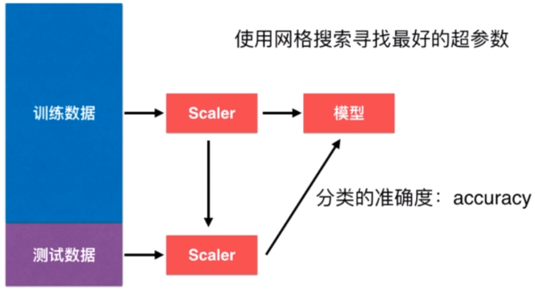

## 简单线性回归

### 概述

特点：

- 主要用于解决回归问题。
- 思想简单，实现容易。
- 是许多强大的非线性模型的基础。
- 结果具有很好的解释性。
- 蕴含机器学习中的很多重要思想。

辨析回归和分类：从概念上理解，分类的预测值是有限的离散的；回归的预测值连续的无限的。从几何上理解，分类的预测值不占用坐标轴，只需用有限种颜色表示不同类别；回归的预测值占用坐标轴，从坐标轴上取值。

样本只有一个特征（故而可在二维平面上表示）的线性回归叫简单线性回归。以后再推广到多元线性回归。

### 最小二乘法

拟合函数为$y=ax+b$，损失函数为$J(a,b)$，可令两个函数偏导数为0从而解出a和b：
$$
a=\frac{\sum\limits_{i=1}^m(x_i-\overline x)(y_i-\overline y)}{\sum\limits_{i=1}^m(x_i-\overline x)^2},b=\overline y-a\overline x
$$

### 代码实现

```python
# 最小二乘法
import matplotlib.pyplot as plt
import numpy as np

# 单特征数据集
x = np.array([1, 2, 3, 4, 5])
y = np.array([1, 3, 2, 3, 5])

# 求解a、b
numerator = 0.0
denominator = 0.0
for x_i, y_i in zip(x, y):
    numerator += (x_i - np.mean(x)) * (y_i - np.mean(y))
    denominator += (x_i - np.mean(x)) ** 2
a = numerator / denominator
b = np.mean(y) - a * np.mean(x)

# 拟合直线
y_hat = a * x + b

# 画图
plt.axis([0, 6, 0, 6])  # 划定两坐标轴范围
plt.scatter(x, y)
plt.plot(x, y_hat, c="r")

# 预测
x_predict = np.array([6, 10])
y_predict = a * x_predict + b
print(y_predict)
```

模拟sklearn定义简单线性回归类：

```python
import numpy as np


class SimpleLinearRegression1:
    """
    模拟sklearn自定义简单线性回归类
    """

    def __int__(self):
        self.a_ = None
        self.b_ = None

    def fit(self, x_train, y_train):
        """
        训练：计算a、b
        :param x_train: 单特征样本集
        :param y_train: 结果集
        :return: 训练后的对象
        """
        assert x_train.ndim == 1, "样本集必须是单特征"
        assert len(x_train) == len(y_train), "样本集和结果集的行数须相等"
        numerator = 0.0
        denominator = 0.0
        x_mean = np.mean(x_train)
        y_mean = np.mean(y_train)
        # 联合遍历x_train和y_train
        for x_i, y_i in zip(x_train, y_train):
            numerator += (x_i - x_mean) * (y_i - y_mean)
            denominator += (x_i - x_mean) ** 2
        self.a_ = numerator / denominator
        self.b_ = y_mean - self.a_ * x_mean
        return self

    def predict(self, x_predict):
        """
        预测
        :param x_predict: 单特征待预测样本集
        :return: 预测结果向量
        """
        assert x_predict.ndim == 1, "样本集必须是单特征"
        assert self.a_ is not None and self.b_ is not None, "预测之前必须先计算出a、b"
        return np.array([self.__predict(x) for x in x_predict])

    def __predict(self, x_single):
        """
        对一个元素作预测
        :param x_single: 单个元素
        :return: 预测值
        """
        return self.a_ * x_single + self.b_

    def __repr__(self):
        return "SimpleLinearRegression1()"
```

```python
def test_simple_linear_regression1(self):
    """
    测试自定义的简单线性回归类
    """
    # 初始化自定义类
    simple_linear_regression1 = SimpleLinearRegression1()
    # 数据集
    x = np.array([1, 2, 3, 4, 5])
    y = np.array([1, 3, 2, 3, 5])
    # 训练
    simple_linear_regression1.fit(x, y)
    # 预测
    x_predict = np.array([6, 10])
    print(simple_linear_regression1.predict(x_predict))
    # 拟合直线
    y_hat = simple_linear_regression1.predict(x)
    # 画图
    plt.axis([0, 6, 0, 6])
    plt.scatter(x, y)
    plt.plot(x, y_hat, c="r")
    plt.show()
```

### 向量化计算

由于a表达式的特点，上述代码中a的计算部分还可作改进以提高运算速度、提升算法性能，即用nunpy向量化（广播）计算形式代替循环。

```python
# 分子和分母
numerator = np.sum((x_train - x_mean) * (y_train - y_mean))
denominator = np.sum((x_train - x_mean) ** 2)
# 或
numerator = (x_train - x_mean).dot(y_train - y_mean)
denominator = (x_train - x_mean).dot(x_train - x_mean)
```

比较两种运算方式的性能：

```python
def test_compare_performance(self):
    """
    看看向量化的运算效率是不是更高
    """
    # 初始化两个线性回归类
    simple_linear_regression1 = SimpleLinearRegression1()
    simple_linear_regression2 = SimpleLinearRegression2()
    # 大规模数据集
    m = 1000000
    x_big = np.random.random(size=m)
    y_big = x_big * 2.0 + 3.0 + np.random.normal(size=m)  # 加干扰项
    # 训练
    simple_linear_regression1.fit(x_big, y_big)
    simple_linear_regression2.fit(x_big, y_big)
    # 测时间差距
    start = time.time()
    y_predict1 = simple_linear_regression1.predict(x_big)
    end = time.time()
    time_internal1 = end - start
    start = time.time()
    y_predict2 = simple_linear_regression2.predict(x_big)
    end = time.time()
    time_internal2 = end - start
    print("时间差距", time_internal2 / time_internal1, "倍")
    # 两者求出的a、b值是一样的
    print(simple_linear_regression1.a_, simple_linear_regression1.b_)
    print(simple_linear_regression2.a_, simple_linear_regression2.b_)
```

### 回归算法的评价

衡量线性回归算法的指标有MSE、RMSE、MAE。

均方误差表达式里求均值的意义在于针对不同规模的数据集统一衡量标准。比如我10000个样本，误差和为1000，你10个样本，误差和为800，表面上800<1000，但其实是我的模型更好，平均下来就看得出来：0.1<80。

为避免量纲计算带来的影响，可将MSE开平方得到RMSE（root mean square error）。两者本质上是一个意思，但我们能说总体平均误差为RMSE万，就不能说MSE万，因为是MSE$万^2$。

平均绝对误差MAE（mean absolute error）：$\frac{1}{m}\sum\limits_{i=1}^m|y^{(i)}-\hat y^{(i)}|$。不是一个处处可导的函数，不利于求梯度，但可用来单纯评估模型的好坏。

sklearn中波士顿房产数据集的部分描述：

> Boston house prices dataset
> ---------------------------
> **Data Set Characteristics:**  
>     :Number of Instances: 506 
>     :Number of Attributes: 13 numeric/categorical predictive. Median Value (attribute 14) is usually the target.

506个样本，13个特征，1个结果。

```python
>>> boston.feature_names
array(['CRIM', 'ZN', 'INDUS', 'CHAS', 'NOX', 'RM', 'AGE', 'DIS', 'RAD',
       'TAX', 'PTRATIO', 'B', 'LSTAT'], dtype='<U7')
```

取下标为5的特征RM（房间数）。

看一下样本图：

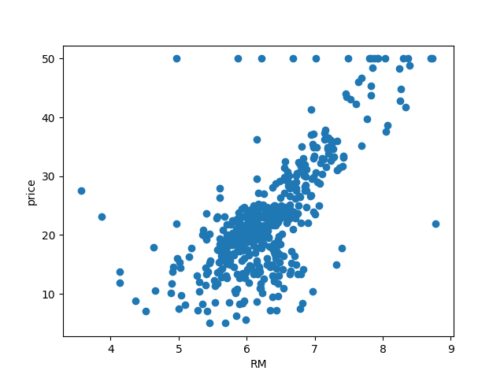

注意到上面一排点显得格格不入，这是因为调查数据时人为给定了一个上限值50.0，就导致大于50的值一律记为50，所以这些点要舍弃。

```python
# 衡量回归算法的各指标
from math import sqrt

import matplotlib.pyplot as plt
import numpy as np
from sklearn import datasets

from traditional_machine_learning.knn.train_test_split import train_test_split
# 导入波士顿房产数据
from traditional_machine_learning.linear_regression.simple_linear_regression2 import SimpleLinearRegression2

boston = datasets.load_boston()
x = boston.data[:, 5]
y = boston.target
# 去掉无效点
x = x[y < 50]
y = y[y < 50]

# 划分训练集和测试集
x_train, y_train, x_test, y_test = train_test_split(x, y, train_ratio=0.8, seed=1)

# 使用自定义的线性回归类
simple_linear_regression2 = SimpleLinearRegression2()
# 训练
simple_linear_regression2.fit(x_train, y_train)

# 画图
plt.xlabel("RM")
plt.ylabel("price")
plt.scatter(x_train, y_train)
plt.plot(x_train, simple_linear_regression2.predict(x_train), color="red")

# 预测并求误差
y_predict = simple_linear_regression2.predict(x_test)
mse = np.mean((y_test - y_predict) ** 2)
print("MSE: ", mse)
rmse = sqrt(mse)
print("RMSE: ", rmse)
mae = np.mean(np.abs(y_test - y_predict))
print("MAE: ", mae)
```

可专门建一个文件metrics.py存放这几个损失函数：

```python
# 诸回归损失函数
from math import sqrt

import numpy as np


def mean_squared_error(y_true, y_predict):
    """
    MSE
    :param y_true: 真实值向量
    :param y_predict: 预测值向量
    :return: 误差
    """
    assert y_true.ndim == y_predict.ndim, "真实值向量和预测值向量的维度须相等"
    return np.mean((y_true - y_predict) ** 2)


def root_mean_squared_error(y_true, y_predict):
    """
    RMSE
    :param y_true: 真实值向量
    :param y_predict: 预测值向量
    :return: 误差
    """
    assert y_true.ndim == y_predict.ndim, "真实值向量和预测值向量的维度须相等"
    return sqrt(np.mean((y_true - y_predict) ** 2))


def mean_absolute_error(y_true, y_predict):
    """
    MAE
    :param y_true: 真实值向量
    :param y_predict: 预测值向量
    :return: 误差
    """
    assert y_true.ndim == y_predict.ndim, "真实值向量和预测值向量的维度须相等"
    return np.mean(np.absolute(y_true - y_predict))
```

再来看看sklearn内置的各损失函数：

```python
from sklearn.metrics import mean_squared_error, mean_absolute_error
```

### 最好的评价指标

上一节的三个指标都有缺陷，下面介绍一个最好的-R Squared。
$$
R^2=1-\frac{SS_{residual}}{SS_{total}}=1-\frac{\sum\limits_{i=1}^m(\hat y^{(i)}-y^{(i)})^2}{\sum\limits_{i=1}^m(\overline y-y^{(i)})^2}=1-\frac{MSE\cdot m}{S\cdot m}
$$
$SS_{residual}$意为residual sum of squares-残差；$SS_{total}$意为total sum of squares。分子可理解为模型预测产生的误差；分母可理解为均值（也叫baseline model，基本模型、朴素模型）预测产生的误差。

显然$R^2\leq1$，$R^2$越大越好。当我们的模型达到完美，$R^2$得到最大值1；当我们模型就是基准模型，$R^2$为0。而如果$R^2<0$，说明我们的模型还不如基准模型。若真出现最后一种情况，就说明数据没有线性关系，即不能用线性回归来作拟合、预测。

用各种形式实现r squared：

```python
# 在metrics.py中添加的r2_score函数
def r2_score(y_true, y_predict):
    """
    R Squared
    :param y_true: 真实值向量
    :param y_predict: 预测值向量
    :return: 误差
    """
    assert y_true.ndim == y_predict.ndim, "真实值向量和预测值向量的维度须相等"
    return 1 - np.sum((y_predict - y_true) ** 2) / np.sum((np.mean(y_true) - y_true) ** 2)
```

```python
from traditional_machine_learning.linear_regression.metrics import r2_score
# 或from sklearn.metrics import r2_score 

# 直接算
r2 = 1 - mse / np.var(y_test)
print("R^2: ", r2)
# 调用现有的
r2 = r2_score(y_test, y_predict)
print(r2)
```

sklearn里的SimpleLinearRegression类默认就是用R Squared作结果评估，我们可以仿照着在自定义类里添加score函数，作R Squared评估：

```python
# 在SimpleLinearRegression2类里添加
def score(self, x_test, y_test):
    """
    R Squared评估
    :param x_test: 测试样本集
    :param y_test: 测试真实结果集
    :return: R Squared值
    """
    y_predict = self.predict(x_test)
    return r2_score(y_test, y_predict)

# 调用
r2 = simple_linear_regression2.score(x_test, y_test)
print(r2)
```

## 多元线性回归

### 概述

特征数变多了，不止1个了。
$$
\hat y^{(i)}=\theta_0+\theta_1x_1^{(i)}+\theta_2x_2^{(i)}+\cdots+\theta_nx_n^{(i)},i=1,2,\ldots,m
$$

正规方程（normal equation）解为：
$$
\mathbf\Theta=(\mathbf{X}^T\mathbf{X})^{-1}\mathbf{X}^Ty
$$
关于它更多的解读和推导，可参见吴恩达《机器学习》笔记和《数值分析》手写笔记，应注意到一元多项式回归的正规方程和多元线性回归的正规方程在形式上是一致的，参看下面的对照推导：

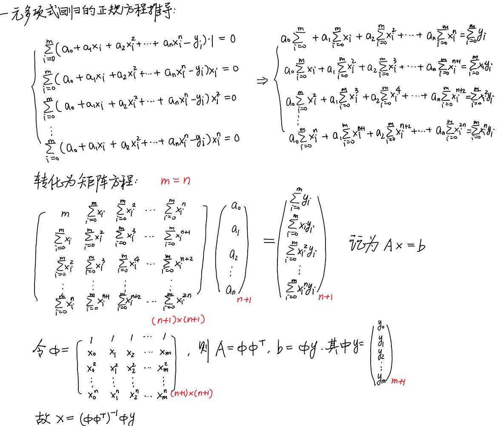

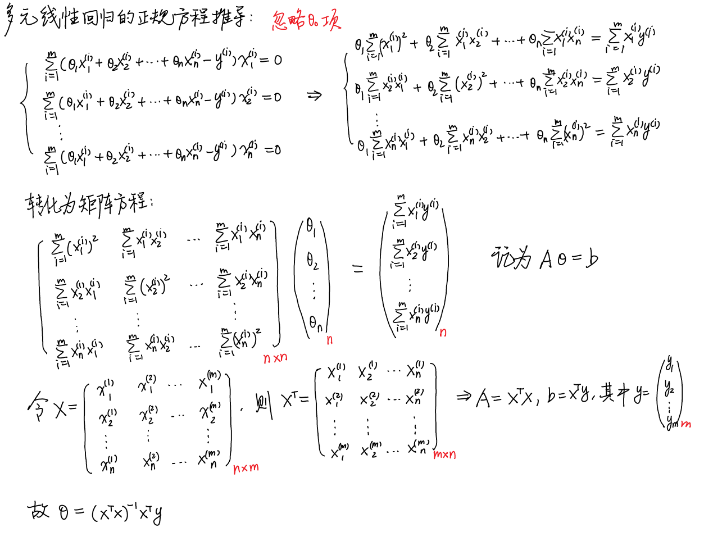

缺点：效率不高：优点：不需要作归一化处理。

### 实现

我们常把θ~0~单独拎出来，叫截距（intercept），而$(\theta_1,\theta_2,\ldots,\theta_n)^T$叫系数（coefficient）。如此一来每个系数都对应一个特征，从某种程度上可描述该特征对样本的贡献程度，θ~0~则是同样本不相干的。

```python
import numpy as np

from traditional_machine_learning.linear_regression.metrics import r2_score


class LinearRegression:
    """
    广义（多元）线性回归类。用正规方程求解参数
    """

    def __init__(self):
        # 系数
        self.coefficient_ = None
        # 截距
        self.intercept_ = None
        # 完整的θ
        self.__theta = None

    def fit_normal(self, x_train, y_train):
        """
        由正规方程解出诸参数
        :param x_train: 训练样本集
        :param y_train:样本结果集
        :return: 训练后的对象
        """
        assert x_train.shape[0] == y_train.shape[0], "样本数须一致"
        # 由于带偏移项，须对x_train进行扩展
        x_train = np.hstack((np.ones((x_train.shape[0], 1)), x_train))
        # 算完整参数
        self.__theta = np.linalg.inv(np.transpose(x_train).dot(x_train)).dot(np.transpose(x_train)).dot(y_train)
        # 取系数
        self.coefficient_ = self.__theta[1:]
        # 取截距
        self.intercept_ = self.__theta[0]
        return self

    def predict(self, x_predict):
        """
        回归预测
        :param x_predict: 测试样本集
        :return: 预测结果向量
        """
        assert self.intercept_ is not None and self.coefficient_ is not None, "须先训练求出参数"
        assert x_predict.shape[1] == len(self.coefficient_), "测试样本集特征个数须等于参数个数"
        # 由于带偏移项，须对x_predict进行扩展
        x_predict = np.hstack((np.ones((x_predict.shape[0], 1)), x_predict))
        return x_predict.dot(self.__theta)

    def score(self, x_test, y_test):
        """
        求模型当前的准确度
        :param x_test 测试样本集
        :param y_test 样本结果集
        :return: 准确度
        """
        y_predict = self.predict(x_test)
        return r2_score(y_test, y_predict)

    def __repr__(self):
        return "LinearRegression()"
```

```python
def test_normal_equation(self):
    """
    测试多元线性回归-正规方程法
    """
    # 导入波士顿房产数据
    boston = datasets.load_boston()
    x = boston.data # 全体特征
    y = boston.target
    # 去掉无效点
    x = x[y < 50]
    y = y[y < 50]
    # 划分训练集和测试集
    x_train, y_train, x_test, y_test = train_test_split(x, y, train_ratio=0.8, seed=1)
    # 实例化自定义的多元线性回归类
    linear_regression = LinearRegression()
    # 训练得到参数
    linear_regression.fit_normal(x_train, y_train)
    # 准确度
    r2 = linear_regression.score(x_test, y_test)
    print(r2)
```

sklearn中也有多元线性回归类，不过它求解参数的方法不是正规方程，而是别的方法。

```python
# 使用sklearn内置的多元线性回归类
from sklearn import datasets
from sklearn.linear_model import LinearRegression

# 导入波士顿房产数据
from traditional_machine_learning.knn.train_test_split import train_test_split

boston = datasets.load_boston()
x = boston.data
y = boston.target
# 去掉无效点
x = x[y < 50]
y = y[y < 50]
# 划分训练集和测试集
x_train, y_train, x_test, y_test = train_test_split(x, y, train_ratio=0.8, seed=1)
# 实例化多元线性回归类
linear_regression = LinearRegression()
# 训练
linear_regression.fit(x_train, y_train)
# 预测得到准确度
r2 = linear_regression.score(x_test, y_test)
print(r2)
print(linear_regression.coef_)
print(linear_regression.intercept_)
```

### knn回归

knn算法也可解决回归问题。sklearn封装了KNeighborsRegressor类。

```python
def test_knn_regressor(self):
    """
    使用sklearn内置的KNeighborsRegressor
    """
    # 导入波士顿房产数据
    boston = datasets.load_boston()
    x = boston.data
    y = boston.target
    # 去掉无效点
    x = x[y < 50]
    y = y[y < 50]
    # 划分训练集和测试集
    x_train, y_train, x_test, y_test = train_test_split(x, y, train_ratio=0.8, seed=1)
    # 候选参数
    param_grid = [
        {
            "weights": ["uniform"],
            "n_neighbors": [i for i in range(1, 11)],
        },
        {
            "weights": ["distance"],  # 不能取uniform
            "n_neighbors": [i for i in range(1, 11)],
            "p": [i for i in range(1, 6)]
        }
    ]
    # knn回归器
    knn_regressor = KNeighborsRegressor()
    # 超参数网格
    grid_search = GridSearchCV(knn_regressor, param_grid, n_jobs=-1, verbose=1)
    # 网格搜索。注意搜索过程中用的准确度评价指标不是r2而是交叉验证
    grid_search.fit(x_train, y_train)
    # 得到最佳
    best_regressor = grid_search.best_estimator_
    print(grid_search.best_params_)
    print(best_regressor.score(x_test, y_test))
```

注意到得到的最佳超参数所依据的评价标准是交叉验证不是r2，感兴趣的话我们可自己写一套代码找到基于r2评估的最佳超参数。

knn回归法比线性回归法的效果要差。

### 线性回归法的可解释性

线性回归法还有更强大的一面就是对数据具有可解释性。

```python
# 线性回归法的可解释性
import numpy as np
from sklearn import datasets
from sklearn.linear_model import LinearRegression

# 导入波士顿房产数据
boston = datasets.load_boston()
x = boston.data
y = boston.target
# 去掉无效点
x = x[y < 50]
y = y[y < 50]
# 实例化多元线性回归类
linear_regression = LinearRegression()
# 训练
linear_regression.fit(x, y)
# 思考一下各系数的意义
coefficients = linear_regression.coef_
print(coefficients)
print(np.argsort(coefficients))  # 排序后的索引
print(boston.feature_names[np.argsort(coefficients)])  # 排序后的特征
```

打印结果如下：

```python
[-1.06715912e-01  3.53133180e-02 -4.38830943e-02  4.52209315e-01
 -1.23981083e+01  3.75945346e+00 -2.36790549e-02 -1.21096549e+00
  2.51301879e-01 -1.37774382e-02 -8.38180086e-01  7.85316354e-03
 -3.50107918e-01]
[ 4  7 10 12  0  2  6  9 11  1  8  3  5]
['NOX' 'DIS' 'PTRATIO' 'LSTAT' 'CRIM' 'INDUS' 'AGE' 'TAX' 'B' 'ZN' 'RAD'
 'CHAS' 'RM']
```

观察它们和特征之间的关系我们有以下结论：

- 系数为正表名若特征越大，则房价越高；若特征越小，则房价越低。系数为负则相反。
- 系数的绝对值大小表示特征对房价的影响大小。
- 观察排序后的特征列表可知越往左负相关程度越大，越往右正相关程度越大。

那么基于以上结论我们就可以结合现实的特征（诸如房间数、临河与否等）来阐释其对房价作怎样的影响，此之谓可解释性。

### 注

它是典型的参数学习，对比之下，knn是非参数学习。

它只能解决回归问题，虽然很多分类方法中，线性回归是基础（如逻辑回归）。对比之下，knn既能解决分类问题，又能解决回归问题。

它对数据有假设，knn对数据没有假设。

对数据具有强解释性。

## 梯度下降法

### 概述

特点：

- 不是一个机器学习算法。
- 是一种基于搜索的最优化方法。
- 作用：最小化一个损失函数。
- 梯度上升法：最大化一个效用函数。

### 简单模拟

梯度下降法模拟：

```python
# 梯度下降法模拟
import matplotlib.pyplot as plt
import numpy as np

plot_x = np.linspace(-1, 6, 141)
plt.xlabel("theta")
plt.ylabel("loss")


def loss(theta):
    """
    损失函数
    :param theta: 自变量（特征系数）
    :return: 损失值
    """
    return (theta - 2.5) ** 2 - 1


def deviate_loss(theta):
    """
    对损失函数求偏导数
    :param theta: 自变量
    :return 偏导数值
    """
    return 2 * (theta - 2.5)


# 学习率
eta = 0.1
# 收敛误差
epsilon = 1e-8
# 特征系数
theta = 0.0
# theta的历史记录
theta_history = []
theta_history.append(theta)  # 包括初始值
# 循环直到收敛到最低点
while True:
    # 求导
    gradient = deviate_loss(theta)
    # 暂存下降前的值
    last_theta = theta
    # 下降
    theta -= eta * gradient
    # 记录下降轨迹
    theta_history.append(theta)
    # 人为设定收敛条件，机器本身计算存在精度问题
    if (abs(loss(theta) - loss(last_theta))) < epsilon:
        break

# 打印最小值点和对应最小值
print("最小值点：", theta)
print("最小值：", loss(theta))
print("总下降次数：", len(theta_history) - 1)

# 损失函数图象
plt.plot(plot_x, loss(plot_x))
# 梯度下降过程图示
plt.plot(theta_history, loss(np.array(theta_history)), color="red", marker="+")
```

```python
# console:
最小值点： 2.499891109642585
最小值： -0.99999998814289
总下降次数： 45
```

绘制的图象如下：


我们可进一步将上述代码封装成两个函数：

```python
# 梯度下降法模拟-封装成函数
import matplotlib.pyplot as plt
import numpy as np

# 取散点
plot_x = np.linspace(-1, 6, 141)
plt.xlabel("theta")
plt.ylabel("loss")


def loss(theta):
    """
    损失函数
    :param theta: 自变量（特征系数）
    :return: 损失值
    """
    return (theta - 2.5) ** 2 - 1


def deviate_loss(theta):
    """
    对损失函数求偏导数
    :param theta: 自变量
    :return 偏导数值
    """
    return 2 * (theta - 2.5)


def gradient_descent(initial_theta, eta, epsilon=1e-8):
    """
    梯度下降法
    :param initial_theta: theta初始值
    :param eta: 学习率
    :param epsilon: 收敛误差
    """
    theta = initial_theta
    theta_history.append(theta)  # 包括初始值
    # 循环直到收敛到最低点
    while True:
        # 求导
        gradient = deviate_loss(theta)
        # 暂存下降前的值
        last_theta = theta
        # 下降
        theta -= eta * gradient
        # 记录下降轨迹
        theta_history.append(theta)
        # 人为设定收敛条件，机器本身计算存在精度问题
        if (abs(loss(theta) - loss(last_theta))) < epsilon:
            break


def plot_loss_and_theta_history():
    # 损失函数图象
    plt.plot(plot_x, loss(plot_x))
    # 梯度下降过程图示
    plt.plot(theta_history, loss(np.array(theta_history)), color="red", marker="+")


# 调用
theta_history = []  # theta的历史记录
gradient_descent(initial_theta=0.0, eta=0.1)
plot_loss_and_theta_history()
```

观察图象可知，在学习率固定的条件下，随着梯度下降的进行，偏导值越来越小，loss和theta在两标定点之间的变化幅度越来越小。

那么通过调整学习率，可调整标定点的密度，学习率越小，标定点或梯度下降次数越多，而学习率若超过某个阈值，就可能导致永远无法收敛到最低点（达到振荡的状态），loss值越来越大。

针对无法收敛的问题，我们可以为梯度下降次数设一个上限：

```python
def gradient_descent_toplimit(initial_theta, eta, n_iters=1e4, epsilon=1e-8):
    """
    梯度下降法
    :param initial_theta: theta初始值
    :param eta: 学习率
    :param n_iters: 迭代次数上限
    :param epsilon: 收敛误差
    """
    theta = initial_theta
    theta_history.append(theta)  # 包括初始值
    i_iter = 0
    # 循环直到收敛到最低点且迭代次数小于上限值
    while i_iter < n_iters:
        # 求导
        gradient = deviate_loss(theta)
        # 暂存下降前的值
        last_theta = theta
        # 下降
        theta -= eta * gradient
        # 记录下降轨迹
        theta_history.append(theta)
        # 人为设定收敛条件，机器本身计算存在精度问题
        if (abs(loss(theta) - loss(last_theta))) < epsilon:
            break
        i_iter += 1
```

调用上述函数，用一个很大的学习率，指定迭代次数上限为10，我们观察一下反收敛的情况：

```python
# 观察反收敛情况
gradient_descent_toplimit(initial_theta=0.0, n_iters=10, eta=1.1)
plt.figure(2)  # 先定窗子再画图
plot_loss_and_theta_history()
```

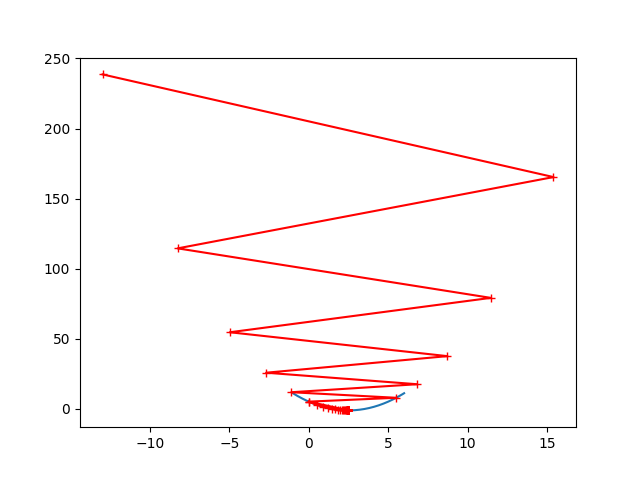

可以看出函数值越爬越高，theta离收敛点越来越远。

对于绝大多数损失函数，学习率设为0.01是足以胜任的。

### 多元线性回归中的梯度下降法

相关推导可参考吴恩达《机器学习》笔记中的梯度下降法。此时着重看看它的代码实现。

```python
# 在简单线性回归模型中使用梯度下降法
import numpy as np


def loss(theta, x_bias, y):
    """
    损失函数
    :param theta: 特征参数
    :param x_bias: 带偏置的样本集
    :param y: 样本结果集
    :return: 损失值
    """
    try:
        return np.mean((x_bias.dot(theta) - y) ** 2)
    except:  # 损失值过大-溢出异常
        return float("inf")


def deviate_loss(theta, x_bias, y):
    """
    求损失函数关于参数的梯度
    :param theta: 特征参数
    :param x_bias: 带偏置的样本集
    :param y: 样本结果集
    :return: 梯度
    """
    # 梯度
    gradient = np.empty(len(theta))
    # 截距的偏导数
    gradient[0] = np.sum(np.dot(x_bias, theta) - y)
    # 系数的偏导数
    for feature in range(1, len(theta)):
        gradient[feature] = np.dot((np.dot(x_bias, theta) - y), x_bias[:, feature])
    return gradient * 2 / len(y)


def gradient_descent_toplimit(x_bias, y, initial_theta, eta, n_iters=1e4, epsilon=1e-8):
    """
    梯度下降法
    :param x_bias: 带偏置的样本集
    :param y: 样本结果集
    :param initial_theta: theta初始值
    :param eta: 学习率
    :param n_iters: 迭代次数上限
    :param epsilon: 收敛误差
    :return: 训练得到的最佳参数
    """
    theta = initial_theta
    i_iter = 0
    # 循环直到收敛到最低点且迭代次数小于上限值
    while i_iter < n_iters:
        # 求导
        gradient = deviate_loss(theta, x_bias, y)
        # 暂存下降前的值
        last_theta = theta
        # 下降
        theta = theta - eta * gradient  # 使用-=有问题
        # 人为设定收敛条件，机器本身计算存在精度问题
        if (abs(loss(theta, x_bias, y) - loss(last_theta, x_bias, y))) < epsilon:
            break
        i_iter += 1
    return theta


# 数据集
np.random.seed(666)
x = 2. * np.random.random(size=100)  # 单特征，100个样本点
y = x * 3. + 4. + np.random.normal(size=100)  # 两个系数
# plt.scatter(x, y)

# 给原样本集拼上偏置1
x_train = np.hstack((np.ones((len(x), 1)), x.reshape((-1, 1))))
# 得到最佳参数
best_theta = gradient_descent_toplimit(x_train, y, np.zeros(x_train.shape[1]), 0.01)

print(best_theta)
```

```python
# console:
[4.02145786 3.00706277]
```

我们可以将梯度下降法封装进之前自定义的LinearRegression类中：

```python
def fit_gradient_descent(self, x_train, y_train, eta, n_iters):
    """
    用梯度下降法求最优参数
    :param x_train: 训练样本集
    :param y_train: 样本结果集
    :param eta: 学习率
    :param n_iters: 迭代次数上限
    :return: 训练后的对象
    """
    assert x_train.shape[0] == y_train.shape[0], "样本数须一致"

    def loss(theta, x_bias, y):
        """
        损失函数
        :param theta: 特征参数
        :param x_bias: 带偏置的样本集
        :param y: 样本结果集
        :return: 损失值
        """
        try:
            return np.mean((x_bias.dot(theta) - y) ** 2)
        except:  # 损失值过大-溢出异常
            return float("inf")

    def deviate_loss(theta, x_bias, y):
        """
        求损失函数关于参数的梯度
        :param theta: 特征参数
        :param x_bias: 带偏置的样本集
        :param y: 样本结果集
        :return: 梯度
        """
        # 梯度
        gradient = np.empty(len(theta))
        # 截距的偏导数
        gradient[0] = np.sum(np.dot(x_bias, theta) - y)
        # 系数的偏导数
        for feature in range(1, len(theta)):
            gradient[feature] = np.dot((np.dot(x_bias, theta) - y), x_bias[:, feature])
        return gradient * 2 / len(y)

    def gradient_descent_toplimit(x_bias, y, initial_theta, eta, n_iters=1e4, epsilon=1e-8):
        """
        梯度下降法
        :param x_bias: 带偏置的样本集
        :param y: 样本结果集
        :param initial_theta: theta初始值
        :param eta: 学习率
        :param n_iters: 迭代次数上限
        :param epsilon: 收敛误差
        :return: 训练得到的最佳参数
        """
        theta = initial_theta
        i_iter = 0
        # 循环直到收敛到最低点且迭代次数小于上限值
        while i_iter < n_iters:
            # 求导
            gradient = deviate_loss(theta, x_bias, y)
            # 暂存下降前的值
            last_theta = theta
            # 下降
            theta = theta - eta * gradient  # 使用-=有问题
            # 人为设定收敛条件，机器本身计算存在精度问题
            if (abs(loss(theta, x_bias, y) - loss(last_theta, x_bias, y))) < epsilon:
                break
            i_iter += 1
        return theta

    # 给原样本集拼上偏置1
    x_bias = np.hstack((np.ones((len(x_train), 1)), x_train))
    # 得到最佳参数
    self.__theta = gradient_descent_toplimit(x_bias, y_train, np.zeros(x_bias.shape[1]), eta, n_iters)
    # 填上截距和系数
    self.intercept_ = self.__theta[0]
    self.coefficient_ = self.__theta[1:]
    return self
```

测试：

```python
def test_gradient_descent(self):
    """
    测试线性回归中的梯度下降法
    """
    # 数据集
    np.random.seed(666)
    x = 2. * np.random.random(size=100)  # 单特征，100个样本点
    y = x * 3. + 4. + np.random.normal(size=100)  # 两个系数
    x = x.reshape((-1, 1))
    # 实例化多元线性回归类
    linear_regression = LinearRegression()
    # 训练得到最佳参数
    linear_regression.fit_gradient_descent(x, y, 0.01, 1e4)
    print(linear_regression.intercept_, linear_regression.coefficient_)
```

```python
# console:
4.021457858204859 [3.00706277]
```

### 梯度下降法的向量化和数据标准化

梯度公式可以写成矩阵乘法的形式，见下面的推导：

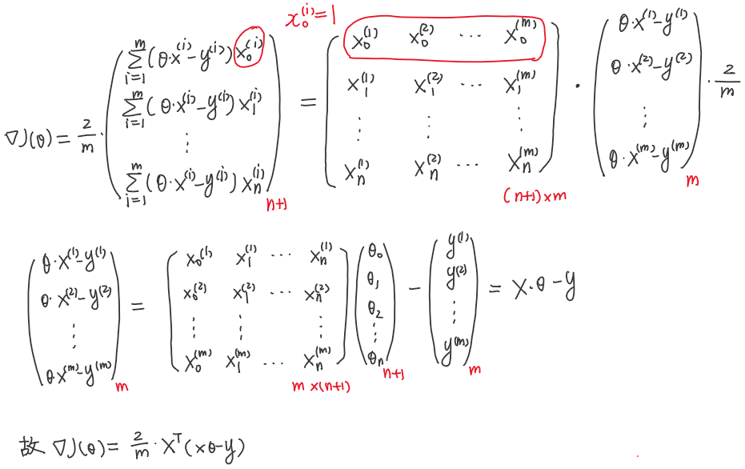

反映到代码上，只需扩充求导函数：

```python
def grad_j(theta, x_bias, y):
    """
    梯度的向量化求法
    :param theta: 特征参数
    :param x_bias: 带偏置的样本集
    :param y: 样本结果集
    :return: 梯度
    """
    return x_bias.T.dot(x_bias.dot(theta) - y) * 2 / len(x_bias)
```

下面用波士顿房价数据测试我们写的梯度下降法：

```python
def test_gradient_descent_boston(self):
    """
    测试多元线性回归-梯度下降法
    """
    # 波士顿房产数据
    boston = datasets.load_boston()
    x = boston.data
    y = boston.target
    # 去掉无效点
    x = x[y < 50]
    y = y[y < 50]
    # 划分训练集和测试集
    x_train, y_train, x_test, y_test = train_test_split(x, y, train_ratio=0.8, seed=1)
    # 实例化自定义的多元线性回归类
    linear_regression = LinearRegression()
    # 训练得到参数
    linear_regression.fit_gradient_descent(x_train, y_train, 0.01, 1e6)
```

运行后报溢出错误（即发散），一般的解决方法有两个：降低学习率或步长；对数据进行归一化。其实两者是有联系的，降低学习率就是因为某些特征的量纲的影响，使特征值很小。

同时我们也可看出数据归一化的不同目的，在之前的knn算法中它是用来客观反映样本点间的距离，公平设定每个特征的重要性，而这里是针对梯度下降法不收敛或难收敛的问题，让其快速收敛。

此外我们再想到正规方程是不需要数据归一化的，这是因为其一不需要各特征同数量级，只需看回归结果同各特征的相关性；其二正规方程没有梯度下降中的迭代过程，不存在不收敛-无限循环的情况，它的耗时源于数据量庞大，梯度下降法的耗时是由于损失函数收敛不到最低点。

话说回来，就我们自定义的梯度下降函数而言，即使降低了学习率最终也不一定收敛：

```python
print(linear_regression.score(x_test, y_test))
# console:
0.4297870012721452
```

因为虽然没有溢出的情况（即没有发散），但限于迭代次数，可能只是部分偏倒数约取到零，而其他的有或大或小的差距，这还是归结为收敛慢的问题。

使用梯度下降法前进行数据归一化：

```python
def test_gradient_descent_standard_scaler(self):
    """
    使用梯度下降法前进行数据归一化
    """
    # 波士顿房产数据
    boston = datasets.load_boston()
    x = boston.data
    y = boston.target
    # 去掉无效点
    x = x[y < 50]
    y = y[y < 50]
    # 划分训练集和测试集
    x_train, y_train, x_test, y_test = train_test_split(x, y, train_ratio=0.8, seed=1)
    # 归一化
    standardScaler = StandardScaler()
    standardScaler.fit(x_train)
    x_train_standard = standardScaler.transform(x_train)
    # 实例化自定义的多元线性回归类
    linear_regression = LinearRegression()
    linear_regression.fit_gradient_descent(x_train_standard, y_train, 0.01, 1e4)
    # 模型准确度
    x_test_standard = standardScaler.transform(x_test)
    print(linear_regression.score(x_test_standard, y_test))
```

### 梯度下降法的优势

```python
def test_gradient_descent_advantage(self):
    """
    梯度下降法的优势
    """
    m = 1000
    # 特征数看起来很大，但仔细想想连一个100*100的图像都包括不住
    n = 5000
    # 取一组服从正态分布的样本
    x = np.random.normal(size=(m, n))
    # 随机取一组原参数
    real_theta = np.random.uniform(0.0, 100.0, n + 1)
    y = x.dot(real_theta[1:]) + real_theta[0] + np.random.normal(0., 10., m)
    # 实例化自定义的多元线性回归类
    linear_regression = LinearRegression()
    # 测时间差距
    start = time.time()
    linear_regression.fit_gradient_descent(x, y, 0.01, 1e4)  # 梯度下降解法
    end = time.time()
    time_interval1 = end - start
    start = time.time()
    linear_regression.fit_normal(x, y)  # 正规方程解法
    end = time.time()
    time_interval2 = end - start
    print(time_interval1, time_interval2)
```

```python
# console:
3.6122894287109375 8.166051864624023
```

### 随机梯度下降法

刚刚讨论过的梯度下降法又叫批量梯度下降法（batch gradient descent），损失函数的梯度的每一项都要遍历所有的样本点，那么当m（样本数）非常大，计算就也很耗时。

基于这个问题，我们提出一个改进的方案-随机梯度下降法（stochastic gradient descent，常缩写为SGD），它的数学公式如下：

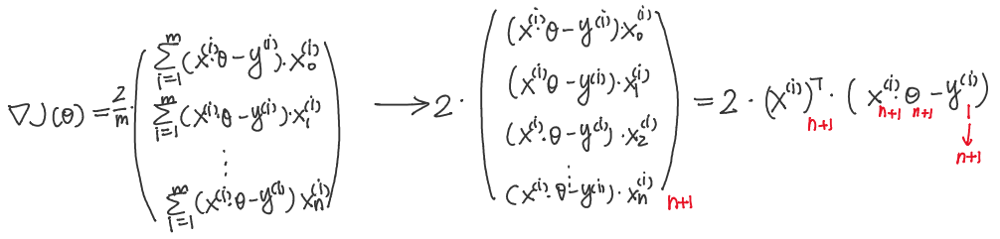

它在二维特征下的收敛过程如下：

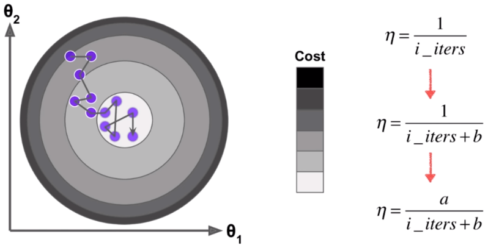

从其收敛态势可看出，它不像批量梯度下降法那样快速地收敛到最低点，即每一次更新不一定沿着下降最快（损失函数的方向导数的绝对值最大）的方向即梯度方向。

在自定义的多元线性回归类LinearRegression中加入随机梯度下降函数：

```python
def fit_stochastic_gradient_descent(self, x_train, y_train, n_iters=1e4, t0=5, t1=50):
    """
    用随机梯度下降法求最优参数
    :param x_train: 训练样本集
    :param y_train: 样本结果集
    :param eta: 学习率
    :param n_iters: 迭代次数上限
    :param t0: 退火参数t0，经验值为5
    :param t1: 退火参数t1，经验值为50
    :return: 训练后的对象
    """
    assert x_train.shape[0] == y_train.shape[0], "样本数须一致"

    def loss(theta, x_bias, y):
        """
        损失函数
        :param theta: 特征参数
        :param x_bias: 带偏置的样本集
        :param y: 样本结果集
        :return: 损失值
        """
        try:
            return np.mean((x_bias.dot(theta) - y) ** 2)
        except:  # 损失值过大-溢出异常
            return float("inf")

    def deviate_sgd(theta, x_bias_i, y_i):
        """
        随机梯度的向量化求法
        :param theta: 特征参数
        :param x_bias_i: 带偏置的样本集
        :param y_i: 样本结果集
        :return: 梯度
        """
        return x_bias_i.T.dot(x_bias_i.dot(theta) - y_i) * 2

    def sgd(x_bias, y, initial_theta, n_iters):
        """
        随机梯度下降法
        :param x_bias: 带偏置的样本集
        :param y: 样本结果集
        :param initial_theta: theta初始值
        :param eta: 学习率
        :param n_iters: 迭代次数上限
        :param epsilon: 收敛误差
        :return: 训练得到的最佳参数
        """

        def learning_rate(t):
            """
            根据迭代次数动态生成学习率
            :param t:迭代次数
            :return: 学习率
            """
            return t0 / (t + t1)

        theta = initial_theta
        # 固定迭代次数。因为损失值变化量极小的情况不一定出现在收敛域
        for i_iter in range(n_iters):
            # 随机取一个样本点
            rand_i = np.random.randint(len(x_bias))
            # 求导
            gradient = deviate_sgd(theta, x_bias[rand_i, :], y[rand_i])
            # 更新参数
            theta = theta - learning_rate(i_iter) * gradient
        return theta

    # 给原样本集拼上偏置1
    x_bias = np.hstack((np.ones((len(x_train), 1)), x_train))
    # 得到最佳参数
    self.__theta = sgd(x_bias, y_train, np.zeros(x_bias.shape[1]), n_iters)
    # 填上截距和系数
    self.intercept_ = self.__theta[0]
    self.coefficient_ = self.__theta[1:]
    return self
```

与批量梯度下降的比较：

```python
def test_stochastic_gradient_descent(self):
    """
    测试随机梯度下降法
    """
    # 样本数
    m = 100000
    # 数据集
    x = np.random.normal(size=m)
    y = x * 4 + 3 + np.random.normal(0, 3, m)  # 两个参数
    x = x.reshape((-1, 1))  # 将向量变矩阵以便横向拼成x_bias
    # 实例化自定义的多元线性回归类
    linear_regression = LinearRegression()
    # 测时间差距
    start = time.time()
    linear_regression.fit_gradient_descent(x, y, 0.01, 1e4)  # 批量梯度下降
    theta_batch = linear_regression.intercept_, linear_regression.coefficient_
    end = time.time()
    print("time_batch:", end - start)
    print("theta_batch: ", theta_batch)
    start = time.time()
    linear_regression.fit_stochastic_gradient_descent(x, y, 0.01, len(x) // 3)  # 随机梯度下降
    theta_stochastic = linear_regression.intercept_, linear_regression.coefficient_
    end = time.time()
    print("time_stochastic:", end - start)
    print("theta_stochastic: ", theta_stochastic)
```

```python
# console:
time_batch: 0.719141960144043
theta_batch:  (2.9884064299471196, array([3.98980649]))
    
time_stochastic: 0.40607571601867676
theta_stochastic:  (3.0453958919238504, array([3.99736549]))
```

不难算出，批量梯度下降法的计算量为$2\times10^5\times10^4$，随机梯度下降法的计算量为$2\times1\times\frac{1}{3}\times10^5$。可见得即使后者的计算量远小于前者（在时间上就占优），最终的效果也能达到一致，这就看出随机梯度下降的优势。

然而，随机梯度下降迭代次数仅为样本数的$\frac{1}{3}$是不科学的，我们需进一步将$n\_iters$理解为基于全体样本的迭代次数即实质迭代次数为$n\_iters\times m$，每个样本至少被使用一次。

改进后的代码如下：

```python
def fit_stochastic_gradient_descent(self, x_train, y_train, n_iters=5, t0=5, t1=50):
    """
    用随机梯度下降法求最优参数
    :param x_train: 训练样本集
    :param y_train: 样本结果集
    :param eta: 学习率
    :param n_iters: 基于全体样本的迭代次数
    :param t0: 退火参数t0
    :param t1: 退火参数t1
    :return: 训练后的对象
    """
    assert x_train.shape[0] == y_train.shape[0], "样本数须一致"
    assert n_iters >= 1, "每个样本至少要训练一次"

    def loss(theta, x_bias, y):
        """
        损失函数
        :param theta: 特征参数
        :param x_bias: 带偏置的样本集
        :param y: 样本结果集
        :return: 损失值
        """
        try:
            return np.mean((x_bias.dot(theta) - y) ** 2)
        except:  # 损失值过大-溢出异常
            return float("inf")

    def deviate_sgd(theta, x_bias_i, y_i):
        """
        随机梯度的向量化求法
        :param theta: 特征参数
        :param x_bias_i: 带偏置的样本集
        :param y_i: 样本结果集
        :return: 梯度
        """
        return x_bias_i.T.dot(x_bias_i.dot(theta) - y_i) * 2

    def sgd(x_bias, y, initial_theta, n_iters):
        """
        随机梯度下降法
        :param x_bias: 带偏置的样本集
        :param y: 样本结果集
        :param initial_theta: theta初始值
        :param eta: 学习率
        :param n_iters: 迭代次数上限
        :param epsilon: 收敛误差
        :return: 训练得到的最佳参数
        """

        def learning_rate(t):
            """
            根据迭代次数动态生成学习率
            :param t:迭代次数
            :return: 学习率
            """
            return t0 / (t + t1)

        theta = initial_theta
        # 迭代更新参数
        for i_iter in range(n_iters):
            # 重洗数据集
            indexes = np.random.permutation(len(x_train))
            x_bias_shuffled = x_bias[indexes]
            y_bias_shuffled = y_train[indexes]
            # 针对每个样本迭代
            for i in range(len(x_train)):
                # 求导
                gradient = deviate_sgd(theta, x_bias_shuffled[i], y_bias_shuffled[i])
                # 更新参数
                theta = theta - learning_rate(i_iter * len(x_bias) + i) * gradient
        return theta

    # 给原样本集拼上偏置1
    x_bias = np.hstack((np.ones((len(x_train), 1)), x_train))
    # 得到最佳参数
    self.__theta = sgd(x_bias, y_train, np.zeros(x_bias.shape[1]), n_iters)
    # 填上截距和系数
    self.intercept_ = self.__theta[0]
    self.coefficient_ = self.__theta[1:]
    return self
```

测试如下：

```python
def test_improved_sgd(self):
    """
    测试改进之后的随机梯度下降法
    """
    # 样本数
    m = 100000
    # 数据集
    x = np.random.normal(size=m)
    y = x * 4 + 3 + np.random.normal(0, 3, m)
    x = x.reshape(-1, 1)
    # 实例化自定义的多元线性回归类
    linear_regression = LinearRegression()
    linear_regression.fit_stochastic_gradient_descent(x, y, n_iters=2)
    # 打印系数
    print(linear_regression.intercept_, linear_regression.coefficient_)
```

```python
# console:
2.994368474128734 [4.00626725]
```

最后我们用波士顿房价数据测试随机梯度下降法：

```python
def test_boston_sgd(self):
    """
    使用波士顿房产数据测试随机梯度下降法
    """
    # 波士顿房产数据
    boston = datasets.load_boston()
    x = boston.data
    y = boston.target
    # 去掉无效点
    x = x[y < 50]
    y = y[y < 50]
    # 划分训练集和测试集
    x_train, y_train, x_test, y_test = train_test_split(x, y, train_ratio=0.8, seed=666)
    # 归一化
    standard_scaler = StandardScaler()
    standard_scaler.fit(x_train)
    x_train_standard = standard_scaler.transform(x_train)
    x_test_standard = standard_scaler.transform(x_test)
    # 实例化自定义的多元线性回归类
    linear_regression = LinearRegression()
    # 时间
    start = time.time()
    linear_regression.fit_stochastic_gradient_descent(x_train_standard, y_train, n_iters=2)
    end = time.time()
    print("time: ", end - start)
    # 准确度
    print("R^2-score: ", linear_regression.score(x_test_standard, y_test))
```

```python
# console:
time:  0.015625476837158203
R^2-score:  0.7424425113171111
```

当把n_iters改成50，结果为：

```python
# console:
time:  0.1371605396270752
R^2-score:  0.7997496804831818
```

最后我们使用一下sklearn中的随机梯度下降法，它的算法实现更为复杂，效率也更高。

```python
def test_sklearn_sgd(self):
    """
    测试sklearn中的随机梯度下降法
    """
    # 波士顿房产数据
    boston = datasets.load_boston()
    x = boston.data
    y = boston.target
    # 去掉无效点
    x = x[y < 50]
    y = y[y < 50]
    # 划分训练集和测试集
    x_train, y_train, x_test, y_test = train_test_split(x, y, train_ratio=0.8, seed=666)
    # 归一化
    standard_scaler = StandardScaler()
    standard_scaler.fit(x_train)
    x_train_standard = standard_scaler.transform(x_train)
    x_test_standard = standard_scaler.transform(x_test)
    # sklearn中的随机梯度下降法
    sgd_reg = SGDRegressor(n_iter_no_change=100)
    # 时间
    start = time.time()
    sgd_reg.fit(x_train_standard, y_train)  # 训练
    end = time.time()
    print("time: ", end - start)
    # 准确度
    print("score: ", sgd_reg.score(x_test_standard, y_test))
```

```python
# console:
time:  0.18323612213134766
score:  0.7993989856699638
```

### 梯度下降的调试

我们可能会遇见这种情况：程序运行不报错，但梯度却是错的，终而导致损失值没有收敛。

于是可以用梯度检测的方法进行调试，可交叉阅读本节与《机器学习》笔记的梯度检测部分。

```python
# 梯度检测
import time

import numpy as np


def loss(theta, x_bias, y):
    """
    损失函数
    :param theta: 特征参数
    :param x_bias: 带偏置的样本集
    :param y: 样本结果集
    :return: 损失值
    """
    try:
        return np.mean((x_bias.dot(theta) - y) ** 2)
    except:  # 损失值过大-溢出异常
        return float("inf")


def deviate_loss(theta, x_bias, y):
    """
    求梯度
    :param theta: 特征参数
    :param x_bias: 带偏置的样本集
    :param y: 样本结果集
    """
    return x_bias.T.dot(x_bias.dot(theta) - y) * 2 / len(x_bias)


def deviate_loss_check(theta, x_bias, y, epsilon=1e-4):
    """
    检验梯度
    :param theta: 特征参数
    :param x_bias: 带偏置的样本集
    :param y: 样本结果集
    :param epsilon: 邻域半径
    :return: 按导数定义所得梯度
    """
    gradient = np.empty(len(theta))
    for i in range(len(theta)):
        theta_left = theta.copy()
        theta_right = theta.copy()
        theta_left[i] += epsilon
        theta_right[i] -= epsilon
        gradient[i] = (loss(theta_left, x_bias, y) - loss(theta_right, x_bias, y)) / (2 * epsilon)
    return gradient


def gradient_descent_toplimit(d_j, x_bias, y, initial_theta, eta, n_iters=1e4, epsilon=1e-8):
    """
    梯度下降法
    :param d_j: 求导函数
    :param x_bias: 带偏置的样本集
    :param y: 样本结果集
    :param initial_theta: theta初始值
    :param eta: 学习率
    :param n_iters: 迭代次数上限
    :param epsilon: 收敛误差
    :return: 训练得到的参数
    """
    theta = initial_theta
    i_iter = 0
    # 循环直到收敛到最低点且迭代次数小于上限值
    while i_iter < n_iters:
        # 求导
        gradient = d_j(theta, x_bias, y)
        # 暂存下降前的值
        last_theta = theta
        # 下降
        theta = theta - eta * gradient  # 使用-=有问题
        # 人为设定收敛条件，机器本身计算存在精度问题
        if (abs(loss(theta, x_bias, y) - loss(last_theta, x_bias, y))) < epsilon:
            break
        i_iter += 1
    return theta


# 数据集
np.random.seed(666)
x = np.random.random(size=(1000, 10))
real_theta = np.arange(1, 12, dtype=float)
x_bias = np.hstack((np.ones((len(x), 1)), x))
y = x_bias.dot(real_theta) + np.random.normal(size=1000)
# 训练
start = time.time()
best_theta = gradient_descent_toplimit(deviate_loss, x_bias, y, np.zeros(x_bias.shape[1], dtype=float), 0.01)
end = time.time()
print("梯度下降时间：", end - start)
print("梯度下降训练得到参数", best_theta)
start = time.time()
best_theta = gradient_descent_toplimit(deviate_loss_check, x_bias, y, np.zeros(x_bias.shape[1], dtype=float), 0.01)
end = time.time()
print("梯度检测时间：", end - start)
print("梯度检测训练得到参数", best_theta)
```

```python
# console:
梯度下降时间： 3.195420980453491
梯度下降训练得到参数 [ 1.1251597   2.05312521  2.91522497  4.11895968  5.05002117  5.90494046
  6.97383745  8.00088367  8.86213468  9.98608331 10.90529198]
梯度检测时间： 25.745492219924927
梯度检测训练得到参数 [ 1.1251597   2.05312521  2.91522497  4.11895968  5.05002117  5.90494046
  6.97383745  8.00088367  8.86213468  9.98608331 10.90529198]
```

不难看出，两种方法都能近似得到最佳参数，即梯度检测检测出了梯度下降过程的正确性，同时梯度检测的效率较低。

### 注

三类梯度下降法：

- 批量梯度下降法（batch gradient descent）。
- 随机梯度下降法（stochastic gradient descent）。
- 小批量梯度下降法（mini-batch gradient descent）：综合以上两者。

随机优点：

- 跳出局部最优解，易于找出全局最优解。
- 运行速度更高。
- 机器学习的很多领域都用到随机的思想，如随机搜索、随机森林。

最后提一下梯度上升法，即损失函数或其自变量沿着函数上升最快的方向变化。目的也是最优化一个目标函数，只不过梯度下降法旨在找最低点，梯度上升法旨在找最高点。

## 主成分分析

即PCA-principal component analysis：

- 一个非监督的机器学习算法。
- 主要用于数据的降维。
- 通过降维可以发现更便于人类理解的特征。
- 其他应用：可视化、去噪。

### 概述

以二维特征为例：

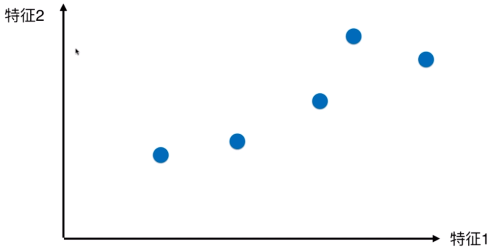

现在我们想给它降维，一个显而易见的方法就是将其投射到坐标轴上，如下所示：

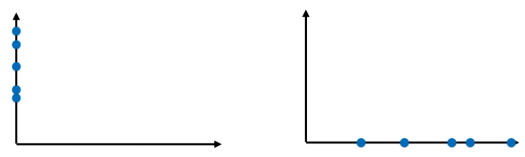

那么进一步不难看出，投射到x轴上的样本之间更疏，即区分度更高。那么还可以推广，能不能投射到某个斜直线上呢？

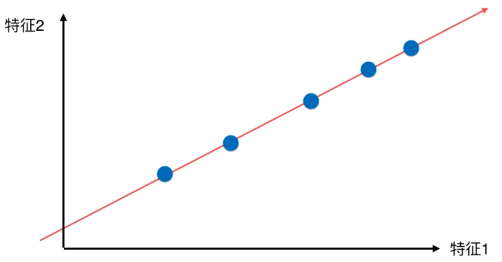

可见上图的投射结果比投射到x、y轴上的结果更好。那么我们就想如何找到一个使得样本间距最大的轴？而前提是如何定义样本间距（整体疏密程度）？我们想到方差（variance）：
$$
Var(X)=\frac{1}{m}\sum_{i=1}^{m}(x_i-\overline{x})^2
$$
选一个斜向的轴，使得样本空间中所有点映射（投影）到这个轴后，方差最大。

算法步骤：

1. 将样本的均值归零（demean），即令所有样本在每个维度上都减去对应均值，于是各维度均值变成0。反映在图上就变成这样子（先不看红线）：

   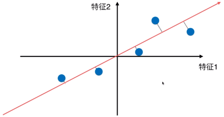

   样本的疏密情况（相对位置）不变，只是整体相对坐标轴的位置变了。这样一来，方差也发生变化：
   $$
   \overline{x}=0 \Rightarrow Var(X)=\frac{1}{m}\sum^m_{i=1}x_i^2
   $$

2. 找到一个轴（图中的红线）$w$，使得所有样本点映射到$w$之后，方差最大：
   $$
   \max_{w} Var(X_{project})
   =\max_{w} \frac{1}{m}\sum_{i=1}^m(x_{project}^{(i)}-\overline{x}_{project})^2
   $$
   上式成立的条件是将红线看做一维的轴，然而其实它仍处于二维平面中，故上式应改写为：
   $$
   \max_{\mathbf{w}} Var(X_{project})
   =\max_{\mathbf{w}} \frac{1}{m}\sum_{i=1}^m\|\mathbf{x}^{(i)}_{project}-\overline{\mathbf{x}}_{project}\|^2
   =\max_{\mathbf{w}} \frac{1}{m}\sum_{i=1}^m\|\mathbf{x}^{(i)}_{project}\|^2
   $$
   然后有如下推导：

   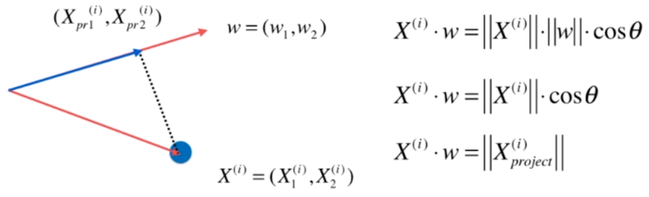

   注意其中${\mathbf{w}}$只注重方向，故为单位向量，$\|{\mathbf{w}}\|=1$。于是我们的目标就成了：求${\mathbf{w}}$，使得
   $$
   \max_{\mathbf{w}} Var(X_{project})
   =\max_{\mathbf{w}} \frac{1}{m}\sum_{i=1}^m(\bf{x}^{(i)}\cdot {\mathbf{w}})^2
   $$
   扩展到高维平面上，有下式：
   $$
   \begin{array}{ll}
   \max_\limits{\mathbf{w}} Var(X_{project})
   &= \max_\limits{\mathbf{w}} \frac{1}{m}\sum\limits_{i=1}^m(\sum_\limits{j=1}^nx^{(i)}_jw_j)^2\\
   &= \max_\limits{\mathbf{w}} \frac{1}{m}\sum\limits_{i=1}^m(x^{(i)}_1w_1+x^{(i)}_2w_2++x^{(i)}_nw_n)^2
   \end{array}
   $$
   上式就可称作PCA的目标函数。
   
   注意区分PCA与线性回归，虽然乍一看图长得挺像，但坐标含义和核心算法都是不同的。

### 使用梯度上升法求解PCA

目标：求$\bf{w}\in\mathbb{R}^n$，使得$f(X)=\frac{1}{m}\sum_\limits{i=1}^m(x^{(i)}_1w_1+x^{(i)}_2w_1+\cdots+x^{(i)}_nw_n)^2$最大。

注意虽然$X$这个函数的自变量，但它应当作为常量，为后面求导作铺垫。另外提一下为什么PCA是非监督方法，我们看这个函数只用到样本，而并没有监督信息即预测值$y$。

让函数$f$对$\bf{w}$求导即对其每个分量求偏导，详细过程这里先不写。

求导得到一个n维向量（$\bf{w}$也是n维向量）。

```python
import matplotlib.pyplot as plt
import numpy as np

X = np.empty((100, 2))
X[:, 0] = np.random.uniform(0., 100., size=100)
X[:, 1] = 0.75 * X[:, 0] + 3. + np.random.uniform(0., 10., size=100)
plt.scatter(X[:, 0], X[:, 1])
plt.savefig("initial_X.jpg")


def demean(X):
    """
    所有特征减去该特征的均值
    :param X: 一个行向量代表一个样本
    :return: 样本平移之后的结果
    """
    return X - np.mean(X, axis=0)


X_demean = demean(X)
plt.scatter(X_demean[:, 0], X_demean[:, 1])
# 不清空，可看出样本点的整体移动
plt.savefig("demean_X.jpg")
# 验证 输出的不是0，而是接近0的实数
print(np.mean(X_demean[:, 0]), np.mean(X_demean[:, 1]))


def f(w, X):
    """
    目标函数
    :param w: 轴向量
    :param X: 投影前的样本
    :return: 投影后样本的方差
    """
    return np.sum((X.dot(w)**2)) / len(X)


def d_f(w, X):
    """
    目标函数对w求导
    :param w: 轴向量
    :param X: 投影前的样本
    """
    return X.T.dot(X.dot(w)) * 2. / len(X)


def df_val(w, X, epsilon=0.0001):
    """
    导数的验证
    :param w: 轴向量
    :param X: 投影前的样本
    """
    res = np.empty(len(w))
    for i in range(len(w)):
        w_1 = w.copy()
        w_1 += epsilon
        w_2 = w.copy()
        w_2 -= epsilon
        res[i] = (f(w_1, X) - f(w_2, X)) / (2 * epsilon)
    return res


def gradient_ascent(df, w, X, eta, n_iters=1e4, epsilon=1e-8):
    """
    梯度上升法
    :param df: 不同求导方法
    :param w: 轴向量
    :param X: 投影前的样本
    :param eta: 学习率
    :param n_iters: 迭代次数
    :param epsilon: 峰值标志
    """
    # 化为单位向量
    w = w / np.linalg.norm(w)
    current_iter = 0
    while current_iter < n_iters:
        gradient = d_f(w, X)
        last_w = w
        w = w + eta * gradient
        # 再化为单位向量
        w = w / np.linalg.norm(w)
        if(abs(f(w, X) - f(last_w, X)) < epsilon):
            break
        current_iter += 1
    return w


# 不能初始化为零向量
initial_w = np.random.random(X.shape[1])
eta = 0.001
w = gradient_ascent(df_val, initial_w, X_demean, eta)
print(w)
w = gradient_ascent(d_f, initial_w, X_demean, eta)
print(w)
# 把轴画出来，主要看方向，这个轴就是一个主成分，也是第一主成分
plt.plot([0, w[0] * 100], [0, w[1] * 100], color="r")
plt.savefig("first_PCA.jpg")
```

### 求数据的前n个主成分

前面谈到的样本具有二维特征，得到一个主成分、映射到一（2-1）维空间也就够了。而对于高维数据，只映射到n-1维就不够了，也就是说我们应当要求出第二主成分、第三主成分……，所谓的轴处超平面中。下面就要想想如何求出后续主成分。

其实很简单，由于我们已经求出第一主成分，可以先对数据进行变更，即让它减掉在它第一个主成分上的分量，形如下图：


就得到特征维数不变的新数据，然后再对新数据求第一主成分。

```python
# 去掉第一主成分
X2 = X - X.dot(w).reshape(-1, 1) * w
plt.scatter(X2[:, 0], X2[:, 1])
# 求第二主成分即更新数据的第一主成分
w2 = gradient_ascent(d_f, initial_w, X2, eta)
print(w2)
# 第一主成分与第二主成分应当是正交的
print(w.dot(w2))
plt.plot([0, w2[0] * 100], [0, w2[1] * 100])
plt.savefig("second_PCA.jpg")
```

主成分实质上是供样本点们作投影的轴的方向，形式上这个方向用一个维数为原始特征维数的向量表示。

如此以往，我们就可以求得数据的前n个主成分：

```python
def first_component(w, X, eta, n_iters=1e4, epsilon=1e-8):
    """
    求数据的第一主成分
    :param w: 轴向量
    :param X: 投影前的样本
    :param eta: 学习率
    :param n_iters: 迭代次数
    :param epsilon: 峰值标志
    """
    w = w / np.linalg.norm(w)
    current_iter = 0
    while current_iter < n_iters:
        gradient = d_f(w, X)
        last_w = w
        w = w + eta * gradient
        w = w / np.linalg.norm(w)
        if(abs(f(w, X) - f(last_w, X)) < epsilon):
            break
        current_iter += 1
    return w


def first_n_component(n, X, eta=0.001, n_iters=1e4, epsilon=1e-8):
    """
    求数据的前n个主成分
    :param n: 主成分个数
    :param X: 投影前的样本
    :param eta: 学习率
    :param n_iters: 迭代次数
    :param epsilon: 峰值标志
    """
    X_pca = X.copy()
    X_pca = demean(X_pca)
    res = []
    for i in range(n):
        initial_w = np.random.random(X.shape[1])
        w = first_component(initial_w, X_pca, eta, n_iters, epsilon)
        res.append(w)
        X_pca = X_pca - X_pca.dot(w).reshape(-1, 1) * w
    return res


# 对二维样本的数据最多只能求2个主成分
print(first_n_component(2, X))
```

### 高维数据向低维映射

如何利用PCA对数据进行降维？

```python
import numpy as np
from numpy.core.fromnumeric import shape


def demean(X):
    return X - np.mean(X, axis=0)


class PCA:
    """
    主成分分析
    """

    def __init__(self, n_components) -> None:
        """
        :param n_components: 所求主成分个数
        """
        assert n_components >= 1, "n_components must be valid"
        self.n_components = n_components
        self.components = None

    def f(self, w, X):
        return np.sum((X.dot(w)**2)) / len(X)

    def d_f(self, w, X):
        return X.T.dot(X.dot(w)) * 2. / len(X)

    def first_component(self, w, X, eta, n_iters=1e4, epsilon=1e-8):
        w = w / np.linalg.norm(w)
        current_iter = 0
        while current_iter < n_iters:
            gradient = self.d_f(w, X)
            last_w = w
            w = w + eta * gradient
            w = w / np.linalg.norm(w)
            if(abs(self.f(w, X) - self.f(last_w, X)) < epsilon):
                break
            current_iter += 1
        return w

    def fit(self, X, eta=0.001, n_iters=1e4):
        """
        求得数据的前n个主成分
        :param X: 样本数据
        :param eta: 学习率
        :param n_iters: 梯度上升迭代次数
        """
        assert self.n_components <= X.shape[1], "n_componets must not be greater than the feature number of X"
        X_pca = X.copy()
        X_pca = demean(X_pca)
        self.components = np.empty(shape=(self.n_components, X.shape[1]))
        for i in range(self.n_components):
            initial_w = np.random.random(X.shape[1])
            w = self.first_component(initial_w, X_pca, eta, n_iters)
            self.components[i, :] = w
            X_pca = X_pca - X_pca.dot(w).reshape(-1, 1) * w
        return self

    def transform(self, X):
        """
        降维
        :param X: 待降维的数据
        """
        assert X.shape[1] == self.components.shape[1]
        return X.dot(self.components.T)

    def inverse_transform(self, X):
        """
        升维 将降维后的数据映射到原始超平面中展示
        :param X: 待升维的数据
        """
        assert X.shape[1] == self.components.shape[0]
        return X.dot(self.components)

    def __repr__(self) -> str:
        return "PCA(n_components={:%d})".format(self.n_components)

```

```python
import matplotlib.pyplot as plt
import numpy as np

from PCA import PCA

X = np.empty((100, 2))
X[:, 0] = np.random.uniform(0., 100., size=100)
X[:, 1] = 0.75 * X[:, 0] + 3. + np.random.uniform(0., 10., size=100)
# 求出所有主成分
pca = PCA(2)
pca.fit(X)
print(pca.components)
# 降维
pca = PCA(1)
pca.fit(X)
x_reduction = pca.transform(X)
print(x_reduction.shape)
x_restore = pca.inverse_transform(x_reduction)
print(x_restore.shape)
plt.scatter(X[:, 0], X[:, 1])
plt.scatter(x_restore[:, 0], x_restore[:, 1])
plt.savefig("x_restore.jpg")
```

求前n个主成分对应可以数据降到n维。

### scikit-learn中的PCA

先看看上例的等价写法：

```python
import matplotlib.pyplot as plt
import numpy as np
from sklearn.decomposition import PCA

X = np.empty((100, 2))
X[:, 0] = np.random.uniform(0., 100., size=100)
X[:, 1] = 0.75 * X[:, 0] + 3. + np.random.uniform(0., 10., size=100)
pca = PCA(n_components=1)
pca.fit(X)
# [[0.80054153 0.59927728]]
print(pca.components_)
X_reduction = pca.transform(X)
X_restore = pca.inverse_transform(X_reduction)
plt.scatter(X[:, 0], X[:, 1], color="b", alpha=0.5)
# 会发现降维后的数据再升维，落到二维空间上就会沿着主成分分布
plt.scatter(X_restore[:, 0], X_restore[:, 1], color="r", alpha=0.5)
plt.show()
```

下面看看降维对手写数据识别KNN分类的影响：

```python
import matplotlib.pyplot as plt
import numpy as np
from sklearn import datasets
from sklearn.decomposition import PCA
from sklearn.model_selection import train_test_split
from sklearn.neighbors import KNeighborsClassifier

# 加载手写数据集
digits = datasets.load_digits()
x = digits.data
y = digits.target
x_train, x_test, y_train, y_test = train_test_split(x, y, random_state=666)
# (1347, 64) 特征数是64
print(x_train.shape)
# 使用knn进行分类
knn_clf = KNeighborsClassifier()
knn_clf.fit(x_train, y_train)
# 0.9866666666666667
score = knn_clf.score(x_test, y_test)

# 降到2维之后再分类
pca = PCA(n_components=2)
pca.fit(x_train)
x_train_reduction = pca.transform(x_train)
x_test_reduction = pca.transform(x_test)
knn_clf = KNeighborsClassifier()
knn_clf.fit(x_train_reduction, y_train)
# 0.6066666666666667
score = knn_clf.score(x_test_reduction, y_test)
print(score)
```

可见从64维降到2维，测试正确率下降不少，因此我们不得不在运行时间和运行效果之间权衡。sklearn里的PCA库为我们提供了一个求得最佳目标维数的属性：

```python
# [0.14566817 0.13735469]
print(pca.explained_variance_ratio_)
```

以上两值分别指第一个主成分和第二个主成分对样本整体方差的解释率，那么它们的和是20%多，明显占比很少。我们求出前64个主成分，观察任一主成分对整体方差的解释率：

```python
pca = PCA(n_components=x_train.shape[1])
pca.fit(x_train)
print(pca.explained_variance_ratio_)
```

打印出：

```shell
[1.45668166e-01 1.37354688e-01 1.17777287e-01 8.49968861e-02
 5.86018996e-02 5.11542945e-02 4.26605279e-02 3.60119663e-02
 3.41105814e-02 3.05407804e-02 2.42337671e-02 2.28700570e-02
 1.80304649e-02 1.79346003e-02 1.45798298e-02 1.42044841e-02
 1.29961033e-02 1.26617002e-02 1.01728635e-02 9.09314698e-03
 8.85220461e-03 7.73828332e-03 7.60516219e-03 7.11864860e-03
 6.85977267e-03 5.76411920e-03 5.71688020e-03 5.08255707e-03
 4.89020776e-03 4.34888085e-03 3.72917505e-03 3.57755036e-03
 3.26989470e-03 3.14917937e-03 3.09269839e-03 2.87619649e-03
 2.50362666e-03 2.25417403e-03 2.20030857e-03 1.98028746e-03
 1.88195578e-03 1.52769283e-03 1.42823692e-03 1.38003340e-03
 1.17572392e-03 1.07377463e-03 9.55152460e-04 9.00017642e-04
 5.79162563e-04 3.82793717e-04 2.38328586e-04 8.40132221e-05
 5.60545588e-05 5.48538930e-05 1.08077650e-05 4.01354717e-06
 1.23186515e-06 1.05783059e-06 6.06659094e-07 5.86686040e-07
 7.44075955e-34 7.44075955e-34 7.44075955e-34 7.15189459e-34]
```

可见越往后占比越少。接着算求前i个主成分即降到i维的解释率，i从1到64：

```python
pca = PCA(n_components=x_train.shape[1])
pca.fit(x_train)
plt.plot(
    [i for i in range(x_train.shape[1])],
    [np.sum(pca.explained_variance_ratio_[:i + 1]) for i in range(x_train.shape[1])]
)
plt.show()
```

绘制得下图：

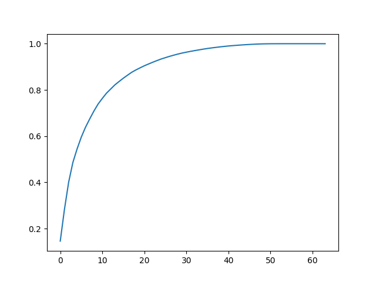

那么我们在初始化PCA对象时可以不传主成分个数，而是传解释率，对象就自动帮我们求得对应的主成分个数：

```python
pca = PCA(0.95)
pca.fit(x_train)
# 28
print(pca.n_components_)
```

如此我们就可以根据自己对时间和效果的考量选择一个合理的解释率或目标维数。

二是个很特殊的维数，有时我们将数据降到二维并不在乎这带来的糟糕预测效果，而是为了另一个目的-数据可视化。高维数据是绘制不出来的，一维数据又过于简单，三维数据又不够直观，只有二维数据最好看。

总体样本里的某些簇之间在二维空间就有较强的区分度，有些簇之间区分度不高则要求维数不应降得这么低。

```python
pca = PCA(2)
pca.fit(x)
x_reduction = pca.transform(x)
for i in range(10):
    plt.scatter(x_reduction[y == i, 0], x_reduction[y == i, 1], alpha=0.8)
plt.show()
```

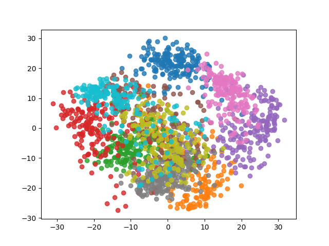

