# 设计模式

由于表达水平有限，理论描述能少则少，请阅读《Head First》等书籍，代码这里不列出，请参照项目。

## 概述

### 概念

软件工程中，设计模式（design pattern）是针对软件设计中普遍存在的各种问题提出的解决方案，该术语是由Erich Gamma在上世纪90年代从建筑设计领域引入到计算机科学的。

设计模式使程序或软件向着下面这些方向迈进：

- 重用性-相同的代码不多次重复。
- 可读性-程序员容易读懂。
- 扩展性-增加新代码，不影响其余代码。
- 维护性-修改或删除部分代码，不影响其余代码。

仔细阅读框架、JDK的源码，渐渐能领会出设计模式的精妙之处。

设计模式分三大类，共计23种，自下而上来看：

- 行为型模式（方法层面）：模板方法、命令、访问者、迭代器、观察者、中介者、备忘录、解释器、状态、策略、职责链。

- 创建型模式（类层面）：单例、抽象工厂、原型、建造者、工厂。
- 结构型模式（系统层面）：适配器、桥接、装饰、组合、外观、享元、代理。

不同书籍对模式的分类或命名有差异。

设计模式本身不依赖任何语言，只不过需要用某种语言来呈现。

### 设计原则

设计模式应当遵守的原则有七个：

- 单一职责原则（SRP-single responsibility principle）。
- 接口隔离原则（ISP-interface segregation principle）。
- 依赖倒转原则（DIP-dependency inversion principle）。
- 里氏替换原则（LSP-Liskov substitution principle）。
- 开闭原则（OCP-open-closed principle）。
- 迪米特法则（LOD-low of Demeter）或最少知道原则（LKP-least knowledge principle）。
- 组合/聚合复用原则（CARP-composite/aggregate reuse principle）。

请自行参考解读文章，如[七大基本原则](https://zhuanlan.zhihu.com/p/24614363)。

### UML

#### 概述

Unified Modeling Language-统一建模语言，是一种用于软件系统分析和设计的语言工具。

UML本身是一套符号化的规定，这些符号用于描述软件模型中的各个元素和他们之间的关系。

重中之重的是类之间的关系：

- 依赖（dependency）：一个类用到了另一个类（不管它出现在什么地方）。
- 关联（association）：一个类充当另一个类的成员变量。
- 聚合（aggregation）：类B的对象充当类A的成员变量，但B对象的生命周期与A的可一致可不一致，后者为主。
- 组合（composite）：类B的对象充当类A的成员变量，且B对象的生命周期与A的保持一致。
- 泛化（generalization）：一个类继承另一个类。
- 实现（realization）：一个类实现一个接口。

由上可得关联、聚合、组合、泛化、实现都是特殊的依赖，聚合与组合是关联的两种具体形式。

#### 依赖

只要在某类定义中看到其他类的身影，就说明有依赖关系产生了，具体要看这种依赖是强还是弱，目标就是弱化（解耦）。

#### 关联

关联具有：

- 导向性：单向单箭头、双向无箭头。
- 多重性：一对一、一对多、多对多。

关联分为组合和聚合。

#### 聚合

被关联类和关联类呈现整体与部分的关系，但整体与部分的生命周期可以不一致，做法是仅从外部将部分对象传入整体对象。

看下面人和香烟的例子。

```java
class Person {
	private String name;
	// 作域是前提，先有关联关系，再往聚合关系发展
	private Water water;

	public Person(String name, Water water) {
		super();
		this.name = name;
		this.water = water;
	}

	@Override
	public String toString() {
		return "Person [name=" + name + ", water=" + water + "]";
	}
}

class Water {
	public Water() {
		super();
	}
}

/* 主方法 */
Water water = new Water();
Person person = new Person("van", water);
System.out.println(person);
System.out.println(water);
```

Water对象可以先于Person对象创建，并迟于Person对象销毁。

#### 组合

被关联类和关联类同样呈现整体与部分的关系，且整体与部分的生命周期一致，做法是让部分对象仅从整体对象内部产生。

```java
class Body {
	// 作域是前提，先有关联关系，再往组合关系发展
	private Eye eye;

	/**
	 * 不提供带参构造器，以防止组合变聚合
	 */
	public Body() {
		// 构造Person对象同时构造Eye对象
		this.eye = new Eye();
	}

	@Override
	public String toString() {
		return "Body [eye=" + eye + "]";
	}
}

class Eye {
	public Eye() {
		super();
	}
}

/* 主方法 */
Body body = new Body();
// eye属性引用的Eye对象随着body对象销毁而销毁
System.out.println(body);
```

## 单例模式

### 概述

单例模式（singleton pattern），就是促使运行期内存中，某类只存在一个实例，且该类提供一个取得此实例的方法。

单例模式保证了对于某个类，内存中只有一个对象，一来节约了内存空间，二来避免了频繁创建、销毁对象的时间开销。

共8种实现方式，基本步骤是：

1. 构造器私有化。
2. 在类的内部创建本类对象。
3. 提供一个获取单例的静态公有方法。

### 饿汉式-静态常量

其实是不是常量无所谓。

创建实例只能靠构造器，构造器不能用的话实例也就无法创建，故构造器一旦私有化，外部就不能调用构造器，也就不能创建对象。构造器只能在内部使用，那么类在内部创建对象，然后通过一个公有方法向外提供唯一的对象。

优点：写法简单；在类加载的时候就进行实例化；JVM保证类只加载一次即只实例化一次，无线程安全问题。

缺点：没有实现懒加载（lazy loading）效果，即如果自始至终都没有用到这个实例，那么会造成内存的浪费。

此方式可能造成内存浪费，因此适用于确定会使用某类的情况。

### 饿汉式-静态代码块

这种写法跟上一种是等价的，只不过将实例化工作交给静态代码块。

### 懒汉式

优点：实现了懒加载。

缺点：只能在单线程条件下使用，在多线程下存在线程安全问题。比如线程A执行到判断语句为真时恰好卡住而尚未赋值，故instance为null，刚好线程B也执行到判断语句且无阻塞，于是执行赋值语句产生了一个实例，接着线程A执行赋值语句又产生了一个实例，最终空间里就有两个实例。

在实际开发中，不准使用此方式。

### 懒汉式-同步方法

使用synchronized关键字，使得各线程互斥地执行单例获取方法。

优点：实现懒加载，同时解决了线程不安全的问题。

缺点：效率低。当第一个线程已经创建单例，后续线程只可能拿单例，没必要同步。

在实际开发中，不推荐使用此方式。

### 懒汉式-同步代码块

将synchronized挪到方法体内，其位置决定了线程的安全与不安全，安全写法同上有效率低的问题。

### 懒汉式-双重检查

双重检查（double-check）概念在多线程开发中很常见，既可保证线程安全，又不牺牲效率。

实例化部分的代码（同步代码块）只由首线程执行一次，且后续线程不会再因同步代码块而阻塞，直接返回实例。

优点：线程安全；延迟加载；效率较高。

在实际开发中，推荐使用。

### 静态内部类

利用内部类延迟加载的特点，再加上JVM控制类仅加载一次，兼得线程安全和懒加载。

在实际开发中，推荐使用。

### 枚举

枚举的一大特性就是构造器私有，故天然地支持单例。

枚举不仅能避免线程安全问题，还能防止利用反射创建对象。

此方式是Effective Java的作者所提倡的，在实际开发中推荐使用。

## 工厂模式

### 案例

搞一个披萨订购的案例，要便于披萨种类的扩展、便于代码维护。

披萨店有好几种披萨，如胡椒披萨、奶酪披萨。每种披萨的制作都有四道工序：准备、烘烤、切块、打包。

类图如下：

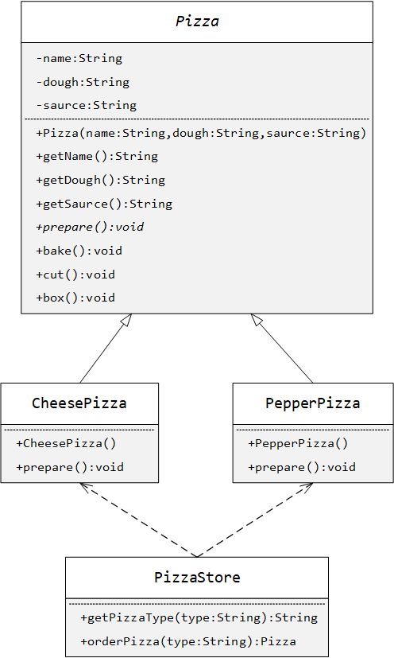

此方式的优点就是简单直白。

缺点是违反了OCP、维护性差。

改进：把Pizza子类对象的创建工作封装到一个类中，这样我们有新的披萨种类时，只需修改这个类，而原orderPizza方法体无需改变。即抽离出变动的部分，保留不变的部分，由此引出简单工厂模式。

### 简单工厂

工厂模式（Factory Pattern）所有的子模式都用来封装对象的创建。

简单工厂是指由一个工厂对象创建产品类的实例（定义工厂类封装实例化产品类的行为），乃是工厂模式家族中最轻量实用的。

下面就针对案例设计简单工厂：定义一个专用于实例化Pizza子类对象的类。

类图如下：

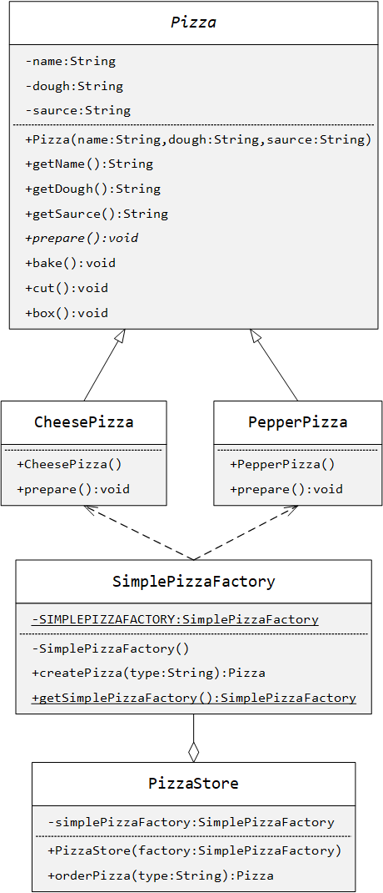

改进之后，对象的创建与使用解耦，略微提升可维护性。现在要添加新种类披萨的话，只用改工厂的方法这一处代码即可。

### 工厂方法

简单工厂虽然分离出变动的部分，但面对新的产品类，仍然违背OCP。

援引《Head First》：

>  **The Factory Method** Pattern defines an interface for creating an object, but lets subclasses decide which
>  class to instantiate. Factory Method lets a class defer instantiation to subclasses.

做法：定义一个抽象创建者类，含一个用于创建对象的抽象方法，由子类重写，决定具体要实例化的类。

类图如下：

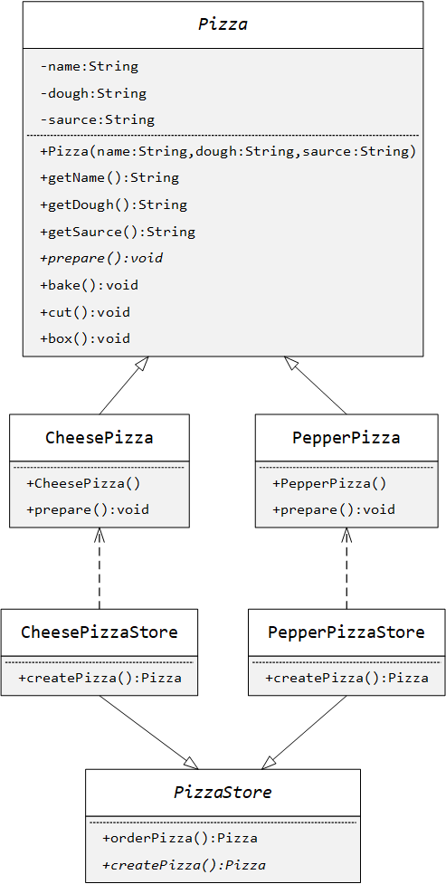

宏观上产品类位于上半部分，创建者类位于下半部分。

根据此模式理解DIP，呼应扩展性。

### 抽象工厂

援引《Head First》：

>  **The Abstract Factory** Pattern provides an interface for creating families of related or dependent objects without specifying their concrete classes.

抽象工厂与工厂方法容易混淆，还是通过案例来理解。现在想让这两种披萨都能做出武汉和北京这两种风味，要在原料-Pizza类的dough和saurce属性上做文章，我们把原料也视作产品类，于是设计出4种具体产品类，再围绕它们设计出具体创建者类，同时面向接口编程，设计出抽象的产品类与原料工厂，最后让现有的一组抽象（产品与创建者）-Pizza与PizzaStore依赖这一组抽象。

类图如下：

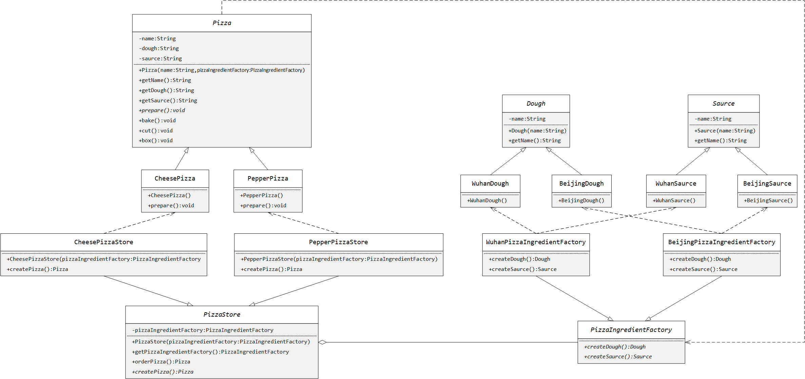

假定我们将一组产品类及其创建者类称作一个家族，那么上图中明显有两个家族，左边的家族依赖右边的家族，直观上左家族的抽象产品类及创建者类依赖右家族的抽象创建者类。

## 原型模式

### 案例

现有一个绵羊类，实例化一个对象，名叫多利，年龄1岁，颜色为白色。实现将其克隆10份甚至100份。

传统方式无非傻傻地一行行地调用构造器，聪明一点用上循环。当对象属性相当多时，克隆起来就很麻烦了，代码量也大。

### 改进

原型模式（Prototype Pattern）约为Object类中定义的clone方法，即通过复制现有的实例来创建实例，这比普通的创建方式更高效，同时为客户屏蔽创建细节，代码量也更少。

面对未知类型的对象，原型模式也是更为方便，要让我们自己写得用反射，写起来麻烦。

想用clone方法的类须实现Cloneable接口，但有趣的是此接口一个方法都没有。clone方法由native修饰，意即底层实现靠的是C。

### 深浅拷贝

默认的clone方法是浅拷贝，意即拷贝引用类型的域时拷贝的是地址值。

往往深拷贝更有必要，一般有两种方式：

- 级联地调用clone方法，但就怕属性特别多，或级联地特别深。
- 利用序列化与反序列化，简化代码，还适合未知类，推荐。

## 建造者模式（Builder Pattern）

##### 场景

场景：盖房子，盖各种各样的房子，步骤都是打地基、搭结构、装修等等，但不同的房子各步骤具体操作是不同的。那么就编写个程序来盖各种各样的房子。

首先给出这样的类图：

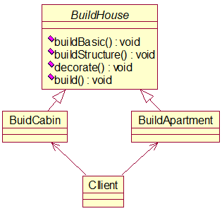

下面源代码：

```java
package builder;

/**
 * 抽象类-造房子
 * 
 * @author Van
 */
public abstract class BuildHouse {
	/**
	 * 打地基
	 */
	public abstract void buildBasic();

	/**
	 * 搭结构
	 */
	public abstract void buildStructure();

	/**
	 * 装修
	 */
	public abstract void decorate();

	/**
	 * 完整流程，把房子造出来
	 */
	public void build() {
		buildBasic();
		buildStructure();
		decorate();
	}
}
```

```java
package builder;

/**
 * 实现类-造小木屋
 * 
 * @author Van
 */
public class BuildCabin extends BuildHouse {
	public void buildBasic() {
		System.out.println("正在打小木屋的地基");
	}

	public void buildStructure() {
		System.out.println("正在搭小木屋的结构");
	}

	public void decorate() {
		System.out.println("正在装修小木屋");
	}
}
```

```java
package builder;

/**
 * 实现类-造公寓
 * 
 * @author Van
 */
public class BuildApartment extends BuildHouse {
	public void buildBasic() {
		System.out.println("正在打公寓的地基");
	}

	public void buildStructure() {
		System.out.println("正在搭公寓的结构");
	}

	public void decorate() {
		System.out.println("正在装修公寓");
	}
}
```

```java
package builder;

import static org.junit.jupiter.api.Assertions.fail;

import org.junit.jupiter.api.Test;

/**
 * 客户端测试
 * 
 * @author Van
 */
class Client {

	@Test
	void test() {
		fail("Not yet implemented");
	}

	@Test
	void testBuildCabin() {
		new BuildCabin().build();
	}

	@Test
	void testBuildApartment() {
		new BuildApartment().build();
	}
}
```

优点：比较好理解，简单易操作。

缺点：程序在结构上过于简单，没有设计缓存层对象，程序的扩展和维护不够好，因为这个设计把产品和产品的制造过程揉在一起了（我反正没看出来），耦合性增强了。

改进方案：将产品和产品的建造过程分离，即得出建造者模式（包工头模式）。

##### 基本介绍

建造者模式：又叫生成器模式，是一种对象构建模式。它可以将复杂对象的建造过程抽象出来，使这个抽象过程的不同实现方法可以构造出不同表现（属性）的对象。

建造者模式是一步一步创建一个复杂的对象，它允许用户只通过复杂的类型和内容就可以构建它们，用户不需要知道内部具体的构建细节。

| 建造者模式的四个角色          | 角色说明                                                     |
| ----------------------------- | ------------------------------------------------------------ |
| Product（产品角色）           | 一个具体的产品对象。                                         |
| Builder（抽象建造者）         | 创建Product对象的接口或抽象类。                              |
| ConcreteBuilder（具体建造者） | 实现上面这个接口，构建和装配各部件。                         |
| Directer（指挥者）            | 使用Builder接口的复杂对象，作用是隔离客户与产品的生产过程以及控制产品的生产过程。 |

四者的关系如下图所示：

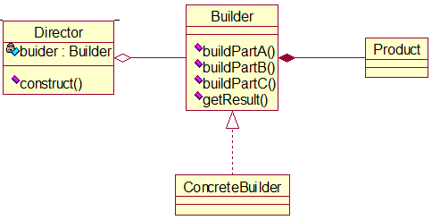

那么在Client和ConcreteBuilder之间就塞了个缓冲层Director。

##### 改进

```java
package builder.improve;

/**
 * 产品-房子
 * 
 * @author Van
 */
public class House {
	private String basic;// 地基
	private String wall;// 墙
	private String roof;// 屋顶

	public String getBasic() {
		return basic;
	}

	public void setBasic(String basic) {
		this.basic = basic;
	}

	public String getWall() {
		return wall;
	}

	public void setWall(String wall) {
		this.wall = wall;
	}

	public String getRoof() {
		return roof;
	}

	public void setRoof(String roof) {
		this.roof = roof;
	}

	@Override
	public String toString() {
		return "House [basic=" + basic + ", wall=" + wall + ", roof=" + roof + "]";
	}
}
```

```java
package builder.improve;

/**
 * 抽象建造者
 * 
 * @author Van
 */
public abstract class HouseBuilder {
	/**
	 * 造地基
	 */
	public abstract void buildBasic();

	/**
	 * 造墙
	 */
	public abstract void buildWall();

	/**
	 * 造屋顶
	 */
	public abstract void buildRoof();

	/**
	 * 完整流程
	 */
	public abstract House build();
}
```

```java
package builder.improve;

/**
 * 具体建造者-小屋建造者
 * 
 * @author Van
 */
public class CabinBuilder extends HouseBuilder {
	// 小木屋
	private House house = new House();

	@Override
	public void buildBasic() {
		house.setBasic("小木屋的地基");
	}

	@Override
	public void buildWall() {
		house.setWall("小木屋的墙");
	}

	@Override
	public void buildRoof() {
		house.setRoof("小木屋的屋顶");
	}

	@Override
	public House build() {
		buildBasic();
		buildWall();
		buildRoof();
		// 得到成品小木屋
		return house;
	}

}
```

```java
package builder.improve;

/**
 * 具体建造者-公寓建造者
 * 
 * @author Van
 */
public class ApartmentBuilder extends HouseBuilder {
	// 公寓
	private House house = new House();

	@Override
	public void buildBasic() {
		house.setBasic("公寓的地基");
	}

	@Override
	public void buildWall() {
		house.setWall("公寓的墙");
	}

	@Override
	public void buildRoof() {
		house.setRoof("公寓的屋顶");
	}

	@Override
	public House build() {
		buildBasic();
		buildWall();
		buildRoof();
		// 得到成品公寓
		return house;
	}

}
```

```java
package builder.improve;

/**
 * 建造总指挥
 * 
 * @author Van
 */
public class HouseDirector {
	// 建造者
	private HouseBuilder houseBuilder;

	/**
	 * 构造器（向上转型）
	 * 
	 * @param houseBuilder 建造者的实现类
	 */
	public HouseDirector(HouseBuilder houseBuilder) {
		super();
		this.houseBuilder = houseBuilder;
	}

	public HouseBuilder getHouseBuilder() {
		return houseBuilder;
	}

	public void setHouseBuilder(HouseBuilder houseBuilder) {
		this.houseBuilder = houseBuilder;
	}

	/**
	 * 指挥建造者造出房子
	 * 
	 * @return 房子
	 */
	public House constructHouse() {
		return houseBuilder.build();
	}
}
```

```java
package builder.improve;

import static org.junit.jupiter.api.Assertions.fail;

import org.junit.jupiter.api.Test;

class ClientTest {

	@Test
	void testBuildCabin() {
		// 勒令指挥者完成一套小木屋
		HouseDirector houseDirector = new HouseDirector(new CabinBuilder());
		House house = houseDirector.constructHouse();
		System.out.println(house);
	}

	@Test
	void testBuildApartment() {
		// 勒令指挥者完成一套公寓
		HouseDirector houseDirector = new HouseDirector(new ApartmentBuilder());
		House house = houseDirector.constructHouse();
		System.out.println(house);
	}
}
```

##### 小结

客户端不必知道产品构造的细节。产品和产品的构造过程解耦合，使得相同的创建过程可得到不同的对象（抽象类或接口由不同的实现类实现）。

每一个具体的建造者都是相互独立的，因此可以很方便地替换或添加具体建造者（满足开闭原则），且使用不同的建造者可得到不同的产品对象。

可以灵活地编写方法来更加精细地控制产品创建过程。

## 适配器模式

### 概述

适配器概念来源于生活，比如各国插头插座规格不统一，可以用交流电适配器接通美式插头与欧氏插座，进而让电器更通用。

适配器又叫包装器（wrapper），援引《Head First》对适配器模式（adapter pattern）的定义：

>  **The Adapter Pattern** converts the interface of a class into another interface the clients expect. Adapter lets classes work together that couldn’t otherwise because of incompatible interfaces.

适配器模式主要分三类：类适配器模式、对象适配器模式、接口适配器模式。

工作原理：将类实现的一个接口（被适配者）转换为实现的另一个接口（目标接口或适配者）。用户感觉看不到被适配者，而只和目标接口交互，因为用户直接调用的是目标接口方法，底层适配器去调用被适配者的方法。

### 类适配器

类适配器模式指被适配者以类的形式服务于适配器，即让适配器继承被适配者，同时继承（对Java来说只能实现）适配者。

案例：电压适配器将被适配者-220V交流电转换为适配者-5V直流电。类图如下：


有一些缺点：

- Java只支持单继承，故适配器在已经继承被适配者的条件下适配者只能是接口，有一定局限性。
- 被适配者的方法暴露给适配器，一来子类的覆盖可能破坏父类的功能，二来父类的修改可能影响到子类，即违反LSP与CARP。

### 对象适配器

对象适配器模式指被适配者以实例的形式服务于适配器，即让适配器不去继承被适配者，而是持有被适配者实例，具体可以是聚合、组合，也可以是参数依赖，这样满足了上述两个原则。

类图如下：


对象适配器模式较为常用。

### 接口适配器

一些书也称其为缺省适配器模式。

当适配细节尚不明确，即暂不知目标接口的哪些方法与被适配者相关，可设计一个抽象适配器来实现目标接口，对接口全体方法进行空实现，等到细节明确了再安排具体适配器继承抽象适配器并重写想要重写的方法。

还是电压转换的例子，扩充适配者的输出电压，并灵活新增220V、110V被适配者分别重写输出5V、输出10V的方法：


但是随着Java 8新特性-接口的默认方法问世，这个接口适配器就无甚意义了。

## 桥接模式

### 案例

譬如有像下面这样的手机类图：


如果用单级继承，会造成代码冗余。

缺点是类数量爆炸，从两个方向来看：

- 横向：在第二级增加样式，或在第三级增加品牌，或二三级同时增加。
- 纵向：再多一级分类，继承树的叶子结点数目将$\times3$。

如此代码的维护成本大大增加。

### 改进

引入两个术语-抽象与实现，就分别理解成案例继承树里的第二级与第三级。

援引《Head First》：

> The Bridge Pattern allows you to vary the implementation and the abstraction by placing the two in separate class hierarchies.

桥接模式（Bridge Pattern）致力于让类的数目尽量少，通过层次内继承与层次间聚合的手段让不同的类层次承担不同的职责。

根据桥接模式的思路，可将手机类图改造为下面这个类图，将多级继承等价改为多层聚合，避免了类数量的高速增长。


左边这个层次就是抽象，右边这个层次就是实现，是横向来看的，它们之间的聚合就是桥接。可以看出，无论是扩充样式还是品牌，都只需在各自的层次内进行操作，而且还能往左边继续桥接，增加新层次（新分类），不违反OCP。

桥接模式实现了抽象和实现部分的分离，从而极大提高了系统的灵活性，有助于对系统进行分层设计，产生更好的结构化系统。

## 装饰器模式

### 案例

计算咖啡订单总价：

- 主体产品-咖啡：细分为浓咖啡、低因咖啡等。
- 附加产品，这里暂列两种：
  - 配料：细分为牛奶、豆浆等。
  - 包装：细分为袋装、盒装等。


每个单品（具体的主体或附加产品）有各自的单价，求总价就是结合份数对它们进行累加。

最朴素的方案是对这些单品进行任意搭配得到特定类，每个特定类继承同一个产品抽象类，明显问题是类数量爆炸，很占用空间。

些微改进的方案是像上一章的第一个类图那样将单级继承替换成多级继承，数量有所缓和，但仍会爆炸式增长。

再改进一点，让附加单品类对象作主体单品抽象类的实例域。


缺点：违反OCP与DIP，当有新的具体配料或现有的具体配料下架。

遵守DIP，让Soy与Milk派生自某类，把count、milk域替换为父类列表类型的域，但仍违反OCP，当新增附加产品如包装。

那么可以看出不能让主体依赖附加，应该反过来，让附加产品抽象类对象依赖主体产品抽象类，这就成了桥接模式，灵活新增附加单品-一直向左桥接。


可惜还是违反OCP，因为对删除桥中间的附加产品不友好。还有缺点见测试代码。

最后引出最佳的装饰器模式。

### 改进

援引《Head First》对装饰器模式（decorator pattern，或装饰者模式）的定义：

> **The Decorator Pattern** attaches additional responsibilities to an object dynamically. Decorators provide a flexible alternative to subclassing for extending functionality.

任意附加产品抽象类继承且聚合主体产品抽象类。类图如下：


附加产品兼为主体产品。

增减任何附加产品家族都不违反OCP。

实例化时的直观特征是构造器嵌套。

扩展想法：这里不能将其他构造器传入Decaf、Espresso的构造器，即一系列附加单品只能附着在一种主体单品上。除非让基类也去聚合自己，构造器也加个Beverage参数。

### 注

装饰器模式在Java IO中大放异彩，我们无数次地看见一个流对象传入另一个流的构造器，后者继续传入下一个流的构造器，不断嵌套。对照上图，观察到处理流类构造器都有一个四个抽象基类之一的参数，不同的是有的处理流不聚合而仅依赖基类，这是由具体使用场景决定的。

## 组合模式（Composite Pattern）

##### 场景

编写程序展示一个大学的专业结构。在页面中，大学名字是第一级，院系名是第二级，专业名是第三级。

分析：我们的要求应该是对院系和专业能进行很好的管理（增删改查），于是我们应把学校院系专业看作一个组织结构（树形结构），上级包含下级且上下级对象差异性很低，由此引出组合模式。

##### 基本介绍

组合模式又叫部分整体模式，它将对象组合成树状结构以表示整体-部分的层次关系。

组合模式属结构型模式。

组合模式使得用户对单个对象和组合对象的访问具有统一性，即基于同一种方式，用户既能处理个别对象又能处理组合对象。

我们对树状结构的结点进行操作时，无需考虑其为叶子结点还是非叶子结点，操作方式一致。

##### 实现

类图如下：

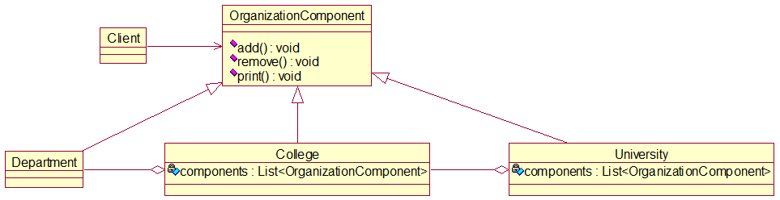

源代码如下：

```java
package composite;

/**
 * 对树状结构中各级结点的统一抽象
 * 
 * @author Van
 */
public abstract class OrganizationComponent {
	// 机构名
	private String name;
	// 描述
	private String description;

	public OrganizationComponent(String name, String description) {
		super();
		this.name = name;
		this.description = description;
	}

	public String getName() {
		return name;
	}

	public void setName(String name) {
		this.name = name;
	}

	public String getDescription() {
		return description;
	}

	public void setDescription(String description) {
		this.description = description;
	}

	/**
	 * 增加子组件。不用abstract修饰，叶子结点不必重写add方法
	 */
	protected void add(OrganizationComponent component) {
		// 默认实现
		throw new UnsupportedOperationException();
	}

	/**
	 * 删除子组件。不用abstract修饰，叶子结点不必重写remove方法
	 */
	protected void remove(OrganizationComponent component) {
		// 默认实现
		throw new UnsupportedOperationException();
	}

	/**
	 * 打印本组件信息。无论叶子结点还是非叶子结点，都要print方法，故用abstract修饰
	 */
	protected abstract void print();
}
```

```java
package composite;

import java.util.LinkedList;
import java.util.List;

/**
 * 大学组件类，管理下一级院系组件
 * 
 * @author Van
 */
public class University extends OrganizationComponent {

	// 院系列表
	private List<OrganizationComponent> components = new LinkedList<OrganizationComponent>();

	public University(String name, String description) {
		super(name, description);
	}

	@Override
	protected void add(OrganizationComponent component) {
		components.add(component);
	}

	@Override
	protected void remove(OrganizationComponent component) {
		components.remove(component);
	}

	/**
	 * 打印所含院系
	 */
	@Override
	protected void print() {
		System.out.println("======" + getName() + "======");
		for (OrganizationComponent component : components)
			component.print();
	}

}
```

```java
package composite;

import java.util.LinkedList;
import java.util.List;

/**
 * 院系组件类，管理下一级专业组件
 * 
 * @author Van
 */
public class College extends OrganizationComponent {

	// 专业列表
	List<OrganizationComponent> components = new LinkedList<OrganizationComponent>();

	public College(String name, String description) {
		super(name, description);
	}

	@Override
	protected void add(OrganizationComponent component) {
		components.add(component);
	}

	@Override
	protected void remove(OrganizationComponent component) {
		components.remove(component);
	}

	@Override
	protected void print() {
		System.out.println("  " + getName());
		for (OrganizationComponent component : components)
			component.print();
	}

}
```

```java
package composite;

/**
 * 目前专业组件类是叶子结点，无下一级组件可管理，无需重写add和remove方法
 * 
 * @author Van
 */
public class Department extends OrganizationComponent {

	public Department(String name, String description) {
		super(name, description);
	}

	@Override
	protected void print() {
		System.out.println("      " + getName());
	}

}
```

```java
package composite;

import org.junit.jupiter.api.Test;

/**
 * 测试
 * 
 * @author Van
 */
class ClientTest {

	@Test
	void testUniversityInfo() {
		// 利用add方法组织起结构
		Department softwareEngineerDepartment = new Department("软件工程", "高薪就业");
		Department digitalMediaDepartment = new Department("数字媒体技术", "计算机和艺术的融合");
		Department folkDepartment = new Department("民俗学", "");
		Department chineseDepartment = new Department("中国文学", "最好的语言-汉语");
		Department foreignDepartment = new Department("外国文学", "外文");

		College computerCollege = new College("计算机学院", "最高薪的学院");
		computerCollege.add(softwareEngineerDepartment);
		computerCollege.add(digitalMediaDepartment);
		College chinaCollege = new College("国学院", "人文底蕴极深");
		chinaCollege.add(folkDepartment);
		College literaturecollege = new College("文学院", "才子佳人聚集之地");
		literaturecollege.add(chineseDepartment);
		literaturecollege.add(foreignDepartment);

		University university = new University("清华大学", "北大死敌");
		university.add(computerCollege);
		university.add(chinaCollege);
		university.add(literaturecollege);
		university.print();
	}

}
```

##### 小结

简化客户端操作。用户只需面对一致的对象而无需考虑结点是不是叶子结点。

扩展性强。当我们需要更改树状结构时，无需改动现有代码，只用增删一些组件（结点）。

组合模式很适用于处理具有树状结构的诸对象及遍历结构树的各级结点。

组合模式要求各级结点对象具有高度的相似性，可抽象出统一的抽象类或接口。那么方法或属性大不相同的类就不适合使用组合模式。

## 外观模式

### 案例

照搬《Head First》上的相关场景-布置家庭影院。

完整地播放、关闭电影，需要我们对相关的类及它们的关系有相当的了解，这带来了极大的使用难度。类图如下：


### 改进

援引《Head First》对外观模式（facade pattern，或门面模式）的定义：

> **The Facade Pattern** provides a unified interface to a set of interfaces in a subsystem. Facade defines a higherlevel interface that makes the subsystem easier to use.

这里提出了三个概念-客户、外观、子系统，上图中除Home外的6个类组成一个子系统，内部成员互有依赖，若没有门面的统一化处理成员越多或依赖关系越复杂便使得客户对子系统的使用难度大大增加。

改进类图如下：


### 注

外观模式很助于理解LOD（LKP）。

外观模式的一个典型体现是三层架构，有时候想为什么有controller层与浏览器交互，有dao层与数据库交互，它们俩对接不就行了，多出个service层是不是多余了。那其实不是，dao层就是子系统，controller层就是客户，service层作为它们之间的外观缓冲，降低控制层逻辑的复杂度，同时可以提升重用性。

## 享元模式（Flyweight Pattern）

##### 场景

有一个外包项目，给客户A做一个产品展示网站，随后又有客户B想要这个网站，不过他们的要求不尽相同：

- 有客户想以新闻的形式发布。
- 有客户想以博客的形式发布。
- 有客户想以微信公众号的形式发布。

分析可知，网站的相似度很高，且访问量都不大，如果分成多个虚拟空间来处理，即状态完全一样的网站对象实例很多，那么会造成服务器资源的浪费。

改进的思路是像单例模式那样，仅用一个网站，共享其中的代码和数据，对硬盘、CPU、内存、数据库等服务器资源都可达成共享。

对代码而言，由于只有一份实例，维护和扩展都更加容易。

##### 基本介绍

享元模式也叫蝇量模式，意为运用共享技术有效支持大量细粒度（难以再分）的对象。

常用于系统底层开发，提高系统性能。比如数据库连接池，它里面都是创建好的对象，我们可以直接拿来用，避免重新创建，若没有我们需要的，则在其中新建。这样一来就很好地解决相同实例的内存浪费问题。其他例子诸如：String常量池、缓冲池。

享元模式是池技术的重要实现方式。

##### 内部状态和外部状态

这两种状态是享元模式中的概念。享元模式提出两大要求：细粒度和共享对象，那么对象的信息就分为这两个部分。

内部状态指对象所共享的信息，存储在享元对象内部且不随环境改变而改变。

外部状态指依赖一个标记、随环境改变而改变、不可共享的对象信息。

##### 实现

类图如下：

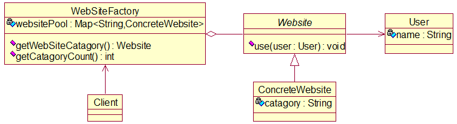

源代码如下：

```java
package flyWeight;

/**
 * 抽象网站类
 * 
 * @author Van
 */
public abstract class Website {
	/**
	 * 指明由谁使用何种网站
	 */
	public abstract void use(User user);
}
```

```java
package flyWeight;

/**
 * 指明形式的具体站点类，继承抽象站点类
 * 
 * @author Van
 */
public class ConcreteWebsite extends Website {

	// 网站类别或发布形式
	private String catagory;

	public ConcreteWebsite(String catagory) {
		this.catagory = catagory;
	}

	@Override
	public void use(User user) {
		System.out.println("网站的发布形式为：" + catagory + "；" + "此类站点的使用者为：" + user.getName());
	}

}
```

```java
package flyWeight;

/**
 * 网站使用者
 * 
 * @author Van
 */
public class User {
	private String name;

	public User(String name) {
		this.name = name;
	}

	public String getName() {
		return name;
	}

	public void setName(String name) {
		this.name = name;
	}
}
```

```java
package flyWeight;

import java.util.HashMap;
import java.util.Map;

/**
 * 网站工厂类
 * 
 * @author Van
 */
public class WebsiteFactory {
	// 各形式站点的存放池
	private Map<String, ConcreteWebsite> websitePool = new HashMap<>();

	/**
	 * 从池中获取所需形式的站点对象
	 * 
	 * @return 某形式的站点对象
	 */
	public Website getWebsite(String catagory) {
		// 若指定类别的站点存在，则直接拿，否则先新加入该类别的站点，再拿
		if (websitePool.containsKey(catagory))
			return (ConcreteWebsite) websitePool.get(catagory);
		websitePool.put(catagory, new ConcreteWebsite(catagory));
		return (ConcreteWebsite) websitePool.get(catagory);
	}

	/**
	 * 统计一下站点池中有多少种站点
	 * 
	 * @return 站点类别总数
	 */
	public int getCatagoryCount() {
		return websitePool.size();
	}
}
```

```java
package flyWeight;

import org.junit.jupiter.api.Test;

/**
 * 测试类
 * 
 * @author Van
 */
class Client {

	@Test
	void testWebsiteCatagory() {
		WebsiteFactory websiteFactory = new WebsiteFactory();
		Website website1 = websiteFactory.getWebsite("新闻");
		website1.use(new User("小明"));

		Website website2 = websiteFactory.getWebsite("博客");
		website2.use(new User("小红"));
		Website website3 = websiteFactory.getWebsite("博客");
		website3.use(new User("小刚"));

		Website website4 = websiteFactory.getWebsite("微信公众号");
		website4.use(new User("小华"));
		Website website5 = websiteFactory.getWebsite("微信公众号");
		website5.use(new User("小张"));

		System.out.println("现有站点的总数为：" + websiteFactory.getCatagoryCount());
	}

}
```

## 代理模式

### 概述

即Proxy Pattern，概念：为一个对象提供一个替身，以控制对这个对象的访问，即通过代理对象访问目标对象，好处是在目标对象基础上，增加额外的功能。

我们想让目标对象满足OCP原则，很稳定，不修改，但又想随着场景的变化扩充其功能，那么可以通过创建代理对象来扩充功能。

实际应用中目标对象往往是远程对象、创建时开销大的对象或需要安全控制的对象。

代理模式的形式有三种：静态代理、动态代理和Cglib代理。

使用代理模式时，要求被代理对象和代理对象实现相同的接口或继承相同的父类。

### 静态代理

所谓静态，是指编译期间代理类和被代理类都确定下来。

类图如下，也可将聚合改为依赖，即让Actionable对象-被代理对象作litigate方法的参数。


可以看出，若让多个目标类实现接口，则代理类能给多个目标类扩展相同的功能，也可创建多个代理类给一个目标类扩展多种功能。

优点：在不改动目标类的前提下，能通过代理对象对其进行功能扩展。

缺点：想让代理类给接口的多个方法扩展相同逻辑，或者想让代理类多实现、给多个接口扩展相同逻辑，这些场景均会造成代码冗余、维护性差的问题。由此引出动态代理简化重复工作。

### 动态代理

代理类无需自定义，也就无需显式实现接口（底层实现），也就免去代理类写大量相同逻辑的负担，被代理类要显式实现。

利用反射API里的Proxy类，调用其newProxyInstance方法为动态地为被代理对象生成代理对象。


如图所示，代理类仍隐式实现接口。它将相同操作切到任一接口的任一方法中，不会产生代码冗余。

缺点：仍要求目标类与代理类必须实现同一接口，最好能为未实现任何接口的类的对象创建代理对象，由此引出下一节。

### Cglib代理

静态代理和动态代理都要求目标对象实现同一个接口，但有时目标类并没有实现接口，这时可通过目标类的子类完成代理。

故Cglib代理又叫子类代理，是在运行期内存中动态为目标对象构建一个子类对象，让它重写目标方法，以实现功能扩展。在底层它借助字节码处理框架ASM转换被代理类字节码得到子类字节码（代理类），后面使用新字节码创建的对象调用目标方法。

Cglib是一个高性能字节码生成包，广泛作为各框架的AOP技术支持。

需要引入4个jar包：

```
asm
asm-commons
asm-tree
cglib
```

类图如下，第4个包里的方法拦截器接口是关键。


### 变体

变体有：防火墙代理、缓存代理、远程代理、同步代理等。

## 模板模式

### 案例

就按《Head First》上的例子理解，简要回顾一下：

| 做咖啡     | 做茶   |
| ---------- | ------ |
| 烧水       | 烧水   |
| 沏咖啡豆   | 沏茶叶 |
| 入杯       | 入杯   |
| 加糖和牛奶 | 加柠檬 |

原始做法就是写两个类，各定义各的这些步骤方法。

明显看出有两步完全一样，改进就是定义一个抽象父类，将两步抽到其中，另定义两个虚方法交付子类覆盖。

进一步洞察出它们之间的相似性，即沏和加配料的行为也可以抽取成父类的虚方法。那么父类的这些方法按序形成一个算法模板即一个方法，每一步也是一个方法，部分步骤父类已公共实现，部分步骤延迟到子类完成，这个模板为诸子类的各自任务指定了统一的规范，故往往是final的，让所有子类无条件遵守，不可篡改。

### 改进

给出《Head First》对模板方法模式（template method pattern，或模板模式的定义：

> **The Template Method Pattern** defines the skeleton of an algorithm in a method, deferring some steps to subclasses. Template Method lets subclasses redefine certain steps of an algorithm without changing the algorithm’s structure.

其他类图就不做了，直接看模板方法的：


### 钩子

现有的算法骨架十分稳定，一个方法连一个方法，稳定的反面就是不灵活，而有时子类任务确实希望这个骨架是可控制的，如在某些节点可选择地插入特定步骤、可选择地根据条件决定某步骤的执行。

由此引入钩子（hook），比如就上图在父类中定义并在模板方法体中嵌入3个钩子，钩子并非抽象方法，而给出空实现或默认实现，因为有的子类有钩入需求有的则没有即不需要重写。


## 命令模式（Command Pattern）

##### 场景

我们买了一套智能家电，它们来自不同的厂家，只需在手机上安装一个APP就可控制它们工作。

要实现一个APP控制所有家电，则需每个智能家电厂家都提供一个统一的接口供APP调用，这时可考虑用命令模式。

命令模式将动作的请求者从动作的执行者从解耦出来。本例中，动作的请求者是手机APP，动作的执行者是各个厂家的智能家电产品。

##### 基本介绍

结合多态思想理解，在软件设计中，我们经常需要向某些对象发送请求，但事先不知道请求的接收者是谁或它们随机而变，也不知道它们具体的操作（一般是各不相同的）。那么我们可在程序运行时指定具体的请求接收者（符合运行时多态的思想）。

命令模式就消除了命令的请求者和接收者之间的耦合，通过在两者之间加一个缓冲层-命令对象。

命令模式将一个请求或命令封装为一个对象，并凭不同的接收者对象入参表示不同的命令，指定不同的接收者，同时还支持撤销操作。

原理类图：

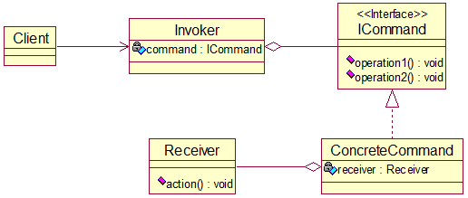

##### 实现

类图：

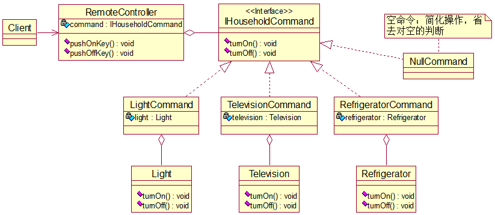

上面这个类图跟老师画的思路不一样，结因本模式听得有点绕，不好理解，待日后进一步学习。

源代码亦省略，可参考eclipse里的相应项目。

##### 小结

命令对象起到命令的请求者和接收者之间的纽带桥梁作用。

容易设计一个命令队列，把命令对象放到命令队列，就可以多线程地执行命令。

容易实现对请求的撤销和重做。

不足：可能导致系统有过多的具体命令类，增加系统的复杂度。

命令模式的经典应用场景：界面的每个按钮都是一条命令、模拟CMD订单的撤销和恢复、触发-反馈机制。

## 访问者模式（Visitor Pattern）

##### 场景

完成一个歌手测评系统：将观众分成男人和女人，当看完一个歌手的表演后，分两拨对同一名歌手进行测评（成功或失败）。

传统方式即继承，从Person类派生出Man和Woman。如果系统比较小，还是不错，但如果系统增加越来越多的功能，对代码改动比较大，就违反OCP，不好维护。另外，扩展性不好，比如增加新的人员类型或管理方法都不好弄。

##### 基本介绍

概念：封装一些作用于某些数据结构的各元素的操作，它可以在不改变数据结构的前提下定义作用于这些元素的新操作。

主要将数据结构和数据操作分离，解决数据结构和数据操作的耦合性问题。

基本工作原理：在被访问的类里面加一个对外提供接待访问者的接口。

原理类图：

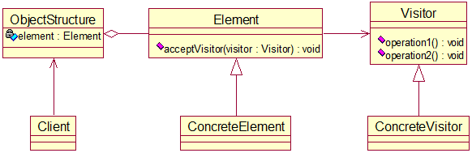

##### 实现

类图：

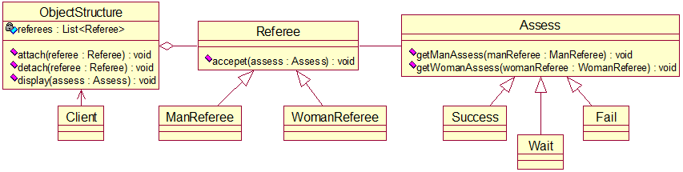

源代码省略，参考eclipse里的相应项目。

思索：能不能把Assess类中的两个方法合并为一个，并去掉该方法的参数，即取消双关联？原样式的优点在哪儿呢？

##### 双分派

是指不管类怎么变化，我们都能找到期望的方法运行。（迷之解释）

意味着得到执行的操作取决于请求的种类和两个接收者的类型。

##### 小结

优点：符合单一职责原则，扩展性好、灵活性高。适合数据结构相对稳定的系统。

缺点：访问者关注了其他类的内部细节，违反了迪米特法则；违背依赖倒转原则，使用了具体元素，而不是使用抽象元素。

## 迭代器模式（Iterator Pattern）

##### 场景

为[组合模式](#组合模式（Composite Pattern）)中的三级机构创建统一的遍历操作。

##### 基本介绍

如果我们的集合元素是用不同方式实现的，如数组、集合或其他方式，那么遍历这些集合元素就得靠不同的遍历方式，且会暴露其内部结构。由此引出更好的办法-迭代器模式。

原理类图：

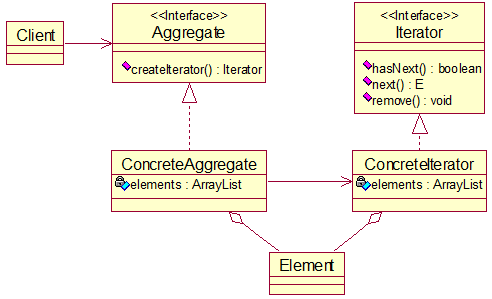

图例：

- Iterator：系统提供的迭代器接口，其三个方法也是内置的。
- ConcreteIterator：具体的迭代器，管理迭代。
- Aggregate：一个统一的聚合接口，将客户端和具体聚合解耦，提供一个返回迭代器的方法。
- ConcreteAggregate：具体的聚合，持有对象集合。
- Client：通过Aggregate接口和Iterator接口依赖两者的具体实现类。

##### 实现

类图：


源代码：

```java
package iterator;

/**
 * 专业类
 * 
 * @author Van
 */
public class Department {
	// 专业名
	private String name;

	public Department(String name) {
		this.name = name;
	}

	public String getDepartmentName() {
		return name;
	}
}
```

```java
package iterator;

import java.util.Iterator;

/**
 * 计算机学院迭代器
 * 
 * @author Van
 */
public class ComputerCollegeIterator implements Iterator<Department> {

	// 下属专业（由外部指定）
	private Department[] departments;
	// 遍历到的当前下标
	private int position = -1;

	public ComputerCollegeIterator(Department[] departments) {
		this.departments = departments;
	}

	@Override
	public boolean hasNext() {
		// 下一个下标越界或下一个元素引用null
		if (position + 1 >= departments.length || departments[position + 1] == null)
			return false;
		// 后移1位
		position++;
		return true;
	}

	@Override
	public Department next() {
		// 取当前元素
		return departments[position];
	}

}
```

```java
package iterator;

import java.util.Iterator;
import java.util.List;

/**
 * 文学院迭代器
 * 
 * @author Van
 */
public class LiteratureCollegeIterator implements Iterator<Department> {

	// 下属专业（由外部指定）
	private List<Department> departments;
	// 遍历到的当前索引
	private int index = -1;

	public LiteratureCollegeIterator(List<Department> departments) {
		this.departments = departments;
	}

	@Override
	public boolean hasNext() {
		if (index + 1 >= departments.size())
			return false;
		// 后移1位
		index++;
		return true;
	}

	@Override
	public Department next() {
		// 取当前元素
		return departments.get(index);
	}

}
```

```java
package iterator;

import java.util.Iterator;

/**
 * 学院接口
 * 
 * @author Van
 */
public interface College {
	/**
	 * 返回学院名
	 * 
	 * @return
	 */
	String getCollegeName();

	/**
	 * 增加一个专业
	 * 
	 * @param name 专业名
	 */
	void addDepartment(String name);

	/**
	 * 返回一个作用于当前学院的迭代器
	 * 
	 * @return
	 */
	Iterator<Department> createIterator();
}
```

```java
package iterator;

import java.util.Iterator;

/**
 * 计算机学院实现类
 * 
 * @author Van
 */
public class ComputerCollege implements College {

	// 学院名
	private String name = "计算机学院";
	// 下属专业
	private Department[] departments;
	// 数组当前对象总数
	private int departmentCount = 0;

	/**
	 * 在内部填好专业数组
	 */
	public ComputerCollege() {
		this.departments = new Department[10];
		departments[0] = new Department("数字媒体技术");
		departments[1] = new Department("软件工程");
		departments[2] = new Department("网络工程");
		departments[3] = new Department("计算机科学与技术");
		departments[4] = new Department("大数据");
	}

	@Override
	public String getCollegeName() {
		return name;
	}

	@Override
	public void addDepartment(String name) {
		// 装填当前元素
		departments[departmentCount] = new Department(name);
		// 预装填下一元素
		departmentCount++;
	}

	@Override
	public Iterator<Department> createIterator() {
		// 传入专业数组，返回作用其上的迭代器
		return new ComputerCollegeIterator(departments);
	}
}
```

```java
package iterator;

import java.util.ArrayList;
import java.util.Iterator;
import java.util.List;

/**
 * 文学院实现类
 * 
 * @author Van
 */
public class LiteratureCollege implements College {

	// 学院名
	private String name = "文学院";
	// 下属专业
	private List<Department> departments = new ArrayList<Department>();

	/**
	 * 内部填好专业列表
	 */
	public LiteratureCollege() {
		departments.add(new Department("中国文学系"));
		departments.add(new Department("外国文学系"));
		departments.add(new Department("甲骨文研究所"));
	}

	@Override
	public String getCollegeName() {
		return name;
	}

	@Override
	public void addDepartment(String name) {
		departments.add(new Department(name));
	}

	@Override
	public Iterator<Department> createIterator() {
		// 传入专业列表，返回作用其上的迭代器
		return new LiteratureCollegeIterator(departments);
	}

}
```

```java
package iterator;

import java.util.Iterator;
import java.util.List;

/**
 * 输出实现类，打印遍历结果
 * 
 * @author Van
 */
public class OutPutImpl {
	// 学院列表
	private List<College> colleges;

	/**
	 * 从外部传入学院列表
	 * 
	 * @param colleges 学院列表
	 */
	public OutPutImpl(List<College> colleges) {
		this.colleges = colleges;
	}

	/**
	 * 遍历打印所有学院，包括遍历打印各学院下属所有专业
	 */
	public void printColleges() {
		// 得到列表自带的迭代器
		Iterator<College> collegeIterator = colleges.iterator();
		while (collegeIterator.hasNext()) {
			College college = collegeIterator.next();
			System.out.println(college.getCollegeName());
			// 得到自制的学院迭代器，遍历其下所有专业
			Iterator<Department> departmentIterator = college.createIterator();
			printDepartments(departmentIterator);
		}
	}

	/**
	 * 遍历打印某学院下属所有专业
	 * 
	 * @param departmentIterator 作用于该学院的迭代器
	 */
	public void printDepartments(Iterator<Department> departmentIterator) {
		while (departmentIterator.hasNext())
			System.out.println("\t" + departmentIterator.next().getDepartmentName());
	}
}
```

```java
package iterator;

import java.util.ArrayList;
import java.util.List;

import org.junit.jupiter.api.Test;

/**
 * 测试类
 * 
 * @author Van
 */
class ClientTest {

	@Test
	void testMyIterator() {
		List<College> colleges = new ArrayList<College>();
		colleges.add(new ComputerCollege());
		colleges.add(new LiteratureCollege());
		OutPutImpl outPutImpl = new OutPutImpl(colleges);
		outPutImpl.printColleges();
	}

}
```

##### 小结

优点：隐藏聚合的内部结构；把管理对象集合和遍历对象集合的责任分开，互不干扰；适合遍历一组相似对象。

缺点：每个聚合对象都需要一个迭代器，类一多便不好管理。

## 观察者模式

### 案例

天气预报项目需求：

- 气象站每天测量温度、湿度、气压等数据并发布出去。
- 第三方平台能从气象站获取数据。
- 测量数据一经更新，气象站要及时知会第三方。

类图：


用setter更新气象站数据。当气象站数据更新，调用measurementsChanged方法及时更新第三方平台的数据，具体调用第三方平台属性的update方法。

为什么不用继承，语法上确实可以，但语义上不合理，第三方平台毕竟不是气象站，不能自己测量得到数据。

缺点：违反了DIP、OCP，增减第三方平台类都会影响Weather类。

### 改进

观察者模式（Observer Pattern）又叫发布订阅模式，常见于JDK源码，亦体现于MVC。

援引《Head First》：

> **The Observer Pattern** defines a one-to-many dependency between objects so that when one object changes state, all of its dependents are notified and updated automatically.

被依赖的对象叫subject（主题对象、发布者），依赖对象叫observer（订阅者、观察者）。

我们依照此思想改进案例的类图：


优点：借助集合组织、管理观察者，能够方便地注册、移除和通知。

## 中介者模式（Mediator Pattern）

##### 场景

场景同[外观模式](#外观模式（Facade Pattern）)，即智能家电项目，控制各个家电协同工作。

传统方式的弊病：

- 当各电器对象的状态发生较大改变，且相互之间调用关系很复杂，那么改起来很麻烦。
- 各个电器对象彼此紧密联系，不满足解耦。
- 各电器对象之间所传递的消息（参数）也很繁杂，改起来很麻烦。
- 当系统新增一个电器对象，很可能对现有的各个行为进行大改，可维护性不理想。

##### 基本介绍

中介者模式用一个中介对象来封装一系列的对象交互，使得各个对象不需要显式地相互引用，从而使其结构松散，而且能独立地改变他们之间的交互。总之使得代码易于维护。

比如在MVC模式中，C即M和V的中介者，控制前后端交互。

原理类图：

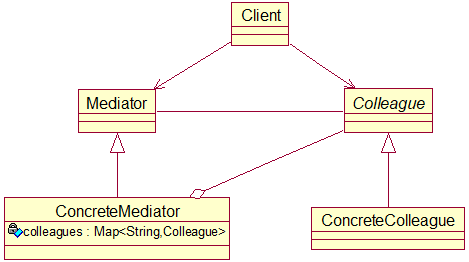

这是个简图，更详细的参见下面的类图。

##### 实现

类图：

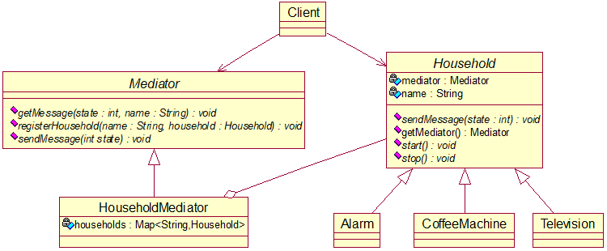

源代码：

```java
package mediator;

/**
 * 中介者抽象类-控制各种家电对象
 * 
 * @author Van
 */
public abstract class Mediator {
	/**
	 * 接收家电对象发来的消息
	 * 
	 * @param state 消息码
	 * @param name  家电名
	 */
	public abstract void getMessage(int state, String name);

	/**
	 * 注册一个家电对象
	 * 
	 * @param name      家电名
	 * @param household 家电对象
	 */
	public abstract void registerHousehold(String name, Household household);

	/**
	 * 发送消息
	 * 
	 * @param state 消息码
	 */
	public abstract void sendMessage(int state);
}
```

```java
package mediator;

/**
 * 智能家电抽象类
 * 
 * @author Van
 */
public abstract class Household {
	// 家电名
	private String name;
	// 依赖的中介者
	private Mediator mediator;

	public Household(String name, Mediator mediator) {
		this.name = name;
		this.mediator = mediator;
	}

	public String getName() {
		return name;
	}

	public Mediator getMediator() {
		return mediator;
	}

	/**
	 * 家电向中介者发送消息
	 * 
	 * @param state 消息码
	 */
	public abstract void sendMessage(int state);

	/**
	 * 开机
	 */
	public abstract void start();

	/**
	 * 关机
	 */
	public abstract void stop();
}
```

```java
package mediator;

import java.util.HashMap;
import java.util.Map;

/**
 * 中介者实现类-家电中介者类
 * 
 * @author Van
 */
public class HouseholdMediator extends Mediator {

	// 管理的家电对象映射
	private Map<String, Household> households;

	public HouseholdMediator() {
		households = new HashMap<String, Household>();
	}

	/**
	 * 核心方法：根据消息码和家电名取家电对象，进而控制该家电的下一步行为
	 */
	@Override
	public void getMessage(int state, String name) {
		if (households.containsKey(name)) {
			Household household = households.get(name);
			if (state == 1)
				household.start();
			else if (state == 0)
				household.stop();
		}
	}

	/**
	 * 注册家电，即将家电加入家电映射
	 */
	@Override
	public void registerHousehold(String name, Household household) {
		if (!households.containsKey(name))
			households.put(name, household);
	}

	@Override
	public void sendMessage(int state) {
		// TODO Auto-generated method stub

	}

}
```

```java
package mediator;

/**
 * 具体家电-时钟类
 * 
 * @author Van
 */
public class Alarm extends Household {

	/**
	 * 初始化时钟对象同时将其注册给中介者
	 * 
	 * @param name     家电名
	 * @param mediator 中介者对象
	 */
	public Alarm(String name, Mediator mediator) {
		super(name, mediator);
		mediator.registerHousehold(name, this);
	}

	@Override
	public void sendMessage(int state) {
		getMediator().getMessage(state, getName());
	}

	@Override
	public void start() {
		System.out.println("启动闹钟");
	}

	@Override
	public void stop() {
		System.out.println("关闭闹钟");
	}

}
```

```java
package mediator;

/**
 * 具体家电-咖啡机类
 * 
 * @author Van
 */
public class CoffeeMachine extends Household {

	/**
	 * 初始化咖啡机对象同时将其注册给中介者
	 * 
	 * @param name     家电名
	 * @param mediator 中介者对象
	 */
	public CoffeeMachine(String name, Mediator mediator) {
		super(name, mediator);
		mediator.registerHousehold(name, this);
	}

	@Override
	public void sendMessage(int state) {
		getMediator().getMessage(state, getName());
	}

	@Override
	public void start() {
		System.out.println("启动咖啡机");
	}

	@Override
	public void stop() {
		System.out.println("关闭咖啡机");
	}

}
```

```java
package mediator;

/**
 * 具体家电-电视机类
 * 
 * @author Van
 */
public class Television extends Household {

	/**
	 * 初始化咖啡机对象同时将其注册给中介者
	 * 
	 * @param name     家电名
	 * @param mediator 中介者对象
	 */
	public Television(String name, Mediator mediator) {
		super(name, mediator);
		mediator.registerHousehold(name, this);
	}

	@Override
	public void sendMessage(int state) {
		getMediator().getMessage(state, getName());
	}

	@Override
	public void start() {
		System.out.println("启动电视机");
	}

	@Override
	public void stop() {
		System.out.println("关闭电视机");
	}

}
```

```java
package mediator;

import org.junit.jupiter.api.Test;

/**
 * 测试类
 * 
 * @author Van
 */
class ClientTest {

	@Test
	void testMeidator() {
		// 创建中介者
		Mediator householdMediator = new HouseholdMediator();
		// 创建诸家电
		Household alarm = new Alarm("时钟", householdMediator);
		Household coffeeMachine = new CoffeeMachine("咖啡机", householdMediator);
		Household television = new Television("电视机", householdMediator);
		// 开工
		alarm.sendMessage(1);
		coffeeMachine.sendMessage(1);
		television.sendMessage(1);
		// 休工
		alarm.sendMessage(0);
		coffeeMachine.sendMessage(0);
		television.sendMessage(0);
	}

}

```

##### 小结

中介者模式的优缺点：

- 减少类间依赖，降低耦合。
- 中介者是系统中枢，作用最大，故一旦它出现问题，则系统就无法起作用。
- 如果设计不当，那么中介者对象本身的结构就很复杂，不利于维护。

## 备忘录模式（Memento Pattern）

##### 场景

场景：游戏角色有攻击力和防御力，某角色在大战boss前备份了自身状态（攻击力和防御力），大战boss后他的攻击力和防御力下降了，现欲恢复其状态。

传统方式是一个游戏对象对应一个备忘录对象，这样不利于管理，开销也大，还通过new关键字暴露了备忘录对象的内部细节。

##### 基本介绍

概念：在不破坏封装性的前提下，捕获一个对象的内部状态，并在对象之外保存此状态，这样一来就可在未来将该对象恢复到此状态。

原理类图：

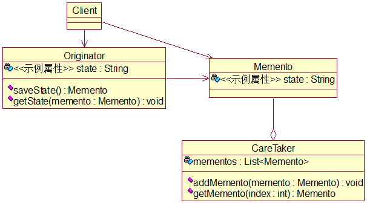

可将CareTaker里的mementos类型改为`Map<String, ArrayList<Memento>>`以存放不同Originator对象的不同状态。相应地，可在Originator中添加name属性以示对象区分。

##### 实现

源代码如下：

```java
package memento;

/**
 * 游戏角色类
 * 
 * @author Van
 */
public class GameRole {
	// 角色名、攻击力、防御力
	private String name;
	private int attackPower;
	private int defendPower;

	public GameRole(String name, int attackPower, int defendPower) {
		this.name = name;
		this.attackPower = attackPower;
		this.defendPower = defendPower;
	}

	public String getName() {
		return name;
	}

	public void setName(String name) {
		this.name = name;
	}

	public int getAttackPower() {
		return attackPower;
	}

	public void setAttackPower(int attackPower) {
		this.attackPower = attackPower;
	}

	public int getDefendPower() {
		return defendPower;
	}

	public void setDefendPower(int defendPower) {
		this.defendPower = defendPower;
	}

	@Override
	public String toString() {
		return "GameRole [name=" + name + ", attackPower=" + attackPower + ", defendPower=" + defendPower + "]";
	}

	/**
	 * 保存状态到新的备忘录
	 * 
	 * @return 备忘录对象
	 */
	public Memento saveState() {
		return new Memento(attackPower, defendPower);
	}

	/**
	 * 通过备忘录恢复到过去的某一状态
	 * 
	 * @param memento 备忘录对象
	 */
	public void getState(Memento memento) {
		attackPower = memento.getAttackPower();
		defendPower = memento.getDefendPower();
	}
}
```

```java
package memento;

/**
 * 备忘录类
 * 
 * @author Van
 */
public class Memento {
	// 攻击力、防御力
	private int attackPower;
	private int defendPower;

	public Memento(int attackPower, int defendPower) {
		this.attackPower = attackPower;
		this.defendPower = defendPower;
	}

	public int getAttackPower() {
		return attackPower;
	}

	public int getDefendPower() {
		return defendPower;
	}
}
```

```java
package memento;

import java.util.ArrayList;
import java.util.HashMap;
import java.util.List;
import java.util.Map;

/**
 * 备忘录的结构与操作类
 * 
 * @author Van
 */
public class CareTaker {
	// 备忘录映射
	private Map<String, ArrayList<Memento>> mementoMap;

	/**
	 * 针对每个角色名创建一个备忘录列表
	 * 
	 * @param names 角色名列表
	 */
	public CareTaker(List<String> names) {
		mementoMap = new HashMap<String, ArrayList<Memento>>();
		for (String name : names) {
			mementoMap.put(name, new ArrayList<Memento>());
		}
	}

	/**
	 * 向某角色的备忘录列表中添加新备忘录
	 * 
	 * @param name    角色名
	 * @param memento 备忘录对象
	 */
	public void addMemento(String name, Memento memento) {
		List<Memento> mementos = mementoMap.get(name);
		mementos.add(memento);
	}

	/**
	 * 得到某角色某一时刻的备忘录
	 * 
	 * @param name  角色名
	 * @param index 备忘录号
	 * @return
	 */
	public Memento getMemento(String name, int index) {
		return mementoMap.get(name).get(index);
	}
}
```

```java
package memento;

import java.util.ArrayList;
import java.util.List;

import org.junit.jupiter.api.Test;

/**
 * 测试类
 * 
 * @author Van
 */
class ClientTest {

	@Test
	void testMemento() {
		// 创造两种角色
		GameRole role1 = new GameRole("关公", 200, 100);
		GameRole role2 = new GameRole("秦琼", 200, 200);
		System.out.println("======原始状态======");
		System.out.println(role1);
		System.out.println(role2);
		// 存储原始状态
		List<String> names = new ArrayList<String>();
		names.add(role1.getName());
		names.add(role2.getName());
		CareTaker careTaker = new CareTaker(names);
		careTaker.addMemento(role1.getName(), role1.saveState());
		careTaker.addMemento(role2.getName(), role2.saveState());
		// 俩哥们大战boss，导致状态改变
		role1.setAttackPower(100);
		role1.setDefendPower(50);
		role2.setAttackPower(80);
		role2.setDefendPower(100);
		System.out.println("======大战boss后的状态======");
		System.out.println(role1);
		System.out.println(role2);
		// 俩哥们恢复状态
		role1.getState(careTaker.getMemento(role1.getName(), 0));
		role2.getState(careTaker.getMemento(role2.getName(), 0));
		System.out.println("======恢复状态======");
		System.out.println(role1);
		System.out.println(role2);
	}

}
```

##### 小结

给用户提供一个恢复状态的机制。

实现了状态的封装，使用户不必了解机制的实现细节。

若类的成员变量过多，则每次备忘都会占用很多内存。

应用场景：存档、撤销、数据库的事务管理等等。

为了节省内存，可将备忘录模式和原型模式搭配使用。

## 解释器模式（Interpreter Pattern）

##### 基本介绍

原理类图：

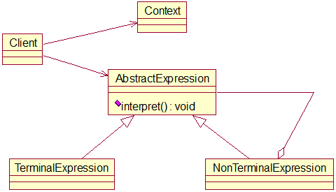

说明：

- Context：环境角色，含有解释器之外的全局信息。
- AbstractExpression：抽象表达式，声明抽象的解释操作，其中方法为抽象方法树上的所有结点共享。
- TerminalExpression：终结符表达式，实现与文法中的终结符相关的解释操作。
- NonTerminalExpression：非终结表达式，实现与文法中的非终结符相关的解释操作。
- Client：输入Context和TerminalExpression的信息。

##### 实现

利用解释器模式实现四则运算，如a+b-c。

类图：

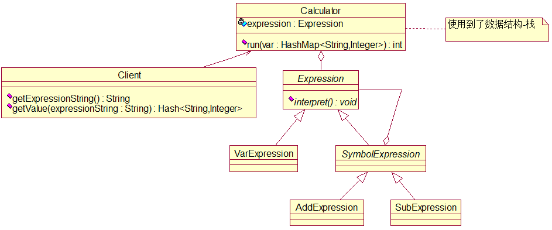

##### 小结

应用场景：编译器、运算表达式、正则表达式、机器人。

问题：此模式可能会引起类膨胀。另外，采用递归调用的方法会导致调试非常复杂，还降低运行效率。

## 状态模式（State Pattern）

##### 基本介绍

状态模式主要解决对象在多种状态之间转换时，需要对外输出不同行为的问题。状态和行为是一一对应的，状态之间相互转换。当一个对象的内在状态改变时，允许改变其行为。

原理类图：

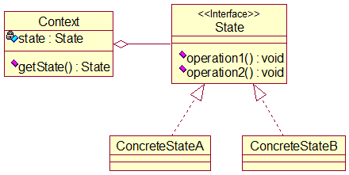

##### 实现

用此模式实现一个APP抽奖活动。

该活动的状态图如下：

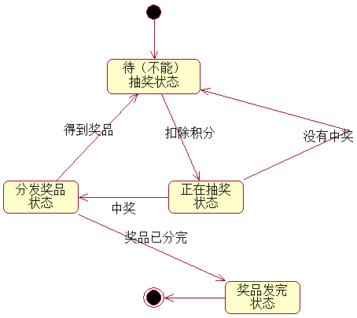

类图：

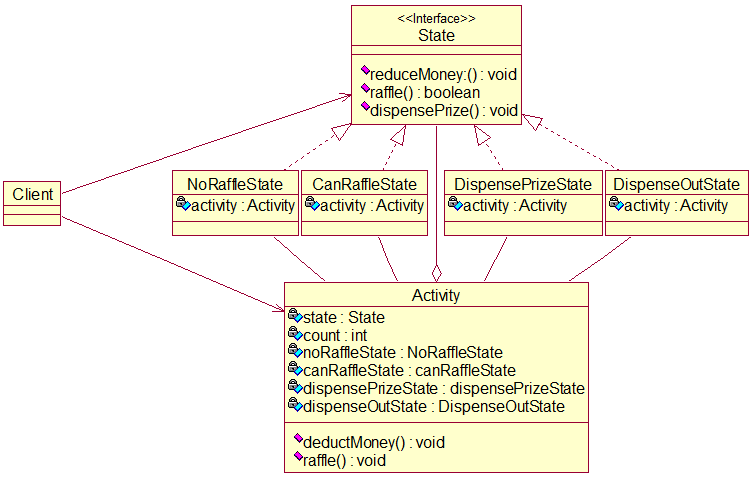


其中，最后一个状态类DispenseOutState看起来很尴尬，因为在奖品送完的情况我还是扣除了积分。另外，图中最亮眼的就是Activity和四个实现类的互关联，注意理解运行逻辑。

源代码：

```java
package state;

/**
 * 状态接口
 * 
 * @author Van
 */
public interface State {
	/**
	 * 扣除积分，准备抽奖
	 */
	void reduceMoney();

	/**
	 * 能否抽奖
	 * 
	 * @return true：能；false：否
	 */
	boolean raffle();

	/**
	 * 抽完奖且中奖，分发奖品
	 */
	void dispensePrize();
}
```

```java
package state;

/**
 * 不能抽奖的状态类
 * 
 * @author Van
 */
public class NoRaffleState implements State {

	// 抽奖活动对象
	private Activity activity;

	public NoRaffleState(Activity activity) {
		this.activity = activity;
	}

	@Override
	public void reduceMoney() {
		// 当前状态可扣积分
		System.out.println("【不能抽奖状态】正在扣除积分");
		activity.setState(activity.getCanRaffleState());
	}

	@Override
	public boolean raffle() {
		// 当前状态不能抽奖
		System.out.println("【不能抽奖状态】扣除积分后才能抽奖");
		return false;
	}

	@Override
	public void dispensePrize() {
		// 当前状态不能发放奖品
		System.out.println("【不能抽奖状态】抽了奖后才能进一步看结果，以决定是否发放奖品");
	}

}
```

```java
package state;

import java.util.Random;

/**
 * 可抽奖状态类
 * 
 * @author Van
 */
public class CanRaffleState implements State {

	// 抽奖活动对象
	private Activity activity;

	public CanRaffleState(Activity activity) {
		this.activity = activity;
	}

	@Override
	public void reduceMoney() {
		// 当前状态无需再扣除积分
		System.out.println("【已在抽奖状态】已扣除积分");
	}

	@Override
	public boolean raffle() {
		// 当前状态可抽奖，10%的中奖概率
		System.out.println("【已在抽奖状态】正在抽奖");
		// 利用随机数模拟抽奖
		Random random = new Random();
		int number = random.nextInt(10);
		if (number == 0) {
			System.out.println("恭喜您中奖了！");
			// 转到分发奖品状态
			activity.setState(activity.getDispensePrizeState());
			return true;
		} else {
			System.out.println("很遗憾，您没有中奖");
			// 转到不抽奖状态
			activity.setState(activity.getNoRaffleState());
			return false;
		}
	}

	@Override
	public void dispensePrize() {
		// 当前状态不能分发奖品，结果还没出来
		System.out.println("【已在抽奖状态】尚不能分发奖品，待结果出来才能分发奖品");
	}

}
```

```java
package state;

/**
 * 分发奖品状态类
 * 
 * @author Van
 */
public class DispensePrizeState implements State {

	// 抽奖活动对象
	private Activity activity;

	public DispensePrizeState(Activity activity) {
		this.activity = activity;
	}

	@Override
	public void reduceMoney() {
		// 当前状态无需再扣除积分
		System.out.println("【发放奖品状态】已扣除积分");
	}

	@Override
	public boolean raffle() {
		// 当前状态已过抽奖环节
		System.out.println("【发放奖品状态】已抽过奖");
		return false;
	}

	@Override
	public void dispensePrize() {
		// 当前状态可分发奖品
		int currentCount = activity.getCount();// 当前奖品数
		if (currentCount > 0) {
			System.out.println("正在为您发放奖品，您得到的是第" + currentCount + "个奖品");
			// 转到不抽奖状态
			activity.setState(activity.getNoRaffleState());
		} else {
			System.out.println("很遗憾，您来迟一步，奖品已发完");
			// 转到奖品发完状态
			activity.setState(activity.getDispenseOutState());
		}
	}

}
```

```java
package state;

/**
 * 奖品分完状态类，标志活动完全结束
 * 
 * @author Van
 */
public class DispenseOutState implements State {

	// 抽奖活动对象
	private Activity activity;

	public DispenseOutState(Activity activity) {
		this.activity = activity;
	}

	@Override
	public void reduceMoney() {
		// 当前状态不允许扣除积分
		System.out.println("【奖品发完状态】活动已结束，请下次再来参加");
	}

	@Override
	public boolean raffle() {
		// 当前状态不允许抽奖
		System.out.println("【奖品发完状态】活动已结束，请下次再来参加");
		return false;
	}

	@Override
	public void dispensePrize() {
		// 当前状态不允许分发奖品
		System.out.println("【奖品发完状态】活动已结束，请下次再来参加");
	}

	public Activity getActivity() {
		return activity;
	}

}
```

```java
package state;

/**
 * 抽奖活动类
 * 
 * @author Van
 */
public class Activity {
	// 抽奖活动的当前状态
	private State state;
	// 奖品数量
	private int count = 0;
	// 组合抽奖活动的四种状态
	private NoRaffleState noRaffleState = new NoRaffleState(this);
	private CanRaffleState canRaffleState = new CanRaffleState(this);
	private DispensePrizeState dispensePrizeState = new DispensePrizeState(this);
	private DispenseOutState dispenseOutState = new DispenseOutState(this);

	public Activity(int count) {
		// 初始是不能抽奖状态
		this.state = getNoRaffleState();
		this.count = count;
	}

	public void setState(State state) {
		this.state = state;
	}

	public int getCount() {
		// 先返回当前奖品数，再将其减1
		return count--;
	}

	public NoRaffleState getNoRaffleState() {
		return noRaffleState;
	}

	public CanRaffleState getCanRaffleState() {
		return canRaffleState;
	}

	public DispensePrizeState getDispensePrizeState() {
		return dispensePrizeState;
	}

	public DispenseOutState getDispenseOutState() {
		return dispenseOutState;
	}

	/**
	 * 调用当前状态的reduceMoney方法
	 */
	public void deductMoney() {
		state.reduceMoney();
	}

	/**
	 * 若当前状态的raffle方法为真，则调用当前状态的dispensePrize方法
	 * 
	 * @return
	 */
	public void raffle() {
		if (state.raffle())
			state.dispensePrize();
	}

}
```

```java
package state;

import org.junit.jupiter.api.Test;

/**
 * 测试类
 * 
 * @author Van
 */
class ClientTest {

	@Test
	void testState() {
		// 创建抽奖活动对象，指定初始奖品数为1
		Activity activity = new Activity(10);
		// 连续抽300次
		for (int i = 0; i < 300; i++) {
			System.out.println("======第" + (i + 1) + "次抽奖======");
			// 先扣除积分，再抽奖
			activity.deductMoney();
			activity.raffle();
		}
	}

}
```

##### 小结

代码有很强的可读性，状态模式将每一个状态所能做的特定性为封装到对应的状态类中，而其中其他实现接口的方法就形同虚设。

方便维护，状态模式各不同行为分插到不同类中，若揉在一个类中，用if-else语句来整合则很容易出错，也不好理解。

符合OCP，容易增删状态。

如果状态很多，则对应的类也很多，这加大了维护难度。

## 策略模式

### 案例

描述一个抽象的鸭子和诸多具体的鸭子

类图：

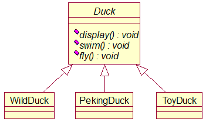

缺陷：有的子类从父类继承得到不合理的方法，如北京烤鸭飞。超类的局部改动，可能会带来溢出问题。为了解决这一问题，我们会用覆盖的方式，让北京烤鸭类重写fly方法。而如果子类覆盖大部分父类方法，就违反里氏替换原则，导致无意义继承。由此，引出更好的方案-策略模式。

### 改进

所谓策略，就是算法族。策略模式（strategy pattern）就是定义算法族并将它们封装起来并让它们能够相互替换，从而使得算法独立于使用算法的客户。

好处：把变化的代码从不变的代码中分离出来；针对接口编程；多用组合或聚合，而不用继承。

类图：

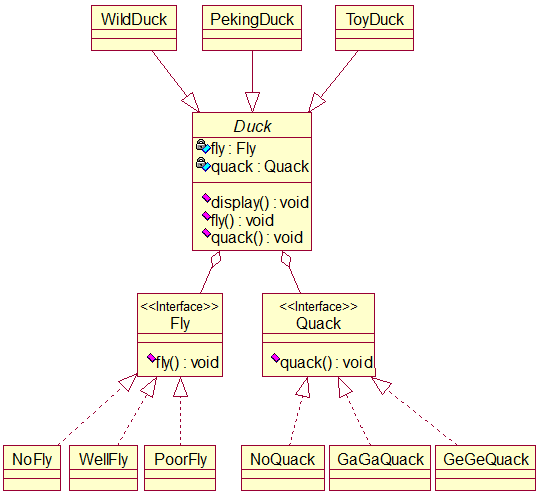

本模式的关键：分析出项目中的可变部分和不可变部分。

本模式核心思想：多用组合或聚合，少用继承。用行为类的组合，而非行为类的继承。

体现了OCP，尤见于行为的添加与修改。

每添加一个策略（行为）就要增加一个行为类，策略过多就导致类爆炸。

## 职责链模式（Chain of Responsibility Pattern）

##### 场景

学校OA系统的采购审批项目需求如下：

- 采购员采购教学器材。
- 若金额<=5000，则由教学主任（dean）审批。
- 若5000<金额<=10000，则由院长（principal）审批。
- 若10000<金额<30000，则由副校长（vice principal）审批。
- 若金额>30000，则有校党委书记（secretary）审批。

传统方式即接收到一个采购请求后，根据金额使用对应的审批人对象进行审批。而起核心作用的分支结构就存在着强耦合关系，不利于代码的扩展和维护。由此引出职责链模式。

##### 基本介绍

职责链模式又叫责任链模式，它为某个请求创造一个接收者对象链，对请求者和接收者进行解耦。那么这个链就体现在每个接收者都包含另一个接收者的引用，当前接收者若不能处理这一请求，则将其传递给下一个接收者，以此类推。

原理类图：

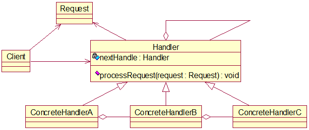

##### 实现

类图：

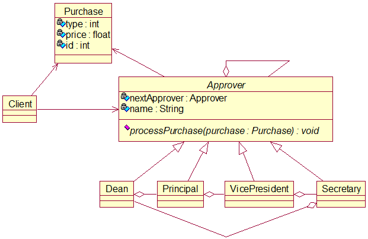

源代码：

```java
package chainOfResponsibility;

/**
 * 采购类
 * 
 * @author Van
 */
public class Purchase {
	// 类型、金额、编号
	private int type = 0;
	private float price = 0.0f;
	private int id = 0;

	public Purchase(int type, float price, int id) {
		this.type = type;
		this.price = price;
		this.id = id;
	}

	public int getType() {
		return type;
	}

	public float getPrice() {
		return price;
	}

	public int getId() {
		return id;
	}
}
```

```java
package chainOfResponsibility;

/**
 * 审批者类
 * 
 * @author Van
 */
public abstract class Approver {
	// 上一级或第一级审批者
	private Approver nextApprover;
	// 审批者名
	private String name;

	public Approver getNextApprover() {
		return nextApprover;
	}

	public void setNextApprover(Approver nextApprover) {
		this.nextApprover = nextApprover;
	}

	public String getName() {
		return name;
	}

	public void setName(String name) {
		this.name = name;
	}

	/**
	 * 处理采购
	 */
	public abstract void processPurchase(Purchase purchase);
}
```

```java
package chainOfResponsibility;

/**
 * 系主任类
 * 
 * @author Van
 */
public class Dean extends Approver {

	public Dean() {
		setName("系主任");
	}

	@Override
	public void processPurchase(Purchase purchase) {
		if (purchase.getPrice() <= 5000)
			System.out.println(getName() + "审批，请求编号为：" + purchase.getId());
		else {
			System.out.println(getName() + "不能审批，上交给上一级");
			getNextApprover().processPurchase(purchase);
		}
	}
}
```

```java
package chainOfResponsibility;

/**
 * 院长类
 * 
 * @author Van
 */
public class Principal extends Approver {

	public Principal() {
		setName("院长");
	}

	@Override
	public void processPurchase(Purchase purchase) {
		if (purchase.getPrice() > 5000 && purchase.getPrice() <= 10000)
			System.out.println(getName() + "审批，请求编号为：" + purchase.getId());
		else {
			System.out.println(getName() + "不能审批，上交给上一级");
			getNextApprover().processPurchase(purchase);
		}
	}

}
```

```java
package chainOfResponsibility;

/**
 * 副校长类
 * 
 * @author Van
 */
public class VicePresident extends Approver {

	public VicePresident() {
		setName("副校长");
	}

	@Override
	public void processPurchase(Purchase purchase) {
		if (purchase.getPrice() > 10000 && purchase.getPrice() <= 30000)
			System.out.println(getName() + "审批，请求编号为：" + purchase.getId());
		else {
			System.out.println(getName() + "不能审批，上交给上一级");
			getNextApprover().processPurchase(purchase);
		}
	}

}
```

```java
package chainOfResponsibility;

/**
 * 党委书记类
 * 
 * @author Van
 */
public class Secretary extends Approver {

	public Secretary() {
		setName("党委书记");
	}

	@Override
	public void processPurchase(Purchase purchase) {
		if (purchase.getPrice() > 30000)
			System.out.println(getName() + "审批，请求编号为：" + purchase.getId());
		else {
			System.out.println(getName() + "不能审批，回到第一级");
			getNextApprover().processPurchase(purchase);
		}
	}

}
```

```java
package chainOfResponsibility;

import org.junit.jupiter.api.Test;

/**
 * 测试类
 * 
 * @author Van
 */
class ClientTest {

	@Test
	void testApproval() {
		// 采购对象
		Purchase purchase = new Purchase(0, 5000.0f, 20);
		// 各级审批者对象
		Approver dean = new Dean();
		Approver principal = new Principal();
		Approver vicePresident = new VicePresident();
		Approver secretary = new Secretary();
		// 指定上一级或第一级（闭合）
		dean.setNextApprover(principal);
		principal.setNextApprover(vicePresident);
		vicePresident.setNextApprover(secretary);
		secretary.setNextApprover(dean);
		// 由于是闭合链，故从任意一级开始，都能找到最合适的审批者
		secretary.processPurchase(purchase);
	}

}
```

##### 小结

实现请求和处理的解耦，提高系统的灵活度。

在链很长的时候，性能会受到影响。一般会在Handler中设置一个结点阈值，避免超长链破坏系统性能。

调试不方便，调试时逻辑可能比较复杂。